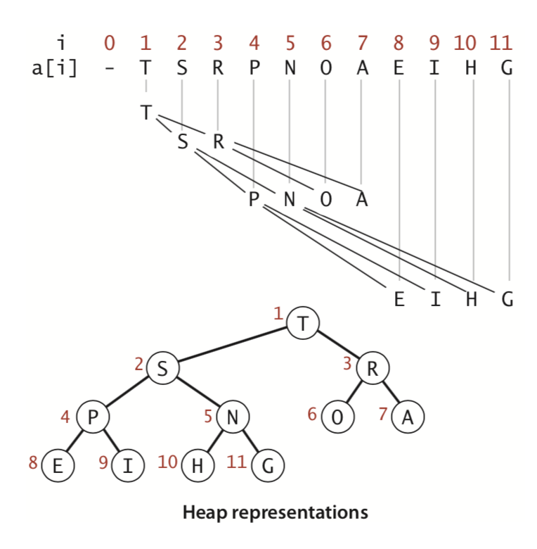

# 堆（Heap）

堆是一种树形数据结构，同时满足堆的性质（heap property)。在最大堆中，任意子节点的值小于等于其父节点的值，堆的根节点（root）是所有节点中最大的；在最小堆中，任意子节点的值大于等于父节点的值，对的根节点值是所有节点中最小的。

堆中每个父节点最多包含个子节点数记做$d$，且堆中除去最底层节点外，其余节点形成一个满$d$叉树，最常见的实现是二叉堆($d = 2$）。

## 二叉堆（Binary Heap）

### 数组表示

最常见的是使用包含哨兵元素的数组和一个记录堆元素个数的变量`heapSize`来实现二叉堆。



使用数组实现最大二叉堆时，通常将下标0对应的元素作为哨兵设置为空，这样堆中节点下标和数组下标一致。根据二叉树的性质，父子节点下标的计算关系如下：

$$
leftChild = 2 \times parent \\
rightChild = 2 \times parent + 1 \\
parent = \left\lfloor child / 2 \right\rfloor
$$

将数组下标0作为哨兵在某些应用中还有额外的作用(TODO:)

如果数组下标0元素不作为哨兵元素，那么堆中第$i$个节点对应数组下标是$i - 1$（alg4 2.4.10）。用数组下标表示的父子节点下标的关系如下：

$$
leftChild = 2 \times (parent + 1) - 1 = 2 \times parent + 1\\
rightChild = 2 \times parent + 2 \\
parent = \left\lfloor \frac{child - 1 }{2} \right\rfloor (从parent取值范围反向推导)
$$

父子节点的计算操作使用移位运算在一条指令内就可以完成，通常使用宏或者内联的方式实现。

堆中节点的**高度**定义为节点一路向下直到叶子节点的简单路径中经过边的数量，叶子节点的高度为0，堆的高度是根节点的高度。

> Viewing a heap as a tree, we define the height of a node in a heap to be the number of edges on the longest simple downward path from the node to a leaf, and we define the height of the heap to be the height of its root.

高度为$h$的二叉堆中的元素个数在$[2^{h}, 2^{h + 1} - 1]$之间，因此$n$个元素的堆高度为$h \le \log_{2}n \lt h+1，h = \left \lfloor \lg n \right \rfloor$，

在线性时间内可以检测一个数组是否形成有序二叉堆（algs4 2.4.15），只需要检测每个子节点父节点对之间是否保持最大堆性质即可，其中堆顶节点没有父节点无需检测，另外也可以用递归的方式实现。降序排列的数组本身是一个最大二叉堆（algs4 2.4.4）。

TODO:
1. algs4 2.4.7 最大元素在位置1，第2大元素在位置2或者3，分析第k大元素所有可能的位置
1. algs4 2.4.8 最小元素在最低一层节点上，分析第k小元素所有可能的位置，如果堆中元素都不相同，那么最小元素位于叶子节点上，
1. algs4 2.4.9 给出一组值，输出所有可能的堆情况

最大堆中节点$K$为例，大于等于它的节点是$K$到根节点路径上的节点共$\left \lfloor \lg K \right \rfloor$个，小于等于它的节点是其所有子孙节点。

### 操作

以最大堆为例，堆中常见的操作如下：

| 操作 | 说明 | 时间复杂度 |
| :- | :- | :- |
| max| 查看最大元素 | $O(1)$ |
| deleteMax | 删除并返回最大元素 | $O(log N)$ |
| delete | 删除并返回任意位置元素 | $O(log N)$ |
| swim | 上浮 | $O(log N)$ |
| sink | 下沉 | $O(log N)$ |
| insert | 插入新元素 | $O(log N)$ |

最大堆的根节点就是最大元素，`max`在操作常量时间内完成。`deleteMax`需要先删除最大元素（通过将根节点和最后一个节点互换，然后将`heapSize`减`1`实现），然后通过`sink`操作将新的根节点下沉到合适位置，维护最大堆的性质。`delete`操作（CLRS 6.5-8）与`deleteMax`类似，只不过删除的是指定位置的元素。`insert`操作通过将堆的`heapSize`加`1`把新元素插入到堆元素最后，然后将新插入的元素通过上浮操作放到合适位置维护最大堆的性质。

#### 下沉

节点的下沉操作通过将节点不断与左右子节点比较，如果节点小于任意一个子节点那么需要与最大子节点进行交换维护最大堆的性质。重复这个过程直到节点大于等于所有子节点或者没有已经没有任何子节点。

```java
class MaxHeap {
    public void fastSink(int index) {
        validateHeapIndex(index);

        int current = index;
        while (left(current) <= heapSize) {
            int largest = current;

            if (less(largest, left(current))) {
                largest = left(current);
            }

            if (right(current) <= heapSize && less(largest, right(current))) {
                largest = right(current);
            }

            if (largest == current) {
                break;
            }

            swap(heap, current, largest);
            current = largest;
        }
    }
}
```

还可以使用递归的形式实现。

#### 上浮

上浮操作每次将当前节点与父节点做比较，如果父节点小于当前节点需要将二者交换以维持最大堆的性质。向上重复这个过程直到父节点不小于当前节点或者已经达到根节点。

```java
public class MaxHeap {
    public void swim(int index) {
        validateHeapIndex(index);

        int current = index;
        int parent = parent(index);
        while (current > 1 && less(parent, current)) {
            swap(heap, current, parent);
            current = parent;
        }
    }
}
```

上浮操作$c$对元素的swap操作共包含$3c$次赋值操作，采用与插入排序内循环一样的方法（CLRS 6.5-6），不是每对元素都进行互换而是将元素整体向上平移，可以只花费$c$次赋值操作。

### 建堆

使用上浮操作建堆，只有1个元素的堆已经有序，从大小为2的堆开始到n结束，依次将新元素加入堆中，然后将新元素上浮到合适位置，维持最大堆的性质，总体时间复杂度是$O(NlogN)$。

使用下沉操作建堆，时间复杂度可以达到线性时间$O(N)$。元素$\left\lfloor N/2 \right\rfloor+1 \rightarrow N$是堆中的叶子节点，可以认为是已经有序的子堆。对于元素$\left\lfloor N/2 \right\rfloor \rightarrow 1$来说，进行下沉操作可以将节点所在的子堆排好序。在循环过程中所以已处理节点的子堆都是有序的最大二叉堆，这个循环不变量会保持到循环结束，此时整个堆是有序的。相比于上浮操作建堆处理了所有$N$个元素，下沉操作建堆只处理了一半的元素，时间复杂度降低到了线性时间$O(N)$。

#### min（algs4 2.4.27）

使用额外一个变量记录对的最小值，并在堆更新的过程中更新最小值，时间空间复杂度都是$O(1)$。

### fast insert

TODO:
1. algs4 2.4.31 use two heaps
1. 下界algs4 2.4.32

### 最大堆最小堆转换

最大堆和最小堆的唯一差别在于元素排序的不同，因此实现时通常只需要实现其中一个即可，通过接受`comparator`参数来改变元素的比较顺序，从而可将最大堆转换为最小堆。最大堆实现时默认`comparator`参数为`Comparator.naturalOrder()`，对于`Comparable`的元素可以按照`Comparable`接口的实现默认排序，最大堆根元素是最大元素。如果将`comparator`设置为`Comparator.reverseOrder()`（逆序），元素按照`Comparable`接口逆序排序，最大堆根元素是最小元素。此外可以使用其他`comparator`定制排序方法。

### 堆排序

堆排序将任意数组进行原地排序，首先根据数组建立最大堆，然后将堆中最大元素与数组尾部元素交换，这样就将最大元素排到了正确位置，然后将堆大小减一，将新的根节点下沉到合适位置。不断重复这个过程即可在$O(NlogN)$的时间内完成排序。

```java
public MaxHeap {
    public static <T extends Comparable<T>> T[] heapSort(T[] array) {
        final int heapSize = array.length;
        // 堆数组中下标0是哨兵元素
        T[] heap = (T[]) new Comparable[heapSize + 1];
        System.arraycopy(array, 0, heap, 1, heapSize);

        // 自底向上依次进行sink操作建堆
        for (int i = parent(heapSize); i >= 1; i--) {
            sink(heap, i, heapSize);
        }

        // 每次取出最大元素放与堆数组尾部元素互换，堆大小减一后使用sink操作恢复堆的性质
        // 循环直到堆的大小为1，此时数组完成排序
        int N = heapSize;
        while (N > 1) {
            swap(heap, 1, N--);
            sink(heap, 1, N);
        }

        // 返回处理哨兵元素
        System.arraycopy(heap, 1, array, 0, heapSize);
        return array;
    }
}
```

堆排序有一个问题在于不是从前到后依次访问数组元素，而是连续访问堆头尾元素，因此缓存命中率（cache hit）比较低。

TODO:
1. floyd 方法 ？ algs4 p208 2.4.5.3

http://jbsortie.blogspot.com/2009/06/heapsort-floyds-trick-part-1-sorting.html

### 合并二叉堆

$O(N)$

### 二叉树实现二叉堆（TODO: algs4 2.4.24）

上述代码如果不使用哨兵元素的话可以直接在目标数组`array`进行就地排序（in-place）。

## 优先队列

| 数据结构 | 插入元素 | 删除最大元素 | 查看最大元素 |
| :------- | :------- | :----------- | :----------- |
| 无序数组 | 1        | N            | N            |
| 有序数组 | N        | 1            | 1            |
| 堆       | log N    | log N        | 1            |
| 不可能   | 1        | 1            | 1            |

根据插入元素、删除最大元素、查看最大元素等操作的具体成本大小，不同数据结果实现的优先队列适用于不同的场景。无序数组适用于大量插入元素操作，少量删除最大元素操作（algs4 2.4.11）场景。堆适用于大量查看最大元素操作、少量插入元素和删除最大元素的场景（algs4 2.4.12）。

### 索引优先队列 algs4 2.4.33

### [最大最小优先队列](http://cglab.ca/~morin/teaching/5408/refs/minmax.pdf)

为相同的元素同时建立一个最大堆和一个最小堆可以实现一个最大最小优先队列，同时支持删除最大元素和最小元素的功能。

TODO:
1. algs4 2.4.29 use two heaps

### 链表实现的优先队列 algs4 2.4.24

## 多叉堆 ([d-ary heap](https://en.wikipedia.org/wiki/D-ary_heap))

`d`叉堆每个节点包括`d`个子节点，包含$n$个节点的堆高度为$\log_d n$，`d`越大堆高度越小，上浮操作更快，下沉操作每层比较找出最大值越慢。

1. 2.4.23
不包含哨兵元素的数组表示中`d`叉堆的父子节点之间的关系如下：

$$
leftChild = 2 \times (parent + 1) - 1 = 2 \times parent + 1\\
rightChild = 2 \times parent + 2 \\
parent = \left\lfloor \frac{child - 1 }{2} \right\rfloor (从parent取值范围反向推导)
$$

在有$m$条边和$n$个顶点的图中Dijkstra最短路径算法和Prim最小生成树算法使用一个最小堆进行$n$次删除最小节点操作和$m$次上浮操作，使用$d = m/n$能够将时间复杂度从二叉堆的$O(m\log n)$降低到$m \log_{m/n} n$。斐波那契堆的理论时间更低$O(m+n\log n)$，但是实际上$d$叉堆由于cache miss更少通常更快。

## 问题与应用

### 多路合并 CLRS 6.5-9

将$k$个有序的链表在$O(n\log k)$时间内合并成一个有序链表。使用一个索引优先队列保存$k$个链表的当前节点，取其中最小的值放入到最终结果列表，然后最小值节点将所在的链表移动到下一个节点，添加入优先队列中。不断重复这个过程可在$O(n\log k)$的时间内合并$k$个有序链表，$n$是总的元素个数。

TODO: leetcode 378 23

### 乘方和对

`a`、`b`是0 ~ 1000内的整数，从小到大输出$a^3 + b^3$所有立方和对。将$(0, 0) \rightarrow (1000, 0)$等放入一个最小优先队列，每次取出最小的值$(a, b)$，因为$a^3+b^3$单调增长，所以下一个最小值是$(a, b+1)$，利用优先队列可以从小到大输出所有立方和对。

`a`、`b`、`c`、`d`是0 ~ 1000内的整数，求解$a^3 + b^3 = c^3 + d^3 (a \ne b且c \ne d)$可能的解。利用上面的思路可以从小到大输出所有立方和对，利用额外一个变量`sum`记录当前的立方和对，不断取出下一个最小的立方和对直到`newSum`值和`sum`不相同，`sum`到`newSum`之间的立方和对值都相同，都是得到的解，然后更新`sum`更新为`newSum`。

leetcode 373

### Top K

在给定的N个元素中寻找最大的K个元素（Top K）。对于N值已确定的情况，可以对元素先进行排序，然后取出最大的K个元素即可，时间复杂度是$O(N\log N)$。但是如果N值事先不确定（例如接收用户输入）或者N值太大导致需要的内存空间非常大（可能无法一次性放入内存空间），排序方法不适用。

使用一个容量为 $K$ 的最小堆，遍历$N$个元素，在队列中元素还不到$K$个的情况下直接将元素插入最小堆；在最小堆包含$K$个元素的情况下，如果元素**大于**最小堆中的最小元素，则用该元素替换最小堆中的最小元素。这样最小堆中包含的元素始终是已处理过的元素中**最大**的$K$个，而且时间复杂度降到了$O(N\log K)$，空间复杂度为$O(K)$。

这种用法将最小堆的最小元素当做一个哨兵元素，最小队中其他元素都大于它，即最小元素是$K$个最大元素中的最小者。类似的使用最大堆可以解决最小的$K$的元素的问题。

在所有元素确定的情况下另，外一种思路是使用一个最大堆，下沉方法可以线性时间内建堆，然后不断取出最大元素$K$次，总的时间复杂度是$O(N + K\log N)$在$K \ll N$时相比上一种方法更快，但是空间复杂度更大是$O(N)$。如果堆不提供下沉建堆而只能使用上浮建堆的话，这种方法时间复杂度更大$O(N\log N + K\log N)$。

另外注意寻找$N$最大的$K$个等价于寻找最小的$N-K$个，解决$(K, N-K)$中较小规模的问题即可。

leetcode top k frequent words 692 trie

### Kth Largest/Smallest

TODO: leetcode Binary Search

719,378,786

TODO: quickselect Kth largest/smallest

### 动态中位数查找（dynamic-median finding algs4 2.4.30）

动态中位数查找问题思路和Top K问题类似，只不过中位数同时需要一个最小堆和一个最大堆，另外用一个变量`median`记录中位数的值。两个堆初始化为空，最大堆的根节点元素值记做`low`，最小堆根节点元素值记做`high`，中位数`median = null`。

主要思想是保持两个堆含有相同个数的元素，最小堆的元素大于等于中位数，最大堆的元素小于等于中位数，`median`在处理了偶数个元素时（此时没有单个中位数）值应该是`null`，在处理了奇数个元素时是所有元素的中位数。对所有元素遍历处理时，始终保持这个循环不变量，最后循环结束时变量`median`就记录了中位数的值。

处理元素值`value`过程中`low`、`median`、`high`的值可能有以下情况。

| `low` (最大堆) | `median`（中位数） | `high`（最大对） | 说明                                                                                                                     |
| :------------- | :----------------- | :--------------- | :----------------------------------------------------------------------------------------------------------------------- |
| `null`         | `null`             | `null`           | 设置`median`为`value`                                                                                                    |
| not null       | `null`             | not null         | 如果`value`小于`low`则将`median`更新为`low`，并将最大堆的根节点`low`删除，更新为`value`；如果`value`大于`high`对称处理。 |
| `null`         | not null           | `null`           | 如果`value`小于`median`，将`value`插入如最大堆，`median`插入最小堆，然后`median`设为`null`;`value`大于`median`时对称处理 |
| not null       | not null           | not null         | 如果`value`小于`median`，`value`插入最大堆，`median`插入最小堆，`median`设为`null`;`value`大于`median`情况对称处理       |

### 离散概率分布的取样

algs4 2.4.35

### Young氏矩阵

CLRS 思考题 6-3

## 二项堆（Binomial Heap）

最小二项树具有最小堆性质（min-heap property），即每个父节点小于等于子节点，所以树的根节点是树中最小节点。递归定义二项树：

1. 0阶二项树包含一个节点
2. k阶二项树有两个k-1阶二项树组成

二项树有如下性质：

1. $k$阶二项树有$2^k$个节点。
2. $0$阶二项树高度为0，两个$k-1$阶二项树合并时高度加1，所以$k$阶二项树高度为$k$。
3. $k$阶二项树中，0层深度包含$\tbinom{k}{0} = 1$个节点（根节点），$i$层深度包含$D(k, i) = D(k - 1, i) + D(k - 1, i - 1) = \tbinom{k-1}{i} + \tbinom{k-1}{i-1}=\tbinom{k}{i}$个节点。
4. $k$阶二项树根节点包含有$\tbinom{k}{1} = k$个子节点。

二项堆有若干个不同阶的二项树组成，并且有如下两个条件。

1. 每个二项树都是最小二项树。
1. $k$阶二项树最多只能有1个。

二项堆的最小节点是所包含的二项树的根节点中最小的。具有$n$个节点的二项堆最多有$\left\lfloor \log n \right\rfloor + 1$个二项树。

## 斐波那契堆

```java
FibonacciHeap {
    TreeNode min;
    int heapSize;
}

TreeNode<E> {
    TreeNode parent;
    TreeNode left;
    TreeNode right;
    TreeNode child;
    E value;
    int degree; // 是子节点的个数
    boolean mark; // 标记节点是否失去过子节点
}
```

在一个n个节点的斐波那契堆中，任何节点的度数都有上界$D(n)$，且$D(n) \le \left\lfloor \log n \right\rfloor$ 思考题19-2d

双向链表操作：

1. 链表节点a后面拼接链表b
2. 链表节点a前面拼接链表b
3. 链表中删除节点a

## 参考

1. https://algs4.cs.princeton.edu/24pq/
