# 树

## 二叉树

### 定义

二叉树的定义如下：

1. 二叉树中的节点最多有两个子节点，左子节点和右子节点。
1. 二叉树根节点键值要大于左子树中所有节点，同时小于右子树中所有节点。
1. 二叉树左子树和右子树也都是二叉树
1. 允许二叉树是空

这个定义是递归的，包含了有序性（左子树小于根节点，根节点小于右子树）和唯一性（树中不存在相同的键）。

二叉树的结点每个结点包含一个可比较的键进行节点之间的排序，定义如下

```java
class Node<Key extends Comparable<Key>, Value> {
  Key key;
  Value value;
  Node left;
  Node right;
  // 次结点代表的子树中结点的总数
  int size;
}
```

TODO: trampoline 一般的将递归调用改造为循环的方法

1. 所有方法的递归与非递归操作 NonRecursive
2. algs 3.2.7
3. algs 3.2.11

### 二叉树的类型

1. 满二叉树（Full Binary Tree）中每个节点有 0 或者 2 个子节点
1. 完全二叉树（Complete Binary Tree）是只有最低层的节点不满，且最低层节点尽可能靠左。这种二叉树能够用数组表示，二叉堆使用的就是完全二叉树。
1. 完美二叉树（Perfect Binary Tree）所有叶节点都在最底层，高度相同。
1. 平衡二叉树（Balanced Binary Tree）中左右子树高度之差最多为 1。
1. 病态二叉树（degenerate or pathological）指每个节点只有一个子节点，二叉树退化成了链表。

### 验证二叉树

LeetCode 98

使用辅助递归函数`isValidBST(TreeNode node, Integer lower, Integer upper)`，其中`lower`和`upper`是检查`node`所在子树中所有节点值的下界和上界

1. 初始情况下上下界均为空，没有限制
1. 当前节点的值应该在上下界范围内`(lower, upper)`，闭区间表示节点值与上下界相同时返回`false`。
1. 递归的情况：左子树的上界由当前节点值代替，下界不变`(lower, node.val)`；右子树的下界由当前节点值替代，上界不变`(node.val, upper)`
1. 当前节点满足界限要求，且左右子树也是二叉树时整个树才是合法的二叉树。

```java
class Solution {
    public boolean isValidBST(TreeNode root) {
        return isValidBST(root, null, null);
    }

    public boolean isValidBST(TreeNode node, Integer lower, Integer upper) {
        if (node == null) { return true; }

        if ((lower != null && node.val <= lower) || (upper != null && node.val >= upper)) {
            return false;
        }

        return isValidBST(node.left, lower, node.val) && isValidBST(node.right, node.val, upper);
    }
}
```

使用栈可以将上述递归实现转化为循环实现，考虑递归调用的函数在执行时就是用栈的方式来运行，`isValidBST`每个递归实际进行判断时有当前节点`node`、节点下边界`lower`和节点上边界`upper`三个变量参与，由当前节点递归到左子树（更新上边界和节点为左子节点）或者右子树（更新下边界和节点为右子节点）。使用三个显式的栈来模拟递归调用栈的运行。

```java
class BinaryTree {
    Stack<Integer> upperBounds = new Stack<>();
    Stack<Integer> lowerBounds = new Stack<>();
    Stack<TreeNode> nodes = new Stack<>();

    public boolean isValidBstIteratively(TreeNode root) {
        pushDownStack(root, null, null);

        while (!nodes.isEmpty()) {
            TreeNode node = nodes.pop();
            Integer lower = lowerBounds.pop();
            Integer upper = upperBounds.pop();

            if (node == null) { continue; }

            if (lower != null && node.val <= lower) { return false; }
            if (upper != null && node.val >= upper) { return false; }

            pushDownStack(node.left, lower, node.val);
            pushDownStack(node.right, node.val, upper);
        }

        return true;
    }

    private void pushDownStack(TreeNode node, Integer lower, Integer upper) {
        nodes.add(node);
        upperBounds.add(upper);
        lowerBounds.add(lower);
    }
}
```

另外可以使用**中序遍历**来验证二叉树是否合法。中序遍历合法二叉树的结果是一个全局升序的序列，出现任何节点大于等于其后续节点的情况说明这个树不是合法二叉树。这种方法把二叉树转换成顺序结构并比较相邻元素的大小来验证全局有序，和检验数组全局有序的方法相同。

下面使用栈实现的中序遍历，并记录前一个节点值与当前节点对比。

```java
public List<Integer> isValidBst(TreeNode root) {
    Stack<TreeNode> stack = new Stack<>();
    TreeNode next = root;
    double prevNodeValue = - Double.MAX_VALUE;

    while (next != null || !stack.isEmpty()) {
        while (next != null) {
            stack.add(next);
            next = next.left;
        }

        TreeNode top = stack.pop();

        // 如果中序遍历中后面的元素小于等前面的元素，二叉树非法
        if (top.value <= prevNodeValue) {
            return false;
        }
        prevNodeValue = top.value;

        next = top.right;
    }

    return true;
}
```

### 相同性

判断两颗树是否相同。

```java
public boolean isSameTree(TreeNode p, TreeNode q) {
    if (p == null && q == null) { return true; }
    if (p == null || q == null) { return false; }

    return p.val == q.val && isSameTree(p.left, q.left) && isSameTree(p.right, q.right);
}
```

### 对称性

判断一个树是否对称。

```java
class Solution {
    public boolean isSymmetric(TreeNode root) {
        if (root == null) { return true; }

        return isMirror(root.left, root.right);
    }

    public boolean isMirror(TreeNode left, TreeNode right) {
        if (left == null && right == null) { return true; }
        if (left == null || right == null) { return false; }

        return left.val == right.val && isMirror(left.left, right.right)
            && isMirror(left.right, right.left);
    }
}
```

遍历解法 TODO
使用队列模拟递归解法的栈结构

### 前驱与后继结点（Predecessor & Successor)

中序遍历中节点$S$的前驱节点是左子树中最大的节点，由于中序遍历全局有序，所以任意节点的前驱节点在升序数列中刚好在该节点之前。

```java
public TreeNode predecessor(TreeNode node) {
    if (node == null || node.left == null) { return null; }

    TreeNode predecessor = node.left;
    while (predecessor.right != null) {
        predecessor = predecessor.right;
    }

    return predecessor;
}
```

中序遍历中节点$P$的后继节点$S$是节点$P$右子树中最小节点，或者右子树不存在时要沿着$P$向上寻找，直到节点$S$是一个左子节点或者$S$的父节点是根节点，此时后继节点$S$不存在。

```java
/**
 * TreeNode中parent指向父节点
*/
public TreeNode successor(TreeNode node) {
    if (node == null) { return null; }

    if (node.right != null) {
        TreeNode successor = node.right;
        while (successor.left != null) {
            successor = successor.left;
        }

        return successor;
    }

    TreeNode current = node;
    while (current.parent != null && current != current.parent.left) {
        current = current.parent;
    }

    return current.parent;
}
```

### 遍历

对树的节点进行**深度优先遍历（Depth First Search）**，根据遍历顺序的不同，常见的有三种方式，

1. 中序遍历（inorder traversal）：左子树 -> 根结点 -> 右子树
1. 前序遍历（preorder traversal）：根结点 -> 左子树 -> 右子树
1. 后序遍历（postorder traversal）：左子树 -> 右子树 -> 根结点

上述三种方式是根据根节点位于中间、前边、后边来定义的，但是**左子树**都是在**右子树**前边。左中右三个部分顺序的排列方式总共有六种，另外还有三种情况是右子树位于左子树前边的形式，可以称为**逆序**。

1. 逆中序遍历（reverse inorder traversal）：右子树 -> 根结点 -> 左子树
1. 逆前序遍历（reverse preorder traversal）：右子树 -> 左子树 -> 根结点
1. 逆后序遍历（reverse postorder traversal）：根结点 -> 右子树 -> 左子树

顺序与对应的逆序排列出来的节点顺序整体是**互逆**的，其中中序遍历的节点顺序是全局升序的（节点从小到大），逆中序遍历的节点顺序是全局降序的（节点从小到大）。

其中**前序**和**逆后序**在定义上根节点在其左右子节点之前，所以是[拓扑排序](https://en.wikipedia.org/wiki/Topological_sorting)。参考有向图中求拓扑排序的方式就是使用逆后续排序。

#### 递归实现

使用递归实现不同的节点遍历顺序很简单，只需要按照顺序定义调整左子树、根节点、右子树调用顺序即可。

```java
class BinaryTree {
    private static void inorderTraversal(Node node) {
        if (node == null) { return; }

        inorderTraversal(node.left);
        System.out.println(node);
        inorderTraversal(node.right);
    }

    private static void reverseInorderTraversal(Node node) {
        if (node == null) { return; }

        inorderTraversal(node.right);
        System.out.println(node);
        inorderTraversal(node.left);
    }

    private static void preOrderTraversal(Node node) {
        if (node == null) { return; }

        System.out.println(node);
        preOrderTraversal(node.left);
        preOrderTraversal(node.right);
    }

    private static void reversePreOrderTraversal(Node node) {
        if (node == null) { return; }

        preOrderTraversal(node.right);
        preOrderTraversal(node.left);
        System.out.println(node);
    }

    private static void postOrderTraversal(Node node) {
        if (node == null) { return; }

        postOrderTraversal(node.left);
        postOrderTraversal(node.right);
        System.out.println(node);
    }

    private static void reversePostOrderTraversal(Node node) {
        if (node == null) { return; }

        System.out.println(node);
        postOrderTraversal(node.right);
        postOrderTraversal(node.left);
    }
}
```

递归实现中每个节点对应一次递归函数调用，所以时间复杂度是$O(N)$，空间复杂度是$O(H)$，$H$是树的深度对应递归栈的最大深度，最坏的情况下树退化成链表的情况下$H = N$，最坏空间复杂度是$O(N)$。

#### 栈实现

中序遍历 LeetCode 94
前序遍历 LeetCode 144
后续遍历 LeetCode 145

对于上述的六种深度优先遍历的情况，还可以显式的使用栈来实现。因为深度遍历的过程是从上到下（根节点到叶节点），先遇到的节点后进行处理，正好需要**先进后出**的数据结构。每种顺序的具体实现代码稍有不同，由于左右对称总共六种情况对三种模式。

| 模式   | 顺序                                             | 说明         | 复杂程度 |
| ------ | ------------------------------------------------ | ------------ | -------- |
| 模式 1 | 前序（中 -> 左 -> 右）、逆后续（中 -> 右 -> 左） | 根节点在前边 | 最简单   |
| 模式 2 | 中序（左 -> 中 -> 右）、逆中序（右 -> 中 -> 左） | 根节点在中间 | 居中     |
| 模式 3 | 后续（左 -> 右 -> 中）、逆前序（右 -> 左 -> 中） | 根节点在后边 | 最复杂   |

利用显式栈来实现不同的遍历顺序的时候只需要实现三种正序即可，因为另外三种逆序正好对应相反的顺序。前序和逆前序顺序相反，所以计算较为简单的前序即可，逆序后得到相对复杂的逆前序的顺序。逆后续和后续这一对也是这样，中序和逆中序的根节点都在中间，复杂程度一样的。

遍历顺序中，**根节点越靠前的情况越简单**，这是由于树的数据结构造成了总是先碰到根节点，然后才能根据根节点获得其左右子节点。每种模式中的两种顺序的处理方法是一样的，只不过是左右子节点的顺序相反，代码实现中交换左右子节点的角色进行处理即可。

根节点在最前边的情况最简单（模式 1）是因为深度优先遍历时总是先碰到根节点，正好顺序是和要求的顺序是一致的，这样直接将碰到的根节点添加到结果队列即可。前序遍历的情况左子节点在右子节点前边，所以应该将右子节点先入栈，左子节点后入栈，这样待会出栈的时候左子节点才会先出栈，和前序遍历要求的顺序相同。逆后续的情况顺序与前序顺序左右翻转即可。

注意这里不要误认为使用队列也可以完成排序，就同一层级的左右子节点来说在前序顺序下可以将左右子节点按顺序先进先出，但是左子节点的更下层节点也应该在右子节点前边，使用队列的话右子节点会排在左子节点的下层节点之前出队。**深度优先遍历**的顺序决定了不能使用队列。

TODO: 增加循环实现的多叉树遍历

```ts
interface Node {
  value: number
  children: Node[]
}

function logValue(node: Node) {
  console.log('visiting: ', node.value)
}

function dfs(node: Node, cb: (node: Node) => void) {
  cb(node)
  for (let i = 0; i <= node.children.length; i++) {
    dfs(node.children[i], cb)
  }
}

const node = {
  value: 1,
  children: [
    {
      value: 2,
      children: [],
    },
    {
      value: 3,
      children: [],
    },
  ],
}

// dfs(node, logValue)

function dfsLoop(root: Node, cb: (node: Node) => void) {
  const stack = [{ node: root, index: 0 }]

  // 深度优先 先序遍历
  console.log('enter: ', root)
  cb(root)

  while (stack.length > 0) {
    const top = stack[stack.length - 1]
    const { node, index } = top

    if (index <= node.children.length - 1) {
      const child = node.children[index]
      top.index++
      console.log('enter: ', child)
      stack.push({ node: child, index: 0 })
    } else {
      stack.pop()
      // 深度优先 后序遍历
      console.log('exit: ', top.node)
    }
  }
}

dfsLoop(node, logValue)
```

```java
public static List<Integer> preOrderTraversalIteratively(TreeNode root) {
    if (root == null) { return null; }

    Stack<TreeNode> stack = new Stack<>();
    stack.add(root);

    List<Integer> result = new ArrayList<>();

    while (!stack.isEmpty()) {
        TreeNode node = stack.pop();
        result.add(node.val);

        if (node.right != null) {
            stack.add(node.right);
        }

        if (node.left != null) {
            stack.add(node.left);
        }
    }

    return result;
}
```

模式 2（根节点在中间的情况）比模式 1（根节点在最前边）要稍微复杂，因为遍历先碰到根节点时不能立即进行处理，因为如果有左子节点的话左子节点要在根节点前边，因此要先把该根节点入栈，待左子节点完全处理完成，才能开始处理栈中的根节点。

使用一个栈保存遍历过程中从根节点到下一目标节点`next`经过的路径，如果目标节点存在则将节点入栈并将`next`指向左子节点开始下一轮循环；如果目标节点不存在，意味着栈顶元素就是最左节点了，出栈并加入结果队列，然后更新`next`指向栈顶元素节点的右子节点继续下一轮循环。`next`在循环中总是指向下一个要入栈的元素，循环终止的条件是没有下一个要入栈的元素而且栈为空。

```java
public List<Integer> inorderTraversalIteratively(TreeNode root) {
    List<Integer> result = new ArrayList<>();
    Stack<TreeNode> stack = new Stack<>();
    TreeNode next = root;

    // 用目标元素和栈控制循环终止
    while (next != null || !stack.isEmpty()) {
        // 沿着左子节点深度遍历全部入栈，因为中序遍历是深度递归，且左子节点在最前面处理
        while (next != null) {
            stack.add(next);
            next = next.left;
        }

        // 此时栈顶元素既是最深的左子节点，同时又是没有左子节点的根节点
        TreeNode top = stack.pop();

        // 存在左子节点的情况已经入栈完毕，接下来该处理根节点了，此时将根节点加入结果队列
        result.add(top.val);

        // 这里分为两种情况
        // 1. 右子节点存在，next指向右子节点，重新开始循环时会将右子节点作为目标入栈，这是个递归的情况
        // 2. 右子节点不存在，next为空，重新开始循环时因为没有新节点可加入，所以不断的出栈处理之前遇到的节点
        next = top.right;
    }

    return result;
}
```

根节点在最后的情况最复杂，以后序遍历为例。同样的也是要先将根节点不断入栈直到没有左子节点，不同的是后面要先处理右子节点。如果右子节点不存在，说明该处理当前栈顶元素了，将栈顶元素出栈而且`next`设为空，继续下一轮循环；如果右子节点存在，那么应该将`next`指向右子节点，开启下一轮循环从而将还没处理的右子节点加入栈中。但是这里有个需要注意的地方，右子节点不为空时出现在向下遍历和向上回溯两种情况中，在线上回溯的情况下该右子节点已经被处理过了，不能再次加入栈中，否则形成死循环。这种情况下右子节点在上一轮循环中被加入结果队列，是队列中的最后一个元素，也可以用一个变量`last`来记录上一个刚刚被处理的元素，以此区分两种情况。

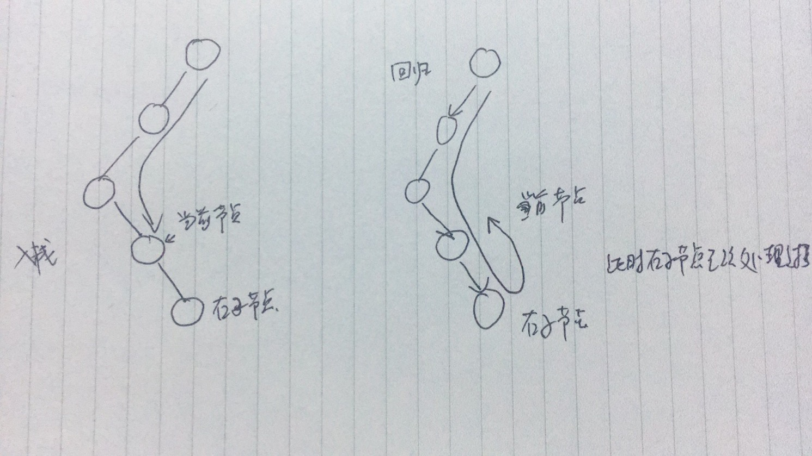

```java
public static List<Integer> postOrderTraversalIteratively(TreeNode root) {
    if (root == null) {
        return null;
    }

    Stack<TreeNode> stack = new Stack<>();
    List<Integer> result = new ArrayList<>();
    TreeNode next = root;
    Integer last = null;

    while (next != null || !stack.isEmpty()) {
        while (next != null) {
            stack.add(next);
            next = next.left;
        }

        TreeNode node = stack.peek();
        if (node.right != null && (last == null || node.right.val != last)) {
            next = node.right;
            continue;
        }

        stack.pop();
        result.add(node.val);
        next = null;
        last = node.val;
    }

    return result;
}
```

空间复杂度是$O(H)$，$H$是栈的最大深度，对应树的高度，也等于根节点到叶节点最长路径的长度。在平衡二叉树中$H = O(\log N)$，在非平衡二叉树中，最坏情况下$H = N$。

时间复杂度是$O(N)$，因为所有被遍历的元素都要经过入栈出栈的过程，而每个元素入栈出栈的操作是$O(1)$，所有元素合在一起是线性复杂度。

另外一种思路是使用队列保存输出结果，和栈的遍历顺序反向来保证输出结果的顺序。

```js
var postorderTraversal = function (root) {
  if (!root) {
    return []
  }
  const stack = [root]
  const result = []

  while (stack.length) {
    const top = stack.pop()
    result.unshift(top.val)

    if (top.left) {
      stack.push(top.left)
    }
    if (top.right) {
      stack.push(top.right)
    }
  }

  return result
}
```

#### Morris Traversal（Threaded Binary Tree）

上面的递归和循环实现的二叉树遍历方法空间复杂度都是$O(H)$，[Morris, Joseph H](https://en.wikipedia.org/wiki/Threaded_binary_tree)提出一种在线性时间内遍历二叉树的方法，只需要$O(1)$空间复杂度。在中序遍历中，如果节点中不包含指向父节点的`parent`指针那么遍历完成左子树后无法从左子树返回到根节点继续处理。考虑任意节点的前驱节点如果存在，前驱节点的右子节点肯定是空（因为前驱节点是左子树中最大的节点），将前驱节点的右子节点设置为当前节点，那么遍历树的回溯过程中可以沿着右子节点回到上层节点。

以中序遍历为例，树遍历过程从根节点开始分为三个阶段：

1. 下降 - 左子节点不为空，将当前节点前驱节点的右子节点设置为当前节点。
1. 触底 - 左子节点为空，将当前节点设置为右子节点，向上回溯。
1. 回溯 - 左子节点不为空，将当前节点设置为右子节点，向上回溯同时将当前节点的前驱节点右子节点设置空，恢复二叉树原来的结构。

Morris 遍历的过程会暂时的改变二叉树的结构，上面是以改变前驱节点的右子节点为例，对于逆序来说对称的也可以改变**后继节点**的**左子节点**。这种二叉树结构称之为[Threaded Binary Tree](https://en.wikipedia.org/wiki/Threaded_binary_tree)。

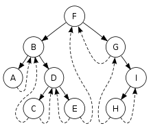

考虑中序 Morris 遍历，左子节点在前，根节点在中间，右子节点在后，所以遍历的下降过程中不记录节点，直到下降到底部最左节点开始记录节点，回溯时是从左子节点到中间根节点，和中序遍历要求顺序相同所以同样添加节点即可。


```java
public static List<Integer> inorderMorrisTraversal(TreeNode root) {
    if (root == null) { return null; }

    List<Integer> inorderList = new ArrayList<>();

    TreeNode current = root;
    while (current != null) {
        // 2. 向左触底
        if (current.left == null) {
            inorderList.add(current.val);
            current = current.right;
        } else {
            TreeNode predecessor = current.left;
            // 获取当前节点的前驱节点，前驱节点的右子节点可能是空（对应阶段1）或者等于当前节点（对应阶段3）
            while (predecessor.right != null && predecessor.right != current) {
                predecessor = predecessor.right;
            }

            // 1. 下降
            if (predecessor.right == null) {
                predecessor.right = current;
                current = current.left;
            } else {
                // 3. 回溯
                inorderList.add(current.val);
                predecessor.right = null;
                current = current.right;
            }
        }
    }

    return inorderList;
}
```

考虑前序 Morris 遍历，中间节点在最前边，左子树在中间，右子树在后边，所以在下降阶段（阶段 1）和触底（阶段 2）将当前节点加入结果中即可。前序遍历和中序遍历处理节点的不同在于一个是在下降阶段一个是在回溯节点，因此只有一行代码的差别。

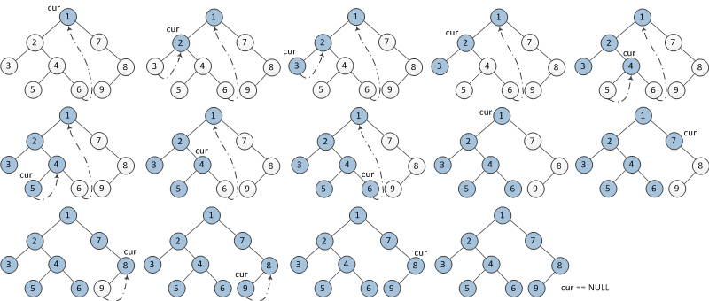

```java
public static List<Integer> preorderMorrisTraversal(TreeNode root) {
    if (root == null) { return null; }

    List<Integer> preorderList = new ArrayList<>();

    TreeNode current = root;
    while (current != null) {
        // 2. 向左触底
        if (current.left == null) {
            inorderList.add(current.val);
            current = current.right;
        } else {
            TreeNode predecessor = current.left;
            // 获取当前节点的前驱节点，前驱节点的右子节点可能是空（对应阶段1）或者等于当前节点（对应阶段3）
            while (predecessor.right != null && predecessor.right != current) {
                predecessor = predecessor.right;
            }

            // 1. 下降
            if (predecessor.right == null) {
                // 与中序遍历只有一行不同
                preorderList.add(current.val);
                predecessor.right = current;
                current = current.left;
            } else {
                // 3. 回溯
                predecessor.right = null;
                current = current.right;
            }
        }
    }

    return inorderList;
}
```

后续 Morris 遍历比中序和前序稍微复杂些，因为中间节点要在左子树和右子树后边，所以在下降和触底阶段都不能将节点加入结果列表，只能在回溯阶段进行处理。回溯到当前节点$A$时，才能将其前驱节点$P$到其左子节点$L$的路径上的节点加入结果队列，而且顺序是$P \rightarrow L$。另外还需要额外一个辅助节点，将这个辅助节点的左子节点设置为根节点，这样才能完成整个树的后续遍历。


```java
public static List<Integer> postOrderMorrisTraversal(TreeNode root) {
    if (root == null) { return null; }

    List<Integer> postOrderList = new ArrayList<>();

    TreeNode current = new TreeNode(0);
    current.left = root;

    while (current != null) {
        // 2. 触底
        if (current.left == null) {
            current = current.right;
        } else {
            TreeNode predecessor = current.left;
            while (predecessor.right != null && predecessor.right != current) {
                predecessor = predecessor.right;
            }

            // 1. 下降
            if (predecessor.right == null) {
                predecessor.right = current;
                current = current.left;
            } else {
                // 3. 回溯
                predecessor.right = null;

                // 此时将当前节点的前驱节点到左子节点路径上节点加入结果列表
                LinkedList<Integer> tempList = new LinkedList<>();
                TreeNode temp = current.left;
                while (temp != null) {
                    tempList.addFirst(temp.val);
                    temp = temp.right;
                }
                postOrderList.addAll(tempList);

                // 进入下次循环，当前节点是辅助节点时，其右子节点是空，循环会在下次结束
                current = current.right;
            }
        }
    }

    return postOrderList;
}
```

很显然 Morris 遍历只使用了节点本身和最多一个辅助节点（后续遍历情况）的空间，所以空间复杂度是$O(1)$。整个遍历过程中，每个节点会在下降和回溯阶段各碰到一次，每次进行的主要操作是寻找前驱节点复杂度是$O(l)$和路径长度有关、修改前驱节点复杂度是$O(1)$。每个节点寻找前驱节点的操作和路径长度线性相关，所有节点寻找前驱节点操作的时间成本加起来和树总路径长度线性相关，即证明时间复杂度是$O(N)$，只不过其中的常系数大致是原来的**两倍**，因为下降和回溯各找一次。

对应的逆序遍历也可以对称地解决，考虑顺序与逆序的互为逆序的关系，同样可以解决等价但是较为简单的问题。

1. Morris, Joseph M. (1979). "Traversing binary trees simply and cheaply"
1. [Morris Traversal 方法遍历二叉树（非递归，不用栈，O(1)空间）](https://www.cnblogs.com/AnnieKim/archive/2013/06/15/morristraversal.html)

#### 表达式树

表达式解析树如下图

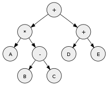

对表达式树进行前序遍历得到前缀表达式（prefix expression）$+ * A - B C + D E$，也称为波兰表达式（Polish notation），特点在于运算符位于运算数前。

对表达式进行后序遍历得到后缀表达式（postfix expression）$A B C - * D E + +$，也称为逆波兰表达式（reverse polish notation)，特点在于运算符位于操作数之后。后缀表达式使用 Stack Machine 很方便执行。

对表达式树进行中序遍历得到中缀表达式（infix expression），是数学上通常使用的表达式书写方式，中序表达式需要用括号来区分不同运算符的优先级。

https://en.wikipedia.org/wiki/Reverse_Polish_notation

1. Postfix Expression Evaluation from left and right
1. Shunting Yard Algorithm

#### 中序遍历应用

##### 求树中第$K$小节点

由于中序遍历的序列是升序序列，所以中序遍历序列中第$K$个节点就是二叉树中第$K$小的节点。用一个变量记录节点个数，可以改造三种中序遍历的实现来求得第$K$小的节点。对称的可以使用逆中序遍历求得第$K$大的节点。

##### 恢复树

如果一个二叉树中有两个节点的值互换了，如何找出这两个节点并将树恢复原状？ Leetcode 99

还是利用二叉树的中序遍历升序性质，顺序被破坏的树在中序遍历的过程中肯定有两个连续的节点不符合升序性质。可能出现两种情况，如果互换的两个节点本身在升序序列中相邻，则出现一对违反升序性质的节点对，互换这个节点对即可将树回复原装；如果互换的两个节点不相邻，则出现两对违反升序性质的节点对，需要将第一对的第一个节点和第二对的第二个节点互换，将树恢复原状。

此处利用 Morris 中序遍历，还可以只用两个变量记录需要交换的节点对而不是用列表记录所有节点对。

```java
class Solution {
    public void recoverTree(TreeNode root) {
        if (root == null) { return; }

        List<TreeNode[]> pairs = new ArrayList<>();
        TreeNode prev = null;
        TreeNode current = root;

        while (current != null) {
            if (current.left == null) {
                if (prev != null && current.val < prev.val) {
                    pairs.add(new TreeNode[] { prev, current });
                }

                prev = current;
                current = current.right;
            } else {
                TreeNode predecessor = current.left;

                while (predecessor.right != null && predecessor.right != current) {
                    predecessor = predecessor.right;
                }

                // down
                if (predecessor.right == null) {
                    predecessor.right = current;

                    current = current.left;
                } else {
                    if (current.val < prev.val) {
                        pairs.add(new TreeNode[] { prev, current });
                    }

                    predecessor.right = null;
                    prev = current;
                    current = current.right;
                }
            }
        }

        if (pairs.size() == 1) {
            TreeNode[] pair = pairs.get(0);
            swap(pair[0], pair[1]);
        } else if (pairs.size() == 2){
            TreeNode[] firstPair = pairs.get(0);
            TreeNode[] secondPair = pairs.get(1);
            swap(firstPair[0], secondPair[1]);
        }
    }

    static void swap(TreeNode left, TreeNode right) {
        Integer temp = left.val;
        left.val = right.val;
        right.val = temp;
    }
}
```

#### 逆中序遍历应用

LeetCode 1038

将二叉树每个节点的值（value）变换成二叉树中所有大于键（key）大于该节点的所有节点值之和。
因为要先处理右测节点，在处理根节点和左子节点，所以使用逆中序遍历。比较简单的做法是先将所有节点按照逆中序排列，然后按逆中序顺序处理即可，从第二个节点开始处理每个节点的新值时上一个节点的值与当前节点值之和。

更加高效的方法是在逆中序遍历的过程中，直接计算每个节点的新值，此时需要一个`successor`变量记录当前节点的后继节点，每个节点的新值为当前节点值和其后继节点值之和（此时后继节点已经处理完成，其值是新值）。

```java
class Solution {
    private TreeNode successor = null;

    public TreeNode bstToGst(TreeNode root) {
        if (root == null) {
            return root;
        }

        // 初始情况：后继节点和右子节点都是空的时候设置后继节点是当前节点
        // 当successor不是空的时候，successor不应该再此处更新，而是在每个节点处理完后更新
        if (successor == null && root.right == null) {
            successor = root;
            return root;
        }

        bstToGst(root.right);
        root.val += successor.val;
        successor = root;
        bstToGst(root.left);

        return root;
    }
}
```

使用一个变量`sum`记录当前的和更简单

```java
class Solution {
    int sum = 0;
    public TreeNode bstToGst(TreeNode root) {
        if (root != null){
            bstToGst(root.right);
            sum = sum + root.val;
            root.val = sum;
            bstToGst(root.left);
        }
        return root;
    }
}
```

#### 按层遍历（Level Order Traversal）

前序、中序、后序属于深度优先搜索，二叉树从上到下按层进行遍历，同层的节点按照从左到右的顺序排列是广度优先搜索。跟图的广度优先搜索一样，需要借助一个队列来完成。起始状态是将根节点加入队列中，然后从队列中取出元素，将元素加入结果列表中，同时将所有子节点入队，循环执行直到队列为空，所有节点处理完成。

```java
public static List<Integer> levelOrderTraversal(TreeNode root) {
    if (root == null) { return null; }

    Queue<TreeNode> queue = new LinkedList<>();
    List<Integer> result = new ArrayList<>();

    queue.add(root);
    while (!queue.isEmpty()) {
        TreeNode node = queue.poll();
        result.add(node.val);

        if (node.left != null) {
            queue.add(node.left);
        }

        if (node.right != null) {
            queue.add(node.right);
        }
    }

    return result;
}
```

如果将每层的节点放一起（返回的结果是`List<List<Integer>>`类型），可以考虑用递归去做，递归函数加上一个代表节点所在层数的参数。更简单的方法是观察到每次元素出栈前，当前队列中的所有元素是同一层的，只要将这些元素放入新的`List<Integer>`即可。
Leetcode 102

```java
public static List<List<Integer>> levelOrderTraversalList(TreeNode root) {
    List<List<Integer>> result = new ArrayList<>();
    if (root == null) { return result; }

    Queue<TreeNode> queue = new LinkedList<>();
    // 初始情况是队列中只有根节点，根节点所在的层只有1个节点
    queue.add(root);

    while (!queue.isEmpty()) {
        List<Integer> nextLevelNodes = queue.stream().map(value -> value.val).collect(Collectors.toList());
        result.add(nextLevelNodes);

        // 此处需要记录当前这一层节点的个数，因为后续遍历会加入下一层节点
        int childCount = queue.size();

        // 将这一层共childCount个节点出队放到一个List中，并同时计算这一层所有节点的子节点的总数
        for (int i = 0; i < childCount; i++) {
            TreeNode node = queue.poll();
            if (node.left != null) {
                queue.add(node.left);
            }
            if (node.right != null) {
                queue.add(node.right);
            }
        }
        // 继续下一轮循环
        result.add(childValues);
    }

    return result;
}
```

在上面的基础上还可以按层遍历但是每层的顺序是交替的正序逆序（zigzag level order）。

#### 迭代器

为二叉树实现一个迭代器类，与中序遍历的顺序相同，节点从小到大依次返回。直接的做法是先对二叉树做中序遍历，并保存结果，根据这个结果来实现相关函数。这个做法迭代器初始化时间复杂度是$O(N)$，`next`和`hasNext`操作是$O(1)$。如果迭代器初始化后只遍历了较少的元素，那么初始化其他部分的元素的排序操作被浪费了。可以实现一个懒惰的迭代器，只有在调用`next`和`hasNext`函数时才会去确定下一个元素。递归实现的中序遍历函数无法控制其执行和中断，但是循环形式实现的迭代器可以将循环依赖的条件保存在迭代器类中，每次调用找到一个元素，相当于中断了循环，同时更新相关状态变量以便下次调用继续执行。

懒惰的迭代器构造在常数时间内完成，`next`和`hasNext`最坏的情况下复杂度是$O(H)$，均摊时间复杂度是$O(1)$。

```java
class TreeNode {
    class BstIterator {
        private Stack<TreeNode> stack = new Stack<>();
        private TreeNode nextNode;
        private TreeNode nextTarget;

        public BstIterator(TreeNode root) {
            this.nextTarget = root;
        }

        public BstIterator() {
            this.nextTarget = TreeNode.this;
        }

        public TreeNode next() {
            if (!hasNext()) { return null; }
            TreeNode value = nextNode;
            nextNode = null;

            return value;
        }

        private void advance() {
            if (nextTarget != null || !stack.isEmpty()) {
                while (nextTarget != null) {
                    stack.add(nextTarget);
                    nextTarget = nextTarget.left;
                }

                nextNode = stack.pop();
                nextTarget = nextNode.right;
            }
        }

        public boolean hasNext() {
            if (nextNode == null) { advance(); }
            return nextNode != null;
        }
    }
}
```

### 树节点个数

size

kth Smallest 230

### 高度平衡

TODO: https://algs4.cs.princeton.edu/32bst/

1. Perfect balance. Write a program PerfectBalance.java that inserts a set of keys into an initially empty BST such that the tree produced is equivalent to binary search, in the sense that the sequence of compares done in the search for any key in the BST is the same as the sequence of compares used by binary search for the same set of keys.

### 树深度与平衡

depth of leaf nodes all, min depth/max depth/ maxDepth,minDepth 最多差 1 称为平衡
104，111, , 559

左右子树的高度之差最多为 1 称之为高度平衡，高度平衡的树要求每个子树也是高度平衡，判断一个树是否高度平衡（Leetcode 110）。

常规的的递归解法先定义求解树高度的函数`maxHeight`，然后按照高度平衡定义递归求解`isBalanced`。

```java
public boolean isBalanced(TreeNode root) {
    if (root == null) { return true; }

    return Math.abs(maxHeight(root.left) - maxHeight(root.right)) <= 1
        && isBalanced(root.left) && isBalanced(root.right);
}

public int maxHeight(TreeNode node) {
    if (node == null) { return 0; }

    return Math.max(maxHeight(node.left), maxHeight(node.right)) + 1;
}
```

另外一个思路是将平衡的判断**混入**到求树高度的递归逻辑中，树的高度取值范围是$[0, \infty)$，所以在树不平衡时不妨选取一个负数-1 来表示。如果树是高度平衡的，那么计算得到的是树的高度，反之是-1。

```java
public final int unbalanced = -1;

public boolean isBalanced(TreeNode root) {
    return maxDepth(root) != unbalanced;
}

public int maxDepth(TreeNode root) {
    if (root == null) { return 0; }

    // 递归情况： 任一子树不平衡则当前树也不平衡
    int left = maxDepth(root.left);
    if (left == unbalanced) { return unbalanced; }

    int right = maxDepth(root.right);
    if (right == unbalanced) { return unbalanced; }

    // 递归终结情况： 树不平衡
    if (Math.abs(left - right) > 1) { return unbalanced; }

    // 递归情况： 平衡树高度计算
    return 1 + Math.max(left, right);
}
```

### 查找操作

一个优化频繁访问的节点的技巧是使用缓存，将最近访问的节点保存在一个变量中，如果这个节点被连续重复访问，那么后续查询操作可以在常量时间内完成。

### 插入操作

### 结点数（size）与数高度（height）

两种方法：

1. 不用额外的空间记录结点数与高度，时间复杂度是$O(\log N)$
2. 记录结点数与高度，空间复杂度是$O(\log N)$，常量查询时间。

### 最大最小值

### 范围查找

实现一个非递归的版本，使用的额外空间和树的高度成正比，和查找范围内键的多少无关。

### 向上向下取整

### 排名（rank）和选择（select）

### 删除结点

删除最大最小结点
删除任意节点

### 外部路径和内部路径

外部路径比内部路径大 2N，Hibbard 删除方法的性能问题。

### 重建二叉树（BST Reconstruction）

从中序序列和前序序列重构二叉树(Leetcode 105)，对于二叉树节点来说，中序遍历顺序是左子树、根节点、右子树，前序遍历的顺序是根节点、左子树、右子树。前序遍历的第一个节点是根节点，在中序遍历中找到该节点，其左侧元素组成左子树，右侧元素组成右子树。针对左子树部分和右子树部分递归的进行这样的处理，递归终止的条件是序列长度为零时返回空指针，序列长度为 1 时返回一个叶节点。

```js
var buildTree = function (preorder, inorder) {
  function build(preStart, inStart, length) {
    if (length <= 0) {
      return null
    }
    const rootVal = preorder[preStart]
    if (length === 1) {
      return new TreeNode(rootVal)
    }

    const node = new TreeNode(rootVal)
    let index
    for (let i = inStart; i < inStart + length; i++) {
      if (inorder[i] === rootVal) {
        index = i
        break
      }
    }
    const left = index - inStart
    const right = inStart + length - index - 1

    node.left = build(preStart + 1, inStart, left)
    node.right = build(preStart + 1 + left, index + 1, right)

    return node
  }

  return build(0, 0, preorder.length)
}
```

从中序遍历和后序遍历(Leetcode 106)可使用同样的方法重构二叉树，区别在于后续遍历序列中顺序是左子树、右子树、根节点，每次取最后的元素作为根节点拆分中序遍历序列。

从前序遍历和后序遍历（Leetcode 889）重构二叉树，观察下图可知

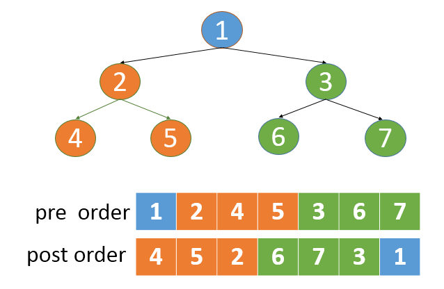

```js
var constructFromPrePost = function (pre, post) {
  function build(preStart, postStart, len) {
    if (len <= 0) {
      return null
    }
    const node = new TreeNode(pre[preStart])
    if (len === 1) {
      return node
    }

    const leftChildRoot = pre[preStart + 1]
    let leftChildRootIndex
    for (let i = postStart; i < postStart + len; i++) {
      if (post[i] === leftChildRoot) {
        leftChildRootIndex = i
        break
      }
    }

    const leftLength = leftChildRootIndex + 1 - postStart
    const rightLength = len - leftLength - 1

    node.left = build(preStart + 1, postStart, leftLength)
    node.right = build(
      preStart + 1 + leftLength,
      leftChildRootIndex + 1,
      rightLength
    )

    return node
  }

  return build(0, 0, pre.length)
}
```

1. BST reconstruction. Given the preorder traversal of a BST (not including null nodes), reconstruct the tree.
1. Level-order traversal reconstruction of a BST. Given a sequence of keys, design a linear-time algorithm to determine whether it is the level-order traversal of some BST (and construct the BST itself).
1. [binary trees](./1-s2.0-0893965989901225-main.pdf)
1. https://www.geeksforgeeks.org/construct-a-binary-search-tree-from-given-postorder/
1. https://leetcode.com/problems/construct-binary-tree-from-inorder-and-postorder-traversal/

### 序列化与凡序列化

https://www.youtube.com/watch?v=JL4OjKV_pGE

Leetcode 使用的二叉树的序列化格式如下`[1,2,3,null,null,4,5]`

```js
function TreeNode(val) {
  this.val = val
  this.left = this.right = null
}

/**
 * Encodes a tree to a single string.
 *
 * @param {TreeNode} root
 * @return {string}
 */
var serialize = function (root) {
  const queue = [root]
  const result = []
  while (queue.length > 0 && queue.some((node) => !!node)) {
    const size = queue.length
    for (let i = 0; i < size; i++) {
      const node = queue.shift()
      if (node === null) {
        result.push(null)
        queue.push(null)
        queue.push(null)
      } else {
        result.push(node.val)
        queue.push(node.left || null)
        queue.push(node.right || null)
      }
    }
  }

  return `[${result.map((val) => (val === null ? 'null' : val))}]`
}

/**
 * Decodes your encoded data to tree.
 *
 * @param {string} data
 * @return {TreeNode}
 */
var deserialize = function (data) {
  const nodeValues = JSON.parse(data)
  if (nodeValues.length === 0) {
    return null
  }

  const nodes = nodeValues.map((val) =>
    val === null ? null : new TreeNode(val)
  )
  for (let i = 0; 2 * i + 1 <= nodes.length - 1; i++) {
    if (nodes[i] !== null) {
      const left = 2 * i + 1
      const right = 2 * i + 2
      nodes[i].left = nodes[left] || null
      nodes[i].right = nodes[right] || null
    }
  }

  return nodes[0]
}

/**
 * Your functions will be called as such:
 * deserialize(serialize(root));
 */

const serialized = '[1,2,3,null,null,4,5]'
const nodes = deserialize(serialized)
console.log(serialize(nodes))
```

## 多叉树

前、中、后序遍历

## 平衡二叉树

## 2-3 树

2-3 树中包含两种节点：2 结点和普通二叉树的节点一样，节点中包含一个值且有两个子节点（包含空节点）；3 节点中包含两个节点值且有三个子节点。2-3 树通过 3 节点能够容纳多一个节点的性质保持树的平衡。

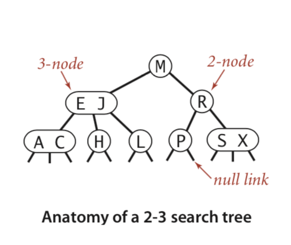

### 插入操作

向 2-3 树中插入一个节点首先根据要插入的键值进行查找，如果树中存在相同的键直接更新即可；如果不存在需要在最终查找到的叶节点下新增子节点。新增子节点可以分为几种情况。

#### 根节点为空

插入新节点是根节点

#### 向 2 节点插入新节点

2 节点变为 3 节点

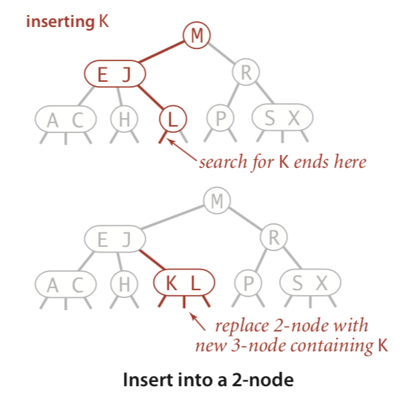

#### 向 3 节点插入新节点

3 节点插入新节点变为临时的 4 节点，然后需要将 4 节点向上分解以消除 4 节点。如果 3 节点的父节点是 2 节点，那么分解 4 节点后父节点变为 3 节点。

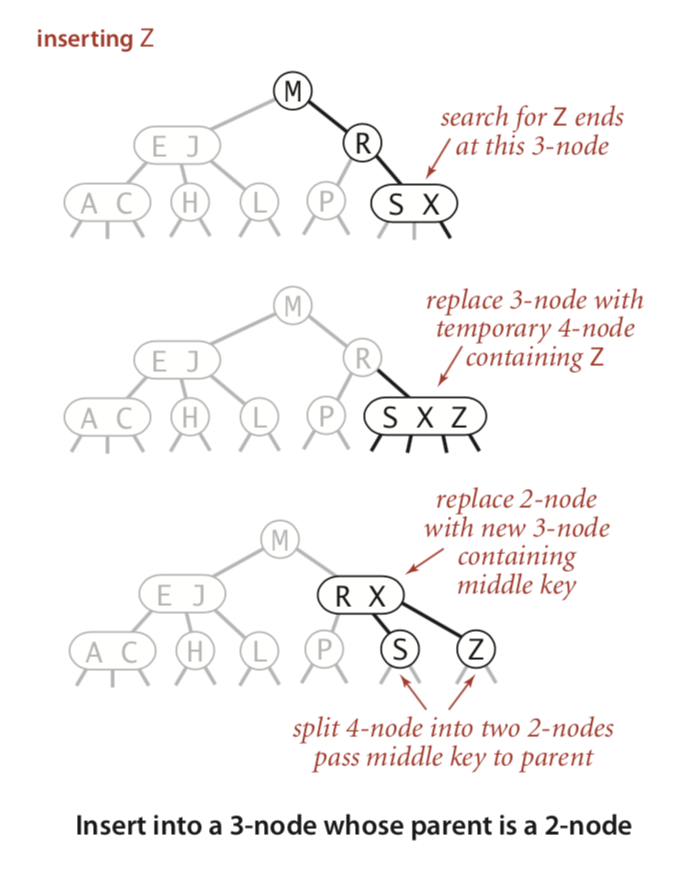

如果 3 节点的父节点是 3 节点，那么 4 节点分解后父节点变为新的 4 节点，需要继续向上分解直到父节点是 2 节点或者是根节点。4 节点是根节点的情况下，4 节点分解后其中间成为新的根节点，且 2-3 树高度加 1。

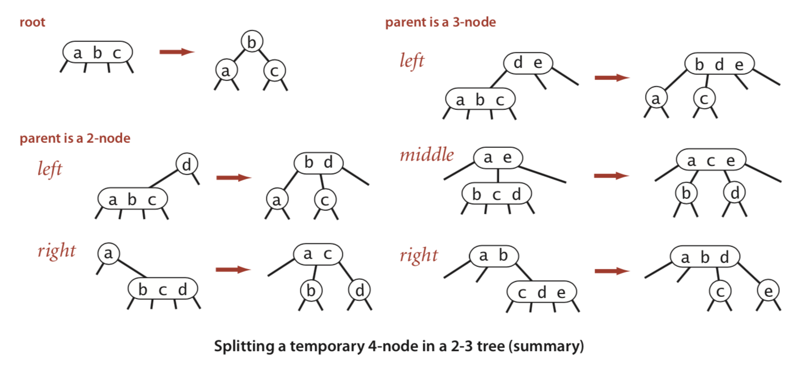

## 红黑树

### [左倾红黑树（**L**eft **L**earning **R**ed **B**ack **T**ree)](https://www.cs.princeton.edu/~rs/talks/LLRB/RedBlack.pdf)

2-3 树中的 3 结点和临时的 4 结点内部结点之间的**连接**定义为红色，其余连接定义为黑色。这样定义下每一个 2-3 树都可以有对应红黑树（连接带有颜色的二叉树）表示。

1. 黑色连接等同于 2-3 树中的节点间的连接
1. 红色连接相当于于 2-3 树中 3 结点和临时的 4 结点的内部连接
1. 红色连接相连的节点相当于 2-3 树中的 3 节点和临时 4 节点
1. 2-3 树中树的平衡相当于红黑树中黑色连接的平衡，红色连接等同于 2-3 树节点内部连接不增加其高度

一个 2-3 树的对应红黑树不是惟一的。

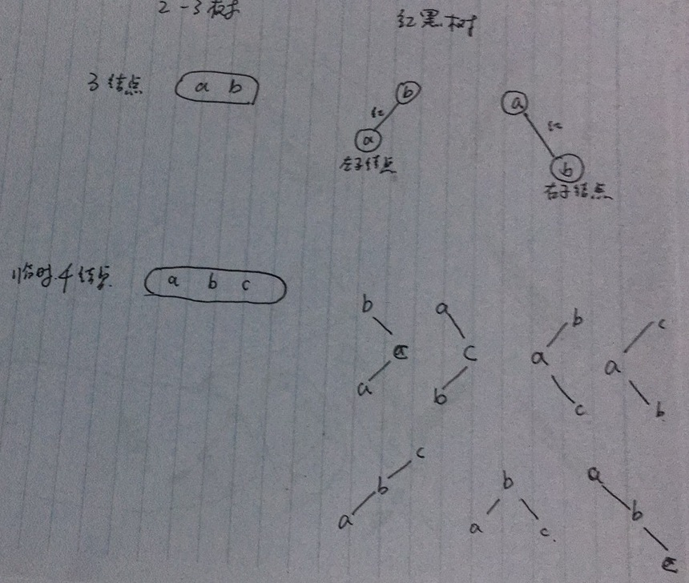

为了简化可能的情况，只使用红色左连接而禁止使用红色右连接，这样的红黑树就叫左倾红黑树。2-3 树和左倾红黑树是**一一对应**的。左倾红黑树是黑连接平衡的，即从根节点到任意叶节点经过的黑色连接个数是相同的。左倾红黑树必须满足以下几条性质：

1. 红黑树的根节点总是黑色的 - 对应 2-3 树中根节点是 2 节点和根节点是 3 节点其中较大的节点。
2. 空的子节点也当成黑色处理 - 平衡 2-3 树中最底层叶节点的子节点是空节点
3. 不允许出现红色右连接 - 左倾红黑树的要求
4. 不允许出现出现两条连续的红色左连接 -对应 2-3 树中临时 4 节点，在插入删除节点操作完成时被消除

在左倾红黑树进行插入和删除节点的过程中如果保持以上的性质，就相当于等价表示的 2-3 的树在插入删除节点过程中保持平衡。红黑树中除了插入和删除节点之外的查询操作和普通的二叉树完全一样，不需要做任何修改，这也是红黑树相比于 2-3 树简单的地方。

二叉树中一个结点向下可以有两个连接，但是向上只有一个连接到其父结点，因此可以将每条连接的是红连接还是黑连接的信息保存在连接子结点当中。结点中保存一个布尔值，`true`表示这个结点是红结点，到其父结点的连接是红连接，反之是黑结点。

#### 左旋和右旋

2-3 树中三节点可以用红色左连接或者红色右连接的红黑树表示，左旋和右旋操作将两种形式互相转换。以左旋操作为例，子树根节点`F`到右子节点`Q`的红色右连接被转换成了根节点`Q`到左子节点`F`的红色连接。左旋和右旋操作是局部变换，只需要修改涉及到的两个节点即可，在常数时间内完成。

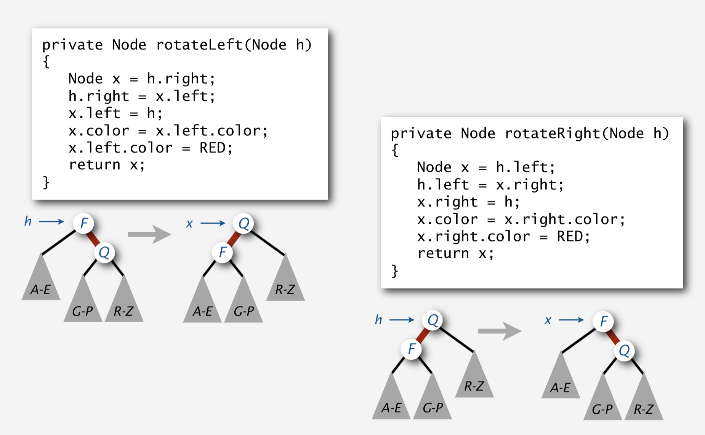

需要注意的是左右旋操作改变了子树的根节点，因此使用时应该对代表根节点的变量进行更新。

```java
Node h = rotateLeft(h);
```

#### 颜色转换（消除临时 4 节点）

2-3 树中分解临时 4 节点的操作等价于左倾红黑树中对一个左右都是红连接的节点变成黑色（4 节点分解），并将节点本身的颜色变成红色（节点上浮）。

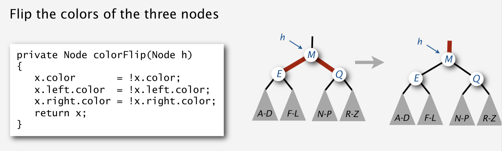

#### 插入结点操作

红黑树插入节点操作对应于 2-3 树，新插入的节点与父节点之间是红色连接，相当于 2-3 树中 2 节点/3 节点增加一个节点变成 3 节点/4 节点。旋转与变色操作相当于 2-3 树中将 4 节点进行向上分解。向 3 节点插入新节点时才会形成 4 节点，需要向上分解处理，新节点可能插入在 3 节点的左中右三个位置。

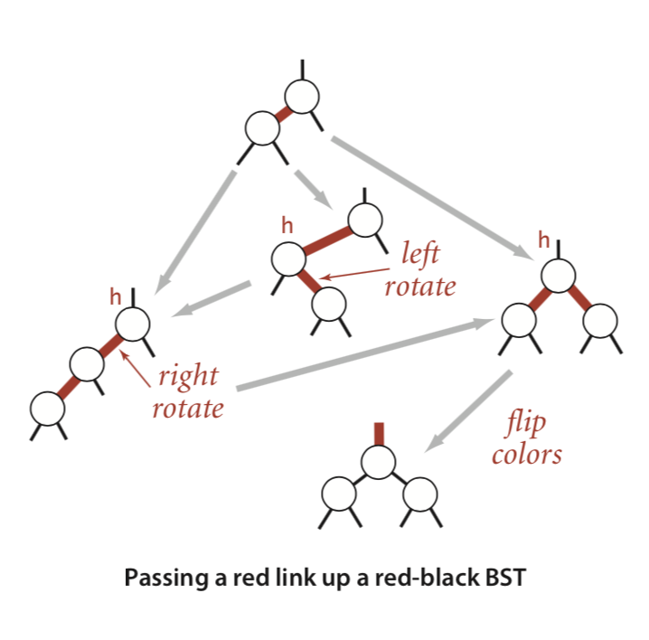

对应上图中三种情况

1. 新节点插入中间 - 将红色右连接左旋
1. 新节点插入左侧 - 出现连续两条红色左连接，将根节点上方左连接右旋
1. 新节点插入右侧 - 如果左右连接都是红色，进行变色操作将红色连接向上传递。

这样在左倾红黑树插入节点的过程中就可以始终保持其性质从而使其保持接近平衡。递归实现的代码如下：

```java
public class RedBlackBST<Key extends Comparable<Key>, Value> {
    private Node root;

    public void put(Key key, Value val) {
        root = put(root, key, val);
        // 维持根节点是黑色
        root.color = BLACK;
    }

    private Node put(Node h, Key key, Value val)
    {
        if (h == null)
           return new Node(key, val, 1, RED);

        int cmp = key.compareTo(h.key);
        if      (cmp < 0) h.left  = put(h.left,  key, val);
        else if (cmp > 0) h.right = put(h.right, key, val);
        else h.val = val;

        if (isRed(h.right) && !isRed(h.left))    h = rotateLeft(h);
        if (isRed(h.left) && isRed(h.left.left)) h = rotateRight(h);
        if (isRed(h.left) && isRed(h.right))     flipColors(h);

        h.N = size(h.left) + size(h.right) + 1;
        return h;
    }
```

注意递归实现中变色操作放在最后，这样在当前节点递归结束后其对应子树中不存在对应 4 节点的连续红色连接。如果节点向上传递了红色连接，该红色连接与更上层红色连接形成的连续连接被上层节点的函数消除。根节点的向上传递红色连接会将树高增加 1，此处需要手动将根节点重新恢复成黑色。

#### 删除节点操作

#### 自顶向下的 2-3-4 树插入操作（Top Down)

#### 红黑树的性质

1. 红黑树的操作在线性对数级别。一棵大小为$N$的红黑树高度不会超过$2\log N$。比普通二叉树平均路径长度少 40%.
1. 有$N$个内部节点红黑树中，根节点到任意节点的平均路径长度是约为$\log N$

### 标准红黑树

算法导论中介绍了不限制红色链接倾斜方向的标准红黑树，并将树中的节点分为内部节点（internal node）和外部节点（external node）两种。

1. 内部节点 - 存储一个具体键值的节点，包括`color`、`key`、`left`、`right`、`parent`等属性。
1. 外部结点 - 外部节点是为了分析方便，保证每个内部节点都有子节点。可以用空指针`NIL`或者哨兵（sentinel）节点实现，算法导论中为节省空间使用一个哨兵`T.nil`元素作为所有内部节点的子节点。

红黑树来源于平衡 B 树，用节点带有红黑颜色的平衡二叉搜索树来代表等价的 B 树，并实现保持平衡 B 树的相应插入删除节点操作，所以我们从可以从 B 树的角度来理解这些性质。

标准红黑树等价于 2-3-4 树，2-3-4 树中包含三种节点。

1. 2 节点（2-node）- 有一个键`key`和两个子节点`left`、`right`，其中`left < key < right`。
2. 3 节点（3-node）- 有两个键和三个子节点，键值和节点满足大小顺序。
3. 4 节点（4-node）- 有三个键和四个子节点，键值和节点满足大小顺序。

如下图椭圆形代表 3 节点内部包含两个节点`a`、`b`，黑色小方块代表外部节点，节点间加粗的线代表红色连接，节点的圈加粗的代表红色节点。

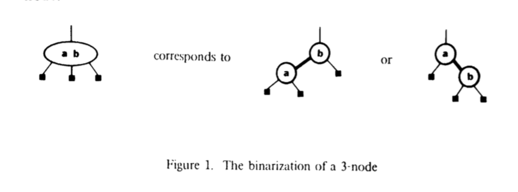

两个二叉树节点连接在一起表示一个 3 节点，使用红色连接还是红色节点是对这一表示的不同说法。红色连接的方式更加直观，红色链接是 2-3-4 树中的节点的内部连接，黑色连接是节点的外部连接。红色节点表示的话，有个叫做提升（lifting）节点的操作，就是将红色节点提升到与黑色父节点一样的高度，也表示两个二叉树节点合在一起对应一个三节点。标准红黑树中不限制红色节点是左倾（红色节点是左子节点）还是右倾（红色节点是右子节点），所以有两种表达方式。

4 节点使用红色或黑色的二叉树节点表示如下：

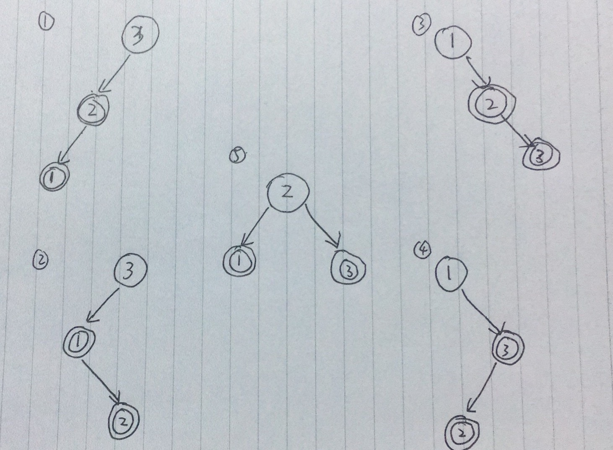

不考虑左右倾有 5 种表示形式，但是其中前 4 种树的高度是 2，第五种对称形式一个黑色父节点两个红色子节点树高度是 1。表示 4 节点时只使用第 5 种形式二叉树的高度会更低，其余 4 种形式在插入操作中作为中间状态可能出现。

平衡 2-3-4 树的等价红黑树必须满足以下五条性质。

| 编号 | 性质                                                                           | 说明                                                                                                                                                                                              |
| ---- | ------------------------------------------------------------------------------ | ------------------------------------------------------------------------------------------------------------------------------------------------------------------------------------------------- |
| 1    | 每个节点是红色或是黑色                                                         | 删除节点过程中单个节点可能临时代表双黑或者黑红                                                                                                                                                    |
| 2    | 根节点是黑色的                                                                 | 对应 2 节点 3 节点的根必定时黑色的，对应 4 节点的根节点颜色是黑是红并不影响树的平衡和拓扑结构，统一规定为黑色是为了与 2 节点 3 节点的表示一致，这意味着需要的时候将根节点从红色改为黑色是允许的。 |
| 3    | 叶节点（NIL）是黑色的                                                          | 叶节点是外部节点，不与其父节点合并表示 3 节点 4 节点，所以规定为黑色的。                                                                                                                          |
| 4    | 如果一个节点是红色的，则它的两个子节点都是黑色的                               | 禁止了 4 节点对应的高度为 2 的表示形式。                                                                                                                                                          |
| 5    | 对于每个节点，从该节点到其所有后代节点的简单路径上，均包含相同数目的黑色节点。 | 平衡的 2-3-4 树中从根节点到任意叶节点高度路径长度相同，路径上包含的黑色节点个数相同。                                                                                                             |

红黑树从根节点到外部节点的所有路径中最短的路径是只有黑色节点的路径，最长的路径是黑色节点红色节点交替出现的路径，因为不允许连续的红色节点。最长路径长度不超过最短路径长度的 2 倍，因此是近似于平衡的，这种近似平衡对应的就是 2-3-4 树的平衡性质。

从某个节点出发（不含该节点）到达一个外部节点的任意一条简单路径上黑色节点个数称为该节点的黑高（black-height）。红黑树的黑高为其根节点的黑高。

一个内部有 n 个节点的红黑树高度最多是$2\log (n+1)$。首先证明黑高为$bh$树中至少包含$2^{bh} - 1$个节点（不包含任何红色节点的情况，是一个只有黑色节点的高度为$bh$的完全平衡二叉树）。$n \ge 2^{bh} - 1 \rightarrow 2\log (n+1) \ge bh$。

#### 旋转操作

标准红黑树中的旋转操作和左倾红黑树中一样，不同的是算法导论中描述的旋转的操作不涉及节点颜色，插入删除操作中对节点的颜色变换另外进行设置。另外要考虑到旋转操作涉及根节点时，要对代表二叉树根节点的变量`T.root`进行正确更新。

注意旋转操作为了位置二叉树节点键值大小顺序的要求在变换左倾右倾方向的同时会交换父子节点的键值。

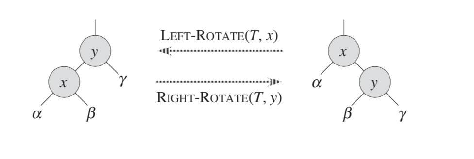
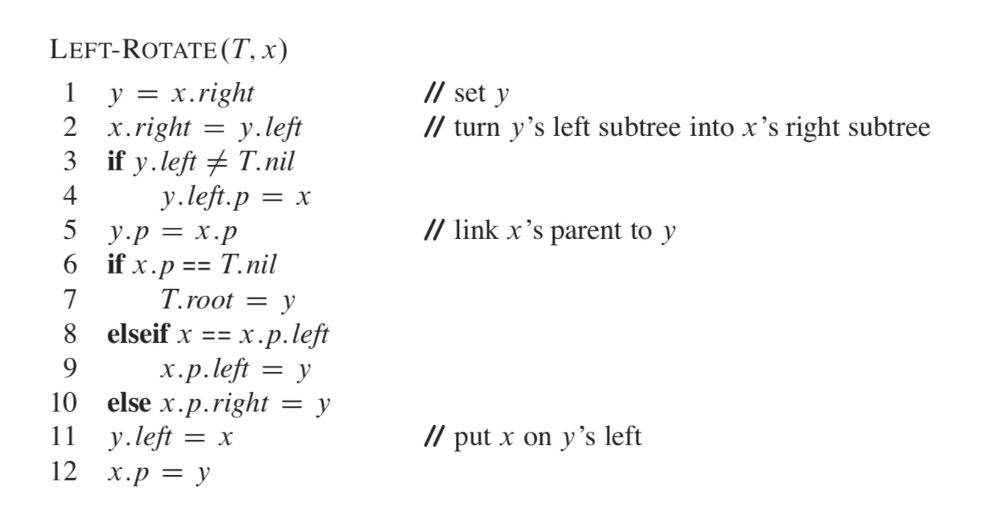

保持平衡的旋转操作应该造成两个节点的颜色互换，也可以考虑将这一变化包含到旋转操作中简化某些情况下手动对节点变色的操作。

#### 插入操作

算法导论中描述的插入操作使用了循环的方式实现，在普通二叉树的插入操作上进行 RB-INSERT-FIXUP 操作修复红黑树性质。

插入节点操作的实现思路是将插入的键值`key`与根节点进行比较，小的话继续在左子树重复此步骤，大的话继续在右子树重复此步骤，记录当前节点知道要出入的位置为空（等于哨兵元素）即找到了目标插入位置。同时注意处理树为空的情况。

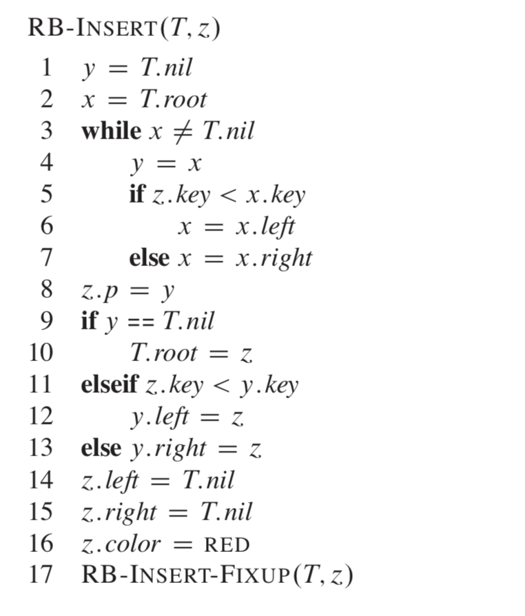

插入的节点默认为红色节点，因为对于一个当前黑平衡的红黑树插入黑色节点是无法保持树的黑平衡的，而插入红色节点不影响红黑树的黑平衡性质（性质 5），只可能破坏性质 1（空树插入一个节点）或者性质 4（在红色节点下插入新的红色节点）。

对于性质 4 的破坏称之为**双红缺陷**，对应有两种情况。

向 4 节点中插入 - 对应 2-3-4 树中的上溢（overflow）情况，即向一个 4 节点中插入新节点会出现 2-3-4 树中允许存在的 5 节点，修复的方法是将 4 节点拆分上浮。在红黑树中是将 4 节点两个红色子节点变为黑色，根节点变为红色，将红色节点上浮进行下一轮循环（同样可以像左倾红黑树中用递归实现）。

向 3 节点中插入 - 修复的方法相当于将标准红黑树中不允许的 4 节点 4 种表示形式转换为形式 5（高度为 1 的对称表示形式）。修复的方法和左倾红黑树中类似，都是将**之字形(zig zag)**的情况转换为**一条直线**的情况再转换为对称表示的情况。需要注意的是和左倾红黑树中不同，标准红黑树中允许存在 4 节点（即 4 节点的形式 5）。

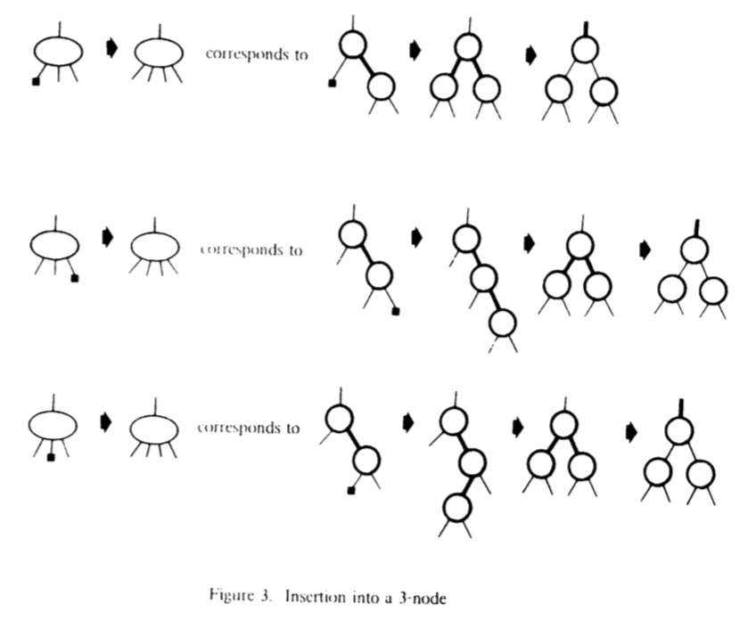

实现中注意区分左倾右倾两种对称的情况，循环结束的情况是父节点不是红色节点，即不再出现连续红色节点，性质 4 被修复。最后循环结束时红色节点可能被上浮到了父节点，因此将父节点颜色重新修改为黑色，修复性质 2。

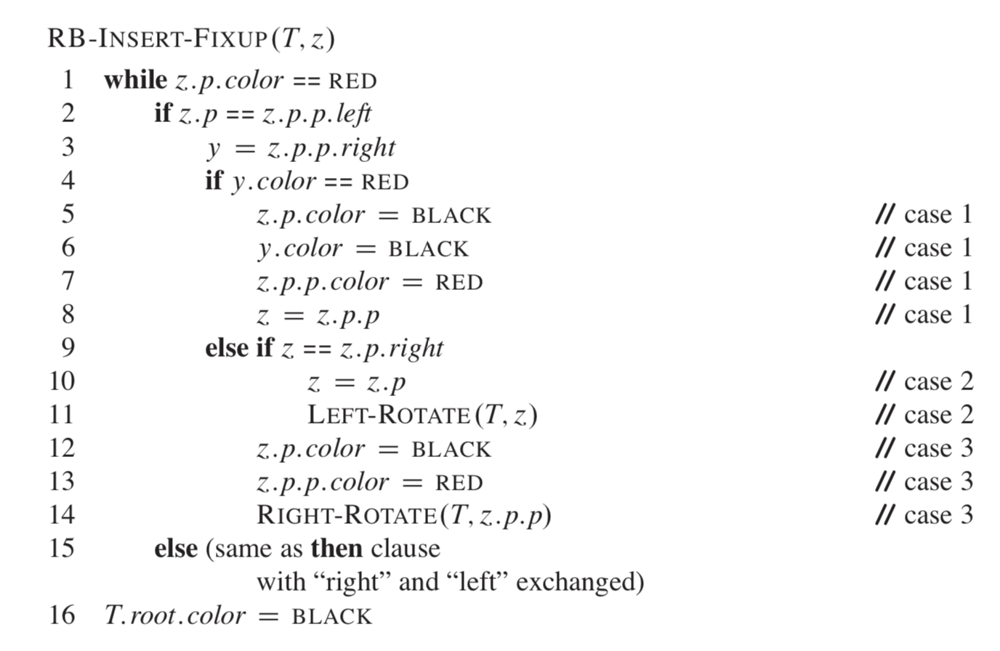

#### 持久化数据结构（persistent data structure）

注意红黑树的插入操作修复过程只需要常数时间的旋转操作（改变二叉树拓扑结构）和最多$O(\log n)$的变色操作（只改变节点数据不改变二叉树拓扑结构）。相比于 AVL 树，红黑树的插入和删除操作都只需要常数时间的旋转操作，这对于创建持久化数据结构是个重要优势。

#### 删除操作

删除节点的操作也是沿用了普通二叉树删除节点的操作，并在节点删除完成后再修复违反性质的情况。删除节点的过程如下：

1. 二叉搜索找到该节点，如果该节点左子节点或者右子节点为空，可以使用目标节点的子节点直接替代目标节点即可。
2. 如果目标节点有两个非空的子节点，可以找到目标节点的后继节点（successor），该后继节点左子节点必为空，用后继节点替换目标节点，并删除后继节点即可，问题转换为第一种情况。同样也可以使用前驱节点（predecessor）。

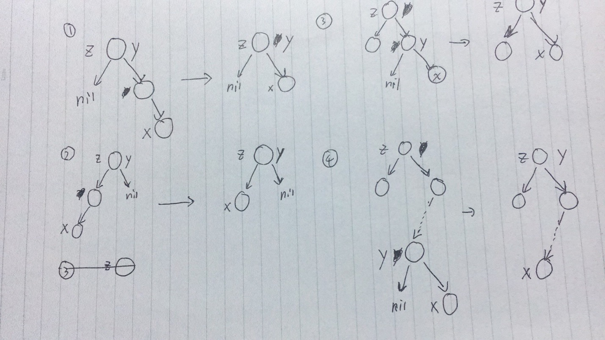

伪代码如下：

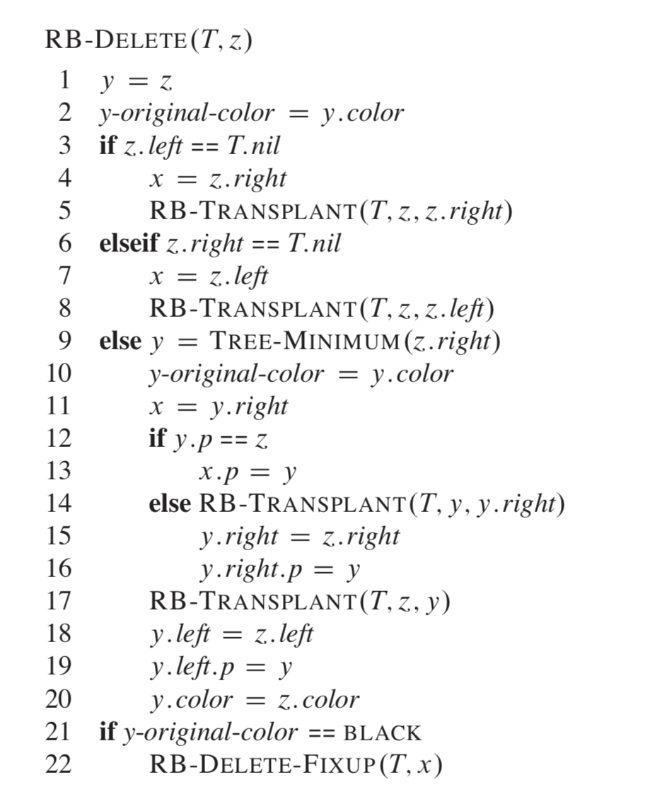

如果被删除的目标节点是红色节点，红黑树的 5 条性质不受影响，这种情况无需任何修复操作。如果被删除的目标节点是黑色，那么该节点到根节点的路径上黑高度-1，这时候如果目标节点的子节点是红色，那么可以简单的将子节点从红色变为黑色，即可修复黑高度平衡。但是如果子节点也是黑色，这时候没法简单修复，称为**双黑缺陷**。

算法导论中对于节点删除操作的修复情况划分不是太好，直接理解较为困难。这里先采用[邓俊辉](https://www.bilibili.com/video/av49361421?p=317)老师的方法。红黑树的节点删除然后修复违反性质重新平衡的过程同样应该从对应的 2-3-4 树去作理解，毕竟红黑树的黑平衡操作就是在模拟 2-3-4 的平衡，这样理解起来更加直观。

这里节点 x 是被删除节点的子节点，节点 x 是黑色，节点 p 是被删除节点的父节点，节点删除后 x 替代被删除节点的位置成为 p 的子节点。节点 s 是 p 的另外一个子节点，也是删除后 x 的兄弟节点。

**情况 1（BB-1）** x 是黑色，兄弟节点 s 是黑色，且 s 有一个红色子节点 t。

这种情况相当于 2-3-4 树中兄弟节点是 3 节点或者 4 节点，这时候可以从兄弟节点中借一个节点过来填补被删除节点的位置恢复 2-3-4 树的平衡。注意图中节点 x 是 p 的右子节点，对称的情况 x 是 p 的左子节点解决方法类似。

节点 t 和 s 组成了一个三节点，借一个节点给作为 x 的父节点即可修复 2-3-4 树平衡。但是在红黑树中注意到`t < s < p`，应该将节点 p 右旋，这样根节点 s 成为节点 p、t 的父节点，然后将节点 t 设置为黑色。图中的情况 t 是 s 的左子节点，如果 t 是 s 的右子节点，那么应该首先将红色右子节点转换为红色左子节点。

1~2 次旋转（s 旋转，p 旋转），3 次变色（t, s, p 各变色一次）。

图中白色节点代表颜色不定，黑色红色都可能。

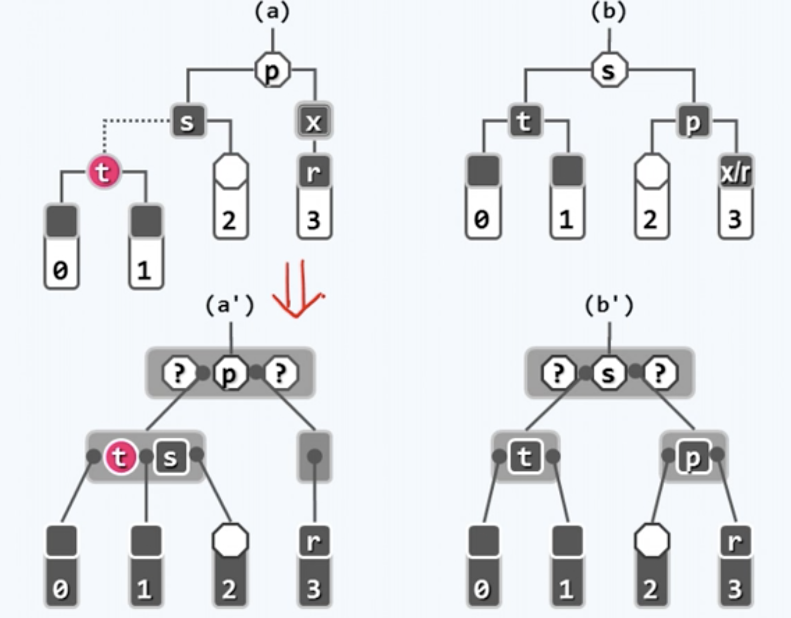

**情况 2（BB-2R）** x 是黑色，兄弟节点 s 是黑色且没有红色子节点，父节点 p 是红色。

这种情况在 2-3-4 树中相当于兄弟节点是 2 节点，没有多余节点可以借，但是父节点是 3 节点或者是 4 节点，可以将父节点 p 从上层脱离，与子节点 s 组合（merge）成一个 3 节点。因为 p 是红色，位于 3 节点或者 4 节点内，所以将 p 脱离不影响上层节点的平衡。需要注意的是节点 s 应该修改为红色，因为节点 s 和 p 合并组成一个 3 节点。

0 次旋转，2 次变色。

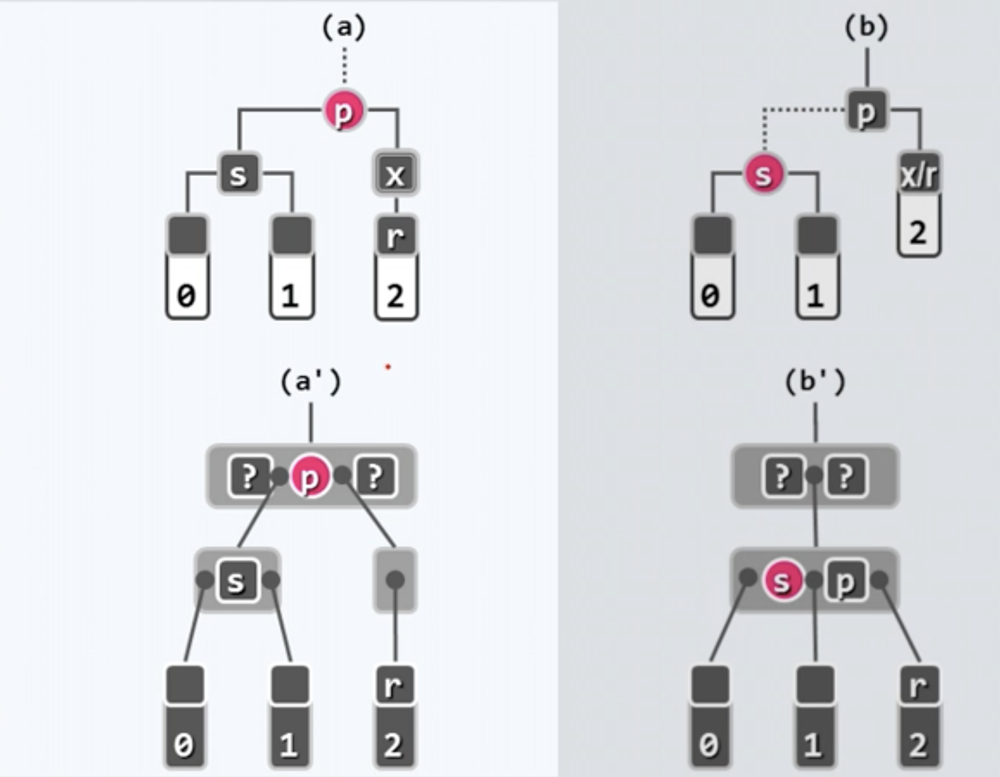

**情况 2（BB-2B）** x 是黑色，兄弟节点 s 是黑色且没有红色子节点，父节点 p 是黑色。

与 BB-2R 一样需要将节点 p 从上层挪下来与 s 合并形成 3 节点，所以 s 变为红色。但是此时 p 节点下溢操作向上传递，需要循环处理直到根节点或者所在节点是红色节点（对应删除节点子节点是红色的简单修复情况）。

0 次旋转，1 次变色。

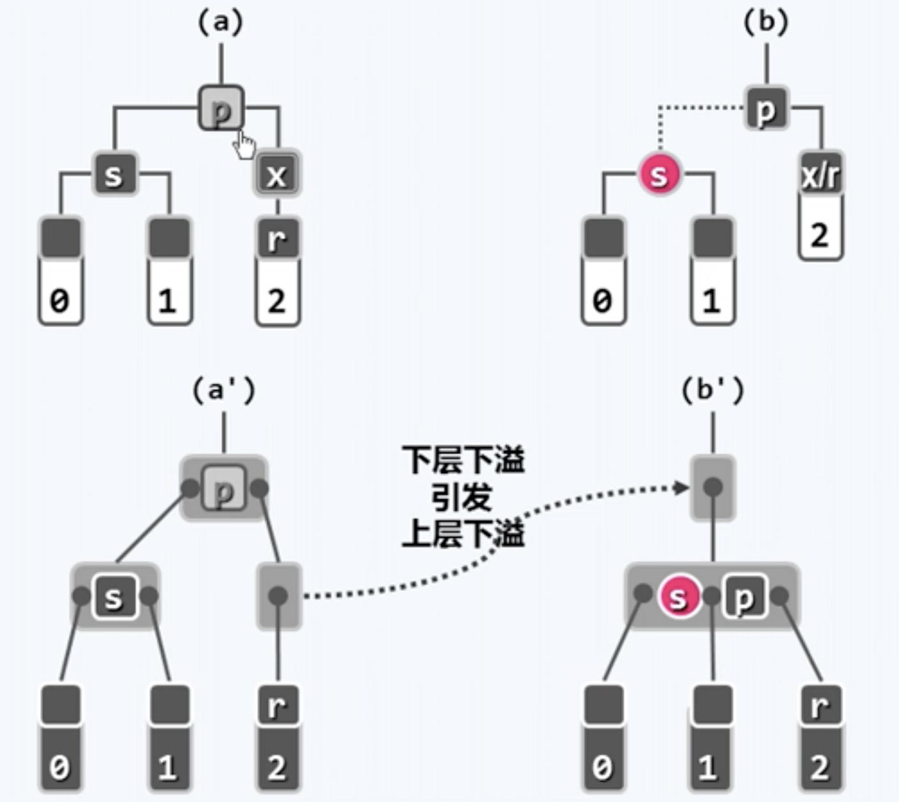

**情况 3（BB-3）** x 是黑色，兄弟节点 s 是红色。

将节点 p 进行右旋，转换成 BB-1 和 BB-2R 的情况，不可能转换成 BB-2B 因为父节点 p 是红色。

1 次旋转，2 次变色。

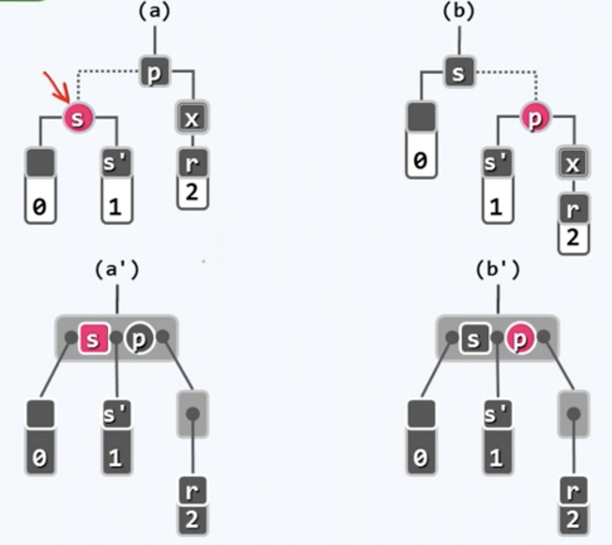

最后情况转换流程与统计如下:

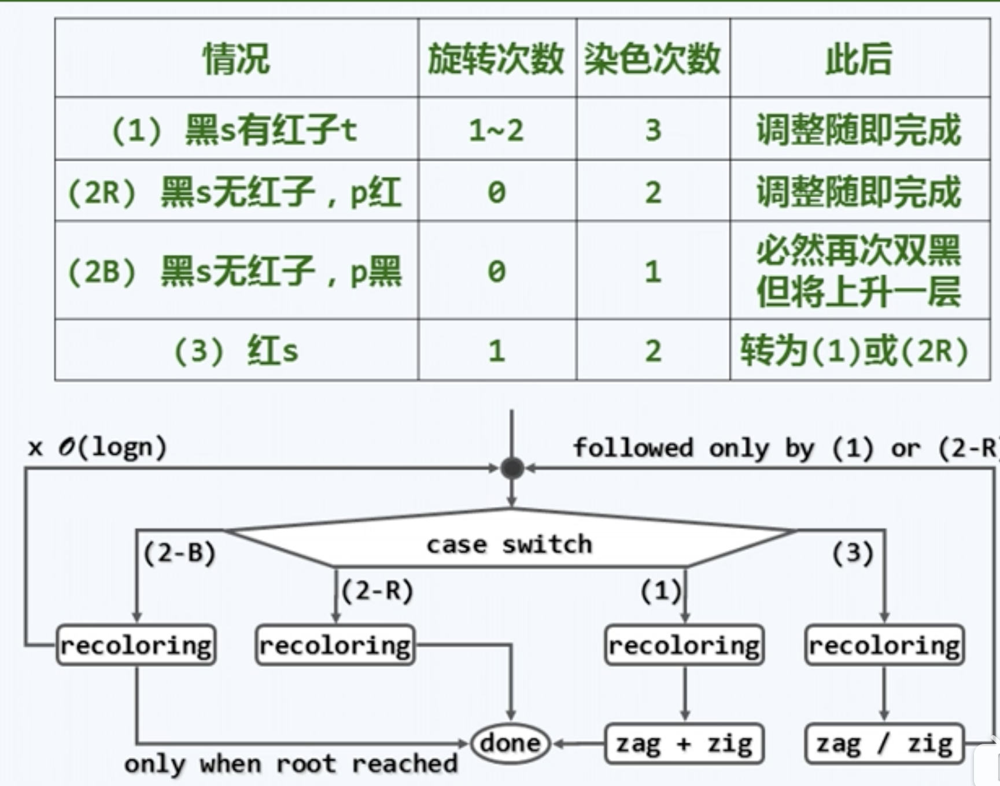

删除操作修复需要的旋转操作是常数级别，染色操作最坏情况是$O(\log n)$。

从每个情况的条件很容易看出这四种情况涵盖了所有可能的情况。

下面将其对应到算法导论介绍的情况分类中。

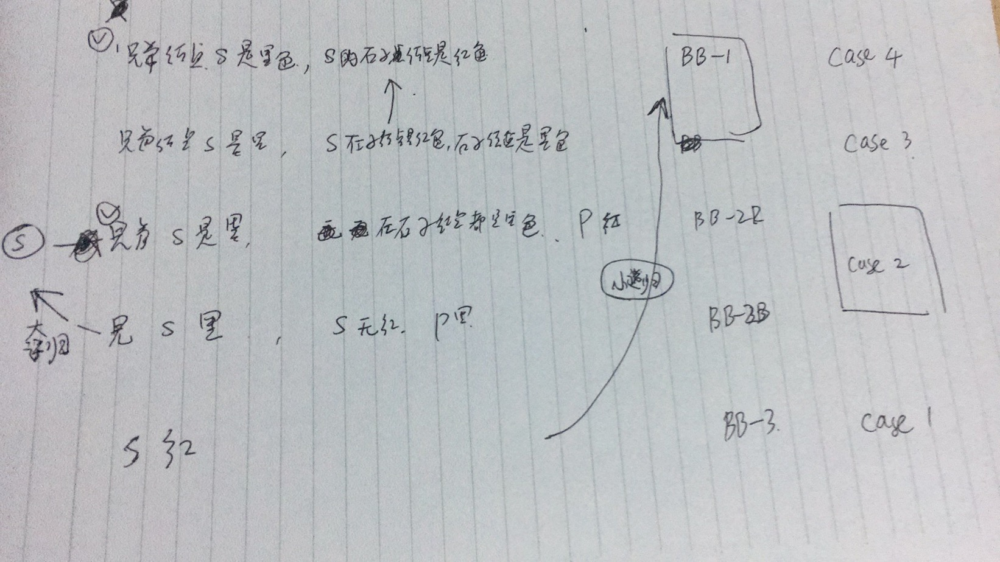

算法导论中情况的划分对应的伪代码实现。需要注意的是 Case 1 可以转化为其他三种，Case 3 转化为 Case 4，Case 2 可能下一轮终结或者重新转换为所有情况。该伪代码实现的方式是将能够转为其他情况的 Case 1 放在最前面，使用一个`if`语句转化为其他三个 Case 的情况，然后使用 if-else 并列处理 Case 2 和 Case 3/Case 4。

Case 2 中如果 x.p 的颜色是红色则下一轮循环结束，从 11 行->1 行->23 行染色（对应 BB-2R 中的颜色操作）。23 行另外的情况就是递归到根节点，x 是根节点，将根节点颜色恢复为黑色。

21 行中 Case 3/Case 4 是已经完成修复，所以设置`x = T.root`终结循环。

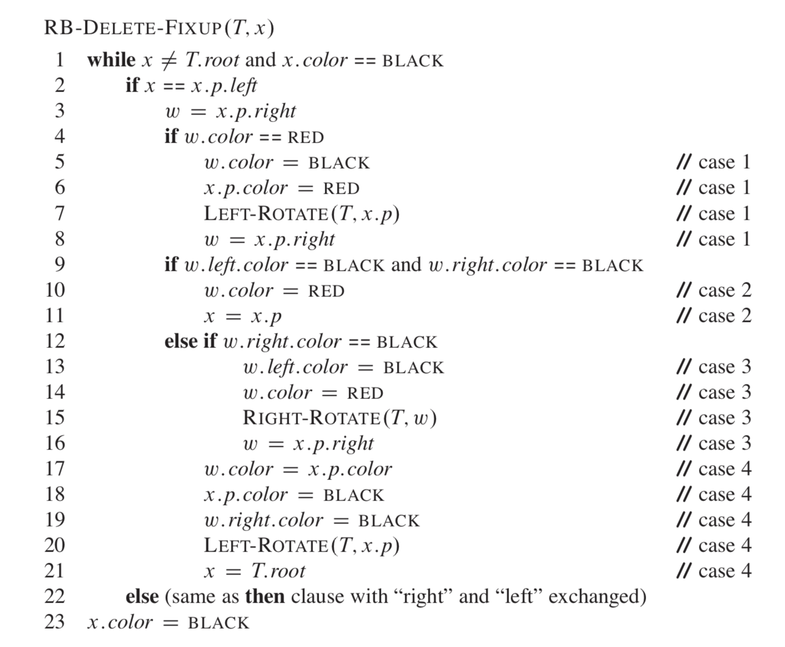

#### 连接操作（Join）

#### 红黑树具有记忆性 13.4-7

#### 自上而下插入（Top-Down Insertion)

算法导论中描述的插入方法是自下而上插入，先从根节点自上而下找到树底部插入的目标位置，然后再自下而上的修复性质 4。

自上而下的插入方法可以从上到下只进行一遍节点遍历，但是遍历的过程中要保证当前节点始终是 2 节点或者 3 节点，这样就不会出现下 4 节点插入而违反性质 4 的情况。这种方法对应 2-3-4 树中的子上而下插入方法。

#### 自上而下删除（Top-Down Deletion)

[参考文章](https://eternallyconfuzzled.com/red-black-trees-c-the-most-common-balanced-binary-search-tree/)

#### 函数式实现

#### concurrent 红黑树

## AVL 树

CLRS 13-3

## Treap 树

CLRS 13-4

## 伸展树

Splay Tree

## B 树

## B+树
