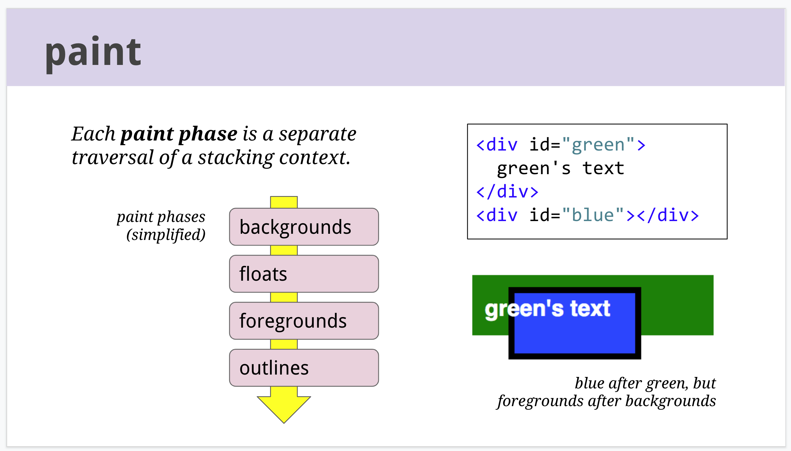

# Painting

元素的绘制是[分层的](https://www.w3.org/TR/CSS21/zindex.html)

一个 block renderer 的顺序是

1. 背景色
1. 背景图片
1. 边框
1. 子节点
1. 轮廓 outline

父节点的文字内容会位于子节点的背景之上

> Each paint phase is a separate traversal of a stacking context.

z-index 只能改变同层的元素前后关系，一层的元素绘制在一起 atomic

[CSS Painting Order](https://abandonedwig.info/blog/2020/07/03/css-painting-order.html)

遍历渲染树生成 Display List

1. 重绘时避免再次遍历 Render Tree
1. 绘制优化
   1. 剔除不在 viewport 中的绘制项（culling)
   1. 剔除被遮挡的绘制项
   1. visibility: hidden 的元素不产生对应绘制项
   1. 增量重绘，Webkit 会将旧数据保存为 bitmap，只重绘改变的部分
1. 作为中间层存在，可以最终渲染到屏幕、PDF 文件等多种目标

变化的情况

1. 元素颜色变化，只重绘该元素
1. 元素位置变化，只对该元素及其子元素或者兄弟节点进行重排、重绘
1. 添加 DOM 元素
1. 字体变换、viewpor 太大小变化等全局变动

渲染引擎主线程包含事件循环，所有布局、绘制、网络、用户事件都在这里，

1. [Appendix E. Elaborate description of Stacking Contexts](https://www.w3.org/TR/CSS21/zindex.html)

[High Performance Animations](https://www.html5rocks.com/en/tutorials/speed/high-performance-animations/)
[16 毫秒的优化](https://github.com/puterjam/speed_render)
[GPU Accelerated Compositing in Chrome](http://www.chromium.org/developers/design-documents/gpu-accelerated-compositing-in-chrome)

1. [小数像素问题](https://fed.taobao.org/blog/taofed/do71ct/mobile-rem-problem/?spm=taofed.blogs.blog-list.1.71585ac87cGEjF) [LayoutUnit](https://trac.webkit.org/wiki/LayoutUnit?spm=taofed.bloginfo.blog.2.6c895ac8nX9U1j)
