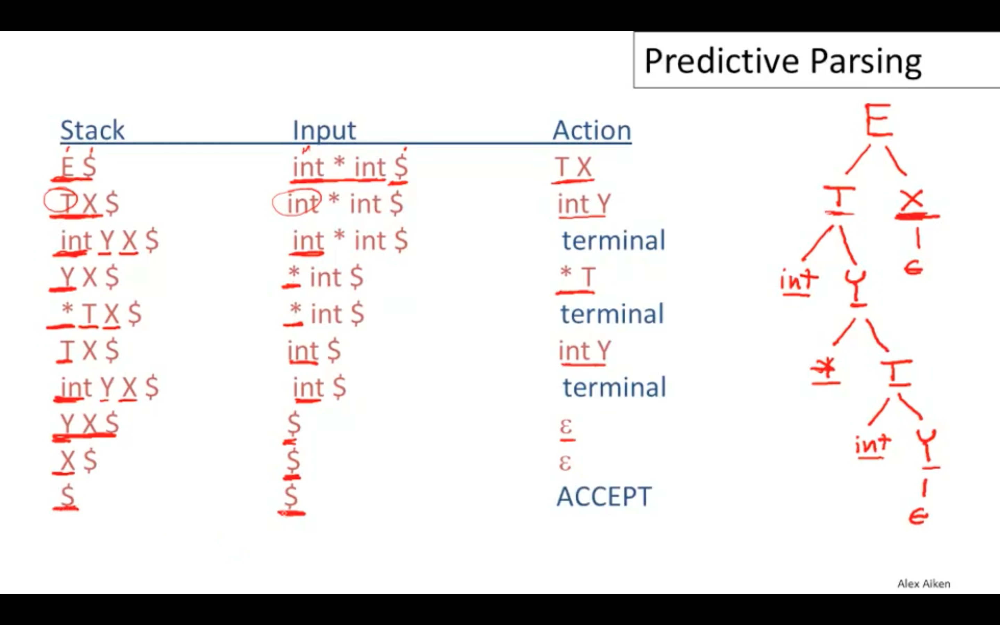
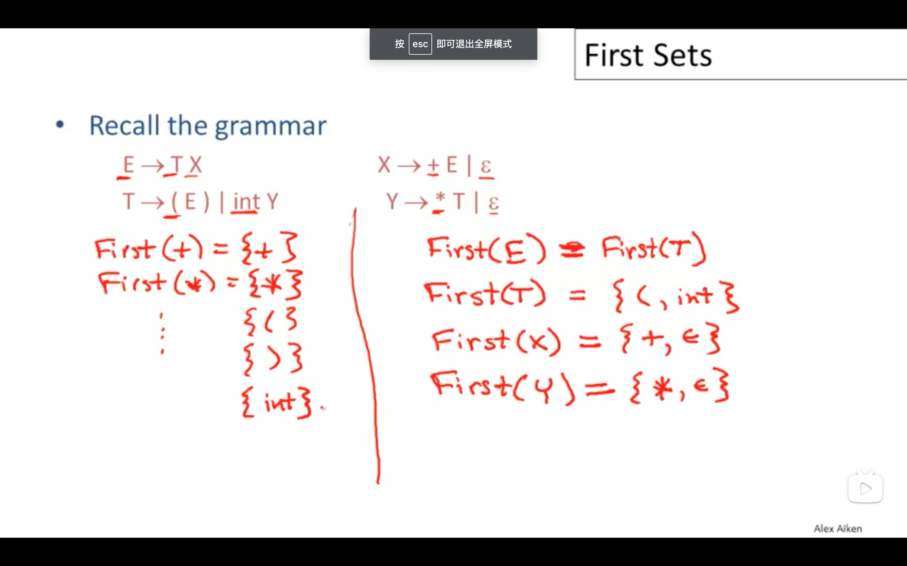
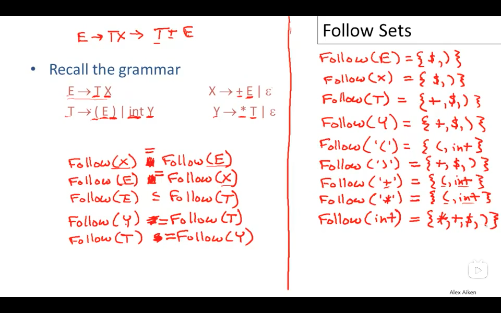

# 编译原理

## 文法

正则文法不能处理嵌套、上下文无关文法支持嵌套

### 二义性

消除文法的二义性

## 解析方法分类

Top Down Parsing
Bottom Up Parsing

## 递归下降解析 Recursive Descent Parsing

最基础的方法

```BNF
E -> T | T + E
T -> int | int * T | ( E )
```

成功的例子，一个选项失败时整个解析过程失败

```cpp
( int )
```

可能存在多个成功的产生式，一个产生式解析成功时整体的解析可能失败，需要尝试其他的可能成功的产生式，

只能解析非终结符最多只有一个产生式会成功的语法

```cpp
int * int
```

使用递归现将解析表达式存在两个问题

1. 如何处理运算符优先级和结合性
1. 在运算符优先级很多的情况下如何高效处理

上下文无关文法中一个子集可以使用无回溯的递归下降分析法

构造这种解析器的两个方法

1. 手写
1. 生成的 LL(1)解析器

带有回溯的递归下降分析，递归写法和循环写法

```txt
root ← node for the start symbol, S;
focus ← root;
push(null);
word ← NextWord();
while (true) do;
    if (focus is a nonterminal) then begin;
        pick next rule to expand focus (A → β1,β2,...,βn);
        build nodes for β1 , β2 . . . βn as children of focus;
        push(βn, βn−1, ..., β2);
        focus ← β1;
    end;
    else if (word matches focus) then begin;
        word ← NextWord();
        focus ← pop()
    end;
    else if (word = eof and focus = null)
        then accepttheinputandreturnroot;
        else backtrack;
    end;
end;
```

### 左递归

左递归

```BNF
S -> Sa | b

S -> bS'
S' -> aS' | empty
```

间接左递归

```BNF
S -> Aa | b
A -> Sc
```

```BNF
Expr → Expr + Term
    | Expr - Term
    | Term
Term → Term x Factor
    | Term ÷ Factor
    | Factor
```

手动消除左递归

```
Expr → Term Expr′
Expr′ → + Term Expr′
    | - Term Expr′
    | ε

Term → Factor Term′
Term′  → x Factor Term′
    | ÷ Factor Term′
    | ε
```

有算法自动消除左递归 Dragon Book

```txt
impose an order on the nonterminals,A1, A2, ..., An
for i ← 1 to n do;
    for j ← 1 to i - 1 do;
        if ∃ a production Ai→Aj γ
            then replace Ai→Ajγ with one or more productions that expand Aj
    end;
    rewrite the productions to eliminate any direct left recursion on Ai
end;
```

类似图论中的循环问题

外层循环的循环不变量，对于 k < i 的情况，Ak 的所有产生式都中不能存在以 Al 开头的，l < k，

```txt
∀ k < i, no production expanding Ak has Al in its rhs, for l < k.
```

### Backtrack Free Parsing

是可回溯的递归下降分析法对应语法的子集 LL(k) 语法

1. left-to-right 对输入进行从左到右处理
1. leftmost-derivation 有限处理最左侧的非终结符
1. k 个预看 token 主要使用 k = 1

left-factoring 转换 LL(1)语法

```BNF
E -> T + E | T
T -> int | int * T | ( E )
```

```BNF
E -> T X
X -> + E | ε
T -> int Y | ( E )
Y -> \* T | ε
```

Predictive Parsers

使用 Parse Table 解析输入

```txt
initialize stack = <S $> and next
repeat
    case stack of
    <X, rest> : if T[X, *next] = Y1, ..., Yn
        then stack <- <Y1, ..., Yn, rest>;
        else error();
    <t, rest> : if t == *next++
        then stack <- <rest>;
        else error();
until stack == <>
```

一个例子

E$, int * int$ Action



对于一个非终结符 A, 输入 t 选用规则 P = A -> b 的情况。

1. t 可以作为非终结符 A 的第一个终结符，t belongs First(b)
1. 或者非终结符 A 可以是展开为空，t 能够跟在 A 的后边，t 属于 Follow(A)

First Set

1. 终结符 a 的 First(a) = { a }
1. A -> a | B C
   1. a 属于 First(A)
   1. First(B) 属于 First(A)
   1. 如果 B -> ε，First(C) 属于 First(A)
   1. A -> ε， ε 属于 First(A)

先要计算 A -> ε



Follow Set

X -> A B

1. First(B) 属于 Follow(A)， Follow(X) 属于 Follow(B)
1. 如果 B -> ε，First(X)属于 Follow(A)
1. $ 属于 Follow(S)



Parsing Table

A -> a

1. 终结符 t 属于 First(a) T[A, t] = a
1. First(a)可以是 ε，t 属于 Follow(a)， T[A, t] = a
1. First(a)可以是 ε，$属于 Follow(A)， T[A, $] = a

1. [Predictive Parser](https://www.bilibili.com/video/BV1Ms411A7EP?p=28)

### Operator Precedence

表达式文法定义

```BNF
E --> E "+" E
    | E "-" E
    | "-" E
    | E "*" E
    | E "/" E
    | E "^" E
    | "(" E ")"
    | v
```

经典解决方法，通过定义更多的中间语法规则区分运算符的优先级

```BNF
E --> T {( "+" | "-" ) T}
T --> F {( "*" | "/" ) F}
F --> P ["^" F]
P --> v | "(" E ")" | "-" T
```

缺点

1. The size of the code is proportional to the number of precedence levels.
1. The speed of the algorithm is proportional to the number of precedence levels.
1. The number of precedence levels and the set of operators is built in.

第一个问题可以通过一个带有优先级参数的函数替换多个手写的函数实现。
第二个问题无法避免，一个标识符的解析跟优先级层数成线性关系。

1. [Parsing Expressions by Recursive Descent](https://www.engr.mun.ca/~theo/Misc/exp_parsing.htm)
1. https://eli.thegreenplace.net/tag/recursive-descent-parsing
1. [自上而下的运算符优先解析](https://firecodelab.com/blog/translate-top-down-operator-precedence-parsing/)
1. [From Precedence Climbing to Pratt Parsing](https://www.engr.mun.ca/~theo/Misc/pratt_parsing.htm)
1. [斯坦福大学 编译原理 递归下降解析](https://www.bilibili.com/video/BV1Ms411A7EP?p=24)

### Operator Precedence Parser

https://en.wikipedia.org/wiki/Operator-precedence_parser

### Precedence Climbing

能够处理的语法是由二元运算符连接原子表达式组成的表达式。

优先级

每个二元运算符都有预先定义好的一个自然数代表其优先级，数值越大优先级越高。

分析例子

```js
2 + 3 * 4 * 5 - 6
```

一个表达式包含的所有二元运算符的最小优先级决定了当前原子表达式和后续原子表达式之间的顺序，

```js
1 + 2 * 3

1 * 2 + 3
```

结核性

左结合、右结合

```js
1 + 2 + 3
```

```cpp
1 ^ 2 ^ 3
```

通过扩展原子表达式的定义可以处理一元表达式，标识符等情况。

三元运算符如何处理？

实际例子

Clang 的编译器前端就是手写的递归下降解析，在`lib/Parse/ParseExpr.cpp`中使用了 Precedence Climbing 方法。

1.  [Parsing Expressions by precedence climbing](https://eli.thegreenplace.net/2012/08/02/parsing-expressions-by-precedence-climbing)
1.  [The top-down parsing of expressions](https://www.antlr.org/papers/Clarke-expr-parsing-1986.pdf)
1.  [Pratt Parsing and Precedence Climbing Are the Same Algorithm](http://www.oilshell.org/blog/2016/11/01.html)
1.  [Top Down Operator Precedence Vaughan R. Pratt](https://dl.acm.org/doi/10.1145/512927.512931)
1.  [Top Down Operator Precedence Douglas Crockford](https://www.crockford.com/javascript/tdop/tdop.html)
1.  Beautiful Code Chapter 9 Top Down Operator Precedence Douglas Crockford

### Shunting Yard

### TDOP

1. [Essentials of Programming Language](http://www.eopl3.com/)

1. [Beautiful Code](https://eli.thegreenplace.net/2007/09/28/book-review-beautiful-code-edited-by-andy-oram-greg-wilson/)

1. http://www.yinwang.org/
1. https://blog.csdn.net/ViVivan1992/article/details/101302986

## Bottom Up

自底向上解析
