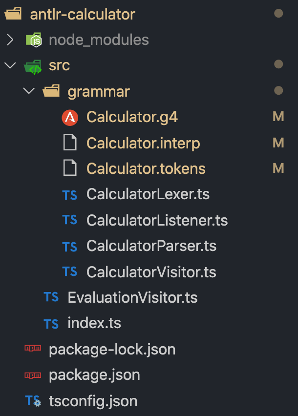

# 通过例子学习 ANTLR

Babel 是前端生态中基础的编译器工具，提供了 Javascript 语言新特性的支持。同时 Babel 也提供了解析语法插件，例如 Typescript 插件，开启后可以解析 TS 代码。

但是 Babel 只能支持预定义的扩展语法，对于自定义的语法进行解析的话需要自行实现，使用 ANTLR 可以帮助我们快速完成自定义语法解析及相关功能。

下面以一个简单的数学表达式语法为例来介绍一下 ANTLR 的使用。

## 第一步 设立目标

我们的目标是够完成一个语言`Calculator`，能够进行基本的数学运算。

### 二元运算

首先需要支持加减乘除、乘方等基础的二元运算。

```cpp
1 + 2 - 3
1 * 2 / 3
1 ^ 2 ^ 3
```

所有的二元运算形式都是`操作数 操作符 操作数`的形式，一个二元操作符左右各有一个操作数。

二元操作符有结合律的问题，加减乘除都是左结合的，乘方操作是右结合的。

```cpp
(1 + 2) - 3   // 左结合
(1 * 2) / 3   // 左结合
1 ^ (2 ^ 3)   // 右结合
```

另外操作符之间具有优先级，乘方高于乘除操作，高于加减操作。

```cpp
1 + 2 * 3 ^ 4
1 + (2 * (3 ^ 4))   // 括号显式标出优先级
```

### 一元运算

支持唯一的一个一元运算符前置负号`-`。

```cpp
// -1先组成一元运算，然后作为加法的右操作数
1 + -1;
```

### 变量

变量可以用来保存计算的中间结果，完成更复杂的计算。变量功能需要支持变量赋值和变量作为操作数进行运算两种形式。

```cpp
// 变量赋值
a = 1 + 2
b = 3 * 4
// 变量作为运算数
c = a ^ b
```

### 括号表达式

为了能够调操作符的运算顺序，需要支持括号表达式。

```cpp
// 默认优先级下从右到左计算，用括号改变运算顺序，从左到右计算
((1 + 2) * 3) ^ 4
```

### 整体结构

一个完整的`Calculator`语言示例。

```cpp
// 赋值语句
a = 1 + 2
b = 3 * 4
c = a ^ b

// 表达式语句
-c
```

程序有一行或者多行的语句（Statement）组成，语句分为赋值语句（Assignment Statement）、表达式语句（Expression Statement）。

## 第二步 定义词法

为了解析我们定义的语言，首先要对其中的基本元素进行分词处理（Lexing），将代码拆分成基本的单词后方便后续进行分析。

考虑上面定义的功能中例子，首先我们需要支持**数字**。

```cpp
Number: '0' | [1-9][0-9]*;
```

这里直接使用了 ANTLR 的规则语法，开头是规则名称`Number`，大写字母开头表示这个一个**分词**的规则，冒号后边跟着规则的具体定义，一个规则可以有一个或者多个定义，多个定义直接使用`|`分隔，最后是分号`;`结尾，表示规则定义结束。规则定义使用类似正则表达式的语法，这里数字定义只支持整数形式，分成数字`0`或者非零数字开头两种。

变量名的识别对应**标识符**（ID）规则，定义为字母开头，后面跟着若干个数字或者字母。

```g4
ID: [a-zA-Z] [a-zA-Z0-9]*;
```

为了在代码任意位置支持空白和换行需要定义**空白符**，定义为一个或者多个的空白字符（空格、制表符、回车、换行），这里的`-> skip`是为了在识别出空白符后进行**丢弃**处理，因为后续的语法分析过程并不需要空白符。

```g4
WS: [\t \r\n]+ -> skip;
```

加减乘除等操作符也需要分词处理，可以显式定义对应的分词规则，也可以在语法规则使用，自动生成对应分词规则。

## 第三步 定义语法

词法解析完成后需要定义语法，语法文件定义的开头如下，表示定义了一个名称叫做`Calculator`的语法。

```g4
grammar Calculator;
```

程序（program）有一行或者多行语句（statement）组成。

```g4
program: statement+;
```

语句分为赋值语句（assignment）和表达式语句（expr）两种。

```g4
statement: assignment | expr;
```

赋值语句是由标识符、等号、表达式组成。

```g4
assignment: ID '=' expr;
```

表达式分为多种形式，注意表达式本身又可以作为操作数进行运算组成另外的表达式。

```g4
expr
    : '-' expr
    | '(' expr ')'
    | Number
    | ID
    | expr ('^' expr)+
    | expr ('*' | '/') expr
    | expr ('+' | '-') expr
    ;
```

这里使用了左递归的方式定义表达式语法，ANTLR v4 支持直接左递归的语法，单个的数字和变量也是合法的表达式，也是递归定义的出口。

注意这里的规则定义顺序需要符合操作符优先级的要求，同一优先级的操作符定义到一条规则中，排在前边的规则具有较高的优先级。所以定义的顺序是乘方大于乘除操作、大于加减操作。

注意乘方操作具有右结合的性质，所以虽然也是二元操作符，但是使用**循环**的方式来定义，左结合的操作符直接使用普通方式定义。

为了区分表达式规则`expr`的不同情况，为每种情况添加别名，方便后续的分析。

```g4
expr
    : '(' expr ')' #parenExpr
    | '-' expr #minusExpr
    | Number #numberExpr
    | ID #variableExpr
    | expr ('^' expr)+ #powerExpr
    | expr ('*' | '/') expr #mulDivExpr
    | expr ('+' | '-') expr #addSubExpr
    ;
```

## 第四步 生成解析器代码

ANTLR 工具是由 Java 编写的，以 JAR 包的方式提供给用户使用，默认输出的解析器也是 Java 代码。我们使用`antlr4ts`这个包根据语法文件生成 Typescript 代码，首先安装相关的 NPM 包。

```bash
# 运行时库
npm i -S antlr4ts
# 命令行工具
npm i -D antlr4ts-cli
```

然后使用命令对语法文件`Calculator.g4`进行处理，生成 TS 代码。

```bash
antlr4ts ./src/grammar/Calculator.g4
```

得到的文件如下。



## 第五步 表达式计算

通过 ANTLR 生成的代码可以对源代码进行分析得到语法树，然后我们需要对语法树进行分析求值，这里使用典型**访问者模式**进行处理。

考虑下面一个表达式的求值策略，需要对语法树进行**后序遍历**，先对**子节点**进行求值，然后根据**根节点**代表的运算类型对根节点代表的表达式进行求值，递归的计算直到整个树处理完成也就得到了整个表达式的结果。

对解析树的**后序遍历**求值也就是对表达式按照操作符优先级**由高到底**的顺序进行运算。

```
1 + 2 * 3 ^ 4

     +
    / \
   /   *
  /   / \
 /   /   ^
/   /   / \
1  2   3   4
```

ANTLR 给出了访问者模式的基类实现，我们只需要实现子类`EvaluationVisitor`即可，针对不同节点进行处理。

```ts
class EvaluationVisitor
  extends AbstractParseTreeVisitor<number>
  implements CalculatorVisitor<number> {
  variables = new Map()

  /**
   * 二元运算解析使用的通用函数
   */
  visitBinaryExpr(ctx: AddSubExprContext): number {
    const left = this.visitExpr(ctx.expr(0))
    const right = this.visitExpr(ctx.expr(1))
    const op = ctx.getChild(1).text

    switch (op) {
      case '+':
        return left + right
      case '-':
        return left - right
      case '*':
        return left * right
      case '/':
        return left / right
      case '^':
        return Math.pow(left, right)
    }

    throw new Error('invalid binary expr')
  }

  visitMulDivExpr(ctx: MulDivExprContext) {
    return this.visitBinaryExpr(ctx)
  }

  /**
   * 赋值语句
   */
  visitAssignment(ctx: AssignmentContext) {
    const name = ctx.ID().text
    const value = this.visitExpr(ctx.expr())

    this.variables.set(name, value)
    return value
  }

  // 括号表达式
  visitParenExpr(ctx: ParenExprContext): number {
    return this.visitExpr(ctx.expr())
  }

  // 数字表达式
  visitNumberExpr(ctx: NumberExprContext) {
    return Number.parseFloat(ctx.Number().text)
  }

  // 变量
  visitVariableExpr(ctx: VariableExprContext) {
    const name = ctx.ID().text
    if (!this.variables.has(name)) {
      throw new Error(`变量${name}不存在！`)
    }
    return this.variables.get(name)
  }
}
```

完整的代码例子。

```ts
import { ANTLRInputStream, CommonTokenStream } from 'antlr4ts'
import { CalculatorLexer } from './grammar/CalculatorLexer'
import { CalculatorParser } from './grammar/CalculatorParser'
import { EvaluationVisitor } from './EvaluationVisitor'

function startMathRepl(input) {
  // 输入字符流
  const inputStream = new ANTLRInputStream(input)
  const lexer = new CalculatorLexer(inputStream)
  // 输入Token流
  const tokenStream = new CommonTokenStream(lexer)
  // 解析得到ParseTree
  const parser = new CalculatorParser(tokenStream)
  const tree = parser.prog()

  // 访问者模式对解析树进行处理
  const visitor = new EvaluationVisitor()
  visitor.visit(tree)
}
```

这里的代码包含三个部分。

1. `antlr4ts`库是依赖的运行时库
1. `CalculatorLexer`/`CalculatorParser`是根据语法生成的解析代码。
1. `EvaluationVisitor`是根据需要完成的业务代码。

使用示例。

```ts
startMathRepl(`
a = 1 + 2
b = 3
c = a+b
`)

// 输出
3
3
6
```

根据需要定制其他的树遍历逻辑代码，例如可以生成 Babel AST 节点树，然后通过 Babel 生成等价的 Javascript 代码。
