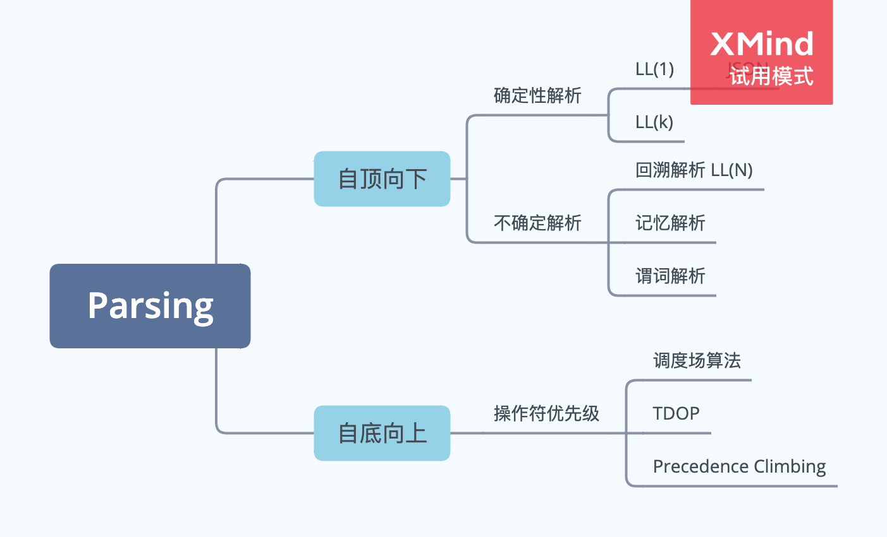
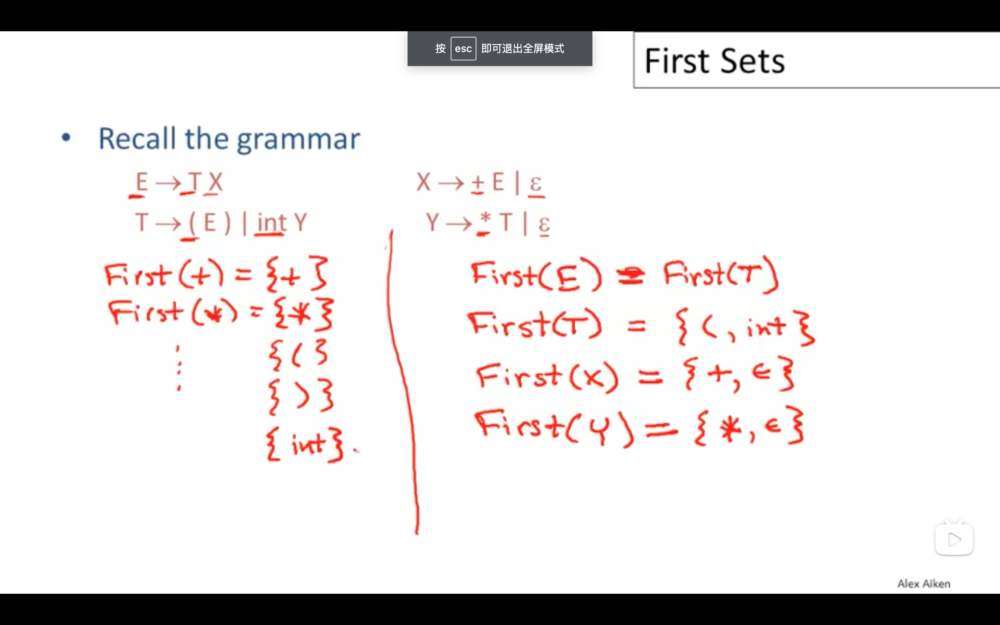
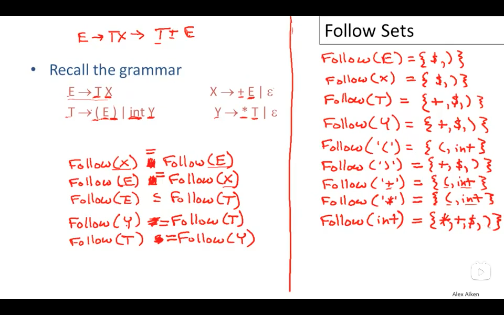

# Parsing

## 词法分析

1. 递归下降的词法分析
1. 使用正则表达式进行词法分析
1. 手动构造状态机 NFA -> DFA

Tokenizer 构造状态机进行分词，有两个问题：

1. 存在关键词 int 和 identifier 模式冲突，为每个构造独立的状态
1. = == === 这种 token 之间模式重合，首选尽可能长的 token，会存在失败回退的情况如何处理?
1. 空白字符被忽略，不产生对应的 token
1. 处理 token 使用状态机转换识别字符串，在一个已经可接受的状态下，需要获取到下一个字符才能确认当前 token 已经结束 ，这里对应了 initToken 的操作，同时 initToken 中的最后一个 else 情况，保持 initial 状态不变，忽略所有未知的 token 模式，包括空白。
1. 循环结束后需要处理之前遗留的最后一个 token，将其添加到 tokens 列表中。

正则表达式与状态机

1. 一组状态，
1. 起始状态
1. 一组接受状态
1. 所有输入组成的字符集 Alphabet
1. 状态转换函数

正则表达式由基本的操作组成

1. concatenation 拼接
1. alternation 选择
1. kleen closure 重复

正则表达式的几种操作有优先级顺序，\* > concatenation > alternation

扩展的几个操作

1. 指定数目的重复 ？+ \* {}
1. 范围 [a-z]
1. 补集操作 [^a]

1. 正则表达式生成 NFA，Thompson 构造，空转换用来连接多个 NFA 模式。
1. NFA -> DFA 子集构造 Subset Construction
1. DFA 最小化 Hopcroft’s Algorithm
1. 使用 NFA，DFA 对一个输入字符串传进行识别，

NFA 对比 DFA，表达能力相同，具有 N 个状态的 NFA 构成出来的 DFA 最多有 2^N 个状态，可能出现状态爆炸的情况，空间要求高，但是 DFA 的执行时间只和输入的长度线性相关，和状态的数目无关。

## Scanner 的实现

### 表格驱动法 (Table-Driver Scanner)

一个 DFA 由三个表格来表示

1. 单个字符到字符分类映射表，将字符划分成不同的种类，同一类的两个字符在 DFA 中应该造成相同的状态转换。对于 Unicode 等字符数目很大的字符集分类处理能显著降低表格大小，如果是 ASCII 这样字符数目比较小的字符集，不分类处理也可以。
1. 二维状态转换表，(S, C) -> S'，状态 S 接受字符类型 C 转换到新状态 S'。
1. 状态到 Token 类型映射表，非接受状态和错误状态（Se）映射到 token 类型是 invalid，代表非法 Token，每个接受状态 S 映射到对应的 Token 类型 T。

使用这三个表格进行分词的逻辑如下：

```js
const STATE_ERROR = -1

const charCategories = []
const transitions = []
const tokenTypes = []

function isAcceptingState() {
  const stateStatus = []
}

function nextToken() {
  // 1. 数据初始化
  let state = s0
  let stack = []
  let lexeme = ''

  // 2. 状态转换直到进入到一个错误状态，这一步是为了获取输入中最长的有效Token
  // 进入错误状态，然后回退到上一个接受状态，就是最长的token
  // 如果之前没有接受状态，就代表从当前输入无法识别合法的token
  while (state !== STATE_ERROR) {
    const char = getChar()
    const category = charCategories[char]
    state = transitions[category]
    if (isAcceptingState(state)) {
      stack = []
    } else {
      stack.push(state)
    }
    lexeme += char
  }

  // 3. 进行回退，直到上一个接受状态或者是开始状态
  while (!isAcceptingState(state) && state !== s0) {
    // 回退一个状态
    state = stack.pop()
    // 回退一个字符
    lexeme.splice(lexeme.length - 1, 1)
    // 输入流需要回退
    ungetChar()
  }

  // 4. 根据回退结束的状态得到对应token类型
  if (isAcceptingState(state)) {
    return tokenTypes[state]
  }

  return TOKEN_INVALID
}
```

另外对于`ab | (ab)*c`这样的模式，输入`abababc`可以一趟匹配完成，但是输入`ababab`第一次匹配发现末尾没有字符'c'然后回退得到 token 'ab'；
消耗掉开头的`ab`后剩余输入`abab`进行下次匹配，这里同样会匹配到末尾然后进行回溯。这种重复匹配模式的情况下，会出现同一个状态，输入的同一个位置进行多次匹配然后回溯，如果回溯操作是单个字符进行的，那么可能出现 O(n^2)的极端回溯情况。为了避免这种情况，需要使用一个二维表格`Failed[state][pos]`记录了状态`state`对于输入位置`pos`是否曾经进行过失败匹配，如果在前一次匹配出现过失败的记录，在第二步中直接**快速**失败，避免极端回溯的情况。注意需要在每次进行匹配前对 Failed 数据进行初始化为 false，pos 重新置 0 将每次重新开始匹配时输入流中的字符标记为起始位置，pos 不代表字符在整个输入流中的位置。

```js
function nextToken() {
  // 1. 数据初始化
  let failed = []
  let pos = 0
  let state = s0
  let stack = []
  let lexeme = ''

  // 2. 状态转换直到进入到一个错误状态，这一步是为了获取输入中最长的有效Token
  // 进入错误状态，然后回退到上一个接受状态，就是最长的token
  // 如果之前没有接受状态，就代表从当前输入无法识别合法的token
  while (state !== STATE_ERROR) {
    const char = getChar()
    const category = charCategories[char]
    // 快速失败
    if (failed[state] && failed[state].has(pos)) {
      break
    }
    pos++
    state = transitions[category]
    if (isAcceptingState(state)) {
      stack = []
    } else {
      stack.push(state)
    }
    lexeme += char
  }

  // 3. 进行回退，直到上一个接受状态或者是开始状态
  while (!isAcceptingState(state) && state !== s0) {
    // 回退一个状态
    state = stack.pop()
    // 回退一个字符
    lexeme.splice(lexeme.length - 1, 1)
    // 输入流需要回退
    const set = (failed[state] || failed[state] = new Set())
    set.add(pos)
    pos--
    ungetChar()
  }

  // 4. 根据回退结束的状态得到对应token类型
  if (isAcceptingState(state)) {
    return tokenTypes[state]
  }

  return TOKEN_INVALID
}
```

自动构造三个表格，可以从最开始状态字符映射表，对于相同的列进行合并，合并后的每一列代表一种字符分类。
这个合并的过程可能使用 Union Find 算法？

不成熟的想法，不记录 stack 没法构造 failed 表格，无法避免极端回溯情况。
这种方式使用 stack 记录了从开始状态或者最近的接受状态进行状态转换的路径，可以用一个变量 lastAcceptingState 记录最近的一个接受状态，`lastAcceptingStateDistance`记录该状态和第二步匹配结束的错误状态之间的距离，同时需要输入流支持一次回退多个字符，这样第三步的操作就能在常数时间完成。

### 直接生成代码

表格驱动法中每个字符的处理需要两次查表操作

1. 字符分类表 O(1)
1. 状态转换表 O(1)

生成代码和查表法使用相同的数据记录 DFA 匹配过程，区别在于使用代码逻辑代替查表操作，消除查表操作的开销，提高解析速度。

核心在与两种运算成本的比较

1. 查表 table[char];
1. 比较 char >= "0" && char <= "9"

尝试分析 ANTLR 生成的 Lexer，使用这种策略。

### 手动实现

前两种方法中字符流是单个字符进行读取或者回退，使用缓冲字符流可以降低每个字符读取的平均开销。如果回溯操作有长度限制，不超过缓冲区长度 N 的限制，
使用双缓冲技术时，可以一次回溯多个字符，回溯操作从 O(N)的时间复杂度降低到 O(1)。

```ts
const BUFFER_SIZE = 4096
const DOUBLE_BUFFER_SIZE = 2 * 4096

// 初始化
let pos = 0
// 有效输入的开始位置，回溯不能超过这个位置
let fence = 0
fillBuffer(0, BUFFER_SIZE)

// 读取下一个字符
function nextChar() {
  const char = buffer[pos]
  pos = (pos + 1) % DOUBLE_BUFFER_SIZE

  if (pos % BUFFER_SIZE === 0) {
    // 一次I/O操作，读取下一个BUFFER
    fillBuffer(pos, pos + BUFFER_SIZE - 1)
  }

  return char
}

// 回溯，最大长度等于BUFFER_SIZE
function rollBack(i) {
    // 回溯长度超出限制
    if (input === fence) {
        throw new Error('rollback error)
    }
    input = (input - i) % DOUBLE_BUFFER_SIZE
}
```

## 空间优化

将编译过程中使用到的所有静态字符串信息进行哈希操作，存储为哈希表，减少内存占用，同时能够提供常数时间的字符串相等操作。

例如解决一个 identifier 是不是保留字的问题，完美哈希方法（perfect hash）。

1. ANTLR 生成的 Lexer 中进行类似的优化处理。
1. [v8 引擎的优化](https://v8.dev/blog/scanner#keywords)
1. https://eli.thegreenplace.net/2013/07/16/hand-written-lexer-in-javascript-compared-to-the-regex-based-ones

## 解析方法分类

Top Down Parsing
Bottom Up Parsing

## 递归下降解析 Recursive Descent Parsing

### 分类

带回溯的递归下降解析 带回溯的的解析器相当于能够预看任意个符号，因此解析能力强于 LL(k)解析器，但是回溯的运算代价比较高。
为什么需要任意个预看符号，例如函数声明和定义的结构只在最右边有区别，而函数定义可以无限长，所以无法使用 LL(k)解析。缓冲区可以增长以
支持任意长度的预看符号。分成推演和实际匹配两个过程。

```cpp
// 函数定义
void bar() {}
// 函数声明
void bar();
```

[The Packrat Parsing and Parsing Expression Grammars Page](https://bford.info/packrat/)
[Packrat Parsing: a Practical Linear-Time Algorithm with Backtracking](https://pdos.csail.mit.edu/~baford/packrat/thesis/)
[Difference between an LL and Recursive Descent parser?](https://stackoverflow.com/questions/1044600/difference-between-an-ll-and-recursive-descent-parser/1044678#1044678)

1. 记忆解析器 林鼠解析器 packrat parser Bryan Ford Packrat Parsing: simple, powerful, lazy, linear time, functional pearl
1. 确定性解析 LL(1) JSON
1. LL(k) 寻找例子？ 大小为 k 的环形符号缓冲区
1. 回溯解析，缓冲区的大小可以增加，支持任意多个向前看符号，每个规则解析分为预测匹配(speculating)和实际匹配两个模式。预测匹配只确定规则能否匹配，并不记录具体的匹配结果，匹配结果会在实际匹配时产生。由于递归下降解析规则是逐层嵌套的，所以每个规则与匹配时对应一个位置，需要一个栈来记录逐层嵌套的每个规则对应的开始位置。
1. 记忆解析器，需要记录每个规则在某个位置 index 匹配的结果，有三种情况，未知、匹配成功（成功的情况记录匹配成功的位置 index），匹配失败。
1. 谓词解析器
1. Bryan Ford PEG 表达式文法，《解析表达式文法：基于识别的语法基础》，Parsec 语法谓词

[Parsing Expression Grammars: A Recognition-Based Syntactic Foundation](https://pdos.csail.mit.edu/~baford/packrat/popl04/peg-popl04.pdf)

[Parsec, a fast combinator parser](http://users.cecs.anu.edu.au/~Clem.Baker-Finch/parsec.pdf)



GCC 的前端就是手写的递归下降解析器

#### 参考资料

1. [斯坦福大学 编译原理 递归下降解析](https://www.bilibili.com/video/BV1Ms411A7EP?p=24) 视频资料
1. [Recursive descent parsing Eli Bendersky's website](https://eli.thegreenplace.net/tag/recursive-descent-parsing) 入门文章

### 带回溯的递归下降解析

最基础的方法

```BNF
E -> T | T + E
T -> int | int * T | ( E )
```

成功的例子，一个选项失败时整个解析过程失败

```cpp
( int )
```

可能存在多个成功的产生式，一个产生式解析成功时整体的解析可能失败，需要尝试其他的可能成功的产生式，

只能解析非终结符最多只有一个产生式会成功的语法

```cpp
int * int
```

递归下降解析器问题

1. 根据文法情况分类书写对应函数，每个文法对应函数应该考虑失败的情况
1. 语法错误直接抛出异常
1. 语法正确，但是该产生式不合适需要返回 null 表示这种情况，然后在上层继续尝试其他的产生式
1. token stream 的回溯

上下文无关文法中一个子集可以使用无回溯的递归下降分析法

构造这种解析器的两个方法

1. 手写
1. 生成的 LL(1)解析器

带有回溯的递归下降分析，递归写法和循环写法

```txt
root ← node for the start symbol, S;
focus ← root;
push(null);
word ← NextWord();
while (true) do;
    if (focus is a nonterminal) then begin;
        pick next rule to expand focus (A → β1,β2,...,βn);
        build nodes for β1 , β2 . . . βn as children of focus;
        push(βn, βn−1, ..., β2);
        focus ← β1;
    end;
    else if (word matches focus) then begin;
        word ← NextWord();
        focus ← pop()
    end;
    else if (word = eof and focus = null)
        then accepttheinputandreturnroot;
        else backtrack;
    end;
end;
```

### 左递归

递归下降分析法无法处理包含左递归的文法

```BNF
S -> Sa | b

S -> bS'
S' -> aS' | empty
```

间接左递归

```BNF
S -> Aa | b
A -> Sc
```

```BNF
Expr → Expr + Term
    | Expr - Term
    | Term
Term → Term x Factor
    | Term ÷ Factor
    | Factor
```

手动消除左递归

```
Expr → Term Expr′
Expr′ → + Term Expr′
    | - Term Expr′
    | ε

Term → Factor Term′
Term′  → x Factor Term′
    | ÷ Factor Term′
    | ε
```

有算法自动消除左递归 Dragon Book

```txt
impose an order on the nonterminals,A1, A2, ..., An
for i ← 1 to n do;
    for j ← 1 to i - 1 do;
        if ∃ a production Ai→Aj γ
            then replace Ai→Ajγ with one or more productions that expand Aj
    end;
    rewrite the productions to eliminate any direct left recursion on Ai
end;
```

外层循环的循环不变量，对于 k < i 的情况，Ak 的所有产生式都中不能存在以 Al 开头的，l < k，

```txt
∀ k < i, no production expanding Ak has Al in its rhs, for l < k.
```

### Packrat Parser

带记忆的递归下降解析器

1. Bryan Ford Packrat parsing: simple, powerful, lazy, linear time, functional parser

### 谓词解析器

上下文相关文法，根据谓词来决定是否启用某个匹配

### 无回溯的递归下降解析（Backtrack Free Parsing）

是可回溯的递归下降分析法对应语法的子集 LL(k) 语法

1. left-to-right 对输入进行从左到右处理
1. leftmost-derivation 有限处理最左侧的非终结符
1. k 个预看 token 主要使用 k = 1

left-factoring 转换 LL(1)语法

```BNF
E -> T + E | T
T -> int | int * T | ( E )
```

```BNF
E -> T X
X -> + E | ε
T -> int Y | ( E )
Y -> \* T | ε
```

Predictive Parsers

使用 Parse Table 解析输入

```txt
initialize stack = <S $> and next
repeat
    case stack of
    <X, rest> : if T[X, *next] = Y1, ..., Yn
        then stack <- <Y1, ..., Yn, rest>;
        else error();
    <t, rest> : if t == *next++
        then stack <- <rest>;
        else error();
until stack == <>
```

一个例子

E$, int * int$ Action


对于一个非终结符 A, 输入 t 选用规则 P = A -> b 的情况。

1. t 可以作为非终结符 A 的第一个终结符，t belongs First(b)
1. 或者非终结符 A 可以是展开为空，t 能够跟在 A 的后边，t 属于 Follow(A)

First Set

1. 终结符 a 的 First(a) = { a }
1. A -> a | B C
   1. a 属于 First(A)
   1. First(B) 属于 First(A)
   1. 如果 B -> ε，First(C) 属于 First(A)
   1. A -> ε， ε 属于 First(A)

采用不动点计算方法，直到所有的非终结符的 First(A)不再变化为止，参考 Engineering A Compiler Ch3 P.104。

先要计算 A -> ε



Follow Set

X -> A B

1. First(B) 属于 Follow(A)， Follow(X) 属于 Follow(B)
1. 如果 B -> ε，First(X)属于 Follow(A)
1. $ 属于 Follow(S)

同样采用不动点计算，参考 Engineering A Compiler Ch3 P.106。

对于每一条产生式 Follow Set 需要从后向前分析



定义产生式 A -> B 的 First Set

1. First(B) 如果 First(B)包含 ε
1. First(B) & Follow(A) 如果 First(B)不包含 ε

对于任何非终结符 A，如果其所有产生式的 First Set 不重叠，则可以通过预看下一个 token 来唯一选择要使用的产生式，实现无递归的分析。

计算出 First Set/Follow Set 之后有两种方式实现无回溯递归下降分析

1. 手写，非终结符 A 根据输入 token 和 First Set(P)来选择产生式 P 的逻辑转换为代码
2. 表驱动方式，将所有非终结符、token 和 First(P)的关系组成表格数据，根据表格跳转调用。

Parsing Table

A -> a

1. 终结符 t 属于 First(a) T[A, t] = a
1. First(a)可以是 ε，t 属于 Follow(a)， T[A, t] = a
1. First(a)可以是 ε，$属于 Follow(A)， T[A, $] = a

1. [Predictive Parser](https://www.bilibili.com/video/BV1Ms411A7EP?p=28)

### 操作符优先级（Operator Precedence）

使用递归下降解析法解析包含不同优先级操作符的表达式，文法如下。

```BNF
<expr> : <expr> + <expr>
       | <expr> - <expr>
       | <expr> * <expr>
       | <expr> / <expr>
       | number
       | id
```

通过定义更多的中间语法规则区分运算符的优先级

```BNF
<expr> : <term> + <expr>
       | <term> - <expr>
       | <term>

<term> : <factor> * <term>
       | <factor> / <term>
       | <factor>

<factor> : number
         | id
         | '(' expr ')'
```

这种方法在操作符优先级层级很多的时候存在几个[问题](https://eli.thegreenplace.net/2009/03/14/some-problems-of-recursive-descent-parsers)

语法问题，需要定义大量的中间产生式，语法规则复杂。

操作符结合性的问题，递归下降分析方法必须消除左递归，将左递归文法转换为等价的右递归文法。但是右递归文法只能产生右结合的表达式，无法处理左结合的二元表达式。

语法 BNF

add ::= mul | add + mul
mul ::= pri | mul \* pri
pri ::= Id | Num | (add)

扩展巴科斯范式(EBNF)，使用类似正则表达式的写法

```js
<expr> : <term> { + <term> } *
       | <term> { - <term> } *
```

另外由于操作符的优先级是和文法对应的，所以操作符的优先级发生变化，或者新增操作符时都需要修改文法，比较麻烦。同时这种做法不支持在解析时临时调整操作符优先级或者增加操作符。

效率问题，一个简单的数字字面量表达式`1`也需要从最开始的非终结符展开，依次调用所有的产生式对应的解析函数，运行效率比较低。

#### 参考资料

操作符优先级解析方法参考[Wiki](https://en.jinzhao.wiki/wiki/Operator-precedence_parse)

### 为什么操作符会有结合性

操作符的**结合性**只出在以操作数作为第一个和最后一个 token 的表达式中。例如二元表达式`A + B`，首尾都可以出现操作数，所以两个连续的二元表达式出现时，中间那个操作数才会出现左结合或者又结合的问题。

```cpp
a + b + c;
(a + b) + c;    // 左结合
a + (b + c);    // 右结合

a ? b : c ? d : e;
(a ? b : c) ? d : e;    // 左结合
a ? b : (c ? d : e);    // 右结合
```

### Precedence Climbing

Precedence Climbing 方法和 TDOP 一样使用递归加循环的方式自底向上构造解析结果，区别之处在 Precedence Climbing 使用优先级（Precedence）而不是结合力（Binding Power）来解决操作符优先级问题。

整体的表达式解析流程如下。

```js
function expression(min_prec) {
  let result = atom()

  while (true) {
    const token = tokenStream.peek()
    const prec = precedence(token)
    const assoc = associativity(token)
    if (!token || prec < min_prec) {
      break
    }

    tokenStream.consume()
    const next_min_prec = assoc === 'left' ? prec + 1 : prec
    const rhs = expression(next_min_prec)
    result = operator(result, rhs)
  }

  return result
}
```

先调用`atom`获取子表达式，可能是操作数或者是另一个完整的表达式。然后同样在循环中根据当前 token 的优先级分情况处理。

1. 如果 token 优先级小于当前要求的最小优先级`min_prec`，应当提前返回。
1. 如果 token 优先级高于当前要求的最小优先级，继续递归调用`expression`解析右侧表达式，并将表达式返回结果进行组合，直到循环结束，回到第一种情况结束递归。

操作符结合性的问题通过调整表达式要求的最小优先级来处理，连续出现两个相同的操作符，右结合相当于右边的操作符有更高的优先级；左结合相当于左边的操作符有更高的优先级。

1. 对于右结合的操作符，递归调用`expression`时使用`min_prec = prec`，而循环终止的条件是`prec < min_prec`，所以会继续递归调用，形成右结合的效果。
1. 对于左结合的操作符，使用`min_prec = prec + 1`，这样后续遇到的操作符优先级`prec < min_prec`，递归结束，形成左结合的效果。

对于前缀操作符、括号、索引操作符、三元操作符的处理隐藏在`atom`表达式中，根据每种操作符与操作数相对位置的情况，递归的调用`expression`进行解析，思路和 TDOP 相同。

Clang 的编译器前端就是手写的[递归下降解析](https://clang.llvm.org/doxygen/ParseExpr_8cpp_source.html)，在`lib/Parse/ParseExpr.cpp`中使用了 Precedence Climbing 方法。

#### 参考资料

Eli Bendersky 在[《Parsing Expressions by precedence climbing》](https://eli.thegreenplace.net/2012/08/02/parsing-expressions-by-precedence-climbing)，针对只包含二元运算符的表达式，解释了 Precedence Climbing 方法的原理，对运算符**优先级**和**结合性**的问题给出解释。对于前缀操作符，文章建议将其当做子表达式来处理，这种做法相当于定死了前缀操作符的优先级高于任何二元操作符，`-x+y`固定解析为`(-x)+y`而不是`-(x+y)`，无法调整前缀操作符合二元操作符的优先级顺序。另外这篇文章没有对后置操作符、索引操作符、三元操作符的情况进行描述。

Nystrom 在[Pratt Parsers: Expression Parsing Made Easy](http://journal.stuffwithstuff.com/2011/03/19/pratt-parsers-expression-parsing-made-easy/)中使用面向对象的方法实现了表达式解析，不同的操作符的解析代码位于各自的类中，代码组织结构十分清晰，且容易扩展新的操作符，开闭原则（Open to extension, close to modification），参考[Bantam](https://github.com/munificent/bantam)语言实现。

Theodore Norvell 在[Parsing Expressions by Recursive Descent](https://www.engr.mun.ca/~theo/Misc/exp_parsing.htm#climbing)中对于 Precedence Climbing 进行了比较详细的描述，给出了包含前置操作符优先级处理的例子，并将其推广为表格驱动的解析方法。另外 Precedence Climbing 这个说法也是他提出的。

在[《From Precedence Climbing to Pratt Parsing》](https://www.engr.mun.ca/~theo/Misc/pratt_parsing.htm)中，Theodore Norvell 讨论了 TDOP 和 Precedence Climbing 方法之间的联系，并使用命令模式（Command Pattern）对 Precedence Climbing 进行改造，最终达到和 TDOP 相同的效果。

[《The top-down parsing of expressions》](https://www.antlr.org/papers/Clarke-expr-parsing-1986.pdf)Keith Clarke 的原文。

### 调度场算法（Shunting-Yard Algorithm）

[调度场算法](https://en.jinzhao.wiki/wiki/Shunting-yard_algorithm)对表达式的解析过程与上面两种方法类似，区别在于使用栈代替了递归，使用一个操作数的栈和一个操作符的栈分别记录已经处理过的 token。

```js
function shuntingYard(tokenStream) {
  const operatorStack = []
  const operandsStack = []

  while (true) {
    const token = tokenStream.peek()
    if (!token) {
      break
    }

    // 操作数直接入栈
    if (token.type === 'number') {
      push(token)
      continue
    }

    const prec = precedence(token)

    // 栈顶操作符如果优先级高于当前token操作符优先级，全部出栈
    while (prec < top(operatorStack)) {
      pop()
    }
  }

  // 清空操作数栈，这里可以把EOF token优先级设置为0，这样可以复用上边循环中相同的逻辑
  while (operators.length > 0) {
    pop()
  }

  // 操作数
  return top(operandsStack)
}

function top(stack) {
  return stack[stack.length - 1]
}

function precedence() {}

function pop() {
  const operator = operatorStack.pop()
  const operand2 = operandStack.pop()
  const operand1 = operandStack.pop()

  const newOperand = operator(operand1, operand2)
  push(newOperand)
}
```

算法结束后操作数栈中应该有一个操作数，这个操作数就是最终结果。操作数栈也可以改造为 ASTNode 的栈，这样最终得到的就是解析完成的抽象语法树。

TODO: 补充对于操作符的优先级、结合性、Unary、Binary、Ternary 的处理。

讨论 Pratt Parser 和 Dijkstra 之间的关系 [From Pratt to Dijkstra](https://matklad.github.io/2020/04/15/from-pratt-to-dijkstra.html)

#### 参考资料

Theodore Norvell 在[Parsing Expressions by Recursive Descent](https://www.engr.mun.ca/~theo/Misc/exp_parsing.htm#shunting_yard)介绍了调度场算法

### LL(k)递归下降解析

不修改语法，构建 k 个预看 token 的环形缓冲区来支持。

## Bottom Up

自底向上解析

## 解释器生成器（Parser Generator）

使用解释器生成器根据文法自动生成解释器代码，例如[antlr4ts](https://www.npmjs.com/package/antlr4ts)可以生成 TS 代码。

1. [Modern Parser Generator](https://matklad.github.io/2018/06/06/modern-parser-generator.html)
1. PEG https://zhuanlan.zhihu.com/p/355364928
1. https://tomassetti.me/guide-parsing-algorithms-terminology/
1. https://tomassetti.me/resources-create-programming-languages/
1. https://tomassetti.me/parsing-in-javascript/

ANTLR

1. https://tomassetti.me/best-practices-for-antlr-parsers/

1. [list of languages that compile to js](https://github.com/jashkenas/coffeescript/wiki/list-of-languages-that-compile-to-js)

1. [A Unified Theory of Garbage Collection](https://researcher.watson.ibm.com/researcher/files/us-bacon/Bacon04Unified.pdf)

1. [The Next 700 Programming Languages](https://homepages.inf.ed.ac.uk/wadler/papers/papers-we-love/landin-next-700.pdf)

### Small Languages

1. Lox From Crafting Interpreters
1. http://finch.stuffwithstuff.com/

1. https://craftinginterpreters.com/contents.html

1. floating point numbers https://docs.oracle.com/cd/E19957-01/806-3568/ncg_goldberg.html

### 语言设计与实现问题

1. parser 中常用的几个函数

   1. 向前看符号 lookahead
   1. 检查下一个向前看符号类型 check
   1. 下一个向前看符号是某个类型的话，消耗掉并返回 true，不是的话返回 false； tryMatch(type) ?
   1. 下一个向前看符号是某个类型的话，消耗掉并返回该 Token，不是的话报错。 match(type) ?
   1. 消耗下一个向前看符号 match()

1. statement 与表达式的区别，表达式有值，statement 无值，但是有副作用
   1. while 循环
   1. for 循环
1. 变量使用分析

   1. 局部变量未被使用到，warning
   1. 变量使用前未定义
   1. 特殊例子

   ```
   var a = "outer";
   {
     var a = a;
   }
   ```

1. 函数相关
   1. 函数调用 CallExpr 和函数声明两种形式 FunctionDeclaration
   1. 函数体是否支持一条语句的形式，还是必须要花括号。
   1. 函数名称与变量名称作用域是否独立？ Lisp-1 相互独立 Lisp-2 使用同一作用域
   1. 函数表达式支持
   1. 函数执行时环境 Environment 是如何处理的？
   1. 函数调用 arguments 实参个数与形参 parameters 不一致如何处理？
   1. 返回值处理 return statement， 使用 Exception
   1. callee 不是可调用的类型如何处理？在编译时静态检查报错还是运行时报错。
   1. 函数调用的参数个数和声明中个数不同如何处理？编译时检查还是运行时报错。
   1. 函数最大参数个数限制 255，运行时处理，变长参数。
   1. 函数参数列表考虑允许最后一个参数后面逗号可选？
   1. 函数支持闭包
   1. 函数参数所在作用域和内部变量所在作用域是同一个么
   1. 函数声明做了两件事，创建函数和函数到某个名称上；函数表达式可以用来只创建函数，函数表达式支持自身递归功能。
   1. Foreign Function Interface 机制设计
   1. 连续函数调用的形式 a()()() curry？
   1. return 语句需要在 function 中，其他位置出现 return 是语法错误。
   1. 使用 map 实现环境变量是基础实现，读取速度较慢，考虑使用固定长度的数组，这样每个局部变量可以使用 index 访问。
1. 类相关特性

   1. 类构造函数
      1. 使用类名的形式 Test()形式，
      1. 使用实例方法调用 a.init() 形式返回原来的实例 a，不创建新实例。类构造函数应该当成静态函数处理，不属于实例函数。
      1. 类构造函数中不应该出现带有值的 return 语句 return a，但是允许出现不带值的 return 语句。
      1. 类静态属性（方法和数据）的设计 https://en.wikipedia.org/wiki/Metaclass
   1. getter/setter 的设计
   1. private/protected/public 所有权的设计
   1. 面向对象的三种做法，基于类、基于[原型](http://gameprogrammingpatterns.com/prototype.html)，和 multi-method 多分发
   1. 类实例属性读取
   1. 类实例属性写入
   1. 类实例方法调用
   1. 函数或者方法调用中 this 的处理，Lua/Javascript 中 this 调用时确定；Python，C++等 Method 成为 bound method，this 绑定到最初的对象上。

   1. 类继承，父类标识符，
      1. 单继承还是多继承，类不能继承自己，标识符的值类型必须是类。
      1. 实例方法调用的处理，沿着继承链寻找类方法
      1. 默认情况下父类同名方法被子类覆盖，使用 super.method()显式调用父类的方法，refinement
      1. super 是静态结构决定的，在定义函数定义时确定，this 的绑定时动态的，在 o.method 方法读取时绑定。
      1. 类没有父类时，方法中不能使用 super
      1. super 表达式只能位于类方法中，位于普通函数或者全局的 super 表达式时语法错误
      1. super 表达式调用的方法必须存在，静态或者动态处理。
