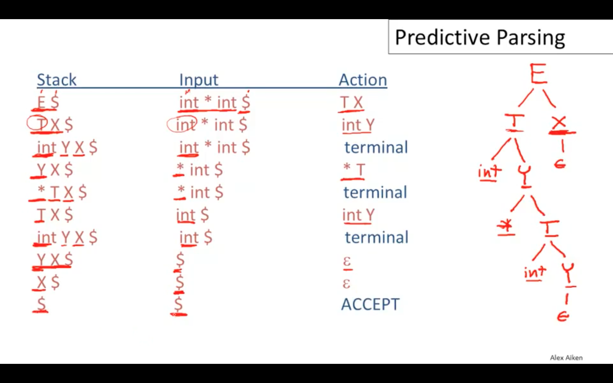

# Parsing

## 解析方法分类

Top Down Parsing
Bottom Up Parsing

## 递归下降解析 Recursive Descent Parsing

### 分类

1. 带回溯的递归下降解析 带回溯的的解析器相当于能够预看任意个符号，因此解析能力强于 LL(k)解析器，但是回溯的运算代价比较高。
   为什么需要任意个预看符号，例如函数声明和定义的结构只在最右边有区别，而函数定义可以无限长，所以无法使用 LL(k)解析。缓冲区可以增长以
   支持任意长度的预看符号。分成推演和实际匹配两个过程。

```cpp
// 函数定义
void bar() {}
// 函数声明
void bar();
```

1. 记忆解析器 林鼠解析器 packrat parser
1. 确定性解析 LL(1) LL(k)
1. 谓词解析器

### 带回溯的递归下降解析

最基础的方法

```BNF
E -> T | T + E
T -> int | int * T | ( E )
```

成功的例子，一个选项失败时整个解析过程失败

```cpp
( int )
```

可能存在多个成功的产生式，一个产生式解析成功时整体的解析可能失败，需要尝试其他的可能成功的产生式，

只能解析非终结符最多只有一个产生式会成功的语法

```cpp
int * int
```

使用递归现将解析表达式存在两个问题

1. 如何处理运算符优先级和结合性
1. 在运算符优先级很多的情况下如何高效处理

上下文无关文法中一个子集可以使用无回溯的递归下降分析法

构造这种解析器的两个方法

1. 手写
1. 生成的 LL(1)解析器

带有回溯的递归下降分析，递归写法和循环写法

```txt
root ← node for the start symbol, S;
focus ← root;
push(null);
word ← NextWord();
while (true) do;
    if (focus is a nonterminal) then begin;
        pick next rule to expand focus (A → β1,β2,...,βn);
        build nodes for β1 , β2 . . . βn as children of focus;
        push(βn, βn−1, ..., β2);
        focus ← β1;
    end;
    else if (word matches focus) then begin;
        word ← NextWord();
        focus ← pop()
    end;
    else if (word = eof and focus = null)
        then accepttheinputandreturnroot;
        else backtrack;
    end;
end;
```

### 左递归

左递归

```BNF
S -> Sa | b

S -> bS'
S' -> aS' | empty
```

间接左递归

```BNF
S -> Aa | b
A -> Sc
```

```BNF
Expr → Expr + Term
    | Expr - Term
    | Term
Term → Term x Factor
    | Term ÷ Factor
    | Factor
```

手动消除左递归

```
Expr → Term Expr′
Expr′ → + Term Expr′
    | - Term Expr′
    | ε

Term → Factor Term′
Term′  → x Factor Term′
    | ÷ Factor Term′
    | ε
```

有算法自动消除左递归 Dragon Book

```txt
impose an order on the nonterminals,A1, A2, ..., An
for i ← 1 to n do;
    for j ← 1 to i - 1 do;
        if ∃ a production Ai→Aj γ
            then replace Ai→Ajγ with one or more productions that expand Aj
    end;
    rewrite the productions to eliminate any direct left recursion on Ai
end;
```

类似图论中的循环问题

外层循环的循环不变量，对于 k < i 的情况，Ak 的所有产生式都中不能存在以 Al 开头的，l < k，

```txt
∀ k < i, no production expanding Ak has Al in its rhs, for l < k.
```

### packrat parser

带记忆的递归下降解析器

1. Bryan Ford Packrat parsing: simple, powerful, lazy, linear time, functional parser

### 谓词解析器

上下文相关文法，根据谓词来决定是否启用某个匹配

### Backtrack Free Parsing

是可回溯的递归下降分析法对应语法的子集 LL(k) 语法

1. left-to-right 对输入进行从左到右处理
1. leftmost-derivation 有限处理最左侧的非终结符
1. k 个预看 token 主要使用 k = 1

left-factoring 转换 LL(1)语法

```BNF
E -> T + E | T
T -> int | int * T | ( E )
```

```BNF
E -> T X
X -> + E | ε
T -> int Y | ( E )
Y -> \* T | ε
```

Predictive Parsers

使用 Parse Table 解析输入

```txt
initialize stack = <S $> and next
repeat
    case stack of
    <X, rest> : if T[X, *next] = Y1, ..., Yn
        then stack <- <Y1, ..., Yn, rest>;
        else error();
    <t, rest> : if t == *next++
        then stack <- <rest>;
        else error();
until stack == <>
```

一个例子

E$, int * int$ Action



对于一个非终结符 A, 输入 t 选用规则 P = A -> b 的情况。

1. t 可以作为非终结符 A 的第一个终结符，t belongs First(b)
1. 或者非终结符 A 可以是展开为空，t 能够跟在 A 的后边，t 属于 Follow(A)

First Set

1. 终结符 a 的 First(a) = { a }
1. A -> a | B C
   1. a 属于 First(A)
   1. First(B) 属于 First(A)
   1. 如果 B -> ε，First(C) 属于 First(A)
   1. A -> ε， ε 属于 First(A)

采用不动点计算方法，直到所有的非终结符的 First(A)不再变化为止，参考 Engineering A Compiler Ch3 P.104。

先要计算 A -> ε


Follow Set

X -> A B

1. First(B) 属于 Follow(A)， Follow(X) 属于 Follow(B)
1. 如果 B -> ε，First(X)属于 Follow(A)
1. $ 属于 Follow(S)

同样采用不动点计算，参考 Engineering A Compiler Ch3 P.106。

对于每一条产生式 Follow Set 需要从后向前分析


定义产生式 A -> B 的 First Set

1. First(B) 如果 First(B)包含 ε
1. First(B) & Follow(A) 如果 First(B)不包含 ε

对于任何非终结符 A，如果其所有产生式的 First Set 不重叠，则可以通过预看下一个 token 来唯一选择要使用的产生式，实现无递归的分析。

计算出 First Set/Follow Set 之后有两种方式实现无回溯递归下降分析

1. 手写，非终结符 A 根据输入 token 和 First Set(P)来选择产生式 P 的逻辑转换为代码
2. 表驱动方式，将所有非终结符、token 和 First(P)的关系组成表格数据，根据表格跳转调用。

Parsing Table

A -> a

1. 终结符 t 属于 First(a) T[A, t] = a
1. First(a)可以是 ε，t 属于 Follow(a)， T[A, t] = a
1. First(a)可以是 ε，$属于 Follow(A)， T[A, $] = a

1. [Predictive Parser](https://www.bilibili.com/video/BV1Ms411A7EP?p=28)

### Operator Precedence

表达式文法定义

```BNF
E --> E "+" E
    | E "-" E
    | "-" E
    | E "*" E
    | E "/" E
    | E "^" E
    | "(" E ")"
    | v
```

经典解决方法，通过定义更多的中间语法规则区分运算符的优先级

```BNF
E --> T {( "+" | "-" ) T}
T --> F {( "*" | "/" ) F}
F --> P ["^" F]
P --> v | "(" E ")" | "-" T
```

缺点

1. The size of the code is proportional to the number of precedence levels.
1. The speed of the algorithm is proportional to the number of precedence levels.
1. The number of precedence levels and the set of operators is built in.

第一个问题可以通过一个带有优先级参数的函数替换多个手写的函数实现。
第二个问题无法避免，一个标识符的解析跟优先级层数成线性关系。

1. [Parsing Expressions by Recursive Descent](https://www.engr.mun.ca/~theo/Misc/exp_parsing.htm)
1. https://eli.thegreenplace.net/tag/recursive-descent-parsing
1. [自上而下的运算符优先解析](https://firecodelab.com/blog/translate-top-down-operator-precedence-parsing/)
1. [From Precedence Climbing to Pratt Parsing](https://www.engr.mun.ca/~theo/Misc/pratt_parsing.htm)
1. [斯坦福大学 编译原理 递归下降解析](https://www.bilibili.com/video/BV1Ms411A7EP?p=24)

### Operator Precedence Parser

https://en.wikipedia.org/wiki/Operator-precedence_parser

### Precedence Climbing

能够处理的语法是由二元运算符连接原子表达式组成的表达式。

优先级

每个二元运算符都有预先定义好的一个自然数代表其优先级，数值越大优先级越高。

分析例子

```js
2 + 3 * 4 * 5 - 6
```

一个表达式包含的所有二元运算符的最小优先级决定了当前原子表达式和后续原子表达式之间的顺序，

```js
1 + 2 * 3

1 * 2 + 3
```

结核性

左结合、右结合

```js
1 + 2 + 3
```

```cpp
1 ^ 2 ^ 3
```

通过扩展原子表达式的定义可以处理一元表达式，标识符等情况。

三元运算符如何处理？

实际例子

Clang 的编译器前端就是手写的递归下降解析，在`lib/Parse/ParseExpr.cpp`中使用了 Precedence Climbing 方法。

1.  [Parsing Expressions by precedence climbing](https://eli.thegreenplace.net/2012/08/02/parsing-expressions-by-precedence-climbing)
1.  [The top-down parsing of expressions Keith Clarke](https://www.antlr.org/papers/Clarke-expr-parsing-1986.pdf)

### 调度场算法（Shunting Yard）

操作符的优先级、结合性、Unary、Binary、Tenary

### 自顶向下操作符优先级分析（Top Down Operator Precedence）

自顶向下的运算符优先级分析法最早由 Pratt 提出，用来解决包含不同优先级操作符的表达式解析问题，也叫 Pratt Parsing，具体的历史可参考这篇[文章](http://www.oilshell.org/blog/2016/11/01.html)的总结。

TDOP 的**关键**在于通过给操作符定义**结合优先级**（Binding Power）来解决**操作符优先级**的问题。

二元操作符（binary operator）左右都可以存在操作数（operand），定义结合优先级`bp(op) = (lbp, rbp)`，`lbp`是左侧结合优先级（**L**eft **B**inding **P**ower），`rbp`是右侧结合优先级（**R**ight **B**inding **P**ower）。

下面这个数学表达式中，定义加法操作符`bp(+) = (1, 2)`，乘法操作符`bp(*) = (3, 4)`。

```js
  3   +   1   *   2   *   4   +   5
0   1   2   3   4   3   4   1   2   0
```

上边是表达式，下边是每个二元运算符左右两侧的`bp`值。数字`1`左侧是加号，右侧是乘号，乘号的`lbp = 3`大于加号的`rbp = 2`所以`1`应该与乘号优先结合，数字`4`同理可知应该与左侧乘号结合。

不同符号通过定义`bp`来确定优先级，对于同一符号来说还存在结合律的问题，加法和乘法都是左结合（left associativity），考虑上面的`1 * 2 * 4`应该解析为`(1 * 2) * 4`而不是`1 * (2 * 4)`。数字`2`左侧是乘号的`rbp = 4`大于其右侧乘号的`lbp = 3`，所以解析结果应该是左结合。同理定义`bp(^) = (6, 5)`可以使得操作符`^`是右结合。

#### 二元操作符（Binary Operator）解析

TDOP 通过使用递归和循环结合的方式解析表达式，整体流程如下。

```js
// 解析表达式
function expression(tokenStream, minBp = 0) {
  const token = tokenStream.consume()
  if (!token || token.type !== number) {
    throw new Error('expect a number')
  }
  let left = numericLiteral(token)

  while (true) {
    // 使用peek，因为存在直接返回和继续递归两种情况，继续递归时才要消耗掉当前token
    const op = tokenStream.peek()
    // 没有跟多输入了，应该返回，相当于最右侧rbp = 0的情况
    if (op === null) {
      break
    }

    // 有token的话应该是个operator，否则是语法错误
    if (op.type !== 'operator') {
      throw new Error('expect an operator')
    }

    // 获得操作符的bp
    const [lbp, rbp] = infixBindingPower(op)
    // 操作符的优先级低于当前要求的最低优先级minBp，应当返回
    if (lbp < minBp) {
      break
    }

    // 操作符lbp大于当前要求的最低优先级minBp，应当继续递归调用
    tokenStream.consume()

    // 递归调用解析右侧操作符组成的表达式
    const right = expression(tokenStream, rbp)

    // 将当前解析出的部分重新作为表达式左操作符，继续循环
    left = binaryExpression(op, left, right)
  }

  return left
}

function numericLiteral(token) {
  return {
    type: 'NumericLiteral',
    value: token.value,
  }
}

function binaryExpression(op, left, right) {
  return {
    type: 'BinaryExpression',
    left,
    right,
  }
}

function infixBindingPower(op) {
  const map = {
    '+': [1, 2],
    '-': [1, 2],
    '*': [3, 4],
    '/': [3, 4],
    '^': [6, 5],
  }
}
```

表达式解析函数从`expression(tokenStream, 0)`开始调用，`minBp = 0`代表了初始的优先级，效果就是任意操作符的优先级都高于`0`，`expression`就会递归调用继续分析后续输入。

首先匹配一个数字，同时构造一个字符串字面值表达式作为结果存储到`left`变量中，`left`总是保存了当前已经解析部分产生的表达式。

接着需要进入一个循环，这个循环会对右侧的操作符进行分析。

如果右侧操作符优先级低于`minBp`说明左侧已经解析得到了包含更高优先级操作符的表达式，这个表达式在后续的解析中会作为右侧低优先级操作符表达式的左子树。如果右侧没有更多输入，函数同样需要返回，相当于`lbp < minBp`，`lbp = 0`的情况。如果右侧不是一个操作符，这是一个语法错误。

如果右侧操作符优先级高于`minBp`，说明右边要解析的部分组成更高优先级表达式，当前得到的部分`left`是该表达式的左子树，这个表达式尚未解析完成，函数不应该返回而应该继续递归调用，解析右子树部分。注意递归调用使用的`minBp`更新为当前操作符的`rbp`。

循环的使用是为了解析右侧输入直到遇到了更低优先级的操作符，才能将当前结果作为左子树返回。

TDOP 虽然使用了递归嵌套的调用`expression`函数解析表达式，但是表达式抽象语法树的构造却是自下而上的，`left`最开始是数字字面量表达式，遇到右侧更低优先级的操作符，函数返回上一层，返回的结果作为`right`和上一层的`left`组成一个更大一点的局部表达式，直到输入为空完成整个表达式的解析。

#### 一元操作符（Unary Operator）

一元操作符分为前缀操作符（Prefix Operator）和后缀操作符（Postfix Operator）两种。

负号`-`是典型的前缀操作符，前缀操作符的处理需要在`expression`函数调用的开头进行，这时当前 token 可能是数字也可能是一个前缀操作符。

```js
function expression(tokenStream, minBp = 0) {
  const token = tokenStream.consume()
  if (!token) {
    throw new Error('expect a number, get early EOF')
  }

  let left
  if (token.type === 'number') {
    left = numericLiteral(token)
  } else if (token.type === 'operator') {
    // 前缀操作符只有rbp
    const [_, rbp] = prefixBindingPower(token)

    // 前缀操作符后面是另外一个表达式，递归调用解析，rbp作为minBp
    const right = expression(tokenStream, rbp);

    // 组合结果
    left = unaryExpression(token.value, right)
  }

  ...
}

function prefixBindingPower(op) {
  const map = {
    '-': [undefined, 5],
    '+': [undefined, 5],
  }
  const bp = map[op]

  if (!bp) {
    throw new Error('expect prefix operator, get ' + op)
  }

  return bp
}
```

碰到前缀操作符时，后边必须跟随另外一个表达式，使用`expression(tokenStream, rbp)`递归调用解析，注意使用了操作符的`rbp`作为`minBp`。由于前缀操作符只有只能跟右侧操作数结合，所以只有`rbp`。

阶乘`!`是后缀操作符，后缀操作符出现在数字的后边，和中缀操作符是同一个位置，只不过后边不能再跟操作数。后缀操作的处理插入在中缀操作符的前边，首先进行尝试，优先级低时直接返回当前结果，优先级高时后缀操作符对应的表达式也解析完成，返回结果。

```js
function expression(tokenStream, minBp) {
    ...
    while (true) {
        ...

        // 首先尝试后缀操作符
        const [lbp, _] = postfixBindingPower(token.value)
        if (postfix && lbp) {
            if (lbp < minBp) {
                break
            }

            left = {
                type: 'UnaryExpression',
                operator: token.value,
                value: left,
            }
            tokenStream.consume()
            continue
        }

        // 中缀操作符
        ...
    }
}
```

#### 括号（Parenthesis）

括号不属于之前的任何一种情况，括号中间能够包含任意的表达。解析的时候遇到`(`之后应该递归调用函数，然后再预期遇到一个`)`。`(`可能和数字一样出现在开头，`)`可能和中缀、后缀操作符出现在同一个位置。

预期的解析流程上遇到左括号应该继续递归，相当于左括号有最高的优先级，而且左括号之后会匹配包含所有优先级操作符的表达式，所以 minBp 应该重置为 0。遇到右括号就返回，相当于右括号具有最低的优先级。

```js
function expression(tokenStream, minBp = 0) {
  const token = tokenStream.consume()
  if (!token) {
    throw new Error('expect a number, get early EOF')
  }

  let left
  if (token.type === 'number') {
    left = numericLiteral(token)
  // 左括号
  } else if (token.value === '(') {
      // 递归调用
      left = expression(tokenStream, 0)
      // 必须是个右括号
      match(')')
  } else if (token.type === 'operator') {
      ...
  }

  while (true) {
    // 后缀操作符
    ...

    // 直接返回
    if (op === ')') {
        break;
    }

    const [lbp, rbp] = infixBindingPower(op)
    // 操作符的优先级低于当前要求的最低优先级minBp，应当返回
    if (lbp < minBp) {
      break
    }

    // 操作符lbp大于当前要求的最低优先级minBp，应当继续递归调用
    tokenStream.consume()

    // 递归调用解析右侧操作符组成的表达式
    const right = expression(tokenStream, rbp)

    // 将当前解析出的部分重新作为表达式左操作符，继续循环
    left = binaryExpression(op, left, right)
  }
}
```

TODO: 使用负数优先级实现')'

#### 索引符号（Index Operator）

索引符号`a[i]`形式中，`[]`可以采取和`()`相似的处理方法，碰到`[`后就递归调用`expression`进行解析，不同之处在于`[i]`相当于是`a`的后缀，`[`只能出现在循环的中。

```js
function expression(tokenStream, minBp = 0) {
  while (true) {
    // 后缀操作符
    ...

    // 直接返回
    if (op === ')' || op === ']') {
        break;
    }

    // 出现在这里
    if (op === '[') {
        tokenStream.consume();
        // 递归调用
        const right = expression(tokenStream, 0);
        // 必须是 ']'
        match(']')

        // 组合新结果
        left = memberExpression(left, right)
        break;
    }

    const [lbp, rbp] = infixBindingPower(op)
    // 操作符的优先级低于当前要求的最低优先级minBp，应当返回
    if (lbp < minBp) {
      break
    }

    // 操作符lbp大于当前要求的最低优先级minBp，应当继续递归调用
    tokenStream.consume()

    // 递归调用解析右侧操作符组成的表达式
    const right = expression(tokenStream, rbp)

    // 将当前解析出的部分重新作为表达式左操作符，继续循环
    left = binaryExpression(op, left, right)
  }
}
```

#### 三元操作符（Ternary Operator）

1. 三元表达式 ? :
   ?相当于 infix，且右结合，碰到：应该提前返回

#### 更多思考

注意如果一个二元操作符的左右优先级设置为相同，现在的逻辑下会继续递归调用，相当于定义操作符为右结合，左结合操作符必须设置`lbp > rbp`，这跟循环中使用的终止条件`lbp < rbp`有关。

右结合操作符可以使用`lbp == rbp`的方案，但是没有必要，推荐永远使用不相同的数值配置，简单清晰。

#### 更好的方案 （Nud 和 Led）

1. nud 和 led 的概念

#### 参考文章

建议首先看[《Simple But Powerful》](https://matklad.github.io/2020/04/13/simple-but-powerful-pratt-parsing.html)，使用 Rust 实现，从实际例子与代码出发，比较容易理解，本文整体思路参考这篇文章。Rust 使用模式匹配（Pattern Match）实现的版本比 Javascript 要方便简洁多了。

然后可以看[《How Desmos uses Pratt Parsers》](https://engineering.desmos.com/articles/pratt-parser/)，从 jison 生成解析器的方案迁移到手写 TDOP，使用 [Typescript](https://github.com/desmosinc/pratt-parser-blog-code) 和类方式实现。文章总结了 Parser Generator 和手写 TDOP 方案的优劣势，手写 TDOP 的主要优势如下。

1. 代码结构清晰，对于解析代码更有掌控力，例如可以提供用户友好的错误信息，而不像 jison 只能提示语法错误。
1. 代码尺寸更小、性能更高，Parser Generator 方案生成的 Parser 优化程度不够。

[《Pratt Parsers: Expression Parsing Made Easy》](http://journal.stuffwithstuff.com/2011/03/19/pratt-parsers-expression-parsing-made-easy/)实现了 Java 的版本，[《Top Down Operator Precedence Parsing》](https://eli.thegreenplace.net/2010/01/02/top-down-operator-precedence-parsing) 实现了 Python 的版本，可作为上面的补充。

[《Top Down Operator Precedence》](https://tdop.github.io/)
和 [《Top Down Operator Precedence Vaughan R. Pratt》](https://dl.acm.org/doi/10.1145/512927.512931)是 Pratt Parser 的原版论文。

Douglas Crockford 在《Beautiful Code》第 9 章中介绍了使用 TDOP 实现 Javascript 语言的子集的方案，他的文章[《Top Down Operator Precedence》](https://www.crockford.com/javascript/tdop/tdop.html)包含了同样的内容。

Andy Chu 对 TDOP 的相关教程与文章做了个总结[《Pratt Parsing Index and Updates》](http://www.oilshell.org/blog/2017/03/31.html)，并且指出了 TDOP 和 Precedence Climbing 实际是一个算法 [《Pratt Parsing and Precedence Climbing Are the Same Algorithm》](http://www.oilshell.org/blog/2016/11/01.html)。

### LL(k)递归下降解析

不修改语法，构建 k 个预看 token 的环形缓冲区来支持。

## Bottom Up

自底向上解析

## 类型

1. [Subtype Inference by Example Part 1: Introducing CubiML](https://blog.polybdenum.com/2020/07/04/subtype-inference-by-example-part-1-introducing-cubiml.html)

## 模式

### 解释器模式（Interpreter）

将操作放到每个节点类中

1. 方便增加新的 AST 节点类型
1. AST 节点类型太多时不方便管理，同一个功能的代码分散在不同的节点类中。
1. 不方便增加新的操作类型

通过多态实现

### 访问者模式（Visitor）

1. 同一种操作的代码从分散的节点类统一到一个操作类中
1. 在不改变节点类型的情况下容易增加操作类型
1. 不方便增加新的 AST 节点类型

遍历过程可能需要全局状态，Visitor 类中通过重载进行静态分发，双分派技术，如果语言本身支持双分派技术，访问者模式就不需要了。

访问者模式访问的类也可以没有关联关系，
Node 节点类的代码存在大量重复，

## Books

1. [Essentials of Programming Language](http://www.eopl3.com/)
1. [Beautiful Code](https://eli.thegreenplace.net/2007/09/28/book-review-beautiful-code-edited-by-andy-oram-greg-wilson/)

1. 四种树的遍历模式
1. 二元表达式不同文法对应同一种语法，文法的改变不影响语法。
1. 表达式短路求值优化
1. 树的相关算法
1. 改写简化向量乘法，乘以 0 的表达式
1. 迭代使用规则，加法乘法转换为位移操作
1. 解析抽象语法树，为什么有 expression statement

1. http://www.yinwang.org/
1. https://blog.csdn.net/ViVivan1992/article/details/101302986
1. [The Little Javascripter](http://www.crockford.com/little.html)
