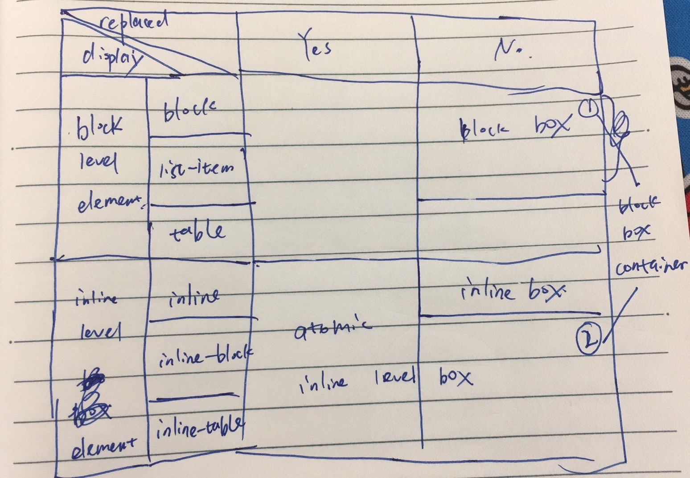

# Concepts

1. containing block
1. initial containing block
1. content height/content width/content area/margin area
1. line box/block level elements/block boxes/block formatting context

block-level elements

```css
.block-level-elements {
  display: block;
  display: list-item;
  display: table;
}
```

**block level elements** generate block-level boxes. Browser typically display block level elements with a newline both before and after it. A block level element takes up all available space if possible.

1. a principal block-level box (all)
1. additional block-level box (`display: list-item` only, marker box)

**block-level box** are laid out vertically, each box occupies one line.

A **block container box** either establishes a block formatting context and thus contains only contains block boxes inside it, or establishes an inline formatting context and thus contains only inline boxes inside it.

1. block boxes
1. non-replaced inline box, `display: inline-block`
1. non-replaced table cells, `display: table-cell`

If a block container box has block-level box inside it, then anonymous block-level boxes are created to contain text content to ensure that block container box only contains block-level boxes.

Inline-level elements are those that don't form new blocks but are distributed in lines. Following `display` properties make an element to be inline-level elements.

```css
.inline-level-elements {
  display: inline;
  display: inline-block;
  display: inline-table;
}
```

Inline-level elements generate **inline-level boxes**, which participates in inline outer formatting context. **Inline box** is inline-level box with its content participating in inline formatting context. Inline-level boxes like replaced inline-level elements, inline-block elements, and inline-table elements are not inline boxes, they're referred as atomic inline-level boxes because they participate in inline formatting context as a single opaque box.



1. [W3C ORG Visual Formatting Model](https://www.w3.org/TR/CSS21/visuren.html#inline-boxes)
1. [WHATWG CSS Display Module Level 3](https://drafts.csswg.org/css-display/#block-formatting-context)
