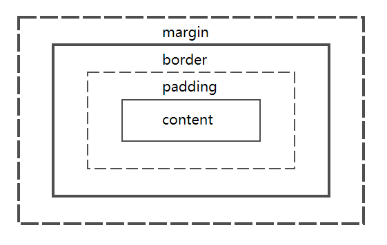

# CSS

1. selector
   1. pseudo selectors: first-of-type, last-of-type, only-of-type, only-child, nth-child, :after, :before, :enabled, :disabled, :checked
1. display: block, none, inline, inline-block, list-item, table, inherit
1. cascading & inheritance
   1. inherite: font-size, font-family color, ul, li, dl, dd, dt
   1. non-inherite: border, padding, margin, width, height
   1. !important > id > class > tag
1. Layout
   1. box model
   1. margin collapsing
   1. positioning and floating
      1. static, relative, absolute, fixed(Old IE)
      1. 面试者知道使用 overflow:hidden 等来实现要求，但不知道原理。2.不仅知道，而且有创新，比如如果内部有内容需要溢出时改用 display:table-cell。有人说知道这些概念没啥用，我说如果你不仅知道这些概念，还能灵活的学以致用，那才是 CSS 之道。当然如果连 position 有几个属性值都不知道，只能是「负分，滚粗了」。
   1. flex layout
   1. grid layout
   1. table layout
   1. responsive design
      1. viewport
      1. media query
1. effects
1. transforms
1. transition
1. animation
1. SASS, LESS, BEM, OOCSS

## Selector

### link

Link related pseudo-class selectors `:link`, `:visited`, `:hover`, `:active` should be defined by the LVHA-order to make links work properly.

1. `:link` has the lowest priority and can be overwritten by other rules, it goes first.
1. `<a>` is expected to respond to hover after being visited, so `:hover` goes after `:visited`.
1. click on `<a>`, we expect `:active` to take effect and overwrite `:hover`, so `:active` goes after `:hover`.

## Box Model

Every element in html page is a rectangular box.



`box-sizing` is used to specify which box model is used.

1. `content-box` - default option, `width` property means content width.
   ```math
   width = content-width
   totalWidth = width + padding-left + padding-right + border-left + border-right
   ```
1. `padding-box` - `width` property means padding width and content width combined.
   ```math
   width = content-width + padding-left + padding-right
   totalWidth = width + padding-left + padding-right + border-left + border-right
   ```
1. `border-box` - `width` property means total width of content, padding and border.
   ```math
   width = content-width + padding-left + padding-right + border-left + border-right
   totalWidth = width
   ```

## Margin Collapsing

In a normal content flow, when multiple vertical margins are adjacent to each other. Multiple margins will collapse into a single one with its height equivalent to the maximum height of collapsed margins.

Typical cases for margin collapsing

1. Self Collapsing. When an element is empty, which means its height of content, padding and border are zero, its top margin and bottom margin will collapse into one margin.
1. Adjacent Collapsing. Bottom margin of element above and top margin of element below will collapse into one margin.
1. Parent Children Collapsing. When parent element top margin is adjacent to top margin of first child element, or parent element bottom margin is adjacent to bottom margin of last child element, margin collapsing will happen.

## [Normal Flow](https://www.w3.org/TR/CSS2/visuren.html#normal-flow)

## [`display`](https://developer.mozilla.org/en-US/docs/Web/CSS/display)

1. display-outside
1. display-inside
1. display-listitem
1. display-internal
1. display-box
1. display-legacy

## [Positioning](https://drafts.csswg.org/css-position-3/#position-property)

Positioning allows you to define

<table>
    <caption><h2>position</h2></caption>
    <tr>
        <td>Values</td>
        <td>static | relative | sticky | absolute | fixed </td>
    </tr>
    <tr>
        <td>initial value</td>
        <td>static</td>
    </tr>
    <tr>
        <td>Applies to</td>
        <td>All elements</td>
    </tr>
    <tr>
        <td>Computed Value</td>
        <td>As specified</td>
    </tr>
    <tr>
        <td>Inherited</td>
        <td>No</td>
    </tr>
    <tr>
        <td>Animatable</td>
        <td>No</td>
    </tr>
</table>

Containing block and initial containing block.

1. static - element is not positioned, use position in normal flow.
1. fixed - element is positioned relative to viewport of browser window.

Width and height of replaced elements can be shrinked or expanded to fit if set to auto, nonreplaced elements has an intrinsic width and height, so it cannot be shrinked or expanded.

```math
totalWidth = left + right + margin-left + margin-right + border-width-left + border-width-right + padding-left + padding-right + width
```

If horizontal width is overconstrained, left takes over right for left-to-right language, right is computed as remainder value to solve the equation, right takes over left for right-to-left language, left is computed as remainder value to solve the equation.

<table>
    <caption><h2>position</h2></caption>
    <tr>
        <th align='left'>property</th>
        <th align='left'>default</th>
        <th align='left'>auto behaviour</th>
    </tr>
    <tr>
        <td>top</td>
        <td>auto</td>
        <td>lowest priority, computed as remainder value to solve equation, assume static position</td>
    </tr>
    <tr>
        <td>bottom</td>
        <td>auto</td>
        <td>lowest priority, computed as remainder value to solve equation</td>
    </tr>
    <tr>
        <td>margin-top<br>margin-bottom</td>
        <td>0</td>
        <td>when either is auto, takes remainder value, when both is auto, split remainder value equally.</td>
    </tr>
    <tr>
        <td>border-width-top<br>border-width-bottom</td>
        <td>auto</td>
        <td></td>
    </tr>
    <tr>
        <td>padding-top<br>padding-bottom</td>
        <td>0</td>
        <td></td>
    </tr>
    <tr>
        <td>width</td>
        <td>auto</td>
        <td>for replaced element, auto takes intrinsic height, for nonreplaced element, auto takes remainder or shrink to fit.</td>
    </tr>
</table>

### Nonreplaced Elements

In horizontal layout, either **right** or **left** can be placed according to the static position if their values are **auto**. In vertical layout, only **top** can take on the static position.

Also, if an absolutely positioned element's size is overconstrained in the vertical direction, **bottom** is ignored.

### Positioned Element

_positioned_ element is an element with poisiton value of `fixed`, `absolute`, `relative` or `sticky`.

### Containing Block

1. **static/relative** - containing block is formed by the edge of the content box of nearest ancestor element that is a block container (inline-block, block, list-item) or which establishes a formatting context (table container, flex container, grid container, or the block container)
1. **absolute** - containing block is formed by the edge of the _padding box_ of the nearest _positioned_ ancestor element.
1. **fixed** - containing block is established by the viewport (in the case of continous media) or the page area (in the case of paged media).
1. **absolute/fixed** - the containing block may also be formed by the edge of the padding box of the nearest ancestor element that has the following:
   1. A transform or perspective value other than none
   1. A will-change value of transform or perspective
   1. A filter value other than none or a will-change value of filter (only works on Firefox).

For a non-root element that has a position value of absolute, its containing block is
set to the nearest ancestor (of any kind) that has a position value other than static. This happens as follows:

1. If the ancestor is block-level, the containing block is set to be that element’s pad‐ ding edge; in other words, the area that would be bounded by a border.
1. If the ancestor is inline-level, the containing block is set to the content edge of the ancestor. In left-to-right languages, the top and left of the containing block are the top and left content edges of the first box in the ancestor, and the bottom and right edges are the bottom and right content edges of the last box. In right-to-left languages, the right edge of the containing block corresponds to the right content edge of the first box, and the left is taken from the last box. The top and bottom are the same.
1. If there are no ancestors, then the element’s containing block is defined to be the

**Initial containing block** refers to the rectangle that root element `<html>` resides. It has the dimensions of the viewport (for continuous media) or the page area (for paged media)

### Offset Property

Positioning allows you to define

<table>
    <caption><h2>top,right,bottom,left</h2></caption>
    <tr>
        <td>Values</td>
        <td>&lt;length&gt; | &lt;percent&gt; | auto</td>
    </tr>
    <tr>
        <td>initial value</td>
        <td>auto</td>
    </tr>
    <tr>
        <td>Applies to</td>
        <td>Positioned elements</td>
    </tr>
    <tr>Refer to the height of containing block for top and bottom, and the width of containing block for right and left</tr>
    <tr>
        <td>Computed Value</td>
        <td>For static elemens, auto; for length values, the corresponding absolute length; for percentage values, the specified value; otherwise, auto./td>
    </tr>
    <tr>
        <td>Inherited</td>
        <td>No</td>
    </tr>
    <tr>
        <td>Animatable</td>
        <td>&lt;length&gt;, &lt;percentage&gt;</td>
    </tr>
</table>

## Formatting Context

## Dispaly
