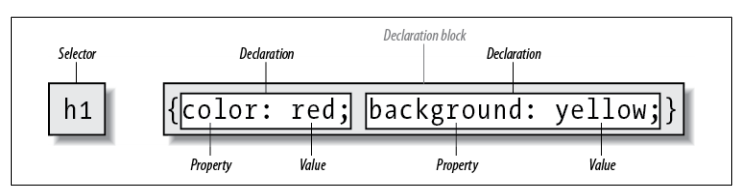
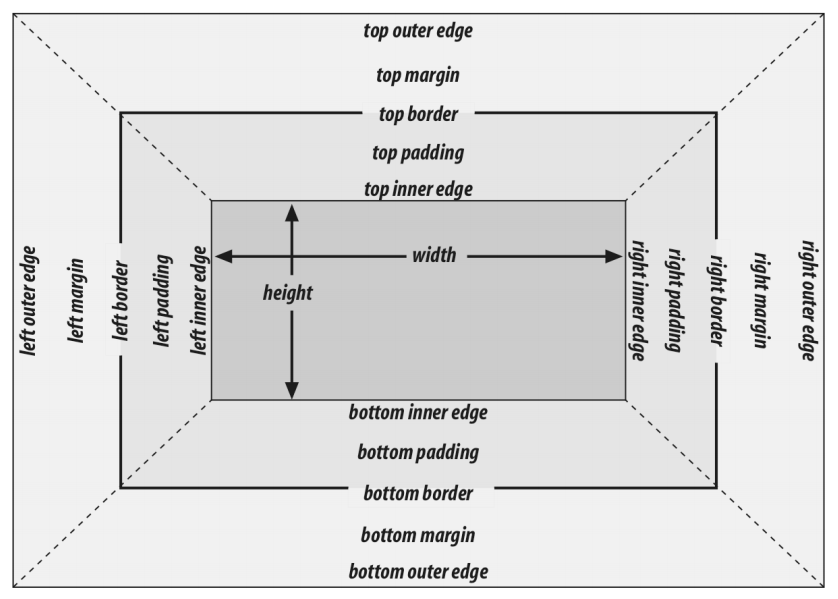
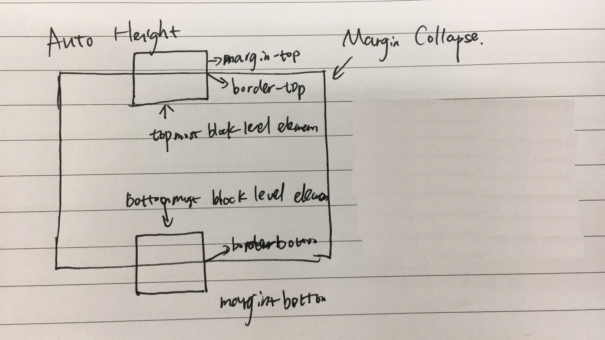
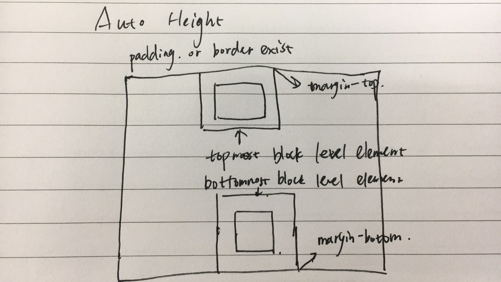

# CSS

1. display: block, none, inline, inline-block, list-item, table, inherit
1. Layout
   1. positioning
      1. overflow:hidden display:table-cell。
   1. floating
   1. flex layout
   1. grid layout
   1. table layout
   1. responsive design
      1. viewport
      1. media query
1. effects
1. transforms
1. transition
1. animation
1. SASS, LESS, BEM, OOCSS

## Elements

### Replaced and Nonreplaced Elements

Replaced elements are elements whose contents are replaced by something that is not directly represented by document. It has a intrinsic width and height.

Typical replated elements are:

- `<iframe>`
- `<embed>`
- `<video>`
- ``
- `<input>`

Some elements are treated as replaced elements only in specific cases:

- `<audio>`
- `<canvas>`
- `<object>`
- `<applet>`

### Styles

#### External Styles

Stylesheet in a html document falls into following categories.

1. **Persistent** (no rel="alternate", no title="..."), always applied to document.
1. **Preferred** (no rel="alternate", with title="..."), applied by default, when there're multiple preferred stylesheets, only one of them will take effect, others will be ignored. However, HTML specification doesn't define rules for deciding which one to use.
1. **Alternate** (rel="stylesheet alternate", title="..."), disabled by default, activated when selected by user.

If any alternate stylesheet is selected by user, all preferred stylesheets are disabled.

Media property of `<link>` specifies preferred media for stylesheets, corresponding stylesheet takes effect when actual media fits value of media property.

```html
<link href="default.css" rel="stylesheet" title="Default">
<link href="basic.css" rel="alternate stylesheet" title="Basic">
<link href="fancy.css" rel="alternate stylesheet" title="Fancy">
```

`<link>` element has `onload` for handling `load` event and `onerror` for `error` event when loading external stylesheet.

```html
<script>
function sheetLoaded() {
  // Do something interesting; the sheet has been loaded
}

function sheetError() {
  console.log("An error occurred loading the stylesheet!");
}
</script>

<link rel="stylesheet" href="mystylesheet.css" onload="sheetLoaded()"
  onerror="sheetError()">
```

#### Embedded Styles

`<style>` tag is used to write CSS directly inside html document.

```html
<style type='text/css' media='print screen' nonce title='Default'>
@import url(http://example.org/library/layout.css);
@import url(basic-text.css);
@import url(printer.css) print;
body {color: red;}
h1 {color: blue;}
</style>
```

1. `type` attribute is optional and defaults to `text/css`.
1. `media` and `title` works like `<link>` element.

`@import` directive can be used inside css to include rules from external stylesheets.

1. It must be placed before other stylesheet rules, otherwise it will be ignored.
1. Relative or absolute urls can be used to refer to external stylesheet.
1. Media query can be used likely.

#### Inline Styles

Use `style` attribute of a html element to specify inline styles for correpsonding element.

```html
<p style="color: gray;">The most wonderful of all breakfast foods is
the waffle—a ridged and cratered slab of home-cooked, fluffy goodness...
</p>
```

Value of `style` attributes can be one or more specific rules. `@import` directive, selectors cannot be used.

## CSS Rule



### Vendor prefixing

|Prefix|Vendor|
|--|--|
|-epub-| International Digital Publishing Forum ePub format|
|-moz-| Mozilla-based browsers(e.g. Firefox)|
|-ms-| Microsoft Internet Explorer|
|-o-| Opera-based browsers|
|-webkit-| Webkit-based browsers(e.g. Safari and Chrome)|

### Comments

CSS comments has only one format of `/* ... */`, it can span over multiple lines. No rest of the line comment like `//` in C++ or `#` in python.

```css
/* This is a CSS1 comment, and it
can be several lines long without
any problem whatsoever. */

h1 {color: gray;}  /* This CSS comment is several lines */
```

### [Media Query](https://www.w3.org/TR/mediaqueries-4/)

Media query can be used in following places.

1. `media` attribute of a `link` element.
1. `media` attribute of a `style` element.
1. media descriptor portion of an `@import` declaration.
1. media descriptor portion of an `@media` declaration.

#### Media types

1. `all` - Use in all presentational media.
1. `print` - Use for document printing or print preview
1. `screen` - Use when presenting document on a screen medium. All web browsers are screen medium.

#### Media Features

Media features expressions test for specific characteristics of user agent, output device or environment. They are optional and must be wrapped inside parenthesis if present.

#### Logical Operators

Logical operators `not`, `and`, `only` can be used to compose mutiple media queries into single one. Explicity media type must be supplied when using `not` and `only`.

```css
not (color) and (orientation: landscape) and (min-device-width: 800px)
```

`not` negates entire media query, so it's equivalent to

```css
not ((color) and (orientation: landscape) and (min-device-width: 800px))
```

`or` operator doesn't exist, use comma for equivalent function.

#### Comma Separated Lists

Mutiple media queries can be separated by comma. If any of those media queries fits, it will take effect.

### [Feature Query](https://drafts.csswg.org/css-conditional-3/#at-supports)

Feature query is used to detect if some features are supported by user agent. It's a perfect way of adapting to new features progressively.

Logical operators `not`, `and`, `or` can be used to compose multiple feature queries together. `not` negates entire feature query, use parenthesis to change applied range if needed.

```css
@supports not (text-align-last: justify) or (-moz-text-align-last: justify) {
}

/* same as above, but clearer with extra parenthesis */
@supports not ((text-align-last: justify) or (-moz-text-align-last: justify)) {
}

/* custom property */
@supports (--foo: green) {
  body {
    color: var(--varName);
  }
}
```

Use feature query with both name and value for accurate test, cause user agent may recgonize feature name but not specific value.

Feature query only means user agent recognizes target feature, but it's not guaranteed that user agent implement features correctly.

```css
@supports (display) {
    /* recognize display but not supporting grid property */
}

@supports (display: grid) {
    /* recognize display property with grid value */
}
```

## Selector

### Basic Selector

<table>
    <tr>
        <th align='left'>Type</th>
        <th align='left'>Syntax</th>
        <th align='left'>Explaination</th>
    </tr>
    <tr>
        <td>Element Selector</td>
        <td><code>h2</code></td>
        <td>Select elements by type</td>
    </tr>
    <tr>
        <td>Class Selector</td>
        <td><code>.class_name</code></td>
        <td>Select elements by class attribute, multiple class selector can be use simultaneously, space not allowed in between. Equivalent to <code>[class~=class_name]</code></td>
    </tr>
    <tr>
        <td>ID Selector</td>
        <td><code>#id_value</code></td>
        <td>Select single element by id. Actual implementation may not check uniqueness of id, so multiple elements may be selected in this case. Equivalent to <code>[id=id_value]</code></td>
    </tr>
    <tr>
        <td>Universal Selector</td>
        <td><code>*</code></td>
        <td><span>Select all elements. From CSS3, asterisk may be used with <em>namespace</em></span>
        <ul>
        <li>
            <code>ns|*</code><span> mathes all elements in namesapce <em>ns</em></span>
        </li>
        <li>
            <code>*|*</code><span> mathes all elements</span>
        </li>
        <li>
            <code>|*</code><span> mathes all elements without declared namesapce</span>
        </li>
        </ul>
        </td>
    </tr>
    <tr>
        <td>Attribute Selector</td>
        <td><code>.primary[attr1 operator value i]</code></td>
        <td>
            <p>
            Squre brackets can be used to select element by attribute, multiple attributes selector can be used simultaneously. An <em>i</em> or <em>I</em> before closing bracket means to match attribute values case-insensitively</p>
            <ul>
                <li>
                    <code>img[title]</code>
                    <span>
                        Select elements with attribute
                    </span>
                </li>
                <li>
                    <code>input[type="text"]</code>
                    <span>
                    Select elements with exact attribute value
                    </span>
                </li>
                <li>
                    <code>a[href^="http://"]</code>
                    <span>Select elements with attribute value prefix</span>
                </li>
                <li>
                    <code>a[href$=".pdf"]</code>
                    <span>Select elements with attribute value suffix</span>
                </li>
                <li>
                    <code>img[src*="headshot"]</code>
                    <span>Select elements with attribute value containing substring</span>
                </li>
                <li>
                    <code>img[src~="Figure"]</code>
                    <span>Select elements with attribute value containing word in a space-separated list of words</span>
                </li>
                <li>
                    <code>img[lang|="en"]</code>
                    <span>Select elements with attribute value starting with word followed by dash(U+002D) or matches exactly</span>
                </li>
            </ul>
        </td>
    </tr>
</table>

### Combinator

<table>
    <tr>
        <th align='left'>Type</th>
        <th align='left'>Syntax</th>
        <th align='left'>Explaination</th>
    </tr>
    <tr>
        <td>Group Selector</td>
        <td><code>h1, h2</code></td>
        <td>
            Multiple selectors can be composed into one selector in a comma-separated format. It selects elements that matches any of the multiple selectors.
        </td>
    </tr>
    <tr>
        <td>Adjacent Sibling Selector</td>
        <td><code>former + target</code></td>
        <td>
            The <strong>adjacent sibling combinator(+)</strong> separates two selectors and matches the second element only if it <em>immediately</em> follows the first element and both are children of the same element.
        </td>
    </tr>
    <tr>
        <td>General Sibling Selector</td>
        <td><code>selector1 ~ selector2</code></td>
        <td>
        The <strong>general sibling combinator(~)</strong> separates two selectors and matches the second element only if it follows the first element (though not necessarily immediately), and both are children of the same parent element.
        </td>
    </tr>
    <tr>
        <td>Child Selector</td>
        <td><code>h1 > h2</code></td>
        <td>
        The <strong>child combinator(>)</strong>is placed between two CSS selectors. It matches only those elements matched by the second selector that are the children of elements matched by the first.
        </td>
    </tr>
    <tr>
        <td>Descendant Selector</td>
        <td><code>h1 em</code><br><code>h1 >> em</code></td>
        <td>
            <p>
                The <strong>descendant combinator</strong> — typically represented by a single space<strong>( )</strong> character — combines two selectors such that elements matched by the second selector are selected if they have an ancestor element matching the first selector. Selectors that utilize a descendant combinator are called descendant selectors.
            </p>
            <p>
                The descendant combinator is technically one or more CSS white space characters (space character and/or one of four control characters: carriage return, form feed, new line and tab character).
            </p>
        </td>
    </tr>
</table>

### Pseudo Class

<table>
    <tr>
        <th align='left'>Type</th>
        <th align='left'>Syntax</th>
        <th align='left'>Explaination</th>
    </tr>
    <tr>
        <td rowspan='10'>Structual</td>
        <td><code>:first-child</code></td>
        <td>
            Selects first element among a group of elements.
        </td>
    </tr>
    <tr>
        <td><code>:first-of-type</code></td>
        <td>
            Selects first element of its type among a group of elements.
        </td>
    </tr>
    <tr>
        <td><code>:last-child</code></td>
        <td>
            Selects last element among a group of elements.
        </td>
    </tr>
    <tr>
        <td><code>:last-of-type</code></td>
        <td>
            Selects last element of its type among a group of elements.
        </td>
    </tr>
    <tr>
        <td><code>:nth-child()</code></td>
        <td>
            <span>Select one or more elements based on index. <code>a</code> and <code>b</code> inside <code>an+b</code> must be integer</span>
            <ul>
                <li>
                    <code>:nth-child(odd)</code>
                <li>
                    <code>:nth-child(even)</code>
                </li>
                <li>
                    <code>:nth-child(an+b)</code>
                </li>
            </ul>
        </td>
    </tr>
    <tr>
        <td><code>:nth-of-type()</code></td>
        <td>
            <span>Select one or more elements of its type based on index. Format ditto.
        </td>
    </tr>
    <tr>
        <td><code>:nth-last-child()</code></td>
        <td>
            <span>Select one or more elements based on index, counting from the end. Format ditto.
        </td>
    </tr>
    <tr>
        <td><code>:nth-last-of-type()</code></td>
        <td>
            <span>Select one or more elements of its type based on index, couting from the end. Format ditto.
        </td>
        </td>
    </tr>
    <tr>
        <td><code>:only-child</code></td>
        <td>
            Selects an element without siblings.
        </td>
    </tr>
    <tr>
        <td><code>:only-of-type</code></td>
        <td>
            Selects an element of its type without siblings.
        </td>
    </tr>
    <tr>
        <td rowspan='6'>Dynamic</td>
        <td><code>:link</code></td>
        <td>
            Selects any unvisited <code>&lt;a&gt;</code>, <code>&lt;area&gt;</code>,<code>&lt;link&gt;</code> element that has <em>href</em> attribute.
        </td>
    </tr>
    <tr>
        <td><code>:visited</code></td>
        <td>
            Select any visited anchor tag, for <a href="https://developer.mozilla.org/en-US/docs/Web/CSS/Privacy_and_the_:visited_selector"/>security reasons</a>, the styles that can be modified using this selector are very limited.
        </td>
    </tr>
    <tr>
        <td><code>:focus</code></td>
        <td>
            Select an element that has received focus.
        </td>
    </tr>
    <tr>
        <td><code>:focus-within</code></td>
        <td>
            Select an element that <em>contains </em>a focused element.
        </td>
    </tr>
    <tr>
        <td><code>:hover</code></td>
        <td>
            Selects an element on which the mouse pointer is placed. Maybe <a href="https://developer.mozilla.org/en-US/docs/Web/CSS/:hover">problematic</a> on touchscreens.
        </td>
    </tr>
    <tr>
        <td><code>:active</code></td>
        <td>
            Selects elements that is activated by user. 'Activation' typeically starts when user presses down the primary button and ends when it's released. CSS3 specifies that <code>:active</code> must only apply to the primary button on systems with multi-button mice, on right-handed mice, it's typically the leftmost button.
        </td>
    </tr>
    <tr>
        <td rowspan='13'>UI State</td>
        <td><code>:enabled</code></td>
        <td>
            Selects enabled elements. An element is enabled if it can be activated(select, click, type etc.) or accept focus.
        </td>
    </tr>
    <tr>
        <td><code>:disabled</code></td>
        <td>
            Selects disabled elements.
        </td>
    </tr>
    <tr>
        <td><code>:checked</code></td>
        <td>
            Selects any <strong>radio</strong> (<code>&lt;input type="radio"&gt;</code>), <strong>checkbox</strong> (<code>&lt;input type="checkbox"&gt;</code>) or <strong>option</strong> (<code>&lt;option&gt;</code> inside <code>&lt;select&gt;</code>) that is checked or toggled to an <em>on</em> state.
        </td>
    </tr>
    <tr>
        <td><code>:indeterminate</code></td>
        <td>
            Intermediate state is used to style differently indicating users to select a value. Selects three types of elements.
            <ul>
                <li>
                    <code>&lt;input type='checkbox'&gt;</code> with <em>indeterminate</em> property set to true.
                </li>
                <li>
                    <code>&lt;input type='radio'&gt;</code>, several <strong>radio</strong> buttons with same <em>name</em> attribute are treated as a radio button group. Inside same group only one <strong>radio</strong> button can be selected, when no <strong>radio</strong> buttons are selected, they're considered to be in <em>indeterminate</em> state.
                </li>
                <li>
                    <code>&lt;progress&gt;</code> in <em>indeterminate</em> state. If there is no <em>value</em> attribute, the progress bar is <em>indeterminate</em>, this indicates that an activity is ongoing with no indication of how long it is expected to take. Use <code>element.removeAttribute("value")</code> to set <code>&lt;progress&gt;</code> element back to <em>indeterminate</em> state.
                </li>
            </ul>
        </td>
    </tr>
    <tr>
        <td><code>:default</code></td>
        <td>
            <p>
            Select form elements that is default among a group of related elements. There're multiple default elements if more than one elements are selected by default when group permits multiple selection.
            </p>
            <ul>
                <li>
                    <code>&lt;button&gt;</code>
                </li>
                <li>
                    <code>&lt;input type='checkbox'&gt;</code>
                </li>
                <li>
                    <code>&lt;input type='radio'&gt;</code>
                </li>
                <li>
                    <code>&lt;option&gt;</code>
                </li>
            </ul>
        </td>
    </tr>
    <tr>
        <td><code>:valid</code></td>
        <td>
            Selects <code>&lt;input&gt;</code> or other <code>&lt;form&gt;</code> element whose contents are valid.
        </td>
    </tr>
    <tr>
        <td><code>:invalid</code></td>
        <td>
            Selects <code>&lt;input&gt;</code> or other <code>&lt;form&gt;</code> element whose contents are invalid.
        </td>
    </tr>
    <tr>
        <td><code>:in-range</code></td>
        <td>
            Select <code>&lt;input&gt;</code> element with <em>range limitation</em> specified by <em>min</em>, <em>max</em> attributes, and its value is within range. In the absence of such a limitation, it's neither <code>in-range</code> nor <code>out-of-range</code>.
        </td>
    </tr>
    <tr>
        <td><code>:out-of-range</code></td>
        <td>
            Select <code>&lt;input&gt;</code> element with <em>range limitation</em> specified by <em>min</em>, <em>max</em> attributes, and its value is out of range.
        </td>
    </tr>
    <tr>
        <td><code>:required</code></td>
        <td>
            <p>
                Select <code>&lt;form&gt;</code> elements that <strong>has</strong> <em>required</em> attribute set on it.
            </p>
            <ul>
                <li>
                    <code>&lt;input&gt;</code>
                </li>
                <li>
                    <code>&lt;select&gt;</code>
                </li>
                <li>
                    <code>&lt;textarea&gt;</code>
                </li>
            </ul>
        </td>
    </tr>
    <tr>
        <td><code>:optional</code></td>
        <td>
            <p>
                Select <code>&lt;form&gt;</code> elements that has <strong>no</strong> <em>required</em> attribute set on it.
            </p>
            <ul>
                <li>
                    <code>&lt;input&gt;</code>
                </li>
                <li>
                    <code>&lt;select&gt;</code>
                </li>
                <li>
                    <code>&lt;textarea&gt;</code>
                </li>
            </ul>
        </td>
    </tr>
    <tr>
        <td><code>:read-write</code></td>
        <td>
            <p>
                Select elements whose content is <strong>editable</strong> by user.
            </p>
            <ul>
                <li>
                    <code>&lt;input&gt;</code>
                </li>
                <li>
                    <code>&lt;p contenteditable="true"&gt;</code>
                </li>
            </ul>
        </td>
    </tr>
    <tr>
        <td><code>:read-only</code></td>
        <td>
            <p>
                Select elements whose content is <strong>not</strong> editable by user.
            </p>
            <ul>
                <li>
                    <code>&lt;input readonly&gt;</code>
                </li>
                <li>
                    <code>&lt;p contenteditable="false"&gt;</code>
                </li>
            </ul>
        </td>
    </tr>
    <tr>
        <td>fragment</td>
        <td><code>:target</code></td>
        <td>
            <ol>
                <li>
                    If a page's URL has no fragment, no elements inside it will be matched.
                </li>
                <li>
                    If a page's URL has fragment, element whose <em>id</em> attribute value matches the URL's fragment.
                </li>
            </ol>
        </td>
    </tr>
    <tr>
        <td>language</td>
        <td><code>:lang(&lt;language-code&gt;)</code></td>
        <td>
            <p>
                Selects elements based on language they are determined to be in.
            </p>
            <blockquote>
                In HTML, the language is determined by a combination of the lang attribute, the <meta> element, and possibly by information from the protocol (such as HTTP headers). For other document types there may be other document methods for determining the language.
            </blockquote>
        </td>
    </tr>
    <tr>
        <td>negation</td>
        <td><code>:not(&lt;selector&gt;#)</code></td>
        <td>
            <p>
                Selects elements that don't match supplied list of selectors. Supplied list of selectors cannot be another negation selector or pseudo-elements.
            </p>
        </td>
    </tr>
    <tr>
        <td rowspan='3'>page</td>
        <td><code>:left</code></td>
        <td>
            <p>
                Used with <code>@page</code> <a href="https://developer.mozilla.org/en-US/docs/Web/CSS/At-rule">at rule</a>, selects all left-hand pages of a printed documents.
            </p>
            <p>
                You can't change all CSS properties with this pseudo-class. You can only change the <code>margin</code>, <code>padding</code>, <code>border</code>, and <code>background</code> properties of the page box. All other properties will be ignored, and only the page box, not the document content on the page, will be affected.
            </p>
        </td>
    </tr>
    <tr>
        <td><code>:right</code></td>
        <td>
            <p>
                Used with <code>@page</code> <a href="https://developer.mozilla.org/en-US/docs/Web/CSS/At-rule">at rule</a>, selects all right-hand pages of a printed documents.
            </p>
            <p>Ditto.</p>
        </td>
    </tr>
    <tr>
        <td><code>:first</code></td>
        <td>
            <p>
                Used with <code>@page</code> <a href="https://developer.mozilla.org/en-US/docs/Web/CSS/At-rule">at rule</a>, selects all right-hand pages of a printed documents.
            </p>
            <p>
                You can't change all CSS properties with this pseudo-class. You can only change the <code>margins</code>, <code>orphans</code>, <code>widows</code>, and page breaks of the document. Furthermore, you may only use absolute-length units when defining the margins. All other properties will be ignored.
            </p>
        </td>
    </tr>
    <tr>
        <td>empty</td>
        <td><code>:empty</code></td>
        <td>
            <p>
                Selects elements with <strong>no</strong> children. Children refers to element nodes or text nodes. Comment and processing instructions doesn't affect whether element is considered empty or not.
            </p>
            <ul>
                <li>
                    <code>&lt;div&gt;not empty&lt;&sol;div&gt;</code>
                </li>
                <li>
                    <code>&lt;div&gt;&lt;!--empty--&gt;&lt;&sol;div&gt;</code>
                </li>
                <li>
                    <code>&lt;div&gt; &lt;!--not empty,whitespace--&gt; &lt;&sol;div&gt;</code>
                </li>
            </ul>
        </td>
    </tr>
    <tr>
        <td>scope</td>
        <td><code>:scope</code></td>
        <td>
            <p>
                Provide a scope element for following selectors to match against. When used in stylesheet, it's equivalent to <code>:root</code> currently.
            </p>
            <p>
                When used from a DOM API such as <code>querySelector()</code>, <code>querySelectorAll()</code>, <code>matches()</code>, or <code>Element.closest()</code>, <code>:scope</code> matches the element you called the method on.
            </p>
        </td>
    </tr>
        <td>root</td>
        <td><code>:root</code></td>
        <td>
            Selects the root element of a document. It's <code>&lt;html&gt;</code> in HMLT document, convenient to use in XML since root element is not fixed inside XML document.
        </td>
    </tr>
    </tr>
        <td><a href='https://fullscreen.spec.whatwg.org/#:fullscreen-pseudo-class'>fullscreen</a></td>
        <td><code>:fullscreen</code></td>
        <td>
        </td>
    </tr>

</table>

### [Pseudo Elements](https://drafts.csswg.org/css-pseudo-4/#first-letter-pseudo)

Pseudo elements start with double colon in CSS3. Legacy sytax use single colon in CSS2, which is not preferred now.

<table>
    <tr>
        <th align='left'>Type</th>
        <th align='left'>Syntax</th>
        <th align='left'>Explaination</th>
    </tr>
    <tr>
        <td><a href='https://drafts.csswg.org/css-pseudo-4/#first-letter-pseudo'>first letter</a></td>
        <td><code>::first-letter</code></td>
        <td>
            <p>
                Selects first letter of first line of a block-level document, but only when not preceded by other content (such as images or inline tables).
            </p>
            <ul>
                <li>
                    Puntuations that preceds or immediately follows the first letter is included in the match. "-" and "_" are not punctuation.
                </li>
                <li>
                    Some languages have digraphs that are always capitalized together, like <strong>IJ</strong> in Dutch. Both letters should be matched in these cases.
                </li>
                <li>
                    <em>content</em> property inside pseudo-element <code>::before</code> could inject text at the beginning. In that case, <code>::first-letter</code> will match the first letter of generated content.
                </li>
            </ul>
        </td>
    </tr>
    <tr>
        <td><a href='https://drafts.csswg.org/css-pseudo-4/#first-line-pseudo'>first line</a></td>
        <td><code>::first-line</code></td>
        <td>
            <p>
                Selects the first line of a block level element. Note that the first line is dynamic according to width of element, width of document and font size of text.
            </p>
        </td>
    </tr>
    <tr>
        <td><a href='https://drafts.csswg.org/css-pseudo-4/#generated-content'>before</a></td>
        <td><code>::before</code></td>
        <td>
            <p>
                Used to create a pseudo-element as the <strong>first</strong> child of selected element. It's often used to add cosmetic content to an element with <em>content</em> property. Inline by default.
            </p>
        </td>
    </tr>
    <tr>
        <td><a href='https://drafts.csswg.org/css-pseudo-4/#generated-content'>after</a></td>
        <td><code>::after</code></td>
        <td>
            <p>
                Used to create a pseudo-element as the <strong>last</strong> child of selected element. It's often used to add cosmetic content to an element with <em>content</em> property. Inline by default.
            </p>
        </td>
    </tr>
    <tr>
        <td><a href='https://drafts.csswg.org/css-pseudo-4/#marker-pseudo'>marker</a></td>
        <td><code>::marker</code></td>
        <td>
        </td>
    </tr>
    <tr>
        <td><a href='https://drafts.csswg.org/css-pseudo-4/#placeholder-pseudo'>placeholder</a></td>
        <td><code>::placeholder</code></td>
        <td>
        </td>
    </tr>
    <tr>
        <td><a href='https://w3c.github.io/webvtt/#the-cue-pseudo-element'>cue</a></td>
        <td><code>::cue</code></td>
        <td>
        </td>
    </tr>
    <tr>
        <td><a href='https://fullscreen.spec.whatwg.org/#::backdrop-pseudo-element'>backdrop</a></td>
        <td><code>::backdrop</code></td>
        <td>
        </td>
    </tr>
</table>

Pseudo elements don't exist in document source or DOM tree, they are generated on fly by user agent for correct styling.

Properties available for `::first-letter` and `::first-line` pseudo-element are limited.

`::before` and `::after` pseudo-element are contained by the element's formatting box, and thus not applicable to replace elements such as ``, `<br>`.

1. [HTML5 Constraint Validation](https://developer.mozilla.org/en-US/docs/Web/Guide/HTML/HTML5/Constraint_validation)
1. [HTML5 Form Data Validation](https://developer.mozilla.org/en-US/docs/Learn/HTML/Forms/Form_validation#Validating_forms_using_JavaScript)

### Link Related Selector

Link related pseudo-class selectors `:link`, `:visited`, `:hover`, `:active` should be defined by the LVHA-order to make links work properly.

1. `:link` has the lowest priority and can be overwritten by other rules, it goes first.
1. `<a>` is expected to respond to hover after being visited, so `:hover` goes after `:visited`.
1. click on `<a>`, we expect `:active` to take effect and overwrite `:hover`, so `:active` goes after `:hover`.

### Specificity

Each CSS rule applied on a html element has a specificity value decided by its selectors. When multiple CSS rules of same property name applied to single html element, the rule with highest specificity value wins.

Specificity value is composed of four parts like `0,0,0,0`, two specificity value are compared from left to right do decide its order. Notice that digit will **not** be carried like integer number. Each type of selector contributes to specificity value. Specificity value of a complext selector is the sum of all selectors inside it.

<table>
    <tr>
        <th align='left'>Rules</th>
        <th align='left'>Specificity Value</th>
    </tr>
    <tr>
        <td>Inherited</td>
        <td>No Value, no impact on a selector's overall specificity</td>
    </tr>
    <tr>
        <td>Combinators</td>
        <td>No Value, no impact on a selector's overall specificity</td>
    </tr>
    <tr>
        <td><code>:not()</code></td>
        <td>Specificity value of negation selector is equivalent to specificity value of selector inside it..</td>
    </tr>
    <tr>
        <td>Universal Selector</td>
        <td><code>0,0,0,0</code></td>
    </tr>
    <tr>
        <td>Element Selector, Pseudo-Element Selector</td>
        <td><code>0,0,0,1</code></td>
    </tr>
    <tr>
        <td>Class Selector (excluding <code>:not()</code>) , Pseudo-Class Selector, Attribute Selector</td>
        <td><code>0,0,1,0</code></td>
    </tr>
    <tr>
        <td>ID Selector</td>
        <td><code>0,1,0,0</code></td>
    </tr>
    <tr>
        <td>Inline Style</td>
        <td><code>1,0,0,0</code></td>
    </tr>
</table>

Rules using above selectors are grouped as umimportant rules. Add `!important` before ending semi colon of a rule to turn it into important rules. `!importtant` must be placed just before ending semi colon, otherwise the rule is invalid and ignored.

```css
p.light {
    color: yellow;
    font: smaller Times, serif !important;
    font: !important smaller Times, serif; /* invalid rule, ignored */
}
```

Important rules and unimportant rules are considered separately. All important rules are collected and ordered with specificity, all umimportant rules are collected and ordered with specificity. For important and umimportant rule with same property name, important rules always win.

Important rules break the natural cascading structure of stylesheets, try to avoid using it if possible. Only use it on page-specific CSS that overrides foreign CSS (from external libraries like Bootstrap or normalize.css)

### [Cascading and Inheritance](https://developer.mozilla.org/en-US/docs/Learn/CSS/Introduction_to_CSS/Cascade_and_inheritance)

1. It first filters all the rules from the different sources to keep only the rules that apply to a given element. That means rules whose selector matches the given element and which are part of an appropriate media at-rule.
1. Then it sorts these rules according to their importance, that is, whether or not they are followed by !important, and by their origin. The cascade is in ascending order, which means that !important values from a user-defined style sheet have precedence over normal values originated from a user-agent style sheet:
    <table>
        <tr>
            <th></th>
            <th>Origin</th>
            <th>Importance</th>
        </tr>
        <tr>
            <td>1</td>
            <td>user agent</td>
            <td>normal</td>
        </tr>
        <tr>
            <td>2</td>
            <td>user</td>
            <td>normal</td>
        </tr>
        <tr>
            <td>3</td>
            <td>author</td>
            <td>normal</td>
        </tr>
        <tr>
            <td>4</td>
            <td>
                <a href='https://developer.mozilla.org/en-US/docs/Web/CSS/@keyframes'>CSS Animations</a>
            </td>
            <td>
                not cascaded, choose lastest defined in the most important document.
            </td>
        </tr>
        <tr>
            <td>5</td>
            <td>author</td>
            <td><code>!important</code></td>
        </tr>
        <tr>
            <td>6</td>
            <td>user</td>
            <td><code>!important</code></td>
        </tr>
        <tr>
            <td>7</td>
            <td>user agent</td>
            <td><code>!important</code></td>
        </tr>
    </table>
1. In case of equality, the specificity of a value is considered to choose one or the other.
1. Sort by order. Rules appearing later have higher priority.

## Box Model

Every element in html page is a rectangular box.



`box-sizing` is used to specify which box model is used.

1. `content-box` - default option, `width` property means content width.
   ```math
   width = content-width
   totalWidth = width + padding-left + padding-right + border-left + border-right
   ```
1. `padding-box` - `width` property means padding width and content width combined.
   ```math
   width = content-width + padding-left + padding-right
   totalWidth = width + padding-left + padding-right + border-left + border-right
   ```
1. `border-box` - `width` property means total width of content, padding and border.
   ```math
   width = content-width + padding-left + padding-right + border-left + border-right
   totalWidth = width
   ```

## Margin Collapsing

In a normal content flow, when multiple vertical margins are adjacent to each other. Multiple margins will collapse into a single one with its height equivalent to the maximum height of collapsed margins.

Typical cases for margin collapsing

1. Self Collapsing. When an element is empty, which means its height of content, padding and border are zero, its top margin and bottom margin will collapse into one margin.
1. Adjacent Collapsing. Bottom margin of element above and top margin of element below will collapse into one margin.
1. Parent Children Collapsing. When parent element top margin is adjacent to top margin of first child element, or parent element bottom margin is adjacent to bottom margin of last child element, margin collapsing will happen.

## [Normal Flow](https://www.w3.org/TR/CSS2/visuren.html#normal-flow)

1. Block box - This is a box that generate new line both before and after it, so block boxes will stack vertically.
1. Inline box - This is a box that will not generate new line before or after it.
1. Inline-block box - This is a box that is a block box internally, but acts like an inline box externally.

## [`display`](https://developer.mozilla.org/en-US/docs/Web/CSS/display)

HTML specification says that inline elements cannot contain block elements like below.

```html
<span>inline<p>block</p></span>
```

But CSS has no such restrictions, inline and block elements can be nested in random order.

1. display-outside
1. display-inside
1. display-listitem
1. display-internal
1. display-box
1. display-legacy

## [Positioning](https://drafts.csswg.org/css-position-3/#position-property)

Positioning allows you to define

<table>
    <caption><h2>position</h2></caption>
    <tr>
        <td>Values</td>
        <td>static | relative | sticky | absolute | fixed </td>
    </tr>
    <tr>
        <td>initial value</td>
        <td>static</td>
    </tr>
    <tr>
        <td>Applies to</td>
        <td>All elements</td>
    </tr>
    <tr>
        <td>Computed Value</td>
        <td>As specified</td>
    </tr>
    <tr>
        <td>Inherited</td>
        <td>No</td>
    </tr>
    <tr>
        <td>Animatable</td>
        <td>No</td>
    </tr>
</table>

Containing block and initial containing block.

1. static - element is not positioned, use position in normal flow.
1. fixed - element is positioned relative to viewport of browser window.

Width and height of replaced elements can be shrinked or expanded to fit if set to auto, nonreplaced elements has an intrinsic width and height, so it cannot be shrinked or expanded.

```math
totalWidth = left + right + margin-left + margin-right + border-width-left + border-width-right + padding-left + padding-right + width
```

If horizontal width is overconstrained, left takes over right for left-to-right language, right is computed as remainder value to solve the equation, right takes over left for right-to-left language, left is computed as remainder value to solve the equation.

<table>
    <caption><h2>position</h2></caption>
    <tr>
        <th align='left'>property</th>
        <th align='left'>default</th>
        <th align='left'>auto behaviour</th>
    </tr>
    <tr>
        <td>top</td>
        <td>auto</td>
        <td>lowest priority, computed as remainder value to solve equation, assume static position</td>
    </tr>
    <tr>
        <td>bottom</td>
        <td>auto</td>
        <td>lowest priority, computed as remainder value to solve equation</td>
    </tr>
    <tr>
        <td>margin-top<br>margin-bottom</td>
        <td>0</td>
        <td>when either is auto, takes remainder value, when both is auto, split remainder value equally.</td>
    </tr>
    <tr>
        <td>border-width-top<br>border-width-bottom</td>
        <td>auto</td>
        <td></td>
    </tr>
    <tr>
        <td>padding-top<br>padding-bottom</td>
        <td>0</td>
        <td></td>
    </tr>
    <tr>
        <td>width</td>
        <td>auto</td>
        <td>for replaced element, auto takes intrinsic height, for nonreplaced element, auto takes remainder or shrink to fit.</td>
    </tr>
</table>

### Nonreplaced Elements

In horizontal layout, either **right** or **left** can be placed according to the static position if their values are **auto**. In vertical layout, only **top** can take on the static position.

Also, if an absolutely positioned element's size is overconstrained in the vertical direction, **bottom** is ignored.

### Positioned Element

_positioned_ element is an element with poisiton value of `fixed`, `absolute`, `relative` or `sticky`.

### Containing Block

1. **static/relative** - containing block is formed by the edge of the content box of nearest ancestor element that is a block container (inline-block, block, list-item) or which establishes a formatting context (table container, flex container, grid container, or the block container)
1. **absolute** - containing block is formed by the edge of the _padding box_ of the nearest _positioned_ ancestor element.
1. **fixed** - containing block is established by the viewport (in the case of continous media) or the page area (in the case of paged media).
1. **absolute/fixed** - the containing block may also be formed by the edge of the padding box of the nearest ancestor element that has the following:
   1. A transform or perspective value other than none
   1. A will-change value of transform or perspective
   1. A filter value other than none or a will-change value of filter (only works on Firefox).

For a non-root element that has a position value of absolute, its containing block is
set to the nearest ancestor (of any kind) that has a position value other than static. This happens as follows:

1. If the ancestor is block-level, the containing block is set to be that element’s pad‐ ding edge; in other words, the area that would be bounded by a border.
1. If the ancestor is inline-level, the containing block is set to the content edge of the ancestor. In left-to-right languages, the top and left of the containing block are the top and left content edges of the first box in the ancestor, and the bottom and right edges are the bottom and right content edges of the last box. In right-to-left languages, the right edge of the containing block corresponds to the right content edge of the first box, and the left is taken from the last box. The top and bottom are the same.
1. If there are no ancestors, then the element’s containing block is defined to be the

**Initial containing block** refers to the rectangle that root element `<html>` resides. It has the dimensions of the viewport (for continuous media) or the page area (for paged media)

<table>
    <caption>
        Horizontal formatting of nonreplaced block boxes
    </caption>
    <tr>
        <th>margin-left</th>
        <th>width</th>
        <th>margin-right</th>
        <th>explaination</th>
    </tr>
    <tr>
        <td>auto</td>
        <td>auto</td>
        <td>auto</td>
        <td></td>
    </tr>
    <tr>
        <td>length</td>
        <td>auto</td>
        <td>auto</td>
        <td></td>
    </tr>
    <tr>
        <td>auto</td>
        <td>auto</td>
        <td>length</td>
        <td></td>
    </tr>
    <tr>
        <td>auto</td>
        <td>length</td>
        <td>auto</td>
        <td></td>
    </tr>
    <tr>
        <td>auto</td>
        <td>length</td>
        <td>length</td>
        <td></td>
    </tr>
    <tr>
        <td>length</td>
        <td>length</td>
        <td>auto</td>
        <td></td>
    </tr>
    <tr>
        <td>length</td>
        <td>auto</td>
        <td>length</td>
        <td></td>
    </tr>
    <tr>
        <td>length</td>
        <td>length</td>
        <td>length</td>
        <td></td>
    </tr>
</table>

1. `auto` width takes remainder space if possible, cannot be negative.
1. `auto` for margins splits remainder space if there's no width `auto`, can be negative.

For horizontal formatting of replaced block level elements, one exception is `auto` width will take element's intrisic width.

<table>
    <tr>
        <th>width</th>
        <th>height</th>
        <th>explaination</th>
    </tr>
    <tr>
        <td>auto</td>
        <td>auto</td>
        <td>width, height default to intrinsic value</td>
    </tr>
    <tr>
        <td>length</td>
        <td>auto</td>
        <td>width default to intrinsic value, height scales proportionally</td>
    </tr>
    <tr>
        <td>auto</td>
        <td>length</td>
        <td>height default to intrinsic value, width scales proportionally</td>
    </tr>
    <tr>
        <td>length</td>
        <td>length</td>
        <td>
            width, height takes specified length, image maybe sheared.
        </td>
    </tr>
</table>

Vertical formatting for block level elements

1. `auto` for margin-top and margin-bottom evaluate to 0.

1. percentage height is calculated if containing box height is specified explicitly, otherwise it's reset to `auto`,which takes.

Auto Heights

1. if element has no top padding, bottom padding, top border or bottom border, then element's margin collapse with child block level elements. Element height would equal to distance from top border edge of topmost block level element to bottom border edge of bottommost block level element.
    
1. If element has either top padding, bottom padding, top border and bottom border. Margin collapse between element's and its child block elements will not happen. Element height equals to distance from top margin outer edge of topmost child element to bottom margin outer edge of bottommost child element.
    

### Inline Element Formatting

### Offset Property

Positioning allows you to define

<table>
    <caption><h2>top,right,bottom,left</h2></caption>
    <tr>
        <td>Values</td>
        <td>&lt;length&gt; | &lt;percent&gt; | auto</td>
    </tr>
    <tr>
        <td>initial value</td>
        <td>auto</td>
    </tr>
    <tr>
        <td>Applies to</td>
        <td>Positioned elements</td>
    </tr>
    <tr>Refer to the height of containing block for top and bottom, and the width of containing block for right and left</tr>
    <tr>
        <td>Computed Value</td>
        <td>For static elemens, auto; for length values, the corresponding absolute length; for percentage values, the specified value; otherwise, auto./td>
    </tr>
    <tr>
        <td>Inherited</td>
        <td>No</td>
    </tr>
    <tr>
        <td>Animatable</td>
        <td>&lt;length&gt;, &lt;percentage&gt;</td>
    </tr>
</table>

## Formatting Context

## Dispaly
