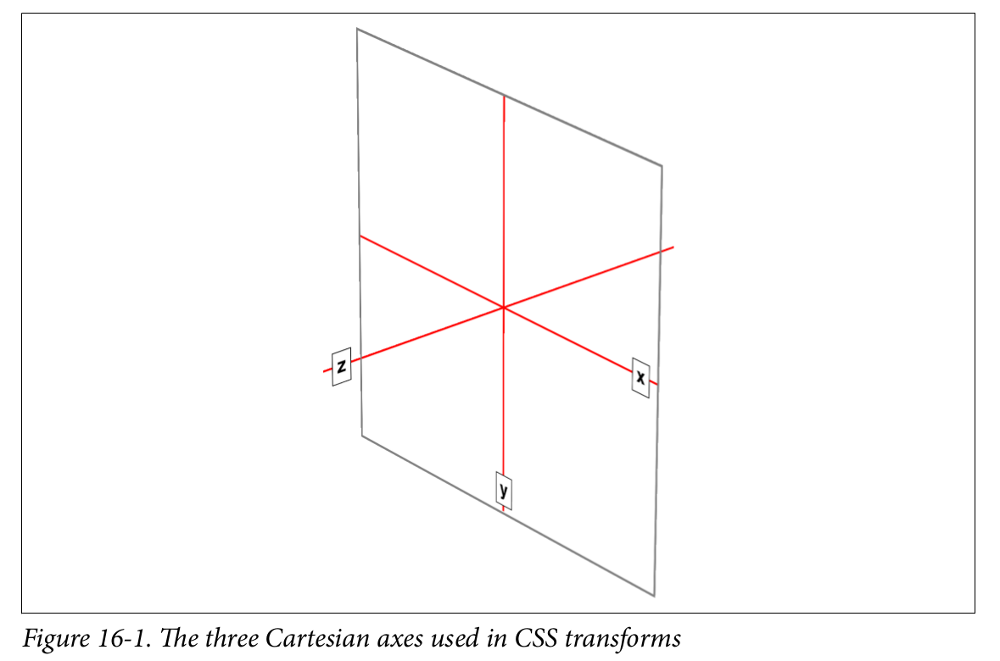
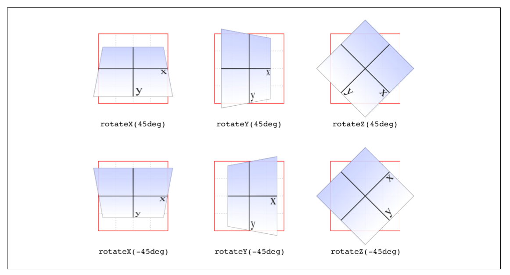
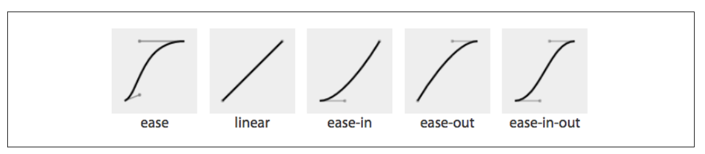
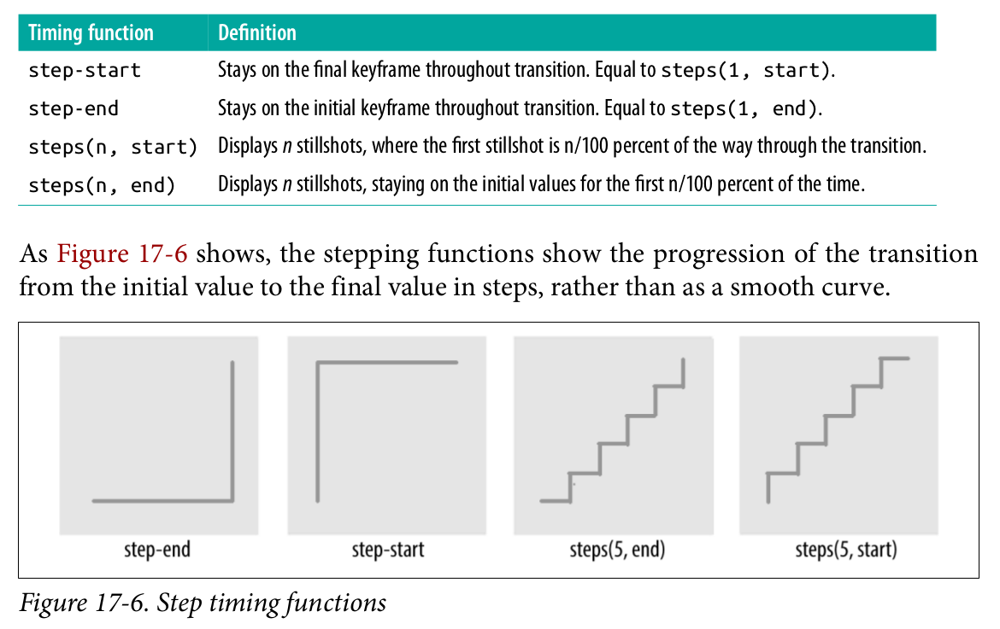
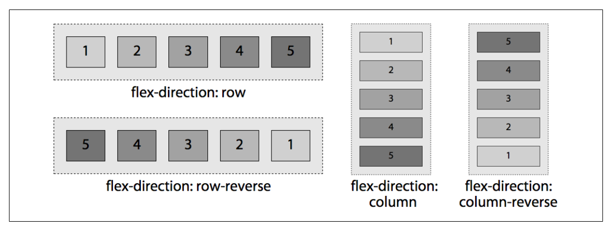
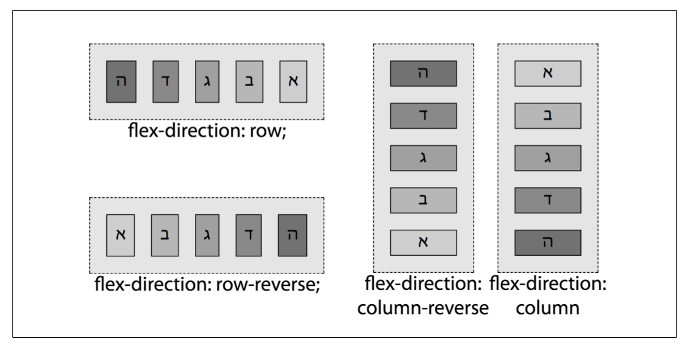
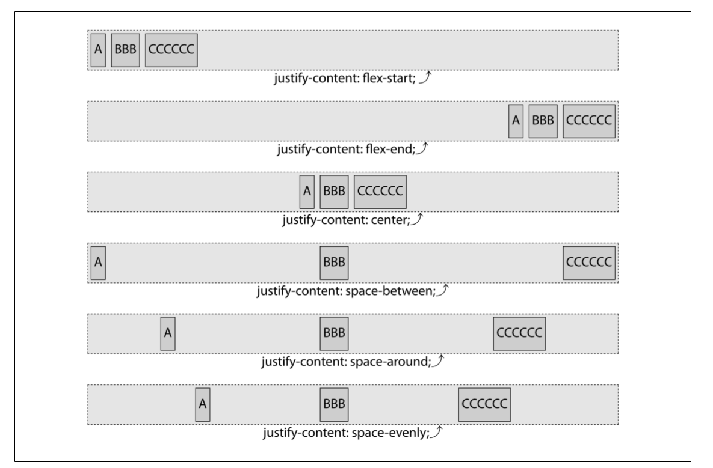

# CSS

1. display: block, none, inline, inline-block, list-item, table, inherit
1. Layout
   1. positioning
      1. overflow:hidden display:table-cell。
   1. floating
   1. flex layout
   1. grid layout
   1. table layout
   1. responsive design
      1. viewport
      1. media query
1. effects
1. transforms
1. transition
1. animation
1. SASS, LESS, BEM, OOCSS

- [CSS](#css)
    - [Elements](#elements)
        - [Replaced and Nonreplaced Elements](#replaced-and-nonreplaced-elements)
        - [Styles](#styles)
            - [External Styles](#external-styles)
            - [Embedded Styles](#embedded-styles)
            - [Inline Styles](#inline-styles)
    - [CSS Rule](#css-rule)
        - [Vendor prefixing](#vendor-prefixing)
        - [Comments](#comments)
    - [Selector](#selector)
        - [Basic Selector](#basic-selector)
        - [Combinator](#combinator)
        - [Pseudo Class](#pseudo-class)
        - [Pseudo Elements](#pseudo-elements)
        - [Link Related Selector](#link-related-selector)
        - [Specificity](#specificity)
        - [Cascading and Inheritance](#cascading-and-inheritance)
    - [Box Model](#box-model)
    - [Margin Collapsing](#margin-collapsing)
    - [Normal Flow](#normal-flow)
    - [`display`](#display)
    - [Positioning](#positioning)
        - [Non-replaced Elements](#nonreplaced-elements)
        - [Positioned Element](#positioned-element)
        - [Containing Block](#containing-block)
        - [Inline Element Formatting](#inline-element-formatting)
        - [Float](#float)
        - [Offset Property](#offset-property)
    - [Stacking Context](#stacking-context)
    - [Formatting Context](#formatting-context)
    - [Display](#dispaly)
    - [Media Query](#media-query)
        - [Media types](#media-types)
        - [Media Features](#media-features)
        - [Logical Operators](#logical-operators)
        - [Comma Separated Lists](#comma-separated-lists)
    - [Feature Query](#feature-query)
    - [Transform](#transform)
        - [Transform Functions](#transform-functions)
            - [Translate](#translate)
            - [Scale](#scale)
            - [Rotate](#rotate)
            - [Skew](#skew)
            - [Perspective](#perspective)
            - [Matrix](#matrix)
        - [Transform Related Properties](#transform-related-properties)
    - [Transition](#transition)
    - [Flexible Box Layout](#flexible-box-layout)
    - [Centering](#centering)
        - [Centering Horizontally](#centering-horizontally)
            - [Text](#text)
            - [Block Or Image](#block-or-image)
        - [Centering Vertically](#centering-vertically)
            - [Single Line of Text](#single-line-of-text)
            - [Inline or Table Content](#inline-or-table-content)
            - [Centering by Absolute Positioning and Transform](#centering-by-absolute-positioning-and-transform)
        - [Centering By Flex Layout](#centering-by-flex-layout)

## Elements

### Replaced and Nonreplaced Elements

Replaced elements are elements whose contents are replaced by something that is not directly represented by document. It has a intrinsic width and height.

Typical replated elements are:

- `<iframe>`
- `<embed>`
- `<video>`
- ``
- `<input>`

Some elements are treated as replaced elements only in specific cases:

- `<audio>`
- `<canvas>`
- `<object>`
- `<applet>`

### Styles

#### External Styles

Stylesheet in a html document falls into following categories.

1. **Persistent** (no rel="alternate", no title="..."), always applied to document.
1. **Preferred** (no rel="alternate", with title="..."), applied by default, when there're multiple preferred stylesheets, only one of them will take effect, others will be ignored. However, HTML specification doesn't define rules for deciding which one to use.
1. **Alternate** (rel="stylesheet alternate", title="..."), disabled by default, activated when selected by user.

If any alternate stylesheet is selected by user, all preferred stylesheets are disabled.

Media property of `<link>` specifies preferred media for stylesheets, corresponding stylesheet takes effect when actual media fits value of media property.

```html
<link href="default.css" rel="stylesheet" title="Default">
<link href="basic.css" rel="alternate stylesheet" title="Basic">
<link href="fancy.css" rel="alternate stylesheet" title="Fancy">
```

`<link>` element has `onload` for handling `load` event and `onerror` for `error` event when loading external stylesheet.

```html
<script>
function sheetLoaded() {
  // Do something interesting; the sheet has been loaded
}

function sheetError() {
  console.log("An error occurred loading the stylesheet!");
}
</script>

<link rel="stylesheet" href="mystylesheet.css" onload="sheetLoaded()"
  onerror="sheetError()">
```

#### Embedded Styles

`<style>` tag is used to write CSS directly inside html document.

```html
<style type='text/css' media='print screen' nonce title='Default'>
@import url(http://example.org/library/layout.css);
@import url(basic-text.css);
@import url(printer.css) print;
body {color: red;}
h1 {color: blue;}
</style>
```

1. `type` attribute is optional and defaults to `text/css`.
1. `media` and `title` works like `<link>` element.

`@import` directive can be used inside css to include rules from external stylesheets.

1. It must be placed before other stylesheet rules, otherwise it will be ignored.
1. Relative or absolute urls can be used to refer to external stylesheet.
1. Media query can be used likely.

#### Inline Styles

Use `style` attribute of a html element to specify inline styles for correpsonding element.

```html
<p style="color: gray;">The most wonderful of all breakfast foods is
the waffle—a ridged and cratered slab of home-cooked, fluffy goodness...
</p>
```

Value of `style` attributes can be one or more specific rules. `@import` directive, selectors cannot be used.

## CSS Rule


### Vendor prefixing

|Prefix|Vendor|
|--|--|
|-epub-| International Digital Publishing Forum ePub format|
|-moz-| Mozilla-based browsers(e.g. Firefox)|
|-ms-| Microsoft Internet Explorer|
|-o-| Opera-based browsers|
|-webkit-| Webkit-based browsers(e.g. Safari and Chrome)|

### Comments

CSS comments has only one format of `/* ... */`, it can span over multiple lines. No rest of the line comment like `//` in C++ or `#` in python.

```css
/* This is a CSS1 comment, and it
can be several lines long without
any problem whatsoever. */

h1 {color: gray;}  /* This CSS comment is several lines */
```

## Selector

### Basic Selector

<table>
    <tr>
        <th align='left'>Type</th>
        <th align='left'>Syntax</th>
        <th align='left'>Explaination</th>
    </tr>
    <tr>
        <td>Element Selector</td>
        <td><code>h2</code></td>
        <td>Select elements by type</td>
    </tr>
    <tr>
        <td>Class Selector</td>
        <td><code>.class_name</code></td>
        <td>Select elements by class attribute, multiple class selector can be use simultaneously, space not allowed in between. Equivalent to <code>[class~=class_name]</code></td>
    </tr>
    <tr>
        <td>ID Selector</td>
        <td><code>#id_value</code></td>
        <td>Select single element by id. Actual implementation may not check uniqueness of id, so multiple elements may be selected in this case. Equivalent to <code>[id=id_value]</code></td>
    </tr>
    <tr>
        <td>Universal Selector</td>
        <td><code>*</code></td>
        <td><span>Select all elements. From CSS3, asterisk may be used with <em>namespace</em></span>
        <ul>
        <li>
            <code>ns|*</code><span> mathes all elements in namesapce <em>ns</em></span>
        </li>
        <li>
            <code>*|*</code><span> mathes all elements</span>
        </li>
        <li>
            <code>|*</code><span> mathes all elements without declared namesapce</span>
        </li>
        </ul>
        </td>
    </tr>
    <tr>
        <td>Attribute Selector</td>
        <td><code>.primary[attr1 operator value i]</code></td>
        <td>
            <p>
            Squre brackets can be used to select element by attribute, multiple attributes selector can be used simultaneously. An <em>i</em> or <em>I</em> before closing bracket means to match attribute values case-insensitively</p>
            <ul>
                <li>
                    <code>img[title]</code>
                    <span>
                        Select elements with attribute
                    </span>
                </li>
                <li>
                    <code>input[type="text"]</code>
                    <span>
                    Select elements with exact attribute value
                    </span>
                </li>
                <li>
                    <code>a[href^="http://"]</code>
                    <span>Select elements with attribute value prefix</span>
                </li>
                <li>
                    <code>a[href$=".pdf"]</code>
                    <span>Select elements with attribute value suffix</span>
                </li>
                <li>
                    <code>img[src*="headshot"]</code>
                    <span>Select elements with attribute value containing substring</span>
                </li>
                <li>
                    <code>img[src~="Figure"]</code>
                    <span>Select elements with attribute value containing word in a space-separated list of words</span>
                </li>
                <li>
                    <code>img[lang|="en"]</code>
                    <span>Select elements with attribute value starting with word followed by dash(U+002D) or matches exactly</span>
                </li>
            </ul>
        </td>
    </tr>
</table>

### Combinator

<table>
    <tr>
        <th align='left'>Type</th>
        <th align='left'>Syntax</th>
        <th align='left'>Explaination</th>
    </tr>
    <tr>
        <td>Group Selector</td>
        <td><code>h1, h2</code></td>
        <td>
            Multiple selectors can be composed into one selector in a comma-separated format. It selects elements that matches any of the multiple selectors.
        </td>
    </tr>
    <tr>
        <td>Adjacent Sibling Selector</td>
        <td><code>former + target</code></td>
        <td>
            The <strong>adjacent sibling combinator(+)</strong> separates two selectors and matches the second element only if it <em>immediately</em> follows the first element and both are children of the same element.
        </td>
    </tr>
    <tr>
        <td>General Sibling Selector</td>
        <td><code>selector1 ~ selector2</code></td>
        <td>
        The <strong>general sibling combinator(~)</strong> separates two selectors and matches the second element only if it follows the first element (though not necessarily immediately), and both are children of the same parent element.
        </td>
    </tr>
    <tr>
        <td>Child Selector</td>
        <td><code>h1 > h2</code></td>
        <td>
        The <strong>child combinator(>)</strong>is placed between two CSS selectors. It matches only those elements matched by the second selector that are the children of elements matched by the first.
        </td>
    </tr>
    <tr>
        <td>Descendant Selector</td>
        <td><code>h1 em</code><br><code>h1 >> em</code></td>
        <td>
            <p>
                The <strong>descendant combinator</strong> — typically represented by a single space<strong>( )</strong> character — combines two selectors such that elements matched by the second selector are selected if they have an ancestor element matching the first selector. Selectors that utilize a descendant combinator are called descendant selectors.
            </p>
            <p>
                The descendant combinator is technically one or more CSS white space characters (space character and/or one of four control characters: carriage return, form feed, new line and tab character).
            </p>
        </td>
    </tr>
</table>

### Pseudo Class

<table>
   <tr>
      <th align='left'>Type</th>
      <th align='left'>Syntax</th>
      <th align='left'>Explaination</th>
   </tr>
   <tr>
      <td rowspan='10'>Structual</td>
      <td><code>:first-child</code></td>
      <td>
         Selects first element among a group of elements.
      </td>
   </tr>
   <tr>
      <td><code>:first-of-type</code></td>
      <td>
         Selects first element of its type among a group of elements.
      </td>
   </tr>
   <tr>
      <td><code>:last-child</code></td>
      <td>
         Selects last element among a group of elements.
      </td>
   </tr>
   <tr>
      <td><code>:last-of-type</code></td>
      <td>
         Selects last element of its type among a group of elements.
      </td>
   </tr>
   <tr>
      <td><code>:nth-child()</code></td>
      <td>
         <span>Select one or more elements based on index. <code>a</code> and <code>b</code> inside <code>an+b</code> must be integer</span>
         <ul>
            <li>
               <code>:nth-child(odd)</code>
            <li>
               <code>:nth-child(even)</code>
            </li>
            <li>
               <code>:nth-child(an+b)</code>
            </li>
         </ul>
      </td>
   </tr>
   <tr>
      <td><code>:nth-of-type()</code></td>
      <td>
         <span>Select one or more elements of its type based on index. Format ditto.
      </td>
   </tr>
   <tr>
      <td><code>:nth-last-child()</code></td>
      <td>
         <span>Select one or more elements based on index, counting from the end. Format ditto.
      </td>
   </tr>
   <tr>
      <td><code>:nth-last-of-type()</code></td>
      <td>
         <span>Select one or more elements of its type based on index, couting from the end. Format ditto.
      </td>
      </td>
   </tr>
   <tr>
      <td><code>:only-child</code></td>
      <td>
         Selects an element without siblings.
      </td>
   </tr>
   <tr>
      <td><code>:only-of-type</code></td>
      <td>
         Selects an element of its type without siblings.
      </td>
   </tr>
   <tr>
      <td rowspan='6'>Dynamic</td>
      <td><code>:link</code></td>
      <td>
         Selects any unvisited <code>&lt;a&gt;</code>, <code>&lt;area&gt;</code>,<code>&lt;link&gt;</code> element that has <em>href</em> attribute.
      </td>
   </tr>
   <tr>
      <td><code>:visited</code></td>
      <td>
         Select any visited anchor tag, for <a href="https://developer.mozilla.org/en-US/docs/Web/CSS/Privacy_and_the_:visited_selector"/>security reasons</a>, the styles that can be modified using this selector are very limited.
      </td>
   </tr>
   <tr>
      <td><code>:focus</code></td>
      <td>
         Select an element that has received focus.
      </td>
   </tr>
   <tr>
      <td><code>:focus-within</code></td>
      <td>
         Select an element that <em>contains </em>a focused element.
      </td>
   </tr>
   <tr>
      <td><code>:hover</code></td>
      <td>
         Selects an element on which the mouse pointer is placed. Maybe <a href="https://developer.mozilla.org/en-US/docs/Web/CSS/:hover">problematic</a> on touchscreens.
      </td>
   </tr>
   <tr>
      <td><code>:active</code></td>
      <td>
         Selects elements that is activated by user. 'Activation' typeically starts when user presses down the primary button and ends when it's released. CSS3 specifies that <code>:active</code> must only apply to the primary button on systems with multi-button mice, on right-handed mice, it's typically the leftmost button.
      </td>
   </tr>
   <tr>
      <td rowspan='13'>UI State</td>
      <td><code>:enabled</code></td>
      <td>
         Selects enabled elements. An element is enabled if it can be activated(select, click, type etc.) or accept focus.
      </td>
   </tr>
   <tr>
      <td><code>:disabled</code></td>
      <td>
         Selects disabled elements.
      </td>
   </tr>
   <tr>
      <td><code>:checked</code></td>
      <td>
         Selects any <strong>radio</strong> (<code>&lt;input type="radio"&gt;</code>), <strong>checkbox</strong> (<code>&lt;input type="checkbox"&gt;</code>) or <strong>option</strong> (<code>&lt;option&gt;</code> inside <code>&lt;select&gt;</code>) that is checked or toggled to an <em>on</em> state.
      </td>
   </tr>
   <tr>
      <td><code>:indeterminate</code></td>
      <td>
         Intermediate state is used to style differently indicating users to select a value. Selects three types of elements.
         <ul>
            <li>
               <code>&lt;input type='checkbox'&gt;</code> with <em>indeterminate</em> property set to true.
            </li>
            <li>
               <code>&lt;input type='radio'&gt;</code>, several <strong>radio</strong> buttons with same <em>name</em> attribute are treated as a radio button group. Inside same group only one <strong>radio</strong> button can be selected, when no <strong>radio</strong> buttons are selected, they're considered to be in <em>indeterminate</em> state.
            </li>
            <li>
               <code>&lt;progress&gt;</code> in <em>indeterminate</em> state. If there is no <em>value</em> attribute, the progress bar is <em>indeterminate</em>, this indicates that an activity is ongoing with no indication of how long it is expected to take. Use <code>element.removeAttribute("value")</code> to set <code>&lt;progress&gt;</code> element back to <em>indeterminate</em> state.
            </li>
         </ul>
      </td>
   </tr>
   <tr>
      <td><code>:default</code></td>
      <td>
         <p>
            Select form elements that is default among a group of related elements. There're multiple default elements if more than one elements are selected by default when group permits multiple selection.
         </p>
         <ul>
            <li>
               <code>&lt;button&gt;</code>
            </li>
            <li>
               <code>&lt;input type='checkbox'&gt;</code>
            </li>
            <li>
               <code>&lt;input type='radio'&gt;</code>
            </li>
            <li>
               <code>&lt;option&gt;</code>
            </li>
         </ul>
      </td>
   </tr>
   <tr>
      <td><code>:valid</code></td>
      <td>
         Selects <code>&lt;input&gt;</code> or other <code>&lt;form&gt;</code> element whose contents are valid.
      </td>
   </tr>
   <tr>
      <td><code>:invalid</code></td>
      <td>
         Selects <code>&lt;input&gt;</code> or other <code>&lt;form&gt;</code> element whose contents are invalid.
      </td>
   </tr>
   <tr>
      <td><code>:in-range</code></td>
      <td>
         Select <code>&lt;input&gt;</code> element with <em>range limitation</em> specified by <em>min</em>, <em>max</em> attributes, and its value is within range. In the absence of such a limitation, it's neither <code>in-range</code> nor <code>out-of-range</code>.
      </td>
   </tr>
   <tr>
      <td><code>:out-of-range</code></td>
      <td>
         Select <code>&lt;input&gt;</code> element with <em>range limitation</em> specified by <em>min</em>, <em>max</em> attributes, and its value is out of range.
      </td>
   </tr>
   <tr>
      <td><code>:required</code></td>
      <td>
         <p>
            Select <code>&lt;form&gt;</code> elements that <strong>has</strong> <em>required</em> attribute set on it.
         </p>
         <ul>
            <li>
               <code>&lt;input&gt;</code>
            </li>
            <li>
               <code>&lt;select&gt;</code>
            </li>
            <li>
               <code>&lt;textarea&gt;</code>
            </li>
         </ul>
      </td>
   </tr>
   <tr>
      <td><code>:optional</code></td>
      <td>
         <p>
            Select <code>&lt;form&gt;</code> elements that has <strong>no</strong> <em>required</em> attribute set on it.
         </p>
         <ul>
            <li>
               <code>&lt;input&gt;</code>
            </li>
            <li>
               <code>&lt;select&gt;</code>
            </li>
            <li>
               <code>&lt;textarea&gt;</code>
            </li>
         </ul>
      </td>
   </tr>
   <tr>
      <td><code>:read-write</code></td>
      <td>
         <p>
            Select elements whose content is <strong>editable</strong> by user.
         </p>
         <ul>
            <li>
               <code>&lt;input&gt;</code>
            </li>
            <li>
               <code>&lt;p contenteditable="true"&gt;</code>
            </li>
         </ul>
      </td>
   </tr>
   <tr>
      <td><code>:read-only</code></td>
      <td>
         <p>
            Select elements whose content is <strong>not</strong> editable by user.
         </p>
         <ul>
            <li>
               <code>&lt;input readonly&gt;</code>
            <li/>
            <li>
               <code>&lt;p contenteditable="false"&gt;</code>
            </li>
         </ul>
      </td>
   </tr>
   <tr>
      <td>fragment</td>
      <td><code>:target</code></td>
      <td>
         <ol>
            <li>
               If a page's URL has no fragment, no elements inside it will be matched.
            </li>
            <li>
               If a page's URL has fragment, element whose <em>id</em> attribute value matches the URL's fragment.
            </li>
         </ol>
      </td>
   </tr>
   <tr>
      <td>language</td>
      <td><code>:lang(&lt;language-code&gt;)</code></td>
      <td>
         <p>
            Selects elements based on language they are determined to be in.
         </p>
         <blockquote>
            In HTML, the language is determined by a combination of the lang attribute, the
            &lt;meta&gt;
            element, and possibly by information from the protocol (such as HTTP headers). For other document types there may be other document methods for determining the language.
         </blockquote>
      </td>
   </tr>
   <tr>
      <td>negation</td>
      <td><code>:not(&lt;selector&gt;#)</code></td>
      <td>
         <p>
            Selects elements that don't match supplied list of selectors. Supplied list of selectors cannot be another negation selector or pseudo-elements.
         </p>
      </td>
   </tr>
   <tr>
      <td rowspan='3'>page</td>
      <td><code>:left</code></td>
      <td>
         <p>
            Used with <code>@page</code> <a href="https://developer.mozilla.org/en-US/docs/Web/CSS/At-rule">at rule</a>, selects all left-hand pages of a printed documents.
         </p>
         <p>
            You can't change all CSS properties with this pseudo-class. You can only change the <code>margin</code>, <code>padding</code>, <code>border</code>, and <code>background</code> properties of the page box. All other properties will be ignored, and only the page box, not the document content on the page, will be affected.
         </p>
      </td>
   </tr>
   <tr>
      <td><code>:right</code></td>
      <td>
         <p>
            Used with <code>@page</code> <a href="https://developer.mozilla.org/en-US/docs/Web/CSS/At-rule">at rule</a>, selects all right-hand pages of a printed documents.
         </p>
         <p>Ditto.</p>
      </td>
   </tr>
   <tr>
      <td><code>:first</code></td>
      <td>
         <p>
            Used with <code>@page</code> <a href="https://developer.mozilla.org/en-US/docs/Web/CSS/At-rule">at rule</a>, selects all right-hand pages of a printed documents.
         </p>
         <p>
            You can't change all CSS properties with this pseudo-class. You can only change the <code>margins</code>, <code>orphans</code>, <code>widows</code>, and page breaks of the document. Furthermore, you may only use absolute-length units when defining the margins. All other properties will be ignored.
         </p>
      </td>
   </tr>
   <tr>
      <td>empty</td>
      <td><code>:empty</code></td>
      <td>
         <p>
            Selects elements with <strong>no</strong> children. Children refers to element nodes or text nodes. Comment and processing instructions doesn't affect whether element is considered empty or not.
         </p>
         <ul>
            <li>
               <code>&lt;div&gt;not empty&lt;&sol;div&gt;</code>
            </li>
            <li>
               <code>&lt;div&gt;&lt;!--empty--&gt;&lt;&sol;div&gt;</code>
            </li>
            <li>
               <code>&lt;div&gt; &lt;!--not empty,whitespace--&gt; &lt;&sol;div&gt;</code>
            </li>
         </ul>
      </td>
   </tr>
   <tr>
      <td>scope</td>
      <td><code>:scope</code></td>
      <td>
         <p>
            Provide a scope element for following selectors to match against. When used in stylesheet, it's equivalent to <code>:root</code> currently.
         </p>
         <p>
            When used from a DOM API such as <code>querySelector()</code>, <code>querySelectorAll()</code>, <code>matches()</code>, or <code>Element.closest()</code>, <code>:scope</code> matches the element you called the method on.
         </p>
      </td>
   </tr>
   <td>root</td>
   <td><code>:root</code></td>
   <td>
      Selects the root element of a document. It's <code>&lt;html&gt;</code> in HMLT document, convenient to use in XML since root element is not fixed inside XML document.
   </td>
   </tr>
   </tr>
   <td><a href='https://fullscreen.spec.whatwg.org/#:fullscreen-pseudo-class'>fullscreen</a></td>
   <td><code>:fullscreen</code></td>
   <td>
   </td>
   </tr>
</table>

### [Pseudo Elements](https://drafts.csswg.org/css-pseudo-4/#first-letter-pseudo)

Pseudo elements start with double colon in CSS3. Legacy sytax use single colon in CSS2, which is not preferred now.

<table>
    <tr>
        <th align='left'>Type</th>
        <th align='left'>Syntax</th>
        <th align='left'>Explaination</th>
    </tr>
    <tr>
        <td><a href='https://drafts.csswg.org/css-pseudo-4/#first-letter-pseudo'>first letter</a></td>
        <td><code>::first-letter</code></td>
        <td>
            <p>
                Selects first letter of first line of a block-level document, but only when not preceded by other content (such as images or inline tables).
            </p>
            <ul>
                <li>
                    Puntuations that preceds or immediately follows the first letter is included in the match. "-" and "_" are not punctuation.
                </li>
                <li>
                    Some languages have digraphs that are always capitalized together, like <strong>IJ</strong> in Dutch. Both letters should be matched in these cases.
                </li>
                <li>
                    <em>content</em> property inside pseudo-element <code>::before</code> could inject text at the beginning. In that case, <code>::first-letter</code> will match the first letter of generated content.
                </li>
            </ul>
        </td>
    </tr>
    <tr>
        <td><a href='https://drafts.csswg.org/css-pseudo-4/#first-line-pseudo'>first line</a></td>
        <td><code>::first-line</code></td>
        <td>
            <p>
                Selects the first line of a block level element. Note that the first line is dynamic according to width of element, width of document and font size of text.
            </p>
        </td>
    </tr>
    <tr>
        <td><a href='https://drafts.csswg.org/css-pseudo-4/#generated-content'>before</a></td>
        <td><code>::before</code></td>
        <td>
            <p>
                Used to create a pseudo-element as the <strong>first</strong> child of selected element. It's often used to add cosmetic content to an element with <em>content</em> property. Inline by default.
            </p>
        </td>
    </tr>
    <tr>
        <td><a href='https://drafts.csswg.org/css-pseudo-4/#generated-content'>after</a></td>
        <td><code>::after</code></td>
        <td>
            <p>
                Used to create a pseudo-element as the <strong>last</strong> child of selected element. It's often used to add cosmetic content to an element with <em>content</em> property. Inline by default.
            </p>
        </td>
    </tr>
    <tr>
        <td><a href='https://drafts.csswg.org/css-pseudo-4/#marker-pseudo'>marker</a></td>
        <td><code>::marker</code></td>
        <td>
        </td>
    </tr>
    <tr>
        <td><a href='https://drafts.csswg.org/css-pseudo-4/#placeholder-pseudo'>placeholder</a></td>
        <td><code>::placeholder</code></td>
        <td>
        </td>
    </tr>
    <tr>
        <td><a href='https://w3c.github.io/webvtt/#the-cue-pseudo-element'>cue</a></td>
        <td><code>::cue</code></td>
        <td>
        </td>
    </tr>
    <tr>
        <td><a href='https://fullscreen.spec.whatwg.org/#::backdrop-pseudo-element'>backdrop</a></td>
        <td><code>::backdrop</code></td>
        <td>
        </td>
    </tr>
</table>

Pseudo elements don't exist in document source or DOM tree, they are generated on fly by user agent for correct styling.

Properties available for `::first-letter` and `::first-line` pseudo-element are limited.

`::before` and `::after` pseudo-element are contained by the element's formatting box, and thus not applicable to replace elements such as ``, `<br>`.

1. [HTML5 Constraint Validation](https://developer.mozilla.org/en-US/docs/Web/Guide/HTML/HTML5/Constraint_validation)
1. [HTML5 Form Data Validation](https://developer.mozilla.org/en-US/docs/Learn/HTML/Forms/Form_validation#Validating_forms_using_JavaScript)

### Link Related Selector

Link related pseudo-class selectors `:link`, `:visited`, `:hover`, `:active` should be defined by the LVHA-order to make links work properly.

1. `:link` has the lowest priority and can be overwritten by other rules, it goes first.
1. `<a>` is expected to respond to hover after being visited, so `:hover` goes after `:visited`.
1. click on `<a>`, we expect `:active` to take effect and overwrite `:hover`, so `:active` goes after `:hover`.

### Specificity

Each CSS rule applied on a html element has a specificity value decided by its selectors. When multiple CSS rules of same property name applied to single html element, the rule with highest specificity value wins.

Specificity value is composed of four parts like `0,0,0,0`, two specificity value are compared from left to right do decide its order. Notice that digit will **not** be carried like integer number. Each type of selector contributes to specificity value. Specificity value of a complext selector is the sum of all selectors inside it.

<table>
    <tr>
        <th align='left'>Rules</th>
        <th align='left'>Specificity Value</th>
    </tr>
    <tr>
        <td>Inherited</td>
        <td>No Value, no impact on a selector's overall specificity</td>
    </tr>
    <tr>
        <td>Combinators</td>
        <td>No Value, no impact on a selector's overall specificity</td>
    </tr>
    <tr>
        <td><code>:not()</code></td>
        <td>Specificity value of negation selector is equivalent to specificity value of selector inside it..</td>
    </tr>
    <tr>
        <td>Universal Selector</td>
        <td><code>0,0,0,0</code></td>
    </tr>
    <tr>
        <td>Element Selector, Pseudo-Element Selector</td>
        <td><code>0,0,0,1</code></td>
    </tr>
    <tr>
        <td>Class Selector (excluding <code>:not()</code>) , Pseudo-Class Selector, Attribute Selector</td>
        <td><code>0,0,1,0</code></td>
    </tr>
    <tr>
        <td>ID Selector</td>
        <td><code>0,1,0,0</code></td>
    </tr>
    <tr>
        <td>Inline Style</td>
        <td><code>1,0,0,0</code></td>
    </tr>
</table>

Rules using above selectors are grouped as umimportant rules. Add `!important` before ending semi colon of a rule to turn it into important rules. `!importtant` must be placed just before ending semi colon, otherwise the rule is invalid and ignored.

```css
p.light {
    color: yellow;
    font: smaller Times, serif !important;
    font: !important smaller Times, serif; /* invalid rule, ignored */
}
```

Important rules and unimportant rules are considered separately. All important rules are collected and ordered with specificity, all umimportant rules are collected and ordered with specificity. For important and umimportant rule with same property name, important rules always win.

Important rules break the natural cascading structure of stylesheets, try to avoid using it if possible. Only use it on page-specific CSS that overrides foreign CSS (from external libraries like Bootstrap or normalize.css)

### [Cascading and Inheritance](https://developer.mozilla.org/en-US/docs/Learn/CSS/Introduction_to_CSS/Cascade_and_inheritance)

1. It first filters all the rules from the different sources to keep only the rules that apply to a given element. That means rules whose selector matches the given element and which are part of an appropriate media at-rule.
1. Then it sorts these rules according to their importance, that is, whether or not they are followed by !important, and by their origin. The cascade is in ascending order, which means that !important values from a user-defined style sheet have precedence over normal values originated from a user-agent style sheet:
    <table>
        <tr>
            <th></th>
            <th>Origin</th>
            <th>Importance</th>
        </tr>
        <tr>
            <td>1</td>
            <td>user agent</td>
            <td>normal</td>
        </tr>
        <tr>
            <td>2</td>
            <td>user</td>
            <td>normal</td>
        </tr>
        <tr>
            <td>3</td>
            <td>author</td>
            <td>normal</td>
        </tr>
        <tr>
            <td>4</td>
            <td>
                <a href='https://developer.mozilla.org/en-US/docs/Web/CSS/@keyframes'>CSS Animations</a>
            </td>
            <td>
                not cascaded, choose lastest defined in the most important document.
            </td>
        </tr>
        <tr>
            <td>5</td>
            <td>author</td>
            <td><code>!important</code></td>
        </tr>
        <tr>
            <td>6</td>
            <td>user</td>
            <td><code>!important</code></td>
        </tr>
        <tr>
            <td>7</td>
            <td>user agent</td>
            <td><code>!important</code></td>
        </tr>
    </table>
1. In case of equality, the specificity of a value is considered to choose one or the other.
1. Sort by order. Rules appearing later have higher priority.

## Box Model

Every element in html page is a rectangular box.


`box-sizing` is used to specify which box model is used.

1. `content-box` - default option, `width` property means content width.
   ```math
   width = content-width
   totalWidth = width + padding-left + padding-right + border-left + border-right
   ```
1. `padding-box` - `width` property means padding width and content width combined.
   ```math
   width = content-width + padding-left + padding-right
   totalWidth = width + padding-left + padding-right + border-left + border-right
   ```
1. `border-box` - `width` property means total width of content, padding and border.
   ```math
   width = content-width + padding-left + padding-right + border-left + border-right
   totalWidth = width
   ```

## Margin Collapsing

In a normal content flow, when multiple vertical margins are adjacent to each other. Multiple margins will collapse into a single one with its height equivalent to the maximum height of collapsed margins.

Typical cases for margin collapsing

1. Self Collapsing. When an element is empty, which means its height of content, padding and border are zero, its top margin and bottom margin will collapse into one margin.
1. Adjacent Collapsing. Bottom margin of element above and top margin of element below will collapse into one margin.
1. Parent Children Collapsing. When parent element top margin is adjacent to top margin of first child element, or parent element bottom margin is adjacent to bottom margin of last child element, margin collapsing will happen.

## [Normal Flow](https://www.w3.org/TR/CSS2/visuren.html#normal-flow)

1. Block box - This is a box that generate new line both before and after it, so block boxes will stack vertically.
1. Inline box - This is a box that will not generate new line before or after it.
1. Inline-block box - This is a box that is a block box internally, but acts like an inline box externally.

## [`display`](https://developer.mozilla.org/en-US/docs/Web/CSS/display)

HTML specification says that inline elements cannot contain block elements like below.

```html
<span>inline<p>block</p></span>
```

But CSS has no such restrictions, inline and block elements can be nested in random order.

1. display-outside
1. display-inside
1. display-listitem
1. display-internal
1. display-box
1. display-legacy

## [Positioning](https://drafts.csswg.org/css-position-3/#position-property)

Positioning allows you to define

<table>
    <caption><h2>position</h2></caption>
    <tr>
        <td>Values</td>
        <td>static | relative | sticky | absolute | fixed </td>
    </tr>
    <tr>
        <td>initial value</td>
        <td>static</td>
    </tr>
    <tr>
        <td>Applies to</td>
        <td>All elements</td>
    </tr>
    <tr>
        <td>Computed Value</td>
        <td>As specified</td>
    </tr>
    <tr>
        <td>Inherited</td>
        <td>No</td>
    </tr>
    <tr>
        <td>Animatable</td>
        <td>No</td>
    </tr>
</table>

Containing block and initial containing block.

1. static - element is not positioned, use position in normal flow.
1. fixed - element is positioned relative to viewport of browser window.

Width and height of replaced elements can be shrinked or expanded to fit if set to auto, nonreplaced elements has an intrinsic width and height, so it cannot be shrinked or expanded.

```math
totalWidth = left + right + margin-left + margin-right + border-width-left + border-width-right + padding-left + padding-right + width
```

If horizontal width is overconstrained, left takes over right for left-to-right language, right is computed as remainder value to solve the equation, right takes over left for right-to-left language, left is computed as remainder value to solve the equation.

<table>
    <caption><h2>position</h2></caption>
    <tr>
        <th align='left'>property</th>
        <th align='left'>default</th>
        <th align='left'>auto behaviour</th>
    </tr>
    <tr>
        <td>top</td>
        <td>auto</td>
        <td>lowest priority, computed as remainder value to solve equation, assume static position</td>
    </tr>
    <tr>
        <td>bottom</td>
        <td>auto</td>
        <td>lowest priority, computed as remainder value to solve equation</td>
    </tr>
    <tr>
        <td>margin-top<br>margin-bottom</td>
        <td>0</td>
        <td>when either is auto, takes remainder value, when both is auto, split remainder value equally.</td>
    </tr>
    <tr>
        <td>border-width-top<br>border-width-bottom</td>
        <td>auto</td>
        <td></td>
    </tr>
    <tr>
        <td>padding-top<br>padding-bottom</td>
        <td>0</td>
        <td></td>
    </tr>
    <tr>
        <td>width</td>
        <td>auto</td>
        <td>for replaced element, auto takes intrinsic height, for nonreplaced element, auto takes remainder or shrink to fit.</td>
    </tr>
</table>

### Nonreplaced Elements

In horizontal layout, either **right** or **left** can be placed according to the static position if their values are **auto**. In vertical layout, only **top** can take on the static position.

Also, if an absolutely positioned element's size is overconstrained in the vertical direction, **bottom** is ignored.

### Positioned Element

_positioned_ element is an element with poisiton value of `fixed`, `absolute`, `relative` or `sticky`.

### Containing Block

1. **static/relative** - containing block is formed by the edge of the content box of nearest ancestor element that is a block container (inline-block, block, list-item) or which establishes a formatting context (table container, flex container, grid container, or the block container)
1. **absolute** - containing block is formed by the edge of the _padding box_ of the nearest _positioned_ ancestor element.
1. **fixed** - containing block is established by the viewport (in the case of continous media) or the page area (in the case of paged media).
1. **absolute/fixed** - the containing block may also be formed by the edge of the padding box of the nearest ancestor element that has the following:
   1. A transform or perspective value other than none
   1. A will-change value of transform or perspective
   1. A filter value other than none or a will-change value of filter (only works on Firefox).

For a non-root element that has a position value of absolute, its containing block is
set to the nearest ancestor (of any kind) that has a position value other than static. This happens as follows:

1. If the ancestor is block-level, the containing block is set to be that element’s pad‐ ding edge; in other words, the area that would be bounded by a border.
1. If the ancestor is inline-level, the containing block is set to the content edge of the ancestor. In left-to-right languages, the top and left of the containing block are the top and left content edges of the first box in the ancestor, and the bottom and right edges are the bottom and right content edges of the last box. In right-to-left languages, the right edge of the containing block corresponds to the right content edge of the first box, and the left is taken from the last box. The top and bottom are the same.
1. If there are no ancestors, then the element’s containing block is defined to be the

**Initial containing block** refers to the rectangle that root element `<html>` resides. It has the dimensions of the viewport (for continuous media) or the page area (for paged media)

<table>
    <caption>
        Horizontal formatting of nonreplaced block boxes
    </caption>
    <tr>
        <th>margin-left</th>
        <th>width</th>
        <th>margin-right</th>
        <th>explaination</th>
    </tr>
    <tr>
        <td>auto</td>
        <td>auto</td>
        <td>auto</td>
        <td></td>
    </tr>
    <tr>
        <td>length</td>
        <td>auto</td>
        <td>auto</td>
        <td></td>
    </tr>
    <tr>
        <td>auto</td>
        <td>auto</td>
        <td>length</td>
        <td></td>
    </tr>
    <tr>
        <td>auto</td>
        <td>length</td>
        <td>auto</td>
        <td></td>
    </tr>
    <tr>
        <td>auto</td>
        <td>length</td>
        <td>length</td>
        <td></td>
    </tr>
    <tr>
        <td>length</td>
        <td>length</td>
        <td>auto</td>
        <td></td>
    </tr>
    <tr>
        <td>length</td>
        <td>auto</td>
        <td>length</td>
        <td></td>
    </tr>
    <tr>
        <td>length</td>
        <td>length</td>
        <td>length</td>
        <td></td>
    </tr>
</table>

1. `auto` width takes remainder space if possible, cannot be negative.
1. `auto` for margins splits remainder space if there's no width `auto`, can be negative.

For horizontal formatting of replaced block level elements, one exception is `auto` width will take element's intrisic width.

<table>
    <tr>
        <th>width</th>
        <th>height</th>
        <th>explaination</th>
    </tr>
    <tr>
        <td>auto</td>
        <td>auto</td>
        <td>width, height default to intrinsic value</td>
    </tr>
    <tr>
        <td>length</td>
        <td>auto</td>
        <td>width default to intrinsic value, height scales proportionally</td>
    </tr>
    <tr>
        <td>auto</td>
        <td>length</td>
        <td>height default to intrinsic value, width scales proportionally</td>
    </tr>
    <tr>
        <td>length</td>
        <td>length</td>
        <td>
            width, height takes specified length, image maybe sheared.
        </td>
    </tr>
</table>

Vertical formatting for block level elements

1. `auto` for margin-top and margin-bottom evaluate to 0.

1. percentage height is calculated if containing box height is specified explicitly, otherwise it's reset to `auto`,which takes.

Auto Heights

1. if element has no top padding, bottom padding, top border or bottom border, then element's margin collapse with child block level elements. Element height would equal to distance from top border edge of topmost block level element to bottom border edge of bottommost block level element.
    
1. If element has either top padding, bottom padding, top border and bottom border. Margin collapse between element's and its child block elements will not happen. Element height equals to distance from top margin outer edge of topmost child element to bottom margin outer edge of bottommost child element.
    

### Inline Element Formatting

### Float

If a nonreplaced element is floated, width must be specified for that element, otherwise its width is set to zero.

### Offset Property

Positioning allows you to define

<table>
    <caption><h2>top,right,bottom,left</h2></caption>
    <tr>
        <td>Values</td>
        <td>&lt;length&gt; | &lt;percent&gt; | auto</td>
    </tr>
    <tr>
        <td>initial value</td>
        <td>auto</td>
    </tr>
    <tr>
        <td>Applies to</td>
        <td>Positioned elements</td>
    </tr>
    <tr>Refer to the height of containing block for top and bottom, and the width of containing block for right and left</tr>
    <tr>
        <td>Computed Value</td>
        <td>For static elemens, auto; for length values, the corresponding absolute length; for percentage values, the specified value; otherwise, auto./td>
    </tr>
    <tr>
        <td>Inherited</td>
        <td>No</td>
    </tr>
    <tr>
        <td>Animatable</td>
        <td>&lt;length&gt;, &lt;percentage&gt;</td>
    </tr>
</table>

## Stacking Context

Stacking context is the model describing how multiple overlapping elements stack with each other from bottom to top. Elements with lower stacking order are drawn first and will be covered by elements with higher stacking order. Elements with highest stacking order are closest to users.

A stacking context is created on an element under following situations, refer to [MDN](https://developer.mozilla.org/en-US/docs/Web/CSS/CSS_Positioning/Understanding_z_index/The_stacking_context) for details.

1. Root element `<html>` of document. (Just like initial containing block)
1. `position` is 'absolute' or 'relative' and `z-index` is not 'auto'.
1. `position` is 'fixed' or 'sticky'.
1. child element of a flex box with `z-index` value other than 'auto'
1. Element with `opacity` less than 1
1. Element with `mix-blend-mode` value other than "normal"
1. Element with any of following properties with value other than "none"
    1. `transform'
    1. `filter'
    1. `perspective'
    1. `clip-path'
    1. `mask`/`mask-image`/`mask-border`
1. Element with `isolation` value "isolate"
1. Element with `-webkit-overflow-scrolling` value "touch"
1. Element with a `will-change` value, [this post](http://dev.opera.com/articles/css-will-change-property/)

`z-index` describes stacking order elements and it takes effect relative to its parent stacking context instead of root stacking context on root element. Child stacking context is contained within parent stacking context just like hierarchies of containg blocks.

A local stacking context established on an element is used as a base for all descendent elements to stack on it. When this process is done, all elements in this local stacking contex are considered to be combined into single inseparable layer, which then stacks with its siblings on parent stacking context.

So for two sibling stacking contexts s1 and s2, given a child element of s1 a very large `z-index` would not make it shown top of child elements of s2. It's decided by the relative order of `z-index` value between s1 and s2.

Stacking order is much like a version number, major number compared firstly, then minor number. A larger minor number itself doesn't make whole version number a larger one.

Inside a local stacking context, stacking order from bottom to top is as below.

1. Background and borders of local stacking context's root element.
1. Descendant positioned elements (and their children) with negative `z-index` values.
1. Descendant in-flow non-positioned non-inline blocks elements.
1. Descendant non-positioned floating blocks.
1. Descendant non-positioned inline elements.
1. Descendant positioned elements with `z-index` value of "auto" and any stacking contexts with `z-index: 0`.
1. Descendant positioned elements with positive `z-index` values.
1. Elements with same stacking order will be rendered in source order.


For global stacking order, refer to [the spec](https://www.w3.org/TR/CSS2/zindex.html).
Positioned elements with negative `z-index` may appear below its own parent when child element and parent element are within same stacking context, see this [blog](http://nicolasgallagher.com/css-drop-shadows-without-images/). But parent element cannot be root element of a stacking context, because the root element of a stacking context is always the first one to be drawn.

`z-index` only applies to positioned elements, no effects on non-positioned elements.

Reference

1. [Elaborate description of Stacking Contexts](https://www.w3.org/TR/CSS2/zindex.html)
1. [Layered presentatio spec](https://www.w3.org/TR/CSS21/visuren.html#layers)
1. [What No One Told You About Z-Index](https://philipwalton.com/articles/what-no-one-told-you-about-z-index/)
1. [CSS stacking contexts: What they are and how they work](https://tiffanybbrown.com/2015/09/css-stacking-contexts-wtf/index.html)
1. [Z-Index And The CSS Stack: Which Element Displays First?](http://vanseodesign.com/css/css-stack-z-index/)

## Formatting Context

## Dispaly

## [Media Query](https://www.w3.org/TR/mediaqueries-4/)

Media query can be used in following places.

1. `media` attribute of a `link` element.
1. `media` attribute of a `style` element.
1. media descriptor portion of an `@import` declaration.
1. media descriptor portion of an `@media` declaration.


### Media types

1. `all` - Use in all presentational media.
1. `print` - Use for document printing or print preview
1. `screen` - Use when presenting document on a screen medium. All web browsers are screen medium.
1. `speech` - Use spech synthesizers, screen readers, and other audio renderings of the document.

### Media Features

Media features expressions test for specific characteristics of user agent, output device or environment. They are optional and must be wrapped inside parenthesis if present.

### Logical Operators

Logical operators `not`, `and`, `only` can be used to compose mutiple media queries into single one. Explicity media type must be supplied when using `not` and `only`.

```css
not (color) and (orientation: landscape) and (min-device-width: 800px)
```

`not` negates entire media query, so it's equivalent to

```css
not ((color) and (orientation: landscape) and (min-device-width: 800px))
```

`or` operator doesn't exist, use comma for equivalent function.

### Comma Separated Lists

Mutiple media queries can be separated by comma. If any of those media queries fits, it will take effect.

## [Feature Query](https://drafts.csswg.org/css-conditional-3/#at-supports)

Feature query is used to detect if some features are supported by user agent. It's a perfect way of adapting to new features progressively.

Logical operators `not`, `and`, `or` can be used to compose multiple feature queries together. `not` negates entire feature query, use parenthesis to change applied range if needed.

```css
@supports not (text-align-last: justify) or (-moz-text-align-last: justify) {
}

/* same as above, but clearer with extra parenthesis */
@supports not ((text-align-last: justify) or (-moz-text-align-last: justify)) {
}

/* custom property */
@supports (--foo: green) {
  body {
    color: var(--varName);
  }
}
```

Use feature query with both name and value for accurate test, cause user agent may recgonize feature name but not specific value.

Feature query only means user agent recognizes target feature, but it's not guaranteed that user agent implement features correctly.

```css
@supports (display) {
    /* recognize display but not supporting grid property */
}

@supports (display: grid) {
    /* recognize display property with grid value */
}
```

## Transform

`transform` property can be used to transform html elements. If value of `transform` property is not `none`, element will be transformed and a [stacking context](https://developer.mozilla.org/en-US/docs/Web/CSS/CSS_Positioning/Understanding_z_index/The_stacking_context) will be created. In this case, transformed element will act as a containing block for any element with `positioning: fixed` inside it.

<table>
    <caption><strong>transform</strong></caption>
    <tr>
        <td><strong>Values</strong></td>
        <td>&lt;transform-list&gt; | none</td>
    </tr>
    <tr>
        <td><strong>Initial Value</strong></td>
        <td>none</td>
    </tr>
    <tr>
        <td><strong>Applies to</strong></td>
        <td>
            All elements except “atomic inline-level” boxes (see explanation)
        </td>
    </tr>
    <tr>
        <td><strong>Percentages</strong></td>
        <td>
            Refer to the size of the bounding box.
        </td>
    </tr>
    <tr>
        <td><strong>Computed value</strong></td>
        <td>
            As specified, except for relative length values, which are converted to an absolute length
        </td>
    </tr>
    <tr>
        <td><strong>Inherited</strong></td>
        <td>No</td>
    </tr>
    <tr>
        <td><strong>Animatable</strong></td>
        <td>As a transform</td>
    </tr>
    <tr>
        <td><strong></strong></td>
        <td></td>
    </tr>
</table>

Notice that `transform` doesn't apply to _atomic inline-level_ elements.

1. `<transform-list>` refers to a list of one or more transform function, seperated by space.
1. Transform functions are processed sequentially from left to right, and the processing order of transform functions are important. Same transform functions with different orders may generates a different transformed position.
1. `transform` property is not accumulative, if `transform` property is set multiple times, only the latest one will take effect.

### Transform Functions

#### Translate

Translate functions use canonical Cartesian Coordiante System like below. +X points to right horizontally, +Y points to bottom vertically, +Z points from screen to user, and it's perpendicular to screen.



<table>
    <tr>
        <th>Function</th>
        <th>Permitted Value</th>
        <th>Explaination</th>
    </tr>
    <tr>
        <td><code>translateX()</code><br><code>translateY()</code><br></td>
        <td>&lt;length&gt; | &lt;percentage&gt;</td>
        <td>percentage is calculated against element width and height</td>
    </td>
    <tr>
        <td><code>translate()</code></td>
        <td>
            [ &lt;length&gt; | &lt;percentage&gt; ] [, &lt;length&gt; | &lt;percentage&gt; ]?
        </td>
        <td>second parameter set to 0 if omitted</td>
    </tr>
    <tr>
        <td><code>translateZ()</code></td>
        <td>&lt;length&gt;</td>
        <td>accept length only, percentage only allowed</td>
    </td>
    <tr>
        <td><code>translate3d()</code></td>
        <td>
            [ &lt;length&gt; | &lt;percentage&gt; ] [, &lt;length&gt; | &lt;percentage&gt; ] [, &lt;length&gt; ]
        </td>
        <td>all 3 paramters required, otherwise invalid</td>
    </tr>
</table>

#### Scale

<table>
    <tr>
        <th>Function</th>
        <th>Permitted Value</th>
        <th>Explaination</th>
    </tr>
    <tr>
        <td>
            <code>scaleX()</code><br>
            <code>scaleY()</code><br>
            <code>scaleZ()</code><br>
        </td>
        <td>&lt;number&gt;</td>
        <td>value is a unitless number as scale factor</td>
    </td>
    <tr>
        <td><code>scale()</code></td>
        <td>
            [ &lt;number&gt;] [, &lt;number&gt;]?
        </td>
        <td>second parameter set to 0 if omitted</td>
    </tr>
    <tr>
        <td><code>scale3d()</code></td>
        <td>
            [ &lt;number&gt;] [, &lt;number&gt;] [, &lt;number&gt;]
        </td>
        <td>all 3 paramters required, otherwise invalid</td>
    </tr>
</table>

#### Rotate

<table>
    <tr>
        <th>Function</th>
        <th>Permitted Value</th>
        <th>Explaination</th>
    </tr>
    <tr>
        <td>
            <code>rotateX()</code><br>
            <code>rotateY()</code><br>
            <code>rotate()</code><br>
            <code>rotateZ()</code><br>
        </td>
        <td>&lt;angle&gt;</td>
        <td>value is a unitless number as scale factor</td>
    </td>
    <tr>
        <td><code>rotate3d()</code></td>
        <td>
            &lt;number&gt;, &lt;number&gt;, &lt;number&gt;, &lt;angle&gt;
        </td>
        <td>all 4 paramters required, otherwise invalid</td>
    </tr>
</table>

`rotate()` equivalent to `rotateZ()` rotates around z axis, positive value rotates clockwise.



#### Skew

#### Perspective

#### Matrix

### Transform Related Properties

`transform-origin` specifies a point on element as anchor for element transform, default is block center point.

`transform-style`, `perspective`, `perspective-origin`, `backface-visibility`.

## Transition

Normal property changes its value instantaneously, transition can be used to change property value gradually over a period of time. There are several transition related property. And they only applies to animatable properties.

A typical case of transition is that a dropdown menu pops gradually but collapse instantly.

```css
nav li ul {
    transform: scale(1, 0);
    transform-origin: top center;
}

nav li:hover ul {
    transition-property: transform;
    transition-duration: 200ms;
    transition-timing-function: ease-in;
    transition-delay: 50ms;
    transform: scale(1, 1);
}
```

`transition-property` is specified on hover state, when menu is hovered, it is specified to transition with `transition-property`, so scale will change gradually from `scale(1,0)` to `scale(1,1)`. When menu is not hovered, it no longer has `transition-property`, so scale changes from `scale(1,1)` to `scale(1,0)` instantly, menu collapse instantly.

Key point on this example is that transition related property specified on certain state will take effect only when state changes to that state.

```css
nav li ul {
    transform: scale(1, 0);
    transform-origin: top center;
    transition-property: transform;
    transition-duration: 200ms;
    transition-timing-function: ease-in;
    transition-delay: 50ms;
}

nav li:hover ul {
    transform: scale(1, 1);
}
```

In case above, transition properties will always match, so that this transition will happen both when list changes from initial state to being hovered, or from being hovered back to initial state. But for dropdown menu, it's usually considered a bad user experience for menu to collapse gradually.

<table>
    <caption><code>transition-property</code></caption>
    <tr>
        <td>Values</td>
        <td>none | [ all | &lt;property-name&gt; ]#</td>
    </tr>
    <tr>
        <td>Initial value</td>
        <td>all</td>
    </tr>
    <tr>
        <td>Applies to</td>
        <td>All elements and :before and :after pseudo-elements</td>
    </tr>
    <tr>
        <td>Computed value</td>
        <td>As specified</td>
    </tr>
    <tr>
        <td>Inherited</td>
        <td>No</td>
    </tr>
    <tr>
        <td>Animatable</td>
        <td>No</td>
    </tr>
</table>

```css
/* transition all listed property within 1s */
transition-property: color, border, border-radius, transform, opacity,
transition-duration: 1s;

/* transition all listed property within corresponding time */
transition-property: color, border, border-radius, transform, opacity,
transition-duration: 1s, 2s, 3s, 4s, 5s;

/* transition all property within 1s with two exceptions
 * border-radius within 2s
 * opacity within 3s
 */
transition-property: all, border-radius, opacity;
transition-duration: 1s, 2s, 3s;

/* suppress all property from being transitioned
 * 'none' can only be used by itself, it cannot by used with
 * other property to suppress all and enable some property to
 * transitioned.
 */
transition-property: none
```

Transtioned event will be fired separately for each single property. For example if `border-color` property is transitioned, it indicates that four property values `border-top-color`, `border-bottom-color`, `border-left-color` and `border-right-color` are transitioned, so four `transitioned` event will be fired instead of one.

```javascript
interface TransitionedEvent {
    // name of transitioned property
    propertyName: String,
    // pseudo element name like ':before` or empty string if not on pseudo element
    pseudoElement: String,
    // transition duration in seconds
    elapsedTime,
}
```

Details on how `transitioned` event fires.

> The transitionend event only occurs if the property successfully transitions to the new value. The transitioned event doesn’t fire if the transition was interrupted, such as by another change to the same property on the same element. When the properties return to their initial value, another transitionend event occurs. This event occurs as long as the transition started, even if it didn’t finish its initial transition in the original direction.`

<table>
    <caption><code>transition-duration</code></caption>
    <tr>
        <td>Values</td>
        <td>&lt;time&gt;#</td>
        <td>integer number with time unit second(s) or milli-second(ms)</td>
    </tr>
    <tr>
        <td>Initial value</td>
        <td>all</td>
        <td></td>
    </tr>
    <tr>
        <td>Applies to</td>
        <td>All elements and :before and :after pseudo-elements</td>
        <td></td>
    </tr>
    <tr>
        <td>Computed value</td>
        <td>As specified</td>
        <td></td>
    </tr>
    <tr>
        <td>Inherited</td>
        <td>No</td>
        <td></td>
    </tr>
    <tr>
        <td>Animatable</td>
        <td>No</td>
        <td></td>
    </tr>
</table>

Number of values in `transition-duration` may not match number of values in `transition-property`.

1. If there're more duration than properties, extra durations are ignrored.
1. If there're more properties that durations, durations are repeated.
    ```css
    transition-property: color, border, border-radius, transform, opacity;
    transition-duration: 100ms, 200ms;

    /* repeated in this way */
    transition-duration: 100ms, 200ms, 100ms, 200ms, 100ms;
    ```

`transition-timing-function` controls the pace of transition.

<table>
    <tr>
        <th align='left'>Timing Function</th>
        <th align='left'>Description</th>
        <th align='left'>Cubic Bezier Value</th>
    </tr>
    <tr>
        <td>cubic-bezier()</td>
        <td>Specifies a cubic-bezier curve</td>
        <td>cubic-bezier(x1, y1, x2, y2)</td>
    </tr>
    <tr>
        <td>ease</td>
        <td>Starts slow, then speeds up, then slows down, then ends very slowly</td>
        <td>cubic-bezier(0.25, 0.1, 0.25, 1)</td>
    </tr>
    <tr>
        <td>linear</td>
        <td>Proceeds at the same speed throughout transition</td>
        <td>cubic-bezier(0, 0, 1, 1)</td>
    </tr>
    <tr>
        <td>ease-in</td>
        <td>Starts slow, then speeds up</td>
        <td>cubic-bezier(0.42, 0, 1, 1)</td>
    </tr>
    <tr>
        <td>ease-out</td>
        <td>Starts fast, then slows down</td>
        <td>cubic-bezier(0, 0, 0.58, 1)</td>
    </tr>
    <tr>
        <td>ease-in-out</td>
        <td>Similar to ease; faster in the middle, with a slow start but not as slow at the end</td>
        <td>cubic-bezier(0.42, 0, 0.58, 1)</td>
    </tr>
</table>

[cubic-bezier timing function](http://cubic-bezier.com/) and some useful [author defined functions](http://easings.net/).



Some step timing function.



A negative value for transition-delay that is smaller than the transition-
duration will cause the transition to start immediately, partway through the transi‐
tion. For example:

```css
div {
    transform: translateX(0);
    transition-property: transform;
    transition-duration: 200ms;
    transition-delay: -150ms;
    transition-timing-function: linear;
}

div:hover {
    transform: translateX(200px);
}
```

## [Flexible Box Layout](http://www.w3.org/TR/css-flexbox-1/)

Flexbox is used to layout elemnent in one dimension. An element with flex layout is called a flex container.

```css
/* block level flex container */
display: flex;

/* inline level flex container */
display: inline-flex;

/* new syntax of separate declaration */
display: flex inline;
display: inline flex;
```

`flex-direction` controls direction of main axis.



Flex container is direction aganostic, so final direction of flex items are defined by `flex-direction` and writing mode together.

When `flex-direction: row`, for left-to-right language like English, flex items are positioned from left to right, top to bottom. But for right-to-left languages, it's the reverse order. Writing mode is controlled by properties `writing-mode`, `direction`, and `text-orientation`.

When writing mode is `vertical-rl`.



`flex-wrap` controls wrap behaviour of flex items.

1. `flex-wrap: none` - default, not wrapped.
1. `flex-wrap: row` - wraps normally.
1. `flex-wrap: row-reverse` - reverse direction of cross axis.

Main axis and cross axis.

The justify-content property enables us to direct how flex items are distributed along the main axis of the flex container within each flex line. It is applied to the flex container, not the individual flex items.



The `align-items` property defines how flex items are aligned along its flex line’s cross axis.

This `align-self` is used to override the align-items property value on a per-flex-item basis.

## Centering

### Centering Horizontally

#### Centering Inline Element

`text-align` specifies how inline child elements like ``, `<input>` or text content is aligned in parent block element. This property has no effect on block child elements.

| keyword | remark |
| - | - |
| left/center/right | aligns inline element at left, center, right |
| start/end | similar to left/right, but it's decided by `writing-mode` |
| justify| aligns text so that in each lines of text, left side of left-most text aligns with left parent's left content border, right side of right most text aligns with parent's right content border, last line is not affected. |
| justify-all | enforces all lines(including last line) to aligned in same way |
| match-parent | see [details](https://developer.mozilla.org/en-US/docs/Web/CSS/text-align) |
| -webkit-center/-moz-center | centers block elements, extended properties |

`justify` and `justify-all` aligns parent's text content, which are considered as multiple inline boxes when being aligned. They're not designed to align single inline element like `<input>`, `` with intrinsic width, and is ignored when applied.

#### Centering Block Element

Use browser extended keyword for `text-align` property to center child block elements.

```css
div {
  text-align: -webkit-center;
  text-align: -moz-center;
}
```

Use `auto` horizontal margin to center block element, left and right margins split remaining space equally so that block element is horizontally centered.

```css
div {
  margin-left: auto;
  margin-right: auto;
}
```

### Centering Vertically

#### Single Line of Text

For an element with single line of text, if element height is fixed, set `line-height` property to element height so that text is rendered in vertically centering way by default.

```css
.parent {
    line-height: 4em;
}
```

#### Inline or Table Content

Contents of a inline or table cell element can be aligned vertically using [`vertical-align`](https://developer.mozilla.org/en-US/docs/Web/CSS/vertical-align).

```css
div {
    display: table-cell;
    vertical-align: middle;
}

p, img {
    vertical-align: middle;
}
```

#### Centering by Absolute Positioning and Transform

Center contents of a block by absolute positioning and transform.

```css
/* forced to be containing block for child elements layout */
.parent {
    position: relative;
}

/*
* 1. apply absolute positioning on child
* 2. child top border offset downward by 50% of parent height
* 3. child top border offset upward by 50% of child height, so that child center
* is on same horizontal line with parent center
*
* same rationale for horizontal centering
*/
.child {
    position: absolute;
    top: 50%;
    left: 50%;
    /* ensures child inherits default parent width, otherwise
     * child width is calculated under 50% of parent width which
     * may not be what you expected
     */
    margin-right: -50%;
    transform: transform(-50%, -50%);
}
```

### Centering By Flex Layout

```css
div {
    display: flex;
    /* similar to text-align */
    justify-content: center;
    /* similar to vertical-align */
    align-items: center;
}
```

1. [Centering Things](https://www.w3.org/Style/Examples/007/center.en.html)
1. [MDN vertical-align](https://developer.mozilla.org/en-US/docs/Web/CSS/vertical-align)

### white space between inline blocks

Aligning two inline blocks horizontally with percentage width is a method used for flexible layout.

```html
<div class="root">
  <div class="left">left</div>
  <div class="right">right</div>
</div>

<style>
.root {
  width: 100px;
}

.left, .right {
  width: 50%;
  // use border box to specify total width of element instead of content-box
  // total width is affected by border width using content-box
  box-sizing: border-box;
  border: 1px solid black;
}
</style>
```

We expect these two child '<div>' elements to align side by side, each taking 50% of parent width, but that's not what it is. Because there's a space between two `<div>` elements inside html source, and it takes some space that second child is wrapped to next line.

Solutions

1. change html source to deliberately remove space between child elements.
```html
<div class="root">
  <div class="left">left</div><div class="right">right</div>
</div>

<div class="root">
  <div class="left">left</div><!--
  --><div class="right">right</div>
</div>
```

1. set parent element `font-size` to 0 so that white space doesn't occupies any width. restore font-size on child elements.
1. `white-space: nowrap` can force inline elements to be in same line, but the white space between child elements still exist.

## Counters

### Creation & Inheritance

Counters are created on and scoped to an HTML element for numbering. Multiple counters of different names can be created on single element, counters of same name can be created on different elements. First child element inherits all counters from parent, other child elements inherit all counters from previous sibling. When a child element creates a counter with same name as one counter inherited from parent element, counters of same name builds a nested structure with latest counter at innermost position. It's like language variable scope, multiple variables with same name are nested, inner variable hides outer variable, and any changes can only affect variable of corresponding scope.

`counter-reset` is used to create counters at target element, `<integer>` specifies initial value for newly created counters, defaults to `0` if not present. `none` means to not create any new counter. Formal syntax like below

```css
counter-reset: [ <custom-ident> <integer>?] | none
```

When counter with specified name doesn't exist, `counter-reset` creates a new counter on target element. Otherwise
When `counter-reset` creates a counter which already exists in inherited counters. Following rules apply.

1. If child element inherits a counter with same name and that inherited counter is created on ancestor element, newly created counter is nested inside.
1. If child element inherits a counter with same name and that inherited counter is created on sibling element, reset innermost counter value instead of creating a new nested counter with specified value.

```html
<ul style="counter-reset: ul 1;">&lt;ul&gt;ul[0] = 1, creates counter 'ul'
  <li style="counter-reset: ul 2 li 3;" >&lt;li&gt;
    ul[0].ul[1] = 1.2, inherits counter 'ul[0]', creates new counter 'ul[1]', it will be nested
    li[0] = 3, creates new counter 'li[0]'
  </li>
  <li style="counter-reset: li 4;">
    ul[0].ul[1] = 1.2, inherits counter ul[0].ul[1]
    li[0] = 4, reset counter li[0] to 4
  </li>
</ul>
```

Counters are inherited and nested in HTML document in a special way. Counter names are inherited from parent or previous sibling, counter values are inherited from immediately previous element in document order.

```html
<div style="counter-reset: item 1"> item[1] = 1, create counter 'item[1]'
  <div style="counter-reset: item 2"> item[1].item[2] = 1.2, inherits counter 'item[1]', create counter 'item[2]' and nest inside
    <div style="counter-reset: item 3"> item[1].item[2].item[3] = 1.2.3, inherits counter 'item[1].item[2]', create counter 'item[3]' and nested inside
    </div>
    <div style="counter-reset: item 4"> item[1].item[2].item[3] = 1.2.4, inherits counter 'item[1].item[2].item[3]' from sibling, reset item[3] to 4
    </div>
  </div>
  <div style="counter-reset: item 5"> item[1].item[2] = 1.5, inherits counter 'item[1].item[2]' from sibling, reset item[2] = 5
  </div>
</div>
```

It's only possible to on first child element to create nested counter named 'item'. Since other child elements always inherits from sibling, which already has a counter named 'item' created on parent, Then `counter-reset: item 1` resets value of counter 'item' instead of creating a new nested counter. This special inheritance rule is designed so that nested html lists can be numbered with nested counters of **same name**, since it's impossible to have unique name on each level of a list, which may have many or even infinite levels. See example below.

```html
<style>
ol {
  counter-reset: section;
  list-style-type: none;
}

li::before {
  counter-increment: section;
  content: counters(section, ".") " ";
}
</style>

<ol>
  <li>item</li>          <!-- 1     -->
  <li>item               <!-- 2     -->
    <ol>
      <li>item</li>      <!-- 2.1   -->
      <li>item</li>      <!-- 2.2   -->
      <li>item           <!-- 2.3   -->
        <ol>
          <li>item</li>  <!-- 2.3.1 -->
          <li>item</li>  <!-- 2.3.2 -->
        </ol>
        <ol>
          <li>item</li>  <!-- 2.3.1 -->
          <li>item</li>  <!-- 2.3.2 -->
          <li>item</li>  <!-- 2.3.3 -->
        </ol>
      </li>
      <li>item</li>      <!-- 2.4   -->
    </ol>
  </li>
  <li>item</li>          <!-- 3     -->
  <li>item</li>          <!-- 4     -->
</ol>
<ol>
  <li>item</li>          <!-- 1     -->
  <li>item</li>          <!-- 2     -->
</ol>
```

### Manipulation

`counter-set` and `counter-increment` is used to alter one or more counters' value. It applies to innermost counter of specified name. If counter of specified name doesn't exist, a new counter with that name is created implicitly. If `<integer>` value not specified, `counter-set` set counter value to 0 and `counter-increment` increments counter value by 1. Formal syntax is below.

```css
[ <custom-ident> <integer>? ]+ | none
```

1. `counter-set` is not support by now 2018.05.27, and all its function can be done by `counter-reset`, so use `counter-reset` instead
1. they applies to innermost counters with specified name on target element.
1. `none` means to not change counter value
1. they can change multiple counters at once
1. when integer not specified, `counter-set` has a default value of `0`, `counter-increment` has a default value of `1`.
1. when counter with specified not exist, new counters are created implicitly, which also follows rules above.

counter properties follow cascading rule so that only the last rule takes effect.

```css
/* only the section takes effect */
h1 { counter-reset: section -1; }
h1 { counter-reset: image 99; }

/* create multiple counters in one rule */
h1 { counter-reset: section -1 image 99; }
```

### Elements Not Generating Boxes

HTML elements that don't generate a box

1. Element with `display: none`, not including element with `visibility: hidden`
1. Pseudo element with `content: none`

Counter related css rules are still valid on those elements, but they must have no effect.

### Using Counters

`counter()` and `counters()` functions are used to get counter value as string.

```js
counter()  = counter( <custom-ident>, [ <counter-style> | none ]? )
counters() = counters( <custom-ident>, <string>, [ <counter-style> | none ]? )
```

1. second argument is `none`, function returns empty string
1. `counter()` applies to _innermost_ counter with specified name on target element, and transform that counter value to a appropriate representation following rules by [Counter Style Spec](https://drafts.csswg.org/css-counter-styles-3/#generate-a-counter).
1. `counters()` applies to _nested_ counter with specified name on target element, transform each counter value to appropriate representation, then concatenate them with specified `<string>` argument, innermost counter value is on the right, outermost counter is on the left.

Notice that when retrieving counter values using `counter()` and `counters()` function, if there's currently no counter with specified name exist, a new counter with that name will be created **implicitly** with default value `0`.

### Counter Processing Order

Order of counter related css rules has no effect on final result. Counter related process must follow sequence below.

1. Inherit counter
1. resetting counter - `counter-reset`
1. setting counter - `counter-set`
1. incrementing counter - `counter-increment`
1. using counter - `counter()` and `counters()`

### Counter styles and Customization

Counter styles can be customized with `@counter-style` at rule, see [MDN](https://developer.mozilla.org/en-US/docs/Web/CSS/@counter-style) and [Spec](https://drafts.csswg.org/css-counter-styles-3/#generate-a-counter)

### Reference

1. [Automatic Numbering With Counters](https://drafts.csswg.org/css-lists-3/#auto-numbering)
1. [CSS Counter Style Level 3](https://drafts.csswg.org/css-counter-styles-3/#generate-a-counter)
