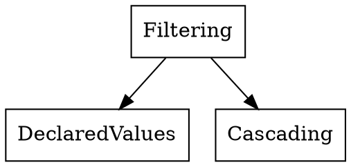

# [级联与继承(Cascade & Inheritance)](https://drafts.csswg.org/css-cascade-4/)

1. Filtering (Declared Values)
    1. 属于当前文档
    1. 满足条件(Conditional Rule)
    1. 选择器匹配(Selector Matched)
    1. 语法正确
1. Cascade (Cascaded Value)
    1. 来源与important
        1. Transition
        1. 浏览器important规则
        1. 用户important规则
        1. 作者important规则
        1. Animation规则
        1. 作者规则
        1. 用户规则
        1. 浏览器规则
    1. Scope(未支持)
    1. Specificity
    1. 文档顺序
        1. 样式文件内使用`@import`引入的其他样式文件规则当视为就地替换
        1. HTML文件中多个样式文件按照源码顺序
        1. `style`属性引入的行内样式内部按照源码顺序，整体排在其他来源之后
    1. Non-CSS Presentational Hits，当做浏览器样式放在最后或者作者样式放在最前（Specificity为0）
1. Defaulting (Specified Value) 保证每个元素的每个属性必定有一个specified value
    1. 有Cascaded Value
      1. 特殊关键字 initial/inherit/unset/revert
    1. 没有Cascaded Value
        1. inherited属性有父元素，取Inherited Value，等于父对象该属性的computed value
        1. inherited属性无父元素或者non-inherited属性，取Initial Value
1. Resolving (Computed Value) 在不进行布局(Layout)等昂贵操作的前提下，尽可能解析得到computed value
    1. 相对单位`em`/`ex`/`vh`/`vw`
    1. 关键字`smaller`/`bolder`
    1. 百分比
    1. 相对路径url
    1. 不适用的属性也有Computed Value,某些属性会根据是否适用于元素对Computed Value特殊处理。
1. Layout (Used Value) 完成所有计算，得到使用值
    1. 如果属性不适用于元素，该属性没有Used Value
        1. `flex`在非flex item元素上没有used value
1. Pre-Rendering (Actual Value) 根据最终渲染媒体类型调整部分值
    1. 非整数的长度值，屏幕无法绘制非整数长度像素的值。
    1. 根据font字体文件时候可用，或者`font-size-adjust`属性可能调整元素的`font-size`

历史原因window.getComputedStyle(element, null) 返回的属性值不一定是computed value,可能是used value

## 属性计算依赖

1. 子元素的属性可能依赖于父元素的属性
1. 子元素的属性可能依赖于一个或者几个该元素的其他属性
1. 元素的属性可能依赖于子元素的属性`break-before: auto`, 受第一个子元素影响used value `break-before: page`?

width/height 属性百分比的值，containing block的宽度和长度未知且不是绝对定位的情况下，计算值为`auto`,但是`getComputedStyle`返回的值不是computed value而是某个具体的数字`100.3px`。

1. Author Origin
1. User Origin
1. User Agent Origin
1. Animation Origin
1. Transition Origin

1. https://drafts.csswg.org/css-cascade-4/#cascade
