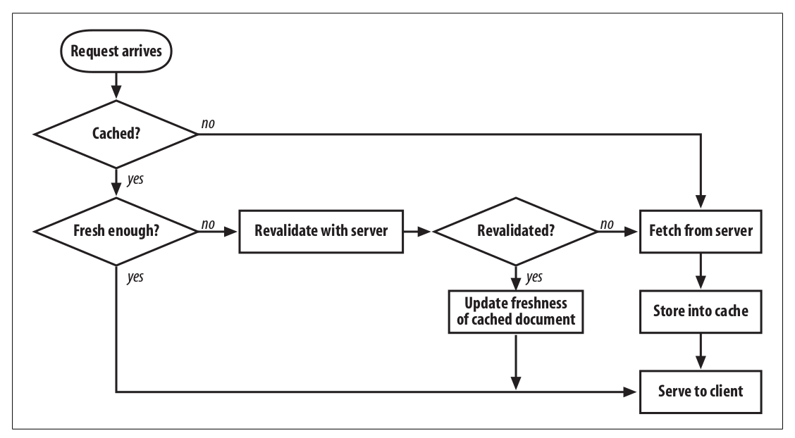

# 为甚使用缓存

1. 减少不必要的请求，解决网络资源
1. 提高访问速度

# 哪些请求被缓存

1. 缓存只针对 HTTP 的 GET 请求，
1. 使用 URL 为 key 区分么？路径相同，query 参数不同的请求？

静态资源 GET 请求缓存，下面的第一页请求会被缓存么？

```
http://example.com/users?page=1
http://example.com/users?page=2
http://example.com/users?page=1
```

# 缓存的生命周期

1. 创建 Creation 客户端根据服务器的返回头创建缓存
1. 使用 Serving 缓存没过期时，直接使用
1. 重新 Revalidation 缓存过期时，使用 If-Modified-Since/If-Unmodified-Since/If-None-Match/If-Match 与服务器进行协商
   1. 协商成功，服务器返回 304，客户端根据 Last-Modified 更新 max-age，ETag
   1. 协商失败，服务返回 200
1. 删除 Deletion 资源没有找到 404，本地缓存删除

有效期内的缓存称为新鲜的（fresh）。

1. 缓存命中 Cache Hit
1. 缓存失效 Cache Miss

# 启发式的缓存失效

TODO:

没有`max-age`或者`Expires`字段的时候，使用的默认缓存失效策略。

# 绝对时间

```http
Expires: GMT的时间点
```

需要客户端和服务器时钟一致。

有 Cache-Control 字段的话 Expires 会被忽略

# max-age

单位为秒

1. 相对时间 max-age
1. 未到期 200 from disk cache
1. Last-Modified/If-Modified-Since

# ETag

1. Expires/max-age 使用的时间单位是秒，某些资源可能在一秒内发生更新
1. 资源可能会被用同样的内容进行更新，更新时间变了，但是内容没变。

1. 过期使用 ETag 标识 If-None-Match
1. 未改变 304 Not Modified
1. 200

```http
Cache-Control:max-age=60
ETag: 54z6wdx
ETag: [W/]"<etag_value>"
```

W 表示忽略大小写

[If-Match](https://developer.mozilla.org/en-US/docs/Web/HTTP/Headers/If-Match)
[If-Non-Match](https://developer.mozilla.org/en-US/docs/Web/HTTP/Headers/If-None-Match)

# no-cache

效果相等

Cache-Control:no-cache
Cache-Control:max-age=0

# no-store

浏览器不要缓存该资源，每次都向服务器请求。

```http
Cache-Control:no-store;
```

# public/private

private 表示中间代理服务器不要缓存，只让浏览器缓存；public 任何节点都可以缓存

```http
Cache-Control:public
Cache-Control:private
```

s-maxage 只对公开的 cache 生效

```http
Cache-Control: s-maxage=<seconds>
```

# revalidation directive

1. Cache-Control:must-revalidate
1. Cache-Control:proxy-revalidate
1. Cache-Control:no-transform
1. Cache-Control:immutable

# Stale-While-Revalidate, Stale-If-Error Available Today

https://www.fastly.com/blog/stale-while-revalidate-stale-if-error-available-today

# 客户端缓存

客户端的缓存如何存储的，包含哪些信息？

1. https://developer.chrome.com/docs/devtools/storage/cache

# 页面刷新

刷新的时候 no-cache 就表示不直接使用本地缓存。

1. F5 请求带上 Cache-Control:no-cache 和条件请求 If-Modified/If-Non-Match
1. Ctrl + F5 请求只带上 Cache-Control:no-cache 向服务器请求缓存资源，而且不使用条件请求，直接请求最新的资源

# 缓存策略选择

根据以下条件决定应该使用什么样的缓存策略


# 缓存网络

[Internet Cache Protocol (ICP)](https://en.wikipedia.org/wiki/Internet_Cache_Protocol)
[Caching Protocol (HTCP)](https://en.wikipedia.org/wiki/Hypertext_caching_protocol)


# 参考

1. https://developer.mozilla.org/en-US/docs/Web/HTTP/Caching
1. https://web.dev/i18n/en/http-cache/
1. https://zhuanlan.zhihu.com/p/44789005
1. https://jakearchibald.com/2016/caching-best-practices/
1. https://www.zhihu.com/question/20790576
