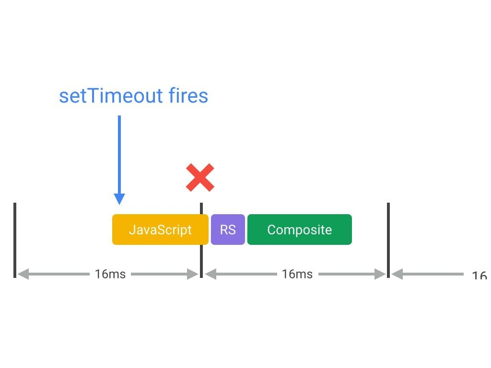
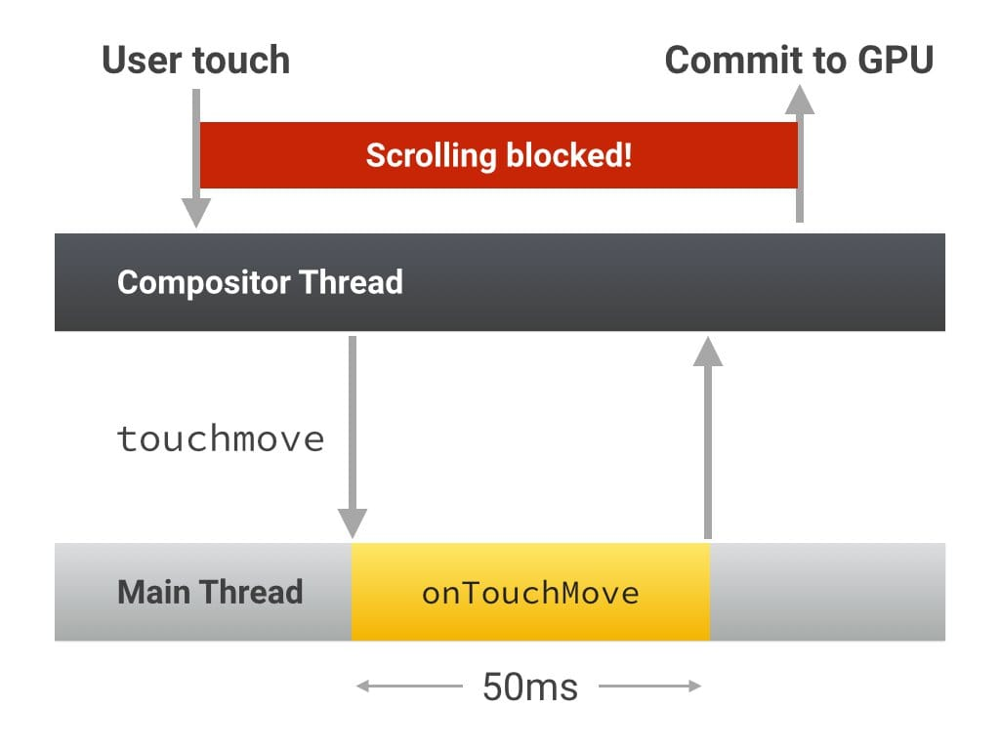
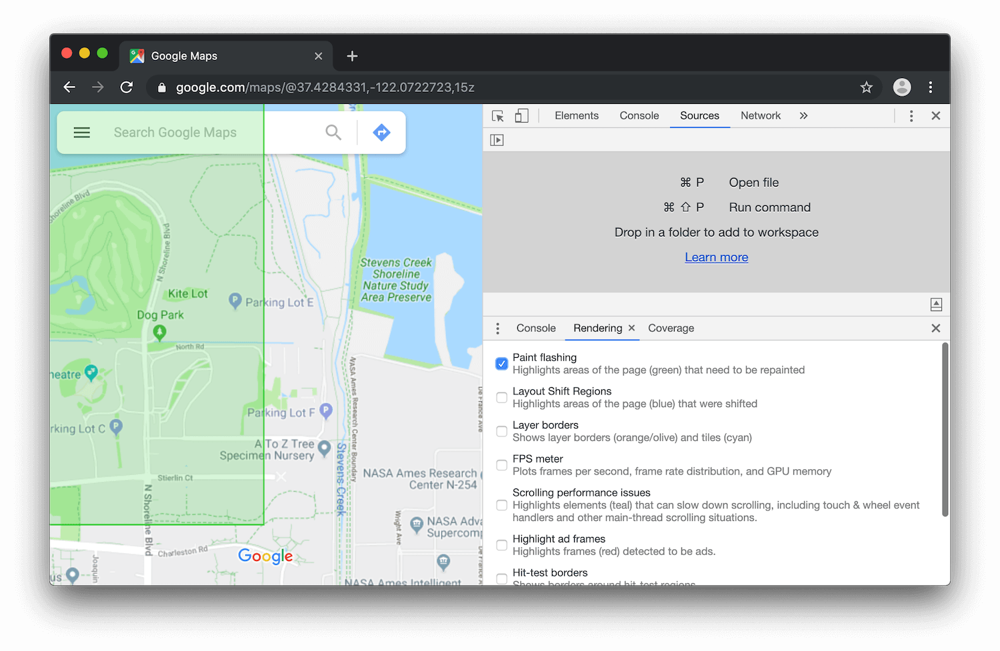

# 浏览器

[Web Performance](https://www.bilibili.com/video/BV1s34y1r7hB)
[Web Performance MDN](https://developer.mozilla.org/en-US/docs/Learn/Performance/What_is_web_performance)

[Web Performance In Action](https://livebook.manning.com/book/web-performance-in-action/chapter-1/23)

https://developers.google.com/speed
https://www.youtube.com/watch?v=YJGCZCaIZkQ
https://www.youtube.com/watch?v=bkwWe0BYWVg

[Critical Rendering Path](https://www.bilibili.com/video/BV1V84y1F7py)

1 Page building—Set up the user interface.
2 Event handling —Enter a loop F waiting for events to occur G, and start invoking event handlers.

浏览器构建页面的过程包括两个步骤：

1. 解析 HTML 源码构建 DOM 树
1. 执行 HTML 源码中的 Javascript 代码，`<script>`标签中的全局 Javascript 代码是同步执行的，浏览器在解析到`script`标签时会停止构建 DOM 树，转而去执行 Javascript 代码。

浏览器在构建页面的过程中可以在这两个过程根据需要切换执行，直到页面构建完成。

1. [浏览器渲染机制](https://www.html5rocks.com/zh/tutorials/internals/howbrowserswork/)
   https://developers.google.cn/web/fundamentals/performance/critical-rendering-path/render-tree-construction

2. https://developers.google.cn/web/fundamentals/performance/critical-rendering-path/render-tree-construction

[HTML5](https://developer.mozilla.org/en-US/docs/Web/Guide/HTML/HTML5)
[DOM](https://developer.mozilla.org/en-US/docs/Web/API/Document_Object_Model)

#### 渲染管线（Rendering Pipeline）

[Improved vsync scheduling for Chrome on Android](https://docs.google.com/document/d/16822du6DLKDZ1vQVNWI3gDVYoSqCSezgEmWZ0arvkP8/edit)

https://developers.google.com/web/fundamentals/performance/rendering#the_pixel_pipeline


重排(relayout,reflow), 重绘(repaint),分层合成（GPU 加速，渲染更快，缺点：占用更多内存)

1. 什么情况下元素形成单独的层？
1. z-index， opacity
1. overflow 截断
1. translate2d 二维变换不会形成单独的层，所以 trick 的方式使用`translateZ()`或者`translate3d(0, 0, 0)`来迫使元素单独一层，`will-change`

#### GPU 加速

GPU 被设计用来快速进行渲染相关的复杂的几何数学运算，将这些运算从 CPU 转移到 GPU 能够提高渲染速度。GPU 加速依赖于分层渲染机制，页面中某些元素发生变化（如`transform3d()`）时，该元素被提升到单独的层中进行渲染，其他元素不必重新渲染，只需要重新进行合成操作即可，GPU 执行合成操作相比于 CPU 快很多。

DOM 元素样式的变化可能触发渲染流水线布局、绘制、合成等不同阶段的变化，触发变化的阶段在渲染流水线中越晚，生成下一帧需要的计算越少，速度越快。
参考[CSS Triggers](https://csstriggers.com/)查看不同属性变换触发的渲染阶段。常见的如下：

1. 布局阶段 - 尺寸相关的 CSS `width` `height` `margin` `border`
1. 渲染阶段 - 不影响尺寸样式的 CSS `color` `visibility` `border-style` `outline` `background`
1. 合成阶段 - 造成元素单独分层的 CSS `opacity` `transform`

属性值变化只影响到合成层的 CSS 属性(`opacity`, `transform`)

只触发合成操作的属性变化渲染成本最低，因此浏览器能够非常[高效的实现相关动画效果](https://www.html5rocks.com/en/tutorials/speed/high-performance-animations/)。


因为分层渲染的性能优势，所以存在一种 Hack 优化方法，使用`translateZ(0)`或者`translate3d(0,0,0)`强制使元素提升到单独的层进行分层渲染。但是这种分层本身也是有初始成本的，如果很多元素被强制分层可能造成动画开始阶段卡顿，参考这个[案列](https://wesleyhales.com/blog/2013/10/26/Jank-Busting-Apples-Home-Page/)。

[FLIP](https://aerotwist.com/blog/flip-your-animations/)
[Stick to Compositor-Only Properties and Manage Layer Count](https://developers.google.com/web/fundamentals/performance/rendering/stick-to-compositor-only-properties-and-manage-layer-count)

#### will-change

`will-change`属性用来在合适的情况下提示浏览器对元素进行分层渲染的优化，这种优化策略比较激进，使用不反而会造成负面效果。`will-change`对于浏览器渲染有两个效果生成新的层叠上下文（stacking context）和包围盒（containing block）。

1. `transform`，`opacity`等属性的非初始值会造成元素生成单独一层时，使用`will-change: transform,opacity`也会造成元素单独生成一层，即使这个时候元素并没有`transform`，`opacity`属性。
1. `transform`等一些属性会生成新的包围盒(containing block)，`will-change`使用这些属性时同样会生成包围盒。

使用注意事项：

1. 不要在太多元素和属性属性上使用`will-change`，如果较少元素的属性变化频繁，此时直接使用`will-change`带来的渲染速度提升是合适的。
1. 在属性变化开始前的合适时机使用`will-change`属性，给浏览器一个提前量（200ms）执行分层操作，这样在属性开始变化时已经完成分层，就可以高效的重新渲染。
   1. 在元素`click`时变化的属性可以在元素或者父元素`hover`时添加`will-change`.
   1. 或者使用 Javascript 在合适时机添加`will-change`.
1. 动画或者样式变化结束后及时移除`will-change`属性

[Everything You Need to Know About the CSS will-change Property](https://dev.opera.com/articles/css-will-change-property/)
[CSS Will Change Module Level 1](https://drafts.csswg.org/css-will-change/)

#### RAIL 模型

[RAIL 模型](https://developers.google.com/web/fundamentals/performance/rail)将网页性能划分为四个方面，并对每个方面提出性能衡量标准和优化指导，以期带给用户丝滑的体验。


#### 响应（Response）

目标是页面在**100ms**内完成对用户输入的相应，因为在这个时间内用户不会有任何页面卡顿的感觉，**100ms~300ms**内用户可以感知到轻微延迟，**300ms~1000ms**用户开始感知到明显延迟，**10s**以上用户会放弃操作，关闭页面。

这里的相应针对按钮点击、表单组件勾选、触发动画等大多数用户输入，但是不包括拖拽和滚动。

为了达到用户输入在 100ms 内完成，响应事件应该在**50ms**内执行完成，因为用户响应事件可能在空闲阶段的任务中触发，然后等待空闲阶段任务执行完成后才能执行，这样的话空闲阶段任务和响应事件两个任务的总时间不能超过**100ms**。如果响应事件响应事件能非常快的完成的话，那么空闲阶段的时间越长，可以在这个阶段执行其他的任务，并且不影响用户体验。

对于超过 50ms 的事件响应，最好提供动画等用户可感知的反馈效果。

#### 动画（Animation）

顺畅的页面交互要求至少 60FPS 的刷新频率，这样一帧只有约 16ms 时间，而且每一帧从浏览器渲染完成到转移给 GPU 进行合成并显示在屏幕上需要 6ms 左右的时间，所以一帧动画应该在 10ms 或者更少的时间内完成。

动画效果:

1. 页面进入、退出、进度指示等效果
1. 滚动效果
1. 拖拽效果

https://www.paulirish.com/2011/requestanimationframe-for-smart-animating/

#### 空闲（IDLE）

尽可能扩大空闲阶段，空闲阶段执行的任务在 50ms 内完成，这样用户能保证用户响应事件有 50ms 的执行时间。

可以将执行时间较长的任务拆分成多段，在分散的空闲阶段执行，或者在后台执行这些任务。

#### 加载（Load）

https://web.dev/vitals/

在移动设备和 3G 网络上，首次页面加载完成并且可交互的总时间应该在**5s**以内，后续页面加载应该在**2s**内完成。

text

1. minify code [Kangax HTML Minifier](https://kangax.github.io/html-minifier/)
1. compress gzip 对于文本文件压缩效果较好，对于图片等自带压缩的格式效果的不明显。
   https://betterexplained.com/articles/how-to-optimize-your-site-with-gzip-compression/
1.

[You might not need jQuery](http://youmightnotneedjquery.com/#toggle_class)

图片

1. 去除原信息(metadata) http://www.verexif.com/en/.

Metrics:

1. DOMContentLoaded 最初的 HTML 页面加载和解析完成后再`document`对象上触发
1. onload 最初的 HTML 页面其所依赖的相关资源（CSS 样式文件、图片等）完成加载后，在`window`上触发；在``，`<embed>`等元素上在资源下载完成时出发。

1. First Paint
1. First Meaningful Paint https://web.dev/first-meaningful-paint/
1. First Contentful Paint https://web.dev/fcp/ https://web.dev/first-contentful-paint/
1. Largest Contentful Paint https://web.dev/lcp/
1. First Input Delay https://web.dev/fid/
1. Cumulative Layout Shift
1. Time to First Byte 从浏览器发出页面请求到接收到第一个字节响应数据的时间，用来衡量服务器的相应速度和网络情况，包括连接建立时间、请求发送时间、第一个字节响应返回时间。

https://github.com/GoogleChrome/web-vitals

https://web.dev/render-blocking-resources/

#### cache

#### 性能测量工具

1. [ChromeDevTools](https://developers.google.com/web/fundamentals/performance/rail#devtools)

https://developers.google.com/web/tools/chrome-devtools/

1. Lighthouse
1. WebpageTest
1. [PageSpeed Insights](https://developers.google.com/speed/pagespeed/insights/)

#### 高性能动画 Animation FLIP

Animation FLIP

https://www.html5rocks.com/en/mobile/optimization-and-performance/

### 加载性能优化

关键路径渲染

https://classroom.udacity.com/courses/ud884/lessons/1469569174/concepts/15577986410923

### 渲染性能优化

事件回调函数应该在**3ms~4ms**内完成，这样才能保证 60FPS 的帧率。

使用`requestAnimationFrame`替代`setTimeout`/`setInterval`执行会触发页面重新渲染的操作。因为定时器函数的任务执行时机不确定，很可能在本来应该下一帧渲染的时机触发，从而造成下一帧被错过，造成卡顿。而`requestAnimationFrame`只在一帧渲染前执行，且不会造成该帧被错过。



#### WebWorker

TODO:
对于不涉及到 DOM 的长时间计算可以使用 WebWorker 在后台运行

#### 任务拆分

对于长时间执行的任务可以拆分成多段短任务执行，每段任务在**3ms~4ms**内完成，这样的任务最好提供进度提示动画。

```js
var taskList = breakBigTaskIntoMicroTasks(monsterTaskList)
requestAnimationFrame(processTaskList)

function processTaskList(taskStartTime) {
  var taskFinishTime

  do {
    // Assume the next task is pushed onto a stack.
    var nextTask = taskList.pop()

    // Process nextTask.
    processTask(nextTask)

    // Go again if there’s enough time to do the next task.
    taskFinishTime = window.performance.now()
  } while (taskFinishTime - taskStartTime < 3)

  if (taskList.length > 0) requestAnimationFrame(processTaskList)
}
```

#### 避免低效优化

对于性能瓶颈部分进行着重优化，得到的效益是最高的；对于一帧只调用几次的函数进行优化，带来的性能提升最终可能只有零点零几毫秒。

#### 滚动事件

1. input change
1. scroll 事件
1. debounce throttle

列表滚动时，如果没有相关事件（scroll，touchstart, touchmove, touchend)被监听，那么只需要 GPU 重新合成生成新滚动位置对应的帧。如果相关事件被监听，那么必须等待事件回调函数执行完成，因为在回调函数中修改样式等操作会触发重新渲染或者调用`preventDefault()`停止滚动。

1. 避免在滚动相关回调函数中修改样式，触发重新渲染。
1. 使用`passive`回调函数，手动保证不调用`preventDefault()`

Command: Scroll Performance



#### 降低 CSS 选择器复杂度

页面 DOM 变动时（添加、删除元素、修改元素属性、类等）浏览器重新计算元素的样式（Computed Style Calculation），对应渲染管线中 Style 阶段。这个阶段包括两部分：

1. 为每个元素筛选出匹配的 CSS 规则
1. 为每个元素计算出匹配的规则中最终生效的规则。

这两个部分大概各占样式计算阶段一半时间。[Style Invalidation in Blink](https://docs.google.com/document/d/1vEW86DaeVs4uQzNFI5R-_xS9TcS1Cs_EUsHRSgCHGu8/view)

1. 使用[BEM](https://en.bem.info/)模式替代成本较高的伪类选择器`nth-last-child(-n+1)`
1. 尽可能减少样式变化的元素数量

#### 避免布局抖动（Layout Thrashing）

计算元素尺寸与位置的阶段 Chrome 称之为布局（Layout），Firefox 称之为重排（Reflow）。布局通常针对整个文档，即单个元素的尺寸变化会造成整个文档进行重新布局。

1. 在可能的情况下避免重新布局
1. flexbox 布局性能比老式布局好

使用 Javascript 代码修改了元素尺寸后，如果在正常的渲染管线中下次布局之前再次查询元素尺寸，会造成浏览器**强制同步布局 forced synchronous layout**以获得正确的尺寸，布局操作代价比较高，很可能造成帧率达不到 60FPS。

将所有尺寸属性写操作先全部完成，然后再读取最新的尺寸，这样将多次强制同步布局降低为一次。连续多次快速发生的**强制同步布局**被称为**布局抖动**。

```js
// 读 -> 写 -> 读 -> 写 循环造成布局抖动
function resizeAllParagraphsToMatchBlockWidth() {
  for (var i = 0; i < paragraphs.length; i++) {
    paragraphs[i].style.width = box.offsetWidth + 'px'
  }
}

// 修改为首先读一次，然后多次写
var width = box.offsetWidth

function resizeAllParagraphsToMatchBlockWidth() {
  for (var i = 0; i < paragraphs.length; i++) {
    paragraphs[i].style.width = width + 'px'
  }
}
```

[FastDOM](https://github.com/wilsonpage/fastdom)

#### Paint 阶段

Chrome -> Rendering 标签下勾选**Paint Flashing**选项，界面渲染时触发 Paint 的部分绿色前景展示。



将频繁重复 Paint 的元素提升到单独的层中，减小 Paint 发生的区域。

# 首屏时间优化

## 请求资源

1. 构建页面请求
1. 查找缓存 https://developer.mozilla.org/zh-CN/docs/Web/HTTP/Caching_FAQ
1. DNS 解析，DNS 也有缓存策略
1. 等待 TCP 队列， 同一个域名最多有 6 个 TCP 连接
1. 建立 TCP 链接
1. 发送 HTTP 请求

## 避免重定向

`http`重定向到`https`, 301, 302, 303

```bash
curl -I http://time.geekbang.org/
```

## DSN prefetch

## 骨架屏

## 网络层

## 图片压缩

## html 压缩

## js 压缩

## css 压缩

1. https://zhuanlan.zhihu.com/p/67134654
1. https://juejin.im/post/5c4418006fb9a049c043545e
1. https://zhuanlan.zhihu.com/p/56001951
1. https://www.zhihu.com/question/24907805
1. https://zhuanlan.zhihu.com/p/46132555

1. https://zhuanlan.zhihu.com/p/49841802

1. https://zhuanlan.zhihu.com/p/55528376
1. https://zhuanlan.zhihu.com/p/26022258
1. https://zhuanlan.zhihu.com/p/34585166
1. https://zhuanlan.zhihu.com/p/38548289

高性能响应式 Web 开发实战

https://www.youtube.com/watch?v=thNyy5eYfbc

1. side navigation bar https://www.youtube.com/watch?v=Mhnj3PiPnZw
1. swipeable cards https://www.youtube.com/watch?v=e5CXg1sjTqQ
1. expande collapse FLIP

### 解析渲染过程

css 不阻塞 js 的加载，但阻塞 js 的执行
