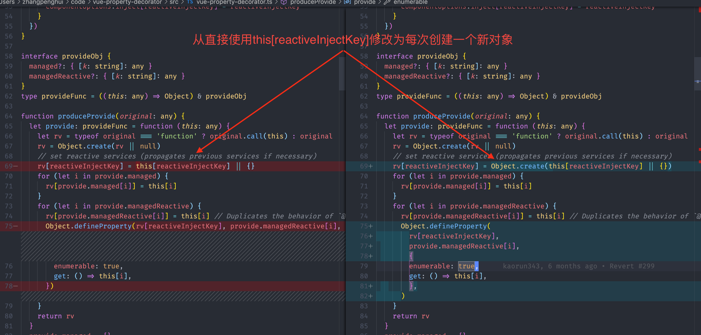

# Decorators

## Typescript

### 类型

Typescript中的装饰器氛围集中类型

1. 类装饰器（Class Decorator）
    ```ts
    interface IConstructor {
      new (...args: any[]): {};
    }

    // 接受被装饰的类构造函数作为参数，返回增强的新类
    function createClassDecorator<T extends IConstructor>(constructor: T) {
      return class extends constructor {
      }
    }
    ```
1. 属性装饰器（Property Decorator），[TS的限制](https://www.typescriptlang.org/docs/handbook/decorators.html#property-decorators) 没有第三个参数PropertyDescriptor
    ```ts
    // 静态成员 target = Constructor
    // 实例成员 target = Constructor.prototype
    function decorator(target: Object, propertyName: string)，
    ```
1. 方法
    ```ts
    // 静态成员，
    // 实例成员
    function decorator(target: Object, propertyName: string, descriptor: PropertyDescriptor)，
    ```
1. accessor
    ```ts
    // 同一个属性的get,set不允许分别有装饰器，一个装饰器定义同时对get,set生效
    // 静态成员
    // 实例成员
    function decorator(target: Object, propertyName: string, descriptor: PropertyDescriptor)，
    ```
1. parameters 参数
    ```ts
    // 静态成员
    // 实例成员
    function decorator(target: Object, propertyName: string, index: number)，
    ```

方法、Accessor装饰器返回的Descriptor会为该属性提供新的定义，类装饰器提供新类。

### 装饰器组合

decorator从上到下求值，然后逆序调用，f(g(C))。
```ts
@f
@g
class C {}
```

### 加载顺序

1. 参数装饰器在对应方法装饰器之前
1. 成员在静态成员之前
1. 构造函数在静态成员之后
1. 最后是类装饰器

这个顺序可能发生变换，尽量不要依赖成员间的顺序。

### 装饰器工厂

### MetaData

https://www.typescriptlang.org/docs/handbook/decorators.html#metadata

## ProvideReactive实践

使用class-style-component方式书写Vue组件的过程中，`vue-class-component`库提供了`Component`修饰器来使用类语法组件。
`vue-property-decorator`库提供了更多的修饰器来提供Vue常用选项的等价功能。

### Provide/Inject

`@Provide/@Inject`提供了`provide/inject`选项的功能，注意`@Inject`到子组件中的变量[不是响应式的（Non-Reactive）](https://cn.vuejs.org/v2/api/#provide-inject)。
同时还有另外一组修饰器`@ProvideReactive/@InjectReactive`提供了增强的功能，`@InjectReactive`会在组件中定义一个响应式的数据来提供这个变量。

看下面这个例子。

```ts
import {
  Component, Prop, Provide, ProvideReactive, Vue,
} from 'vue-property-decorator';

@Component({
  components: {
    Child,
  },
})
export default class Parent extends Vue {
  @Provide()
  name = 'tom'

  @ProvideReactive()
  reactiveName = 'reactive-tom'

  @Provide()
  nestedName = {
    name: 'nested-tom',
  }

  @ProvideReactive()
  nestedReactiveName = {
    name: 'nested-reactive-tom',
  }
}

@Component()
export default class Child extends Vue {
  @Inject()
  name!: string;

  @InjectReactive()
  reactiveName!: string;

  @Inject()
  nestedName!: {
    name: string;
  };

  @InjectReactive()
  nestedReactiveName!: {
    name: string;
  }
}
```

父组件`Parent`提供了四个变量`name/reactiveName/nestedName/nestedReactiveName`。

1. `name`是一个非响应式的基础类型数据，所以子组件使用该变量渲染时无法收集其为依赖，`name`变化时子组件不会自动更新。
1. `nestedName`是一个非相应的对象类型数据，同样`nestedName`本身变化时，子组件同样无法收集依赖自动更新。但是`nestedName`的`name`属性对象同样是响应式的数据，所以如果子组件直接使用`nestedName.name`时能够收集依赖，自动更新。
1. `reactiveName/nestedReactiveName`提供的变量本身就是响应式数据。

#### 踩坑

使用`vue-cli`创建的项目默认使用了`vue-property-decorator@8.5.1`版本，这个版本的`@ProvideReactive`存在一个BUG。在一个组件通过路由切换创建第二个组件实例时会报错[cannot redefine property xxx](https://github.com/kaorun343/vue-property-decorator/issues/277)。

原因在于下面这行代码

<!--  -->


在9.0.2版本之前，`ProvideReactive`提供的兑现直接使用了`this[reactiveInjectKey]`对象，在这个对象上定义提供的属性。但是因为这个变量实际上指向了`vm.constructor.options.inject`对象，`vm.constructor`是组件类，多个组件实例都属于这个类。所以在第一个组件实例化后组件类上已经被定义过属性名`name`类，第二个组件实例初始化时就会出现重复定义的问题。
修改后代码每次`Provide`的对象都是一个新对象，互相独立，所以避免类这个问题。

使用9.0.2及之后的版本来避免这个错误。另外从9.1.0版本开始源码文件从`vue-property-decorator.ts`修改为`index.ts`，但是`package.json`文件中`typing`没有更新导致TS类型无法正常解析，直接使用最新9.1.2版本即可。
