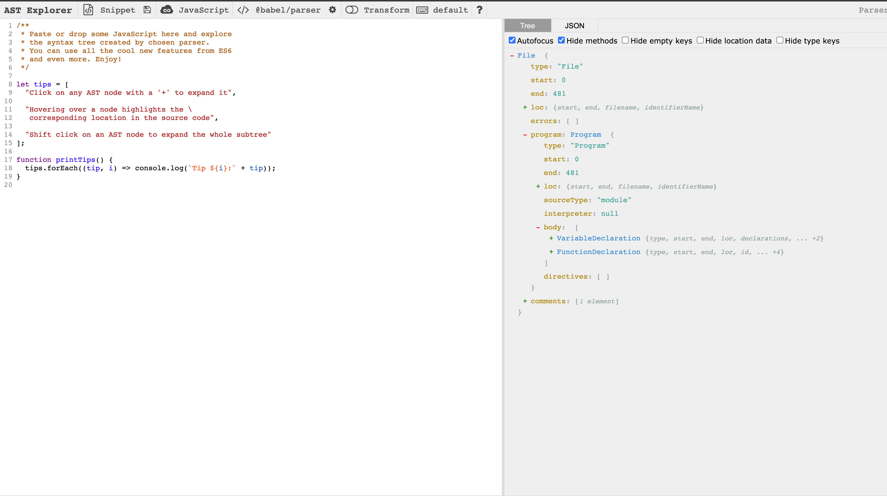

# AST

Javascript 代码经过解析得到抽象语法树（**A**bstract **S**yntax **T**ree），用来表示程序源码结构。

前端基础工具 Babel、ESLint、Prettier 等使用的 Javascript 抽象语法树最早是火狐的工程师开发 SpiderMonkey 引擎时使用的格式，后来发展为统一的[ESTree 规范](https://github.com/estree/estree)，包含 ECMAScript 规范各版本对应的抽象语法树文档和一些废弃或者是提案语法的文档。

Babel 使用的抽象语法树规范参考[官方文档](https://github.com/babel/babel/blob/master/packages/babel-parser/ast/spec.md)。抽象语法树规范主要描述每种语法特性的树节点，主要包括文件（File）、程序（Program）、语句（Statement）、声明（Declaration）、表达式（Expression）和其他杂项类型。

使用网站[astexplorer](https://astexplorer.net/)可以方便的查看任意 JS 代码抽象语法树结构。左边是源码，右边是对应的抽象语法树。



## 节点类型

下面使用 Babel 为例，来看看抽象语法树节点都包含哪些具体类型。

### 基础节点类型

`BaseNode`对象是所有的抽象语法树节点的基础类型，不同的节点在`BaseNode`对象的基础上增加字段代表独有信息。`BaseNode`对象格式如下。

```js
interface BaseNode {
  type: string;
  loc: SourceLocation | null;
  start: number | null;
  end: number | null;

  leadingComments: ReadonlyArray<Comment> | null;
  innerComments: ReadonlyArray<Comment> | null;
  trailingComments: ReadonlyArray<Comment> | null;

  range?: [number, number];
  extra?: Record<string, unknown>;
}
```

其中`type`字段是代表节点类型，不同节点根据类型字段进行区分。`loc`字段代表该节点在源码中的首尾行列位置信息，`start`和`end`代表该节点在源码中的字符下标位置，`range`字段以数组形式存储`[start, end]`。

```js
interface SourceLocation {
  source: string | null;
  start: Position;
  end: Position;
}

interface Position {
  line: number; // >= 1
  column: number; // >= 0
}
```

`leadingComments/innerComments/trailingComments`是节点前后的注释信息。`extra`字段存储额外的信息，例如括号表达式标志为`parenthesized`。

### File & Program & Directive

#### 源码类型

JS 抽象语法树根节点都是`File`类型，代表当前整个源码文件。

```ts
export interface File extends BaseNode {
  type: 'File'
  program: Program
  comments?: Array<CommentBlock | CommentLine> | null
  tokens?: Array<any> | null
}
```

`File`节点下包含`Program`类型节点，是代码的根节点。

```ts
export interface Program extends BaseNode {
  type: 'Program'
  body: Array<Statement>
  directives: Array<Directive>
  sourceType: 'script' | 'module'
  interpreter?: InterpreterDirective | null
  sourceFile: string
}
```

ES6 引入模块机制之前，Javascript 的代码都是全局脚本（Script）类型。引入模块（Module）机制后为了与脚本进行区分，`Program`节点使用 `sourceType`字段表示分为脚本（Script）和模块（Module）两种。对于任意 JS 文件，如果包含导入导出（`import/export`）语句，可以确认是模块类型；如果不包含导入导出语句可能是模块类型，也可能是脚本类型。使用 Babel 解析代码时可以指定文件的类型。

```ts
import * as parser from '@babel/types'

const code = `let a = 1;`
parser.parse(code, { sourceType: 'module' })
```

`sourceType`解析参数用来指定代码类型，有三个选项。

1. `module` - 指定代码是模块类型
1. `script` - 指定代码是脚本类型，如果包含导入导出语句会**抛出异常**，默认值。
1. `unambiguous` - 不指定类型，根据是否包含导入导出语句进行推测，不会抛出异常。

#### 指令

`Program`节点中包含`directives`字段代表[指令序言](https://262.ecma-international.org/6.0/#sec-directive-prologues-and-the-use-strict-directive)（Directive Prologue），指全局或者函数内部最开始的若干个语句，这些语句的内容是字符串字面量的形式。这些语句合称为指令序言，其中每个语句称为指令（Directive），当前的规范中只规定了严格模式指令（Use Strict Directive）。

```ts
import * as parser from '@babel/parser'

const script = `'use strict'; let a = 1;`

parser.parse(script)
```

指令序言中可能包含多条重复的严格模式指令，不属于语法错误，但是可以由给出警告。

`Program`节点的`interpreter`字段是解释器指令（InterpreterDirective），用来代表 JS 文件作为 Shell 脚本命令运行时指定使用`node`作为解释器运行，这是 Unix 系统的[约定](<https://en.wikipedia.org/wiki/Shebang_(Unix)>)。

```ts
import * as parser from '@babel/parser'

const script = `#!/usr/bin/env node 'use strict'; let a = 1;`

parser.parse(script)
```

注意解释器指令必须位于文件**第一行**，否则解析会报错。解释器指令属于 Babel 的扩展特性，不属于 ECMAScript 规范。

### 语句（Statement）

语句是`Program`节点的子节点，包含常见的语句类型。

```txt
// 只包含一个分号的空语句 EmptyStatement
;

// DebuggerStatement
debugger

// WithStatement
with (a) { }

// 块语句 BlockStatement
{
  let a = 1;
}

// 流程控制语句
return 1;
label1: 1;
break;
continue;

// 分支语句
if (a) {}
switch (a) {}

// 异常语句
try { } catch() {}
throw e;

// 循环语句
while (true) {}
do {} while (true)
for (var i = 0; i < 10; i++) {}
for (const key in obj) {}
for (const value of array) {}
```

除此之外有两种特殊的语句，声明语句（Declaration）和表达式语句（ExpressionStatement）。表达式语句是由任意表达式组成的语句，可能的情况参考表达式类型。

### 声明

声明语句创建一个绑定标识符（Binding Identifier），包括变量（VariableDeclaration）、函数（FunctionDeclaration）、类（ClassDeclaration）、导入导出等情况。

```ts
var foo = 1;
function fun () {}
class Test () {}
import math from 'math'
export { math }
```

函数、类、导入也存在表达式的形式。

```ts
const fun = function () {}
const Test = new (class {})()

import('math').then()
```

### 表达式（Expression）

表达式类型包含了大部分抽象语法树节点类型。

```ts
// UnaryExpression
!a
// BinaryExpression
a + b
// LogicalExpression
a && b
// AssignmentExpression
a = b
// ConditionalExpression
a ? b : c
// MemberExpression
a.b
// CallExpression
a()
// SequenceExpression 逗号表达式
a, b
// 括号表达式
!(a + b)
```

另外一些特殊的表达式

```ts
super.a
this.a
import('a')
```

### 字面量

普通字面量

```ts
// NumericLiteral
1
// BooleanLiteral
true
// NullLiteral
null
// 由StringLiteral组成的BinaryExpression
'a' + 'b'
// RegExpLiteral
/[a-zA-Z0-9]+/g
// BigIntLiteral
1n;
```

其中 Symbol 没有没有字面量形式。另外 ECMAScript 规范规定`undefined`是标识符，默认值是`undefined`，而不是字面量，这点上和`null`不同。

### 模式 Pattern

解构语法对应的几种特殊形式

```ts
// ObjectPattern 包括 AssignmentPattern和RestElement
// AssignmentPattern
const { a = 1 } = { a: 2 }
// RestElement
const { b, ...a } = { a: 2 }

// ArrayPattern
const [x, y] = [0, 1]

// RestElement a
function fun(...a) {}
const obj = { ...a }
const { b, ...a } = {}
```

### 注释

注释分类单行注释（CommentLine）和多行注释（CommentBlock）。

```ts
interface BaseComment {
  value: string
  start: number
  end: number
  loc: SourceLocation
  type: 'CommentBlock' | 'CommentLine'
}

export interface CommentBlock extends BaseComment {
  type: 'CommentBlock'
}

export interface CommentLine extends BaseComment {
  type: 'CommentLine'
}

export type Comment = CommentBlock | CommentLine
```

同一个注释节点可以由多个抽象语法树节点共享，因此对于注释相对于一个节点有三种位置。

```ts
// leading comment
function fun(/* inner comment */ a) {}
// trailing comment
```

对于函数`fun`来说有前置注释（leading comment)、内部注释（inner comment）和后置（trailing comment）注释。`fun`的内部注释对于参数`a`来说是前置注释。顶层的注释也会包含在`Program`节点的`comments`数组属性中。

### 节点别名 Aliases

aliases 节点别名

1. Aliases Property
1. 介绍下 virtualTypes 常用的动态类型

## AST 相关的工具

每种 AST 节点有关联的功能点
一个 AST 节点类型对应的工具函数。

### 类型 validator

```js
// 构造
t.binaryExpression()
// 是否
t.isBinaryExpression(maybeBinaryExpressionNode, { operator: '*' })
// 保证节点类型
t.assertBinaryExpression(maybeBinaryExpressionNode, { operator: '*' })
```

### 从模板构造 AST

手工构造复杂的 AST 节点树比较麻烦， `@babel/template`提供了从模板字符串自动生成对应 AST 树的方法。

```js
import template from '@babel/template'
import generate from '@babel/generator'
import * as t from '@babel/types'

const buildRequire = template(`
  var %%importName%% = require(%%source%%);
`)

const ast = buildRequire({
  importName: t.identifier('myModule'),
  source: t.stringLiteral('my-module'),
})

console.log(generate(ast).code)
```

1. interpreter directive stage 1
1. template literal/tagged template literal quasi ?
