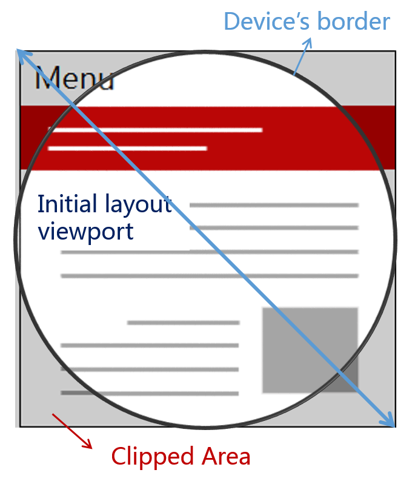

# 实践问题总结

## 移动端兼容性问题

### IPhoneX屏幕适配

添加`<meta>`标签是的页面包裹整个屏幕，否则默认情况(`viewport-fit:contain`)下web页面包括在安全区内，四周默认显示的白条无法控制。

```html
<meta name="viewport" content="width=device-width, initial-scale=1.0, viewport-fit=cover">
```



在`viewport-fit: cover`的情况下IPhoneX上的Safari浏览器提供了全局环境变量来表示安全区域到屏幕边界的距离，使用这些距离值作为padding
将web页面控制在安全区内，边界使用合适背景色的背景。

`constant`是IOS11.2之前提供的函数，之后方案标准化后规定使用`env`获取全局变量。

```css
body {
  padding: constant(safe-area-inset-top) constant(safe-area-inset-right) constant(safe-area-inset-bottom) constant(safe-area-inset-left);
  padding: env(safe-area-inset-top) env(safe-area-inset-right) env(safe-area-inset-bottom) env(safe-area-inset-left);
}
```


1. [viewport-fit](https://www.w3.org/TR/css-round-display-1/#viewport-fit-descriptor)
1. [CSS Environment Variables Module Level 1](https://drafts.csswg.org/css-env-1/#env-function)
1. [safe-area-inset values on iOS11](https://www.quirksmode.org/blog/archives/2017/10/safeareainset_v.html)
1. [网页适配 iPhoneX，就是这么简单](https://aotu.io/notes/2017/11/27/iphonex/index.html)

### Android Webview的line-height垂直居中

安卓内嵌webview中低于12px的文字[垂直位置](https://www.zhihu.com/question/39516424)计算不对，造成文字向上偏移，使用`transform`缩放文字可以避免不居中的问题。

```css
span {
  display: block;
  font-size: 20px;
  transform: scale(.5);
  transform-origin: 0% 50%;
}
```

同时移动端设计时如果`line-height`和`font-size`的差值是奇数时也会造成无法均分居中，调整字体大小和行高避免这种情况。

### 多行文字截断

https://zhuanlan.zhihu.com/p/48566402

### 半像素边框

```html
<!DOCTYPE html>

<html>
  <style>
    .container {
      width: 200px;
      height: 100px;
      display: flex;
      align-items: center;
      margin: auto;
      justify-content: space-around;
      background: lightgray;
    }
    .block {
      color: #FF2442;
      height: 16px;
      font-family: PingFang SC;
      font-style: normal;
      font-weight: normal;
      font-size: 11px;
      line-height: 12px;
      padding: 2px;
      position: relative;
      box-sizing: border-box;
      overflow: hidden;
    }
    .block:after {
      position: absolute;
      top: 0;
      left: 0;
      content: '';
      box-sizing: border-box;
      width: 200%;
      height: 200%;
      border-radius: 8px;
      border: 1px solid #ff2442;
      transform: scale(.5);
      transform-origin: top left;
      pointer-events: none;
    }
    .block.block2 {
      overflow: visible;
    }
  </style>
  <body>
    <div class="container">
      <div class="block">1元直播券</div>
      <div class="block block2">1元直播券</div>
    </div>
    <p>
      将伪元素使用transform两倍放大，设置1px边框然后缩小0.5到原来的尺寸大小，以像素为单位的元素尺寸计算可以是小数，但是渲染时最终会取整到整数值，
      所以可能出现元素尺寸x的取整和伪元素取整数值最终不一致的情况，相差1px。伪元素使用的是左上角对齐父元素的绝对定位，所以右边界1px的像素会超出父元素的边界，
      如果父元素设置了overflow: hidden那么这个伪元素的有边框就不会显示出来，造成左边这种情况。
    </p>
  </body>
</html>

```
