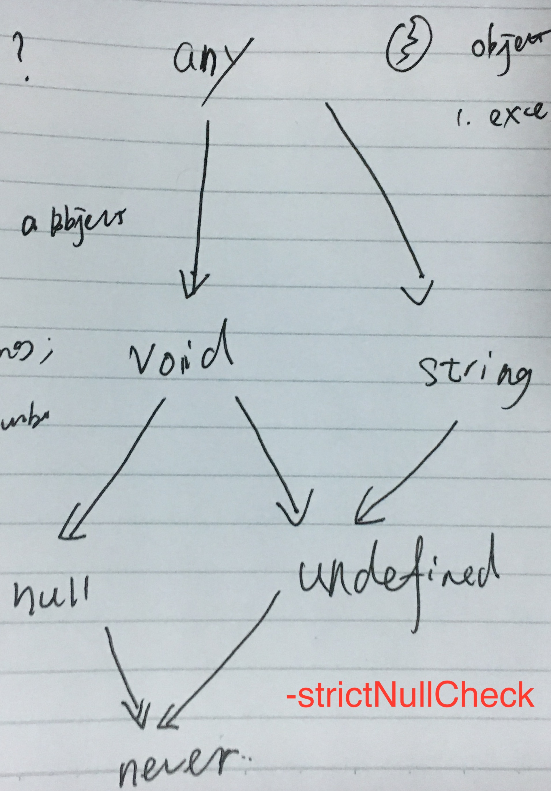

# Typescript

## terminology

Ambient

> We call declarations that don’t define an implementation “ambient”.

## Interface

Interface `SquareConfig` specifies `color` property as optional, so object literal is actually compatible with `SquareConfig`. But it's probably that object literal property `colour` is a misspell instead of intentional naming. So when object literals are used, every property of object literal is checked against target type to avoid careless like typos below and this is called **excess property checks**.

```ts
interface SquareConfig {
    color?: string;
    width?: number;
}

function createSquare(config: SquareConfig): { color: string; area: number } {
    // ...
}

let mySquare = createSquare({ colour: "red", width: 100 });

// to fix this use a variable instead of object literal
var object = { colour: "red", width: 100 }
let mySquare = createSquare(object)

// or type casting
let mySquare = createSquare({ colour: 'red', width: 100} as SquareConfig)
```

Function Type, Property Type and Indexable Types

```ts
interface Test {
  (name: string): string; // function type as normal function call
  new (gender: boolean): string;  // function type as constructor call

  readonly name?: string; // property declaration

  // 1. indexable type that describes required type of all object properties
  // 2. single property declaration must be compatible with indexable property
  // 3. indexable property of number type must be compatible with indexable property of string type,
  //    because javascript treats number property as internally.
  [prop: number]: string;
  [prop: string]: string;
}
```

Class has two side of types.

1. instance side - all instance class properties including instance class functions
1. static side - all static class properties including class constructor

Class extending interface will only checks **instance side** of class **public properties** against target interface. Static side of class must be checked intentionally.

```ts
interface ClockConstructor {
    new (hour: number, minute: number): ClockInterface;
}
interface ClockInterface {
    tick();
}

function createClock(ctor: ClockConstructor, hour: number, minute: number): ClockInterface {
    return new ctor(hour, minute);
}

class DigitalClock implements ClockInterface {
    constructor(h: number, m: number) { }
    tick() {
        console.log("beep beep");
    }
}
class AnalogClock implements ClockInterface {
    constructor(h: number, m: number) { }
    tick() {
        console.log("tick tock");
    }
}

let digital = createClock(DigitalClock, 12, 17);
let analog = createClock(AnalogClock, 7, 32);
```

## Class

A common pattern that constructor receives a parameter and use it to initialize a class property instantly.

```ts
class Octopus {
  name: string;
  readonly numberOfLegs: number = 8;

  constructor(theName: string) {
    this.name = theName;
  }
}
```

Parameter property is shorthand syntax for this common pattern, constructor parameter prefixed with accessibility modifier (`public/protected/private`) or `readonly` or both is a parameter property. It's same as declaring a class property of same name and initializes it manually in constructor.

```ts
class Octopus {
    readonly numberOfLegs: number = 8;
    constructor(readonly name: string) {
    }
}
```

Class declarations in typescript creates two things.

1. An type that describes instance object of class
1. A function object that is the constructor of this class, use `new Constructor()` to create class instance.

## Function

```ts
function mix(first: string, second: number = 1, third?: boolean, ...rest: string[]): void {}
// Function signature
(first:string, second:number, third?: boolean, rest: string[]) => void

// default parameter after all required parameter optional
// default parameter before any required parameter is required
function defaultAtLast(first:string, last: number = 1) : void {}
(first: string, last?: number) => void


// use this parameter as first to specify type of `this` in function
function f(this: void) {
  // make sure `this` is unusable in this standalone function
}

interface Callback {
  (this: EventTarget):  void;
}

addEventListener('click', callback: Callback)

// new () => string specifies c is a constructor returning string
function create(c: new() => string): string

```

## Generic

```ts
function create<T>(c: {new(): T; }): T {
    return new c();
}
```

## 接口

一个普通的Javascript对象是一组键值对（Object）的实例，为了描述对象可能的情况，Typescript中的接口被设计用来描述对象的形状（Shape），即对象可能含有哪些键（key），这些键是否只读（readonly）、键对应的的值类型是什么。符合接口描述对象形状的对象自动视作接口类型，而不必显式实现接口，称为鸭子类型（duck typing）或者结构化类型（structural typing）。

在函数参数返回值等需要接口类型的地方可以直接使用字面量对象定义类型信息。

```js
function printLabel(labeledObj: { label: string }) {
    console.log(labeledObj.label);
}

let myObj = {size: 10, label: "Size 10 Object"};
printLabel(myObj);
```

接口属性可以是只读`readonly`和可选的`optional`。

```ts
interface SquareConfig {
    color?: string;
    width?: number;
}

interface Point {
    readonly x: number;
    readonly y: number;
}
```

判断一个对象是否符合接口定义时只需要对象满足接口定义的所有键值类型信息即可，对象允许包含接口定义之外的键值。但是字符串字面值赋值给其他变量时会严格检查所有键值对，要求所有键值不多不少精确匹配，这样可以避免不小心的拼写错误。

```ts
interface SquareConfig {
    color?: string;
    width?: number;
}

function createSquare(config: SquareConfig): { color: string; area: number } {
    // ...
}

// 注意此处拼写不一致 colour -> color
let mySquare = createSquare({ colour: "red", width: 100 });
```

当然最好是对一个对象的所有可能键值类型都进行定义。

```ts
interface SquareConfig {
    color?: string;
    width?: number;
    // color, width之外的string类型key其值可以是任意类
    [propName: string]: any;
}
```

### 函数类型

接口可以用来描述函数的类型，接口定义中使用只有参数列表和返回值类型而没有实现的定义描述函数类型。一个接口可以声明多个函数类型定义，一个函数只需要满足其中一个定义即可认为是该接口描述的类型。

### Indexable Types

使用下标语法声明字符串（string）、数字（number）、符号（symbol）类型类型的键对应的值类型。

```ts
interface NumberDictionary {
    // 只读
    readonly [index: string]: number;
    length: number;    // ok, length is a number
    name: string;      // error, the type of 'name' is not a subtype of the indexer
```

## 声明合并

Typescript中每个声明会在命名空间、类型、值三个范围内创建实体。

| Declaration Type | Namespace | Type  | Value |
| ---------------- | :-------: | :---: | :---: |
| Namespace        |     x     |       |   x   |
| Class            |           |   x   |   x   |
| Enum             |           |   x   |   x   |
| Interface        |           |   x   |       |
| Type Alias       |           |   x   |       |
| Function         |           |       |   x   |
| Variable         |           |       |   x   |

### 接口合并

同一个名称的接口在一个模块中可以有多处定义，最终会被合成一个接口定义。同一个对象属性名称可以有多处定义，但是类型必须都相同。同名的函数允许有多个，被视为同一个函数的不同重载类型。靠后的接口定义优先级更高，在合并的接口中**整体**排在前边。唯一的特殊情况是接口的多个重载函数中，如果函数中有参数是某个字符串字面量类型，该函数定义排在最前边。

### 命名空间合并

同名的命名多处定义也会合并，靠后的命名空间优先级更高，合并后位于靠前的位置，但是这只针对导出的命名空间对象，未导出的对象还是只在声明所在的命名空间内可见。

### 命名空间与类、函数、枚举合并

命名空间和类、函数、枚举都声明了一个值，编译到JS对应一个普通的对象，所以命名空间可以和同名类、函数、枚举合并。但是命名空间不能与普通变量合并，因为编译出的结果不兼容。命名空间编译成一个普通对象会被添加声明的属性，但是如果同时作为一个变量则可以随意赋值，破坏了命名空间包含的属性。同理类、函数、枚举也不能合并，因为一个普通变量只能是其中一种类型而不可能同时成立。

## 枚举

### 数字与字符串枚举

枚举值可以是数字或者字符串，数字类型的枚举适用于区分若干个不同类型，但并不关心具体具体值；字符串枚举在需要查看枚举值的时候使用，通常使用说明性的文字内容作为枚举值。数字枚举和字符串枚举类型允许混合使用，但是除非必须通常不要混合使用数字和字符串类型枚举。

如果枚举值没有指定初始值的话必须是第一个枚举或者前面跟了一个有初始值的数字枚举，数字枚举值根据之前的值递增决定。字符串类型没有明确的递增规则所以必须显示指定初始值。枚举值在编译期间就需要计算确定，因此只能使用数字或者字符串字面量或者常量表达式（由数字、字符串、其他枚举值组成）。

数字枚举和字符串枚举运行时行为稍有差异，数字枚举编译时有反向映射，即从枚举值（数字）到枚举名称（字符串）的映射，字符串枚举值没有反向映射。手动指定枚举值的话可能出现多个枚举的值相同的情况，编译器对此不做限制，但是使用时避免出现这种情况。多对一的正向映射其反向映射只有最后一个枚举值生效，这种不一致的情况可能造成误判。

枚举类型同时也可以作为命名空间使用，在同名的命名空间上声明枚举类型的静态函数，编译到js时枚举类型和命名空间都只是个普通的变量。

```ts
enum Direction {
  // 初始化为0
  Up,
  // 递增初始化为1
  Down,
  Left,

  // 手动指定为1，允许重复的枚举值，编译器对次不做检查
  Right = Down,
}

namespace Direction {
  export function isUp(direction: Direction): boolean {
    return direction === Direction.Up;
  }
}

// false
Direction[Direction.Down] === "Down";
// true
Direction[Direction.Down] === "Right";
// true
Direction[Direction.Right] === "Right";

// 编译的js
var Direction;
(function (Direction) {
    // 初始化为0
    Direction[Direction["Up"] = 0] = "Up";
    // 递增初始化为1
    Direction[Direction["Down"] = 1] = "Down";
    Direction[Direction["Left"] = 2] = "Left";
    // 手动指定为1，允许重复的枚举值，编译器对次不做检查
    Direction[Direction["Right"] = 1] = "Right";
})(Direction || (Direction = {}));
(function (Direction) {
    function isUp(direction) {
        return direction === Direction.Up;
    }
    Direction.isUp = isUp;
})(Direction || (Direction = {}));
```

### 常量枚举

使用`const enum`语法声明常量枚举，常量枚举默认情况下不会编译生成对应的Javascript对象，所用使用到枚举值的地方被内联替换为常量值。使用命令行参数`--preserveConstEnums`可以指定为常量枚举编译生成对应的Javascript对象。

```ts
const enum Directions {
    Up,
    Down,
    Left,
    Right
}

let directions = [Directions.Up, Directions.Down, Directions.Left, Directions.Right]
```

### 开放式枚举

一个模块中同一个枚举可以多处定义，只要这些定义不重复，同时多处定义只允许有最多有一个定义的第一个枚举值没初始化。和命名空间处理方法相同，为每处定义生成对应的Javascript代码，将所有枚举值聚合到一个普通Javascript对象上。通常在多个脚本文件（都属于全局模块）中使用开放式枚举，一个模块文件中也可如此使用，但是通常来说没有必要。

```ts
enum Color {
  Red,
  Green,
  Blue
}

enum Color {
  DarkRed = 3,
  DarkGreen,
  DarkBlue
}

// 对应js
var Color;
(function (Color) {
    Color[Color["Red"] = 0] = "Red";
    Color[Color["Green"] = 1] = "Green";
    Color[Color["Blue"] = 2] = "Blue";
})(Color || (Color = {}));
(function (Color) {
    Color[Color["DarkRed"] = 3] = "DarkRed";
    Color[Color["DarkGreen"] = 4] = "DarkGreen";
    Color[Color["DarkBlue"] = 5] = "DarkBlue";
})(Color || (Color = {}));
//# sourceMappingURL=enum.js.map
```

### 枚举类型信息

每个声明的枚举值同时是一个类型，而枚举类型是所有单个枚举值类型的联合类型（union type）。

```ts
enum ShapeKind {
    Circle,
    Square,
}

interface Circle {
    kind: ShapeKind.Circle;
    radius: number;
}

interface Square {
    kind: ShapeKind.Square;
    sideLength: number;
}

let c: Circle = {
    kind: ShapeKind.Square,
    //    ~~~~~~~~~~~~~~~~ Error!
    radius: 100,
}
```

直接枚举名称作为类型时实际上使用的是普通的Javascript对象类型（数字或者字符串），使用`typeof`关键字来明确使用其对应的枚举类型信息。

```ts
enum LogLevel {
    ERROR, WARN, INFO, DEBUG
}

/**
 * This is equivalent to:
 * type LogLevelStrings = 'ERROR' | 'WARN' | 'INFO' | 'DEBUG';
 */
type LogLevelStrings = keyof typeof LogLevel;

function printImportant(key: LogLevelStrings, message: string) {
    const num = LogLevel[key];
    if (num <= LogLevel.WARN) {
       console.log('Log level key is: ', key);
       console.log('Log level value is: ', num);
       console.log('Log level message is: ', message);
    }
}
printImportant('ERROR', 'This is a message');
```

## 模块和命名空间

### 术语变化

模块（Module)和命名空间（namespace）在Typescript1.5之前叫做外部模块（External Module）和内部模块（Internal Module）。

```ts
// > ts 1.5
namespace X {}

// <= ts 1.5
module X {}
```

### 模块

[模块](https://www.typescriptlang.org/docs/handbook/modules.html)用来将一组变量、函数、类和接口等**聚合**且**封闭**在一个作用域内，从而不与其他模块冲突。ts将一个具有顶层`import`/`export`语句的代码文件认为是一个模块，否则该文件被认为是存在全局范围（global），文件内的所有对象可以在任何地方被引用。

模块内部使用`export`语句导出变量、函数、类、接口等定义，供其他模块使用。

```ts
// export declaration 声明语句前直接使用`export`导出：
export interface StringValidator {
    isAcceptable(s: string): boolean;
}

// export statements 单独的导出语句，可以重命名
export { Random }
export { Random as rand}

// reexport 对导入的模块中内容重新导出
export { Random } from './math'
export { Random as rand } from './math'
export * from './math'  // 一次性导出所有内容

// 默认导出，在模块只需要导出一个对象时使用
export default Math
```

使用`import`导入从其他模块中导入对象到当前模块。

```ts
// 导入一个对象
import { Random } from './math'
import { Random as rand } from './math'

// namespaced import 所有对象导入到一个命名空间下
import * as Math from './math'

// default import 默认导入，必须配合默认导出使用
import math from './math'

// 副作用导入，导入模块不引用任何模块中的对象，而是为了模块副作用生效
import './math'
```

#### import/export assignment

Common JS和AMD中使用`exports`对象进行导出，使用`exports = something`和`module.exports = something`对导出对象整体进行设置，效果和ES Module中的默认导出一致，但是这两种语法不相互兼容。ts提供了`export =`和`import = required()`语法来对应到Common JS和AMD的默认导出。

在编译选项`module`是`es6`时不能使用`export =`和`import = required()`语句，会报语法错误。

#### optional module loading

从模块中导入对象只在类型声明中使用的话，ts只使用了对象的类型信息，这时模块不会被真的导入，也不会生成对应的导入语句。

#### Ambient Module

为了给使用js编写的库提供类型信息，可以用`declare module`语法声明模块中对象的类型信息，每个模块的类型定义信息通常定义于`.d.ts`文件。使用`/// <reference path="node.d.ts"/>`（Triple Slash）引用`.d.ts`文件即可在当前文件中引入该模块的类型定义信息。

只声明模块而不包含任何类型声明时，从该模块引入的任何对象类型都是`any`。

```ts
// Shorthand Ambient modules
declare module "hot-new-module";
```

模块名称可以包含**通配符**，用来对一类（前缀或者后缀限定）的文件提供类型声明。例如`.jpg`文件被导入时，是一个有`src`属性的对象。

```ts
declare module '*.jpg' {
  const src: string;
  export default src;
}
```

UMD模块既可以当成全局使用，也可以作为模块使用，但二者能同时成立。模块定义如下：

```ts
export function isPrime(x: number): boolean;
export as namespace mathLib;
```

在另一个模块文件中使用

```ts
import { isPrime } from "math-lib";
isPrime(2);

// 错误：模块内不能使用全局定义
mathLib.isPrime(2);
```

在全局环境（不包含`import`/`export`的js文件）只能使用全局定义。

```js
mathLib.isPrime(2);
```

### 模块解析

相对路径模块

1. `/`、`./`、`../`开头的模块名称，不会解析成ambient module declaration
1. 绝对路径模块会已`baseUrl`或者路径映射（path mapping）的方式解析，可以解析成ambient module declaration

Typescript模块解析和Node.js保持一致，区别在于

1. 搜索文件.ts/.tsx/.d.ts，
1. 在`package.json`文件中由`types`字段指定模块主文件位置。
1. 另外增加node_modules文件夹下的@types文件夹搜索
1. baseUrl: 命令行参数或者`tsconfig.json`文件指定的一个相对或者绝对路径
1. path mapping配置

```json
{
  "compilerOptions": {
    "baseUrl": ".", // This must be specified if "paths" is.
    "paths": {
      "jquery": ["node_modules/jquery/dist/jquery"] // This mapping is relative to "baseUrl"
    }
  }
}
```

使用--traceResolution参数显示模块解析过程。

### 命名空间

[命名空间](https://www.typescriptlang.org/docs/handbook/namespaces.html)用来将逻辑上相关的一组变量、类、接口等聚合在一起，放到同一个命名空间下。命名空间内的变量通常只在该命名空间下可见，在外部使用同样要用`export`进行导出。

命名空间通常在**全局模块**下使用，可以位于同一个源文件也可以分散在多个源文件中，文件之间的依赖关系使用Triple Slash引用表示。默认情况下ts会为属于同一个命名空间的多个.ts文件生成对应一一对应的.js文件，由于.ts文件之间存在依赖关系，所以在.html文件中引入多个.js文件时需要将被依赖的文件放在前面。通过`--outFile`参数可以指定将结果输出到一个js文件中。

命名空间被编译成一个普通的js对象，该对象上的属性对应了命名空间中导出的类、变量、函数。命名空间实际上就是一个普通的Javascript全局对象。

在一个模块文件中使用的命名空间不会突破模块的范围，因此跨多个模块的同名命名空间是独立的，不会被自动合并在一起。但是在一个模块文件内多个位置使用相同的命名空间，这些不同的定义是会被合并在一起的。因为模块本身有命名空间所具有的封装的作用，所以模块内部通常不使用命名空间。在模块功能较多需要隔离的时候更倾向拆分为多个模块而不是使用命名空间。

只有在**全局模块**下才使用命名空间进行隔离，因为全局空间不对应具体的某个文件，这时只能使用命名空间而没法使用模块。

典型的在模块文件中使用命名空间的错误做法：

```ts
// 在一个模块文件中将所有内容包含在一个命名空间中，模块本身有一层封装，命名空间Foo又添加了一层（重复且无用）
export namespace Foo {}

// 多个模块文件中，命名空间Foo不会被合并
export namespace Foo {}
```

命名空间可以方便的为一些暴露**全局对象**的三方库添加类型定义，例如D3。

```ts
declare namespace D3 {
    export interface Selectors {
        select: {
            (selector: string): Selection;
            (element: EventTarget): Selection;
        };
    }

    export interface Event {
        x: number;
        y: number;
    }

    export interface Base extends Selectors {
        event: Event;
    }
}

declare var d3: D3.Base;
```

### 别名

别名（alias）使用`import q = x.y.z`可以为命名空间或者模块中导出的对象起一个别名，方便使用。

## 编译环境

### 默认全局环境

Typescript编译环境默认都带有一个`lib.d.ts`文件，其中定了常见的浏览器宿主环境和Javascript规定的API的类型定义，默认使用这个定义文件为全局环境提供常见的定义信息。如果想要细粒度控制全局环境中的类型信息可以使用`--noLib`命令行参数或者在tsconfig.json的`lib: false`配置来禁用`lib.d.ts`文件。使用`--lib`参数或者配置文件编译选项`lib: string[]`来指定具体使用的全局API定义，Typescript中默认包含了很多预先定义好的类型定义文件。

```bash
tsc --target es5 --lib dom,es6
```

或者

```json
"compilerOptions": {
    "lib": ["dom", "es6"]
}
```

可用的类型定义文件大致如下：

1. JavaScript 功能
    - es5
    - es6
    - es2015
    - es7
    - es2016
    - es2017
    - esnext
1. 运行环境
    - dom
    - dom.iterable
    - webworker
    - scripthost
1. ESNext 功能选项
    - es2015.core
    - es2015.collection
    - es2015.generator
    - es2015.iterable
    - es2015.promise
    - es2015.proxy
    - es2015.reflect
    - es2015.symbol
    - es2015.symbol.wellknown
    - es2016.array.include
    - es2017.object
    - es2017.sharedmemory
    - esnext.asynciterable

注意使用较新的API时Typescript只提供了类型定义信息，相关Polyfill要另外引入，否则无法使用。

### 三方库全局环境

寻找一个[三方库全局环境的类型定义](https://www.typescriptlang.org/docs/handbook/tsconfig-json.html#types-typeroots-and-types)时首先会去库本身的目录`./node_modules/lib-name`下去查找自带的类型定义文件，即`.ts`、`.tsx`、`d.ts`或者`package.json`的`types`字段指定的文件。对于Javascript实现的不带有类型定义文件的库，社区项目Definitely Typed为大多数库提供了定义文件，这些文件位于`./node_modules/@types`文件夹下。使用如下命令为JQuery安装类型定义文件：

```bash
npm install @types/jquery --save-dev
```

库类型文件查找的过程是从当前目录向上直到项目根目录，在每个目录下查找`./node_modules/@types/lib-name`目录对应库`lib-name`的类型定义。其中项目所在目录名称@types可用typeRoots选项配置，要引入的库`lib-name`由`types`选项配置。

```json
{
   "compilerOptions": {
       // 类型定义库目标目录名，可以有多个，此字段不存在时默认使用 '@types'
       "typeRoots" : ["./typings"],

       // 要引入的类型定义库名称，此字段不存在时目录下所有库都会被引入
       // 需要精确控制库类型定义时使用此字段明确要引入的库类型定义，其他库不会引入，使用空数组完全禁用库类型自动引入
       "types" : ["node", "lodash", "express"]
   }
}
```

一个类型定义库目录可能是包含一个`index.d.ts`文件或者一个`package.json`文件其中`types`字段指定了类型定义文件名。

### 类型

#### 类型体系

TS有两个顶层类型（Top Type ）`any`和[unknown](https://github.com/Microsoft/TypeScript/pull/24439)，任何其他类型都是这两个类型的子类型。有一个底层类型（Bottom Type）`never`是所有其他类型的子类型。



使用`any`是说我不知道具体是什么类型，所以不管我做什么操作，都可能是正确的，所以不要提示错误。`any`提供了一个从JS到`TS`渐进迁移的方法，所有不确定类型或者暂时不想耗费精力去指定精确类型的地方都可以使用`any`，类型系统不再报错，但是程序运行时的正确性由程序员自己保证。

使用`unknown`类型是说我不知道具体是什么类型，所以进行任何操作之前请提醒我进行类型检查。在`any`类型的基础上，想要更准确的类型检查就将`any`修改为`unknown`或者准确的类型上。

```ts
// unknown类型可以直接赋值给any或者unknown
let value1: unknown = value;   // OK
let value2: any = value;       // OK

// 赋值给任何其他类型都会报错，使用前必须进行类型检查，收缩unknown到具体类型
let value3: boolean = value;   // Error
let value4: number = value;    // Error
let value5: string = value;    // Error
let value6: object = value;    // Error
let value7: any[] = value;     // Error
let value8: Function = value;  // Error

// union unknown
type UnionType1 = unknown | null;       // unknown
type UnionType2 = unknown | undefined;  // unknown
type UnionType3 = unknown | string;     // unknown
type UnionType4 = unknown | number[];   // unknown
type UnionType5 = unknown | any;  // any

// intersection
type IntersectionType1 = unknown & null;       // null
type IntersectionType2 = unknown & undefined;  // undefined
type IntersectionType3 = unknown & string;     // string
type IntersectionType4 = unknown & number[];   // number[]
type IntersectionType5 = unknown & any;        // any
```

大部分运算符对于`unknown`类型没有意义，能够直接使用的只有这几个`===`、`==`、`!==`、`!=`。

1. `void` type is used as return type of function that doesn't returns. A variable of `void` can only accept `null` and `undefined` as its value.
1. `undefined` and `null` type are type with single valid value `undefined` and `null` respectively. And they are subtypes of normal type like `string`/`number` so that a variable of type `string` can accept `undefined` and `null`. However, when `strictNullCheck` option is enabled, this is not allowed.
1. `never` type is the return type of function when function throws exception or never ends (dead loop), `never` type is subtype of any other type.

#### Type Guards

类型谓词（type predicate），在函数签名返回值类型处使用`parameter is Type`形式，函数返回值为真时参数类型成立。

```ts
interface Bird {
    fly();
    layEggs();
}

interface Fish {
    swim();
    layEggs();
}

function isFish(pet: Fish | Bird): pet is Fish {
    return (pet as Fish).swim !== undefined
}

if (isFish(pet)) {
    // isFish返回真时pet是Fish成立
    pet.swim()
} else {
    // pet是Fish不成立，pet只能是Bird
    pet.fly()
}
```

类型谓词只能有使用一次。

`n in x`操作符，其中`n`是字符串或者字符串类型，`x`是联合类型（union type）。

```ts
function move(pet: Fish | Bird) {
    if ("swim" in pet) {
        // 收缩到联合类型中具有可选的或者必须的"swim"字段的类型
        return pet.swim();
    }
    // 收缩到联合类型中具有可选的"swim"字段或者没有“swim”字段的类型
    return pet.fly();
}
```

`typeof v === "typename"`或者`typeof v !== "typename"`两种形式，其中`typename`只能是`"number"`，`"string"`,`"boolean"`或者`"symbol"`，这些情况下被识别为类型保护声明。

注意"typename"中不包括`null`和`undefined`，对于`null`和`undefined`的类型守卫直接使用等式判断即可。

```ts
function f(sn: string | null): string {
  if (sn == null) {
    return "default";
  } else {
    return sn;
  }
}

// 或者更简洁的形式
function f(sn: string | null): string {
  return sn || "default";
}
```

对于编译器尚不能分析确定但是根据代码流程变量类型不可能是`null`或者`undefined`的情况，使用`v!`变量名加`!`的形式提示编译器该变量不可能是`null`或者`undefined`。

```ts
function broken(name: string | null): string {
  function postfix(epithet: string) {
    // error, 'name' is possibly null
    return name.charAt(0) + ".  the " + epithet;
  }
  name = name || "Bob";
  return postfix("great");
}

function fixed(name: string | null): string {
  function postfix(epithet: string) {
    // 不再提示错误
    return name![0] + ".  the " + epithet;
  }
  name = name || "Bob";
  return postfix("great");
}
```

`obj instanceof ConstructorName`中右侧必须是构造函数，在条件成立时对象`obj`会被收窄类型，函数原型存在的话收窄到`ConstructorName.prototype`的类型，收窄到所有重载的构造函数返回类型的联合类型。

断言函数（assertion function）是Javascript中用来确保断言条件成立的函数，在失败的情况下抛出异常。[断言签名](https://github.com/microsoft/TypeScript/pull/32695)用来指示如果断言函数正常执行，没有抛出异常，那么后续流程中断言成立（可能是type guard）或者断言的参数类型为真。

```ts
// 断言条件成立
function assert(condition: any, msg?: string): asserts condition {
    if (!condition) {
        throw new AssertionError(msg)
    }
}

function yell(str) {
    assert(typeof str === "string");

    // error: Property 'toUppercase' does not exist on type 'string'.
    return str.toUppercase();
}

// 断言参数类型
function assertIsString(val: any): asserts val is string {
    if (typeof val !== "string") {
        throw new AssertionError("Not a string!");
    }
}

// 使用
function yell(str: any) {
    assertIsString(str);

    // error: Property 'toUppercase' does not exist on type 'string'.
    return str.toUppercase();
}
```

`keyof T`（index type query operator）返回类型`T`的所有`public`属性名称字符串的联合类型，可以用在泛型表达式中。
`T[K]`（the indexed access operator）返回类型`T`的所有键值`K`对应的属性值类型的联合类型。

索引类型和索引签名，具有`string`类型索引签名的类型`T`，对应的`keyof T`是`number | string`，因为Javascript中`number`下标的访问被自动转换成字符串。具有`number`索引类型签名的类型`T`，对应的`keyof T`是`number`。

```ts
interface Dictionary<T> {
  [key: string]: T;
}
let keys: keyof Dictionary<number>; // string | number
let value: Dictionary<number>["foo"]; // number

interface Dictionary<T> {
  [key: number]: T;
}
let keys: keyof Dictionary<number>; // number
let value: Dictionary<number>["foo"]; // Error, Property 'foo' does not exist on type 'Dictionary<number>'.
let value: Dictionary<number>[42]; // number
```

映射类型从现有的对象类型基础上，创建出新的对象类型，`[P in keyof T]`表达式中`keyof T`表示现有类型`T`的所有键类型，`T[P]`是每个键的对应值类型。

```ts
type Readonly<T> = {
  readonly [P in keyof T]: T[P];
};
type Partial<T> = {
  [P in keyof T]?: T[P];
};
```

上面是[一一映射](https://en.wikipedia.org/wiki/Homomorphism)，只改变每个键值对的类型信息，增加或者减少成员的话不能使用这种形式。

```ts
// This is an error!
type PartialWithNewMember<T> = {
  [P in keyof T]?: T[P];
  newMember: boolean;
}
```

可以在`K in keyof T`中使用不同的键名称联合类型替换`keyof T`，然后配合条件类型指定对值的类型。

```ts
type AddNewMember<T, Name extends string, U> = {
  [K in (keyof T | Name)]: K extends keyof T ? T[K] : U;
}

type AddNameCar = AddNewMember<Car, "fuck", number>
```

或者使用交集类型

```ts
// Use this:
type PartialWithNewMember<T> = {
  [P in keyof T]?: T[P];
} & { newMember: boolean }
```

// TODO:

as const

control flow analysis https://github.com/microsoft/TypeScript/pull/32695

this parameter
function
constructor
tuple


// intersection type of function ?
f12('hello', 'world')
f12(1, 3)
f12(1, 'test')

lookup type

```ts
type E7 = (string[])[number]

type E8 = (string[])[1]
type E9 = (string[])[number]
// error
// type E9 = (string[])[string]
type E91 = (string[])[never]
type E92 = (string[])[any]
// type E93 = (string[])[void]

type E10 = ([string, number])[0]
type E11 = ([string, number])[1]
type E12 = ([string, number])[0 | 1]
type E13 = ([string, number])[number]
type E14 = ([string, number])[never]
type E15 = ([string, number])[any]
// type E14 = ([string, number])[string]

```

#### 交集与并集（intersection & union）

函数签名中参数类型是输入类型，符合逆变（contra-variance），返回值是输出类型，符合协变（covariance）。

两个函数的交集函数类型如下：

```ts
type F1 = (a: string, b: string) => string | number;
type F2 = (a: number, b: number) => number | boolean;

let fNumber: F1 & F2 = (a: string | number, b: string | number): number => { return 1 }
// 返回类型错误
// let fString: F1 & F2 = (a: string | number, b: string | number): string => { return '1' }
// let fBoolean: F1 & F2 = (a: string | number, b: string | number): boolean => { return true }
```

交集函数`fNumber`的输入参数是逆变的，类型`F1 & F2`的函数必须同时接受`F1`参数类型和`F2`参数类型，所以`F1 & F2`的参数类型是`F1`和`F2`对应参数类型的并集类型；返回值类型是协变的，所以必须同时是`F1`和`F2`的返回值类型的子类型，也就是其共同部分`number`。

下面是三个使用例子，需要注意的是第三个例子混合了字符串和数字的调用，这种情况能被编译器判定为**类型错误**。

TODO: 在`fNumber(1, 'test')`调用处会根据参数进一步**收缩**类型。注意决定`F1 & F2`的过程和赋值语句中类型推导的收缩过程是两个独立的过程。

```ts
fNumber('hello', 'world')
fNumber(1, 3)
// typescript可以从重载中选出一个从而检测出这个调用是不合法的。
// fNumber(1, 'test')
```

根据上述概念可以实现交集函数操作的泛型类`IntersectionFun<T>`

```ts
type IntersectionFun<F1 extends (a: any, b: any) => any, F2 extends (a: any, b: any) => any>
  = (
      a: Parameters<F1>[0] | Parameters<F2>[0],
      b: Parameters<F1>[1] | Parameters<F2>[1],
    ) => ReturnType<F1> & ReturnType<F2>

let fNumber: IntersectionFun<F1, F2> = (a: string | number, b: string | number): number => { return 1 }

fNumber('hello', 'world')
fNumber(1, 3)
// 类型正确
fNumber(1, 'test')
```

`IntersectionFun<T>`相比于交集类型操作符有两点不同：

1. 只能准确得到固定个数的函数参数类型，这里是2个。
1. 第三个混合类型的调用类型正确。

`F1 & F2`类似于函数重载的效果

```ts
// F1
declare function fNumber(a: number, b: number): string | number;
// F2
declare function fNumber(a: string, b: string): number | boolean;
// F1 & F2  参数类型错误
fNumber(1, 'test')

// IntersectionFun<F1, F2>
declare function fNumber(a: string | number, b: string | number): number;
```

两个函数类型的并集函数类型，`fUnion: F1 | F2`赋值语句中进行类型推导的过程是从并集`F1 | F2`中依次检查目标类型例如`(a: string, b: string): number`，去除掉不符合的类型`F2`，最终收缩到符合类型的并集上`F1`。

```ts
namespace FnUnion {
  type F1 = (a: string, b: string) => string | number;
  type F2 = (a: number, b: number) => number | boolean;

  namespace E1 {
    // F1符合 (a: string, b: string) => string | number
    let fUnion: F1 | F2 = (a: string , b: string): number => {
      return 1
    }
    fUnion('hello', 'world')
    fUnion(1, 3)
    fUnion(1, 'test')
  }

  namespace E2 {
    // F2符合 (a: number, b: number) => number | boolean
    let fUnion: F1 | F2 = (a: number, b: number): number => {
      return 1
    }
    fUnion('hello', 'world')
    fUnion(1, 3)
    fUnion(1, 'test')
  }

  namespace E3 {
    // (a: never, b: never) => string : number | boolean
    let fUnion: F1 | F2 = (a: number | string, b: number | string): any => {
      return 1
    }
    fUnion('hello', 'world')
    fUnion(1, 3)
    fUnion(1, 'test')
  }
}
```

#### tuple

map函数的类型签名，每个位置的参数类型准确？

#### 条件类型

条件类型的形式`T extends U ? X : Y`，如果`T`是`U`的子类型，结果类型是`X`，否则是`Y`。还可能在类型信息不足以判断`T extends U`结果时延迟类型决定，这个时候条件类型的值可以赋值给类型`X | Y`，因为不论结果如何，最终类型不是`X`就是`Y`。

```ts
declare function f<T extends boolean>(x: T): T extends true ? string : number;
let x = f(Math.random() < 0.5)

let x: string | number = f(Math.random() < 0.5)
let x1: string = f(true)
let x2: number = f(false)
```

**分配的条件类型**（distributive conditional types），在条件类型表达式中`T extends U ? X : Y`中，`T`是一个**单纯的泛型类型参数**时，在条件类型表达式使用具体类型实例化时，如果实际类型是联合类型`A | B | C`，条件类型的结果是每个子类型的条件类型的联合类型。

```ts
// 联合类型
type ABC = A | B | C

// 泛型类型定义
type Distributive<T, U> = T extends U ? T[] : never

// 使用联合类型实例化条件类型表达式，结果符合分配律
type DistributedABC = Distributive<A | B | C, number | boolean>
type ExpandedDistributedABC =
    (A extends number | boolean ? A[] : never)
  | (B extends number | boolean ? B[] : never)
  | (C extends number | boolean ? C[] : never)

// T[]是符合类型，不是单纯的类型参数所以不发生分配
type NotDistributiveCauseNonNakedType<T, U> = T[] extends U[] ? T[] : never
// never
type N1 = NotDistributiveCauseNonNakedType<A | B | C, number | boolean>

// string[]不是单纯的类型参数，不发生分配
type NotDistributiveCauseNotTypeParameter<T> = string[] extends any[] ? T[] : never
```

当分配不发生时可以采用嵌套的语法强制实现分配，参考下例。

```ts
namespace Conditional {
  interface Student {
    name: string;
    friends: string[];
    teachers: string[];
  }

  // 实现一个FilterArrayKeys<T>，返回T中所有值是数组类型的键的集合
  // 从Student中找出值是数组类型的键名称类型 FilterArrayKeys
  // ArrayKeys应该是 "friends" | "teachers"
  // type ArrayKeys = FilterArrayKeys<Student>

  namespace NonDistributive {
    // T[K]是值的类型，但是这种形式不发生分配
    type FilterArrayKeys<T, K extends keyof T = keyof T> = T[K] extends any[] ? K : never;

    // ArrayKeys = never
    type ArrayKeys = FilterArrayKeys<Student, keyof Student>
  }

  namespace Distributive {
    // 为了发生分配，使用K嵌套一层即可
    type FilterArrayKeys<T, K extends keyof T = keyof T> = K extends any
      ? T[K] extends any[] ? K : never
      : never

    // ArrayKeys = "friends" | "teachers"
    type ArrayKeys = FilterArrayKeys<Student>
  }
}

```

注意分配的条件类型是typescript提供的一个工具对联合类型中某些类型做过滤，并不是一个类型系统的定律。下面两种情况并不等价

```ts
// A = never
type A = (number | string) extends string ? true : never
// B = true
type B =
    | number extends string ? true : never
    | string extends string ? true : never
```

条件类型和映射类型联合使用，

```ts
// 注意索引类型,never类型，映射类型、条件类型的组合使
type FunctionPropertyNames<T> = { [K in keyof T]: T[K] extends Function ? K : never }[keyof T];
type FunctionProperties<T> = Pick<T, FunctionPropertyNames<T>>;

type NonFunctionPropertyNames<T> = { [K in keyof T]: T[K] extends Function ? never : K }[keyof T];
type NonFunctionProperties<T> = Pick<T, NonFunctionPropertyNames<T>>;

interface Part {
    id: number;
    name: string;
    subparts: Part[];
    updatePart(newName: string): void;
}

type T40 = FunctionPropertyNames<Part>;  // "updatePart"
type T41 = NonFunctionPropertyNames<Part>;  // "id" | "name" | "subparts"
type T42 = FunctionProperties<Part>;  // { updatePart(newName: string): void }
type T43 = NonFunctionProperties<Part>;  // { id: number, name: string, subparts: Part[] }
```

条件类型**不能嵌套使用**

```ts
type ElementType<T> = T extends any[] ? ElementType<T[number]> : T;  // Error
```

条件类型表达式可以嵌套

```ts
type V = true extends true ? (string extends number ? 1 : 2) : 3
```

#### TODO

1. 参考例子condtional-exer1.ts，https://artsy.github.io/blog/2018/11/21/conditional-types-in-typescript/

#### 条件类型中的类型推导

在条件类型表达式中可以使用`infer`关键字引入一个被推导出值的类型标志，类型标志通常作为复合类型的一部分使用，推导出的类型标志后续在条件类型为**真**的分支中使用。

```ts
type ReturnType<T> = T extends (...args: any[]) => infer R ? R : any;
```

可以使用**多个相同或者不同**的类型关键字，

一个类型有多个约束时在协变的情况下推导为所有可能类型的并集类型（union），在逆变的情况下推导为所有类型的交集类型(intersection）。

```ts
type Foo<T> = T extends { a: infer U, b: infer U } ? U : never;
type T10 = Foo<{ a: string, b: string }>;  // string
// 协变
type T11 = Foo<{ a: string, b: number }>;  // string | number

type Bar<T> = T extends { a: (x: infer U) => void, b: (x: infer U) => void } ? U : never;
type T20 = Bar<{ a: (x: string) => void, b: (x: string) => void }>;  // string
// 逆变
type T21 = Bar<{ a: (x: string) => void, b: (x: number) => void }>;  // string & number
```

被推导的类型有多种签名类型（函数重载）时，使用最后一种。

```ts
declare function foo(x: string): number;
declare function foo(x: number): string;
declare function foo(x: string | number): string | number;
type T30 = ReturnType<typeof foo>;  // string | number
```

#### 索引类型

注意类型表达式
索引类型(index types)

```ts
interface Person {
    name: string;
    age: number;
    sex: boolean;
}

// string | number
type P = Person['name' | 'age']

// 去除数组类型
type E = (string[])[number]
```

#### Types

TODO:

1. Partial
1. Required
1. Readonly
1. Pick
1. Record
1. Exclude
1. Extract
1. Omit
1. NonNullable
1. Parameters
1. ConstructorParameters
1. ReturnType
1. InstanceType
1. Unpack 剥离数组，函数，Promise等复合类型的基础类型
1. 映射类型
    1. 改变值的类型
    1. 根据key名称过滤一部分
    1. 根据值类型过滤一部分
    1. 添加新的键值对类型 从类型`Person`构建一个新类型，新类型只包括`Person`中值是函数的键值对。 为类型`Person`添加新的类型
        ```ts
        interface A {
            name: string;
        }

        interface B {
            age: string;
        }

        interface C {
            name: string;
            age: string;
        }
        type C1 = A | B
        ```
1. conditional types
    ```ts
    function process(text: string | null): string | null {
        return text && text.replace(/f/g, "p")
    }

    function process<T extends string | null>(text: T):
        T extends null ? null : string
    {
        return text && text.replace(/f/g, "p")
    }
    ```

#### 图灵完备

https://github.com/Microsoft/TypeScript/issues/14833
https://mariusschulz.com/blog/series/typescript-evolution
