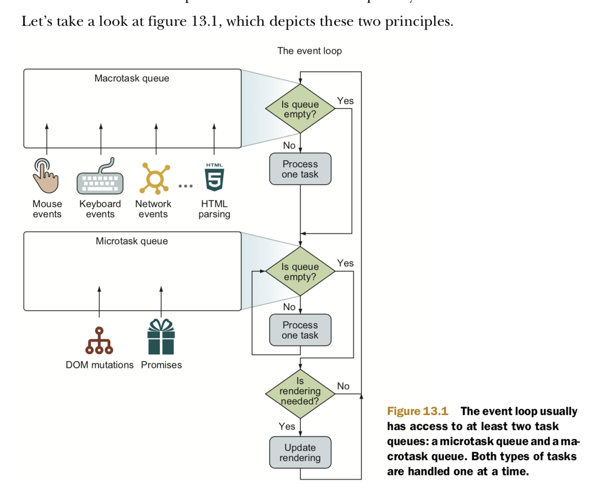

# [事件循环（Event Loop）](https://html.spec.whatwg.org/multipage/webappapis.html#event-loops)

浏览器采用事件循环的机制调度不同来源的任务（Task）按照合理的顺序执行，有如下三种类型的[事件循环](https://html.spec.whatwg.org/multipage/webappapis.html#event-loop)。

1. 窗口事件循环（Window event loop）- 最核心的事件循环，在多个具有相似源（similar origin）的窗口间共享，处理窗口相关事件，包括渲染功能。有几种情况多个window可以共享同一个event loop。
    1. 一个window打开另外一个window
    1. 一个window包含了一个`<iframe>`标签对应的window
    1. 两个window在实现上共享同一个进程（process）
2. Worker event loop - basic web workers, shared workers, service workers等相关的事件循环，Worker事件循环和窗口事件循环独立，浏览器可以为所有Worker使用同一个事件循环，也可以按照类型为每个类型的Workers使用一个独立的事件循环。
3. Worklet event loop - Worklet、AudioWorklet、PaintWorklet机制和Worker类似。

## 任务与微任务

一个事件循环中至少包含两个任务队列（Task Queue），任务队列和微任务队列。任务队列中的任务可能来自不同的任务源，常见的[任务源](https://html.spec.whatwg.org/multipage/webappapis.html#generic-task-sources)如下：

1. DOM操作任务源 - 对DOM变动做出响应而添加的任务
1. 用户交互任务源 - 对键盘、鼠标等用户输入做出响应而添加的任务
1. 网络任务源 - 对网络相关事件（XHR、Websocket等）做出响应而添加的任务
1. history traversal task source - History API相关的事件做响应而添加的任务

任务队列一般存在多个，将不同类型的任务放到不同的队列中，同一个任务队列中的任务之间按照先进先出(FIFO)的顺序执行，但是不同队列的任务之间没有确定的执行顺序。实际上浏览器会为不同类型的任务使用独立的任务队列，这样设计的原因是根据不同类型任务的优先级，浏览器可以选择先执行优先级高的任务队列，如用户交互事件等。微任务队列每个事件循环只有一个。

任务和微任务的区别在于任务用来执行较大的一个操作，事件循环每一轮只会取出一个任务执行；微任务用来执行一个较小的操作，如果操作的结果想要在下一轮循环之前生效的话，使用微任务。

事件循环的[处理模型](https://html.spec.whatwg.org/multipage/webappapis.html#event-loop-processing-model)简要总结如下，一次循环的过程如下：

1. 选择一个包含至少一个可运行任务的任务队列，将最早的可运行任务出队，执行此任务。任务执行的过程中可能添加新的任务或者微任务到相关队列中。新添加的任务不会影响到本次循环的运行，只能等到后续的循环运行。
1. 在任务运行过程中或者任务运行完成后碰到微任务检查点，需要[进行微任务检查(perform microtask check point)](https://html.spec.whatwg.org/multipage/webappapis.html#perform-a-microtask-checkpoint)，所谓微任务检查就是不断从微任务队列中取出微任务执行，直到微任务队列**清空**。微任务检查点有两个时机：
    1. 任务执行完成后
    1. 任务执行中，相关回调函数完成后，而且Javascript[执行环境](http://davidshariff.com/blog/what-is-the-execution-context-in-javascript/#first-article)栈（[Javascript Execution Context Stack](https://tc39.es/ecma262/#execution-context-stack)）为空时
1. 一个循环结束后，浏览器根据是否有渲染机会和任务执行造成的相关变动按需跳过或者重新渲染
1. 整个事件循环不断重复这个过程来处理所有可能的相关任务，如果没有可执行的任务，循环空转，浏览器可能调用`requestIdleCallback(fn)`注册的回调函数。



事件循环两个基本原则

1. 任务是一个一个处理的，一次循环最多处理一个。
2. 一个任务开始执行后不能被其他任务打断直到完成。

向任务队列和微任务队列中添加新任务的动作发生在事件循环之外的线程，这样事件循环所在线程执行Javascript脚本任务的时候，其他事件可以被相应从而将时间回调函数作为新任务添加到任务队列中。

值得注意的是全局Javascript脚本（mainline javascript）的执行和控制台中Javascript的执行都是作为一个任务被事件循环处理。并且脚本任务执行完成后，存在一个[脚本清除（clean up）](https://html.spec.whatwg.org/multipage/webappapis.html#clean-up-after-running-script)的阶段，清除任务脚本相关且不需要继续存在的资源。这时如果js调用栈为空，就碰到了上述微任务检查点。

微任务检查过程执行微任务时可能触发其他脚本的执行，因此会递归地重新触发脚本清除和微任务检查过程，因此每个事件循环都有一个初始值为`false`的布尔类型标志位，在初次进入时设置为`true`从而防止微任务检查过程重入(reentrancy)。

浏览器的理想渲染频率是60FPS，所以一次循环应当在16.7ms内完成，这样才能保证流畅的用户体验。

常见的任务如下：

1. 解析HTML
1. 创建当前文档对象`window.document`
1. 执行HTML文档中主线代码，即`<script>`标签中的全局Javascript代码
1. 页面加载相关[事件](https://javascript.info/onload-ondomcontentloaded) DOMContentLoaded, load, beforeunload, unload
1. 改变当前文档URL
1. MessageChannel
1. 用户输入user input
1. I/O网络事件
1. `addEventListener`添加的回调函数
1. 定时器事件`setTimeout`/`setInterval`
1. `setImmediate`(node)

常见的微任务如下：

1. Promise
1. MutationObserver
1. Object.observe
1. process.nextTick (node)

需要注意的是UI渲染过程和`requestAnimationFrame(callback)`注册的回调函数不属于任务，而是在当前循环完成任务执行、微任务队列清空后的时机运行。

## 定时器任务

`setTimeout(fn, delay)`、`setInterval(fn, delay)`中`delay`代表了回调函数作为任务被添加到任务队列中的等待时间，并不是回调函数执行的等待时间。任务队列中存在的其他正在被执行的任务，直到所有之前添加的任务执行完成后才开始执行`fn`。

注意定时器函数调用时，实际上是用其他线程实现了一个定时机制在时间到后将回调添加为任务，进入任务队列等待执行。因此可以在任务还没执行时调用`clearTimeout`、`clearInterval`取消任务。

同一个`setInterval`在任务队列中有最多只有一个回调函数任务，不会重复添加。


```js
setTimeout(function repeatMe(){
  /* Some long block of code... */
  setTimeout(repeatMe, 10);
}, 10);
```

每个回调事件最少等待10ms后被执行，执行时添加新的回调，两个回调之间添加的时间间隔不一定是10ms，由于其他任务和此定时器任务本身执行耗时会导致时间间隔大于10ms。

```
setInterval(() => {
  /* Some long block of code... */
}, 10);
```

由其他线程保证每隔恒定10ms触发一次，如果任务队列中还没有该定时器的回调函数任务则添加一个。可能造成的结果是一个回调刚刚执行完10ms中之内到了下次触发时间，这样两个回调执行的间隔会小于10ms。

一个复杂的长时间任务对于用户来说浏览器从无响应卡死状态，利用`setTimeout`将划分成若干个短任务处理，使浏览器可以在每个短任务完成后重新渲染，用户感知到浏览器正常响应。

```js
// output: Interval Timeout Interval Interval ...
setTimeout(function(){
  console.log("Timeout ");
}, 1000);
setInterval(function(){
  console.log("Interval ");
}, 500);
```

## queueMicrotask

[MDN](https://developer.mozilla.org/en-US/docs/Web/API/HTML_DOM_API/Microtask_guide)、[提案](https://github.com/whatwg/html/issues/512)、[标准](https://html.spec.whatwg.org/multipage/timers-and-user-prompts.html#microtask-queuing)规定了全局函数`queueMicrotask`来提供注册微任务的能力，在这之前一些库例如[asap](https://github.com/kriskowal/asap)利用`Promise.then(callback)`和`MutationObserver`的回调函数是微任务的方法提供注册微任务的能力。

利用`Promise.then`模拟`queueMicrotask`。

```js
if (typeof window.queueMicrotask !== "function") {
  window.queueMicrotask = function (callback) {
    Promise.resolve()
      .then(callback)
      // 捕捉并全局抛出异常
      .catch(e => setTimeout(() => { throw e; }));
  };
}
```

利用`MutationObserver`模拟`queueMicrotask`

```js
if (typeof window.queueMicrotask !== "function") {
  window.queueMicrotask = function(callback) {
    let observer = new MutationObserver(callback)
    let counter = 0
    let textNode = document.createTextNode(String(counter))

    observer.observe(text, { characterData: true })
    counter = (counter + 1) % 2
    textNode.data = String(counter)
  }
}
```

这两种间接模拟的方法来模拟微任务注册功能比较明显的[缺点](https://github.com/fergald/docs/blob/master/explainers/queueMicrotask.md)就是不直观，另外额外需要创建`Promise`对象和`MutationObserver`对象浪费一定内存。 另外单纯使用`Promise.then(callback)`方式添加微任务的方式存在一个问题，回调函数中抛出的异常不是作为全局异常抛出而是表现为一个被拒绝的`Promise`，所以上面代码中利用`catch`处理被拒绝的`Promise`，然后全局抛出异常。

Vue也是用这种trick的方法来实现异步更新函数`nextTick`，参考[问题](https://www.zhihu.com/question/55364497)、[文章](https://github.com/Ma63d/vue-analysis/issues/6)

注册任务、微任务、动画帧分别对应三种需求场景，将注册微任务的底层API暴露出来，语义上更加清晰。

1. 任务 `setTimeout(callback,0)`
1. 微任务 `queueMicrotask(callback)`
2. 动画 `requestAnimationFrame(callback)`

`queueMicrotask(callback)`的通过`WindowOrWorkerGlobalScope`接口被暴露在`window`、`worker`全局对象上，接受一个函数`callback`作为参数，该函数被注册为微任务异步执行，用法参考[MDN](https://developer.mozilla.org/en-US/docs/Web/API/WindowOrWorkerGlobalScope/queueMicrotask)。

注意不要滥用`queueMicrotask`函数来添加执行时间较长的微任务，这样会阻塞主线程，造成浏览器卡顿。此时浏览器会提示用户是否强制结束卡死的脚本。

另外注意嵌套调用回调函数添加微任务会造成死循环，因为微任务一直不停的添加，微任务队列永远不会清空。

```js
let count = 0;

function infiniteMicrotask() {
  console.log(count++)
  queueMicrotask(infiniteMicrotask)
}

infiniteMicrotask()
```

显式的注册微任务有两个典型的应用场景，一是保证条件分支中[一边同步一边异步](https://blog.izs.me/2013/08/designing-apis-for-asynchrony)的代码都是异步执行。

```js
customElement.prototype.getData = url => {
  if (this.cache[url]) {
    // 同步执行
    this.data = this.cache[url];
    this.dispatchEvent(new Event("load"));
  } else {
    fetch(url).then(result => result.arrayBuffer()).then(data => {
      // 异步执行
      this.cache[url] = data;
      this.data = data;
      this.dispatchEvent(new Event("load"));
    });
  }
};

// 保证都是异步执行
customElement.prototype.getData = url => {
  if (this.cache[url]) {
    // 异步执行
    queueMicrotask(() => {
      this.data = this.cache[url];
      this.dispatchEvent(new Event("load"));
    })
  } else {
    fetch(url).then(result => result.arrayBuffer()).then(data => {
      // 异步执行
      this.cache[url] = data;
      this.data = data;
      this.dispatchEvent(new Event("load"));
    });
  }
};
```

利用微任务对多个操作批量一次执行。

```js
const messageQueue = [];

let sendMessage = message => {
  messageQueue.push(message);

  if (messageQueue.length === 1) {
    queueMicrotask(() => {
      const json = JSON.stringify(messageQueue);
      messageQueue.length = 0;
      fetch("url-of-receiver", json);
    });
  }
};
```

`sendMessage`函数可能会被多次调用，但是只在第一次调用时添加一个微任务回调函数统一处理所有`messageQueue`中保存的消息，并且在处理后清空`messageQueue`。

## 实例

### 例子1

```js
console.log('script start');

setTimeout(function() {
  console.log('setTimeout');
}, 0);

Promise.resolve().then(function() {
  console.log('promise1');
}).then(function() {
  console.log('promise2');
});

console.log('script end');
```

运行结果过程如下：

1. 整个脚本作为一个任务运行，添加一个定时器任务和输出`promise1`的微任务，脚本任务本身顺序输入如下：
    ```txt
    script start
    script end
    ```
1. 脚本执行完后进入清除阶段，进行微任务检查清空微任务队列，此时微任务队列中有一个输出`promise1`的的微任务，并且该微任务完成后对应的`Promise`成为`resolved`状态，注册一个新的的输出`promise2`的微任务。当前微任务输出：
    ```txt
    promise1
    ```
1. 新的微任务输出`promise2`并且相应的`Promise`变为`resolved`状态。
    ```txt
    promise2
    ```
1. 微任务队列清空后事件循环进行下一轮，执行`setTimeout`之前添加的任务，输出：
    ```txt
    setTimeout
    ```

### 例子2

```js
async function async1() {
    console.log('async1 start');
    await async2();
    console.log('async1 end');
}

async function async2() {
    console.log('async2');
}

console.log('script start');
setTimeout(function() {
    console.log('setTimeout');
}, 0)

async1();

new Promise(function(resolve) {
    console.log('promise1');
    resolve();
}).then(function() {
    console.log('promise2');
});

console.log('script end');
```

运行过程如下：

1. 整个脚本作为任务运行
    1. 输出`script start`
        ```txt
        script start
        ```
    1. 注册定时器任务
    1. 执行异步函数`async1`，`await`一个函数等同于将该函数的执行结果包装为`Promise`进行等待，`async/await`返回值被包装成`Promise`，每次中断执行可以立即为下次执行的内容被添加为一个微任务等待执行。`await`语法糖。
        ```js
        async function async1() {
          console.log('async1 start');
          Promise.resolve(async2()).then(() => {
                        console.log('async1 end');
                })
        }
        ```
        ```txt
        async1 start
        async2
        ```
    1. 构造`Promise`，构造函数同部执行，输出`promise1`，并且新建的`Promise`使用`.then`函数注册微任务
        ```txt
        promise1
        ```
    1. 接着执行同步代码，输出：
        ```txt
        script end
        ```
1. 全局脚本任务执行完成，进入微任务检查，依次执行之前`async/await`异步函数和`.then`添加的微任务，输出：
    ```txt
    async1 end
    promise2
    ```
1. 进入下一轮事件循环，执行之前注册的定时器任务，输出：
    ```txt
    setTimeout
    ```

整体的输出如下：

```txt
script start
async1 start
async2
promise1
script end
async1 end
promise2
setTimeout
```

上述输出与谷歌浏览器输出一致，`node`中可能另有不同。

### 例子3

```js
let resolvePromise = new Promise(resolve => {
  let resolvedPromise = Promise.resolve()
  resolve(resolvedPromise)
})
resolvePromise.then(() => {
  console.log('resolvePromise resolved')
})
let resolvedPromiseThen = Promise.resolve().then(res => {
  console.log('promise1')
})
resolvedPromiseThen
  .then(() => {
    console.log('promise2')
  })
  .then(() => {
    console.log('promise3')
  })
```

注意连续的`.then`函数注册微任务，每次都是一层异步嵌套，而`resolve(promise)`是多一层的嵌套异步任务。

```js
resolve(resolvedPromise)
//等同于：
Promise.resolve().then(() => resolvedPromise.then(resolve));
```

运行过程如下：

1. 脚本任务同步执行，同步构造`resolvePromise`，其构造函数中又同步构造`resolvedPromise`，`resolve(resolvedPromise)`决定了`resolvePromise`要在`resolvedPromise`接受后的下一轮微任务循环中才能变成`resolved`状态。
1. `resolvePromise.then`接受了回调函数，这个回调函数会在`resolvePromise`变成`resolved`状态时被注册为微任务
1. `resolvedPromiseThen`的构造是三层嵌套的异步微任务
1. 脚本任务同步执行，注册了第一层微任务输出`promise1`和`resolvedPromise`
1. 脚本任务执行完成，开始清空微任务队列，执行第一层微任务，同时`resolve`嵌套`Promise`执行一层。
    ```txt
    promise1
    ```
1. `.then`嵌套Promise执行第二层，`resolve`嵌套`Promise`执行第二层此时`resolvePromise`变成`resolved`状态。
    ```txt
    promise2
    ```
1. `resolvePromise.then`的微任务回调和第三个`.then`都位于第三层，根据前后顺序输出
    ```txt
    resolvePromise resolved
    promise3
    ```

### [例子4](https://jakearchibald.com/2015/tasks-microtasks-queues-and-schedules/)

内外两个`div`元素

```html
<div class="outer">
  <div class="inner"></div>
</div>

<script>
// Let's get hold of those elements
var outer = document.querySelector('.outer');
var inner = document.querySelector('.inner');

// Let's listen for attribute changes on the
// outer element
new MutationObserver(function() {
  console.log('mutate');
}).observe(outer, {
  attributes: true
});

// Here's a click listener…
function onClick() {
  console.log('click');

  setTimeout(function() {
    console.log('timeout');
  }, 0);

  Promise.resolve().then(function() {
    console.log('promise');
  });

  outer.setAttribute('data-random', Math.random());
}

// …which we'll attach to both elements
inner.addEventListener('click', onClick);
outer.addEventListener('click', onClick);
</script>
```

用户**手动点击**inner元素触发`click`事件的输出:

1. click点击inner元素触发，将事件回调函数作为任务添加到任务队列，此时没有其他任务，立即执行此回调函数任务。
    ```
    click
    ```
1. 回调函数执行时，添加计时器任务和两个微任务 `Promise` 和 `MutationObserver`。
1. `inner`元素上的`click`回调函数完成后，此时Javascript调用栈为空，进行微任务检查，顺序执行两个微任务。
    ```
    promise
    mutate
    ```
1. 事件冒泡到`outer`元素，再次添加计时器任务和两个微任务
    ```
    click
    promise
    mutate
    ```
4. `click`回调函数执行完毕，顺序执行两个定时器函数的任务回调函数。
    ```
    timeout
    timeout
    ```

### 例子5

上面的例子中，用户手动点击`inner`元素改为添加一行`inner.click()`触发点击事件。

1. 脚本任务中`inner.click()`触发点击事件，将事件回调函数作为任务添加到任务队列，此时没有其他任务，立即执行此回调函数任务。
    ```
    click
    ```
1. 回调函数执行时，添加计时器任务和两个微任务 `Promise` 和 `MutationObserver`。
1. `inner`元素上的`click`回调函数完成后，由于`inner.click()`函数还没有完成，此时Javascript调用栈不为空，不会进行微任务检查。
1. 事件冒泡到`outer`元素，再次添加计时器任务、新的`Promise.then`微任务，但是同一个`MutationObserver`的回调不会重复添加为微任务。
    ```
    click
    ```
1. 脚本任务完成，进行微任务检查清空微任务队列，依次输出：
    ```
    promise
    mutate
    promise
    ```
4. 进行下面两轮事件循环，顺序执行两个定时器函数的任务回调函数。
    ```
    timeout
    timeout
    ```

整体输出如下：

```
click
click
promise
mutate
promise
timeout
timeout
```

## Node JS

NodeJs的事件循环模型不同于浏览器，有自己的实现，但是逐渐要向浏览器靠近，保持一致的行为。

1. https://cnodejs.org/topic/5da1dceeece3813ad9ba161a
1. https://zhuanlan.zhihu.com/p/33058983
1. https://zhuanlan.zhihu.com/p/35039878
1. https://zhuanlan.zhihu.com/p/50497450
1. https://zhuanlan.zhihu.com/p/54951550
1. https://zhuanlan.zhihu.com/p/33090541
1. https://nodejs.org/en/docs/guides/event-loop-timers-and-nexttick/#setimmediate-vs-settimeout%EF%BC%89
1. https://zhuanlan.zhihu.com/p/35958023

1. https://developer.mozilla.org/en-US/docs/Web/JavaScript/EventLoop
