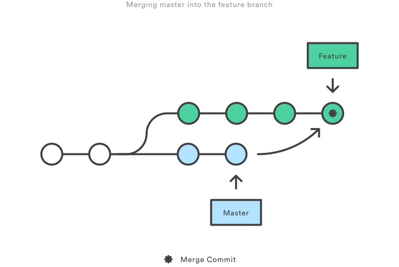

# Git

- [Git](#git)
    - [Setup](#setup)
        - [Generating Account](#generating-account)
        - [Configuration](#configuration)
    - [Commit Message](#commit-message)
        - [Commit Message Style Guide](#commit-message-style-guide)
        - [Tools](#tools)
    - [Undo Changes](#undo-changes)
    - [Workflow](#workflow)
        - [Centralized Workflow](#centralized-workflow)
        - [Feature Branching Workflow](#feature-branching-workflow)
        - [Gitflow](#gitflow)
        - [Forking flow](#forking-flow)
    - [Amend Last Commit](#amend-last-commit)
    - [Merging and Rebasing](#merging-and-rebasing)
        - [Interactive Rebasing](#interactive-rebasing)
        - [Abortion](#abortion)

## Setup

### Generating Account

Generete SSH keys

```bash
ssh-keygen -t rsa -C "penghuizhang@foxmail.com"
# then press enter three times.
```

Your identification file has been save in ~/.ssh/id_rsa
Your public key has been save in ~/.ssh/id_rsa.pub

Add public key to github ssh key settings so you can push code to corresponding remote repository.

```bash
# init local repository and push to remote repository
git init
get remote set-url origin git@github.com:user/repo/path/test.git

# clone remote repository
git clone git@github.com:repo/path/test.git
```

Git can use **SSH** or **HTTPS** protocol for accessing remote repository. **HTTPS** authentication requires user to provide user name and password. **SSH** authentication uses user's token automatically without user interaction.

### Configuration

There are three levels of configuration for git. System level configuration file is /etc/.gitconfig,
user level configuration file ~/.gitconfig, repository level configuration file .git/.config.

System level : git config --system
User level : git config --global

```bash
git config --global user.name "penghui.zhang"
git config --global user.email "penghui.zhang@foxmail.com"
git config --global core.editor vim
git config --global merge.tool vimdiff
```

Check current configuration.

```bash
git config --list
```

## Commit Message

### Commit Message Style Guide

Do not use `git commit -m` for commit message.

Commit message style.

```text
<type>(<scope>): <subject>
<BLANK LINE>
<body>
<BLANK LINE>
<footer>
```

Header (first line) includes type (required), scope (optional), a colon and subject (required).

1. `type` specifies commit type.
    1. `feat:` - feature
    1. `fix:` - bug
    1. `docs:` - documentation
    1. `style:` - style change without affecting functions
    1. `refactor:` - refactor without function change or bug fix
    1. `test:` - new test
    1. `chore:` - auxiliary changes
1. `scope` is used to specify a clearer range under commit type.
1. `subject` - describes about this commit neatly, usually less than 50 characters

Body is a detailed description on current commit. It should be written as clear as possible and should not have more than 72 characters on one line.

1. Should use first-person present tense like `change` instead of `changed` or `chagnes`.
1. Should descibe intention and behaviour difference.

Footer is normally empty and should be used two cases.

1. Breaking change.
    ```txt
    BREAKING CHANGE: isolate scope bindings definition has changed.

    To migrate the code follow the example below:

    Before:

    scope: {
      myAttr: 'attribute',
    }

    After:

    scope: {
      myAttr: '@',
    }

    The removed `inject` wasn't generaly useful for directives so there should be no code using it.
    ```
1. Close issues.
    ```txt
    Closes #123, #456, #789
    ```

Special case is revert commit must start with revert.

```txt
revert: feat(pencil): add 'graphiteWidth' option

This reverts commit 667ecc1654a317a13331b17617d973392f415f02.
```

### Tools

Automatically styled commit message.

```bash
# install
npm install -g commitizen

# activate tool
commitizen init cz-conventional-changelog --save --save-exact

# auto commit style with tool instead of git commit
git cz
```

[validate-commit-msg](https://github.com/conventional-changelog-archived-repos/validate-commit-msg) is used to check commit message style. It should be downloaded and placed inside package, then add it to git hooks for automatic style check.

```json
"config": {
    "ghooks": {
        "commit-msg": "./validate-commit-msg.js"
    }
}
```

Use conventional-changelog to generate change logs automatically.

```bash
npm install -g conventional-changelog
cd my-project
conventional-changelog -p angular -i CHANGELOG.md -w
```

Or config it as npm scripts.

```json
{
  "scripts": {
    "changelog": "conventional-changelog -p angular -i CHANGELOG.md -w -r 0"
  }
}
```

Reference

1. [gitemoji](https://github.com/carloscuesta/gitmoji/)
1. [Torvalds on commit message](https://github.com/torvalds/linux/pull/17#issuecomment-5659933)

## Undo Changes

Undo changes in single file `git checkout <file>`

Undo all changes `git checkout -- .`

## Workflow

Questions should be asked evaluating a workflow for a team.

1. Does this workflow scale with team size ?
1. Is it easy to undo mistakes and errors with this workflow.
1. Does it impose any extra unnecessary cognitive overhead to the team ?

### Centralized Workflow

In centralized workflow, there exists a repository as central repository. Everyone makes their own copy of central repository and works on their own copy. After work is done on local copy, push their changes to central repository.

1. Initialize central repository.
    ```bash
    ssh user@host
    git init --bare /path/to/repo.git
    ```
1. Makes your own copy.
    ```bash
    git clone ssh://user@host/path/to/repo.git
    ```
1. Commit your work locally.
    ```bash
    git status
    git add .
    git commit
    ```
1. Pull latest central repository. Use `--rebase` to move your commit to tip of master branch.
    ```bash
    git pull --rebase origin master
    ```
1. Resolve conflicts one by one. Use `git rebase --abort` to go back where you started resolving conflicts.
    ```bash
    git status
    git add <some-file> # edit <some-file>
    git rebase --continue # continue resolving conflicts
    ```
1. Push changes to central repository.
    ```bash
    git push origin master
    ```

### Feature Branching Workflow

Core idea is that every featured should be developed on single dedicated branch instead of master branch. This allows a feature to be developed without disturbing `master` branch. After feature is complete, a pull request from feature branch to master branch can be created to merge feature code into master branch. This ensures that master branch is always stable and it's easy to apply continuous integration on it.

1. Create a new branch dedicated for specific feature.
    ```bash
    git checkout -b new-feature
    ```
1. Develop and commit on local feature branch, maybe push it to central repository for to others to see.
    ```bash
    git push -u origin new-feature
    ```
1. Start a pull request to merge new-feature branch in central repository to master branch in central repository.
1. Somebody pulls latest master and new-feature branch in central repository. Merge new-feature branch to master branch, then push updated master branch to central repository.
    ```bash
    git checkout master
    git pull
    git pull origin new-feature
    git push
    ```

### Gitflow

Gitflow introduces develop branch dedicated for development.

1. master (permanant) - base branch.
1. dev (permanant) - development.
1. feature (temporary) - created from develop branch for certain feature, merged to develop branch when finished, then it's deleted
    ```bash
    git checkout -b some-feature develop
    git pull origin develop
    git checkout develop
    git merge some-feature
    git push
    git branch -d some-feature
    ```
1. release (temporary) - created from dev branch, after finished should be merged into master branch with tags, then it's deleted.
    ```bash
    git checkout -b release-0.1 develop
    git checkout master
    git merge release-0.1
    git push
    git checkout develop
    git merge release-0.1
    git push
    git branch -d release-0.1

    git tag -a 0.1 -m "Initial public release" master
    git push --tags
    ```
1. issue (temporary) - created from master for a bug fix.
    ```bash
    # create new branch.
    git checkout -b issue-#001 master

    # fix the bug and merge to master
    git checkout master
    git merge issue-#001
    git push

    # merge to dev and delete hotfix branch
    git checkout develop
    git merge issue-#001
    git push
    git branch -d issue-#001
    ```

There's extention tool for gitflow.

### Forking flow

1. Developers fork central repository before start developing.
1. Developers clone their forked repository.
    ```bash
    git clone https://user@bitbucket.org/user/repo.git
    ```
1. Set forked repository as origin of local repository. set central repository as upstream of local repository.
    ```bash
    # provide user and name if needed
    git remote add upstream https://user@bitbucket.org/maintainer/repo.git
    ```
1. Developers works on local repository normally.
    ```bash
    git checkout -b some-feature
    # Edit some code
    git commit -a -m "Add first draft of some feature"

    # pull from central repository
    git pull upstream master

    # push to forked repository
    git push origin feature-branch
    ```
1. Create a merge request for project maintainers to receive or reject.

Reference

1. [Git Workflow Tutorial](https://github.com/xirong/my-git/blob/master/git-workflow-tutorial.md#二git工作流指南)
1. [Git Workflow](https://www.atlassian.com/git/tutorials/comparing-workflows/gitflow-workflow)
1. [A successful Git branching model](http://nvie.com/posts/a-successful-git-branching-model/)

## Amend Last Commit

Change last commit's commit message.

```bash
git commit --amend -m 'new message'

// interactive way
git commit --amend
```

Append changes to last commit without changing its commit message.

```bash
# append new changes
git add .

# --no-edit indicates to apply changes directly
git commit --amend --no-edit
```

If you want to change earlier commits, `git --rebase -i` may help but use it only on private branch but not on public branches.

## Merging and Rebasing


Git merge replays changes from _source_ branch to _target_ branch, which defaults to current branch if not specified.

```bash
git merge source [target]

# in 2 steps
git checkout target
git merge source
```

Git merge is nice because it's non-destructive operation, existing branches are not changed. But an extraneous commit is generated everytime on _target_ branch to apply changes from _source_ branch. This would pollute commit history of _target_ branch.



Git rebase re-writes entire target history to make it appears like it begins with source branch. All changes in source branch are incorporated but no new commits are generated.

```bash
git rebase source target

# in 2 steps
git checkout target
git rebase source
```


### Interactive Rebasing

Use `-i` to start interactive rebasing.

```bash
git rebase -i source target
```

It opens an editor listing all commits to move.

```bash
pick 33d5b7a Message for commit #1
pick 9480b3d Message for commit #2
pick 5c67e61 Message for commit #3
```

Change `pick` to provided action keyword to manipulate specified commits. `fixup` squash commit to previous with its log message dropped.

```bash
pick 33d5b7a Message for commit #1
fixup 9480b3d Message for commit #2
pick 5c67e61 Message for commit #3

# p, pick = use commit
# r, reword = use commit, but edit the commit message
# e, edit = use commit, but stop for amending
# s, squash = use commit, but meld into previous commit
# f, fixup = like "squash", but discard this commit's log message
# x, exec = run command (the rest of the line) using shell
# d, drop = remove commit
```


Most important rule of `git rebase` is to use it only for private branch history manipulation instead of public branches. It changes commit history of public branch, which is now considered to be diverged from its remote counterpart. In this case you cannot push to remote branch unless you merge it back together. This is definitely unwanted.


Use `git push --force` with care to force pushing of local branch and overwrite its counterpart.

### Abortion

You can always use `git merge --abort` or `git rebase --abort` to undo changes if you get confused in current situation.

References

1. [Merging vs Rebasing](https://www.atlassian.com/git/tutorials/merging-vs-rebasing)