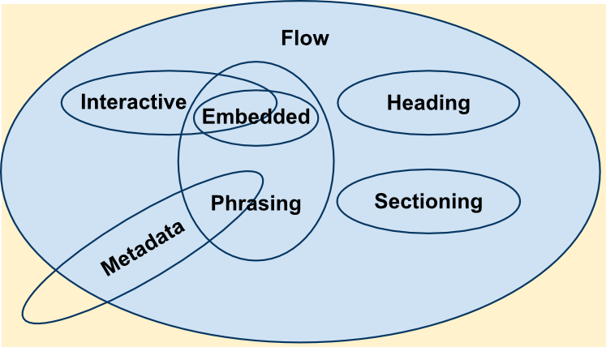

# HTML

- [HTML](#html)
    - [Doctype](#doctype)
    - [Basic](#basic)
    - [Link](#link)
    - [List](#list)
    - [Form](#form)
        - [Content-Type](#content-type)
        - [Validation](#validation)
        - [Styling](#styling)
        - [Responsive Design](#responsive-design)
        - [Reference](#reference)
    - [Tables](#tables)
    - [Audio](#audio)
    - [Video](#video)
    - [Canvas](#canvas)
    - [Storage](#storage)
        - [Web Storage](#web-storage)
        - [IndexedDB](#indexeddb)
    - [Web Worker](#web-worker)
    - [Service Worker](#service-worker)
    - [History](#history)
    - [Visibility API](#visibility-api)
    - [WebSocket](#websocket)
        - [Usage](#usage)
            - [Create a Websocket Object](#create-a-websocket-object)
            - [Send Message](#send-message)
            - [Receive Message](#receive-message)
    - [Ajax](#ajax)
    - [Progressive Web Application](#progressive-web-application)
    - [Accessible Rich Internet Applications (ARIA)](#accessible-rich-internet-applications-aria)
        - [Keyboard Navigation](#keyboard-navigation)

## Doctype

Rendering mode.

1. full standards mode - rendering behavior follows standard specification
1. almost standards mode - a very small number of quirks
1. quirks mode - layout emulates non-standard behavior for legacy support

`<!DOCTYPE html>` is used to ensure html page use full standard mode for rendering.

## Basic

HTML elements are usually either 'block-level' elements or 'inline-level' elements.

Block level elements

1. Always start on a new line and takes up the full width available
1. May contain inline elements and other block level elements

| Block   | Level    | Elements   |            |        |          |       |        |
| ------- | -------- | ---------- | ---------- | ------ | -------- | ----- | ------ |
| address | article  | aside      | blockquote | canvas | dd       | div   | dl     |
| dt      | fieldset | figcaption | figure     | footer | form     | h1~h6 | header |
| hgroup  | hr       | li         | main       | nav    | noscript | ol    | output |
| p       | pre      | section    | table      | tfoot  | ul       | video |        |

Inline elements

1. Inline elements don't force to start a new line.
1. It may contain only data and other inline elements.

| Inline | Elements |         |     |          |        |        |        |
| ------ | -------- | ------- | --- | -------- | ------ | ------ | ------ |
| a      | abbr     | acronym | b   | bdo      | big    | br     | button |
| cite   | code     | dfn     | em  | i        | img    | input  | kbd    |
| label  | map      | object  | q   | samp     | script | select | small  |
| span   | strong   |sub     | sup | textarea | time   | tt     | var    |

Block elements are inside a block box, inline elements are inside inline box. CSS `display` property can be used to change default behavior.

HTML5 replace this binary distinction with more complex content categories. Block level elements roughly corresponds to flow content, inline elements corresponds to phasing content.



Normal elements has opening tag and closing tag.

An empty element cannot have any child nodes (nested elements or text nodes). A closing tag on empty element is usually invalid.

```html
<input type='text'/>            // correct
<input type='text'></input>     // wrong
```

| Empty  | Elements |      |       |        |       |     |       |
| ------ | -------- | ---- | ----- | ------ | ----- | --- | ----- |
| area   | base     | br   | col   | embed  | hr    | img | input |
| keygen | link     | meta | param | source | track | wbr |       |

Single element attribute includes name, a equal sign and quoted string value. Adjacent attributes must be separated by space. Boolean attribute has a shorthand syntax with only attribute name.

```html
// These two forms are equal
<input type='text' disabled>
<input type='text' disabled='disabled'>

// These two forms are equal
<input type='text'>
<input type='text' disabled=''>
```

Element attribute value must be wrapped inside single quote or double quote.

Metadata

```html
<meta charset='utf-8'>
<meta name='author' content='Chris Mills'>
<meta name='description' content='The MDN Learning Area'>
```

[**O**pen **Gr**aph **P**rotocol](http://ogp.me/) defines more meta data to make web page a rich object in social path.

Icons

```html
<link rel="shortcut icon" href="favicon.ico" type="image/x-icon">
<!-- third-generation iPad with high-resolution Retina display: -->
<link rel="apple-touch-icon-precomposed" sizes="144x144" href="https://developer.cdn.mozilla.net/static/img/favicon144.a6e4162070f4.png">
<!-- iPhone with high-resolution Retina display: -->
<link rel="apple-touch-icon-precomposed" sizes="114x114" href="https://developer.cdn.mozilla.net/static/img/favicon114.0e9fabd44f85.png">
<!-- first- and second-generation iPad: -->
<link rel="apple-touch-icon-precomposed" sizes="72x72" href="https://developer.cdn.mozilla.net/static/img/favicon72.8ff9d87c82a0.png">
<!-- non-Retina iPhone, iPod Touch, and Android 2.1+ devices: -->
<link rel="apple-touch-icon-precomposed" href="https://developer.cdn.mozilla.net/static/img/favicon57.a2490b9a2d76.png">
<!-- basic favicon -->
<link rel="shortcut icon" href="https://developer.cdn.mozilla.net/static/img/favicon32.e02854fdcf73.png">
```

## Link

Browser will display value of title attributes as a tooltip when `<a></a>` is hovered.

```html
<p>I'm creating a link to
<a href="https://www.mozilla.org/en-US/"
   title="The best place to find more information about Mozilla's
          mission and how to contribute">the Mozilla homepage</a>.
</p>
```

Use download attribute to specify a save as name for download link

```html
<a href="https://download.mozilla.org/?product=firefox-39.0-SSL&os=win&lang=en-US"
   download="firefox-39-installer.exe">
  Download Firefox 39 for Windows
</a>
```

Mailto link, mail information can be encoded inside url with query string.

```html
<a href="mailto:nowhere@mozilla.org?cc=name2@rapidtables.com&bcc=name3@rapidtables.com&amp;subject=The%20subject%20of%20the%20email &amp;body=The%20body%20of%20the%20email">
  Send mail with cc, bcc, subject and body
</a>
```

## List

1. **U**nordered **L**ist
1. **O**rdered **L**ist
1. **D**escription **L**ist, **D**esciprtion **T**erm, **D**escription **D**eifinition

Order list and unordered list can be nested.

```html
<dl>
  <dt>soliloquy</dt>
  <dd>In drama, where a character speaks to themselves, representing their inner thoughts or feelings and in the process relaying them to the audience (but not to other characters.)</dd>
  <dt>monologue</dt>
  <dd>In drama, where a character speaks their thoughts out loud to share them with the audience and any other characters present.</dd>
  <dt>aside</dt>
  <dd>In drama, where a character shares a comment only with the audience for humorous or dramatic effect. This is usually a feeling, thought or piece of additional background information.</dd>
</dl>
```

## Form

```html
<form action='/my-handling-for-page' method='post'>
    <div>
        <label for='name'>Name:</label>
        <input type='text' id='name' name='user_name'>
    </div>
    <div>
        <label for='main'>E-mail:</label>
        <input type='mail' id='mail' name='user_mail'>
    </div>
    <div>
        <label for='msg'>Message:</label>
        <textarea id='msg' name='user_message'></textarea>
    </div>

    <div class='button'>
        <button type='submit'>Send your message</button>
    </div>
</form>
```

1. `<input>` is an empty element, meaning it doesn't need a closing tag. `<textarea></textarea>` is not an empty element, so it must be closed with proper ending tag. Default value of `input` is set by `value` attribute, default value of `textarea` is set by contents.
1. `button` has three type 'submit', 'reset', 'button'. `<input type='submit'>` can also create a button, but its label can only be set as plain text with value attribute. `<button>` allows full html content as label.
1. `name` attribute of `input` and `textarea` associate submitted data with a name value.
1. `for` attribute of `label` connects label with element with corresponding id, when user clicks on label, corresponding element will be activated automatically.
1. `type` of `input` is for data validation.

### Content-Type

A `POST` request is usually sent via HTML form. `Content-Type` value is determined by `enctype` attribute of `<form>` element or `formenctype` attribute of the `<input>` or `<button>` elements. `enctype` attribute of `<form>` element will be overriden by `formenctype` attribute of `<input>` or `<button>` element. Three options are available.

1. `application/x-www-form-urlencoded`: _default_ value if attribute is not specified. Transmitted data are encoded in multiple key/value pairs. Non-alphanumeric characters are percent encoded, so this type is not suitable to transmit binary data.
    ```http
    Content-Type: application/x-www-form-urlencoded

    key1=value1&key2=value2&
    ```
1. `multipart/form-data`: used when `<input>` element with `type` attribute as `file`, suitable for transmitting files, non ASCII data and binary data.
    ```http
     Content-Type: multipart/form-data; boundary=AaB03x

   --AaB03x
   Content-Disposition: form-data; name="submit-name"

   Larry
   --AaB03x
   Content-Disposition: form-data; name="files"
   Content-Type: multipart/mixed; boundary=BbC04y

   --BbC04y
   Content-Disposition: file; filename="file1.txt"
   Content-Type: text/plain

   ... contents of file1.txt ...
   --BbC04y
   Content-Disposition: file; filename="file2.gif"
   Content-Type: image/gif
   Content-Transfer-Encoding: binary

   ...contents of file2.gif...
   --BbC04y--
   --AaB03x--
    ```
1. `text/plain`: introduced by HTML5 for debugging, never use it in production because it's not reliably interpretable by computer.

When `POST` request is sent via a method other than HTML form like an `XMLHttpRequest`, content of body can be any MIME type.

### Validation

### Styling

### Responsive Design

### Reference

1. [WHATWG Form Control Types Specification]( https://www.w3.org/TR/html401/interact/forms.html#h-17.2.1)

## Tables

## Audio

## Video

## Canvas

## Storage

### [Web Storage](https://html.spec.whatwg.org/multipage/webstorage.html)

Web storage API provides a much more intuitive mechanism for storing key/value pairs, both key and values are string. It extends `window` object with `localStorage` and `sessionStorage` property.

- `sessionStorage` maintains a separate storage area for each given origin that's available for the duration of the page session (as long as the browser is open, including page reloads and restores). `sessionStorage` spans over multiple windows on same session for single origin.
- `localStorage` does the same thing, but persists even when the browser is closed and reopened. `localStorage` spans over multiple windows and multiple sessions for single origin.

```javascript
[Exposed=Window]
interface Storage {
  readonly attribute unsigned long length;
  DOMString? key(unsigned long index);
  getter DOMString? getItem(DOMString key);
  setter void setItem(DOMString key, DOMString value);
  deleter void removeItem(DOMString key);
  void clear();
};
```

`storage` event is fired when a storage area is changed (e.g. a new item is inserted).

`windowObj.onstorage = function () {}`

> It should be noted that data stored in either sessionStorage or localStorage is specific to the protocol of the page.

There exist a size limit for web storage, 5M often.

> User agents should limit the total amount of space allowed for storage areas, because hostile authors could otherwise use this feature to exhaust the user's available disk space.

### [IndexedDB](https://w3c.github.io/IndexedDB/)

IndexedDB is a low-level API for client-side storage of significant amounts of structed data, including files/blobs.

## Web Worker

## [Service Worker]( https://developer.mozilla.org/en-US/docs/Web/API/Service_Worker_API/Using_Service_Workers)

## History

## [Visibility API](https://www.w3.org/TR/page-visibility/)

Page Visibility API provides a way of detecting visibility state of page and perform some actions accordingly.

1. `document.hidden` is `true` if page is hidden to user, `false` otherwise.
1. `document.visibilityState` is a string of four possible values, `visible`, `hidden`, `prerender`, `unloaded`.

`visibilitychange` event will be fired when visibility changes, use `document.onvisibilitychange` to add event handlers.

## WebSocket

### Usage

1. `binaryType` - 'blob' for `Blob` or 'arraybuffer' for `ArrayBuffer`.
1. `bufferedAmount`
1. `extensions`
1. `onclose`
1. `onerror`
1. `onmessage`
1. `onopen`
1. `protocol`
1. `readyState`
1. `url`

#### Create a Websocket Object

```javascript
WebSocket WebSocket(in DOMString url, in optional DOMString protocols)
```

- `url` - URL to connect, Websocket object will attempt to connect target on creation.
- `protocols` - Either a single protocol string or an array of protocol strings used to indicate sub-protocols.
- `SECURITY_ERR` - Throws exception when connection to target port is blocked.

When connection error happens, first an `error` event is sent (handled by `onerror`), then a `CloseEvent` is sent (handled by `onclose`).

#### Send Message

```javascript
void send(
  in USVString data
);

void send(
  in Blob data
);

void send(
  in ArrayBufferView data
);

void send(
  in ArrayBuffer data
);

exampleSocket.send("Here's some text that the server is urgently awaiting!")
```

Send data as string, `Blob` or `ArrayBuffer`.

#### Receive Message

```javascript
exampleSocket.onmessage = function(event) {
    if (typeof event.data === 'string') {
        // string data
    }

    if (event.data instanceof Blob) {
        // Blob binary data
    }

    if (event.data instanceof ArrayBuffer) {
        // ArrayBuffer binary data
    }
}

exmapleSocket.onerror = (error) => {

}

exampleSocket.onclose = ()
```

## Ajax

## Progressive Web Application

## Accessible Rich Internet Applications (ARIA)

> The information assistive technologies need about the meaning and purpose of user interface elements is called accessibility semantics.

1. A role is a promise.
1. ARIA can both cloak and enhance, creating both power and danger.

### Keyboard Navigation

ARIA requires html element to be navigable with keyboard, when an element is navigated currently, it's focused (receives focus).

1. **tabbable** element can be navigated sequentially in normal order with `Tab` key, use `Shift+Tab` key to navigate sequentially in reverse order.
1. For composite element like radio button group, all radio buttons in it is **focusable**, but only one radio button is **tabbable**. If composite element receives focus when navigated with `Tab` and `Shift+Tab` key, the only **tabbable** element is focused automatically. Other **non-tabbable** but **focusable** elements can be navigated with arrows keys.

Global attribute `tab-index` indicates how an element receives and loses focus with keyboard navigation.

1. Negative value (`tabindex="-1"` by _default_) means an element is **focusable** but not **tabbable**.
1. `tab-index="0"` means an element is tabbable.
1. Positive value means element should be navigated in sequential order by its value. Maximum value is `32767`.

Tabbable elements with positive integer value are navigated in ascending order firstly, then elements with `tab-index="0"` or invalid value are navigated by its order in document source. Elements with negative integer value for `tab-index` cannot be navigated by keyboard.

Reference

1. [ARIA Specification](https://www.w3.org/TR/2017/NOTE-wai-aria-practices-1.1-20171214/)
1. [no-static-element-interactions](https://github.com/evcohen/eslint-plugin-jsx-a11y/blob/master/docs/rules/no-static-element-interactions.md)
1. [interactive-supports-focus](https://github.com/evcohen/eslint-plugin-jsx-a11y/blob/master/docs/rules/interactive-supports-focus.md)
1. [Fundamental Keyboard Navigation](https://www.w3.org/TR/2017/NOTE-wai-aria-practices-1.1-20171214/#kbd_generalnav)
1. [WHATWG tab-index attribute](https://html.spec.whatwg.org/multipage/interaction.html#attr-tabindex)
1. [MDN Keyboard and Focus](https://developer.mozilla.org/en-US/docs/Web/Accessibility/ARIA/ARIA_Techniques/Using_the_button_role#Keyboard_and_focus)
