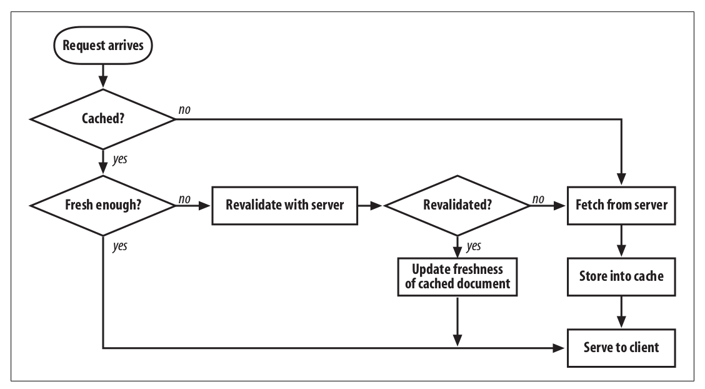

# HTTP

## **U**niform **R**esrouce **I**dentifier

**Uniform Resource Identifier (URI)** is a string of characters used to identify a resource. Most commonly used form of URI is [**Uniform Resrouce Locator (URL)**](https://url.spec.whatwg.org/#example-url-parsing), which identifies a resource by its address on the web, URL is informally referred as _web address_. **Uniform Resrouce Name** is a type of URI that identifies resource by name in particular namespace without implying its location or how to access it.

### Syntax

```html
<scheme>://<user>:<password>@<host>:<port>/<path>;<params>?<query>#<frag>
```

<table>
    <tr>
        <td>URL Components</td>
        <td>Explaination</td>
        <td>Default Value</td>
    </tr>
    <tr>
        <td>scheme</td>
        <td>Case-insensitive. Usually corresponding to a protocol, but not necessary, <em>file</em> corresponds to none. Begins with a letter, followed by a combination of letters, digits, plus(+), period(.) or hyphen(-).</td>
        <td>None</td>
    </tr>
    <tr>
        <td>//</td>
        <td>require by some schemes and not required by some others</td>
        <td>-</td>
    </tr>
    <tr>
        <td>user</td>
        <td rowspan='2'>User and password are separated by ":", followed by an at symbol (@)</td>
        <td>anonymous</td>
    </tr>
    <tr>
        <td>password</td>
        <td>implementation defined</td>
    </tr>
    <tr>
        <td>host</td>
        <td>A hostname or dotted ipv4, ipv6 address in brackets ([ ])</td>
        <td>None</td>
    </tr>
    <tr>
        <td>port</td>
        <td>Many schemes have default port number, 80 for HTTP</td>
        <td>Scheme-specific</td>
    </tr>
    <tr>
        <td>path</td>
        <td rowspan='2'>
            <p>
            Separated from preceding components by a slash(/), consisted of multiple path segments separated by slash (/). Each path segment can may have its own param. Param is a list of key-value pairs separated from preceding part by semicolor(;)
            </p>
            <code>http://www.joes-hardware.com/hammers;sale=false/index.html;graphics=true</code>
        </td>
        <td>None</td>
    </tr>
    <tr>
        <td>params</td>
        <td>None</td>
    </tr>
    <tr>
        <td>query</td>
        <td>A group of key value pairs <code>key=value</code> separated by delimeter separated from preceding part by question mark (?). '&' is the most common delimeter, ';' also used in some rare case.</td>
        <td>None</td>
    </tr>
    <tr>
        <td>fragment</td>
        <td>A name for part of the resource, not sent to server, used only on client-side, separated from preceding part by hash (#). Fragment is usually an <code>id</code> attribute of specific element, and web broswers will scoll that element into view.</td>
        <td>None</td>
    </tr>
</table>

### Absolute and Relative URLs

URLs are divided into _absolute_ and _relative_ ones. _Absolute_ URL is complete and contains all information needed to locate a resource. _Relative_ URL is imcomplete and must be interpreted relative to a **base** URL to locate a resource.

Relative URL example below is interpreted as `http://www.joes-hardware.com/hammers.html`.

```html
<!--
Document(base): http://www.joes-hardware.com/tools.html
Relative URL Below
-->
<a href="./hammers.html">
```

Base URL can be specified implicitly or explicitly.

1. Explicit Base URL - Use `<base>` tag `href` attribute to specify explicitly.
    ```html
    <base target="_blank" href="http://www.example.com/page.html">
    ```
1. Implicit Base URL - Use URL of current document or resource as base URL.


Most browsers will try to expand URL into complete ones when users are typing or submitting URL. Two types of expandomatic URL are used usually.

1. Hostname expansion - User can type hostname `yahoo` only, browsers expand it into `www.yahoo.com`.
1. History expansion. When users are typing `http://www.youtube`, history URLs are used to expand it completely `http://www.youtube.com`.

Reference

1. [WHATWG URL API](https://url.spec.whatwg.org/)
1. [Node URL](https://nodejs.org/api/url.html#url_the_whatwg_url_api)
- [HTTP](#http)
    - [**U**niform **R**esrouce **I**dentifier](#uniform-resrouce-identifier)
        - [Syntax](#syntax)
        - [Absolute and Relative URLs](#absolute-and-relative-urls)
        - [[Percent Encoding (URL Encoding)](https://en.wikipedia.org/wiki/Percent-encoding)](#percent-encoding-url-encodinghttpsenwikipediaorgwikipercent-encoding)
    - [Cookie](#cookie)
    - [Status Code](#status-code)
    - [Cache (TODO)](#cache-todo)
        - [Cache Processing (TODO)](#cache-processing-todo)
        - [Cache Topologies (TODO)](#cache-topologies-todo)
        - [Cache Control (TODO)](#cache-control-todo)
        - [Algorithm (TODO)](#algorithm-todo)
        - [Cache and Advertising (TODO)](#cache-and-advertising-todo)

### [Percent Encoding (URL Encoding)](https://en.wikipedia.org/wiki/Percent-encoding)

URLs are designed to be portable, so that only a subset of most commonly used characters in ASCII can be used in URL directly. Other characters (special character, nonprintable character, 8 bit character) in URL must be represented with _escape sequence_ to avoid confusion. An _escape sequence_ is a percent sign (%) followed by two hexdecimal digits that represents the ASCII code of the encoded character.

Reserved and Restricted characters.

| Character | Reservation/Restriction |
|- |-|
| % | Reserved as escape token for encoded characters |
| / | Reserved for delimiting splitting up path segments in path component|
| . | Reserved in path component |
| .. | Reserved in path component |
| # | Reserved as fragment delimiter|
| ? | Reserved as query-string delimeter |
| ; | Reserved as params delimeter |
| : | Reserved to delimit scheme, user/password and host/port components|
| $ + | Reserved |
| @ & = | Reserved because they've special meaning in the context of some schemes |
| { } \| \ ^ ~ [ ] ' | Restricted because of unsafe handling by various transport agents, such as gateways |
| <>" | Unsafe; should be encoded because these characters often have meaning outside the scope of the URL, such as delimiting the URL itself in a document|
| 0x00-0x1F, 0x7F | Restricted; characters within these hex ranges are nonprintable |
| >0x7F | Restricted; characters not representable with 7 bit ASCII|

When all unsafe characters are escaped, URL is in a _canonical form_ that can be shared between application without worrying other applications being confused by any characters with special meanings.

On the other hand, safe characters should not be escaped. Attackers could use this to cause pattern matching on URLs by some applications to fail.

## Cookie

[Simple cookie framework](https://developer.mozilla.org/en-US/docs/Web/API/Document/cookie/Simple_document.cookie_framework)

1. [HTTP Cookie](https://en.wikipedia.org/wiki/HTTP_cookie#Session_cookie)

## Status Code

## Cache

Caches are copies of visited resrouce stored on local machine or proxy server. It's used to save users from requesting same resource from server again.

1. Prevent redundant resource request, reduce transport load, improve bandwidth bottleneck.
1. Balance traffic spike by flash crowds using mutliple cache servers.
1. Reduce distance delays by setting up multiple cache servers around the globe.

Cache Hit & Miss

1. Cache hit - A request arrives at a cache, and resource is severed with cache.
1. Cache miss - A request arrives at a cache, but cache is not fresh and resource is served by server.

Cache Revalidate

1. Revalidate hit - A request arrives at a cache, but not sure if cache is fresh, cache is confirmed by server to be fresh and resource is served with cache. A http reponse of status code **304(Not Modified)** will be sent back and cache freshness is updated.
1. Revalidate miss - A request arrives at a cache, but not sure if cache is fresh, cache is confirmed by server to be unfresh and resource is served by server. A http reponse of status code **200(Ok)** with full content of resource is sent back and cache is updated.
1. Resource deleted - A response of status code **404(Not Found)** is sent back and cache should be deleted.

> The fraction of requests that are served from cache is called the cache hit rate (or cache hit ratio), or sometimes the document hit rate (or document hit ratio).

> The byte hit rate represents the fraction of all bytes transferred that were served from cache.

### Cache Lifecycle

#### Cache or Not Cache

`Cache-Control` header is used by server to specify directives for caching mechanisms used for resource. `Cache-Control` can have a list of comma separated values.

<table>
    <tr>
        <th>Header</th>
        <th>Explaination</th>
        <th>Request/Response</th>
    </tr>
    <tr>
        <td><code>Cache-Control: public</code></td>
        <td>Resource in response may be cached by client or proxy server</td>
        <td>Response</td>
    </tr>
    <tr>
        <td><code>Cache-Control: private</code></td>
        <td>Resource in response may be cached by client but not by proxy server</td>
        <td>Reponse</td>
    </tr>
    <tr>
        <td><code>Cache-Control: no-store</code></td>
        <td>Request and response are not allowed to be stored as cache, any existing ones should be delted. This header must be forwared by intermediary servers.</td>
        <td>Both</td>
    </tr>
    <tr>
        <td><code>Cache-Control: no-cache</code></td>
        <td>Request or response may be cached, but cache is always considered as expired and should request server for revalidation before serving cache. When request arrives at a proxy server, it must forward the header and revalidate the cache on behalf of client, otherwise an expired cache in intermediary server may be served inappropriately. Meaningfully equivalent to <code>Cache-Control: max-age=0, must-revalidate</code></td>
        <td>Both</td>
    </tr>
    <tr>
        <td><code>Pragma: no-cache</code></td>
        <td>Same as above, included in HTTP/1.1 for backward compatibility.</td>
        <td>Both</td>
    </tr>
    <tr>
        <td><code>Cache-Control: only-if-cached</code></td>
        <td>Indicates that client only wishs to obtain a cached resource and should not contact origin-server and retrieve new data.</td>
        <td>Request</td>
    </tr>
</table>

#### Creation & Expiration

An expiration mechanism must be specified explicitly or implicitly for cache to prevent it from being fresh forever.

##### Explicit Expiration

Specifies that cache is fresh before an absolute date or during a relative period of time.

<table>
    <tr>
        <th>Header</th>
        <th>Explaination</th>
        <th>Request/Response</th>
    </tr>
    <tr>
        <td><code>Cache-Control: max-age=&lt;seconds&gt;</code></td>
        <td>Specifies maximum seconds a resource is considered fresh. Specify seconds as 0 to indicate that a cache should not be created or should be refreshed on every access by setting maximum age to zero.</td>
        <td>Both</td>
    </tr>
    <tr>
        <td><code>Cache-Control: s-maxage=&lt;seconds&gt;</code></td>
        <td>Same as above, but only applies to public caches and ignored by a private cache.</td>
        <td>Response</td>
    </tr>
    <tr>
        <td><code>Expires: &lt;http-date&gt;</code></td>
        <td>Specifies resource expiration date. Invalid date means that resource is already expired. It requires client and server clocks to be synchronized to work correctly. Ignored if <code>Cache-Control: max-age</code> or <code>Cache-Control: s-maxage</code> exist.</td>
        <td>Response</td>
    </tr>
</table>

##### Heuristic Expiration (TODO)

When reponse contains no `Cache-Control: max-age` or `Expires` header, a heuristic expiration strategy is used.

##### Stale Cache

Client might tighten cache expiration constraint for applications that need the very freshest resource. On the other hand, client might loosen cache expiration date as comproimse to improve performance. When a cache is expired, client have the option to contact server to revalidate cache freshness.

<table>
    <tr>
        <th>Header</th>
        <th>Explaination</th>
        <th>Request/Response</th>
    </tr>
    <tr>
        <td>
            <code>Cache-Control: min-fresh=&lt;seconds&gt;</code>
        </td>
        <td>Specifies that client wants a cache that will still be fresh for at least specified number of seconds.</td>
        <td>Request</td>
    </tr>
    <tr>
        <td>
            <code>Cache-Control: max-stale[=&lt;seconds&gt;]</code>
        </td>
        <td>Specifies that client is willing to accept a stale cache. When a number is provided, it indicates that a stale cache is acceptable if it's been expired for specified number of seconds at maximum.</td>
        <td>Request</td>
    </tr>
</table>

#### Cache Revalidation

<table>
    <caption><strong>Last-Modified Date Revalidation</strong></caption>
    <tr>
        <th>Header</th>
        <th>Explaintion</th>
        <th>Request/Response</th>
    </tr>
    <tr>
        <td>
            <code>Cache-Control: must-revalidate</code>
        </td>
        <td>A stale cache is not acceptable and must pass revalidation before being served.</td>
        <td>Response</td>
    </tr>
    <tr>
        <td>
            <code>Cache-Control: proxy-revalidate</code>
        </td>
        <td>Same as above, only applies to public caches, ignored by private cache.</td>
        <td>Response</td>
    </tr>
    <tr>
        <td>
            <code>Last-Modified: &lt;date&gt;</code>
        </td>
        <td></td>
        <td>Response</td>
    </tr>
    <tr>
        <td>
            <code>If-modified-since: &lt;date&gt;</code>
        </td>
        <td>If resource is modified since specified date, modified version of resource will be sent back from server and cache content and expiration date should be updated. Otherwise, a 304 Not Modified reponse message without body is returned, only headers that need updating like expiration date are needed to be sent back.</td>
        <td>Request</td>
    </tr>
    <tr>
        <td>
            <code>If-Unmodified-since: &lt;date&gt;</code>
        </td>
        <td></td>
        <td>Request</td>
    </tr>
    <tr>
        <td>
            <code>Cache-Control: immutable</code>
        </td>
        <td>Indicates that a resource on serve will not change before a cache expires and therefore the client should not send a condiational revalidation even when users refreshes the page. <a href="https://bitsup.blogspot.jp/2016/05/cache-control-immutable.html">See this blog</a></td>
        <td>Response</td>
    </tr>
</table>

There're cases where last-modified date revalidation isn't adequate.

1. Some documents may be rewritten periodically but contains same data.
1. Some documents may have minor content change that isn't important enough to enforce a cache update.
1. Some servers cannot determine last modification date accurately.
1. For documents that may change within a second, its content changes but last modification date remains the same.

So content validation by a _entity tags_(ETags) is used.

<table>
    <caption><strong>Resource Content Revalidation</strong></caption>
    <tr>
        <th>Header</th>
        <th>Explaintion</th>
        <th>Request/Response</th>
    </tr>
    <tr>
        <td>
            <code>ETag: [W/]&lt;tags&gt;</code>
        </td>
        <td>'W' or 'w' means that this tag is a weak validator that remains the same when resource has minor content change. Strong validators are same when resource remains exactly same.</td>
        <td></td>
    </tr>
    <tr>
        <td>
            <code>If-Match: &lt;tag&gt;</code>
        </td>
        <td>
            <ul>
                <li>
                <strong>GET</strong> or <strong>HEAD</strong> method,
                used in combination with <strong>Range</strong> header to ensure range request responded by same resource. If it doesn't match, a 416 (Range Not Satisfiable) reponse is returned.
                </li>
                <li>
                <strong>PUT</strong> method,
                '*' is used to ensure resource not existed when uploading a file.
                </li>
            </ul>
        </td>
        <td>Request</td>
    </tr>
    <tr>
        <td>
            <code>If-None-Match: &lt;tags&gt;</code>
        </td>
        <td>
            <ul>
                <li>
                <strong>GET</strong> or <strong>HEAD</strong> method,
                If no tag matches specified tags, new resource will be sent back from server and caches should be updated.
                </li>
                <li>
                <strong>PUT</strong> method,
                '*' is used to ensure resource not existed when uploading a file.
                </li>
            </ul>
        </td>
        <td>Request</td>
    </tr>
</table>

1. [If-None-Match](https://developer.mozilla.org/en-US/docs/Web/HTTP/Headers/If-None-Match)
1. [Lost Update Problem](https://developer.mozilla.org/en-US/docs/Web/HTTP/Headers/If-None-Match) (TODOS)

Used by request
Cache-Control: no-transform

Reponse
Cache-Control: no-transform


### Cache Processing (TODO)



### Cache Topologies (TODO)

### Algorithm (TODO)

### Cache and Advertising (TODO)