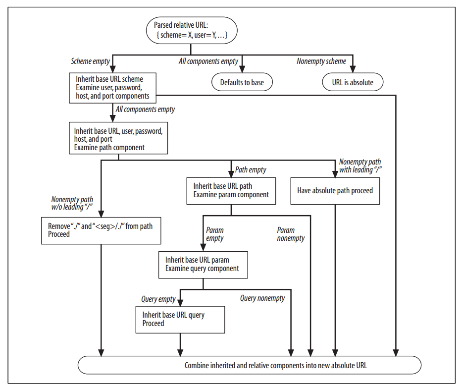

# HTTP

## **U**niform **R**esrouce **I**dentifier

**Uniform Resource Identifier (URI)** is a string of characters used to identify a resource. Most commonly used form of URI is [**Uniform Resrouce Locator (URL)**](https://url.spec.whatwg.org/#example-url-parsing), which identifies a resource by its address on the web, URL is informally referred as _web address_. **Uniform Resrouce Name** is a type of URI that identifies resource by name in particular namespace without implying its location or how to access it.

### Syntax

```html
<scheme>://<user>:<password>@<host>:<port>/<path>;<params>?<query>#<frag>
```

<table>
    <tr>
        <td>URL Components</td>
        <td>Explaination</td>
        <td>Default Value</td>
    </tr>
    <tr>
        <td>scheme</td>
        <td>Case-insensitive. Usually corresponding to a protocol, but not necessary, <em>file</em> corresponds to none. Begins with a letter, followed by a combination of letters, digits, plus(+), period(.) or hyphen(-).</td>
        <td>None</td>
    </tr>
    <tr>
        <td>//</td>
        <td>require by some schemes and not required by some others</td>
        <td>-</td>
    </tr>
    <tr>
        <td>user</td>
        <td rowspan='2'>User and password are separated by ":", followed by an at symbol (@)</td>
        <td>anonymous</td>
    </tr>
    <tr>
        <td>password</td>
        <td>implementation defined</td>
    </tr>
    <tr>
        <td>host</td>
        <td>A hostname or dotted ipv4, ipv6 address in brackets ([ ])</td>
        <td>None</td>
    </tr>
    <tr>
        <td>port</td>
        <td>Many schemes have default port number, 80 for HTTP</td>
        <td>Scheme-specific</td>
    </tr>
    <tr>
        <td>path</td>
        <td rowspan='2'>
            <p>
            Separated from preceding components by a slash(/), consisted of multiple path segments separated by slash (/). Each path segment can may have its own param. Param is a list of key-value pairs separated from preceding part by semicolor(;)
            </p>
            <code>http://www.joes-hardware.com/hammers;sale=false/index.html;graphics=true</code>
        </td>
        <td>None</td>
    </tr>
    <tr>
        <td>params</td>
        <td>None</td>
    </tr>
    <tr>
        <td>query</td>
        <td>A group of key value pairs <code>key=value</code> separated by delimeter separated from preceding part by question mark (?). '&' is the most common delimeter, ';' also used in some rare case.</td>
        <td>None</td>
    </tr>
    <tr>
        <td>fragment</td>
        <td>A name for part of the resource, not sent to server, used only on client-side, separated from preceding part by hash (#). Fragment is usually an <code>id</code> attribute of specific element, and web broswers will scoll that element into view.</td>
        <td>None</td>
    </tr>
</table>

### Absolute and Relative URLs

URLs are divided into _absolute_ and _relative_ ones. _Absolute_ URL is complete and contains all information needed to locate a resource. _Relative_ URL is imcomplete and must be interpreted relative to a **base** URL to locate a resource.

Relative URL example below is interpreted as `http://www.joes-hardware.com/hammers.html`.

```html
<!--
Document(base): http://www.joes-hardware.com/tools.html
Relative URL Below
-->
<a href="./hammers.html">
```

Base URL can be specified implicitly or explicitly.

1. Explicit Base URL - Use `<base>` tag `href` attribute to specify explicitly.
    ```html
    <base target="_blank" href="http://www.example.com/page.html">
    ```
1. Implicit Base URL - Use URL of current document or resource as base URL.



Most browsers will try to expand URL into complete ones when users are typing or submitting URL. Two types of expandomatic URL are used usually.

1. Hostname expansion - User can type hostname `yahoo` only, browsers expand it into `www.yahoo.com`.
1. History expansion. When users are typing `http://www.youtube`, history URLs are used to expand it completely `http://www.youtube.com`.

Reference

1. [WHATWG URL API](https://url.spec.whatwg.org/)
1. [Node URL](https://nodejs.org/api/url.html#url_the_whatwg_url_api)
1. HTTP The Definitive Guide

### URL Encoding ([Percent Encoding](https://en.wikipedia.org/wiki/Percent-encoding))

URLs are designed to be portable, so that only a subset of most commonly used characters in ASCII can be used in URL directly. Other characters (special character, nonprintable character, 8 bit character) in URL must be represented with _escape sequence_ to avoid confusion. An _escape sequence_ is a percent sign (%) followed by two hexdecimal digits that represents the ASCII code of the encoded character.

Reserved and Restricted characters.

| Character | Reservation/Restriction |
|- |-|
| % | Reserved as escape token for encoded characters |
| / | Reserved for delimiting splitting up path segments in path component|
| . | Reserved in path component |
| .. | Reserved in path component |
| # | Reserved as fragment delimiter|
| ? | Reserved as query-string delimeter |
| ; | Reserved as params delimeter |
| : | Reserved to delimit scheme, user/password and host/port components|
| $ + | Reserved |
| @ & = | Reserved because they've special meaning in the context of some schemes |
| { } \| \ ^ ~ [ ] ' | Restricted because of unsafe handling by various transport agents, such as gateways |
| <>" | Unsafe; should be encoded because these characters often have meaning outside the scope of the URL, such as delimiting the URL itself in a document|
| 0x00-0x1F, 0x7F | Restricted; characters within these hex ranges are nonprintable |
| >0x7F | Restricted; characters not representable with 7 bit ASCII|

When all unsafe characters are escaped, URL is in a _canonical form_ that can be shared between application without worrying other applications being confused by any characters with special meanings.

On the other hand, safe characters should not be escaped. Attackers could use this to cause pattern matching on URLs by some applications to fail.

## Cookie

[Simple cookie framework](https://developer.mozilla.org/en-US/docs/Web/API/Document/cookie/Simple_document.cookie_framework)

1. [HTTP Cookie](https://en.wikipedia.org/wiki/HTTP_cookie#Session_cookie)

## Status Code

## Cache
