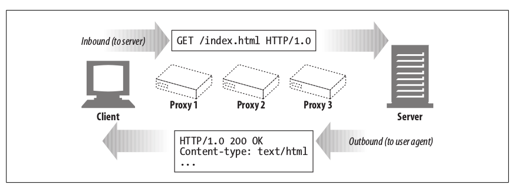
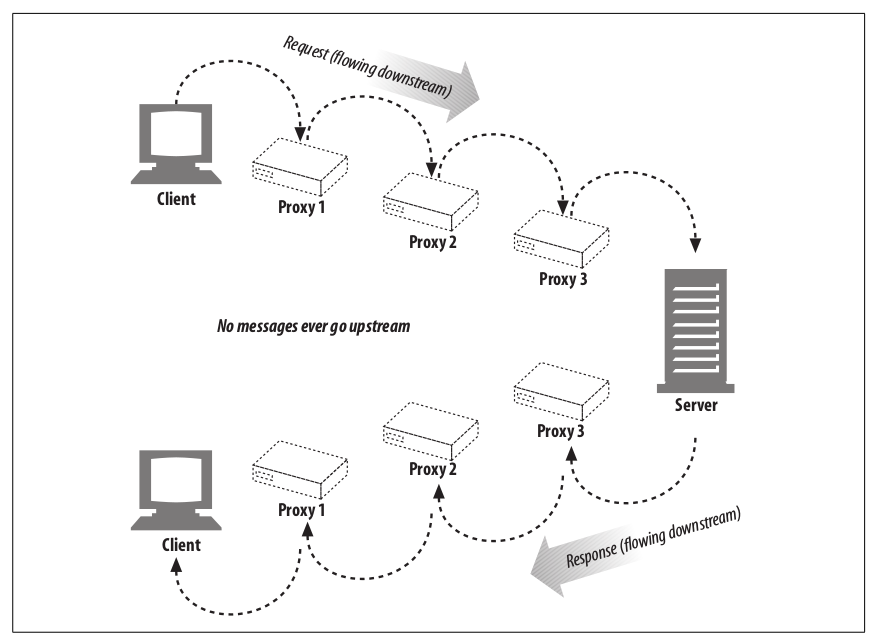
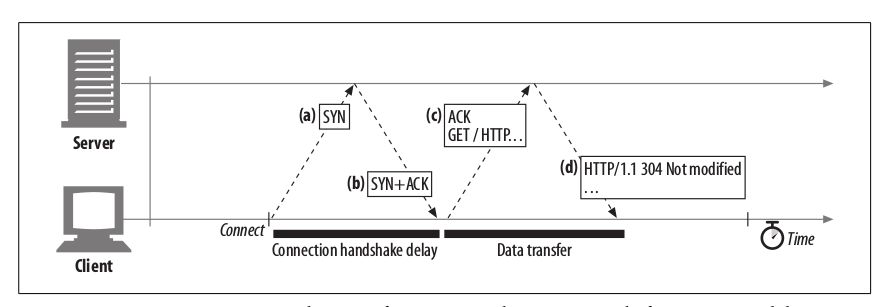
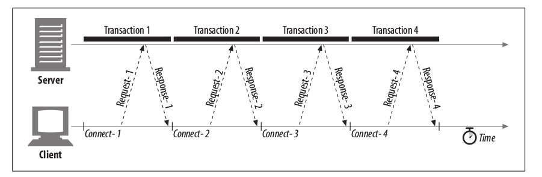

# HTTP

- [HTTP](#http)
    - [**U**niform **R**esrouce **I**dentifier](#uniform-resrouce-identifier)
        - [Syntax](#syntax)
        - [Absolute and Relative URLs](#absolute-and-relative-urls)
        - [Percent Encoding (URL Encoding)](#percent-encoding-url-encoding)
    - [HTTP Message](#http-message)
        - [Terminology](#terminology)
        - [Message Syntax](#message-syntax)
        - [HTTP Methods](#http-methods)
            - [GET](#get)
            - [HEAD](#head)
            - [PUT](#put)
            - [DELETE](#delete)
            - [POST](#post)
            - [TRACE](#trace)
            - [OPTIONS](#options)
            - [CONNECT](#connect)
            - [Extension Methods](#extension-methods)
        - [Headers](#headers)
            - [General Headers](#general-headers)
            - [Request Headers](#request-headers)
            - [Response Headers](#response-headers)
            - [Entity Headers](#entity-headers)
            - [Extension Headers](#extension-headers)
        - [Status Code](#status-code)
            - [100-199 Informational Status Code](#100-199-informational-status-code)
                - [100 Continue](#100-continue)
            - [200-299 Success Status Code](#200-299-success-status-code)
            - [300-399 Redirect Status Code](#300-399-redirect-status-code)
            - [400-499 Client Error Status Code](#400-499-client-error-status-code)
            - [500-599 Server Error Status Code](#500-599-server-error-status-code)
    - [Connection Management](#connection-management)
        - [TCP Handshake Delay](#tcp-handshake-delay)
            - [Delayed Acknowledgement](#delayed-acknowledgement)
            - [TCP Slow Start](#tcp-slow-start)
            - [Nagle's Algorithm & TCP_NODELAY](#nagles-algorithm-tcpnodelay)
            - [TIME_WAIT Accumulation & Port Exhaustion](#timewait-accumulation-port-exhaustion)
        - [Connection](#connection)
            - [Serial Connection](#serial-connection)
            - [Parallel Connection](#parallel-connection)
            - [Persistent Connection](#persistent-connection)
            - [Pipelined Connection](#pipelined-connection)
            - [Connection Header](#connection-header)
    - [Media Types](#media-types)
    - [Cookie](#cookie)
        - [How it works](#how-it-works)
        - [Create Cookies](#create-cookies)
            - [Version 0 (Netscape) Cookies](#version-0-netscape-cookies)
            - [Version 1 (RFC 2965) Cookies](#version-1-rfc-2965-cookies)
        - [Client-side Cookie Storage](#client-side-cookie-storage)
        - [Libs](#libs)
    - [Cache](#cache)
        - [Basic Terminology](#basic-terminology)
        - [Cache Lifecycle](#cache-lifecycle)
            - [Cache or Not Cache](#cache-or-not-cache)
            - [Cache Creation & Expiration](#cache-creation-expiration)
                - [Explicit Expiration](#explicit-expiration)
                - [Heuristic Expiration](#heuristic-expiration)
                - [Stale Cache](#stale-cache)
            - [Cache Revalidation](#cache-revalidation)
            - [Force Refresh](#force-refresh)
        - [Cache Topologies](#cache-topologies)
        - [Algorithm (TODO)](#algorithm-todo)
        - [Setting Caches in Apache Sever(TODO)](#setting-caches-in-apache-severtodo)
        - [Cache and Advertising (TODO)](#cache-and-advertising-todo)
    - [Connection Management (TODO:)](#connection-management-todo)
    - [Client Identification (TODO:)](#client-identification-todo)
    - [HTTPS (TODO:)](#https-todo)
    - [Authentication (TODO:)](#authentication-todo)
    - [Architectural Components (TODO:)](#architectural-components-todo)
        - [Web Servers (TODO:)](#web-servers-todo)
        - [Proxies (TODO:)](#proxies-todo)
        - [Gateways, Tunnels and Relays (TODO:)](#gateways-tunnels-and-relays-todo)
    - [HTTP-NG & HTTP2.0 (TODO:)](#http-ng-http20-todo)
    - [Lib & Tools](#lib-tools)

## **U**niform **R**esrouce **I**dentifier

**Uniform Resource Identifier (URI)** is a string of characters used to identify a resource. Most commonly used form of URI is [**Uniform Resrouce Locator (URL)**](https://url.spec.whatwg.org/#example-url-parsing), which identifies a resource by its address on the web, URL is informally referred as _web address_. **Uniform Resrouce Name** is a type of URI that identifies resource by name in particular namespace without implying its location or how to access it.

### Syntax

```html
<scheme>://<user>:<password>@<host>:<port>/<path>;<params>?<query>#<frag>
```

<table>
    <tr>
        <td>URL Components</td>
        <td>Explaination</td>
        <td>Default Value</td>
    </tr>
    <tr>
        <td>scheme</td>
        <td>Case-insensitive. Usually corresponding to a protocol, but not necessary, <em>file</em> corresponds to none. Begins with a letter, followed by a combination of letters, digits, plus(+), period(.) or hyphen(-).</td>
        <td>None</td>
    </tr>
    <tr>
        <td>//</td>
        <td>require by some schemes and not required by some others</td>
        <td>-</td>
    </tr>
    <tr>
        <td>user</td>
        <td rowspan='2'>User and password are separated by ":", followed by an at symbol (@)</td>
        <td>anonymous</td>
    </tr>
    <tr>
        <td>password</td>
        <td>implementation defined</td>
    </tr>
    <tr>
        <td>host</td>
        <td>A hostname or dotted ipv4, ipv6 address in brackets ([ ])</td>
        <td>None</td>
    </tr>
    <tr>
        <td>port</td>
        <td>Many schemes have default port number, 80 for HTTP</td>
        <td>Scheme-specific</td>
    </tr>
    <tr>
        <td>path</td>
        <td rowspan='2'>
            <p>
            Separated from preceding components by a slash(/), consisted of multiple path segments separated by slash (/). Each path segment can may have its own param. Param is a list of key-value pairs separated from preceding part by semicolor(;)
            </p>
            <code>http://www.joes-hardware.com/hammers;sale=false/index.html;graphics=true</code>
        </td>
        <td>None</td>
    </tr>
    <tr>
        <td>params</td>
        <td>None</td>
    </tr>
    <tr>
        <td>query</td>
        <td>A group of key value pairs <code>key=value</code> separated by delimeter separated from preceding part by question mark (?). '&' is the most common delimeter, ';' also used in some rare case.</td>
        <td>None</td>
    </tr>
    <tr>
        <td>fragment</td>
        <td>A name for part of the resource, not sent to server, used only on client-side, separated from preceding part by hash (#). Fragment is usually an <code>id</code> attribute of specific element, and web broswers will scoll that element into view.</td>
        <td>None</td>
    </tr>
</table>

### Absolute and Relative URLs

URLs are divided into _absolute_ and _relative_ ones. _Absolute_ URL is complete and contains all information needed to locate a resource. _Relative_ URL is imcomplete and must be interpreted relative to a **base** URL to locate a resource.

Relative URL example below is interpreted as `http://www.joes-hardware.com/hammers.html`.

```html
<!--
Document(base): http://www.joes-hardware.com/tools.html
Relative URL Below
-->
<a href="./hammers.html">
```

Base URL can be specified implicitly or explicitly.

1. Explicit Base URL - Use `<base>` tag `href` attribute to specify explicitly.
   ```html
   <base target="_blank" href="http://www.example.com/page.html">
   ```
1. Implicit Base URL - Use URL of current document or resource as base URL.


Most browsers will try to expand URL into complete ones when users are typing or submitting URL. Two types of expandomatic URL are used usually.

1. Hostname expansion - User can type hostname `yahoo` only, browsers expand it into `www.yahoo.com`.
1. History expansion. When users are typing `http://www.youtube`, history URLs are used to expand it completely `http://www.youtube.com`.

Reference

1. [WHATWG URL API](https://url.spec.whatwg.org/)
1. [Node URL](https://nodejs.org/api/url.html#url_the_whatwg_url_api)

### Percent Encoding (URL Encoding)

URLs are designed to be portable, so that only a subset of most commonly used characters in ASCII can be used in URL directly. Other characters (special character, nonprintable character, 8 bit character) in URL must be represented with _escape sequence_ to avoid confusion. An _escape sequence_ is a percent sign (%) followed by two hexdecimal digits that represents the ASCII code of the encoded character.

[Percent Encoding](https://en.wikipedia.org/wiki/Percent-encoding) Reserved and Restricted characters.

| Character          | Reservation/Restriction                                                                                                                             |
| ------------------ | --------------------------------------------------------------------------------------------------------------------------------------------------- |
| %                  | Reserved as escape token for encoded characters                                                                                                     |
| /                  | Reserved for delimiting splitting up path segments in path component                                                                                |
| .                  | Reserved in path component                                                                                                                          |
| ..                 | Reserved in path component                                                                                                                          |
| #                  | Reserved as fragment delimiter                                                                                                                      |
| ?                  | Reserved as query-string delimeter                                                                                                                  |
| ;                  | Reserved as params delimeter                                                                                                                        |
| :                  | Reserved to delimit scheme, user/password and host/port components                                                                                  |
| $ +                | Reserved                                                                                                                                            |
| @ & =              | Reserved because they've special meaning in the context of some schemes                                                                             |
| { } \| \ ^ ~ [ ] ' | Restricted because of unsafe handling by various transport agents, such as gateways                                                                 |
| <>"                | Unsafe; should be encoded because these characters often have meaning outside the scope of the URL, such as delimiting the URL itself in a document |
| 0x00-0x1F, 0x7F    | Restricted; characters within these hex ranges are nonprintable                                                                                     |
| >0x7F              | Restricted; characters not representable with 7 bit ASCII                                                                                           |

When all unsafe characters are escaped, URL is in a _canonical form_ that can be shared between application without worrying other applications being confused by any characters with special meanings.

On the other hand, safe characters should not be escaped. Attackers could use this to cause pattern matching on URLs by some applications to fail.

## HTTP Message

### Terminology

_Inbound_ http message travels from client to server, _outbound_ http message travels from server to client.



All messages flow downstream, intermediate nodes closer to message sender are upstream of those closer to message reciever.



### Message Syntax

Both request and reponse message is composed of three parts: start line, headers and body.

- Request
    ```http
    <method> <request-URL> <version>
    <headers>

    <entity-body>
    ```
- Response
    ```http
    <version> <status> <reason-phrase>
    <headers>

    <entity-body>
    ```


<table>
    <tr>
        <th>Parts</th>
        <th>Explaination</th>
    </tr>
    <tr>
        <td>method</td>
        <td>One of HTTP Methods</td>
    </tr>
    <tr>
        <td>request-URL</td>
        <td>Complete URL of target resource or absolute path component of the URL</td>
    </tr>
    <tr>
        <td>&lt;version&gt;</td>
        <td>HTTP version in a format <code>HTTP/&lt;major&gt;.&lt;minor&gt;</code>, major and minor are integers.
        </td>
    </tr>
    <tr>
        <td>status-code</td>
        <td>A three-digit number representing response status</td>
    </tr>
    <tr>
        <td>reason-phrase</td>
        <td>A human-readable string corresponding to status-code.</td>
    </tr>
    <tr>
        <td>headers</td>    
        <td>A list of headers, each of which starts with a name, followed by a colon(:), followed by optional whitespace, followed by a value, followed by a CRLF. Headers and bodies are separated by a blank line represented by a CRLF.</td>
    </tr>
    <tr>
        <tr>Entity body contains a block of arbitrary data. It's terminated by a CRLF and it's optional./td>
    </tr>
</table>

### HTTP Methods

| Methods | HTTP Version | Safe | Idempotent |
| ------- | ------------ | ---- | ---------- |
| GET     | 1.0/1.1      | Yes  | Yes        |
| HEAD    | 1.0/1.1      | Yes  | Yes        |
| PUT     | 1.1          | No   | Yes        |
| DELETE  | 1.1          | No   | Yes        |
| POST    | 1.0/1.1      | No   | No         |
| PATCH   | 1.1          | No   | No         |
| TRACE   | 1.1          | Yes  | Yes        |
| OPTIONS | 1.1          | Yes  | Yes        |
| CONNECT | 1.1          | Yes  | Yes        |

_Safe_ methods should not change any server data. _Idempotent_ method may change server data, but the result of calling it more than one time should have no difference with calling it once.

#### GET

1. query string appears as part of URL.
1. Bookmarkable.
1. Almost all web servers supports URL of 1024 characters, standard prefers not using URL longer than 255 characters.
1. Unsafe plain text.

```http
GET /search?hl=en&q=HTTP&btnG=Google+Search HTTP/1.1
Host: www.google.com
User-Agent: Mozilla/5.0 Galeon/1.2.0 (X11; Linux i686; U;) Gecko/20020326
Accept: text/xml,application/xml,application/xhtml+xml,text/html;q=0.9, text/plain;q=0.8, video/x-mng,image/png,image/jpeg,image/gif;q=0.2, text/css,*/*;q=0.1
Accept-Language: en
Accept-Encoding: gzip, deflate, compress;q=0.9
Accept-Charset: ISO-8859-1, utf-8;q=0.66, *;q=0.66
Keep-Alive: 300
Connection: keep-alive
```

#### HEAD

HEAD method should be treated like **GET** method, only its response should not contains body. It's often used to find out information (existence, type, last modification time...) about a resource without getting its content.

#### PUT

1. Create or update specified resource on server.
1. Create resource and return **201 (Created)** when resource doesn't exist, update resource and return **200 (OK)** or **204 (No Content)** if resource exist.
1. `method` attribute of HTML `<form>` tag supports only **GET** and **POST**, not *PUT** method.

#### DELETE

1. Delete specified resource on server, returned **200 (OK)** doesn't means it's deleted.

> It merely indicates that the server's intent is to delete the content. This exception allows for human intervention as a safety precaution.

#### POST

1. Query string appears as in message body, so length is not limited.
1. Unsafe plain text.

```http
POST /search HTTP/1.1
Host: www.google.com
User-Agent: Mozilla/5.0 Galeon/1.2.5 (X11; Linux i686; U;) Gecko/20020606
Accept: text/xml,application/xml,application/xhtml+xml,text/html;q=0.9, text/plain;q=0.8,video/x-mng,image/png,image/jpeg,image/gif;q=0.2, text/css,*/*;q=0.1
Accept-Language: en
Accept-Encoding: gzip, deflate, compress;q=0.9
Accept-Charset: ISO-8859-1, utf-8;q=0.66, *;q=0.66
Keep-Alive: 300
Connection: keep-alive
Content-Type: application/x-www-form-urlencoded
Content-Length: 31

hl=en&q=HTTP&btnG=Google+Search
```

#### TRACE

1. Used to trace all nodes that HTTP message passes.
1. Every intermediary server append its address to `Via` header.

```http
TRACE / HTTP/1.1
Host: webserver.localdomain
```

```http
TRACE / HTTP/1.1
Host: webserver.localdomain
Via: 1.1 proxya.localdomain
```

```http
TRACE / HTTP/1.1
Host: webserver.localdomain
Via: 1.1 proxya.localdomain, 1.1 proxyb.localdomain
```

```http
HTTP/1.1 200 OK
Date: Tue, 21 May 2002 12:34:56 GMT
Server: Apache/1.3.22(Unix)
Content-Type: message/http

TRACE / HTTP/1.1
Host: webserver.localdomain
Via: 1.1 proxya.localdomain, 1.1 proxyb.localdomain
```

```http
HTTP/1.1 200 OK
Date: Tue, 21 May 2002 12:34:56 GMT
Server: Apache/1.3.22(Unix)
Content-Type: message/http
Via: 1.1 proxyb.localdomain

TRACE / HTTP/1.1
Host: webserver.localdomain
Via: 1.1 proxya.localdomain, 1.1 proxyb.localdomain
```

```http
HTTP/1.1 200 OK
Date: Tue, 21 May 2002 12:34:56 GMT
Server: Apache/1.3.22(Unix)
Content-Type: message/http
Via: 1.1 proxyb.localdomain, 1.1 proxya.localdomain

TRACE / HTTP/1.1
Host: webserver.localdomain
Via: 1.1 proxya.localdomain, 1.1 proxyb.localdomain
```

#### OPTIONS

1. Query server for supported HTTP methods, result contained in `Allow` header of response.

```http
OPTIONS * HTTP/1.1
Host: 127.0.0.1
```

```http
HTTP/1.1 200 OK
Date: Tue, 21 May 2002 12:34:56 GMT
Server: Apache/1.3.22 (Unix) (Red-Hat/Linux) mod_python/2.7.8 Python/1.5.2 mod_ssl/2.8.5 OpenSSL/0.9.6b DAV/1.0.2 PHP/4.0.6 mod_perl/1.26 mod_throttle/3.1.2
Content-Length: 0
Allow: GET, HEAD, OPTIONS, TRACE
Connection: close
```

#### CONNECT

1. Intermediary servers setup tunnel with server, it doesn't check or transform request, only transports messages between client and server.
1. Tunnel should be transparent to servers and clients.

Most common use case is setting up a **S**ecure **S**ockets **L**ayer or **T**ransport **L**ayer **S**ecurity for encryption.

#### Extension Methods

Some WebDAV extension methods.

| Method | Description |
| -- | -- |
| LOCK | Allows user to lock a resource |
| MKCOL | Allows user to create a resource |
| COPY | Facilitates copying resources on a server |
| MOVE | Moves a resource on a server |

### Headers

#### General Headers

General headers are generic headers that can appear both in request and in reponse message.

<table>
    <tr>
        <th colspan='2'>Header</th>
        <th>Description</th>
    </tr>
    <tr>
        <td rowspan='8'>Informational</td>
        <td>Connection</td>
        <td></td>
    </tr>
    <tr>
        <td>Date</td>
        <tr></tr>
    </tr>
    <tr>
        <td>MIME-Version</td>
        <td></td>
    </tr>
    <tr>
        <td>Trailer</td>
        <td></td>
    </tr>
    <tr>
        <td>Transfer-Encoding</td>
        <td></td>
    </tr>
    <tr>
        <td>Upgrade</td>
        <td></td>
    </tr>
    <tr>
        <td>Via</td>
        <td></td>
    </tr>
    <tr>
        <td rowspan='2'>Cache</td>
        <td>Cache-Control</td>
        <td></td>
    </tr>
    <tr>
        <td>Pragma</td>
        <td></td>
    </tr>
</table>

#### Request Headers

Request headers provide extra information to servers. They appears only in request messages.

<table>
    <tr>
        <th colspan='2'>Header</th>
        <th>Description</th>
    </tr>
    <tr>
        <td rowspan='11'>Informational</td>
        <td>Client-IP</td>
        <td></td>
    </tr>
    <tr>
        <td>From</td>
        <tr></tr>
    </tr>
    <tr>
        <td>Host</td>
        <td></td>
    </tr>
    <tr>
        <td>Referer</td>
        <td></td>
    </tr>
    <tr>
        <td>UA-Color</td>
        <td></td>
    </tr>
    <tr>
        <td>UA-CPU</td>
        <td></td>
    </tr>
    <tr>
        <td>UA-Disp</td>
        <td></td>
    </tr>
    <tr>
        <td>UA-OS</td>
        <td></td>
    </tr>
    <tr>
        <td>UA-Pixels</td>
        <td></td>
    </tr>
    <tr>
        <td>User-Agent</td>
        <td></td>
    </tr>
    <tr>
        <td rowspan='5'>Accpet</td>
        <td>Accept</td>
        <td></td>
    </tr>
    <tr>
        <td>Accept-Charset</td>
        <td></td>
    </tr>
    <tr>
        <td>Accept-Encoding</td>
        <td></td>
    </tr>
    <tr>
        <td>Accept-Language</td>
        <td></td>
    </tr>
    <tr>
        <td>TE</td>
        <td></td>
    </tr>
    <tr>
        <td rowspan='7'>Conditional Request</td>
        <td>Expect</td>
    </tr>
    <tr>
        <td>If-Match</td>
        <td></td>
    </tr>
    <tr>
        <td>If-Modified-Since</td>
        <td></td>
    </tr>
    <tr>
        <td>If-None-Match</td>
        <td></td>
    </tr>
    <tr>
        <td>If-Range</td>
        <td></td>
    </tr>
    <tr>
        <td>If-Unmodified-Since</td>
        <td></td>
    </tr>
    <tr>
        <td>Range</td>
        <td></td>
    </tr>
    <tr>
        <td rowspan='3'>Security</td>
        <td>Authorization</td>
        <td></td>
    </tr>
    <tr>
        <td>Cookie</td>
        <td></td>
    </tr>
    <tr>
        <td>Cookie2</td>
        <td></td>
    </tr>
    <tr>
        <td rowspan='3'>Proxy</td>
        <td>Max-Forwards</td>
        <td></td>
    </tr>
    <tr>
        <td>Proxy-Authorization</td>
        <td></td>
    </tr>
    <tr>
        <td>Proxy-Connection</td>
        <td></td>
    </tr>
</table>

#### Response Headers

Reponse headers provide extra information to clients. They appears only in reponse messages.

<table>
    <tr>
        <th colspan='2'>Header</th>
        <th>Description</th>
    </tr>
    <tr>
        <td rowspan='7'>Informational</td>
        <td>Age</td>
        <td></td>
    </tr>
    <tr>
        <td>Public</td>
        <tr></tr>
    </tr>
    <tr>
        <td>Retry-After</td>
        <td></td>
    </tr>
    <tr>
        <td>Server</td>
        <td></td>
    </tr>
    <tr>
        <td>Title</td>
        <td></td>
    </tr>
    <tr>
        <td>Warning</td>
        <td></td>
    </tr>
    <tr>
        <td rowspan='2'>Negotiation</td>
        <td>Accept-Ranges</td>
        <td></td>
    </tr>
    <tr>
        <td>Vary</td>
        <td></td>
    </tr>
    <tr>
        <td rowspan='4'>Security</td>
        <td>Proxy-Autheticate</td>
        <td></td>
    </tr>
    <tr>
        <td>Set-Cookie</td>
        <td></td>
    </tr>
    <tr>
        <td>Set-Cookie2</td>
        <td></td>
    </tr>
    <tr>
        <td>WWW-Authenticate</td>
        <td></td>
    </tr>
</table>

#### Entity Headers

Entity headers refers to headers that deal with entity body.

<table>
    <tr>
        <th colspan='2'>Header</th>
        <td>Description</td>
    </tr>
    <tr>
        <td rowspan='2'>Informational</td>
        <td>Allow</td>
        <td></td>
    </tr>
    <tr>
        <td>Location</td>
        <td></td>
    </tr>
    <tr>
        <td rowspan='8'>Content</td>
        <td>Content-Base</td>
        <td></td>
    </tr>
    <tr>
        <td>Content-Encoding</td>
        <td></td>
    </tr>
    <tr>
        <td>Content-Language</td>
        <td></td>
    </tr>
    <tr>
        <td>Content-Length</td>
        <td></td>
    </tr>
    <tr>
        <td>Content-Location</td>
        <td></td>
    </tr>
    <tr>
        <td>Content-MD5</td>
        <td></td>
    </tr>
    <tr>
        <td>Content-Range</td>
        <td></td>
    </tr>
    <tr>
        <td>Content-Type</td>
        <td></td>
    </tr>
    <tr>
        <td rowspan='3'>Cache</td>
        <td>ETag</td>
        <td></td>
    </tr>
    <tr>
        <td>Expires</td>
        <td></td>
    </tr>
    <tr>
        <td>Last-Modified</td>
        <td></td>
    </tr>
</table>

#### Extension Headers

Extension headers are nonstandard headers that have been created by application developers for but not yet added to HTTP specification. HTTP programs should be tolerant and ignores or forward unknown extension headers.

Extension headers usually should start with 'X' like `X-Rate-Limit` to be distinguished from standard headers.

### Status Code

#### 100-199 Informational Status Code

##### 100 Continue

<table>
    <tr>
        <td>Status code</td>
        <td>Reason phrase</td>
        <td>Explaination</td>
    </tr>
    <tr>
        <td>100</td>
        <td>Continue</td>
        <td></td>
    </tr>
    <tr>
        <td>101</td>
        <td>Switching Protocoles</td>
        <td></td>
    </tr>
</table>

#### 200-299 Success Status Code

<table>
    <tr>
        <td>Status code</td>
        <td>Reason phrase</td>
        <td>Explaination</td>
    </tr>
    <tr>
        <td>200</td>
        <td>OK</td>
        <td></td>
    </tr>
    <tr>
        <td>201</td>
        <td>Created</td>
        <td></td>
    </tr>
    <tr>
        <td>202</td>
        <td>Accepted</td>
        <td></td>
    </tr>
    <tr>
        <td>203</td>
        <td>Non-Authoritative</td>
        <td></td>
    </tr>
    <tr>
        <td>204</td>
        <td>No Content</td>
        <td></td>
    </tr>
    <tr>
        <td>205</td>
        <td>Reset Content</td>
        <td></td>
    </tr>
    <tr>
        <td>206</td>
        <td>Partial Content</td>
        <td></td>
    </tr>
</table>

#### 300-399 Redirect Status Code

<table>
    <tr>
        <td>Status code</td>
        <td>Reason phrase</td>
        <td>Explaination</td>
    </tr>
    <tr>
        <td>300</td>
        <td>Multiple Choices</td>
        <td></td>
    </tr>
    <tr>
        <td>301</td>
        <td>Created</td>
        <td>Moved Permanently</td>
    </tr>
    <tr>
        <td>302</td>
        <td>Accepted</td>
        <td>Found</td>
    </tr>
    <tr>
        <td>303</td>
        <td>See Other</td>
        <td></td>
    </tr>
    <tr>
        <td>304</td>
        <td>Not Modified</td>
        <td></td>
    </tr>
    <tr>
        <td>305</td>
        <td>Use Proxy</td>
        <td></td>
    </tr>
    <tr>
        <td>306</td>
        <td>(Unused)</td>
        <td></td>
    </tr>
    <tr>
        <td>307</td>
        <td>Temporary Redirect</td>
        <td></td>
    </tr>
</table>

#### 400-499 Client Error Status Code

<table>
    <tr>
        <td>Status code</td>
        <td>Reason phrase</td>
        <td>Explaination</td>
    </tr>
    <tr>
        <td>400</td>
        <td>Bad Request</td>
        <td></td>
    </tr>
    <tr>
        <td>401</td>
        <td>Unauthorized</td>
        <td>Chanllenge user for authorization</td>
    </tr>
    <tr>
        <td>402</td>
        <td>Payment Required</td>
        <td></td>
    </tr>
    <tr>
        <td>403</td>
        <td>Forbidden</td>
        <td>Not allowed to access</td>
    </tr>
    <tr>
        <td>404</td>
        <td>Not Found</td>
        <td></td>
    </tr>
    <tr>
        <td>405</td>
        <td>Method Not Allowed</td>
        <td></td>
    </tr>
    <tr>
        <td>406</td>
        <td>Not Acceptable</td>
        <td></td>
    </tr>
    <tr>
        <td>407</td>
        <td>Proxy Authentication</td>
        <td></td>
    </tr>
    <tr>
        <td>408</td>
        <td>Request Timeout</td>
        <td></td>
    </tr>
    <tr>
        <td>409</td>
        <td>Conflict</td>
        <td></td>
    </tr>
    <tr>
        <td>410</td>
        <td>Gone</td>
        <td></td>
    </tr>
    <tr>
        <td>411</td>
        <td>Length Required</td>
        <td></td>
    </tr>
    <tr>
        <td>412</td>
        <td>Precondition Failed</td>
        <td></td>
    </tr>
    <tr>
        <td>413</td>
        <td>Request Entity Too Large</td>
        <td></td>
    </tr>
    <tr>
        <td>414</td>
        <td>Request URI Too Long</td>
        <td></td>
    </tr>
    <tr>
        <td>415</td>
        <td>Unsupported Media Type</td>
        <td></td>
    </tr>
    <tr>
        <td>416</td>
        <td>Requested Range Not Satisfiable</td>
        <td></td>
    </tr>
    <tr>
        <td>417</td>
        <td>Expectation Failed</td>
        <td></td>
    </tr>
</table>

#### 500-599 Server Error Status Code

<table>
    <tr>
        <td>Status code</td>
        <td>Reason phrase</td>
        <td>Explaination</td>
    </tr>
    <tr>
        <td>500</td>
        <td>Internal Server Error</td>
        <td></td>
    </tr>
    <tr>
        <td>501</td>
        <td>Not Implemented</td>
        <td></td>
    </tr>
    <tr>
        <td>502</td>
        <td>Bad Gateway</td>
        <td></td>
    </tr>
    <tr>
        <td>503</td>
        <td>Service Unavailable</td>
        <td></td>
    </tr>
    <tr>
        <td>504</td>
        <td>Gateway Timeout</td>
        <td></td>
    </tr>
    <tr>
        <td>505</td>
        <td>HTTP Version Not Supported</td>
        <td></td>
    </tr>
</table>

## Connection Management

### TCP Handshake Delay

A TCP connection is distinguished by four values

```txt
<source-IP-address, source-port, destination-IP-address, destionation-port>
```

Sockets API hide all the detail of underlying network protocol handshaking and the segmentation and reassembly of the TCP data stream to and from IP packets.

Before any data can be sent with HTTP protocol, TCP protocol is used to set up a connection between client and server.

TCP handshake takes 3 steps.

1. Client request a new TCP connection, sends a small TCP packet (40-60 bytes) with a special "SYN" flag set which means it's a connection request.
1. Server accpets the connection, send a TCP packet with both "SYN" and "ACK" flag set, which means the connection is accepted.
1. Client send acknowledgement back to server, notifying server that the connection is established. Mordern TCP stacks allow client to sent data in this acknowledgement packet.



#### Delayed Acknowledgement

To increase network efficiency, most TCP implementations will hold acknowledgement packets for a fraction of a second (100ms~200ms), in prospect of any message with same direction as acknowledgement packet. Same direction message data will be packed together with acknowledgement packet to increase network efficiency by avoiding small-sized (40-60 bytes) bare acknowledgement packet. If no same direction message data is found, acknowledgement packet is sent anyway.

#### TCP Slow Start

TCP slow start is a congestion-control feature which increases number of allowed packets to send each time gradually. Each time a packet is received, sender has permission to send two more packets. So TCP connection is tuned to send more and more packets until it reaches maximum network overload. A tuned TCP connection is more efficient than a new one, so it's better to reuse existed connection than creating a new one.

#### Nagle's Algorithm & TCP_NODELAY

Each TCP segment carries at least 40 bytes of flags and headers, network efficiency is quite low when a lot of small-sized TCP segments are transmitted. Nagle's algorithm tries to increase network efficiency by discouraing the sending of non full-size (1500 bytes for LAN, a few hundred bytes for internet) packets. Data must be buffered to complete a full packet before sending. Or if all other packets are sent and acknowledged, non full-size packet can be sent.

Nagle's algorithm causes HTTP performance problems.

1. Small HTTP messages may not fill a packet, so they may be delayed waiting for additional data that will never arrive.
1. Partial data is held until acknowledgement arrives, which themselves are delayed by the delayed acknowledgement algorithm.

#### TIME_WAIT Accumulation & Port Exhaustion

When a TCP connection is closed, new connection with exact same parameter is not allowed to be used for a period of time (2 **m**aximum **s**egment **l**ife, 2mins usually). This prevents new connection from getting packets of old connection, which would corrupt data of current TCP connection. And there's a limited number of connections available for a specific client and server. If there're 60000 ports available, `60000 / (2 * 60) = 500` connections at maximum are available in a second.

### Connection

#### Serial Connection



#### Parallel Connection

1. Parallel connections may make pages load faster.
1. Parallel connections may not be faster when multiple connections are competing for network bandwidth.
1. Parallel connections are perceived to be faster by users compared with serial connections.
1. Too many parallel connections have the problem of exhausting system ports and resources. So a limited number (4) of parallel connections are allowed in practice.


#### Persistent Connection

#### Pipelined Connection

#### Connection Header

## Media Types

**Multipurpose Internet Mail Extensions (MIME)** was originally designed for email. It worked so well that HTTP protocol adopted it to describe and label type of media content.

## Cookie

Cookie is a piece of text composed of multiple key/value pairs stored on client-side. Cookies are used for three purposes.

1. Session Management - Logins, shopping carts, game scores, or anything else the sever should remember.
1. Personalization - User preferences, themes, and other settings.
1. Tracking - Recording and analyzing user behaviour.

It's discouraged to use cookies for client-side storage, since cookies are sent with every request which increases message size and degrades network performance. Prefer to use Web storage API (`localStorage` and `sessionStorage`) and `IndexedDB` for client side storage.

Cookies are divided as two types according to their lifetime.

1. Session Cookie - Temporay cookies that keep track of settings and user preferences, they're deleted when user exits browser.
1. Persistent Cookie - Long lived cookies that are used to retain a configuration or login name for a site that users visit periodically, they're stored on disk and survive across sessions.

### How it works

Cookie specification is formally referred as HTTP State Management Mechanism, which enables server to able to identify same client when client visited again. Information stored inside cookie is called _client-side state_. Process of cookie creation and usage is like below.

1. When a client first connects to a server, server will generate a unique identification number for that client and this identification number is stored on server.
1. Server send reponse to client and instructs client to create cookies containing unique identification number with `Set-Cookie` header.
1. Client receives instructions from server and creates cookies accordingly.
1. When client visits same site again, cookies containing identification number is sent with HTTP request using `Cookie`, `Cookie2` header.
1. Server receives request with cookie containing unique identifcation number, then it searches in stored indentification data and recognize it's the same client that has visited before.

Cookie content is composed of multiple key/value pairs, which can contain any information apart from identification number. Usually, user settings and preferences are stored.

```http
Cookie: name="Brian Totty"; phone="555-1212"
```

### Create Cookies

`Set-Cookie` or `Set-Cookie2` header is used in response by server to tell client that a cookie should be created and stored on client side. One `Set-Cookie` or `Set-Cookie2` header instructs client to create one cookie, multiple `Set-Cookie` or `Set-Cookie2` headers are used in HTTP response usually to create multiple cookies.

#### Version 0 (Netscape) Cookies

```http
Set-Cookie: <cookie-name>=<cookie-value>; Domain=<domain-value>; Secure; HttpOnly
```

Value of `Set-Cookie` header is multiple directives separated by semi-colon (;). Available `Set-Cookie` directives are listed below.

<table>
    <tr>
        <th>Set Cookie Directive</th>
        <th>Explaination</th>
    </tr>
    <tr>
        <td><code>&lt;cookie-name&gt;=&lt;cookie-value&gt;</code></td>
        <td>Speicify cookie name and value</td>
    </tr>
    <tr>
        <td><code>Domain=&lt;domain-value&gt;</code></td>
        <td>Specifies a domain to which the cookie can be sent, including subdomains, leading dots in doman-value are ignored. If not specified, defaults to host portion of current document location excluding subdomains.</td>
    </tr>
    <tr>
        <td><code>Path=&lt;path-value&gt;</code></td>
        <td>Indicates a URL path that must exist in the requested resource to be allowed to send this cookie. <code>path=/docs</code> matches "/docs", "/docs/web".</td>
    </tr>
    <tr>
        <td><code>Expires=&lt;date&gt;</code></td>
        <td>The maximum lifetime of the cookie specified with HTTP-date timestamp.</td>
    </tr>
    <tr>
        <td><code>Max-Age=&lt;non-zero-digit&gt;</code></td>
        <td>Number of seconds until cookie expires. A zero on negative number will expire cookie immediately. If both <code>Max-Age</code> and <code>Expires</code> are set, <code>Max-Age</code> has higher precendence.</td>
    </tr>
    <tr>
        <td><code>Secure</code></td>
        <td>Secure cookie <em>MUST</em> only be sent only when request is made with SSL and HTTPS protocol. Secure cookie should not contain confidential or sensitive information because the entire mechanism is insecure inherently and this doesn't mean that cookie is encrypted.</td>
    </tr>
    <tr>
        <td><code>HttpOnly</code></td>
        <td>HTTP-only cookies aren't accessible via JavaScript using <code>Document.cookie</code>, <code>XMLHttpRequest</code> and <code>Request</code> to defend against XSS attacks.</td>
    </tr>
    <tr>
        <td><code>SameSite=Strict|Lax</code></td>
        <td><em>Experimental</em>, servers use this to indicate cookie should not be sent along with cross-site request to defend against CSRF attacks.</td>
    </tr>
</table>

Session cookies contain no `Expires` and `Max-Age` headers. Long lived cookies may contain either `Expires` or `Max-Age` headers.

Client sends cookie with `Cookie` header.

```http
Cookie: session-id=002-1145265-8016838; session-id-time=1007884800
```

#### Version 1 (RFC 2965) Cookies

```http
Set-Cookie2: Coupon="handvac103"; Version="1"; Path="/tools/cordless"
```

```http
Cookie2: $Version="1"
```

### Client-side Cookie Storage

Different browsers store cookies in different ways. Netscape Navigator stores cookies in single text file _cookies.txt_.

```txt
# Netscape HTTP Cookie File
# http://www.netscape.com/newsref/std/cookie_spec.html
# This is a generated file! Do not edit.
#
# domain          allh  path   secure  expires    name value
www.fedex.com     FALSE /      FALSE   1136109676 cc /us/
.cnn.com          TRUE  /      FALSE   1035069235 SelEdition www
www.reformamt.org TRUE  /forum FALSE   1033761379 LastVisit 1003520952
www.reformamt.org TRUE  /forum FALSE   1033761379 UserName Guest
```

Each line represents a cookie and contains seven tab-separated fields.

### Libs

[Simple cookie framework](https://developer.mozilla.org/en-US/docs/Web/API/Document/cookie/Simple_document.cookie_framework)

1. [HTTP Cookie](https://en.wikipedia.org/wiki/HTTP_cookie#Session_cookie)

## Cache

### Basic Terminology

Caches are copies of visited resrouce stored on local machine or proxy server. It's used to save users from requesting same resource from server again.

1. Prevent redundant resource request, reduce transport load, improve bandwidth bottleneck.
1. Balance traffic spike by flash crowds using mutliple cache servers.
1. Reduce distance delays by setting up multiple cache servers around the globe.

Cache Hit & Miss

1. Cache hit - A request arrives at a cache, and resource is severed with cache.
1. Cache miss - A request arrives at a cache, but cache is not fresh and resource is served by server.

Cache Revalidate

1. Revalidate hit - A request arrives at a cache, but not sure if cache is fresh, cache is confirmed by server to be fresh and resource is served with cache. A http reponse of status code **304(Not Modified)** will be sent back and cache freshness is updated.
1. Revalidate miss - A request arrives at a cache, but not sure if cache is fresh, cache is confirmed by server to be unfresh and resource is served by server. A http reponse of status code **200(Ok)** with full content of resource is sent back and cache is updated.
1. Resource deleted - A response of status code **404(Not Found)** is sent back and cache should be deleted.

> The fraction of requests that are served from cache is called the cache hit rate (or cache hit ratio), or sometimes the document hit rate (or document hit ratio).

> The byte hit rate represents the fraction of all bytes transferred that were served from cache.

### Cache Lifecycle

#### Cache or Not Cache

`Cache-Control` header is used by server to specify directives for caching mechanisms used for resource. `Cache-Control` can have a list of comma separated values.

```html
<meta http-equiv='Cache-Control' content='no-cache'>
```

HTML meta tag can also be used to specify cache control, but it's only supported in few browsers, since most browers don't parse content of html document.

<table>
    <tr>
        <th>Header</th>
        <th>Explaination</th>
        <th>Request/Response</th>
    </tr>
    <tr>
        <td><code>Cache-Control: public</code></td>
        <td>Resource in response may be cached by client or proxy server</td>
        <td>Response</td>
    </tr>
    <tr>
        <td><code>Cache-Control: private</code></td>
        <td>Resource in response may be cached by client but not by proxy server</td>
        <td>Reponse</td>
    </tr>
    <tr>
        <td><code>Cache-Control: no-store</code></td>
        <td>Request and response are not allowed to be stored as cache, any existing ones should be delted. This header must be forwared by intermediary servers.</td>
        <td>Both</td>
    </tr>
    <tr>
        <td><code>Cache-Control: no-cache</code></td>
        <td>Request or response may be cached, but cache is always considered as expired and should request server for revalidation before serving cache. When request arrives at a proxy server, it must forward the header and revalidate the cache on behalf of client, otherwise an expired cache in intermediary server may be served inappropriately. Meaningfully equivalent to <code>Cache-Control: max-age=0, must-revalidate</code></td>
        <td>Both</td>
    </tr>
    <tr>
        <td><code>Pragma: no-cache</code></td>
        <td>Same as above, included in HTTP/1.1 for backward compatibility.</td>
        <td>Both</td>
    </tr>
    <tr>
        <td><code>Cache-Control: only-if-cached</code></td>
        <td>Indicates that client only wishs to obtain a cached resource and should not contact origin-server and retrieve new data.</td>
        <td>Request</td>
    </tr>
</table>

#### Cache Creation & Expiration

An expiration mechanism must be specified explicitly or implicitly for cache to prevent it from being fresh forever.

##### Explicit Expiration

Specifies that cache is fresh before an absolute date or during a relative period of time.

<table>
    <tr>
        <th>Header</th>
        <th>Explaination</th>
        <th>Request/Response</th>
    </tr>
    <tr>
        <td><code>Cache-Control: max-age=&lt;seconds&gt;</code></td>
        <td>Specifies maximum seconds a resource is considered fresh. Specify seconds as 0 to indicate that a cache should not be created or should be refreshed on every access by setting maximum age to zero.</td>
        <td>Both</td>
    </tr>
    <tr>
        <td><code>Cache-Control: s-maxage=&lt;seconds&gt;</code></td>
        <td>Same as above, but only applies to public caches and ignored by a private cache.</td>
        <td>Response</td>
    </tr>
    <tr>
        <td><code>Expires: &lt;http-date&gt;</code></td>
        <td>Specifies resource expiration date. Invalid date means that resource is already expired. It requires client and server clocks to be synchronized to work correctly. Ignored if <code>Cache-Control: max-age</code> or <code>Cache-Control: s-maxage</code> exist.</td>
        <td>Response</td>
    </tr>
</table>

##### Heuristic Expiration

When reponse contains no `Cache-Control: max-age` or `Expires` header, a heuristic expiration strategy is used. Any heuristic expiration algorithm may be used, however it's required to add a `Warning` header if calculated maximum age is greater than 24 hours.

A popular one is _LM-Factor_ algorithm, which utilizes last modfied date of a resource to determine appropriate expiration date.


```javascript
const calculateFreshnessLimit = (
  server_date,
  server_last_modification_date
) => {
  // an hour or a day
  const default_freshness_limit = 60 * 60;
  if (
    !Number.isInteger(server_date) &&
    !Number.isInteger(server_last_modification_date)
  ) {
    return default_freshness_limit;
  }

  const seconds_since_last_modification = Math.max(
    0,
    server_date - server_last_modication_date
  );

  // a day or a week
  const server_freshness_limit_upper_bound = 24 * 60 * 60;

  const lm_factor = 0.2;
  const server_freshness_limit_by_factor =
    lm_factor * seconds_since_last_modification;

  const server_freshness_limit = Math.min(
    server_freshness_limit_upper_bound,
    server_freshness_limit_by_factor
  );

  return server_freshness_limit;
};
```

##### Stale Cache

Client might tighten cache expiration constraint for applications that need the very freshest resource. On the other hand, client might loosen cache expiration date as comproimse to improve performance. When a cache is expired, client have the option to contact server to revalidate cache freshness.

<table>
    <tr>
        <th>Header</th>
        <th>Explaination</th>
        <th>Request/Response</th>
    </tr>
    <tr>
        <td>
            <code>Cache-Control: min-fresh=&lt;seconds&gt;</code>
        </td>
        <td>Specifies that client wants a cache that will still be fresh for at least specified number of seconds.</td>
        <td>Request</td>
    </tr>
    <tr>
        <td>
            <code>Cache-Control: max-stale[=&lt;seconds&gt;]</code>
        </td>
        <td>Specifies that client is willing to accept a stale cache. When a number is provided, it indicates that a stale cache is acceptable if it's been expired for specified number of seconds at maximum.</td>
        <td>Request</td>
    </tr>
</table>

#### Cache Revalidation

<table>
    <caption><strong>Last-Modified Date Revalidation</strong></caption>
    <tr>
        <th>Header</th>
        <th>Explaintion</th>
        <th>Request/Response</th>
    </tr>
    <tr>
        <td>
            <code>Cache-Control: must-revalidate</code>
        </td>
        <td>A stale cache is not acceptable and must pass revalidation before being served.</td>
        <td>Response</td>
    </tr>
    <tr>
        <td>
            <code>Cache-Control: proxy-revalidate</code>
        </td>
        <td>Same as above, only applies to public caches, ignored by private cache.</td>
        <td>Response</td>
    </tr>
    <tr>
        <td>
            <code>Last-Modified: &lt;date&gt;</code>
        </td>
        <td></td>
        <td>Response</td>
    </tr>
    <tr>
        <td>
            <code>If-modified-since: &lt;date&gt;</code>
        </td>
        <td>If resource is modified since specified date, modified version of resource will be sent back from server and cache content and expiration date should be updated. Otherwise, a 304 Not Modified reponse message without body is returned, only headers that need updating like expiration date are needed to be sent back.</td>
        <td>Request</td>
    </tr>
    <tr>
        <td>
            <code>If-Unmodified-since: &lt;date&gt;</code>
        </td>
        <td></td>
        <td>Request</td>
    </tr>
    <tr>
        <td>
            <code>Cache-Control: immutable</code>
        </td>
        <td>Indicates that a resource on serve will not change before a cache expires and therefore the client should not send a condiational revalidation even when users refreshes the page. <a href="https://bitsup.blogspot.jp/2016/05/cache-control-immutable.html">See this blog</a></td>
        <td>Response</td>
    </tr>
</table>

There're cases where last-modified date revalidation isn't adequate.

1. Some documents may be rewritten periodically but contains same data.
1. Some documents may have minor content change that isn't important enough to enforce a cache update.
1. Some servers cannot determine last modification date accurately.
1. For documents that may change within a second, its content changes but last modification date remains the same.

So content validation by a _entity tags_(ETags) is used.

<table>
    <caption><strong>Resource Content Revalidation</strong></caption>
    <tr>
        <th>Header</th>
        <th>Explaintion</th>
        <th>Request/Response</th>
    </tr>
    <tr>
        <td>
            <code>ETag: [W/]&lt;tags&gt;</code>
        </td>
        <td>'W' or 'w' means that this tag is a weak validator that remains the same when resource has minor content change. Strong validators are same when resource remains exactly same.</td>
        <td></td>
    </tr>
    <tr>
        <td>
            <code>If-Match: &lt;tag&gt;</code>
        </td>
        <td>
            <ul>
                <li>
                <strong>GET</strong> or <strong>HEAD</strong> method,
                used in combination with <strong>Range</strong> header to ensure range request responded by same resource. If it doesn't match, a 416 (Range Not Satisfiable) reponse is returned.
                </li>
                <li>
                <strong>PUT</strong> method,
                '*' is used to ensure resource not existed when uploading a file.
                </li>
            </ul>
        </td>
        <td>Request</td>
    </tr>
    <tr>
        <td>
            <code>If-None-Match: &lt;tags&gt;</code>
        </td>
        <td>
            <ul>
                <li>
                <strong>GET</strong> or <strong>HEAD</strong> method,
                If no tag matches specified tags, new resource will be sent back from server and caches should be updated.
                </li>
                <li>
                <strong>PUT</strong> method,
                '*' is used to ensure resource not existed when uploading a file.
                </li>
            </ul>
        </td>
        <td>Request</td>
    </tr>
</table>

1. [If-None-Match](https://developer.mozilla.org/en-US/docs/Web/HTTP/Headers/If-None-Match)
1. [Lost Update Problem](https://developer.mozilla.org/en-US/docs/Web/HTTP/Headers/If-None-Match) (TODOS)

#### Force Refresh

Browsers usually provides buttons or keyboard shortcuts for users to refresh page. In Chrome, when page is refreshed by **F5**, `Cache-Control: max-age=0` is used to expire current cache; `Cache-Control: no-cache` is used to force retrieving resource from server.

### Cache Topologies

Private caches refers to exclusive caches stored on single client, it's usually implemented by browsers. Public caches, also known as shared caches, refers to caches stored on intermediary proxy servers called _caching proxy server_. Public caches are accessible to multiple users.

<table>
    <tr><th>By Location</th><th>Explaination</th><th>public/private</th></tr>
    <tr>
        <td>Browser Caches</td>
        <td>Implemented by browsers.</td>
        <td>private</td>
    </tr>
    <tr>
        <td>Proxy Caches</td>
        <td>Also known as <em>intermediaries</em>. Specify proxy explicitly or use <em>interception proxy</em>.</td>
        <td>public</td>
    </tr>
    <tr>
        <td>Gateway Caches</td>
        <td>Also known as <em>reverse proxy caches</em> or <em>surrogate caches</em>. Content delivery network (CDN) is typical one.</td>
        <td>public</td>
    </tr>
</table>

Multiple levels of public caches could build _cache hirarchies_, inside which cache request will be forward to parent _caching proxy server_ when it's not found in current _caching proxy server_.


Mulitple caches could build complex _cache mesh_ instead of tree-shaped _cache hirarchy_ in practice. It's much more complicated and effective for storing cache. [Internet Cache Protocol (ICP)](https://en.wikipedia.org/wiki/Internet_Cache_Protocol) and HyperText [Caching Protocol (HTCP)](https://en.wikipedia.org/wiki/Hypertext_caching_protocol) extends HTTP protocol involving _sibling cache_ support.


> 1. ReceivingCache reads the arriving request message from the network.
> 1. ParsingCache parses the message, extracting the URL and headers.
> 1. LookupCache checks if a local copy is available and, if not, fetches a copy (and stores it locally).
> 1. Freshness checkCache checks if cached copy is fresh enough and, if not, asks server for any updates.
> 1. Response creationCache makes a response message with the new headers and cached body.
> 1. SendingCache sends the response back to the client over the network.
> 1. LoggingOptionally, cache creates a log file entry describing the transaction.

<table>
    <tr>
        <th>Header</th>
        <th>Explaintion</th>
        <th>Request/Response</th>
    </tr>
    <tr>
        <td>
            <code>Cache-Control: no-transform</code>
        </td>
        <td>No transformations or convertions should be made to the resource. Content-Encoding, Content-Range, Content-Type headers should not be modfied by proxy. A non-transparent proxy migth convert between image formats to reduce network traffic, disallowed by <code>no-transform</code></td>
        <td>Both</td>
    </tr>
</table>

### Algorithm (TODO)

### Setting Caches in Apache Sever(TODO)

### Cache and Advertising (TODO)

## Connection Management (TODO:)

## Client Identification (TODO:)

## HTTPS (TODO:)

## Authentication (TODO:)

## Architectural Components (TODO:)

### Web Servers (TODO:)

### Proxies (TODO:)

### Gateways, Tunnels and Relays (TODO:)

## HTTP-NG & HTTP2.0 (TODO:)

## Lib & Tools

1. Libs: minihttpd
1. Tools: whois, telnet, [httpie](https://httpie.org/)