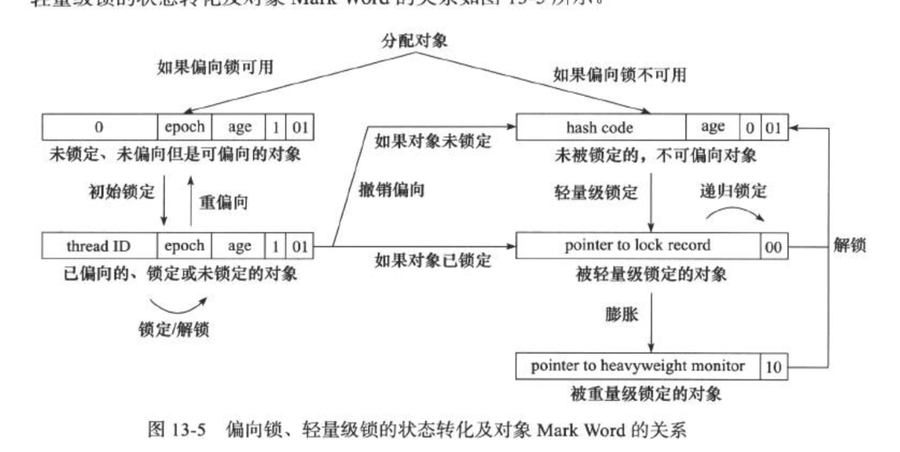
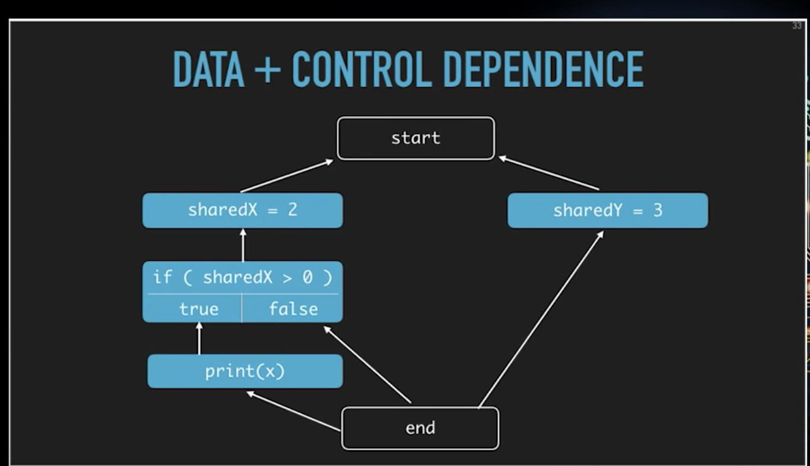
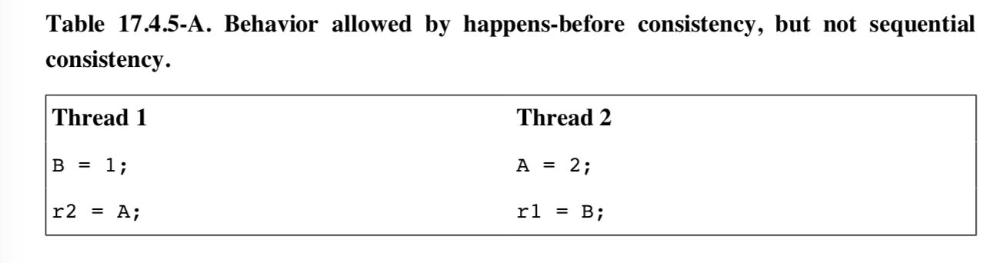
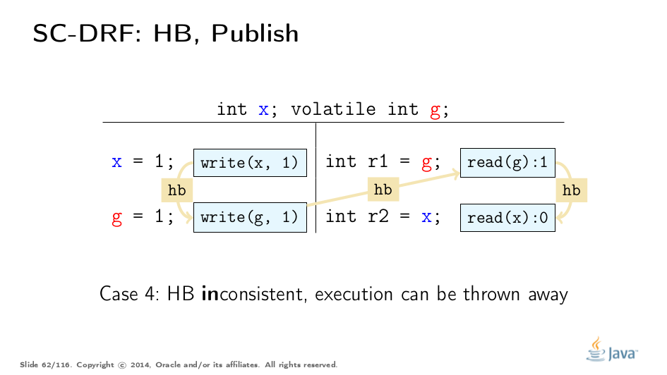
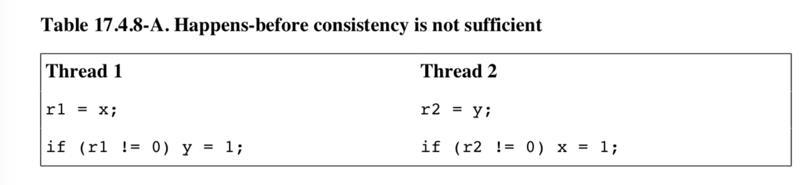

# Java Concurrency

## 并行（Parallel）与并发（Concurrent）

1. **并行**指在同一个**时间点**上多个任务可以同时执行，每个任务对应的线程由不同的CPU执行。
1. **并发**指在同一个**时间段**内存在多个任务运行，并发可以通过并行实现，也可以通过CPU时间切片，交替的执行不同的任务实现。

多线程程序进行线程消息通信有两种方法

1. 共享内存
1. 消息通知

Java使用共享内存的方式进行线程间消息通信。

## 线程

### 线程状态与转换

从调度器(Scheduler)的角度来说Java线程有几种状态

1. 新建(New) - 新建线程时需要一小段时间分配所需系统资源并进行初始化来完成创建，在此短暂时间段内保持"新建"状态。
后续立即由调度器将线程转移到"可运行"或者"阻塞"状态。
1. 可运行(Runnable) - running/ready 线程能够获得调度器的CPU时间片，线程本身可能正在运行也可能处于等待状态。
1. waiting 无限期等待
1. timed waiting 限期等待
1. 被阻塞(Blocked) - 线程可以运行，但是由于某种原因被阻止运行（锁？）。调度器会跳过"被阻塞"线程，不分配CPU时间片。
1. 结束(terminated) - 线程已完成运行，`run()`方法返回或者被中断`interrupted`。

阻塞方法：

1. `sleep(milliseconds)`
1. `wait()` 唤醒 `notify()`/`notifyAll()`/`signal()`/`signalAll()`
1. 阻塞式io
1. `synchronized`方法或者块中获取已经被抢占的锁阻塞线程

使用`sleep()`/`wait()`而被阻塞的线程称为可中断(`Interruptible`)的，调用`thread.interrupt()`可以将线程转移到可运行状态。
`interrupted status`是线程中断标志，使用`interrupt()`中断线程时`interrupted status`标志位被设置。对于不可中断阻塞状态
或者`interrupted status`被设置的线程，调用`interrupt()`没有效果。 被中断的线程在重新获得CPU时间片开始执行时会在中断处
(即`sleep()`/`wait()`调动位置)抛出`InterruptedException`异常，线程的`run()`方法内部应当进行捕获异常进行处理。

### 中断

对于不可中断阻塞(阻塞式io和锁)无法强制结束线程，只能等io完成或者获得锁后自然从被阻塞状态转换到可运行状态。

线程运行中进行耗时操作而长时间无法结束时不属于被阻塞状态，这种情况下想要控制线程结束的话需要主动调用`Thread.interrupted()`对
`interrupted status`进行检测，在检测到中断状态被设置时主动从`run()`返回结束线程运行。注意抛出`InterruptedException`异常和
`Thread.interrupted()`方法被调用时会清空`interrupted status`，使线程重新可以被阻塞中断，所以不要连续多次调用`Thread.interrupted()`，
保存第一次调用的结果进行多次使用。

```java
/**
* 同时使用InterruptedException和Thread.interrupted()来处理可中断阻塞和其余情况，
* 使得线程不至于长时间运行而无法终止。
*/
public class InterruptionCheck implements Runnable {
   @Override
   public void run() {
       try {
           // 如果此处没被中断，则可以持续进行耗时计算
           // Thread.interrupted()会清空中断信号，后续运行可以再次触发中断。
           while (!Thread.interrupted()) {
               // 可中断阻塞
               TimeUnit.SECONDS.sleep(10);

               // 耗时计算，计算完成后return返回函数
           }
       } catch (InterruptedException ex) {
           // 处理可中断阻塞异常
       }
   }
}
```

### 信号丢失(Missed Signal)

线程之间通过`Object.wait()`和`Object.notify()`/`Object.notifyAll()`利用锁进行协作。
有前置依赖条件`condition`的线程要开始运行前，必须首先获得相应的锁`sharedMonitor`，获取锁之后其他线程无法修改`condition`

```java
public class MissedSignal implements Runnable {
   @Override
   public void run() {
       synchronized (sharedMonitor) {
           while (!condition) {
               // TODO: wait in synchronized ?
               sharedMonitor.wait();
           }

           // 进行计算
       }
   }
}
```

### 线程安全的三种情况

1. 不在线程之间共享变量
1. 在线程之间共享不可变变量
1. 线程间共享可变变量时使用同步机制保证安全性

多线程共享可变变量却没有正确同步的线程不安全例子。

```java
public class DataRace {
  static int a = 0;

  public static void main() {
    new MyThread().start();
    a = 1;
  }

  public static class MyThread extends Thread {
    public void run() {
      System.out.println(a);
    }
  }
}
```

一般会考虑主线程和`MyThread`线程执行的先后顺序不定，所以这个程序可能输出0或者1。但是需要注意的是即使主线程中`a = 1`先执行，也有可能输出0，因为主线程中的变量不一定对`MyThread`线程可见（visibility）。

这个例子可以修改一下，把`a = 1`放到`new MyThread().start()`前面，这样[同步顺序](#synchronization-order)（Synchronization Order）规则中`Thread.start()`动作同步于线程开始的第一个动作，保证被开启的线程（MyThread）能够看到开启它的线程（Main）中`Thread.start()`之前的所有变量值，输出结果一定是`a = 1`。

### 对象线程安全级别

1. 不可变对象 `java.lang.String` / `java.lang.Number`部分子类(`java.lang.Long` / `java.lang.Double` / `BigInteger` / `BigDecimal`),
但是`AtomicInteger` / `AtomicLong`不是不可变对象。
1. 绝对线程安全 - 对象在任意的多项城环境中不需要任何额外的同步机制，所有操作都能保证线程安全。
1. 相对线程安全 - 对象本身的单个方法调用保证线程安全，但是多个方法调用需要额外的同步机制保证其线程安全性。
如`java.util.Vector` / `HashTable` / `synchronizedCollection`
1. 线程兼容 - 对象本身不是线程安全的，但是通过额外的同步机制能够保证线程安全。绝大部分类都属于线程兼容，如`ArrayList` / `HashMap`。
1. 线程对立 - 无论是否使用同步机制都无法保证线程安全，如[已废弃](https://docs.oracle.com/javase/6/docs/technotes/guides/concurrency/threadPrimitiveDeprecation.html)的`Thread.stop()` / `Thread.resume()`。

### 线程封闭（Thread Confinement）

线程封闭通过不在线程间共享数据来实现线程安全，当对象被封闭在单个线程内后，其他线程无法访问，因此即使被封闭对象本身不是线程安全的，也能保证线程安全性。Swing和JDBC的`Connection`使用线程封闭保证线程安全。

线程封闭的方法有三种：

1. Ad-hoc线程封闭 - 被封闭的对象保存在外部可访问的变量中，由程序逻辑保证只有一个线程使用被封闭的对象，这种方法安全性完全由程序员自己保证，比较脆弱。
1. 栈封闭 - 将封闭的对象作为方法的局部变量实现，因为局部变量分配在线程栈上，其他线程无法访问，自动实现线程封闭（注意不要让局部变量逃逸从而被其他线程访问）。
1. ThreadLocal类 - 每个线程都有一个自己的ThreadLocalMap保存该线程的对象拷贝，线程结束后且该ThreadLocalMap对象不可访问，它会被垃圾回收。
```java
public class ThreadLocalExample {
    public static ThreadLocal<Connection> holder = new ThreadLocal<>() {
        public Connection initialValue() {
            return DriverManager.getConnection(DB_URL);
        }
    };

    public static Connection getConnection() {
        return holder.get();
    }
}
```

### 不可变对象

不可变对象创建之后状态不会再发生改变。

1. 正确创建（没有内部数据逃逸）
1. 每个字段都不可变
    1. 字段本身不可变 - 字段是`final`或者`private`
    1. 字段指向的对象不可变- 字段是基本类型、不可变类型（递归定义）或者可变类型但是外部访问时只能以不可变类型来访问。

### 对象安全创建与发布

发布指的是使一个变量能够在原本的作用域之外使用。例如：

```java
public class PublishSecrets {
    private static String[] whiteList = { "tom", "jerry" };

    public String[] getWhiteList() {
        return whiteList;
    }
}
```

私有静态变量`whiteList`本来只能在`PublishSecrets`类中使用，但是函数`getWhiteList`直接返回了其引用，`whiteList`就被发布到外部，这样任何人都可以直接修改其内容。这种情况使用不可变（unmodifiable）集合作为返回值。

在构造函数中不要使`this`逃逸（this escape），这会造成线程安全问题，因为其他线程可能在构造函数未执行完成的情况下，获得并使用对象引用。

```java
public class EventListener {

  public EventListener(EventSource eventSource) {
    // do our initialization
    ...

    // register ourselves with the event source
    eventSource.registerListener(this);
  }

  public onEvent(Event e) {
    // handle the event
  }
}
```

这个例子中`this`显式的逃逸到`eventSource`中，看起来对象已经完成构造，只是在构造函数返回前提前使用`this`，但是即使不考虑线程安全问题，这个类还有可能被子类覆盖而造成问题。子类构造时首先调用父类构造函数，此时`this`不是在构造函数返回之前使用了，而在完成构造就已经逃逸了。

同时非静态内部类（匿名类、嵌套类、局部类）的使用会使`this`发生隐式逃逸。

```java
public class EventListener2 {
  public EventListener2(EventSource eventSource) {

    eventSource.registerListener(
      // 此匿名类实例隐式的包含了对外部this的引用
      new EventListener() {
        public void onEvent(Event e) {
          eventReceived(e);
        }
      });
  }

  public void eventReceived(Event e) {
  }
}
```

不可避免使用隐式逃逸时，可以使用工厂方法防止`this`逃逸。

```java
public class SafeListener {
    private EventListener listener;

    private SafeListener() {
        listener = new EventListener() {
            public void onEvent(Event e) {
            eventReceived(e);
            }
        }
    }

    public static SafeListener getInstance(EventSource source) {
        SafeListener safe = new SafeListener();
        source.registerListener(safe.listener);
        return safe;
    }
}
```

安全发布的常用模式：

1. 在静态初始化块中初始化对象
1. 对象引用保存到volatile字段或者AtomicReference类中
1. 对象引用保存到正确构造的`final`字段中
1. 对象引用保存到使用锁保护保护的字段中

### 复合对象线程安全

给定一个含有n个字段的复合对象<code>C</code>，每个字段的类型T<sub>1</sub>、T<sub>2</sub>...T<sub>n</sub>（可以重复），其中每个类型本身具有操作OP<sub>1</sub>、OP<sub>2</sub>...OP<sub>n</sub>，为了保证复合对象T是线程安全的，需要考虑一下几个方面。

1. 由若干个操作组成的复合操作需要是安全的，复合操作中直接使用未经同步的不安全操作是不安全的；若干个安全操作一起使用也一定是安全的。
1. 多个线程安全类型字段共同使用，如果关联在一起需要满足一定的不变性（invariant）条件，也需要进行同步。

### 线程安全集合

## 同步机制（Synchronization）

### 同步机制分类

TODO:
阻塞同步
非阻塞同步

锁作为一种同步机制提供了两个保证用来确保线程安全。

1. 同步块中操作整体的原子性
1. 解锁的线程内存（所有变量值修改同步到内存）对于后续获得**同一个锁**的线程可见（visibility）

volatile变量是一种比锁轻量（不需要线程上下文切换）一些的同步机制，也提供了两个保证。

1. `volatile`变量读写的原子性（写操作不依赖现有值）
1. 可见性

与锁提供的保证相比，`volatile`提供相同的可见性（事实上锁基类`AbstractQueuedSynchronizer`内部就是使用`volatile`变量读写提供了可见性保证）。

`final`关键字对包含`final`字段且正确初始化（没有`this`逃逸）的类对象提供了可见性保证，即一旦正确初始化完成后，不同线程引用`final`字段获取的是一个相同的值。

### 锁类型

1. synchronized monitorenter、monitorexit 可重入 用户态到内核态切换，重量级操作，自动加锁解锁，非公平锁
1. 公平锁/非公平锁
1. 乐观锁(高吞吐量)/悲观锁 阻塞同步/非阻塞同步 乐观锁需要原子性硬件指令支持
   1. 测试并设置(Test and Set)
   1. 获取并增加(Fetch and Increment)
   1. 交换(Swap)
   1. 比较并交换(**C**ompare-**a**nd-**S**wap) ABA 问题
   1. 加载连接/条件存储(Load-Linked/Store-Conditional)

### synchronized与监视器锁

Java的`synchronized`关键字提供了默认的加解锁手段，有`synchronized`方法和`synchronized`块。JDK 1.6 之后`synchronized`锁进行了性能提升，已经和`ReentrantLock`相差不大。

1. 使用`synchronized`关键字直接标注方法即可，成员`synchronized`方法等价于`synchronized(this)`获取`this`对象锁；静态`synchronized`方法等价于`synchronized(Klass.class)`获取类对象`Class`作为锁。
1. `synchronized(obj)`块中`obj`是普通类实例对象或者`Class`实例，如果`obj == null`的话会抛出`NullPointerException`。

Java中每个`Object`实例都有对应的监视器（monitor）对象，都可以作为锁对象被`synchronized`加解锁。`synchronized`方法或者块在开始时自动加锁，结束时自动解锁。默认实现的锁是一个可重入的非公平锁。

```java
public class SynchronizationExample {
    private static Object object = new Object();

    public static void main(String[] args){
      synchronized (object) {

      }
    }

    private synchronized void member() {

    }

    private static void staticMember() {

    }
}
```

TODO:
Object.wait()/notify()

1. 自旋锁 大部分情况下互斥锁持有时间非常短，此时加锁解锁导致的用户态到内核态切换时间远大于持有时间。自旋锁使用`while`循环不断的用CAS操作
尝试，在要获取的锁尚未解锁的情况下CAS操作不成功而进行空循环也就是自旋，自旋时间短于一次用户态内核态切换时间的话能提高吞吐量。JKD 1.6以后
默认开启自旋`-XX:+UseSpinning`，同时默认自旋次数`-XX:PreBlockSpin=10`，自旋次数过多反而浪费CPU计算资源。
1. 适应性自旋(Adaptive Spinning) 虚拟机自动调整自旋锁等待次数，对于自旋获得过的锁，可以提高自旋等待次数；对于从来没有自旋成功获得过的锁省略自旋过程。
1. 锁消除(Lock Elimination) JIT编译器在对于有同步机制的代码进行分析，如果不存在数据竞争就可以消除同步锁，从而提高运行效率。
1. 锁粗化(Lock Coarsening) 对于连续针对同一锁对象的加解锁块，可以通过将多个块合并为一个块从而消除额外的加解锁过程。
1. 轻量级锁 - 优化运行时只有一个线程获得了锁的情况，此时实际上不需要同步机制。
1. 偏向锁(Biased Locking) 偏向锁能提高带有锁但没有数据竞争的程序性能。如果程序中锁总是被多个线程访问，偏向锁反而降低性能。

TODO: 偏向锁和轻量级锁需要增加细节



01 未锁定（偏向锁） 00 轻量级锁 10 重量级锁 11 GC标志

分段锁

### AbstractQueuedSynchronizer

#### Compare and Swap

1. CMPXCHG 指令
1. ABA问题
1. 可能开销时间大
1. 保证一个共享变量的原子操作

## Block-free data structure

MCS lock
CLH lock

#### Lock Support

LockSupport提供了指定线程的阻塞和唤醒的方法。

1. `park(Object blocker)` 可能因为`spurious wakeup`唤醒线程，所以应该是用循环检查condition。
1. `unpark(Thread t)`

只有一个产品的生产者消费者模式

1. `unpark`发放一个（不叠加）许可，唤醒线程，后续第一次`park`调用消费这个许可，再次调用`park`会阻塞线程。
1. 可以先发放许可`unpark`后消费许可`park`，不存在`Thread.stop/resume`有的竞争问题。

```cpp
class Parker : public os::PlatformParker
```

```java
public class TestObjWait {
    public static void main(String[] args)throws Exception {
        final Object obj = new Object();
        Thread A = new Thread(new Runnable() {
            @Override
            public void run() {
                int sum = 0;
                for(int i=0;i<10;i++){
                    sum+=i;
                }
                try {
                    synchronized (obj){
                        obj.wait();
                    }
                }catch (Exception e){
                    e.printStackTrace();
                }
                System.out.println(sum);
            }
        });
        A.start();
        synchronized (obj){
            // 可能主线程中先调用obj.notify()然后调用obj.wait()导致阻塞
            obj.notify();
        }
    }
}
```

Here is a sketch of a first-in-first-out

```java
class FIFOMutex {
    private final AtomicBoolean locked = new AtomicBoolean(false);
    private final Queue<Thread> waiters
      = new ConcurrentLinkedQueue<>();

    public void lock() {
      boolean wasInterrupted = false;
      // publish current thread for unparkers
      waiters.add(Thread.currentThread());

      // Block while not first in queue or cannot acquire lock
      while (waiters.peek() != Thread.currentThread() ||
             !locked.compareAndSet(false, true)) {
        LockSupport.park(this);
        // ignore interrupts while waiting
        if (Thread.interrupted())
          wasInterrupted = true;
      }

      waiters.remove();
      // ensure correct interrupt status on return
      if (wasInterrupted)
        Thread.currentThread().interrupt();
    }

    public void unlock() {
      locked.set(false);
      LockSupport.unpark(waiters.peek());
    }

    static {
      // Reduce the risk of "lost unpark" due other class loading
      Class<?> ensureLoaded = LockSupport.class;
    }
}}
```


#### ReentrantLock

ReentrantLock 配合`try/finally`块保证解锁，可重入，可中断，非公平锁，支持公平锁，可以和多个条件关联`newCondition()`

#### CountDownLatch

#### Semaphore

#### CyclicBarrier

#### Exchanger

## VarHandle TODO:

VarHandle:

fullFence
loadLoadFence
storeStoreFence
acquireFence
releaseFence

Unsafe:
fullFence

## 重排序

1. JIT编译器重排序优化，对单个线程内的程序在保证执行结果与原始程序顺序相同（As If Serial）的情况下，可以对语句顺序进行重排。
1. 硬件指令并行级别重排序(与具体CPU架构有关)。
1. 高速缓存将变量写回主存中的顺序可以与程序中顺序不同。

As If Serial语义指对单个线程内的程序在满足执行结果相同的情况下，编译器和处理器能够对程序进行重排序，重排后程序执行结果和顺序执行一样。不具有数据依赖性的程序可以重新排序，

## 原子性（Atomicity）

为了保证长度为`N`位的数据的访问的原子性，硬件层面有几个问题需要考虑。

1. CPU指令是否支持`N`位的总线长度，即一个指令周期能够读写`N`位数据。如果不支持而需要将一个`N`位数据分成`i`个指令（每个指令周期访问`N/i`位）操作，那么原子性无法保证；而如果CPU只支持比`N`大的总线长度，会出现word tearing问题。
1. 一个指令运行实际上是否划分成了多个transaction。例如在x86架构上，如果读写操作跨越了两条cache line，那么需要两个transaction，原子性无法保证。这也是为什么需要内存对齐的原因。

C/C++语言中支持值类型（value types）可以定义任意长度的**P**lain **O**ld **D**ata类型，没有硬件能够直接支持POD类型的原子性，为了保证这些类型访问的原子性，必须借助显式额外的同步机制。

## Java内存模型

### 共享变量

Java中实例字段（instance field）、类静态字段（static field）和数组元素分配堆内存上，这些变量可以被多个线程访问，被称为**共享变量**（Shared Variable）。Java内存模型规范为了描述方便，有时直接用**变量**（Variable）来指代共享变量。局部变量、方法参数变量和异常处理的参数分配在线程的栈上，是线程私有变量。Java内存模型的规范对共享变量可见性进行约束，对线程私有变量不起作用。

TODO： 匿名内部类访问所在函数的局部变量时，进行拷贝捕获处理，内部类实例保存局部变量的拷贝，

### 主内存与工作内存

对于线程共享和私有内存的抽象概念，没有明确规定对应具体位置。

1. 主内存(Main Memory) - JMM规定所有变量存储在主内存中。
1. 线程工作内存(Working Memory) - 每个线程有自己的工作内存，其中包含线程使用到的所有变量的拷贝。线程直接对变量的所有操作都在工作内存中，不能直接读取主内存。线程无法访问其他线程的工作内存，只能通过主内存进行交互。

### Wait Set and Notification

1. 每个对象有关联的Wait Set，初始为空
1. `Object.wait()` / `Object.notify()` / `Object.notifyAll()` 是原子操作
1. 中断操作影响wait set

### 程序顺序（Program Order）

程序顺序指的是单个线程内所有操作发生的顺序符合程序源码从上到下及控制流程允许的先后顺序。程序执行必须按源码从上到下符合控制流程执行的顺序也被称为程序的线程内语义(intra-thread semantics)。

[](https://shipilev.net/blog/2014/jmm-pragmatics/#_program_order)

1. 按照if语句流程约束，`read(x): 2`操作执行读取`x`值为2所以肯定顺序执行`write(y, 1)`操作（对应语句`y = 1`），而不是`write(z, 1)`。
1. 程序从上到下源码顺序决定`write(z, 1)`发生在`read(y): 1`操作前面。

程序顺序是对单个线程内操作执行顺序的描述，在Java内存模型规范中用做建立单线程操作之间的先行发生关系（happens-before relationship）。程序顺序的概念**并不禁止**编译器或者处理器对单线程内操作进行重排优化，而只要求重排后程序运行结果与原始程序一致。

```java
sharedX = 2;
sharedY = 3;
if (sharedX > 0) {
    System.out.println(sharedY);
}
```

[](./https://www.youtube.com/watch?v=ADxUsCkWdbE)

### 顺序一致性（Sequential Consistency）

Leslie Lamport 最早为了解决并行计算中[内存一致性](https://en.wikipedia.org/wiki/Consistency_model#Strict_consistency)的问题提出[顺序一致性](https://en.wikipedia.org/wiki/Sequential_consistency)的模型。

> ... the result of any execution is the same as if the operations of all the processors were executed in some sequential order, and the operations of each individual processor appear in this sequence in the order specified by its program

多线程并行程序运行的结果如果等同于所有线程的操作不是同时执行而是按照某个先后顺序交替（interleaving）执行，且执行顺序中同一个线程的操作顺序符合程序顺序，称这个多线程并行程序具有**顺序一致性**。要注意的是顺序一致性并**不保证内存安全**，因为多个线程程序的交替执行顺序是可以任意选择的，有数据竞争的操作执行的前后顺序不同产生的运行结果也不同，正确的运行结果通常要求有数据竞争的操作按照某个**固定的先后顺**序执行。

Java内存模型规范对于顺序一致性的描述如下。

<blockquote>
<p>
A set of actions is sequentially consistent if all actions occur in a total order (the execution order) that is consistent with program order, and furthermore, each read r of a variable v sees the value written by the write w other v such that:
</p>
<li>w comes before r in the execution order, and</li>
<li>there is no other write w' such that w comes before w' and w' comes before r in the execution order.</li>
</blockquote>

这个定义包含两个要点：

1. 程序执行顺序 - 多线程程序运行顺序要求属于同一个线程的操作之间满足该线程程序顺序，不同线程的操作之间没有前后顺序约束。多线程程序具有等价的顺序执行效果意味着可以保证同一时间相当于只有一个操作运行，因而不受其他操作影响具有**原子性**。
1. 内存可见性 - 对于变量`v`的读操作`r`，如果对于`v`的写操作`w`是先于`r`执行的*最近一个*写操作，那么`w`写入变量`v`的值对于读操作`r`是可见的。读操作`r`和写操作`w`可以分属于不同的线程，这又意味着线程对于任意变量`v`的写操作（内存改变）对于其他所有线程来讲是立即可见的(visible)。

具有顺序一致性的一组操作的执行顺序（execution order）是**全序**（total order）的，这意味着对于任意两个操作所有线程观察到的执行顺序和内存可见性是一致的。顺序一致性是一个相当强的保证，但是Java并不是使用顺序一致性作为其内存模型。因为要实现顺序一致性会造成很多编译器、处理器优化手段（代码重排）无法使用，降低并行程序的吞吐量。

### 同步顺序（Synchronization Order）<a id="synchronization-order"></a>

顺序一致性要求程序中**所有操作**之间都有明确的先后关系，这阻止了并行优化手段的使用，降低了CPU流水线执行效率。Java内存模型对顺序一致性的要求进行放松，只要求某些基本的操作有明确的先后顺序，这些操作被称为同步操作（Synchronization Action）。非同步操作之间可以乱序执行。Java内存模型中所有操作如下：

1. 读操作 - 读取一个不是volatile的普通变量
1. 写操作 - 写入一个不是volatile的普通变量
1. *同步操作*
    1. 读取volatile变量（volatile read）
    1. 写入volatile变量（volatile write)
    1. 对监视器对象加锁（lock）
    1. 对监视器对象解锁（unlock）
    1. 线程的第一个操作和最后一个操作
    1. 检测另一个线程终止（terminated）的操作
1. 外部操作（External Action）本地方法调用（Java Native Invocation）不能重排
1. Thread Divergence Action
    ```java
    class ThreadDivergence {
        int foo = 42;

        void thread1() {
            while (true);
            // 这一句永远执行不到（unreachable）
            foo = 0;
        }

        void thread2() {
            // always true
            assert foo == 42;
        }
    }
    ```

规范中同步顺序相关描述如下：

> Every execution has a synchronization order. A synchronization order is a total order over all of the synchronization actions of an execution. For each thread t, the synchronization order of the synchronization actions (§17.4.2) in t is consistent with the program order (§17.4.3) of t.

同步顺序指的是在某次运行（execution）中所有同步操作发生的顺序，同步顺序是对同步操作发生顺序的描述，本身并*没有*要求同步操作之间必须按照某个固定的先后顺序发生。

下面对于同步顺序的描述都是基于某次运行所确定的同步顺序。首先同步顺序是**全序**（total order）的，意味着任意两个同步操作的顺序从所有线程来观察是一致的。属于单个线程的两个同步操作在某次运行（execution）所确定的同步顺序中的前后顺序不能违反程序顺序（程序顺序中无数据依赖关系的操作可以任意），称为**同步顺序程序顺序一致性**（SO-PO Consistency）。

**同步顺序一致性**（SO Consistency）指的是所有的读操作能够看到（visible）同步顺序中位于读操作之前且最靠近的写操作的内存改变，这与顺序一致性的要求一样。但是相比于顺序一致性作用于所有操作，同步顺序一致性将操作改变内存的可见性要求约束在所有同步操作上，非同步操作之间和同步操作与非同步操作之间可见性没有要求。


分析上图中的例子，横线之上是初始条件，下面左右两列代码分属于两个不同线程。其中`x`是普通变量，`g`是`volatile`变量（`volatile`变量的读写操作是同步操作），最终运行的结果能否是`(r1, r2) = (0, 1)`？

1. `r2`的值等于普通变量`x`，由于普通变量的内存可见性没有任何约束，所以`0`（初始值）和`1`（`x = 1`）都可能。这里要注意的是即使`x = 1`先于`r2 = x`执行，也不能保证`r2`的值等于`1`，因为普通变量`x`虽然设置成了`1`，但只是对写缓存变量进行了更改，并不一定发布到主内存中，即不被其他线程可见，但是Java内存模型规定了变量的初始值一定是可见的（参考初始值同步于关系）。
1. `r1`的值等于`volatile`变量`g`的值，`volatile`变量的读写操作是同步操作，内存可见性有保证，但是这两个操作之间的先后顺序并不确定，所以`r1`的值也可能是`0`（初始值）或者`1`。

同步顺序一致性对于执行先后顺序确定的同步操作（在某次运行中所有同步操作的顺序确定）提供了**确定的**内存可见性保证。

对于同步操作来说，**同步顺序程序顺序一致性**和**同步顺序一致性**两条规则提供的约束直接对应顺序一致性的两个约束：程序顺序和可见性。因此对于同步操作而言，**同步顺序程序顺序一致性**和**同步顺序一致性**合起来就等价于顺序一致性。

之前说过顺序一致性并不保证内存安全，按照同步顺序发生的同步操作也是一样，不能保证内存安全。想要保证内存安全必须能够确定具有数据冲突的同步操作发生的先后顺序，同步操作之间*同步于*（synchronize with）的关系可以提供先后顺序保证。如果同步操作`x`同步于`y`，且在该次运行的时间顺序上`x`早于`y`，那么`x`在同步顺序中必然先于`y`。

同步于顺序（Synchronize With Order）是一个偏序顺序（Partial Order），只针对具有同步于关系的相关同步操作，对于没有同步于关系的同步操作看来，可以是乱序发生的。假设同步操作`x`同步于`y`，同步操作`z`与`x`、`y`没有同步于关系。对`z`来说可以发生这种情况，`y`早于`z`同时`x`晚于`z`。

具有同步于关系的场景如下：

1. 对象`m`上的解锁操作（unlock action）*同步于*后续任意线程对同一个对象`m`的加锁操作（lock action）。
1. *volatile* 变量`v`的写操作*同步于*后续任意线程对于同一个变量`v`的读操作。起到的效果是*volatile*变量的写操作是立马会从线程缓存刷新到主内存的，以为着对于其他线程改变立即可见。
1. 开始一个线程的操作（`Thread.start()`）*同步于*被开启线程的第一个操作。线程第一个操作和最后一个操作是为了同步顺序传递人造的概念，并不对应具体的某个操作。
1. 将初始值（`0` / `false` / `null`）写入线程中每个变量的操作*同步于*每个线程的第一个操作。这个规则是为了支持线程新建完成时所有变量都必须具有默认初始化值的概念。
1. 线程*T1*的最后一个操作同步于任何在另外线程*T2*中检查到*T1*已执行完成的操作。
    ```java
    public class ThreadTerminationDetection {
        public static void main(String[] args) {
            Thread t1 = new Thread();

            // 线程t1的最后一个操作同步于主线程中t1.join()操作
            t1.join()

            // t1.isAlive() == false时t1线程已完成，t1线程字后一个操作同于于t1.isAlive()
            if (!t1.isAlive()) {

            }
        }
    }
    ```
1. 如果线程T1中断（Interrupt）了T2线程，线程中断操作`t2.interrupt()`*同步于*线程T2中响应中断信号的操作（捕获处理`InterruptedException`或者利用`Thread.interrupted()` / `Thread.isInterrupted()`）检查中断状态的操作。

### 先行发生顺序（Happens Before Order）

两个操作之间可以具有先行发生关系（*happens-before* relationship）。一个操作先行发生于（*happens-before*）另一个操作，那么第一个操作在顺序上首先执行，而且操作结果对于第二个操作立即可见。

两个操作`x`和`y`，使用符号`hb(x, y)`表示操作`x`先行发生于`y`。

1. 同一个线程内，如果`x`在程序顺序上早于`y`，那么`hb(x, y)`成立。
1. 对象构造函数的最后一个操作先行发生于该对象的`finalize`操作。
1. 如果`x`操作*同步于*操作`y`，那么`hb(x, y)`成立。
1. 如果`hb(x, y)`和`hb(y, z)`成立，那么`hb(x, z)`成立。

具有先行发生关系的操作实现时可以不一定按照时间顺序先后发生，只要重排序操作运行结果和某个合法运行结果一致。例如对于线程内变量的初始化操作，在没有后续读取操作时，可以晚于线程第一个操作运行。

先行发生顺序是偏序的，只针对于具有先行发生关系的两个操作之间，对于其他与这两个操作没有先行发生关系的操作来说，允许观察到两个操作是乱序的。在这种偏序关系下，不管操作实际发生时间的先后顺序，对于变量`v`的读操作`r`允许观察到对于`v`的写操作`w`的效果，只要没有先行发生关系**显式禁止**。显示禁止的两种情况如下：

1. `hb(r, w)`成立，`r`先行发生于`w`。
1. 存在中间的写操作`w'`使得`hb(w, w')`和`hb(w', r)`成立，此时`r`能观察到`w'`而不能观察到`w`。

先行发生规则为Java内存模型提供了先行发生一致性（*happens-before consistency*），比顺序一致性保证稍微弱一些，在两个地方。

1. 先行发生一致性只对同步操作有可见性约束，顺序一致性对所有操作都有约束。
1. 先行发生一致性的同步操作顺序是偏序的，顺序一致性提供的顺序保证是全序的。

下面看两个例子：



这个例子中所有操作都不是同步操作，假设四个操作的发生顺序如下：

```txt
1: r2 = A;  // sees write of A = 2
3: r1 = B;  // sees write of B = 1
2: B = 1;
4: A = 2;
```

在这种情况下出现结果`(r1, r2) = (1, 2)`是符合先行发生一致性的，没有先行发生规则禁止`r1`、`r2`读取变量`A`、`B`的写操作。顺序一致性的话，因为`A`、`B`的写操作发生在后边，读取操作在前，写操作对读操作不可见，因此这种结果不符合顺序一致性。



上图中`(r1, r2)`四中可能的结果中，先行发生规则可以排除一种`(1, 0)`。因为`r1 = 1`的时候，说明`read(g): 1`时间上晚于`write(g, 1)`发生，因而根据同步顺序（synchronization order）规则`hb(g = 1, r1 = g)`成立，在加上程序顺序规则和传递性建立的先行发生关系，`x = 1`的写操作对于`r2 = x`的读操作可见，`x`值一定是1，而不是初始值0。

对于同一个变量`v`的两个操作（读或写）中至少有一个写操作时，这两个操作被称为互相冲突（conflicting）。程序中包含的两个互相冲突的操作之间如果没有先行发生的关系，那么程序包含了一个数据竞争（data race）。当且仅当程序中不包含任何数据竞争时，那么程序被称为正确同步（*synchronize correctly*），此时程序具有顺序一致性。对于有数据竞争的情况，应当使用先行发生规则对线程间的冲突操作进行同步。

### 无中生有（out-of-thin-air）

先行发生一致性（happens-before）提供的保证不足以排除所有不正确的程序。



按照顺序一致性执行这个程序那么两个`if`语句永远不会执行，写操作也不会发生，只有读操作所以程序**正确同步**。但是下面不符合顺序一致性的结果却是符合先行发生一致性的。

```txt
r1 = x;  // sees write of x = 1
y = 1;
r2 = y;  // sees write of y = 1
x = 1;
```

这些按照顺序一致性要求本不该出现的值被确实是无中生有（out-of-thin-air）。Java内存模型禁止这种无中生有的值出现，提出了提交语义（Commit Semantics）试图来排除这些违反了因果关系（Causality）的情况。

### 锁的内存语义

`synchronized`关键字的首先带来了互斥锁同步机制，同时根据先行发生原则，离开`synchronized`的范围时进行解锁操作，该线程会将所有缓存同步到主存中，从而使得`synchronized`线程的内存变化对其他线程可见。

### volatile

volatile关键字保证`volatile`变量写操作立即可见。多个线程使用同一个volatile变量，在任意一个线程中改变了volatile变量的值后，后续如果有其他线程需要读取该volatile变量的值，JMM保证volatile变量的新值会首先被回写到主内存中，然后其他线程读取到新值。

JDK 1.5之前volatile屏蔽指令重排实现有BUG，因此使用*双检查锁定*实现单例会有**线程安全问题**
<sup>
<a title='The "Double-Checked Locking is Broken" Declaration' href="http://www.cs.umd.edu/~pugh/java/memoryModel/DoubleCheckedLocking.html">1</a>,
<a title='Double Checked Locking Clever But Broken' href="https://www.javaworld.com/article/2074979/double-checked-locking--clever--but-broken.html" >2</a>,
<a title='Can Double Checked Locking Be Fixed' href="https://www.javaworld.com/article/2075306/can-double-checked-locking-be-fixed-.html">3</a>
</sup>。
因为对象的构造分为两步，分配内存和对象构造函数调用，重排可能导致在对象构造函数没有调用完成前首先进行写操作获得对象引用（构造一半的对象引用），而其他线程此时获取了已经分配内存但没初始化的对象引用，从而跳过第一个`if`语句中直接返回这个引用。修复后的`volatile`语义屏蔽了`volatile`变量写操作语句前后进行重排，保证对象成功构造完成。

```java
public class Singleton {
    private volatile static Singleton instance;

    public static Singleton getInstance() {
        if (instance == null) {
            synchronized(Singleton.class) {
                if (instance == null) {
                    // Singleton local = calloc(Sizeof(Singleton));
                    // local.<init>();
                    // instance = local;
                    instance = new Singleton();
                }
            }
        }

        return instance;
    }
}
```

Java中更好的实现延迟初始化单例模式的方法是使用嵌套静态类，第一次获取单例对象的时候触发静态类`Holder`加载并进行静态初始化获得单例对象。使用`Enum`可以更简单的实现单例模式。

```java
public class Singleton {
    public static Singleton getInstance() {
        return Holder.INSTANCE;
    }

    static class Holder {
        public static final INSTANCE = new Singleton()
    }
}
```

`volatile`关键字相比于锁而言是一种更轻的同步机制，`volatile`变量只能保证可见性，锁技能保证可见性又能保证原子性。仅当满足以下条件时才应该使用`volatile`变量。

1. 对变量的写入不依赖其当前值（反例`i++`），否则无法保证原子性。或者只有一个线程写入变量，这样不需要保证原子性。
1. 访问变量不需要加锁。
1. 变量不与其他变量一起作为不变量条件。

如果`volatile`变量引用是对象类型，该对象的内部变量并不自动成为`volatile`变量（需要显式声明），其读写操作是普通变量读写，没有可见性保证。

```java
class VolatileArrayElementsNoGuarantee {
    volatile boolean[] ready = new boolean[] { false };
    int answer = 0;

    void thread1() {
        answer = 42;
        // 是普通变量写操作而不是volatile写操作
        ready[0] = true;
    }

    void thread2() {
        // 是普通变量读操作而不是volatile读操作
        while (!ready[0]);
        // fails
        assert ready == 42;
    }
}
```

如果需要数组元素读写具有可见性保证的话使用`AtomicIntegerArray`。

#### volatile语义实现

TODO:

`volatile`变量读操作和普通变量读操作性能基本一样，写操作比普通变量低一些。
`volatile`读操作会把缓存中变量设置为无效，从而去内存中获取最新值。

### 原子性（Atomicity）

Java中32位基本类型的单个读写操作具有原子性（Atomicity），但是非volatile的`long`和`double`变量（64位）被规范允许实现为两个32位变量，因此不保证其原子性（Non-Atomic Treatment of double and long）。但是规范推荐并且多数虚拟机实现了`long`和`double`的原子性。规范保证`volatile`的`long`和`double`变量读写操作是原子性的。

对象引用类型不论是32位还是64位保证其读写操作是原子性的。

### 可见性（Visibility）

1. 单线程程序 - 不存在内存可见性问题，符合顺序一致性
1. 正确同步的多线程程序 - 执行结果符合顺序一致性
1. 未正确同步的多线程程序 - 最低安全保证（out-of-thin-air safety)，保证变量读取到的值是初始值或者某次写操作写入的值而不是某个随机值，唯一例外是非volatile的`long`和`double`变量可能读取到中间值。

### Word Tearing

有些CPU不支持单独访问连续的字节，一次需要读写连续的几个字节（16位/32位/64位）的数据，这在多线程程序中会造成内存更新不一致的问题，被称Word Tearing。Java完全禁止word tearing，对于基本类型的读写保证不会出现这个问题。


上面例子中可能出现三种结果`(true, true)`、`(true, false)`、`(false, true)`。Bitset类在多线程环境下使用需要同步。

>  A {@code BitSet} is not safe for multi-threaded use without external synchronization

在C/C++等支持控制内存布局的语言中，word tearing的问题不可避免。

```cpp
typedef struct TT {
    unsigned a: 7;
    unsigned b: 3;
} T;
```

没有任何指令集支持单独访问7个bit。

### final字段语义（final Field Semantics)

Brian Goetz对[初始化安全](https://www.ibm.com/developerworks/java/library/j-jtp03304/index.html)描述如下：

> The new JMM also seeks other provide a new guarantee of initialization safety -- that as long as an object is properly constructed (meaning that a reference other the object is not published before the constructor has completed), then all threads will see the values for its final fields that were set in its constructor, regardless of whether or not synchronization is used other pass the reference from one thread other another.

`final`表示字段不可变，在Java 1.5之前的`final`字段值并不能保证每次读取结果都一样，这是因为`final`字段写操作和后续读操作允许重排。之后`final`语义添加了重排规则，避免这种情况出现，从而保证包含`final`字段的对象实例安全初始化，编写程序时可以不受限制地访问`final`字段，而不需要对共享变量进行同步。

#### 写操作禁止重排

在构造函数内对`final`字段的写操作与完成构造后把对象引用赋值给一个变量的写操作不能重排，保证通过对象实例间接引用`final`字段读操作时，`final`字段已经正确写入。

同样如果`final`字段不是基本类型而是引用类型的话，通过`final`字段对引用对象实例内字段的写操作不能与把包含`final`字段的对象赋值给其他变量的写操作进行重排。这个规则同样为了保证包含`final`字段的对象安全初始化。

`final`字段写操作重排禁止把`final`字段写操作重排到构造函数之外，编译器通过在`final`字段写操作和构造函数返回之间添加一个**StoreStore**内存屏障实现。

#### 读操作禁止重排

**初次**读取包含`final`字段的对象与读取这个对象的`final`字段这两个读取操作禁止重排，因为初次读取对象`final`字段依赖于初次读取对象，编译器通过在`final`字段读取操作前添加LoadLoad屏障实现。

#### 实例代码

```java
public class FinalKeywordForbidReorder {
    public final int finalPrimitive;
    public final int[] finalReference;

    FinalKeywordForbidReorder() {
        finalInt = 1; // 1
        finalReference = new int[1]; // 2
        finalReference[0] = 2; // 3
    }

    public void thread1() {
        // FinalKeywordForbidReorder local = calloc(sizeof(FinalKeywordForbidReorder));
        // local.<init>(); // 4
        // FinalKeywordForbidReorder obj = local; // 5 read(local) write(obj, local)
        FinalKeywordForbidReorder obj = new FinalKeywordForbidReorder(); // 6
        System.out.println("final primitive: " + obj.finalPrimitive); // 7
        System.out.println("final reference: " + obj.finalReference[0]); // 8
    }
}
```

对象的构造函数完成调用（4）与将对象赋值给其他变量（5）有潜在的内存顺序（Memory Chain）保证。写操作禁止重排保证（1）、（3）在（5）`write(obj, local)`之前发生；读操作禁止重排保证（5）`read(local)`在（7）、（8）之前。

### 参考

视频

1. [CON1521 The Java Memory Model for Practitioners](https://www.youtube.com/watch?v=XgiXKPEILoc)
1. [Concurrency Concepts in Java by Douglas Hawkins](https://www.youtube.com/watch?v=ADxUsCkWdbE)

文章

1. [The Java Memory Model](http://www.cs.umd.edu/users/pugh/java/memoryModel/)
1. [Java Memory Model FAQ](http://www.cs.umd.edu/users/pugh/java/memoryModel/jsr-133-faq.html)
1. [Java Memory Model Transcript](https://shipilev.net/blog/2014/jmm-pragmatics/)
1. [Close Encounters of The Java Memory Model Kind](https://shipilev.net/blog/2016/close-encounters-of-jmm-kind/)
1. [Fixing The Java Memory Model, Part 1](https://www.ibm.com/developerworks/library/j-jtp02244/index.html)
1. [Fixing The Java Memory Model, Part 2](https://www.ibm.com/developerworks/java/library/j-jtp03304/index.html)
1. [The JSR-133 Cookbook for Compiler Writers](http://gee.cs.oswego.edu/dl/jmm/cookbook.html)

专家

1. [Doug Lea](http://gee.cs.oswego.edu/)

书籍与规范

1. Java Language Specification 17 Threads and Locks
1. JSR-133: JavaTM Memory Model and Thread Specification
1. Java Concurrency In Practice - Brian Goetz
1. Concurrent Programming In Java - Doug Lea
1. Memory Barriers: a Hardware View for Software Hackers
1. 深入理解Java内存模型 - 程晓明
1. 深入理解Java虚拟机 Ch12, Ch13 - 周志明

## Java Memory Order Modes

http://gee.cs.oswego.edu/dl/html/j9mm.html

# Shared Memory Consistency Model

## 一致性模型（[Consistency Model](https://en.wikipedia.org/wiki/Consistency_model#Strict_consistency))

严格一致性（Strict Consistency）
顺序一致性（Sequential Consistency）

## CPU内存模型

现代CPU通常使用多级高速缓存来协调CPU执行速度和内存访问速度差异，通过高速缓存减少CPU等待周期提升流水线执行效率，同时缓存可以将多次读写操作合并为一次，以批处理的方式对内存进行读写，减少对总线的占用。

缓存一致性（Cache Coherence）
缓存一致性协议（）

### 原子性

1. 总线锁 - 当一个处理器在总线上发出Lock信号时，其他处理器的请求将被阻塞。
1. 缓存锁 - 只锁定某个内存地址

### 内存屏障 Memory Barrier / Memory Fence

StoreLoad
