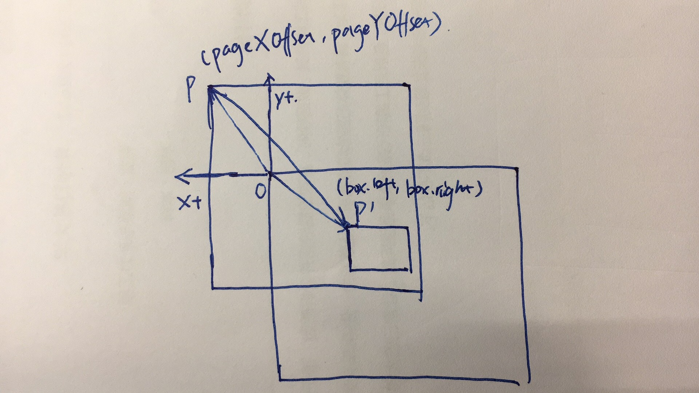
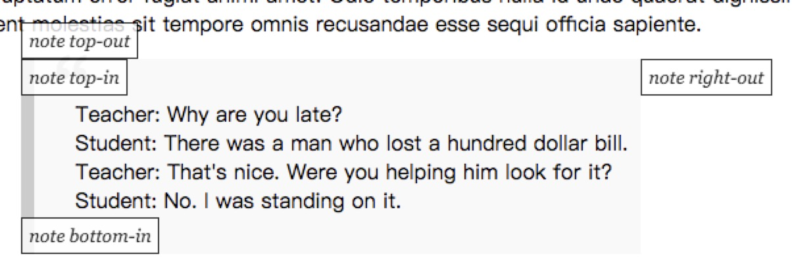

# DOM

## Host Environment

### **D**ocument **O**bject **M**odel

[W3C DOM4 Standard](https://www.w3.org/TR/dom/) and [WhatWG DOM Standard](https://dom.spec.whatwg.org/)


#### DOM Node


1. `EventTarget` is an root abstract class for event support.
1. `Node` is an abstract class serving as base of all nodes.
1. `Element` is an abstract class serving as base of all element nodes.
1. `HTMLElement` is base class of all types of html element.

Form normal javascript object, `console.log` and `console.dir` are no different. But for DOM element object, they are different.

1. `console.log(elem)` shows the element DOM tree.
1. `console.dir(elem)` shows the element as a DOM object, good to explore its properties.

There're 12 [node types](https://dom.spec.whatwg.org/#node), primary ones are as below.

1. document – the “entry point” into DOM.
1. element nodes – HTML-tags, the tree building blocks.
1. text nodes – contain text.
1. comments – sometimes we can put the information there, it won’t be shown, but JS can read it from DOM.

Attributes is what's written in HTML, it's of `DOMString` type and name is case insensitive.

1. `elem.hasAttribute(name)` – checks for existence.
1. `elem.getAttribute(name)` – gets the value.
1. `elem.setAttribute(name, value)` – sets the value.
1. `elem.removeAttribute(name)` – removes the attribute.
1. `elem.attributes` is a collection of all attributes.

DOM properties are property of DOM object, it's name is case sensitive and not always strings, `input.checked` is boolean.

All attributes starting with "data-" are reserved for programmers' use. They are available in dataset property.

Creation

1. `document.createElement('div)`
1. `document.createTextNode('Here I am')`
1. `document.createDocumentFragment()`

Clone

1. `elem.cloneNode(true)` creates a deep clone with all child elements
1. `elem.cloneNode(false)` creates a shallow clone without children.

Insertion

1. `element.appendChild(node)`
1. `element.insertBefore(node, nextSibling)`
1. `element.replaceChild(node, oldChild)`

- `node.append(...nodes or strings)` – append nodes or strings at the end of node,
- `node.prepend(...nodes or strings)` – insert nodes or strings into the beginning of node,
- `node.before(...nodes or strings)` –- insert nodes or strings before the node,
- `node.after(...nodes or strings)` –- insert nodes or strings after the node,
- `node.replaceWith(...nodes or strings)` –- replaces node with the given nodes or strings.


`elem.insertAdjacentHTML(where, html)`, `elem.insertAdjacentText(where, html)`, `elem.insertAdjacentElement(where, html)`

- "beforebegin" – insert html before elem,
- "afterbegin" – insert html into elem, at the beginning,
- "beforeend" – insert html into elem, at the end,
- "afterend" – insert html after elem.


`document.write(<b>Hello</b>)` only works when page is loading. If it's called afterwards, existing document content is erased.

Removal

1. `element.removeChild(node)`
1. `node.remove()`

#### Traverse DOM


`document.body` refers to `<body></body>` element of an html page, but that's valid only when inside `<body></body>` element, for scripts inside `<head></head>` element, `document.body` is `null`.


`document` is the root node of DOM, but it's not an element node. `document.documentElement` is the root element node.

```javascript
document.documentElement.parentNode === document
document.documentElement.parentElement === null
```

#### Search DOM

| Method                         | Returns                                     | Context               | Live? |
| :----------------------------- | :------------------------------------------ | :-------------------- | ----- |
| `getElementById(id)`           | single element with `id`                    | `document`            | No    |
| `getElementsByName(name)`      | mutiple elements with `name`                | `document`            | Yes   |
| `getElementsByTagName(name)`   | mutiple elements with `name`                | `document`, `element` | Yes   |
| `getElementsByClassName(name)` | mutiple elements with `name`                | `document`, `element` | Yes   |
| `querySelector(selector)`      | first element matches `selector`            | `document`, `element` | No    |
| `querySelectorAll(selector)`   | mutiple elements matches `selector`         | `document`, `element` | No    |
| `closest(selector)`            | closest ancestor element matches `selector` | `document`, `element` | No    |

Multiple elements is of type `HTMLCollection`.

Query relationship

1. `element.matches(css)` returns boolean value indicating whether `element` matches CSS selector.
1. `elementA.contains(elementB)` returns boolean value indicating whether `elementB` is a descendant of `elementA`.

#### Table DOM

`<table>` element supports (in addition to the given above) these properties:

1. `table.rows` – the collection of `<tr>` elements of the table.
1. `table.caption/tHead/tFoot` – references to elements `<caption>`, `<thead>`, `<tfoot>`.
1. `table.tBodies` – the collection of `<tbody>` elements (can be many according to the standard).

`<thead>`, `<tfoot>`, `<tbody>` elements provide the rows property:

1. `tbody.rows` – the collection of `<tr>` inside.

`<tr>`:

1. `tr.cells` – the collection of `<td>` and `<th>` cells inside the given `<tr>`.
1. `tr.sectionRowIndex` – the number of the given `<tr>` inside the enclosing `<thead>`/`<tbody>`.
1. `tr.rowIndex` – the number of the `<tr>` in the table.

`<td>` and `<th>`:

1. `td.cellIndex` – the number of the cell inside the enclosing `<tr>`.

### HTML Attributes and DOM Properties

#### Standard and Custom HTML Attributes

HTML attributes are defined by HTML source, all definitions inside HTML tag are atrributes. Each type of HTML tag has a set of built-in attributes, which is called standard attributes. Different type of HTML element has different standard attributes. All other attributes are custom attributes.

When html source is parsed, corresponding DOM object properties are created for standard attributes. And HTML attributes can be manipulated with a set of functions.

```javascript
// manipuate single attribute by name
element.hasAttribute(name)
element.getAttribute(name)
element.setAttribute(name)
element.removeAttribute(name)
```

HTML attributes inside DOM object has two features:

1. Attribute name is case-insensitive.
   ```javascript
   // equivalent forms
   element.getAttribute('id')
   element.getAttribute('iD')
   element.getAttribute('Id')
   element.getAttribute('ID')
   ```
1. Attribute value is always string. `getAttribute(name)` returns a string, `setAttribute(name, value)` converts value to string first and then store it as attribute value.

`element.attributes` is used to access all attributes on a element, it returns a live collection of all attributes of element. Returned value is of an iterable type `NamedNodeMap` that contains a collection of key/value pair of strings.

#### Property-attribute Synchronization

When a standard HTML attribute changes, the coressponding DOM property is auto-updated, and (with some exceptions) vice versa.

```html
<input />

<script>
  let input = document.querySelector('input')

  // attribute => property
  input.setAttribute('id', 'id')
  alert(input.id) // id (updated)

  // property => attribute
  input.id = 'newId'
  alert(input.getAttribute('id')) // newId (updated)
</script>
```

But there're some exclusions when attribute doesn't follow when property changes.

```html
<input />

<script>
  let input = document.querySelector('input')

  // attribute => property
  input.setAttribute('value', 'text')
  alert(input.value) // text

  // NOT property => attribute
  input.value = 'newValue'
  alert(input.getAttribute('value')) // text (not updated!)
</script>
```

#### DOM Properties

When DOM objects are created, only standard attributes like _id_, _class_ are mapped to corresponding properties of DOM objects, custom attributes ignored.

```javascript
// corresponding to standard attributes
document.getElementById('test').id // test
document.getElementById('test').className // button
document.getElementById('test').foo // undefined

// custom properties
document.getElementById('test').foo
$('#test').prop('foo')
document.getElementById('test').foo = 1
$('#test').prop('foo', 1)
```

Prefer to use property `element.name` instead of `element.getAttribute(name)` to get value of attribute `name` because property values are typed.

```javascript
// input.checked is boolean value
document.getElementById('test').checked
document.getElementById('test').checked = true

// input.style is an object
document.getElementById('test').style

// avoid using attribute
document.getElementById('test').getAtribute('checked')
document.getElementById('test').setAtribute('checked') = 'false'
```

Event if a DOM property is a string, it may differ from attribute value. For instance, the `href` DOM property is always a _full_ URL, even if the attribute contains a relative URL or just a hash.

```html
<a id="a" href="#hello">link</a>
<script>
  // attribute
  alert(a.getAttribute('href')) // #hello

  // property
  alert(a.href) // full URL in the form http://site.com/page#hello
</script>
```

#### Custom Attributes and `dataset`

Custom attributes are used to pass custom data from HTML to JavaScript.

```html
<!-- mark the div to show "name" here -->
<div show-info="name"></div>
<!-- and age here -->
<div show-info="age"></div>

<script>
  // the code finds an element with the mark and shows what's requested
  let user = {
    name: 'Pete',
    age: 25,
  }

  for (let div of document.querySelectorAll('[show-info]')) {
    // insert the corresponding info into the field
    let field = div.getAttribute('show-info')
    div.innerHTML = user[field] // Pete, then age
  }
</script>
```

And they are used to style elements in CSS.

```html
<style>
  /* styles rely on the custom attribute "order-state" */
  .order[order-state='new'] {
    color: green;
  }

  .order[order-state='pending'] {
    color: blue;
  }

  .order[order-state='canceled'] {
    color: red;
  }
</style>

<div class="order" order-state="new">A new order.</div>

<div class="order" order-state="pending">A pending order.</div>

<div class="order" order-state="canceled">A canceled order.</div>
```

To avoid potential conflicts when using custom attributes to pass around data, all attributes starting with `data-` are reserved and can be accessed in `dataset` property. Notice that `data-` attribute are converted to `camelCase` in DOM property.

```html
<body data-about="Elephants" data-order-state="new">
  <script>
    alert(document.body.dataset.about) // Elephants
    alert(document.body.dataset.orderState) // new
  </script>
</body>
```

#### Reference

1. [DOM Element Attributes Standard](https://dom.spec.whatwg.org/#dom-element-attributes)

### DOM Size and Positions

#### [Element Size and Scrolling](http://javascript.info/size-and-scroll)

1. `offsetParent` - containing block element(positioned element/th,td,table/body.) for current element, maybe `null` in some cases.
   1. element is not show (`display: none`).
   1. element is `<body>` and `<html>`
   1. element is positioned relatively to window viewport rather than containing element `position: fixed`.
1. `offsetLeft/offsetTop` - coordinate of left upper outer corner (border included) of inner element relative to left upper inner corner (padding included) of outer element.
1. `offsetWidth/offsetHeight` - outer width/height of inner element with borders included.
1. `clientWidth/clientHeight` - width/height of element content including paddings but not scrollbar if present.
   1. In left to right OS, `clientWidth` equals to left border width.
   1. In right to left OS, `clientWidth = leftBorderWith + scrollBarWidth` since scroll bar appears on left side.
1. `clientLeft/clientTop` - distance from element left upper outer corner to its left upper inner corner.


1. `scrollWidth/scrollHeight` - minimum width/height that can contains all child elements without scrolling (scroll bar not included)
1. `scrollLeft/scrollTop` - distance between left upper corner of scrolled content (including invisible area) to left upper corner of visible area.


All properties above are `0` or `null` if element is not shown (`display: none`), aka, not in document flow.

All properties above are read only except for `scrollTop`/`scrollLeft` and all Set `scrollTop` to `0` to scroll it to top, set it to `Infinity` to scroll it to bottom.

Calculate `scrollBottom` value

```js
ele.scrollBottom = ele.scrollHeight - ele.scrollTop - ele.clientHeight
```

Use `ele.style` to change read only geometries above.

```js
// centering inner element horizontally and vertically
child.style.left =
  Math.round(parent.clientWidth / 2 - child.offsetWidth / 2) + 'px'
child.style.top =
  Math.round(parent.clientHeight / 2 - child.offsetHeight / 2) + 'px'
```

Notice difference between geomerties properties above and geometry values from element style, eg. `getComputedStyle(ele).width` and `ele.clientWidth`.

1. Geometry property values from DOM API are integer value without unit, and only `scrollTop`/`scrollLeft` are writable. Geometry value from styles returns string with unit `px`.
1. `getComputedStyle(ele).width` may return `auto`.
1. `clientWidth` is inner content width including paddings, while `getComputedStyle(ele).width` varies according to box model value used (`box-sizing`).
1. If a scroll bar appears, `clientWidth` doesn't include it, but `getComputedStyle(ele).wdith` returns different values on different browsers (Chrome includes scroll bar width, Firefox not).

#### [Window Size and Scrolling](http://javascript.info/size-and-scroll-window)

`window.document.documentElement` is the root element of document, it's geometry properties can be used to get width/height of whole window.

1. `window.document.documentElement.clientWidth` - Width of visible part of document not including vertical scroll bar.
1. `window.document.documentElement.clientHeight` - Height of visible part of document not including honrizontal scroll bar.

There's some properties on `window` that gives us inner and outer size of browser window.

1. `window.innerWidth/window.innerHeight` - Width and height of browser window viewport, including scroll bar and debug console if present.
1. `window.outerWidth/window.outerHeight` - Width and height of whole browser window.


To get width and height of whole document including scrolled out part, use code below.

```js
function getWindowScrollHeight() {
  const body = document.body
  const documentElement = document.documentElement

  return Math.max(
    body.scrollHeight,
    documentElement.scrollHeight,
    body.offsetHeight,
    documentElement.offsetHeight,
    body.clientHeight,
    documentElement.clientHeight
  )
}
```

Theoretically, root element `scrollHeight/scrollWidth` can be used to get full size of window and these properties work fine for non root elements. But for historical reasons, inconsistenscies exist betweeen different browsers, thus this trick is used.

To get scolled position of window, `documentElement.scrollTop/documentElement.scrollLeft` can be used. But Chrome/Safari/Opera have bugs and we should use `document.body.scrollLeft/document.body.scrollTop` instead.

Fortunately, we have a simpler and universal solution, `window.pageXOffset/window.pageYOffset` works consistently between different browsers. They're read only properties, use `scrollTo`, `scrollBy`, `scrollIntoView` to scroll whole window.

1. `scrollTo(x,y)` - scrolls point (x,y) on root element to top left corner of window viewport.
1. `scrollBy(x,y)` - scrolls page relative to its current position to right and bottom direction.
1. `element.scrollIntoView(top=true)` - scrolls an element into view. If parameter `top` is `true`, align element upper edge with window top, otherwise, align element bottom edge with window bottom.

Set `overflow` css property to forbid scrolling of element or window.

1. `document.body.style.overflow = 'hiddent'` - disable window scrolling
1. `document.body.style.overflow = ''` - enable window scrolling

#### [Coordinates](http://javascript.info/coordinates)

To get **window** related coordinates, use method `element.getBoundingClientRect()` returns an `DOMRect` object with geometry properties.


1. `left` / `x` - X Coordinate for left element edge
1. `right` - X coordinate for right element edge
1. `top` / `y` - Y coordinate for top element edge
1. `bottom` - Y coordinate for bottom element edge
1. `height` - height of bounding rectangle `height = bottom - top`
1. `width` - width of bounding rectangle `width = right - left`

`left`, `right`, `top`, `bottom` are relative to viewport top left corner, and could be negative values since bounding client rect encloses scrolled part of element.

`document.elementFromPoint(x, y)` returns most nested element at window coordinate `(x, y)`. When coordinate is out of window region, it returns `null`.

To get **document** related coordinates, we have to calculate it.

```js
function getDocumentCoords(element) {
  const box = element.getBoundingClientRect()
  return {
    top: box.top + pageYOffset,
    left: box.left + pageXOffset,
  }
}
```

Notice that positive direction for scoll coordinates and bounding rectangle coordinates are opposite, so that they should be added together to get coordinate relative to document top left corner.



A case of placing notes at different positions relative to another element.



```js
// anchorElement is the element to refer to
// anchorCoords is coordinate relative to document
let anchorCoords = getDocumentCoords(anchorElement)

// top-out
elem.style.left = anchorCooords.left + 'px'
elem.style.top = anchorCoords.top - elem.offsetHeight + 'px'

// "top-in":
elem.style.left = anchorCoords.left + 'px'
elem.style.top = anchorCoords.top + 'px'

// "right-out":
elem.style.left = anchorCoords.left + anchor.offsetWidth + 'px'
elem.style.top = anchorCoords.top + 'px'

// "bottom-in":
elem.style.left = anchorCoords.left + 'px'
elem.style.top =
  anchorCoords.top + anchor.offsetHeight - elem.offsetHeight + 'px'

// "bottom-out":
elem.style.left = anchorCoords.left + 'px'
elem.style.top = anchorCoords.top + anchor.offsetHeight + 'px'
```

### **B**rowser **O**bject **M**odel

BOM is part of [HTML Specification](https://html.spec.whatwg.org/)

Some object on root object `window`

1. navigator
1. location
1. screen
1. history

Some global functions

1. setTimeout/clearTimeout, setInterval/clearInterval, setImmediate
1. alert, confirm, console,

1. [CSSOM Specification](https://www.w3.org/TR/cssom-1/)

### Focus

#### focusable element

`focus` is used to indicate that an element is active now and is ready to accept user input. HTML elements with a content area is generally **focusable**. Only **focusable** element can accept focus and is said to be focused. An element is focusable if all of the following conditions are met.

1. The element's `tabindex` focus flag is set.
2. The element is either being rendered or is a descendant of a [canvas](https://www.w3.org/TR/html5/scripting-1.html#the-canvas-element) element that represents embedded content.
3. The element is not [inert](https://www.w3.org/TR/html5/editing.html#inert-subtrees).
4. The element is not [disabled](https://www.w3.org/TR/html5/disabled-elements.html#concept-element-disabled).

By default, elements like `<input>`, `textarea`, `button` are focusable and they've a default `tabindex` of `0` which indicates that they should be navigated in document order. `tabindex` attribute can be added to make other elements focusable. List of default focusable elements depend on browser, refer to [this](https://allyjs.io/data-tables/focusable.html) a completed list of focusable elements by test.

Reference

1. [CSS `:focus` selector](https://gist.github.com/jamiewilson/c3043f8c818b6b0ccffd)
1. [W3 ORG the `tabindex` attribute](https://www.w3.org/TR/html5/editing.html#the-tabindex-attribute)
1. [W3 ORG focusable area](https://www.w3.org/TR/html5/editing.html#focusable)
1. [WHATWG focusable area](https://html.spec.whatwg.org/multipage/interaction.html#focusable-area)

#### focus mechanism

There three levels of _focus context_.

1. operating system level - focus can be on any currently running application.
1. browser level - when browser is current application running with focus, any of its tabs can receive focus.
1. document level - On document corresponding to active browser tab, zero or one focusable element in the document can receive focus.

Document level focus context are what we talked about when we refer to focus in html document. When switching between different focus context, focus on document level remains unchanged and no related elements will be dispatched because of context switching.

Focusable element can receive and lose focus in different ways.

1. `autofocus`() attribute - introduce in HTML5, boolean value indicating that a form control should have focus automatically when page loads. At most one element can have this attribute in a document.
1. change focus on user interaction.
1. keyboard navigation (usually `tab` key or `shift+tab` key).
1. mouse click - when clicking on an element, currently focused element loses focus and clicked element receives focus.
1. alert box receivs focus and returns it back when disappears.
1. other ways supported by browser.
1. DOM API - use `element.focus()` or `element.blur()` to receive focus or lose focus. Notice that it only works focusable element, calling it on unfocusable element may have no effect or raise an error.

Document may have one or more [focus ring](https://www.w3.org/TR/DOM-Level-3-Events/#focus-ring), which refers to an order list of elements that can be navigated sequantially through keyboard event. When last element in focus ring is reached, it wraps back to first one.

1. [HTML5 `autofocus` attribute](https://developer.mozilla.org/en-US/docs/Web/HTML/Element/select#attr-autofocus)

#### focus DOM API

Focus related DOM API

1. `element.focus()` - focus current element
1. `element.blur()` - blur current element
1. `element.activeElement` - currently focused element
1. `HTMLSelectElement.autofocus` - corresponding to HTML5 `autofocus` attribute.
1. `element.tabindex` - change element to be focusable.

#### Focus Events

There are four types of focus events 'focus', 'blur', 'focusin', 'focusout', which all implements same `FocusEvent` interface.

```javascript
[Constructor(DOMString type, optional FocusEventInit eventInitDict)]
interface FocusEvent : UIEvent {
  readonly attribute EventTarget? relatedTarget;
};

dictionary FocusEventInit : UIEventInit {
  EventTarget? relatedTarget = null;
};
```

There're usually two elements involving a foucs event, one that receives focus and one loses focus. `relatedTarget` property refers to the other element except the event target. In 'focus' and 'focusin', it refers to element that loses focus. In 'blur' and 'focusout', it refers to element that receives focus.
If there's no defautlly focused element, it's `null`.

All four types of focus event can be capture, but only 'focusin', 'focusout' event _bubbles_. Focus related event happens in order as listed below when sser shifts focus (no element is initially focuse).

1. focusin - Sent before first target element receives focus
2. focus - Sent after first target element receives focus
3. focusout - Sent before first target element loses focus
4. focusin - Sent before second target element receives focus
5. blur - Sent after first target element loses focus
6. focus - Sent after second target element receives focus

Repeated in sequantial order `focusout` -> `foucsin` -> `blur` -> `focus`.

1. [W3C Focus Events](https://www.w3.org/TR/DOM-Level-3-Events/#events-focusevent)
1. [focus/blur](http://javascript.info/focus-blur)

### Touch Events

[Touch Events - Level 2 Draft Community Group Report 27 April](https://w3c.github.io/touch-events/#list-of-touchevent-types)

### Reference

1. [W3C DOM4 Standard](https://www.w3.org/TR/dom/)
1. [WhatWG DOM Standard](https://dom.spec.whatwg.org/)
1. [HTML Specification](https://html.spec.whatwg.org/)
1. [CSSOM Specification](https://www.w3.org/TR/cssom-1/)
1. [Browser: Document, Event, Interfaces](https://javascript.info/ui)
1. [UI Events Specification](https://www.w3.org/TR/uievents/)
1. [Event Object API](https://developer.mozilla.org/en-US/docs/Web/API/Event)
1. [Event Reference](https://developer.mozilla.org/en-US/docs/Web/Events)
1. [Event Interface](https://dom.spec.whatwg.org/#interface-event)
1. [Custom Event Interface](https://dom.spec.whatwg.org/#customevent)
