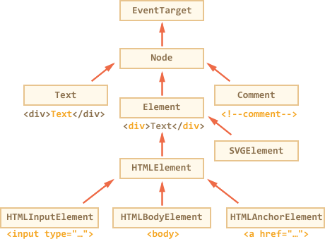
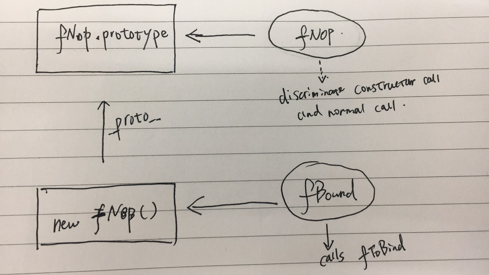
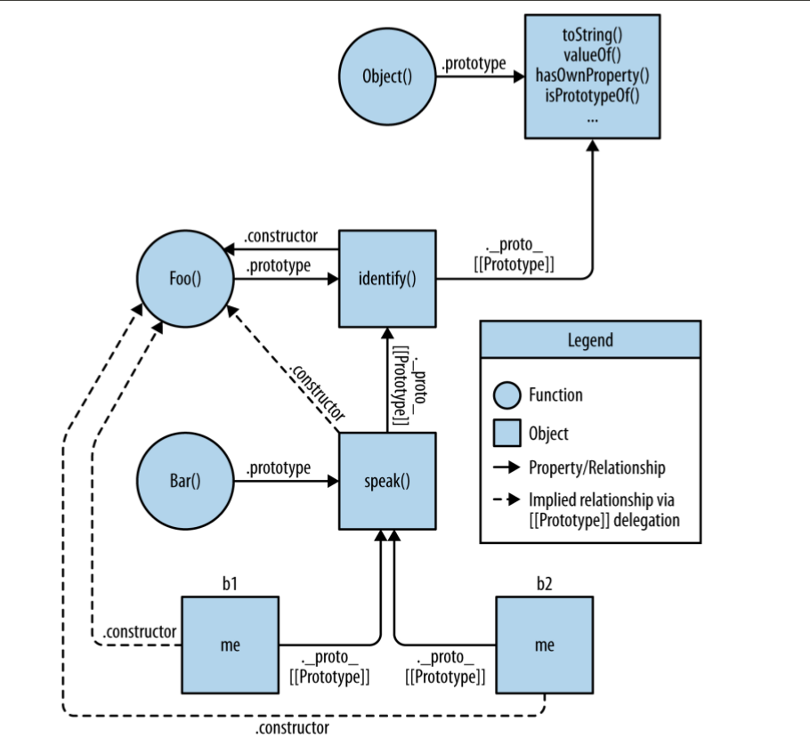
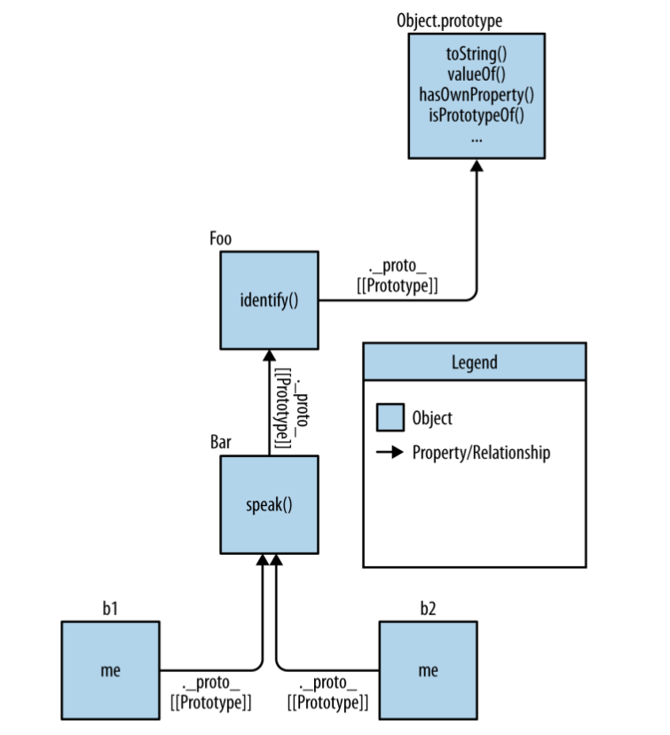

# Javascript

- [Javascript](#javascript)
  - [Host Environment](#host-environment)
    - [**D**ocument **O**bject **M**odel](#document-object-model)
      - [DOM Node](#dom-node)
      - [Traverse DOM](#traverse-dom)
      - [Search DOM](#search-dom)
      - [Table DOM](#table-dom)
    - [HTML Attributes and DOM Properties](#html-attributes-and-dom-properties)
    - [HTML Attributes](#html-attributes)
      - [Property-attribute Synchronization](#property-attribute-synchronization)
      - [DOM Properties](#dom-properties)
    - [DOM Size and Positions](#dom-size-and-positions)
    - [**B**rowser **O**bject **M**odel](#browser-object-model)
  - [DOM Event](#dom-event)
    - [Event Fundamentals](#event-fundamentals)
      - [Event Handler](#event-handler)
      - [Dispatch An Event](#dispatch-an-event)
    - [Event Bubbling and Capturing](#event-bubbling-and-capturing)
    - [Event Delegation](#event-delegation)
    - [Browser Default Action](#browser-default-action)
    - [Sythetic Event](#sythetic-event)
    - [Custom Event](#custom-event)
    - [Events-in-events are synchronous](#events-in-events-are-synchronous)
    - [Detailed Event](#detailed-event)
    - [Reference](#reference)
  - [This](#this)
    - [Rules for Determining this](#rules-for-determining-this)
      - [Constructor Call](#constructor-call)
      - [Explicit Binding](#explicit-binding)
      - [Implicit Binding](#implicit-binding)
      - [Default Binding](#default-binding)
      - [Arrow Function](#arrow-function)
  - [Types and Values](#types-and-values)
    - [Converting values to primitives](#converting-values-to-primitives)
    - [Explicit Type Conversion](#explicit-type-conversion)
      - [Number](#number)
      - [String](#string)
      - [Boolean](#boolean)
    - [Implicit Type Conversion](#implicit-type-conversion)
  - [Prototypes](#prototypes)
    - [**O**bject **O**riented](#object-oriented)
    - [**O**bjects **L**inked to **O**ther **O**bjects](#objects-linked-to-other-objects)
  - [ES6 Class](#es6-class)
    - [Operator Precedence](#operator-precedence)
  - [Javascript Async](#javascript-async)
  - [Callback Execution Order](#callback-execution-order)
  - [Scope](#scope)
    - [Function Scope](#function-scope)
    - [Closure](#closure)
      - [let loops](#let-loops)
    - [Block Scope](#block-scope)
    - [Module Pattern](#module-pattern)
      - [_Lexical Scope_](#lexical-scope)
      - [_Dynamic Scope_](#dynamic-scope)
  - [Redux](#redux)
  - [Generator & Iterator](#generator-iterator)
    - [Iterator & Iterable](#iterator-iterable)
    - [yield](#yield)
    - [Generator Delegation](#generator-delegation)
    - [Yield and Promise](#yield-and-promise)
      - [Promise in Concurrency](#promise-in-concurrency)
      - [Thunk](#thunk)
    - [Generator and this](#generator-and-this)
    - [Generator and State Machine](#generator-and-state-machine)
  - [Async Function](#async-function)
    - [await](#await)
  - [Promise](#promise)
    - [resolve](#resolve)
    - [`then()`](#then)
    - [Thenable](#thenable)
    - [Terminology](#terminology)
    - [API](#api)
    - [Promisory](#promisory)
  - [Performance](#performance)
    - [Web Workers](#web-workers)
    - [**S**ingle **I**nstruction **M**ultiple **D**ata](#single-instruction-multiple-data)
    - [asm.js](#asmjs)
    - [Benchmark.js](#benchmarkjs)
    - [**T**ail **C**all **O**ptimization](#tail-call-optimization)
  - [Module](#module)
    - [CommonJS](#commonjs)
      - [`require()`](#require)
      - [`module.exports` & `exports`](#moduleexports-exports)
    - [ES6 module](#es6-module)
      - [Import](#import)
      - [Export](#export)
  - [Snippets](#snippets)
    - [Debounce](#debounce)
    - [Throttle](#throttle)

## Host Environment

### **D**ocument **O**bject **M**odel

[W3C DOM4 Standard](https://www.w3.org/TR/dom/) and [WhatWG DOM Standard](https://dom.spec.whatwg.org/)


#### DOM Node



1. `EventTarget` is an root abstract class for event support.
1. `Node` is an abstract class serving as base of all nodes.
1. `Element` is an abstract class serving as base of all element nodes.
1. `HTMLElement` is base class of all types of html element.

Form normal javascript object, `console.log` and `console.dir` are no different. But for DOM element object, they are different.

1. `console.log(elem)` shows the element DOM tree.
1. `console.dir(elem)` shows the element as a DOM object, good to explore its properties.

There're 12 [node types](https://dom.spec.whatwg.org/#node), primary ones are as below.

1. document – the “entry point” into DOM.
1. element nodes – HTML-tags, the tree building blocks.
1. text nodes – contain text.
1. comments – sometimes we can put the information there, it won’t be shown, but JS can read it from DOM.

Attributes is what's written in HTML, it's of `DOMString` type and name is case insensitive.

1. `elem.hasAttribute(name)` – checks for existence.
1. `elem.getAttribute(name)` – gets the value.
1. `elem.setAttribute(name, value)` – sets the value.
1. `elem.removeAttribute(name)` – removes the attribute.
1. `elem.attributes` is a collection of all attributes.

DOM properties are property of DOM object, it's name is case sensitive and not always strings, `input.checked` is boolean.

All attributes starting with "data-" are reserved for programmers' use. They are available in dataset property.

Creation

1. `document.createElement('div)`
1. `document.createTextNode('Here I am')`
1. `document.createDocumentFragment()`

Clone

1. `elem.cloneNode(true)` creates a deep clone with all child elements
1. `elem.cloneNode(false)` creates a shallow clone without children.

Insertion

1. `element.appendChild(node)`
1. `element.insertBefore(node, nextSibling)`
1. `element.replaceChild(node, oldChild)`

* `node.append(...nodes or strings)` – append nodes or strings at the end of node,
* `node.prepend(...nodes or strings)` – insert nodes or strings into the beginning of node,
* `node.before(...nodes or strings)` –- insert nodes or strings before the node,
* `node.after(...nodes or strings)` –- insert nodes or strings after the node,
* `node.replaceWith(...nodes or strings)` –- replaces node with the given nodes or strings.


`elem.insertAdjacentHTML(where, html)`, `elem.insertAdjacentText(where, html)`, `elem.insertAdjacentElement(where, html)`

* "beforebegin" – insert html before elem,
* "afterbegin" – insert html into elem, at the beginning,
* "beforeend" – insert html into elem, at the end,
* "afterend" – insert html after elem.


`document.write(<b>Hello</b>)` only works when page is loading. If it's called afterwards, existing document content is erased.

Removal

1. `element.removeChild(node)`
1. `node.remove()`

#### Traverse DOM


`document.body` refers to `<body></body>` element of an html page, but that's valid only when inside `<body></body>` element, for scripts inside `<head></head>` element, `document.body` is `null`.


`document` is the root node of DOM, but it's not an element node. `document.documentElement` is the root element node.

```javascript
document.documentElement.parentNode === document;
document.documentElement.parentElement === null;
```

#### Search DOM

| Method                         | Returns                                     | Context               | Live? |
|:------------------------------ |:------------------------------------------- |:--------------------- | ----- |
| `getElementById(id)`           | single element with `id`                    | `document`            | No    |
| `getElementsByName(name)`      | mutiple elements with `name`                | `document`            | Yes   |
| `getElementsByTagName(name)`   | mutiple elements with `name`                | `document`, `element` | Yes   |
| `getElementsByClassName(name)` | mutiple elements with `name`                | `document`, `element` | Yes   |
| `querySelector(selector)`      | first element matches `selector`            | `document`, `element` | No    |
| `querySelectorAll(selector)`   | mutiple elements matches `selector`         | `document`, `element` | No    |
| `closest(selector)`            | closest ancestor element matches `selector` | `document`, `element` | No    |

Multiple elements is of type `HTMLCollection`.

Query relationship

1. `element.matches(css)` returns boolean value indicating whether `element` matches CSS selector.
1. `elementA.contains(elementB)` returns boolean value indicating whether `elementB` is a descendant of `elementA`.

#### Table DOM

`<table>` element supports (in addition to the given above) these properties:

1. `table.rows` – the collection of `<tr>` elements of the table.
1. `table.caption/tHead/tFoot` – references to elements `<caption>`, `<thead>`, `<tfoot>`.
1. `table.tBodies` – the collection of `<tbody>` elements (can be many according to the standard).

`<thead>`, `<tfoot>`, `<tbody>` elements provide the rows property:

1. `tbody.rows` – the collection of `<tr>` inside.

`<tr>`:

1. `tr.cells` – the collection of `<td>` and `<th>` cells inside the given `<tr>`.
1. `tr.sectionRowIndex` – the number of the given `<tr>` inside the enclosing `<thead>`/`<tbody>`.
1. `tr.rowIndex` – the number of the `<tr>` in the table.

`<td>` and `<th>`:

1. `td.cellIndex` – the number of the cell inside the enclosing `<tr>`.

### HTML Attributes and DOM Properties

### HTML Attributes

HTML attributes are defined by HTML source, all definitions inside HTML tag are atrributes. When html source is parsed, corresponding DOM objects are generated accordingly. They can be manipulated with a set of functions.

```javascript
// manipuate single attribute by name
element.hasAttribute(name)
element.getAttribute(name)
element.setAttribute(name)
element.removeAttribute(name)
```

HTML attributes inside DOM object has two features:

1. Attribute name is case-insensitive.
  ```javascript
  // equivalent forms
  element.getAttribute('id')
  element.getAttribute('iD')
  element.getAttribute('Id')
  element.getAttribute('ID')
  ```
1. Attribute value is always string. `getAttribute(name)` returns a string, `setAttribute(name, value)` converts value to string first and then store it as attribute value.

`element.attributes` is used to access all attributes on a element, it returns a live collection of all attributes of element. Value type is `NamedNodeMap` (iterable) that contains a collection of key/value pair of strings.

#### Property-attribute Synchronization

When a standard HTML attribute changes, the coressponding DOM property is auto-updated, and (with some exceptions) vice versa.

```html
<input>

<script>
  let input = document.querySelector('input');

  // attribute => property
  input.setAttribute('id', 'id');
  alert(input.id); // id (updated)

  // property => attribute
  input.id = 'newId';
  alert(input.getAttribute('id')); // newId (updated)
</script>
```

But there're some exclusions when attribute doesn't follow when property changes.

```html
<input>

<script>
  let input = document.querySelector('input');

  // attribute => property
  input.setAttribute('value', 'text');
  alert(input.value); // text

  // NOT property => attribute
  input.value = 'newValue';
  alert(input.getAttribute('value')); // text (not updated!)
</script>
```

#### DOM Properties

When DOM objects are created, only standard attributes like _id_, _class_ are mapped to corresponding properties of DOM objects, custom attributes are not mapped. Different type of element has different standard attributes.

```javascript
// corresponding to standard attributes
document.getElementById('test').id        // test
document.getElementById('test').className // button
document.getElementById('test').foo       // undefined

// custom properties
document.getElementById('test').foo
$('#test').prop('foo')
document.getElementById('test').foo = 1
$('#test').prop('foo', 1)
```

Prefer to use property instead of `getAttribute()` to get corresponding value because property values are typed.

```javascript
// input.checked has boolean value
document.getElementById('test').checked
document.getElementById('test').checked = true

// input.style is an object
document.getElementById('test').style

// avoid using attribute
document.getElementById('test').getAtribute('checked')
document.getElementById('test').setAtribute('checked') = 'false'
```

Event if a DOM property is a string, it may differ from attribute value. For instance, the `href` DOM property is always a _full_ URL, even if the attribute contains a relative URL or just a hash.

```html
<a id="a" href="#hello">link</a>
<script>
  // attribute
  alert(a.getAttribute('href')); // #hello

  // property
  alert(a.href ); // full URL in the form http://site.com/page#hello
</script>
```

### DOM Size and Positions

1. [Element Size and Scrolling](http://javascript.info/size-and-scroll)
1. [Window Size and Scrolling](http://javascript.info/size-and-scroll-window)
1. [Coordinates](http://javascript.info/coordinates)

### **B**rowser **O**bject **M**odel

BOM is part of [HTML Specification](https://html.spec.whatwg.org/)

Some object on root object `window`

1. navigator
1. location
1. screen
1. history

Some global functions

1. setTimeout/clearTimeout, setInterval/clearInterval, setImmediate
1. alert, confirm, console,

1. [CSSOM Specification](https://www.w3.org/TR/cssom-1/)

## DOM Event

### Event Fundamentals

#### Event Handler

Add handler for `click` event using DOM property `onclick`

```html
<input id="elem" type="button" value="Click me">
<script>
  elem.onclick = function() {
    alert('Thank you');
  };
</script>
```

Add handler for `click` event in html element attribute.

```javascript
<input type='button' value='Click me' onclick="alert(this.value)">
```

Under the background, `onclick` attribute is actually transformed to an event and added to corresponding DOM property.

```javascript
let handler = new Function("alert(this.value)");
elem.onclick = handler;
```

Add event handler using `addEventListener(event, handler[, phase])`, remove event handlers with `removeEventListener(event, handler[, phase])`. Exact event handler must be passed to remove it.

```javascript
elem.addEventListener("click", () => alert("Thanks!"));
// Not working, two different arrow function.
elem.removeEventListener("click", () => alert("Thanks!"));
```

Multiple handlers can be added with `addEventListner()`, and they are called in the same order when they are added.

Some event handlers only work with `addEventListener` like `transitioned` event (CSS animation finished).

```javascript
button.addEventListener("click", () => alert("1"));
button.removeEventListener("click", () => alert("1"));
button.onclick = () => alert(2);

// triggers 1 and 2
```

`button.onclick` only accepts a single handler function, and it works independent of as well as in addition to `addEventListener`.

#### Dispatch An Event

Dispatch an event.

```javascript
/*
* throws {UNSPECIFIED_EVENT_TYPE_ERR} if event type is null, empty string or not specified in constructor.
* returns {boolean} false if event is cancellable and at least one of corrosponding event handlers called `event.preventDefault()`, `true` otherwise.
*/
cacelled = !target.dispatchEvent(event);
```

### Event Bubbling and Capturing

When an event happens, it goes through 3 phases of event processing.

| Phase          | Explaination                                               |
| -------------- | ---------------------------------------------------------- |
| Capture Phase  | Events passed downward from root element to target element |
| Target Phase   | Events on target element                                   |
| Bubbling Phase | Events bubbling upward from target element to root element |

Event handlers can be invoked in any phase.

1. Use `element.addEventListener(event, handler, true)` to add handlers to be invoked in capture phase at `element`.
1. Use `element.addEventListener(event, handler)` or `element.addEventListener(event, handler, false)` or `element.on(event, handler)` to add handlers to be invoke in bubbling phase.
1. Target phase handlers can be devided as capture phase handlers and bubbling phase handlers. They are added with corresponding method as above. Capture phase event handlers on target element are invoked firstly, then bubbling phase event handlers on target element are invoked.

During the process of event flow, `event.target` is always the target element, `<td>` in this case, `this` in handler and `event.currentTarget` points to current element event is on, `event.eventPhase` is `1` for capture phase, `2` for target phase and `3` for bubbling phase.

Execution order of event handlers are the same as event flow.

1. Capture phase handlers first, target phase handlers second, bubbling phase handlers last.
1. Inside target phase, execution order of two types of event handlers follow the same rule.
1. Multiple event handlers can be added to single element. First added event handlers are invoked first.


Normal event flow can be changed inside handler function.

1. `event.stopPropagation()` can stop event from passing to next element both inside capture phase and bubbling phase. But it cannot prevent event handlers on same element from being invoked.
1. Use `event.stopImmediatePropgation()` to prevent event handlers on same element from being invoked and stop normal event flow.

Though normal event flow can be changed mannualy, but don't do it without obvious benefit and clear intention. For example, if event is stopped in bubbling phase on an element, we are not able to catch this event on root element to perform some general operation like dragging.

Almost all events go through bubbling phase, but there're exceptions. `focus` event is not bubbled up by default.

`event.preventDefault()` prevents default behaviour of event from happening.

### Event Delegation

Since there's the bubbling phase of events, events on descendant element can be handled on ancestor element, this is called event delegation, which means to delegate events on desendant element to ancestor element. `event.target` gives us original element where event happened, `event.currentTarget` gives us current element where event is handled, so that we have complete information to handle event that interests us.

This can simplifies handler code and reduces memory usage, since we can handle multiple events in single handler on ancestor element instead of adding one handler for each descendant element. DOM structure of descendant elements can change as long as ancestor handler logic is not broken by it.

Event delegation requires event bubbling to work properly, and it takes a remote risk for handling unecessary descendant events on ancestor element.

### Browser Default Action

There are default behaviours by browser for certain events.

1. A click on a link cause web page to go to destination address.
1. A click on submit button inside a form causes form to be submitted.
1. Pressing a mouse button over a text and moving it selects text.

These default actions can be prevented.

1. Use `event.preventDefault()` inside handler.
1. Return `false` inside handler if handler is added by `on<event>` property (not by `addEventListener`). Return value of event handler are ignored in most cases, only `return false` inside handlers added by `on<event>` are processed and indicates to prevent default action. A explicit `return true` is not needed.

There are some events incured by other events. Like `click` event on `input` element will trigger `focus` event automatically. If we prevent default behaviour of `click` event on `input` element, it will not be focused automatically. Be careful in these cases.

If an event on descendant element is handled manually and its default actions are prevented, `event.defaultPrevented` will be `true`. The event follows the normal event flow and bubbles up to ancestor element, if it's not appropriate to handle the event again on ancestor element, check value of `event.defaultPrevented` and handle accordingly. Typical case would be two context menus pops up if `contextmenu` event is handle both on descendant and on ancestor element.

### Sythetic Event

Sythetic events are script generated built-in type events.

```javascript
/*
* bubbles: whether event bubbles up.
* cancelable: whether event can be cancelled.
* composed: whether event will trigger listeners outside of a shadow root
*/
interface EventOption {
    bubbles?: boolean = false;
    cancelable?: boolean = false;
    composed?: boolean = false;
}

let event = new Event(type: DOMString, options?: EventOption)
```

Use `element.dispatchEvent(event)` to dispatch sythetic event on an element. `event.isTrusted` is a boolean value to tell apart events generated by user actions and scripts, `true` for user generated events, `false` for script generated events.

Note that general event constructor dosen't accept data except `bubbles`, `cancelable` and `composed`, choose an appropriate sub event constructor if extra data are required.

```javascript
let event = new MouseEvent("click", {
  bubbles: true,
  cancelabel: true,
  clientX: 100, // ignored in general event constructor
  clientY: 100 // ingored in general event constructor
});
```

Sythetic events are often used to simulate user actions in automatic testing.

```javascript
function simulateClick() {
  var event = new MouseEvent("click", {
    view: window,
    bubbles: true,
    cancelable: true
  });
  var cb = document.getElementById("checkbox");
  var cancelled = !cb.dispatchEvent(event);
  if (cancelled) {
    // A handler called preventDefault.
    alert("cancelled");
  } else {
    // None of the handlers called preventDefault.
    alert("not cancelled");
  }
}
```

There exists an old-fashioned way of constructing events using `initEvent(type, bubbles, cancellable)`, it's already deprecated.

### Custom Event

Use `CustomEvent` to generate customized event with an event type different from any built-in events. `CustomEvent` is same as `Event` with one exception that it accepts a property `detail` in second argument of constructor. `detail` property avoids clash with built-in event type and passes data required by custom event.

```javascript
let event = new CustomEvent("unique-type", {
  detail: { name: "John" }
});
```

`element.dispatch(customEvent)` returns `false` and `customEvent.defaultPrevented` is `true` if custom event is cancellable and `event.preventDefault()` is called. Check it to apply some default actions for custom event.

```html
<pre id="rabbit">
  |\   /|
   \|_|/
   /. .\
  =\_Y_/=
   {>o<}
</pre>

<script>
  // hide() will be called automatically in 2 seconds
  function hide() {
    let event = new CustomEvent("hide", {
      cancelable: true // without that flag preventDefault doesn't work
    });
    if (!rabbit.dispatchEvent(event)) {
      alert('the action was prevented by a handler');
    } else {
      rabbit.hidden = true;
    }
  }

  rabbit.addEventListener('hide', function(event) {
    if (confirm("Call preventDefault?")) {
      event.preventDefault();
    }
  });

  // hide in 2 seconds
  setTimeout(hide, 2000);

</script>
```

### Events-in-events are synchronous

Usually events are processed asynchronously. If during the process of one event, other events are triggered by users, browsers will first finish handling current event and the keep handling newly triggered events in a sequential order.

However, if other event is dispatched inside an event handler, broswer will first handles newly triggered event, then resume execution of current event handler.

```html
<button id="menu">Menu (click me)</button>

<script>
  // 1 -> nested -> 2
  menu.onclick = function() {
    alert(1);

    // alert("nested")
    menu.dispatchEvent(new CustomEvent("menu-open", {
      bubbles: true
    }));

    alert(2);
  };

  document.addEventListener('menu-open', () => alert('nested'))
</script>
```

Dispatch event at the end of handler function or use `setTimeout(..., 0)` for an asynchrounous event.

```html
<button id="menu">Menu (click me)</button>

<script>
  // 1 -> 2 -> nested
  menu.onclick = function() {
    alert(1);

    // alert(2)
    setTimeout(() => menu.dispatchEvent(new CustomEvent("menu-open", {
      bubbles: true
    })), 0);

    alert(2);
  };

  document.addEventListener('menu-open', () => alert('nested'))
</script>
```

### Detailed Event

[Detailed event](http://javascript.info/event-details)

### Reference

1. [W3C DOM4 Standard](https://www.w3.org/TR/dom/)
1. [WhatWG DOM Standard](https://dom.spec.whatwg.org/)
1. [HTML Specification](https://html.spec.whatwg.org/)
1. [CSSOM Specification](https://www.w3.org/TR/cssom-1/)
1. [Browser: Document, Event, Interfaces](https://javascript.info/ui)
1. [UI Events Specification](https://www.w3.org/TR/uievents/)
1. [Event Object API](https://developer.mozilla.org/en-US/docs/Web/API/Event)
1. [Event Reference](https://developer.mozilla.org/en-US/docs/Web/Events)
1. [Event Interface](https://dom.spec.whatwg.org/#interface-event)
1. [Custom Event Interface](https://dom.spec.whatwg.org/#customevent)

## This

When a function is called, a execution context related to the specific function
call is created to record related information. When function call ends,
execution context is destroyed. Function execution context includes:

1. call stack, a stack of function calls with current function at stack top,
   next below it is the function that calls current function, at the stack
   bottom is the program entrance function.
1. call site, the position of function call in the source code like `a.foo()`.
1. function call parameters
1. function call context represented by `this` keyword used in function

`this` is dynamically determined when function is called, so that functions can
be easily reused on different object as context.

### Rules for Determining this

Value of `this` in a function can be decided following several rules in
sequencial order.

#### Constructor Call

Normal function calls return values explicitly (with `return` keyword) or
implicitly (undefined). But when function is called with `new` keyword, it works
as a constructor call to construct and return a new object. An empty object is
created first and then bound to `this` keyword in constructor call. After
function call finishes, it's returned as newly constructed object.

#### Explicit Binding

There're two function `Function.prototype.call` and `Function.prototype.apply`
that is able to specify the value of `this` explicitly.

```javascript
const Alice = { name: "Alice" };
const Bob = { name: "bob" };

function greet() {
  console.log(`hello ${this.name}`);
}

fun.apply(thisArg, [argsArray]);

greet.call(Alice); // hello Alice
greet.apply(Alice); // hello Alice

greet.call(Bob); // hello Bob
greet.apply(Bob); // hello Bob
```

`this` in `greet()` is bounded to first parameter of `call` and `apply` on call
site, so `greet()` output corresponding `name` property.

Difference of `call` and `apply` is they forward parameters.

```javascript
Function.prototype.call(thisArg, arg1, arg2, ...)
Function.prototype.apply(thisArg, [argsArray])

greet.call(Alice, '1', '2', '3')
greet.apply(Alice, ['1', '2', '3'])

greet('1', '2', '3')    // this = Alice
```

`call` receives comma separated parameters and forward them to `greet`. `apply`
receives an array of parameters, spread them and forward them to `greet`.

`bind` function can be used to create a function with its `this` bound to a
fixed value.

```javascript
const greetWithThisBoundToAlice = greet.bind(Alice);

greetWitThisBoundToAlice(); // hello Alice
```

`greetWithThisBoundToAlice` has the same function of `greet`, only that `this`
value for `greet` inside `greetWithThisBoundToAlice` is always `Alice`.
Actually, `greetWithThisBoundToAlice` is just a wrapper function for `greet`, it
forwards parameters to and calls `greet` with `this` keyword for `greet` bound
to 'Alice'.

```javascript
if (!Function.prototype.bind) {
  Function.prototype.bind = function(oThis) {
    if (typeof this !== "function") {
      // closest thing possible to the ECMAScript 5
      // internal IsCallable function
      throw new TypeError(
        "Function.prototype.bind - what is trying to be bound is not callable"
      );
    }

    var aArgs = Array.prototype.slice.call(arguments, 1)
    var fToBind = this
    var fNOP = function() {}
    var fBound = function() {
        return fToBind.apply(
          this instanceof fNOP ? this : oThis,
          aArgs.concat(Array.prototype.slice.call(arguments))
        )
      }

    // maintain prototype chain
    if (this.prototype) {
      // Function.prototype doesn't have a prototype property
      fNOP.prototype = this.prototype;
    }
    fBound.prototype = new fNOP();

    return fBound;
  };
}
```

1. `Function.prototype.bind` returns function `fBound` which calls original
   function `fToBind` with a fixed `this` value.
1. Function arguments of `bind` except first one are concatnated with arguments
   of `fBound` and then passed to original function `fToBind`
1. Notice that when bound function `fBound` is used as constructor call,
   constructor call rule precedes `bind` function. This is the result of tenary
   expression `this instanceof fNOP ? this : othis`.



`fNOP` is a function inaccessible outside `bind()`, and it's used to decide
whether `fBound` is used in constructor call or a normal function call. When
function are used as constructor call, newly constructed object `Obj` is bound
to `this`, which is an instance of `fBound`. It means

```javascript
let obj = new fBound();
obj instanceof fBound === true;
Object.getPrototypeOf(obj) === fBound.prototype;
```

Since

```javascript
fBound.prototype = new fNOP();
```

So

```javascript
Object.isPrototypeOf(fNOP.prototype, obj) === true;
obj instanceof fNOP === true;
this instanceof fNOP === true;
```

Then

```javascript
this instanceof fNOP ? this : oThis;
```

implies that constructor call rule precedes bind function when deciding `this`
value.

When `null` or `undefined` is passed to `call`, `apply`, `bind`, it's ignored
and default binding rule applies. This is often used in function currying.
Consider use `Object.create(null)` instead of `null` or `undefined` to avoid
potential affection on global object.

#### Implicit Binding

```javascript
function foo() {
  console.log(this.a);
}

var obj = {
  a: 2,
  foo: foo
};

obj.foo(); // 2
```

Function `obj.foo()` is called with `obj` in this call site, so `this` is
implicitly bound to `obj`.

#### Default Binding

```javascript
function foo() {
  console.log(this.a);
}
var a = 2; // a is window.a in browser environment
foo(); // 2
```

Function `foo()` is called without implicit or explicit binding, by default
`this` is bound to global object `window` in browser environment. In strict
mode, `this` is not allowed to be bound on global object, an error will be
raised.

Since default binding is possibly not what we desired. We can create a bind
function to avoid default binding.

```javascript
if (!Function.prototype.softBind) {
    Function.prototype.softBind = function(obj) {
        var fn = this;
        // capture any curried parameters
        var curried = [].slice.call( arguments, 1 );
        var bound = function() {
        return fn.apply(
            (!this || this === (window || global)) ?
            obj : this
            curried.concat.apply( curried, arguments )
            );
        };
        bound.prototype = Object.create( fn.prototype );
        return bound;
    };
}
```

It checks whether `this` is `null` or `undefined` or being bound to `window` or
`global`. If true, replace it with `obj`.

#### Arrow Function

Inside arrow function, `this` value is bound to lexical socpe dynamically when
arrow function is created.

```javascript
const globalScope = () => {
  console.log("this bound to global: ", this);
};

function foo() {
  return a => {
    // `this` here is lexically inherited from `foo()`
    console.log(this.a);
  };
}

var obj1 = { a: 1 };
var obj2 = { a: 2 };
var boundToObj1 = foo.call(obj1);
boundToObj1(); // 1
boundToObj1.call(obj2); // 1

var boundToObj2 = foo.call(obj2);
boundToObj2(); // 2
boundToObj2.call(obj1); // 2

boundToObj1 !== boundToObj2;
```

`this` is bound to global object when arrow functions are created in global
lexical scope. `this` is bound to `this` value of function when arrow function
are created inside function scope. Arrow functions created inside function
lexical scope are different ones each time outer function is called.

Once bound, `this` value of arrow functions cannot be changed by any other
methods including explicit or implicit binding. Arrow functions cannot be used
with `new` keyword as a constructor call, otherwise an error `TypeError 'x' is not a constructor` will be raised.

## Types and Values

Javascript have 6 primitive data types

1. string, `typeof 'hello' === 'string'`
1. number, `typeof 1.0 === 'number'`
1. boolean, `typeof true === 'boolean'`
1. null, `typeof null === 'object'`
1. undefined, `typeof undefined === 'undefined'`
1. symbol (ES6), `typeof Symbol() === 'symbol'`
1. object, `typeof {a: 1} === 'object'`

Notice that, value `null` if of type `null`, but `typeof null` returns 'object',
this is an bug because of implementation.

and some built-in object.

1. String
1. Number
1. Boolean
1. Object
1. Function
1. Array
1. Date
1. RegExp
1. Error

Like `typeof new String('1') === 'object'`, `typeof` returns `'object'` for
object values. Use `Object.prototype.toString.call(obj)` to inspect on object
subtyupes, `Object.prototype.toString.call(/i/) === '[object RegExp]'`.

Property descriptors:

1. writable, `false` means properties cannot be overwritten.
1. configurable, `false` prevents delete property `delete a.prop` and other
   property descriptor values to change. One exception is that `writable` was
   allow to change from `true` to `false`, which tightens restrictions on object
   property. Once `configurable` is set to `false`, there's no way back.
1. enumerable, `false` means properties are not enumerable in `for .. in` loop.

Property Management

1. `Object.preventExtensions(obj)`, cannot add new object properties.
1. `Object.seal(obj)`, `configurable` is false, cannot add, delete, reconfigure
   properties
1. `Object.freeze(obj)`, `writable` is false, cannot add, delete, reconfigure or
   write objec properties.

Accessing Property

```javascript
myObject.foo = "bar";

myObject.foo++; // This may create a new property 'foo' on myObject implicitly
myObject.foo = myObject.foo + 1;
```

1. If a normal property named `foo` is found on `myObject`, it's overwritten if
   writable.
1. If a set accessor property named `foo` is found on `myObject`, execute it.
1. If a normal accessor property named `foo` is found on prototype of
   `myObject`, if property is writable, then a `foo` property is created on
   `myObject`, which shadows `foo` property on prototype of `myObject`. If
   property is non-writable, shadowing is not allowed.
1. If a set accessor property named `foo` is found prototype of `myObject`,
   execute it.

Some of the native prototypes aren't just plain objects

```javascript
typeof Function.prototype; // 'function'
Function.prototype(); // it's an empty function

typeof RegExp.prototype; // 'object'
RegExp.prototype.toString(); // "/(?:)/" -- empty regex
"abc".match(RegExp.prototype); // [""]

typeof Array.prototype; // 'object'
Array.isArray(Array.prototype); // it's an empty array
```

So `Funtion.prototype`, `Array.prorotype`, `RegExp.prorotype` can be used as
default value of corresponding type.

Avoid using sparse array.

```javascript
let a = new Array(1, 2, 3);
a; // [1, 2, 3]

let b = new Array(3); // single parameter 3, no slots
b.length; // 3

let c = Array.apply(null, { length: 3 }); // 3 slots with value as undefined

let c = [undefined, undefined, undefined];
```

Internal method `ToPrimitive` used to convert Symbol to primitive values.

```javascript
1 + Symbol("b"); // TypeError: Cannot convert a Symbol value to a number
"1" +
  Symbol("b")// TODO: how tagged literal string is evaluated ? // TypeError: Cannot convert a Symbol value to a string
  `${Symbol("b")}`; // TypeError: Cannot convert a Symbol value to a string
```

### Converting values to primitives

Internal operation `ToPrimitive()` is used to convert values to primitive values.

```javascript
ToPrimitive(input, PreferredType?)
```

The optional paramter `PreferredType` is either `number` or `string`, it's only a preference, not always exact result type. Following steps can be used to determine result of `ToPrimitive()` call.

```javascript
const isPrimitive = value => value === null || typeof value !== 'object'

/*
* @param {any} [input] (value to convert)
* @param {string} [preferredType] (can only be 'string' or 'number'.
* If it's omitted, set it to 'string' for instances of Date or to 'number' for other values)
*/
function ToPrimitive(input, preferredType) {
  // 1. If `input` is primitive value, return as it is.
  if (isPrimitive(input)) {
    return input
  }

  preferredType = input instanceof Date ? 'string' : 'number'

  // 2. check result of `input.valueOf()` first if preferredType is number
  if (preferredType === 'number') {
    const valueOfResult = input.valueOf()
    if (isPrimitive(valueOfResult)) {
      return valueOfResult
    }

    const toStringResult = input.toString()
    if (isPrimitive(toStringResult)) {
      return toStringResult
    }

    throw new TypeError('Cannot convert value to primitve')
  }

  // 3. check result of `input.toString()` first if preferredType is string
  if (preferredType === 'string') {
    const toStringResult = input.toString()
    if (isPrimitive(toStringResult)) {
      return toStringResult
    }

    const valueOfResult = input.valueOf()
    if (isPrimitive(valueOfResult)) {
      return valueOfResult
    }

    throw new TypeError('Cannot convert value to primitve')
  }
}
```

### Explicit Type Conversion

#### Number

Function `Number()` to convert parameter to number explicitly. Primitive values are converted to number directly. Object value is converted to primitive value using internal operation `ToPrimitive()` first, then its result is converted to number.

```javascript
// for clarification, not actual implementation
function ToNumber(value) {
  // converts value to primitive first if it's object
  if (!isPrimitive(value)) {
    ToNumber(ToPrimitive(value, 'number'))
  }

  // convert primitive value to number directly
  if (value === undefined) {
    return NaN
  }

  if (value === null) {
    return +0
  }

  if (value === true) {
    return 1
  }

  if (value === false) {
    return +0
  }

  if (typeof value === 'number') {
    return value
  }

  // Number('324abc') : NaN for values cannot converted to number
  // Number('') : 0
  if (typeof value === 'string') {
    return Number.parseInt(value)
  }
}
```

`Number()` converts most object to `NaN`, only array with single element convertable to number itself may be converted to number.

```javascript
// Converts object to number
Number({a: 1})      // NaN
Number([1, 2, 3])   // NaN
Number([3])         // 3, [3].toString() is '3'
```

#### String

Function `String()` converts parameters to string explicitly. Primitive values are converted to string directly. Object values are converted to primitive values first, then its result is converted to string.

```javascript
// for clarification, not actual implementation
function ToString(value) {
  // converts value to primitive first if it's object
  if (!isPrimitive(value)) {
    ToString(ToPrimitive(value, 'string'))
  }

  // convert primitive value to number directly
  if (value === undefined) {
    return 'undefined'
  }

  if (value === null) {
    return 'null'
  }

  if (value === true) {
    return 'true'
  }

  if (value === false) {
    return 'false'
  }

  if (typeof value === 'string') {
    return value
  }

  if (typeof value === 'number') {
    return `${value}`
  }
}
```

#### Boolean

Function `Boolean()` converts parameters to boolean explicitly.

```javascript
// convert basic types to boolean
function ToBoolean(value) {
  // object value converted to true
  if (!isPrimitive(value)) {
    return true
  }

  if (value === undefined || value === null
  ) {
    return false
  }

  if (typeof value === 'number') {
    // NaN converted to false
    if (Number.isNaN(value)) {
      return false
    }

    // includes +Infinity and -Infinity
    return value !== 0
  }

  if (typeof value === 'string') {
    return value.length > 0
  }
}
```

All objects are converted to `true` by function `Boolean()`.

```javascript
Boolean({})                   // true
Boolean([])                   // true
/* true, notice difference between primitive boolean
*  value and corresponding boolean object
*/
Boolean(new Boolean(false))   // true
```

### Implicit Type Conversion

Values maybe converted to boolean automatically where boolean is expected.

```javascript
// 1. if statement
if (null)

// 2. tenary expression
expression ? true : false

// 3. logic operators
!expression
expression1 || expression2
```

Evaluation process of addition expression `value1 + value2`.

1. Convert both operands to primitives.
    ```javascript
    primitive1 = ToPrimitive(value1)
    primitive2 = ToPrimitive(value2)
    ```
1. If either `primitive1` or `primitive2` is string, convert them both to string and return concatenation of the results.
1. Otherwise convert both `primitive1` and `primitive2` to numbers and return sum of the results.

Only addition operator (+) will convert operands to string.

```javascript
{} + {}     // '[object Object][object Object]'
```

All other operators including unary plus (+) or unary mins (-) convert value to number.

```javascript
// Only a string and another value is added (+), the other values is
// converted to string automatically
'5' + 1 // '51'
'5' + true // "5true"
'5' + false // "5false"
'5' + {} // "5[object Object]"
'5' + [] // "5"
'5' + function (){} // "5function (){}"
'5' + undefined // "5undefined"
'5' + null // "5null"

null + 1      // 1
undefined + 1 // NaN
'5' - '2'     // 3
'5' * '2'     // 10
true - 1      // 0
false - 1     // -1
'1' - 1       // 0
'5' * []      // 0
false / '5'   // 0
'abc' - 1     // NaN

+'abc'        // NaN
-'abc'        // NaN
+true         // 1
-false        // 0
```

Some weired cases when

```javascript
{} + {}   // NaN
{} + []   // 0

// first block is not considers as an object but an emtpy block, thus
+ {}    // convert to number NaN
+ []    // convert to number 0

({} + {})   // '[object Object][object Object]'
({} + [])   // `[object Object]`
```

Reference

1. [Object Plus Object](http://2ality.com/2012/01/object-plus-object.html)

## Prototypes

### **O**bject **O**riented

```javascript
function Foo(who) {
  this.me = who;
}

Foo.prototype.identify = function() {
  return "I am " + this.me;
};

function Bar(who) {
  Foo.call(this, who);
}

Bar.prototype = Object.create(Foo.prototype);
Bar.prototype.speak = function() {
  alert("Hello, " + this.identify() + ".");
};

var b1 = new Bar("b1");
var b2 = new Bar("b2");
b1.speak();
b2.speak();
```



### **O**bjects **L**inked to **O**ther **O**bjects

```javascript
Foo = {
  init: function(who) {
    this.me = who;
  },
  identify: function() {
    return "I am " + this.me;
  }
};

Bar = Object.create(Foo);
Bar.speak = function() {
  alert("Hello, " + this.identify() + ".");
};

var b1 = Object.create(Bar);
b1.init("b1");
var b2 = Object.create(Bar);
b2.init("b2");
b1.speak();
b2.speak();
```



## ES6 Class

`super` keyworkd in class constructor is statically bound, so when class(which is actually a function) prototype changes later, `super` remains the same value.

```javascript
// r1 r2 is executed sequentially
function* foo() {
  var r1 = yield request("http://some.url.1");
  var r2 = yield request("http://some.url.2");

  var r3 = yield request(`http://some.url.3/?v="${r1},${r2}`);

  console.log(r3);
}

// p1 p2 is executed in parallel
function* foo() {
  var p1 = yield request("http://some.url.1");
  var p2 = yield request("http://some.url.2");

  var r1 = yield p1;
  var r2 = yield p2;

  var r3 = yield request(`http://some.url.3/?v="${r1},${r2}`);

  console.log(r3);
}

// p1 p2 is executed in parallel
function* foo() {
  var [r1, r2] = yield Promise.all([
    request("http://some.url.1"),
    request("http://some.url.2")
  ]);

  var r3 = yield request(`http://some.url.3/?v="${r1},${r2}`);

  console.log(r3);
}

// better to hide it in another fuction
function bar(url1, url2) {
  return Promise.all([request(url1), request(url2)]);
}

// p1 p2 is executed in parallel
function* foo() {
  var [r1, r2] = yield bar("http://some.url.1", "http://some.url.2");

  var r3 = yield request(`http://some.url.3/?v="${r1},${r2}`);

  console.log(r3);
}
```

`super` keyworkd in class constructor is statically bound, so when class(which
is actually a function) prototype changes later, `super` remains the same value.

### Operator Precedence

[Operator Precedence MDN](https://developer.mozilla.org/en-US/docs/Web/JavaScript/Reference/Operators/Operator_Precedence)

```javascript
function Foo() {
    getName = function () { console.log(1); }
    return this;
}

Foo.getName = function () { console.log(2); }
Foo.prototype.getName = function () { console.log(3); }

var getName = function () { console.log(4); }
function getName () { console.log(5); }

Foo.getName();              // 2
getName();                  // 4
Foo().getName();            // Foo() returns global object, returns 4 in chrome, raise error in node cause global.getName === getName is not false.
getName();                  // 4
new Foo.getName();          // 2, new (Foo.getName)();
new Foo().getName();        // 3, (new Foo()).getName();
new new Foo().getName();    // 3. new ((new Foo()).getName)();
```

## Javascript Async

```javascript
// Make an async HTTP request
var async = true;
var xhr = new XMLHttpRequest();
xhr.open("get", "data.json", async);
xhr.send();
// Create a three second delay (don't do this in real life)
var timestamp = Date.now() + 3000;
while (Date.now() < timestamp);
// Now that three seconds have passed,
// add a listener to the xhr.load and xhr.error events
function listener() {
  console.log("greetings from listener");
}
xhr.addEventListener("load", listener);
xhr.addEventListener("error", listener);
```

不管`xhr.send()`在 listener 注册之前还是之后完成，`load`和`error`回调函数都会被调用 . `Run-to-completion`和`EventLoop`, 必须先运行完注册代码，然后才会处理`xhr.send()`完成所添加到事件队列中的事件 (event).

```javascript
var async = true;
var xhr = new XMLHttpRequest();
xhr.open("get", "data.json", async);
xhr.send();

setTimeout(function delayed() {
  function listener() {
    console.log("greetings from listener");
  }
  xhr.addEventListener("load", listener);
  xhr.addEventListener("error", listener);
}, 1000);
```

`xhr`添加 listener 函数在回调中，这种情况下是 racing condition. 只有注册
listener 先被调用，才能正常触发回调函数。

## Callback Execution Order

```javascript
var promise = new Promise(function(resolve, reject) {
  console.log("Inside the resolver function"); //1
  resolve();
});

promise.then(function() {
  console.log("Inside the onFulfilled handler"); //3
});

console.log("This is the last line of the script"); //2
```

resolver 函数是同步的，传给`then`和`catch`的 callback 是异步的 .

## Scope

1. global scope
1. function scope
1. block scope

### Function Scope

1. Function declarations are hoisted to top of current scope first.
1. Then variable delcarations are hoisted to top of current scope. Variable assignments are not hoisted and stay where they are, otherwise normal logic will be broken. Declared variable has default value of `undefined` until it's defined.
1. Reassignment of variable of same name overwrites previous value.

```javascript
foo() // 2
var foo = function() { console.log(1) }
foo() // 1

function foo() { console.log(2) }
```

After hoisted.

```javascript
function foo() { console.log(2) }

foo() // 2
var foo = function() { console.log(1) } // overwrite previous value
foo() // 1
```


```javascript
foo(); // TypeError
bar(); // ReferenceError

var foo = function bar() {
  console.log("bar is ", bar);
};
```

Usage of undeclared variable raises `ReferenceError`. Usage of declared but not defined varaible as function raises `TypeError`.

```javascript
var foo;

foo(); // foo is declared but not defined, so foo is undefined now -> TypeError
bar(); // bar is not declared in global scope -> ReferenceError

foo = function bar() {
  var bar = self; // bar is hoisted
};
```

### Closure

```javascript
// timeline: 0s --> 1s --> 2s --> 3s --> 4s --> 5s
// output:          5      5      5      5
for (var i = 1; i < 5; i++) {
    setTimeout(function timer() {
        console.log(i)
    }, i * 1000)
}

// timeline: 0s --> 1s --> 2s --> 3s --> 4s --> 5s
// output:          5      5      5      5
// j is inside timer, no closure for j happen. so each time timer()
// is called, j is assigned 5, which is value of i after loop ends.
for (var i = 1; i < 5; i++) {
    setTimeout(function timer(j) {
        var j = i
        console.log(j)
    }, i * 1000)
}

// timeline: 0s --> 1s --> 2s --> 3s --> 4s --> 5s
// output:          5      5      5      5
for (var i = 1; i < 5; i++) {
    (function() {
        setTimeout(function timer() {
            console.log(i)
        }, i * 1000)
    })()
}

// timeline: 0s --> 1s --> 2s --> 3s --> 4s --> 5s
// output: nothing, IIFE not executed, notice parenthese
for (var i = 1; i < 5; i++) {
    (function() {
        setTimeout(function timer() {
            console.log(i)
        }, i * 1000)
    })
}

// timeline: 0s --> 1s --> 2s --> 3s --> 4s --> 5s
// output:          4      4      4      4
// i,j are both variables inside for block, their values are shared between
// multiple loops
for (var i = 1; i < 5; i++) {
    var j = i
    setTimeout(function timer(j) {
        console.log(j)
    }, i * 1000)
}

// timeline: 0s --> 1s --> 2s --> 3s --> 4s --> 5s
// output:          1      2      3      4
// each loop creates a closure of j inside an IIFE
for (var i = 1; i < 5; i++) {
    (function() {
        var j = i
        setTimeout(function timer() {
            console.log(j)
        }, i * 1000)
    })()
}

// timeline: 0s --> 1s --> 2s --> 3s --> 4s --> 5s
// output:          1      2      3      4
// each loop creates a closure of j inside an IIFE
for (var i = 1; i < 5; i++) {
    (function(j) {
        setTimeout(function timer() {
            console.log(j)
        }, i * 1000)
    })(i)
}

// timeline: 0s --> 1s --> 2s --> 3s --> 4s --> 5s
// output:          1      2      3      4
// let/const creates a block scope closure on each iteration
for (let i = 1; i < 5; i++) {
    setTimeout(function timer() {
        console.log(i)
    }, i * 1000)
}

// timeline: 0s --> 1s --> 2s --> 3s --> 4s --> 5s
// output:          1      2      3      4
// let/const creates a block scope closure on each iteration
for (var i = 1; i < 5; i++) {
    let j = i
    setTimeout(function timer() {
        console.log(j)
    }, i * 1000)
}

for (let i = 0; i< 5; i++>) {

}
```

#### let loops

```javascript
for (let i = 0; i < 10; i++) {
  console.log(i);
}

// equivalent to below
{
  let j; // single variable 'j' shared between every iteration
  for (j = 0; j < 10; j++) {
    let i = j; // a new block scope i binds to j each iteration
    console.log(i);
  }
}
```

### Block Scope

Simulate block scope with pre-ES6 code. In ES5 with and catch block uses block
scope.

```javascript
// ES6
{
  let a = 2;
  console.log(a); // 2
}

console.log(a); // ReferenceError
```

```javascript
// ES5, sick as fuck
try {
  throw 2;
} catch (a) {
  console.log(a); // 2
}

console.log(a); // ReferenceError
```

### Module Pattern

```javascript
var MyModules = (function Manager() {
  var modules = {};
  function define(name, deps, impl) {
    console.log("deps: ", deps);
    for (var i = 0; i < deps.length; i++) {
      console.log(`deps[${i}]: `, deps[i]);
      deps[i] = modules[deps[i]];
    }
    modules[name] = impl.apply(impl, deps);
  }
  function get(name) {
    return modules[name];
  }
  return {
    define: define,
    get: get
  };
})();

MyModules.define("bar", [], function() {
  function hello(who) {
    return "Let me introduce: " + who;
  }
  return {
    hello: hello
  };
});

MyModules.define("foo", ["bar"], function(bar) {
  var hungry = "hippo";
  function awesome() {
    console.log(bar.hello(hungry).toUpperCase());
  }
  return {
    awesome: awesome
  };
});

var bar = MyModules.get("bar");
var foo = MyModules.get("foo");
console.log(bar.hello("hippo")); // Let me introduce: hippo
foo.awesome(); // LET ME INTRODUCE: HIPPO
```

#### _Lexical Scope_

```javascript
function foo() {
  console.log(a); // 2
}

function bar() {
  var a = 3;
  foo();
}

var a = 2;
bar();
```

1. `bar()` executed
1. `foo()` is called
1. Inside `foo()`, `a` is resolved from declaration site `var a = 2`.

#### _Dynamic Scope_

```javascript
function foo() {
  console.log(a); // 3 (not 2!)
}

function bar() {
  var a = 3;
  foo();
}

var a = 2;
bar();
```

Javascript has no dynamic scope

1. `bar()` executed
1. `foo()` is called
1. Inside `foo()`, `a` is resolved by call site `var a = 3`.

```javascript
(function() {
  var a = (b = 5);
})();
console.log(b); // 5
```

Variables are allowed to use without declartion in javascript, so `b = 5`
defines a variable on global object, but in strict mode, use of undeclared
variable would cause ReferenceError. Variable `a` are declared inside IIFE `var a = 5`.

```javascript
(function() {
  "use strict";
  var a = (b = 5); // ReferenceError: b is not defined
})();
```

## Redux

Compact form of expression

```javascript
const mapDispatchToProps = state => {
  return {
    onTodoClick: id => {
      dispatch(toggleTodo(id));
    }
  };
};

// 1. use ({}) to wrap function with single return statement
// 2. short syntax for declaring function inside object
const mapDispatchToProps = state => ({
  onTodoClick(id) {
    dispatch(toggleTodo(id));
  }
});
```

## Generator & Iterator

We don't pass a value to the first `next()` call. Only a paused `yield` could
accept value passed by a `next(...)`.

### Iterator & Iterable

Interface definitions with typescript.

```typescript
interface IteratorResult<T> {
  done: boolean;
  value: T;
}

interface Iterator<T> {
  next(value?: any): IteratorResult<T>;
  return?(value?: any): IteratorResult<T>;
  throw?(e?: any): IteratorResult<T>;
}

interface Iterable<T> {
  [Symbol.iterator](): Iterator<T>;
}
```

Usage of iterable interface

```javascript
let [x, y] = [1, 2]       // destructuring

let chars = [...'hello']  // spread operator, ['h', 'e', 'l', 'l', 'o']

function* () {
  yield* [1, 2, 3]        //  yield*
}

for (let i of [1, 2, 3])  // for ... of loop

Array.from('hello')       // Array.from(Iterable)

new Map([['a', 1], ['b', 2]]) // Map(), Set(), WeakMap(), WeakSet()

Promise.all([1, 2, 3])
Promise.race([1, 2, 3])
```

### yield

1. `yield` cannot be used in normal inside normal function like `Array.ForEach()`, use for loop instead.
1. `yield` must be inside parens to be used as expression, but can be used as function parameter directly.

```javascript
console.log('hello' + yield 'world')  // SyntaxError
console.log('hello', yield 'world')   // OK
```

Generator function returns an iterator object `Iter`, it's property `Iter[Symbol.iterator]` point to itself. So `Iter` is both an `iterator` and an `iterable` object.

1. `n` `yield` keyword divide a generator function into `n+1` sub function sharing same generator function context.
1. `n`th call of `next()` runs the `n`th sub function and execute the expression after the `n`th `yield` keyword, result of expression is used as return value of `next()` call. Yield expression is lazy evaluated, only when corresponding `next()` is then it get evaluated.
1. `n`th call of `next(param)` passes its parameter `param` to `n-1`th `yield` expression as its result, and start execution of `n`th sub function. So the first `next()` has no corresponding `yield` to received passed parameter, and parameters are ignored if there's any.
1. `yield` used by itself returns `undefined` to corresponding `next()`. `next()` with no parameter passes `undefined` to corresponding `yield` expression.

`Generator` function returns a `Generator` object, which implements both `iterable` and `iterator` protocol. It has three methods.

```javascript
Generator.prototype.next();
Generator.prototype.return();
Generator.prototype.throw();
```

`for..of` loop, spread operator `...` and destrcture and `Array.from` all accept object with `iterable` protocol.

```javascript
function* numbers() {
  yield 1;
  yield 2;
  return 3;
  yield 4;
}

[...numbers()]; // [1, 2]

Array.from(numbers()); // [1, 2]

let [x, y] = numbers(); // x = 1, y = 2

// 1
// 2
for (let n of numbers()) {
  console.log(n);
}
```

1. An `iterator` has a `throw()` method, which accepts a parameter as error to throw. It throws an error inside generator function at corresponding `yield` position. Thrown error will first be caught by `try...catch` statement inside generator function wrapping that `yield` keyword, otherwise error will be propagated to outer scope to handle.
1. Note that `throw new Error('error')` statement works as normal, differnt from `iterator.throw()` method.
1. If an error thrown inside generator function not caught by itself, iterators are considered done after error propagated outside of generator. Subseqent `it.next()` calls will always return `{value: undefined, done: true}`.
1. Generator function can handle errors thrown by asynchronous step and synchronous step in same synchronous way.

```javascript
var gen = function* gen() {
  try {
    yield console.log("a"); // exception thrown here
    console.log("not executed");
  } catch (e) {
    console.log("caught: ", e);
  }

  yield console.log("b");
  yield console.log("c");
};

var g = gen();
g.next(); // a
g.throw("error"); // b
g.next(); // c
```

1. `Generator.prototype.return(param)` ends `iterator` and returns passed in parameter `{done: param, done: true}`. It will return `undefined` when called with zero arguments.
1. If `yield` expression corrosponding with `Generator.prototype.return()` is wrapped inside a `try...finally` block, generator will return after `finally` block is executed.

### Generator Delegation

Use `yield*` to nest multiple generators

```javascript
function* inner() {
  yield "hello";
}

function* outer1() {
  yield "open";
  yield inner();
  yield "close";
}

var gen = outer1();
gen.next().value; // 'open'
gen.next().value; // an iterator
gen.next().value; // 'close'

function* outer2() {
  yield "open";
  yield* inner();
  yield "close";
}

gen = outer2();
gen.next().value; // 'open'
gen.next().value; // 'hello'
gen.next().value; // 'close'
```

1. `yield*` can accept any object with `iterator` interface.
1. Generator delegation can delegate message, errors, and asynchrounous operation.

```javascript
function* mixGenerator() {
  yield* ["a", "b", "c"];
  yield "hello";
  yield* "hello";
}

var it1 = mixGenerator();
it1.next(); // 'a'
it1.next(); // 'b'
it1.next(); // 'c'
it1.next(); // 'hello'
it1.next(); // 'h'
it1.next(); // 'e'
it1.next(); // 'l'
it1.next(); // 'l'
it1.next(); // 'o'
```

```javascript
function* flattenArray(array) {
  for (let item of array) {
    if (Array.isArray(item)) {
      yield* flattenArray(item);
    } else {
      yield item;
    }
  }
}
const nested = ["a", ["b", ["c", ["d", "e"]]]];
console.log([...flattenArray(nested)]);
// ['a', 'b', 'c', 'd', 'e']
```

New syntax for declaring object function property.

```javascript
let person = {
  name() {
    return "Jane";
  }, // required in object, may omit in class syntax

  *nameCharaters() {
    yield* "Jane";
  },

  // same as above
  lastNameCharacters: function*() {
    yield* "Osteen";
  }
};
console.log(person.name());
let it = person.nameCharacters();
console.log(it.next()); // 'J'
console.log(it.next()); // 'a'
console.log(it.next()); // 'n'
console.log(it.next()); // 'e'
```

A more complicated example on delegation iterator and message passing.

### Yield and Promise

Generators can yield promise or thunk to represent ansynchronous operation. After asynchronous operation is finished, resume execution of generator to continue and complete generator function. We need a utility function called generator runner to help us automize the process of resuming and completing generators with asynchronous operations.

Asychronous flow control by genrators gives us two main advantages.

1. Asynchronous flow control code is almost the same as synchronous counterparts with `yield` keyworkd indicating asynchronous steps. Almost no noise code, very high signal to noise ratio.
1. Both asynchronous and synchronous errors can be handle synchronously inside generator.

One little imperfection.

#### Promise in Concurrency

Pay a little attention to the subtle difference between sequential and concurrent promise.

```javascript
const asyncStep = numberOfSeconds =>
  new Promise((resolve, reject) => {
    setTimeout(() => {
      resolve(`${numberOfSeconds} seconds later`);
    }, numberOfSeconds * 1000);
  });

// r1, r2 runs sequentially
function* foo() {
  var r1 = yield asyncStep(1);
  var r2 = yield asyncStep(1);

  var r3 = yield asyncStep(r1 + r2);
}

// r1, r2 runs concurrently
function* foo() {
  var p1 = asyncStep(1);
  var p2 = asyncStep(2);

  var r1 = yield p1;
  var r2 = yield p2;

  var r3 = yield asyncStep(Math.max(r1, r2));
}

// r1, r2 runs concurrently, use Promise.all
function* foo() {
  var [r1, r2] = yield Promise.all([asyncStep(1), asyncStep(2)]);

  var r3 = yield asyncStep(Math.max(r1, r2));
}

// r1, r2 runs concurrently, wraps concurrent steps in bar()
function bar() {
  return Promise.all([asyncStep(1), asyncStep(2)]);
}

function* foo() {
  var [r1, r2] = yield bar();

  var r3 = yield asyncStep(Math.max(r1, r2));
}
```

1. We still need a utility generator runner function to start and complete generator function.

#### Thunk

A thunk is a function that wraps another function inside. When a thunk is called, it forward paramters to wrapped function and call it.

```javascript
function foo(x, y, cb) {
  setTimeout(() => {
    cb(x + y);
  }, 1000);
}

function fooThunk(cb) {
  foo(3, 4, cb);
}

// call thunk
fooThunk(sum => console.log(`sum ${sum}`));

// thunkify below creates a thunk
const thunkify = (fn, ...args1) => {
  return function(...args2) {
    return fn.call(null, ...args1, ...args2);
  };
};

var fooThunk = thunkify(foo, 3, 4);

// thunkify below returns a thunkory (thunk factory)
const thunkify = fn => {
  return (...args1) => {
    return (...args2) => {
      return fn.call(null, ...args1, ...args2);
    };
  };
};

// thunkory below creates thunk
const fooThunkory = thunkify(foo);

var fooThunk = fooThunkory(3, 4);
```

### Generator and this

Generator function always returns an `ItrableIterator` object, it cannot be used as constructor.

```javascript
function F() {
    yield 'a'
}

var f = new F() // TypeError: F is not a constructor
```

### Generator and State Machine

//TODO: refere to YDKJS Async & Performance Page 116.

## Async Function

Async function has multiple forms.

1. function: `async function() {}`
1. function expression: 'const foo = async function() {}`
1. object's function property: `let obj = { async foo() {} }`
1. arrow function: `const foo = async () => {}`

Async function returns a resolved `Promise` if it runs successfully. If a normal object returned, it will be wrapped as a resolved `Promise` as return value.

Async function returns a rejected `Promise` if error thrown and not handled inside async function. Use `try...catch` to handle errors inside async function.

### await

1. `await` can be followed by a `Promise` object or a normal object. Normal object will also be wrapped as a resolved `Promise` object.
1. If following `Promise` is rejected, async function stops execution and return the rejected `Promise` object.
1. Use `try...catch` or `.catch()` to handle rejected promise and catch error object.

   ```javascript
   async function foo() {
     try {
       await Promise.reject("error");
     } catch (err) {
       console.log("catch: ", err);
     }
   }

   async function foo() {
     await Promise.reject("error").catch(err => {
       console.log("error: ", err);
     });
   }
   ```

1. `await` can only be used in async function. `await` is a keyword in ES6, cannot be used as identifier.

```javascript
const asyncStep = (number) => new Promise((resolve, reject) => {
    setTimeout(() => {
        resolve(`${number} seconds later`)
    }, number * 1000)
})

async function foo() {
    let numbers = [1, 2, 3]
    // error, await cannot be used in normal function forEach
    numbers.forEach(number => await asyncStep(number))
}

// sequential execution
async function foo() {
    let numbers = [1, 2, 3]
    for (let number of numbers) {
        await asyncStep(number)
    }
}

// concurrent execution
async function foo() {
    let numbers = [1, 2, 3]
    // error, await cannot be used in normal function forEach
    numbers.forEach(async (number) => await asyncStep(number))      // all promises started
}

// concurrent execution
async function foo() {
    let numbers = [1, 2, 3]
    const promises = numbers.map(number => asyncStep(number))       // all promises started

    let results = []
    for (let promise of promises) {
        results.push(await promise)
    }
    const [r1, r2, r3] = results
}

// concurrent execution
async function foo() {
    let numbers = [1, 2, 3]
    const promises = numbers.map(number => asyncStep(number))       // all promises started
    const [r1, r2, r3] = await Promise.all(promises)
}
```

Promise start execution when it's created. So concurrent promises are created without waiting, then `await` is used to wait until they are finished sequentially. Sequential promises are created one at a time, `await` until current one is finished, then create next promise to execute sequentially.

## Promise

When a promise is resolved or rejected, its `then()` callback is scheduled at next possible asynchronous moment(microtask, Jobs).

1. If `then()` is scheduled sychronously and promise is already resolved or rejected, `then()` will not be called. Unified asynchronous `then()` ensures that it will always be called properly whether promise is resolved or not when `then()` is registered.
1. Promise can only be resolved or rejected once, any subsequent `resolve()` or `reject()` call will be ignored silently. This ensures an registered `then()` will be called once, no more no less. Register same `then()` multiple times if you want it to be called more than once.
1. `resolve()` and `reject()` receives only the first paramter passed in and invoke registered function with it. Other parameters are ignored, `undefined` will be used if no parameters passed in. Wrap multiple values into single object to be used as first paremeter if you want to return more than one objects.
1. Exception inside promise constructor causes the newly constructed promise to be rejected with same exception. Exception inside `then()` returns a promise rejected with same exception.

Default fullfilment handler and rejection handler is used when needed.

```javascript
var p = Promise.resolve(42);
p.then(null, null);

// default handler used
p.then(value => Promise.resolve(value), err => Promise.reject(err));
```

### resolve

Promise can be resolved with normal object or a Promise asynchronously, but notice that when a promise is resolved with another promise, it's unwrapped one layer each loop.

```javascript
var p3 = new Promise((resolve, reject) => {
  resolve("B");
});
var p1 = new Promise((resolve, reject) => {
  resolve(p3);
});
var p2 = new Promise((resolve, reject) => {
  resolve("A");
});

p1.then(v => console.log(v));
p2.then(v => console.log(v));

// A B <- not B A as you might expect
```

Promise is unwrapped if used as parameter of `resolve()` inside constructor or returned by `then()`. A new promise is created by promise constructor or `then()`. New promise adopts the state of unwrapped promise, thus creating a chain of asynchronous operations.

```javascript
var p1 = Promise.resolve("1");
var p3 = p1.then(value => {
  var p2 = new Promise((resolve, reject) => {
    setTimeout(resolve, 1000, "3");
  });
  return p2;
});
p3.then(value => console.log("value: ", value));

// unwrapping inside then() returns promise chain to be resolved in sequential order p1 -> p2 -> p3
```

```javascript
var p2 = new Promise((resolve, reject) => {
  var p1 = new Promise((resolve, reject) => {
    setTimeout(resolve, 1000, "3");
  });
  resolve(p1);
});
p2.then(value => console.log("value: ", value));

// unwrapping inside constructor creates promise chain to be resolved in sequential order p1 -> p2
```

Use a timeout promise to prevent it from hanging indefinitely and not called.

```javascript
function timeoutPromise(delay) {
  return new Promise((resolve, reject) => {
    setTimeout(() => {
      reject("Timeout");
    }, delay);
  });
}

// foo() will be settled properly or rejected because of time limit, it will not hang indefinitely
Promise.race([foo(), timeoutPromise(3000)]) // foo() returns target promise
  .then(
    () => {
      /* foo() fufilled in time */
    },
    () => {
      /* foo() rejected or timeout */
    }
  );
```

`Promise.resolve()` can accept a normal object, a promise or a thenable object.

1. If received a normal object, it returns a promise object resolved with it.
1. If received a promise, it returns that promise.
   ```javascript
   var p1 = Promise.resolve(42);
   var p2 = Promise.resolve(p1);
   console.log(p1 === p2); // true
   ```
1. If received a thenable object, it returns a trustable Promise wrapper.

   ```javascript
   var p = {
     then: function(cb, errcb) {
       cb(42);
       errcb("evil laugh");
     }
   };

   // trustable issues
   p.then(
     function fulfilled(val) {
       console.log(val); //42
     },
     function rejected(err) {
       // oops, shouldn't have run
       console.log(err); // evil laugh
     }
   );

   // safe Promise wrapper
   Promise.resolve(p).then(
     function fulfilled(val) {
       console.log(val); // 42
     },
     function rejected(err) {
       // never gets here
     }
   );
   ```

### `then()`

Unwrapping also happens when you return a thenable or Promise from fullfilment or rejection handler. This allows us to chain multiple asynchronous steps together using `then()`.

```javascript
var p = Promise.resolve(21);

p
  .then(v => {
    console.log(v); // 21

    return new Promise((resolve, reject) => {
      resolve(v * 2); // fullfill with 42
    });
  })
  .then(v => console.log(v)); // 42

p
  .then(v => {
    console.log(v); // 21

    // asynchronous
    return new Promise((resolve, reject) => {
      setTimeout(() => {
        resolve(v * 2); // fullfill with 42
      }, 100);
    });
  })
  .then(v => console.log(v)); // 42, runs after 100ms delay in previous step
```

### Thenable

Thenable is an object with `then()` method, it's a general label for promise-like objects. It's mainly used as a conception to cooperate between different promise implementations. Use `Promise.resolve()` to turns thenalbes into a standard promise object. `then()` method of thenable object is expected to have the same parameters as `Promise.prototype.then(onFullFilled, onRejected)`.

```javascript
function isThenable(p) {
  return (
    p !== null &&
    (typeof p === "object" || typeof p === "function") &&
    typeof p.then === "function"
  );
}
```

### Terminology

1. `fullfill` means to transform promise from `pending` state to `fullfilled` state.
1. `reject` means to transform promise from `pending` state to `rejected` state.
1. `resolve` means to transform promise from `pending` state to `fullfilled` or `rejected`

`Promise.resolve()` receives a normal object, a promise or a thenable. It may return a rejected promise when receiving promise or thenable object. So `resolve` instead of `fullfill` is an accurate terminology here. Same is true for first paramter of promise constructor.

```javascript
// Promise.resolve()
var fullfilledPromise = Promise.resolve(42);

var rejectedThenable = {
  then: (resolve, reject) => {
    reject("Oops");
  }
};
var rejectedPromise = Promise.resolve(rejectedThenable);

var rejectedPromise = Promise.resolve(Promise.reject("Oops"));

// Promise constructor
var rejectedPromise = new Promise((resolve, reject) => {
  resolve(Promise.reject("Oops"));
});

rejectedPromise.then(
  function fullfilled() {
    // never gets here
  },
  function rejected(err) {
    console.log(err); // 'Oops'
  }
);
```

For `then(fullfilled, rejected)`, first parameter should be called `fullfilled` instead of `resolved` because it will always and only be called when promise is fullfilled.

`reject` from `Promise.reject()` and `new Promise((resolve, reject) => {})` will not unwrap passed in parameters.

```javascript
var p1 = Promise.resolve(42);

// p2 is a rejected promise and its value is p1
var p2 = Promise.reject(p1);
p2.catch(err => console.log(err)); // err is p1 instead of 42
```

1. [Promise A+ Standard](https://promisesaplus.com/)
1. [https://www.promisejs.org/](https://www.promisejs.org/)
1. [ES6 Promise Standard](https://github.com/domenic/promises-unwrapping)
1. [States and Fates](https://github.com/domenic/promises-unwrapping/blob/master/docs/states-and-fates.md)
1. [Redemption from Callback Hell](https://www.youtube.com/watch?v=hf1T_AONQJU&list=PLyBKX6F2pyZKCdHAtRnPxdGse1n4NC6Lb)
1. [Promises Are Awesome](https://www.youtube.com/watch?v=tbc-el52guw)

### API

`Promise.race(iterable)`

returns a pending promise that will be resolved or rejected as soon as one of the given iterable resolves or rejects, adopting that first promise's value as its value. If the iterable is empty, the promise returned will be forever pending. Non promise value from `iterable` will be wrapped as a resolved promise with that value. TODO: a more appropriately behaved race function for promise, refer to [properRace](https://www.jcore.com/2016/12/18/promise-me-you-wont-use-promise-race/).

`Promise.all(iterable)`

1. Returns a resolved `Promise` if iterable is emtpy, it's resolved synchronously.
1. Returns a pending promise that will be resolved asynchronously when `iterable` contains no promises. Chrome returns a resolved promise in this case, Firefox and Node confirms with ES6 standard.
1. Returns a pending promise that will be resolved or rejected asynchronously. Promise is resolved with an array containing all resolved values in same order if all promises from `iterable` are resolved. Promise is rejected with first rejected value if any of the promises from `iterable` is rejected.

Extended API

1. `none(iterable)`
1. `any(iterable)`
1. `first(iterable)`
1. `last(iterable)`

### Promisory

`promisory` is a function that returns a promise, `promisify` is a function that receives a function `fn(...args, cb)` and returns a `promisory`. Returned promise is resolved or rejected when `cb` is called. This turns callback style function `fn(...args, cb)` into promise style.

```javascript
// doesn't support fn with default parameter
const promisify = (fn, context) => (...args) => {
  return new Promise((resolve, reject) => {
    fn.call(context, ...args, (err, value) => {
      if (err) {
        reject(err);
      } else {
        resolve(value);
      }
    });
  });
};
```

## Performance

### Web Workers

Share data between workers

| Method                                                          | Cost                                               |
| --------------------------------------------------------------- | -------------------------------------------------- |
| Serialize data to string and deserialize it back another worker | serialization cost and double memory for same data |
| Structured Cloning Algorithm                                    | double memory for same data                        |
| Transferable Objects                                            | none                                               |

SharedWorker

### **S**ingle **I**nstruction **M**ultiple **D**ata

[SIMD](https://01.org/node/1495) and [polyfill](https://github.com/johnmccutchan/ecmascript_simd)

```javascript
var v1 = SIMD.float32x4(3.14159, 21.0, 32.3, 55.55);
var v2 = SIMD.float32x4(2.1, 3.2, 4.3, 5.4);
var v3 = SIMD.int32x4(10, 101, 1001, 10001);
var v4 = SIMD.int32x4(10, 20, 30, 40);
SIMD.float32x4.mul(v1, v2); // [ 6.597339, 67.2, 138.89, 299.97 ]
SIMD.int32x4.add(v3, v4); // [ 20, 121, 1031, 10041 ]
```

### asm.js

Use special style of code to specify variable types and avoid performance penalty involving type coercions. Refer to [http://asmjs.org/](http://asmjs.org/).

asm.js is often a target for cross-compilation from other highly optimized program languages -- for example, [Emscripten](https://kripken.github.io/emscripten-site/) transpiling C/C++ to javascript.

```javascript
var a = 42;
var b = a | 0; // this indicates b is always an integer
```

### Benchmark.js

Donald Knuth

> Programmers waste enormous amounts of time thinking about, or worrying about, the speed of noncritical parts of their programs, and these attempts at efficiency actually have a strong negative impact when debugging and maintenance are considered. We should forget about small efficiencies, say about 97% of the time: premature optimization is the root of all evil. Yet we should not pass up our opportunities in that critical 3%.

YDKJS

> Non-critical path optimization is the root of all evil. No amount of time spent optimizing critical paths is wasted, no matter how little is saved; but no amount of optimization on noncritical pathhs is justified, no matter how much is saved.

### **T**ail **C**all **O**ptimization

```javascript
function factorial(n) {
  if (n < 2) return 1;
  return n * factorial(n - 1);
}

function factorial(n) {
  function fact(n, res) {
    if (n < 2) return res;
    return fact(n - 1, n * res);
  }

  return fact(n, 1);
}
```

## Module

### CommonJS

#### `require()`

#### `module.exports` & `exports`

### ES6 module

#### Import

#### Export

## Snippets

### Debounce

```javascript
var debounce = function (func, wait, immediate) {
  var timeout;
  return function () {
    var context = this;
    var args = arguments;
    if (timeout) clearTimeout(timeout);
    if (immediate) {
      var callNow = !timeout;
      timeout = setTimeout(function () {
        timeout = null;
      }, wait)；
      if (callNow) {
        func.apply(context, args);
      }
    } else {
      timeout = setTimeout(function () {
        func.apply(context, args);
      }, wait);
    }
  }
}
```

### Throttle

1. [reference](http://www.alloyteam.com/2012/11/javascript-throttle/)