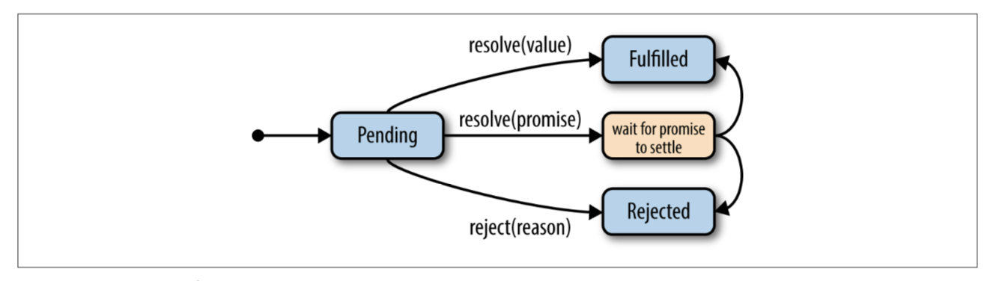

# Promise

https://humanwhocodes.com/blog/2021/01/creating-javascript-promise-from-scratch-unhandled-rejection-tracking/
https://web.dev/i18n/en/promises/

## 概念与应用

### 状态与命运

Promise 代表一个异步操作的结果值，有三种**状态**

| 状态                | 含义                             |
| ------------------- | -------------------------------- |
| 待定（pending）     | 操作开始后尚未确定结果的等待状态 |
| 已接受（fulfilled） | 异步操作成功                     |
| 已拒绝（rejected）  | 异步操作失败                     |

待定状态是初始状态，代表操作开始尚未完成；已接受和已拒绝是最终状态，代表操作已经完成（settled），之后状态**不能再发生改变**。操作成功时从待定状态转移到已接受状态；操作失败时从待定状态转换到已拒绝状态。

一个 Promise 可以是独立的，也可以依赖于其他的 Promise 的结果来确定自身最终的状态。据此可以将 Promise 的**命运**划分成**确定的（resolved）**和**未确定的（unresolved）**。

一个已拒绝或者已接受的 Promise 是**确定的**，或者一个处于待定状态但是已经锁定到另外一个**确定的**Promise 上的 Promise 也是**确定的**，注意这个定义是**递归的**。

一个**确定的**Promise 可能处于三种状态中的任意一种，一旦从**未确定**的状态转换到**确定的**状态，这个 Promise 本身无法再影响最终状态，最终状态由其所依赖的 Promise 决定。一个**未确定的**Promise 肯定是**待定的**。



ES6 规范原文如下：

> A promise is resolved if it is settled or if it has been “locked in” to match the state of another promise. Attempting to resolve or reject a resolved promise has no effect. A promise is unresolved if it is not resolved. An unresolved promise is always in the pending state. A resolved promise may be pending, fulfilled or rejected.

另外可参考[States & Fates](https://github.com/domenic/promises-unwrapping/blob/master/docs/states-and-fates.md)。

### 基本用法

使用 Promise**构造函数**（普通函数形式调用会报错）新建一个代表异步任务结果的 Promise 对象，构造函数接受一个函数参数，术语称为`executor`。这个函数有两个参数`resolve`、`reject`，在`executor`中进行一个异步操作，操作成功后调用`resolve(result)`转到**已接受**状态；操作失败后使用`reject(error)`转换到**已拒绝**状态。`executor`函数是**同步执行**的，触发异步任务开始进行。

下面是一个定时器异步任务，1 秒后成功，结果是`success`，成功的结果值类型不限。

```js
new Promise((resolve, reject) => {
  setTimeout(resolve, 1000, 'success')
})
```

1s 后失败的例子，失败结果等价于同步代码中抛出异常，推荐使用`Error`类型的数据代表错误信息。

```js
new Promise((resolve, reject) => {
  setTimeout(reject, 1000, new Error('failure'))
})
```

一个根据其他`Promise`来决定最终状态的例子。`inner`是一个普通的定时器异步任务，`outer`构造函数中使用`resolve(inner)`锁定到`inner`因此`outer`的最终结果和`inner`一样。

第一次调用一个 Promise 的`resolve`和`reject`函数时，该 Promise 从**未确定**变成**已确定**，后续的任何`resolve`和`reject`调用**不再有任何效果**。

```js
const outer = new Promise((resolve, reject) => {
  const inner = new Promise((resolve) => {
    setTimeout(resolve, 1000, 'success')
  })

  resolve(inner)
  resolve(1)
})
```

`executor`函数的第一个参数叫做`resolve`而不是`fulfill`，原因就在于`resolve`的参数可以是另外的 Promise，而不仅仅是成功情况的结果。

### `then`/`catch`接收结果

使用`.then(onFulfilled, onRejected)` 注册异步操作 Promise 成功和失败情况下的回调函数，进行相应处理。注意失败的情况接受到的值术语称之为**原因（reason）**。

```js
// 成功
new Promise((resolve) => {
  setTimeout(resolve, 1000, 1)
}).then(
  (value) => console.log(`[success]: ${value}`),
  (reason) => console.log(`[failure]: ${reason}`)
)

// 失败
new Promise((resolve) => {
  setTimeout(reject, 1000, new Error('too late'))
}).then(
  (value) => console.log(`[success]: ${value}`),
  (reason) => console.log(`[failure]: ${reason}`)
)
```

`then`函数的使用不用担心 Promise 是否已经完成（settle），未完成的 Promise 会在完成时触发回调函数，已完成的会立即触发回调函数。**触发**回调函数不是**立即执行**回调函数，而是注册一个微任务（microtask）来尽快的执行回调函数，ES6 规范中称之为 Job。

`then`函数会返回一个新的 Promise，新 Promise 的最终状态根据回调函数`onFulfilled` / `onRejected`的结果确定，有三种情况。

1. 返回一个非`Promise`值，包括隐式返回`undefined`，新 Promise 是**已接受**状态，结果值是函数的返回值。
1. 抛出一个错误，新 Promise 是**已拒绝**状态，**原因**是这个错误值。
1. 返回一个`Promise`，新 Promise 的状态锁定到返回的 Promise，与其保持一致。

`then`函数返回的也是 Promise 值这一点让我们能够方便的使用链式调用，来处理一系列顺序的异步操作。

```js
new Promise((resolve) => {
  resolve(0)
})
  .then((value) => {
    console.log(`received 0: ${value === 0}`)
    return 1
  })
  .then((value) => {
    console.log(`received 1: ${value === 1}`)

    throw new Error('error')
  })
  .then(undefined, (reason) => {
    console.log(`received error: ${reason instanceof Error}`)

    return new Promise((resolve) => setTimeout(resolve, 1000, 3))
  })
  .then((value) => {
    console.log(`received 3: ${value === 3}`)

    return new Promise((reject) => setTimeout(reject, 1000, new Error('error')))
  })
  .then(undefined, (value) => {
    console.log(`received error: ${reason instanceof Error}`)
  })
```

需要注意的是如果`.then(onFulfilled, onRejected)`中的参数类型**不是函数**，参数将会被忽略而采取默认行为，将成功失败值及状态**原样透传**（fall through）给新的 Promise。

在不需要对成功情况进行处理的条件下，使用`.catch(onRejected)`函数来只处理 Promise 失败的情况，这相当于`.then(undefined, onRejected)`。`undefined`被忽略，成功情况下值被透传。

注意以下两种情况存在一点微妙的区别，第一种情况中`onFulfilled`函数抛出异常，同层的`onRejected`无法捕捉到这个异常，第二种情况中下一层的`catch`函数可以捕获这个异常，因此第二种形式更为安全。

```js
new Promise((resolve) => {
  resolve(1)
}).then(
  (value) => {
    console.log(`value: ${value}`)
    throw new Error('throw in then')
  },
  (reason) => console.error(`error: ${reason}`)
)

new Promise((resolve) => {
  resolve(1)
})
  .then((value) => {
    console.log(`value: ${value}`)
    throw new Error('throw in then')
  })
  .catch((reason) => console.error(`error: ${reason}`))
```

### `finally`进行清理

某些情况下，无论成功还是失败都要进行某些清理操作，此时也并不关心成功失败的值，使用`finally`处理这种情况，`finally`的回调函数不接受任何参数，经过`finally`的 Promise 值被透传。

```js
// 返回Promise代表异步读取文件的结果
readFile().finally(() => {
  closeFile()
})
```

### 统一同步异步

根据不同条件可能出现同步结果，也可能出现异步结果的情况，必须将同步结果也包装成异步结果来处理，避免出现[不一致的情况](https://blog.izs.me/2013/08/designing-apis-for-asynchrony)。

`Promise.resolve(value)`

1. 如果`value`是 Promise 实例会原样返回
1. 如果`value`是普通值，将其包装成**已接受**状态的 Promise
1. 如果`value`是 thenable 对象，则取出 thenable 对象上`.then`函数的结果，递归地处理下去，直到终止到前两种情况下。

`Promise.reject(reason)`直接返回一个新的**已拒绝**的 Promise，值是`reason`，注意**不会**像`Promise.resolve`一样对`reason`进行递归处理。

### `promisify`

Node 中提供的异步函数约定最后一个参数是回调函数，第一个参数是函数失败时的错误原因（成功时为`undefined`），第二个参数是成功时的结果。

```js
fs.readFile('/etc/passwd', (err, data) => {
  if (err) throw err
  console.log(data)
})
```

利用`promisify`函数将这种约定的函数转换为一个返回`Promise`的异步函数。

```js
function promisify(f) {
  return function (...args) {
    return new Promise((resolve, reject) => {
      function callback(err, result) {
        if (err) {
          reject(err)
        } else {
          resolve(result)
        }
      }

      f.call(this, ...args, callback)
    })
  }
}
```

### 多个异步操作的典型场景

#### `Promise.race(iterable)`

多个 Promise 同时进行，新返回的 Promise 的状态合第一个完成的 Promise 状态保持一致。例如为一个网络请求接口添加超时功能。

```js
// 某个网络请求接口
function fetch(url) {
  return Promise.resolve()
}

function timeout(fun, ms) {
  return function timeoutFun(...args) {
    return Promise.race([
      fun.call(this, ...args),
      new Promise((_, reject) => setTimeout(reject, ms, new Error('timeout'))),
    ])
  }
}

// 设置3s超时
const timeoutFetch = timeout(f, 3000)
```

#### `Promise.all(iterable)`

`iterable`代表的多个异步任务同步开始执行，所有异步任务都成功完成时，返回一个接受的 Promise，接受值是一个数组对应存放每个 Promise 的接受值；或者第一个 Promise 拒绝时，返回一个拒绝的 Promise，拒绝原因相同。

#### `Promise.allSettled(iterable)`

[TC39 Stage 4 Proposal](https://tc39.es/proposal-promise-allSettled/)，`iterable`代表的多个异步任务同时开始执行，所有异步任务都完成时，返回一个接受的 Promise，接受值是一个数组对应存在每个 Promise 的结果。

```js
Promise.allSettled([
  Promise.resolve(3),
  new Promise((resolve, reject) => setTimeout(reject, 100, 'foo')),
]).then((results) => {
  const expected = [
    // 成功
    { status: 'fulfilled', value: 3 },
    // 失败
    { status: 'rejected', reason: 'foo' },
  ]

  expect(results).toEqual(expected)
})
```

#### `Promise.any(iterable)`

`Promise.any`相当于`Promise.all`的反面，所有异步任务都失败时返回一个拒绝的 Promise，拒绝原因是聚合的失败结果；有一个异步任务成功时返回一个接受的 Promise，接受值与异步任务成功值相同。

### Effective Rules

1. 注意 Promise 值和返回 Promise 值函数的区别，Promise 在创建时代表异步操作已经开始了
1. 一个返回 Promise 的函数不应该同步抛出错误，这会造成重复的错误处理逻辑，使用`Promise.resolve`包装返回结果，统一在异步逻辑中处理错误。
1. [Rejection reasons must be Error instances](https://www.w3.org/2001/tag/doc/promises-guide#reasons-should-be-errors)
1. 只在[无法处理的异常错误情况](https://www.w3.org/2001/tag/doc/promises-guide#rejections-should-be-exceptional)下拒绝`Promise`

### Unhandled Promise Rejection

[Node](https://nodejs.org/api/process.html#process_event_unhandledrejection)中从`async`函数中抛出异常或者`reject`一个没有错误处理函数的 Promise 会导致异常被全局捕获，打印在控制台中。这种行为在未来会被废弃，改变为导致 Node 进程以非 0 返回失败退出。使用`unhandleRejection`事件对这种情况自定义处理函数。

```js
process.on('unhandledRejection', (reason, promise) => {
  console.log('Unhandled Rejection at:', promise, 'reason: ', reason)
})

Promise.reject(new Error('error'))
```

浏览器环境的全局环境下(`window`或者`Worker`)使用`unhandledrejection`和`rejectionhandled`[事件](https://caniuse.com/#search=unhandled)对没有回调函数的 rejection 进行处理。
一个 Promise 被拒绝但是并没有注册任何错误处理的回调函数时触发`unhandledrejection`事件，此事件的默认行为是将错误信息打印到控制台，如果后续这个拒绝的 Promise 又注册了错误处理回调函数，触发`rejectionhandled`事件。这两个事件的`event`参数都是`PromiseRejectionEvent`，`event.promise`属性是事件相关的 Promise，`event.reason`是 Promise 拒绝的原因。

```js
function testUnhandledRejection() {
  window.onunhandledrejection = (event) => {
    console.log('[unhandledrejection]: ', event)

    // Chrome, Safari中生效，Firefox无效
    // 避免将未处理的rejected信息打印到控制台的默认行为是
    event.preventDefault()
  }

  Promise.reject(new Error('unhandled error'))
}

function testRejectionHandled() {
  window.onrejectionhandled = (event) => {
    console.log('[rejectionhandled]: ', event)
  }

  // reject时没有handler，这个未被handled的rejection错误信息会被打印到控制台
  const p = Promise.reject(new Error('handled error'))

  // 后来添加handler处理rejected的情况，此时触发rejectionhandled事件
  setTimeout(() => {
    p.catch((error) => console.log('catch: ' + error))
  }, 3000)
}

testUnhandledRejection()
testRejectionHandled()
```

1. [Promise Rejection Events Sample](https://googlechrome.github.io/samples/promise-rejection-events/)
1. [HTML Spec](https://html.spec.whatwg.org/multipage/webappapis.html#unhandled-promise-rejections)
1. [How to handle "unhandled Promise rejections"](https://github.com/tc39/ecmascript-asyncawait/issues/72)
1. [Try/Catch always needed for await?](https://esdiscuss.org/topic/try-catch-always-needed-for-await)
1. [Default Unhandled Rejection Detection Behavior](https://github.com/nodejs/node/issues/830)
1. [unhandledrejection 处理没有显式捕获的 Promise 异常](https://github.com/justjavac/the-front-end-knowledge-you-may-not-know/issues/7)

### QUIZ

#### 多次`resolve`

下面两种情况下都调用了两次`resolve`输出的值应该是什么？

```js
new Promise((resolve) => {
  resolve(1)
  resolve(2)
}).then(console.log)

new Promise((resolve) => {
  // 2s后执行
  resolve(new Promise((resolve) => setTimeout(resolve, 2000, 2)))
  // 1s后确定
  resolve(new Promise((resolve) => setTimeout(resolve, 1000, 1)))
}).then(console.log)
```

#### 执行时机问题

请说明四种情况下代码的执行时机`doSomething`和`doSomethingElse`都返回`Promise`，参考[解答](https://pouchdb.com/2015/05/18/we-have-a-problem-with-promises.html)。

```js
doSomething()
  .then(function () {
    return doSomethingElse()
  })
  .then(finalHandler)

doSomething()
  .then(function () {
    doSomethingElse()
  })
  .then(finalHandler)

doSomething().then(doSomethingElse()).then(finalHandler)

doSomething().then(doSomethingElse).then(finalHandler)
```

#### 添加延迟

构造一个函数接收原始`promise`和一个延迟毫秒数，返回一个新 Promise 在原始 Promise 接收后延迟指定时间接受，成功值与原始 Promise 相同。

```js
function addDelay(promise, ms) {
    return Promise.resolve(promise).then(v =>
        new Promise(resolve =>
            setTimeout(resolve, ms, v);
        )
    );
}

var p1 = addDelay(doAsyncOperation(), 500);
var p2 = addDelay("value", 1000);
```

#### `Promise.race()`

非`Promise`值被包装为`Promise`，统一异步形式处理，这个条件下`Promise.race()`的结果应该是**嵌套层数最少**的值（存在多个相同嵌套层数时取第一个）。`Promise.resolve()`函数会返回原本的`Promise`所以不算嵌套层数，非`Promise`值包装成`Promise`后嵌套算一层，每个`new Promise`算是嵌套一层。

```js
// 0
Promise.race([0, 1]).then(console.log)

// 0
Promise.race([Promise.resolve(0), 1]).then(console.log)

// Promise.resolve()会返回原来的Promise，所以不管嵌套多少层，都能直接拿到最内层的Promise
Promise.race([Promise.resolve(Promise.resolve(0)), 1]).then(console.log)

Promise.race([new Promise((resolve) => resolve(0)), 1]).then(console.log)

// new Promise一个代表一层异步嵌套
Promise.race([
  new Promise((resolve) => resolve(new Promise((resolve) => resolve(0)))),
  1,
]).then(console.log)
```

#### Promise 与微任务

Promise 完成时回调函数被注册为微任务异步执行，说明下面运行过程及输出结果。

```js
let resolvePromise = new Promise((resolve) => {
  let resolvedPromise = Promise.resolve()
  resolve(resolvedPromise)
})
resolvePromise.then(() => {
  console.log('resolvePromise resolved')
})
let resolvedPromiseThen = Promise.resolve().then((res) => {
  console.log('promise1')
})
resolvedPromiseThen
  .then(() => {
    console.log('promise2')
  })
  .then(() => {
    console.log('promise3')
  })
```

注意连续的`.then`函数注册微任务，每次都是一层异步嵌套，而`resolve(promise)`是多一层的嵌套异步任务。

```js
resolve(resolvedPromise)
//等同于：
Promise.resolve().then(() => resolvedPromise.then(resolve))
```

运行过程如下：

1. 脚本任务同步执行，同步构造`resolvePromise`，其构造函数中又同步构造`resolvedPromise`，`resolve(resolvedPromise)`决定了`resolvePromise`要在`resolvedPromise`接受后的下一轮微任务循环中才能变成`resolved`状态。
1. `resolvePromise.then`接受了回调函数，这个回调函数会在`resolvePromise`变成`resolved`状态时被注册为微任务
1. `resolvedPromiseThen`的构造是三层嵌套的异步微任务
1. 脚本任务同步执行，注册了第一层微任务输出`promise1`和`resolvedPromise`
1. 脚本任务执行完成，开始清空微任务队列，执行第一层微任务，同时`resolve`嵌套`Promise`执行一层。
   ```txt
   promise1
   ```
1. `.then`嵌套 Promise 执行第二层，`resolve`嵌套`Promise`执行第二层此时`resolvePromise`变成`resolved`状态。
   ```txt
   promise2
   ```
1. `resolvePromise.then`的微任务回调和第三个`.then`都位于第三层，根据前后顺序输出
   ```txt
   resolvePromise resolved
   promise3
   ```

#### 顺序执行

给一个数组`[fun1, fun2, fun3]`，其中每个元素都是返回一个代表异步任务 Promise 的函数，要求写一个函数接受这样的数组参数，让所有异步任务顺序执行，前一个异步任务成功后触发下一个异步任务，出现任务失败时终止整个任务链。

```js
function executeSequentially(promiseFactories) {
  var result = Promise.resolve()
  promiseFactories.forEach(function (promiseFactory) {
    result = result.then(promiseFactory)
  })
  return result
}

function myPromiseFactory() {
  return somethingThatCreatesAPromise()
}
```

注意例子中接受的是返回 Promise 的函数，而不是 Promise 值本身，下面例子中所有 Promise 代表的异步任务并不是顺序执行，而是再函数调用前都已经开始。

```js
function executeSequentially(promises) {
  var result = Promise.resolve()
  promises.forEach(function (promise) {
    result = result.then(promise)
  })
  return result
}
```

#### 限制数目的并发执行

编写一个调度器类`Scheduler`，接受一个最大同时运行的任务个数`maxRunningCount`，有一个`add(task)`方法可以任意添加返回 Promise 的异步任务函数，要求添加的异步任务同时运行，但是数目不能超过`maxRunningCount`。
`Scheduler`类的使用例子如下。

```js
const timeout = (time) =>
  new Promise((resolve) => {
    console.log('in timeout:', time)
    setTimeout(resolve, time)
  })

const scheduler = new Scheduler()

const start = Date.now()
const addTask = (time, order) => {
  scheduler
    .add(() => timeout(time))
    .then(() => {
      console.log((Date.now() - start) / 1000, 's: ', order)
    })
}

addTask(1000, '1')
addTask(500, '2')
addTask(300, '3')
addTask(400, '4')
```

总共添加了 4 个任务，输出是`2 3 1 4`。

1. 同步添加了 4 个任务调度运行
1. 0ms 1，2 队列开始并发执行，
1. 500ms 任务 2 结束输出 2，任务 3 开始执行
1. 800ms 300 毫秒后任务 3 结束输出 3
1. 1000ms 200ms 后任务 1 结束输出 1，
1. 1200ms 200ms 后任务 4 结束输出 4

实现如下。

```js
class Scheduler {
  constructor() {
    this.runningCount = 0
    this.maxRunningCount = 1
    this.waitingList = []
  }

  add(task) {
    if (typeof task !== 'function') {
      throw new TypeError('task must be a function')
    }

    let promiseResolve
    let promiseReject
    const promise = new Promise((resolve, reject) => {
      promiseResolve = resolve
      promiseReject = reject
    })

    this.waitingList.push({
      task: task,
      resolve: promiseResolve,
      reject: promiseReject,
    })

    this.runNextTask()

    return promise
  }

  runNextTask() {
    if (
      this.runningCount >= this.maxRunningCount ||
      this.waitingList.length === 0
    ) {
      return
    }

    const { task, resolve, reject } = this.waitingList[0]
    this.waitingList = this.waitingList.slice(1)

    this.runningCount++
    return Promise.resolve(task())
      .then(resolve, reject)
      .finally(() => {
        this.runningCount--
        this.runNextTask()
      })
  }
}
```

### 参考

1. [Promise MDN](https://developer.mozilla.org/zh-CN/docs/Web/JavaScript/Reference/Global_Objects/Promise)
1. [We have a problem with promises](https://pouchdb.com/2015/05/18/we-have-a-problem-with-promises.html)
1. [Domenic promises-unwrapping](https://github.com/domenic/promises-unwrapping)
1. [You're Missing the Point of Promises](https://blog.domenic.me/youre-missing-the-point-of-promises/)
1. [Javascript Promises Expert - Domenic Denicola](https://www.youtube.com/playlist?list=PLw5h0DiJ-9PDHm7vIENJ9NOazMJbB5G-G)

## 规范解读与实现

### Promises/A+

Promises/A+规范主要规定了具有`.then`属性且属性值是对象或者函数的对象叫做`thenable`对象，符合 Promises/A+规范的 Promise 对象也是`thenable`对象。

`thenable`的概念主要是为了通过`.then`函数来保证不同实现之间的互操作性，在没有 ES6 的标准 Promise 对象之前很多库实现了自己的 Promise 函数。只要这些库符合`thenable`的规定，它们之间就可以互相操作，而不破坏 Promise 功能。

Promises/A+规范主要规定了`.then`函数和 Promise 决议过程（Promise Resolution Procedure），提供一个基础的、广泛适用的规范，对于如何创建、接受、拒绝 Promise 的过程不做规定。

#### `then`方法

`Promise`实例调用`.then`的形式

```js
promise.then(onFulfilled, onRejected)
```

1. 2.1.1 - `onFulfilled`和`onRejected`参数不是函数时被忽略，采用默认透传行为。
1. 2.2.2/2.2.3 - `onFulfilled`和`onRejected`函数能且仅能调用一次，且必须在 Promise 接受或者拒绝后调用
1. 2.2.4 - 回调函数强制为异步实现，这也是 Promise 表示异步任务的关键点。
1. 2.2.5 - 回调函数必须作为函数（function）调用，这是相对于方法（method）来说的，意思这不能指定`this`，但不意味着`this`没有值。不指定的情况下`this`可以是全局对象（非严格模式）或者`undefined`（严格模式）。
1. 2.2.6 - 同一个 Promise 实例可以多次调用`then`函数注册多个回调函数，且回调函数最终触发时需要按照注册的顺序依次执行。
1. 2.2.7 - `.then`方法需要返回一个新的 Promise，目的在于形成链式调用。如果回调函数中抛出了异常，则返回的新 Promise 用该异常值拒绝。另外规定了非函数参数的默认透传行为，与 2.1.1 呼应。其余情况下对新 promise 进行决议`[[Resolve]](promise2, value)`

#### Promise 决议过程

```js
;[[Resolve]](promise, value)
```

Promise 的决议过程就是之前讲到的将`promise`的命运确定一个普通值、另外一个`promise`、`thenable`对象的过程。`thenable`对象代表的就是其他符合 Promises/A+规范的实现对象实例，`thenable`对象导致了决议的过程是嵌套的。`thenable`对象上`then`函数的调用结果需要嵌套决议`[[Resolve]](thenResult, value)`直到递归结束。

需要注意的有以下几点：

1. `[[Resolve]](promise, value)`中，`promise`和`value`是同一个对象时抛出`TypeError`的错误，将一个`promise`确定到自身会导致死循环，`promise`永远无法接受或拒绝。
1. `value.then`获取`thenable`对象的`then`属性时先获取一次将结果保存到其他变量中，后续使用这个变量，避免`.then`是`getter`函数的情况，多次获取属性存在副作用。
1. 对于同一个`promise`实例的`resolvePromise`只有第一次调用有效，这也是命运一旦确定就无法在更改的体现。
1. 嵌套调用可能出现循环的情况，规范不强制但是鼓励对于这种情况做出检测，并抛出带有说明信息的`TypeError`。

### ES6 Promise

ES6 完整规定了 Promise 对象的创建、接受、拒绝、决议过程以及一些`Promise.all`等工具函数。其中有一些概念需要注意。

#### Promise 实例

一个[Promise 实例](https://tc39.es/ecma262/#sec-properties-of-promise-instances)内部有五个属性，用 JS 对象表示如下。

```js
  {
    // 状态
    [[PromiseState]]: pending | fulfilled | rejected;
    // 结果值
    [[PromiseResult]]: any;
    // 接受回调
    [[PromiseFulfillReactions]]: PromiseReaction[];
    // 拒绝回调
    [[PromiseRejectReactions]]: PromiseRejection[];
    // 拒绝的Promise是否被处理，unhandledrejection/rejectionhandled事件
    [[PromiseIsHandled]]: boolean;
  }
```

#### PromiseCapability

`PromiseCapability`是一个具有 Promise 功能的对象，这个对象可以从原生 Promise 生成，也可以从三方的 Promise 函数中生成，关键在于返回值必须具备`promise`、`resolve`、`reject`三个规定属性，`resolve`和`reject`是和这个`promise`配对的接受和拒绝函数，用来在合适的时机调用完成`promise`。

```js
function NewPromiseCapability(C) {
  if (typeof C !== 'function') {
    throw new TypeError('C must be a constructor')
  }

  let promiseResolve
  let promiseReject
  const promise = new Promise((resolve, reject) => {
    promiseResolve = resolve
    promiseReject = reject
  })

  if (typeof promiseResolve !== 'function' || typeof promiseReject !== 'function) {
    throw new TypeError('resolve and reject must be function')
  }

  return {
    promise,
    resolve: promiseResolve,
    reject: promiseReject,
  }
}
```

#### `CreateResolvingFunctions`

一个`promise`的`resolve`和`reject`函数只有第一个调用确定了`promise`的命运，之后的调用不生效，所以`resolve`和`reject`函数共享了一个布尔标志位`alreadyResolved`来表示是否进行过调用。第一次调用后`alreadyResolved`由`false`变成`true`后续调用检测到这个标志位后不再进行任何处理。

#### `PromiseReactionRecords`

用来标记一个 Promise 接受或者拒绝后应当触发的回调函数，`TriggerPromiseReaction`函数具体执行这个触发过程，使用`NewPromiseReactionJob`将**每个**`PromiseReactionRecord`注册成一个 Promise Job（ES6 规范中等价于微任务的概念）进行异步执行，而不是注册一个 Job 将所有回调函数顺序执行，**任务粒度更细**。

#### 接受和拒绝

`FulfillPromise`和`RejectPromise`是接受和拒绝 Promise 对应的函数，用来将待定状态的`promise`修改为接受或者拒绝状态。

#### 决议过程

`PromiseResolveFunctions`是 Promise 的决议过程，其中除了做一些必要的检查检查外，需要注意的是对于`thenable`对象的处理是使用`NewPromiseResolveThenableJob(promise, resolution, thenAction).`注册了一个异步任务进行的。

```js
// Promise.resolve函数也会进行走到决议过程
// 一个普通的thenable对象的then函数是被包装成Job异步执行的
// 输出 2 1
Promise.resolve({
  then: () => console.log('1'),
})

console.log('2')
```

另外注意`ResolvePromise(promise1, promise2)`将`promise1`确定到`promise2`上是通过将`promise1`的`resolve`和`reject`函数注册为`promise2`的接受和拒绝回调函数实现的，这样`promise2`完成后就会触发回调函数将`promise1`**以同样的值接受或者拒绝**，这个过程可能嵌套多层。这种方式用来实现返回一个新的 Promise 值的工具函数非常方便。

### 实现

#### `Promise.resolve`、`Promise.reject`

`Promise.resolve(value)`，如果`value`是普通值返回的是一个新的 Promise 实例接受这个值；`value`是 Promise 实例的话原样返回；`value`是`thenable`对象的话异步处理进行逐层决议。最终保证返回结果统一是 Promise 实例。
`Promise.reject`返回一个新的 Promise 已`value`值拒绝，这里不对`thenable`和 Promise 实例做特殊处理，直接拒绝。

```js
// 结果不一样
Promise.resolve(Promise.reject(1))
Promise.reject(Promise.resolve(1))
```

#### `Promise.race(iterable)`

返回一个新的 Promise 实例`p`，将`p`的`resolve`和`reject`函数分别注册为`iterable`参数代表的所有`promise`对象的接受和拒绝回调函数，在第一个`promise`接受或者拒绝时以相同的值接受或拒绝。`iterable`中普通值使用`Promise.resolve()`包装成 Promise 值，统一异步处理。

#### `Promise.all`、`Promise.any`、`Promise.allSettled`

`Promise.all`返回一个新的 Promise 实例，在所有 Promise 接受后已所有接受值的聚合值接受，或者在第一个 Promise 拒绝时拒绝。
`Promise.allSettled`返回一个新的 Promise 实例，在所有 Promise 完成后已聚合的数组值接受。
`Promise.any`返回一个新的 Promise 实例，在第一个 Promise 接受时接受，或者在所有 Promise 拒绝后以所有拒绝原因的聚合值拒绝。

这三个函数的实现都需要一个计数器初始值为 0，遍历一个 Promise 实例加 1，完成一个 Promise 实例减 1，并且在每个 Promise 完成时都检查计数器是否重新归零，重新归零表示所以任务都完成了。区别在于`Promise.all`在所有任务都接受时接受，`Promise.any`在所有任务都拒绝时拒绝，`Promise.allSettled`在所有任务都完成时完成。

另外需要注意的是聚合值是一个数组值，每个元素按顺序是`iterable`对应`promise`实例完成的值，在实现时注意遍历`iterable`的过程中要将每个`promise`对应的`index`闭包保存，否则使用的是全局的下标值，同步遍历结束时等于元素个数。

## Promise (TODO: 需要整理)

When a promise is resolved or rejected, its `then()` callback is scheduled at next possible asynchronous moment(microtask, Jobs).

1. If `then()` is scheduled sychronously and promise is already resolved or rejected, `then()` will not be called. Unified asynchronous `then()` ensures that it will always be called properly whether promise is resolved or not when `then()` is registered.
1. Promise can only be resolved or rejected once, any subsequent `resolve()` or `reject()` call will be ignored silently. This ensures an registered `then()` will be called once, no more no less. Register same `then()` multiple times if you want it to be called more than once.
1. `resolve()` and `reject()` receives only the first paramter passed in and invoke registered function with it. Other parameters are ignored, `undefined` will be used if no parameters passed in. Wrap multiple values into single object to be used as first paremeter if you want to return more than one objects.
1. Exception inside promise constructor causes the newly constructed promise to be rejected with same exception. Exception inside `then()` returns a promise rejected with same exception.

Default fullfilment handler and rejection handler is used when needed.

```javascript
var p = Promise.resolve(42)
p.then(null, null)

// default handler used
p.then(
  (value) => Promise.resolve(value),
  (err) => Promise.reject(err)
)
```

### resolve

Promise can be resolved with normal object or a Promise asynchronously, but notice that when a promise is resolved with another promise, it's unwrapped one layer each loop.

```javascript
var p3 = new Promise((resolve, reject) => {
  resolve('B')
})
var p1 = new Promise((resolve, reject) => {
  resolve(p3)
})
var p2 = new Promise((resolve, reject) => {
  resolve('A')
})

p1.then((v) => console.log(v))
p2.then((v) => console.log(v))

// A B <- not B A as you might expect
```

Promise is unwrapped if used as parameter of `resolve()` inside constructor or returned by `then()`. A new promise is created by promise constructor or `then()`. New promise adopts the state of unwrapped promise, thus creating a chain of asynchronous operations.

```javascript
var p1 = Promise.resolve('1')
var p3 = p1.then((value) => {
  var p2 = new Promise((resolve, reject) => {
    setTimeout(resolve, 1000, '3')
  })
  return p2
})
p3.then((value) => console.log('value: ', value))

// unwrapping inside then() returns promise chain to be resolved in sequential order p1 -> p2 -> p3
```

```javascript
var p2 = new Promise((resolve, reject) => {
  var p1 = new Promise((resolve, reject) => {
    setTimeout(resolve, 1000, '3')
  })
  resolve(p1)
})
p2.then((value) => console.log('value: ', value))

// unwrapping inside constructor creates promise chain to be resolved in sequential order p1 -> p2
```

`Promise.resolve()` can accept a normal object, a promise or a thenable object.

1. If received a normal object, it returns a promise object resolved with it.
1. If received a promise, it returns that promise.
   ```javascript
   var p1 = Promise.resolve(42)
   var p2 = Promise.resolve(p1)
   console.log(p1 === p2) // true
   ```
1. If received a thenable object, it returns a trustable Promise wrapper.

   ```javascript
   var p = {
     then: function (cb, errcb) {
       cb(42)
       errcb('evil laugh')
     },
   }

   // trustable issues
   p.then(
     function fulfilled(val) {
       console.log(val) //42
     },
     function rejected(err) {
       // oops, shouldn't have run
       console.log(err) // evil laugh
     }
   )

   // safe Promise wrapper
   Promise.resolve(p).then(
     function fulfilled(val) {
       console.log(val) // 42
     },
     function rejected(err) {
       // never gets here
     }
   )
   ```

### Timeout Promise

Use a timeout promise to prevent it from hanging indefinitely and not called.

```javascript
function delay(delayedMilliseconds) {
  return new Promise((fullfill) => {
    setTimeout(fullfill, delayedMilliseconds)
  })
}

function timeoutPromise(promise, delayedMilliseconds) {
  return Promise.race([
    promise,
    delay(time).then(() => {
      throw new Error('Operation timed out.')
    }),
  ])
}
```

### `then()`

Unwrapping also happens when you return a thenable or Promise from fullfilment or rejection handler. This allows us to chain multiple asynchronous steps together using `then()`.

```javascript
var p = Promise.resolve(21)

p.then((v) => {
  console.log(v) // 21

  return new Promise((resolve, reject) => {
    resolve(v * 2) // fullfill with 42
  })
}).then((v) => console.log(v)) // 42

p.then((v) => {
  console.log(v) // 21

  // asynchronous
  return new Promise((resolve, reject) => {
    setTimeout(() => {
      resolve(v * 2) // fullfill with 42
    }, 100)
  })
}).then((v) => console.log(v)) // 42, runs after 100ms delay in previous step
```

### Thenable

Thenable is an object with `then()` method, it's a general label for promise-like objects. It's mainly used as a conception to cooperate between different promise implementations. Use `Promise.resolve()` to turns thenalbes into a standard promise object. `then()` method of thenable object is expected to have the same parameters as `Promise.prototype.then(onFullFilled, onRejected)`.

```javascript
function isThenable(p) {
  return (
    p !== null &&
    (typeof p === 'object' || typeof p === 'function') &&
    typeof p.then === 'function'
  )
}
```

### Terminology

1. `fullfill` means to transform promise from `pending` state to `fullfilled` state.
1. `reject` means to transform promise from `pending` state to `rejected` state.
1. `resolve` means to transform promise from `pending` state to `fullfilled` or `rejected`

`Promise.resolve()` receives a normal object, a promise or a thenable. It may return a rejected promise when receiving promise or thenable object. So `resolve` instead of `fullfill` is an accurate terminology here. Same is true for first paramter of promise constructor.

```javascript
// Promise.resolve()
var fullfilledPromise = Promise.resolve(42)

var rejectedThenable = {
  then: (resolve, reject) => {
    reject('Oops')
  },
}
var rejectedPromise = Promise.resolve(rejectedThenable)

var rejectedPromise = Promise.resolve(Promise.reject('Oops'))

// Promise constructor
var rejectedPromise = new Promise((resolve, reject) => {
  resolve(Promise.reject('Oops'))
})

rejectedPromise.then(
  function fullfilled() {
    // never gets here
  },
  function rejected(err) {
    console.log(err) // 'Oops'
  }
)
```

For `then(fullfilled, rejected)`, first parameter should be called `fullfilled` instead of `resolved` because it will always and only be called when promise is fullfilled.

`reject` from `Promise.reject()` and `new Promise((resolve, reject) => {})` will not unwrap passed in parameters.

```javascript
var p1 = Promise.resolve(42)

// p2 is a rejected promise and its value is p1
var p2 = Promise.reject(p1)
p2.catch((err) => console.log(err)) // err is p1 instead of 42
```

1. [Promise A+ Standard](https://promisesaplus.com/)
1. [https://www.promisejs.org/](https://www.promisejs.org/)
1. [ES6 Promise Standard](https://github.com/domenic/promises-unwrapping)
1. [States and Fates](https://github.com/domenic/promises-unwrapping/blob/master/docs/states-and-fates.md)
1. [Redemption from Callback Hell](https://www.youtube.com/watch?v=hf1T_AONQJU&list=PLyBKX6F2pyZKCdHAtRnPxdGse1n4NC6Lb)
1. [Promises Are Awesome](https://www.youtube.com/watch?v=tbc-el52guw)

### API

`Promise.race(iterable)`

returns a pending promise that will be resolved or rejected as soon as one of the given iterable resolves or rejects, adopting that first promise's value as its value. If the iterable is empty, the promise returned will be forever pending. Non promise value from `iterable` will be wrapped as a resolved promise with that value. TODO: a more appropriately behaved race function for promise, refer to [properRace](https://www.jcore.com/2016/12/18/promise-me-you-wont-use-promise-race/).

`Promise.all(iterable)`

1. Returns a resolved `Promise` if iterable is emtpy, it's resolved synchronously.
1. Returns a pending promise that will be resolved asynchronously when `iterable` contains no promises. Chrome returns a resolved promise in this case, Firefox and Node confirms with ES6 standard.
1. Returns a pending promise that will be resolved or rejected asynchronously. Promise is resolved with an array containing all resolved values in same order if all promises from `iterable` are resolved. Promise is rejected with first rejected value if any of the promises from `iterable` is rejected.

Extended API

1. `none(iterable)`
1. `any(iterable)`
1. `first(iterable)`
1. `last(iterable)`

### Promisory

`promisory` is a function that returns a promise, `promisify` is a function that receives a function `fn(...args, cb)` and returns a `promisory`. Returned promise is resolved or rejected when `cb` is called. This turns callback style function `fn(...args, cb)` into promise style.

```javascript
// doesn't support fn with default parameter
const promisify =
  (fn, context) =>
  (...args) => {
    return new Promise((resolve, reject) => {
      fn.call(context, ...args, (err, value) => {
        if (err) {
          reject(err)
        } else {
          resolve(value)
        }
      })
    })
  }
```

### 参考

1. [Promises/A+](https://promisesaplus.com/)
1. [ES6 Promise Objects](https://tc39.es/ecma262/#sec-promise-objects)
1. [Domenic promises-unwrapping](https://github.com/domenic/promises-unwrapping)
1. [core-js ES Promise Polyfill](https://github.com/zloirock/core-js/blob/v3.6.5/packages/core-js/modules/es.promise.js)
1. [Writing Promise-Using Specifications](https://www.w3.org/2001/tag/doc/promises-guide)

## Typescript

ts 中`Promise`只有一个泛型参数 T 代表接受值的类型，拒绝的错误类型可能是`reject`也可能是`throw`的异常，是`any`类型所以不再泛型参数中显式标出。
