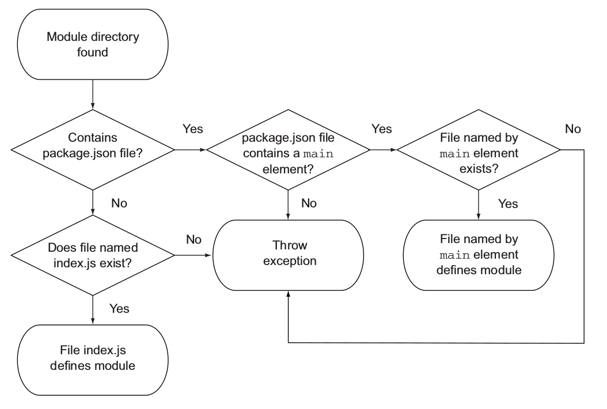

# 分类

1. 核心模块和文件模块，核心模块直接编译执行。
1. 其他模块

# 特性

## 同步加载

CommonJS 模块是同步形式加载的，没法使用异步的方式设置模块导出对象

```js
fs.readFile('/etc/passwd', (err, data) => {
  if (err) throw err
  exports.data = data // Will not work.
})
```

# Node 实现

https://github.com/nodejs/node/blob/master/lib/internal/modules/cjs/loader.js

1. 支持单纯的模块 模块 id
   1. 核心模块 node:fs 形式
   1. 相对路径（`./`、`../`）、绝对路径（`/a`）、文件模块，文件存在时默认为 js 模块，否则依次尝试不同后缀.js/.json/.node
   1. 文件夹模块、软链接 package.json#main 或者 index.js/index.json/index.node
   1. 用法 require 可以接受的模块标识 node:?，、、 ，
   1. 支持不同的扩展名 json 模块，.js 模块，node 模块
1. 加载失败处理
1. 导出对象

```js
const assert = require('node:assert')
const realFs = require('node:fs')

const fakeFs = {}
require.cache.fs = { exports: fakeFs }

// false
console.log(require('node:fs') === fakeFs)
// true
console.log(require('fs') === fakeFs)
// true
console.log(require('node:fs') === realFs)
```

[All Together](https://nodejs.org/api/modules.html#all-together)

Module.paths

```js
> module
Module {
  id: '<repl>',
  path: '.',
  exports: {},
  filename: null,
  loaded: false,
  children: [],
  paths: [
    '/Users/penghui/coding/learning-notes/repl/node_modules',
    '/Users/penghui/coding/learning-notes/node_modules',
    '/Users/penghui/coding/node_modules',
    '/Users/penghui/node_modules',
    '/Users/node_modules',
    '/node_modules',
    '/Users/penghui/.node_modules',
    '/Users/penghui/.node_libraries',
    '/Users/penghui/.nvm/versions/node/v16.14.2/lib/node'
  ]
}
```

require steps

1. Resolving: To find the absolute path of the file
1. Loading: To determine the type of the file content
1. Wrapping: To give the file its private scope. This is what makes both the require and module objects local to every file we require
1. Evaluating: This is what the VM eventually does with the loaded code
1. Caching: So that when we require this file again, we don’t go over all the steps another time

1. 路径分析
1. 文件定位
1. 编译执行

# 解析 resolve

resolve only

```js
require.resolve
```


1. core module
1. is relative path or absolute path,
1. find module in sibling folder `node_modules`, if not found repeat this process in parent folder recursively until root path.
1. find module in folder specified by environment variable `NODE_MODULES`, throw exception is not found.



1. If module is a directory
   1. If there is a file `package.json`, it must contains an element `main` that specifies entry file.
   1. Other wise entry file is `index.js`
1. module is a file `module.js`

## 路径分析与文件定位

Node 有四种类型路径

1. 核心模块
1. `.`/`..`的相对路径文件模块
1. `.`/`..`的绝对路径文件模块
1. 非路径形式的文件模块，使用`module.paths`路径，从当前目录中`node_modules`子目录中查找，逐层向上

对于不存在扩展名的情况依次尝试`.js`、`.json`、`.node`

1. 可能找到一个文件
1. 目录 -> 尝试查找 package.json 文件的 main 字段指定的入口文件，不存在的话依次使用`index.js`，`index.json`，`index.node`。
   1. 使用本地 node_modules，逐层向上，
   1. 使用 NODE_PATH 环境变量指定的[全局 node_modules 目录](https://nodejs.org/api/modules.html#loading-from-the-global-folders)
1. 不存在的情况抛出错误

TODO:
对于 `require('module/sub/path')` 这种如何处理？
https://nodejs.org/api/modules.html#folders-as-modules

[require](http://nodejs.cn/api/modules.html#modules_all_together)

```js
interface Require {
  (id: string): any;
  resolve: RequireResolve;
  cache: Dict<NodeModule>;
  /**
   * @deprecated
   */
  extensions: RequireExtensions;
  main: Module | undefined;
}
```

## 软链接问题

# loading

cjs 的 this 指向 module.exports

```js
Module._load = function (request, parent, isMain) {
  // 1. Check Module._cache for the cached module.
  // 2. Create a new Module instance if cache is empty.
  // 3. Save it to the cache.
  // 4. Call module.load() with your the given filename.
  //    This will call module.compile() after reading the file contents.
  // 5. If there was an error loading/parsing the file,
  //    delete the bad module from the cache
  // 6. return module.exports
}
```

```js
require.extensions
```

## 模块编译

每个模块都是一个对象

```js
function Module(id, parent) {
  this.id = id
  this.exports = {}
  this.parent = parent
  if (parent && parent.children) {
    parent.children.push(this)
  }
  this.filename = null
  this.loaded = false
  this.children = []
}
```

如果想要整体导出，使用`module.exports = value`，因为`exports`是一个函数形参，无法改变外部的变量

核心模块分为 JS 模块和 C/C++模块

```js
function NativeModule(id) {
  this.filename = id + '.js'
  this.id = id
  this.exports = {}
  this.loaded = false
}
NativeModule._source = process.binding('natives')
NativeModule._cache = {}
```

# wrapping

node.js NativeModule.wrap

[The module wrapper](https://nodejs.org/api/modules.html#the-module-wrapper)

两个作用

1. 模块代码封装到单独的作用域中，这个作用域中的 this 就是 模块实例本身，this 和 module 的关系？
1. 提供 `module/exports/require/filename/dirname` 等变量

导出的 module.exports/exports 是值拷贝形式，

require -> load -> resolveFilename -> compile ->

```js
function loadModule(filename, module, require) {
  var wrappedSrc =
    '(function(module, exports, require) {' +
    fs.readFileSync(filename, 'utf8') +
    '})(module, module.exports, require);'
  eval(wrappedSrc)
}
```

# 求值 Evaluating

# 缓存

```js
require.cache
```

1. 添加缓存支持，添加循环依赖支持
1. 模块缓存，模块加载失败需要从缓存中删除
1. [invalidate cache](https://stackoverflow.com/questions/9210542/node-js-require-cache-possible-to-invalidate)

[缓存细节](https://nodejs.org/api/modules.html#module-caching-caveats)
缓存使用 resolve 得到的文件路径作为 key，同一个 key 对应的模块只会加载一次，同一个`require('foo')`根据位置不同可能指向不同文件，同一个文件也可以对应不同的 key。

> Modules are cached based on their resolved filename.

## 缓存与循环依赖

[循环依赖](https://nodejs.org/api/modules.html#cycles)

模块加载第一次就会进行缓存，再次加载时从缓存中读取，因此允许循环依赖的情况出现。

使用`require`的模块会被缓存，缓存使用模块被解析的**文件名**作为 key，所以使用不同的路径名，但是路径经过解析后相同的话，是同一个模块。

```js
// 同一个模块
const mod1 = require('./test')
const mod1 = require('./test.js')

// 在不区分大小写的文件系统上，这两个模块指向同一个文件，但是使用的解析得到的路径名不同，所以同一个文件会被加载两次。
const mod1 = require('./test')
const mod1 = require('./TEST')
```

使用`new Module`创建模块可以使每个模块实例都是独立的

`require.main` 入口模块

# 扩展

## require.main

[Accessing the main module](https://nodejs.org/api/modules.html#accessing-the-main-module)

```js
require.main = process.mainModule
```

```js
// print-in-frame.js
const printInFrame = (size, header) => {
  console.log('*'.repeat(size))
  console.log(header)
  console.log('*'.repeat(size))
}

if (require.main === module) {
  printInFrame(process.argv[2], process.argv[3])
} else {
  module.exports = printInFrame
}
```

命令行直接使用 `node print-in-frame 8 Hello`

或者脚本使用。

```js
const print = require('./print-in-frame')

print(5, 'Hey')
```

NPM 在 8.0.0 版本后使用[`require.main`](https://github.com/npm/cli/blob/1617bce61663a743435d162b003d3b99376d426f/index.js#L1)禁用代码形式的使用方式，只允许通过命令行方式。

```js
if (require.main === module) {
  require('./lib/cli.js')(process)
} else {
  throw new Error('The programmatic API was removed in npm v8.0.0')
}
```

wrapper

## 副作用

## 热更新

想要一个模块每次被加载时副作用都会执行的办法

1. 加载后删除 cache，效率较低
1. 导出函数，每次调用

## webpack enhanced-resolve

## 虚拟模块

http://www.ayqy.net/blog/api%e6%b3%a8%e5%85%a5%e6%9c%ba%e5%88%b6%e5%8f%8a%e6%8f%92%e4%bb%b6%e5%90%af%e5%8a%a8%e6%b5%81%e7%a8%8b_vscode%e6%8f%92%e4%bb%b6%e5%bc%80%e5%8f%91%e7%ac%94%e8%ae%b02/

# C++ 模块

node-gyp

#### 内建 C/C++模块

1.  Node.js：来一打 C++ 扩展

## 模块别名

alias

webpack/typescript
[module-alias](https://www.youtube.com/watch?v=EuOFn4csz7I)
typescript paths
@rollup/plugin-alias

# debug node.js source

# vm 模块

vm.runInThisContext

1. https://nodejs.org/api/module.html#modulecreaterequirefilename

# 参考资料

1. [Module Loader](https://es6.ruanyifeng.com/#docs/module-loader)
1. [The Node.js Way - How `require()` Actually Works](http://fredkschott.com/post/2014/06/require-and-the-module-system/)
1. [Requiring Modules](https://jscomplete.com/learn/node-beyond-basics/requiring-modules)
1. [nodejs 模块机制深入浅出](https://juejin.cn/post/6929135927323262983)

1. node modules CommonJS/ECMAScript/Module API/Packages https://nodejs.org/api/module.html
