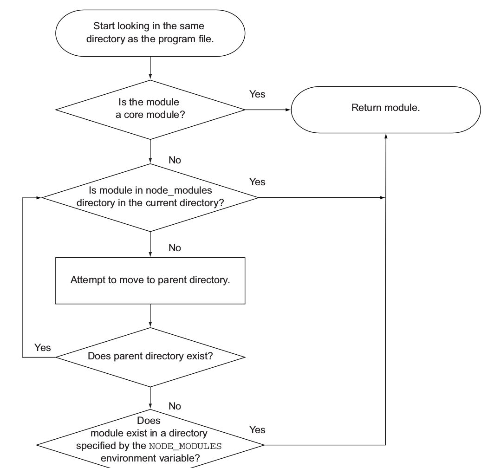

# 模块化

## CommonJS

CommonJS 中使用变量`module.exports`和`exports`来导出对象，使用`require(module_name)`来导入对象。

### 分别导出

```js
// math.js
const PI = 3.141592653589793
const E = 2.718281828459045
module.exports = PI
module.exports = E

// require函数返回值就是module.exports，在此重新赋值给其他变量math
const math = require('./math.js')
console.log(math.PI)
console.log(math.E)

// 可以直接使用解构语法，但这和模块导入本身没关系
const { PI, E } = require('./math.js')
```

### 整体导出

也可以对`module.exports`整体赋值，导出一整个对象。但是注意 CommonJS 模块导出的对象始终是`module.exports`,而`exports`不过是指向`module.exports`的一个普通变量，对其**整体赋值**的话并**不能**整体导出，反而切断了`exports`与`module.exports`的联系，后续`exports`也就不能再进行导出。仅仅为了**少打几个字**而提供的`exports`附带了这样一个[坑](https://blog.codinghorror.com/falling-into-the-pit-of-success/)不能不说是一个设计失误，反而只有`module.exports`一种导出语法，使用起来简单一致才是更好的设计。

```js
// math.js
const Math = {
  PI: 3.141592653589793,
  E: 2.718281828459045,
}
module.exports = Math

// 导入语法相同，将返回值赋值给其他变量即可
const Math = require('./math.js')
```

### 模块解析过程



1. core module
1. is relative path or absolute path,
1. find module in sibling folder `node_modules`, if not found repeat this process in parent folder recursively until root path.
1. find module in folder specified by environment variable `NODE_MODULES`, throw exception is not found.


1. If module is a directory
   1. If there is a file `package.json`, it must contains an element `main` that specifies entry file.
   1. Other wise entry file is `index.js`
1. module is a file `module.js`

## ES6 module

https://segmentfault.com/a/1190000014318751

### 导出

```js
// 单个导出
export const variable = 1;
export function FunctionName() {}
export class ClassName {}

// 多个导出，注意export {} 是导出语法，而不是export关键字加上了一个对象{}
export { variable, FunctionName, ClassName }

// 重命名导出
export { variable as variable1, FunctionName as FunctionName1, ClassName as ClassName1 }

// 默认导出
export default expression;
export default function (…) { … } // also class, function*
export default function name1(…) { … } // also class, function*
export { name1 as default, … };

// Aggregating modules
export * from …;
export { name1, name2, …, nameN } from …;
export { import1 as name1, import2 as name2, …, nameN } from …;
export { default } from …;
```

### 导入

```js
import defaultExport from "module-name";
import * as name from "module-name";
import { export } from "module-name";
import { export as alias } from "module-name";
import { export1 , export2 } from "module-name";
import { foo , bar } from "module-name/path/to/specific/un-exported/file";
import { export1 , export2 as alias2 , [...] } from "module-name";
import defaultExport, { export [ , [...] ] } from "module-name";
import defaultExport, * as name from "module-name";

// 副作用导入，仅为了运行模块中的全局代码而不导入任何内容
import "module-name";

// 动态
var promise = import("module-name");//这是一个处于第三阶段的提案。
```

注意默认导出和默认导入配对使用，命名导出和命名导入配对使用，二者不能混用。一个模块中默认导出导入只能有一个。

## ES6 与 CommonJS 交互

由于 ES6 还未被浏览器直接支持，所以其模块需要转换成 CommonsJS/AMD 等模块进行执行。默认导出在这里面会有点问题，CommonJS 模块中默认导出相当于是整体导出，但是 ES Module 需要同时支持默认导出和命名导出，所以转换为 CommonJS 时只好使用`module.exports.default`变量代表默认导出的内容。但是这样存在一个问题，普通的 CommonJS 模块文件并没有这个`default`属性，那么混用的时候无法区分 CommonJS 模块是否由 ES Module 转换而来。

```js
// 需要手动指定 default属性
const Math = require('./math.js').default
```

为了进行区分，Babel 给由 ES Module 转换生成的 CommonJS 模块添加了一个属性`__esModule`，并且在模块加载的时候将`__esModule`是`false`的普通 CommonJS 模块添加`default`属性，转换成统一的形式。

参考下面的[例子](https://ryerh.com/javascript/2016/03/27/babel-module-implementation.html)、[问题](https://stackoverflow.com/questions/50943704/whats-the-purpose-of-object-definepropertyexports-esmodule-value-0)

导出

```js
export const InlineExport = {}
const NormalExport = {}
const RenameExport = {}
const DefaultExport = {}

export { NormalExport }
export { RenameExport as HasRenamed }
export default DefaultExport

// 转换后
;('use strict')

// 定义 __esModule
Object.defineProperty(exports, '__esModule', {
  value: true,
})
var InlineExport = (exports.InlineExport = {})
var NormalExport = {}
var RenameExport = {}
var DefaultExport = {}

exports.NormalExport = NormalExport
exports.HasRenamed = RenameExport
exports.default = DefaultExport
```

导入

```js
import { NormalExport } from 'normal'
import { HasRenamed as RenameAgain } from 'rename'
import DefaultExport from 'default'
import * as All from 'all'

NormalExport()
RenameAgain()
DefaultExport()
All()

// 转换后
;('use strict')

var _normal = require('normal')
var _rename = require('rename')

var _default = require('default')
var _default2 = _interopRequireDefault(_default)

var _all = require('all')
var all = _interopRequireWildcard(_all)

;(0, _normal.NormalExport)()
;(0, _rename.HasRenamed)()
;(0, _default2.default)()
all.hello()

// 这里为obj添加default属性指向它本身
function _interopRequireDefault(obj) {
  return obj && obj.__esModule ? obj : { default: obj }
}

// 通配符导入对象整体不包含default属性
function _interopRequireWildcard(obj) {
  if (obj && obj.__esModule) {
    return obj
  } else {
    var newObj = {}
    if (obj != null) {
      for (var key in obj) {
        if (Object.prototype.hasOwnProperty.call(obj, key))
          newObj[key] = obj[key]
      }
    }
    newObj.default = obj
    return newObj
  }
}
```

`__esModule`解决了识别 ES Module 转换成的 CommonJS 模块的问题，但是对于普通调用者来说在默认导入 CommonJS 模块时还需要手动指定`.default`属性。在模块[**只有默认导出**](https://www.npmjs.com/package/babel-plugin-add-module-exports)的情况下，[**Babel 6 之前**](https://babeljs.io/docs/en/babel-plugin-transform-es2015-modules-commonjs#nointerop)对此进行了处理，将默认导出对象当做整体导出。

```js
// 只有默认导出
export default test

// 默认导出被绑定到整体
exports['default'] = test
module.exports = exports['default']

// 直接导入即可，不需要指定.default
const test = require('./test')
```

一旦不是只有默认导出，这种情况就不再成立，还是需要手动指定`default`属性。

Typescript 对此的[解决办法](https://github.com/Microsoft/TypeScript/issues/2719)是提供了 import/export assignment 语法来专门对应默认导入导出，且 import/export assignment 只能在目标模块是 CommonJS 时使用。同时为默认导入导出语法提供和 Babel 一致的处理方法。

但是其他的打包工具如 Rollup 对默认导出的处理不尽相同，不一定使用和 Babel 一致的方案，Rollup 现在通过[插件](https://www.npmjs.com/package/rollup-plugin-es-module-interop)提供了和 Babel 一致的方案。

Chalk 为了支持默认导出且能使用`const a = required()`不添加`default`属性的形式，自身做了处理。

```js
module.exports = Chalk()
module.exports.default = module.exports
```

但是这样形成了循环引用，如果需要对其序列化会出[问题](https://github.com/sindresorhus/mem/issues/31)。

## 禁用默认导入导出

1. CommonJS 默认导入的命名是随意的，不经意的拼写错误不会有任何提示。命名导出能够保证名称在多个文件中的一致性，即使使用重命名的命名导出，二者之间的关系也比较清楚。
1. ES Module 的静态模块机制下，命名导出的名称如果不存在会报错，默认导出则不会。IDE 还可以提示可导入的名称。
1. 命名导出有利于重构，改变导出名称时自动完成。
1. 默认导出不利于 treeshaking
1. 在**默认导出意图非常明显**同时不使用**命名导出**的情况下考虑使用默认导出，例如单个 React 组件默认导出。

参考

1. [ES Module Interoperability](https://github.com/nodejs/node-eps/blob/master/002-es-modules.md#46-es-consuming-commonjs)
1. https://github.com/xitu/gold-miner/blob/master/TODO1/stop-using-default-exports-javascript-module.md
1. https://zhuanlan.zhihu.com/p/40733281
1. https://zhuanlan.zhihu.com/p/97335917

## 动态导入

```js
const HighChart = await import('https://code.highcharts.com/js/es-modules/masters/highcharts.src.js');
Highcharts.default.chart('container', { ... }); // Notice `.default`
```
