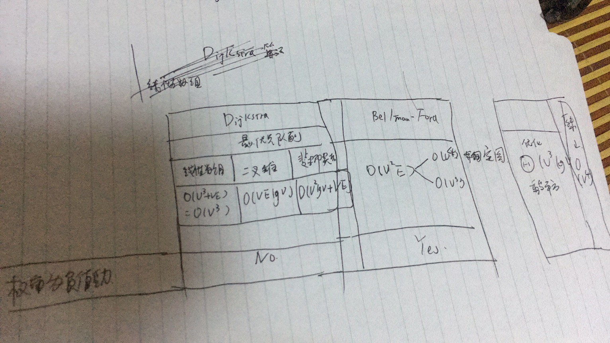
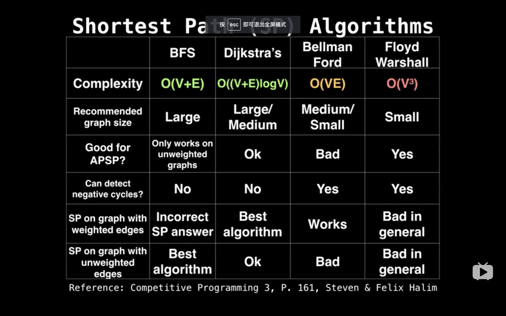
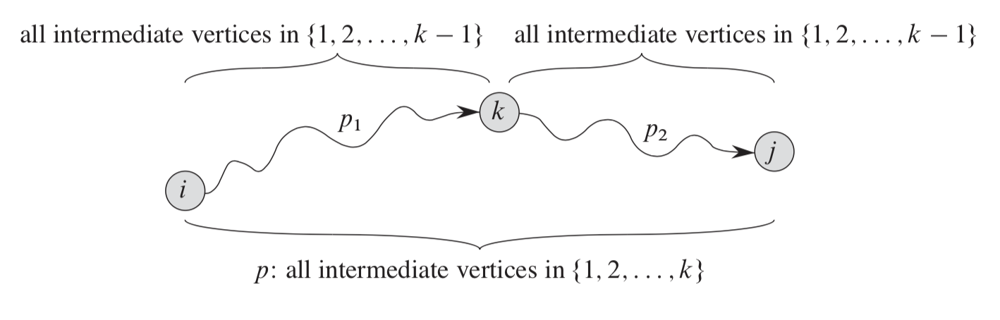
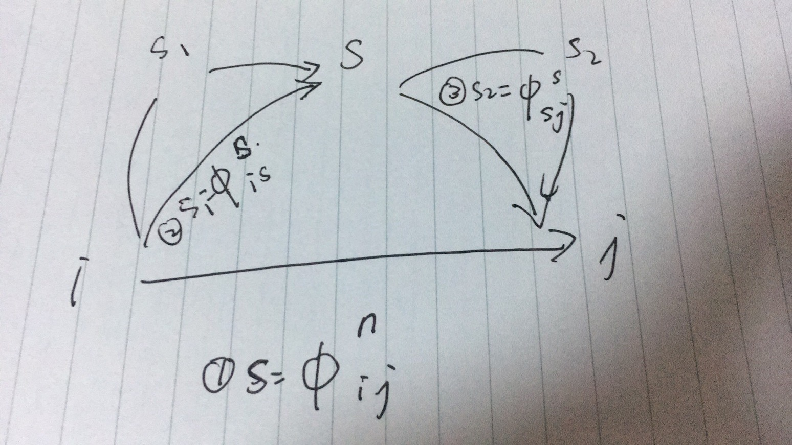

# Graph

## 最小生成树

最小生成树切分

1. EdgeWeightedGraph
1. Lazy Prim Minimum Spanning Tree
1. Prim Minimum Spanning Tree
1. Kruskal 最小生成树

## 多源最短路径（All-Pairs Shortest Path）

相关算法总结





### 最短路径和矩阵乘法

如果有向图中不存在负权重环的话，对于任意的$m \ge n-1$存在

$$
L^{(m)} = L^{(n-1)}
$$

因为进行过$n$边的放松操作之后，$L^{(n-1)}$的值已经是最小的了，不存在负权重环的情况下后续在人一次放松操作不会改变$L^{(0)}$的值。

矩阵乘法公式

$$
c_{ij} = \sum_{k=1}^n (a_{ij} \cdot b_{kj})
$$

矩阵$L^m$的公式

$$
l_{ij}^{m} = \min_{k=1}^n (l_{ij}^{m-1} + w_{kj})
$$

这两个公式存在形式上的相似性

| 对比    | 矩阵乘法  | 矩阵乘法 | 说明                                                       |
| :------ | :-------- | :------- | :--------------------------------------------------------- |
| 操作数1 | $l^{m-1}$ | $a$      |                                                            |
| 操作数2 | $\omega$  | $b$      |                                                            |
| 结果    | $l^m$     | $c$      |                                                            |
| 操作1   | $\min$    | $+$      | 都具有交换律（commutative law）和结合律（associative law） |
| 操作2   | $+$       | $\cdot$  | 操作2对于操作1都具有分配律（distribution law)              |

这五种运算的单位元分别如下（CLRS 25.1-3）：

| 运算         | 单位元                                                                                                                                                                                                                | 说明                   |
| :----------- | :-------------------------------------------------------------------------------------------------------------------------------------------------------------------------------------------------------------------- | :--------------------- |
| $+$          | 0                                                                                                                                                                                                                     | $A + 0 = A$            |
| $\cdot$      | 1                                                                                                                                                                                                                     | $A \cdot 1 = A$        |
| $\min$       | $\infty$                                                                                                                                                                                                              | $\min (A, \infty) = A$ |

最短路径操作和矩阵乘法一样具有结合律，即$(A \circ B) \circ C = A \circ (B \circ C)$成立。等式成立的关键在于操作1和操作2具有的基本运算性质。

1. SLOW-ALL-PAIRS-SHORTEST-PATHS: 类似于 Floyd-Warshall算法，可以三重循环依次计算出$L^{(0)}, ..., L^{(n)}$。
1. FASTER-ALL-PAIRS-SHORTEST-PATHS: 利用重复平方技术每次可将上标$L^{(k)}$翻倍，将复杂度从线性降到对数级别。

中需要保存$\lceil \lg(n-1) \rceil$个矩阵，每个矩阵$n^2$个元素，所以空间复杂度是$\Theta(n^2lgn)$。如果使用新老两个矩阵，老矩阵对应$L^{(m)}$，新矩阵对应$L^{(2m)}$，交替使用这两个矩阵，空间复杂度降低至$\Theta(n^2)$。 CLRS 25.1-8

判断是否包含负权重环，可以重复一次计算$L^{(n)}$的操作，如果负权重环存在的话$L^{(n)} \ne L^{(2n)}$（CLRS 25.1-9）。

### 稠密图Floyd-Warshall算法

Floyd-Warshall算法适用于图中不存在负权重环的情况，所有经过负权重环的路径可以通过多次遍历负权重环来不断减小路径总长度，因而不存在最短路径。

#### 最短距离

从节点 $i$ 到节点 $j$ 且中间节点在 $1...k$ 中的若干个路径中，最短路径的长度记做 $d_{ij}^k$，对于固定的 $k$ 值，所有节点对对应的 $d_{ij}$ 对应的值组成最短距离的矩阵，记做$D^k$。初始矩阵 $D^{(0)}$用如下方法初始化。

$$
d_{ij}^{(0)} =
    \left\lbrace
        \begin{array}{ll}
            0 & \textrm{if $i = j$}\\
            \omega_{ij} & \textrm{if edge i -> j exist}\\
            \infty & \textrm{other}\\
        \end{array}
    \right.\\
$$

如图中所示，$i$ 到 $j$的路径可以分成两种，一种是中间节点包括节点 $k$，另外一种中间节点在 $1...k-1$中，最短路径的值选取其中较小的即可。

如果这两条路径距离相等，这代表有多个距离相同的最短路径，随意选取一条即可。从 $D^{(0)}$开始可以依次计算得到 $D^{(n)}$。



$$
d_{ij}^{(k)} =
    \left\lbrace
        \begin{array}{ll}
            d_{ij}^{(k-1)} & \textrm{if $d_{ij}^{(k-1)} \le d_{ik}^{(k-1)} + d_{kj}^{(k-1)}$}\\

            d_{ik}^{(k-1)} + d_{kj}^{(k-1)} & \textrm{if $d_{ij}^{(k-1)} \gt d_{ik}^{(k-1)} + d_{kj}^{(k-1)}$}\\
        \end{array}
    \right.\\
$$

等号在公式中不同的位置对应着选取了不同的最短路径（CLRS 25.2-5），但得出的最短距离是相同的。对于等号存在的情况，从距离矩阵$D^n$包含了并不能反推出具体选择了那一条最短路径，这个信息丢失掉了，但是如果前驱与后继矩阵记录了这个信息。

直接的实现代码如下：

```java
public class FloydWarshall {
    private int n;
    private double[][][] distance;

    public FloydWarshall(double[][] matrix) {
        n = matrix.length;
        distance = new double[n + 1][n][n];

        // initialize distance(0)
        for (int i = 0; i < n; i++) {
            for (int j = 0; j < n; j++) {
                distance[0][i][j] = matrix[i][j];
            }
        }

        for (int k = 1; k <= n; k++) {
            for (int i = 0; i < n; i++) {
                for (int j = 0; j < n; j++) {
                    if (distance[k - 1][i][k - 1] + distance[k - 1][k - 1][j] < distance[k - 1][i][j]) {
                        distance[k][i][j] = distance[k - 1][i][k - 1] + distance[k - 1][k - 1][j];
                    } else {
                        distance[k][i][j] = distance[k - 1][i][j];
                    }
                }
            }
        }
    }
```
其中`distance`代表矩阵D个数的第一维是`n+1`用来存储初初始化矩阵D0和另外其他n个矩阵。

这种直接实现的空间复杂度是$O(n^3)$，采用就地计算（in-place）的方法可以将空间复杂度降到$O(n^2)$。使用一个$n\times n$二维数组存储距离矩阵，初始化为$D^0$，从$D^{k-1}$计算$D^k$将计算得到的新值$d_{ij}^k$直接存到数组中对应位置（CLRS 25.2-4）。

考虑$d_{ij}^k$计算公式:

$$
d_{ij}^k = \min (d_{ij}^{k-1}, d_{ik}^{k-1} + d_{kj}^{k-1})
$$

在矩阵更新的过程中存在中间状态，即$D^{(k)}$的前面一部分的节点值已经更新为$d_{ij}^k$，后面一部分值还没有更新。在计算时实际上使用$d_{ik}^k, d_{kj}^k$分别代替$d_{ik}^{k-1}, d_{kj}^{k-1}$进行计算。考虑 $d_{ik}^{k}$ 和 $d_{kj}^{k}$的值。

$$
d_{ik}^k = \min (d_{ik}^{k-1}, d_{ik}^{k-1} + d_{kk}^{k-1}) \\
d_{kj}^k = \min (d_{kj}^{k-1}, d_{kk}^{k-1} + d_{kj}^{k-1})
$$

考虑替换与被替换值的差值 $d_{kk}^{k-1}$，任意的$d_{kk}^{m}$在不存在负权重环的情况下值永远是0，带入公式可知：

$$
d_{kk}^m = \min (d_{kk}^{m-1}, d_{km}^{m-1} + d_{mk}^{m-1}) \\
$$

其中 $d_{km}^{k-1} + d_{mk}^{m-1}$代表一个从$k \rightarrow m \rightarrow k$的环路的权重，在图不存在负权重环的情况下$d_{km}^{k-1} + d_{mk}^{m-1} \ge 0$。又因为初始矩阵$D^{(0)}$对角线上$d_{kk}^{(0)}$是0，所以可以递归地推导出$d_{kk}^{m} = 0$。
因此

$$
d_{ik}^{k} = d_{ik}^{k-1} \\
d_{kj}^{k} = d_{kj}^{k-1}
$$

在不存在负权重环的图中使用就地计算的方法是正确的。

#### 构造最短路径

使用$\pi_{ij}^{(k)}$代表从 $i \rightarrow j$ 且中间节点在$1...k$中的最短路径上节点 $j$ 的前驱节点，由前驱节点组成的矩阵称为前驱节点矩阵 $\Pi^{(k)}$。前驱节点矩阵$\Pi^{(0)}$定义如下：

$$
\pi_{ij}^{(0)} =
    \left\lbrace
        \begin{array}{ll}
            j & \textrm{if edge i -> j exist}\\
            null & \textrm{other}\\
        \end{array}
    \right.\\
$$

根据前驱节点定义，$\pi_{ij}^{k}$ 和 $\pi_{ij}^{k-1}$之间关系如下：

$$
\pi_{ij}^{(k)} =
    \left\lbrace
        \begin{array}{ll}
            \pi_{ij}^{(k-1)} & \textrm{if $d_{ij}^{(k-1)} \le d_{ik}^{(k-1)} + d_{kj}^{(k-1)}$}\\

            \pi_{kj}^{(k-1)} & \textrm{if $d_{ij}^{(k-1)} \gt d_{ik}^{(k-1)} + d_{kj}^{(k-1)}$}\\
        \end{array}
    \right.\\
$$

对于$\pi_{ij}^{k}$来说，如果没有使用到中间节点$k$的路径权重更小对应第一种情况；如果包含中间节点$k$的路径权重更小，那么路径$i \rightarrow j$中节点$j$的前驱节点就是路径$k \rightarrow j$中$j$的前驱节点，对应第二种情况。

根据前驱节点矩阵$\Pi^{(n)}$可以计算出任意节点对$(i, j)$的最短路径，只要不断查询最短路径的前驱节点即可从后向前构造出完整的最短路径。

```java
class FloydWarshallCompact {
    public Iterable<Integer> reconstructShortestPathWithPredecessorMatrix(int start, int end) {
        checkVertex(start);
        checkVertex(end);

        List<Integer> shortestPath = new ArrayList<>();
        if (start == end) {
            shortestPath.add(start);
            return shortestPath;
        }

        if (predecessorMatrix[start][end] == null) {
            return null;
        }

        for (Integer predecessor = end; predecessor != null; predecessor = predecessorMatrix[start][predecessor]) {
            shortestPath.add(predecessor);
        }

        Collections.reverse(shortestPath);
        return shortestPath;
    }
}
```

使用后继节点的概念可以类似前驱节点的思路构造最短路径。

另外一种思路是使用最大中间节点的概念（CLRS 习题25.2-7），$m_{ij}^{k}$表示路径$i \rightarrow j$且中间节点在$1...k$中，使用到的中间节点最大的值。对应的最大中间节点矩阵记做$M^{(k)}$，其中$M^{(0)}$定义如下：

$$
m_{ij}^{(0)} =
    \left\lbrace
        \begin{array}{ll}
            null & \textrm{all}\\
        \end{array}
    \right.\\
$$

两个节点不存在有向边和存在时不做区分，都可以将初始值设置`null`，在根据最大中间节点矩阵构造最短路径时得到最大中间节点是`null`时即可停止递归。最大中间节点的递归计算公式如下：

使用最大中间节点的概念构造最短路径时稍有不同，如果$m_{ij}^{k}$是节点s，那么s位于最短路径上且将路径分为两段，$i \rightarrow s$和$s \rightarrow j$段的中间节点最大都不超过s，递归进行此操作当获取的最大中间节点是$-1$时终止。



```java
class FloydWarshallCompact {
    public Iterable<Integer> reconstructShortestPathWithMaxIntermediateMatrix(int start, int end) {
        checkVertex(start);
        checkVertex(end);

        List<Integer> shortestPath = new ArrayList<>();
        if (start == end) {
            shortestPath.add(start);
            return shortestPath;
        }

        if (maxIntermediateMatrix[start][end] == null) {
            return null;
        }

        class Node {
            private Integer value;
            private Node prev;
            private Node next;

            Node(Integer value, Node prev, Node next) {
                this.value = value;
                this.prev = prev;
                this.next = next;
            }
        }

        Node startNode = new Node(start, null, null);
        Node endNode = new Node(end, null, null);
        startNode.next = endNode;
        endNode.prev = startNode;

        Queue<Pair<Node, Node>> nodePairs = new LinkedList<>();
        nodePairs.add(Pair.of(startNode, endNode));

        while (!nodePairs.isEmpty()) {
            Pair<Node, Node> pair = nodePairs.poll();

            final Integer maxIntermediate = maxIntermediateMatrix[pair.first.value][pair.second.value];
            if (maxIntermediate >= 0) {
                Node maxIntermediateNode = new Node(maxIntermediate, pair.first, pair.second);
                pair.first.next = maxIntermediateNode;
                pair.second.prev = maxIntermediateNode;

                nodePairs.add(Pair.of(pair.first, maxIntermediateNode));
                nodePairs.add(Pair.of(maxIntermediateNode, pair.second));
            }
        }

        while (startNode != null) {
            shortestPath.add(startNode.value);
            startNode = startNode.next;
        }

        return shortestPath;
    }
}
```

对称地使用最小中间节点的概念也能构造最短路径，但是此时要将使用的中间节点限制在$k...n$中而不是$1...k$中。

#### 从距离矩阵构造节点矩阵

上面是在计算距离矩阵的过程中同时计算节点矩阵，这种方法计算出的节点矩阵和距离矩阵是完全一致的（使用相同的放松操作）。从距离矩阵中也可以直接计算出节点矩阵，对于节点对$i \rightarrow j$，如果中间节点$k$满足以下公式：

$$
d_{ik}^{(n)} + d_{kj}^{(n)} = d_{ij}^{(n)}
$$

```java
class FloydWarshallCompact {
    /**
     * detect whether node is on the shortest path from start to end using distance matrix, return {@code true} when node equals
     * start or end.
     * @param start start node of shortest path
     * @param end end node of shortest path
     * @param node node to detect
     * @return {@code true} if node is on shortest path from start to end, {@code false} otherwise.
     */
    private boolean nodeOnShortestPath(int start, int end, int node) {
        return Double.compare(distanceMatrix[start][node] + distanceMatrix[node][end], distanceMatrix[start][end]) == 0;
    }
}
```

说明节点$k$是最短路径$i -> j$上的一个节点（可能是$i$,$j$本身）。符合这个条件的节点$k$有多个，需要借助$D^{0}$来判断边$i \rightarrow k$和$k \rightarrow j$是否存在。

$$
d_{ik}^{(n)} = d_{ik}^{(0)} \\
d_{kj}^{(n)} = d_{kj}^{(0)}
$$

上述条件是点位于最短路径上的必要条件，如果存在多条最短路径（零权重环或者两条长度相同的最短路径），那么计算的到的节点矩阵并不唯一，具体结果取决于节点顺序，因此可能与在放松操作过程中直接计算出来的节点矩阵并不相同。

```java
class FloydWarshallCompact {
    /**
     * detect whether node is on the shortest path from start to end using distance matrix, return {@code true} when node equals
     * start or end.
     * @param start start node of shortest path
     * @param end end node of shortest path
     * @param node node to detect
     * @return {@code true} if node is on shortest path from start to end, {@code false} otherwise.
     */
    private boolean nodeOnShortestPath(int start, int end, int node) {
        return Double.compare(distanceMatrix[start][node] + distanceMatrix[node][end], distanceMatrix[start][end]) == 0;
    }

    /**
     * detect whether node is on the shortest path from start to end using distance matrix, return {@code true} when node equals
     * start or end.
     * @param start start node of shortest path
     * @param end end node of shortest path
     * @param node node to detect
     * @return {@code true} if node is on shortest path from start to end, {@code false} otherwise.
     */
    private boolean nodeOnShortestPath(int start, int end, int node) {
        return Double.compare(distanceMatrix[start][node] + distanceMatrix[node][end], distanceMatrix[start][end]) == 0;
    }

    /**
     * detect whether an edge exist from start to end, return {@code false} when start equals end
     * @param start start node
     * @param end end node
     * @return {@code true} when an edge from start to end exist, {@code false} otherwise.
     */
    private boolean hasEdge(int start, int end) {
        if (start == end) {
            return false;
        }

        return Double.compare(distanceMatrix[start][end], matrix[start][end]) == 0;
    }
}
```

#### 负权重环路检测（CLRS 习题25.2-6）

Floyd-Warshall算法在图中不存在负权重环路时能够正确得到最短距离，而且对角线`i=j`上的值全都是0。如果存在负权重环路，那么位于负权重环路上的部分可以多次通过环路不断缩小路径权重。而且`i=j`对角线上的值可以是负值。

在完成正常的三重循环计算最短距离矩阵后，可以再进行一次三重循环，这次如果有中间节点$k$是的$i \rightarrow k \rightarrow j$更小的话，说明$i \rightarrow j$在负权重环上，将$d_{ij}^{k}$设置为负无穷，前驱后继节点设为空。

### 有向图传递闭包（Transitive Closure）

有向图 $G=(V, E)$ 的传递闭包图定义为 $G^{*} = (V, E^{*})$，其中
$E^{*} = {(i, j)}$如果图G中包含一条从节点到j的路径。

最小距离矩阵的中如果节点对$(i, j)$的距离值是负无穷（负权重环可达）或者一个有限值（普通最短路径）说明边$i \rightarrow j$在$i$的传递闭包中。

更快速的方法是修改计算最短距离矩阵的推导公式，那么可以直接计算得到传递闭包矩阵。初始矩阵如下：

$$
t_{ij}^{(0)} =
    \left\lbrace
        \begin{array}{ll}
            0 & i \ne j 且 (i, j) \notin E\\
            1 & i = j 或(i, j) \in E\\
        \end{array}
    \right.\\
$$

如果$t_{ij}^{(k-1)}$能够触达或者通过中间路径$i \rightarrow k \rightarrow j$能够触达，那么$t_{ij}^{(k)}$值为1。

$$
t_{ij}^{(k)} = t_{ij}^{(k-1)} \lor (t_{ik}^{(k-1)} \land t_{kj}^{(k-1)})
$$

[应用](https://en.wikipedia.org/wiki/Floyd%E2%80%93Warshall_algorithm)

### 稀疏图Jhonson算法

Graph Theory
1. https://www.bilibili.com/video/av70846943
1. MIT Open Course
