# BFC

规范

https://www.w3.org/TR/CSS21/visuren.html#block-formatting

position schemes

1. normal flow
2. relative position
3. absolute position

TODO: BFC 对定位和布局有什么影响

1. BFC 嵌套有什么效果？
1. 两个相邻的 BFC 有什么效果

## BFC

CSS 中有三种布局环境:

1. **B**locking **F**ormatting **C**ontext 盒子布局
1. **I**nline **F**ormatting **C**ontext 行内布局
1. **F**lex **F**ormatting **C**ontext 弹性盒布局 (待确定)

一个建立了 BFC 环境的元素会将其所有子元素**包含在其边界之内**，包含浮动的子元素。BFC 在[很多情况](https://developer.mozilla.org/en-US/docs/Web/Guide/CSS/Block_formatting_context#Using_display_flow-root)下创建:

1. 根元素`<html>`
1. 绝对定位元素 `position: absolute`, `position: fixed`
1. 浮动元素 `float: left | right | inline-start | inline-end ` 不是`none`.
1. `inline-block`元素
1. `display: flow-root`元素
1. `overflow`值不是`visible`的元素
1. `contain: layout | content | strict`元素
1. table, flex, grid 相关的元素

```css
display: table;
display: table-cell;
display: table-caption;
display: table-row;
display: table-row-group;
display: table-header;
display: table-header-group;
display: inline-table;
display: inline-flex;
display: inline-grid;
```

1. `column-span: all` `column-count: 1`的元素

注意`display: block`并不建立新 BFC，元素之间的定位布局、浮动与清除和边距合并(Margin Collapsing)只局限在一个 BFC 内部的元素之间。

## 浮动与清除

浮动元素内容使文本和其他元素围绕其进行布局，从而实现图文混排的效果。

```html
<div class="box">
  <div class="float">I am a floated box!</div>
  <p>I am content inside the container.</p>
</div>

.box { background-color: rgb(224, 206, 247); border: 5px solid rebeccapurple; }
.float { float: left; width: 200px; height: 150px; background-color: white;
border:1px solid black; padding: 10px; }
```

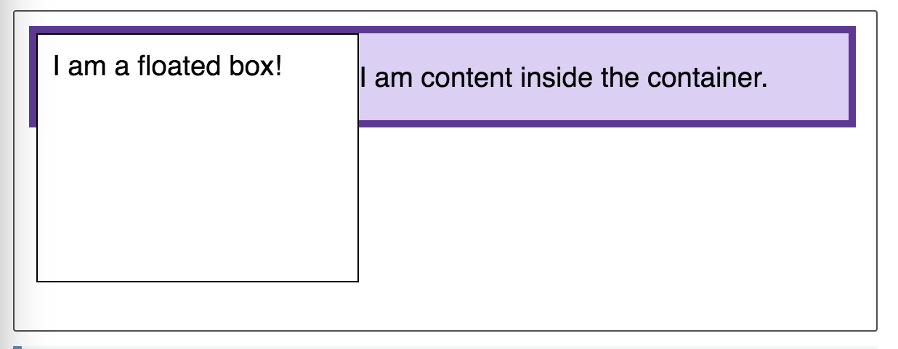

上图中`div`元素浮动到左侧，`p`元素中的文字必须放到所有左侧浮动元素的右侧。
但是注意浮动元素被抽离出普通文档流(Normal Flow)，`p`元素在确定本身的边界时并不考虑浮动元素，所以其左边界从父元素的左边界开始，自动宽度的`div`元素默认占据了父元素宽度的 100%。父元素在`height: auto`自动高度情况下，同样浮动元素的高度不参与计算，父元素高度等于所有非浮动子元素即`p`元素撑起的高度。

如果想要父元素包含浮动的子元素，可以使用清除浮动和建立 BFC 两种方法。

### 清除浮动(clearfix)

使用`clear`属性能够清除在该元素文档顺序(Document Order)之前的浮动元素，使得该元素从之前的所有浮动元素竖直方向最低处重启一行开始布局。具体的方法是移动该元素使得元素的上边框(top border)顶部位于紧贴最低位置的浮动元素的下边界底部(bottom margin)下方处。这也是边界收缩（Margin Collapse）产生的原因。

利用这个特性只要在所有浮动子元素之后有一个元素清除所有浮动即可使得该元素位于浮动元素下方，从而撑起的父元素高度将所有浮动元素包含在边界之内。通常的做法是在父元素上对`after`伪元素进行浮动清除，这个方法被叫做 clearfix。

```css
.box::after {
  content: '';
  display: block;
  clear: both;
}
```

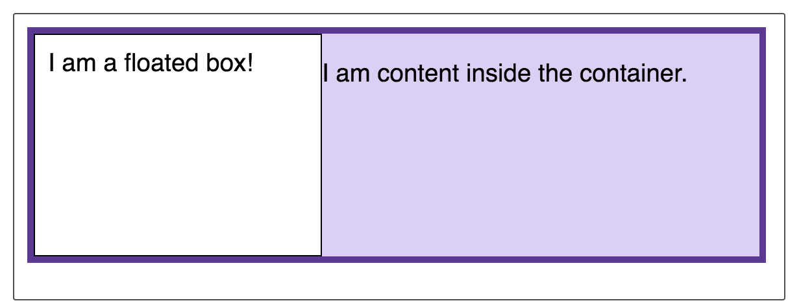

### 新建 BFC

由于 BFC 会把所有子元素包括浮动元素包含在其边界之内，所以在父元素上建立 BFC 同样内容使得父元素高度被浮动元素撑起。

将父元素设置`display: flow-root`，等效于设置`display: block`，不同之处在于会在该元素上创建一个新的 BFC。但是`flow-root`值是一个比较新的特性，使用时需要注意兼容性问题。

老的做法是将`overflow`属性设置成`visible`以外的值(`auto`/`hidden/scroll等`)创建 BFC，但是这是在无法使用`flow-root`时曲线救国的方法，存在两个缺点。

1. `overflow`值造成[副作用](https://webdesignerwall.com/demo/clear-float/drawbacks.html)
1. 意图和代码不一致，使用时请添加注释

## 图文混排 BFC 与浮动

正常情况下使用浮动产生图文混排的效果如下图。

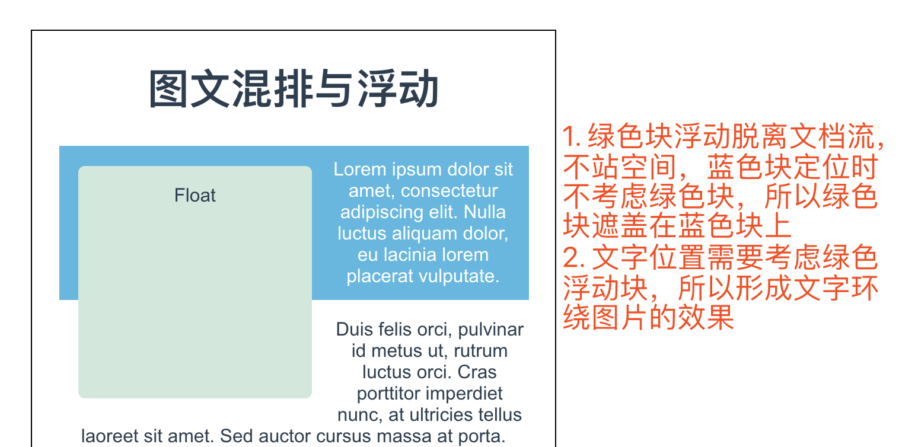

 考虑浮动效果只局限在一个 BFC 中，可以使用新建 BFC 的方法来隔离某个元素内的子元素，从而将该元素作为整体在外层 BFC 中进行定位，避免元素内部的文字和子元素与外层 BFC 关联。设置蓝色块的样式如下即可。

```css
overflow: auto;
/* 或者 */
display: flow-root;
```

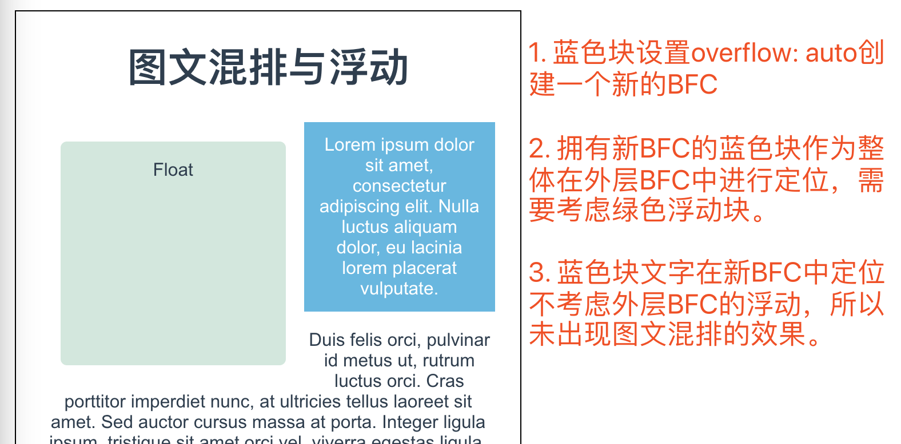

[浮动 MDN](https://developer.mozilla.org/en-US/docs/Learn/CSS/CSS_layout/Floats)

## 一个实例

在实际项目中碰到过这样一个实例，实现一个简单的 tab 导航如下。

```html
<template>
  <div class="tabs">
    <div class="tabs__headers">
      <div class="tabs__header">left</div>
      <div class="tabs__header">right</div>
    </div>
    <div class="tabs__content">
      a BFC and float example<br />
      a BFC and float example<br />
      a BFC and float example<br />
      a BFC and float example<br />
      a BFC and float example<br />
      a BFC and float example<br />
      a BFC and float example<br />
      a BFC and float example<br />
      a BFC and float example<br />
      a BFC and float example<br />
      a BFC and float example<br />
      a BFC and float example<br />
      a BFC and float example<br />
      a BFC and float example<br />
    </div>
  </div>
</template>

<style lang="stylus" scoped>
  .tabs
    width 200px
    height 200px
    margin auto
    border 1px solid black
    &__headers
      line-height 32px
      height 32px
      border-top 1px solid #ccc
      border-bottom 1px solid #ccc
      // box-sizing border-box
    &__header
      width 50%
      float left
    &__content
      overflow auto
      max-height calc(200px - 32px - 2px)
      width 100%
      background cyan
</style>
```

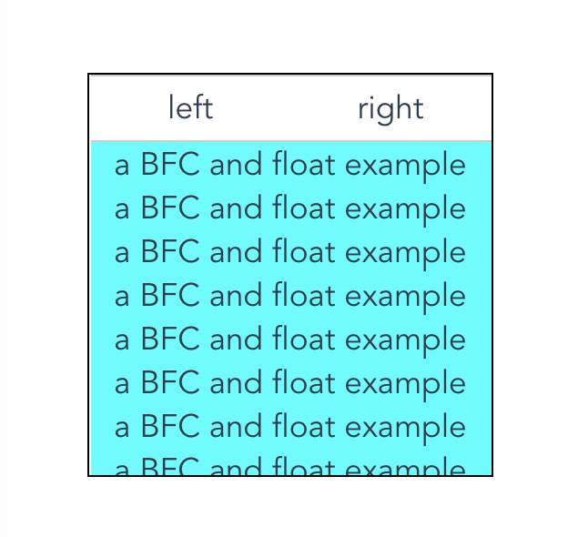

导航的两个`tabs__header`使用浮动并各占一半的宽度，高度和行高都是`32px`，导航栏`tabs__headers`上下各有 1 像素的边框。下方的内容区域`tabs__content`设置`overflow:auto`，高度最高占据父元素的剩余高度(父元素高度减去包括边界的导航栏总高度)，超出后进行滚动。注意这个时候`tabs__headers`默认的的`box-sizing: content-box`。这个时候导航栏和内容块的高度是正确的，加起来刚好占满父元素高度。

但是考虑这种实际出现的情况，如果`tabs__header`被设置为`box-sizing: border-box`，`tabs__headers`和内容块`tabs__content`之间出现了 1 像素的空白，效果如下图。

产生空白的原因如下:

1. 导航栏`tabs__headers`整体高度（包括上下各 1px 的边）是 32px，所以其内容区域高度 30px。
1. 单个导航`tabs__header`浮动，导致产生了新的 BFC，继承父元素的行高 32px，一行文字撑起其高度也为 32px。`tab__headers`高度和`tab__header`都是 32px 高度，同时单个`tabs__header`定位从父元素内容内容区域左上角开始，所以导致其底部超出`tab__headers`下边界还要多 1px 距离。
1. 由于内容区域`tabs__content`设置了`overflow: auto`，所以也生成一个新 BFC，这个 BFC 和`tabs__header`的 BFC 属于同一外层 BFC，因此`tabs__content`定位时刚好处于`tabs__header`下方，所以显示多出来 1px 的距离。

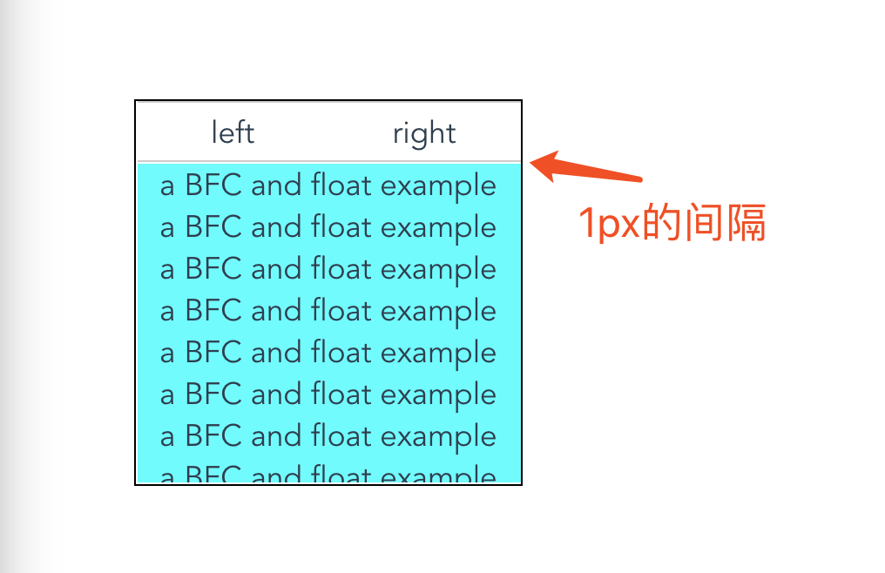

消除多余 1px 空白的方法，示意图使用大一点的尺寸(border 5px)

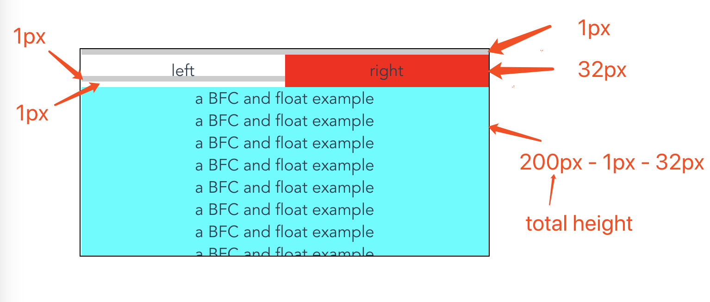

1. 正确使用`box-sizing: content-box`，这样`tabs__headers`的高度就是 34px(内容区域高度加上上下边框)，单个`tabs__header`的高度是 32px，刚好等于`tabs__headers`的内容区域高度 32px, 不产生 overflow，就不会有 1px 空白。

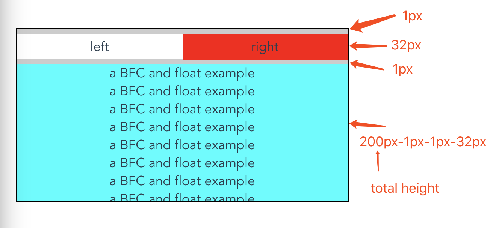

1. 在`tabs__headers`上新建 BFC，设置`overflow:auto`或者`display: flow-root`，这样`tabs__headers`的高度是 32px，所以除去上下边框内容区域高度是 30px，但是单个`tabs__header`继承了行高 32px，所以高度也是 32px，30px 内容区域包含了 32px 的内容，产生了 overflow，但是由于`overflow:auto`，所以出现滚动条，但是内容不会超出`tabs__headers`。

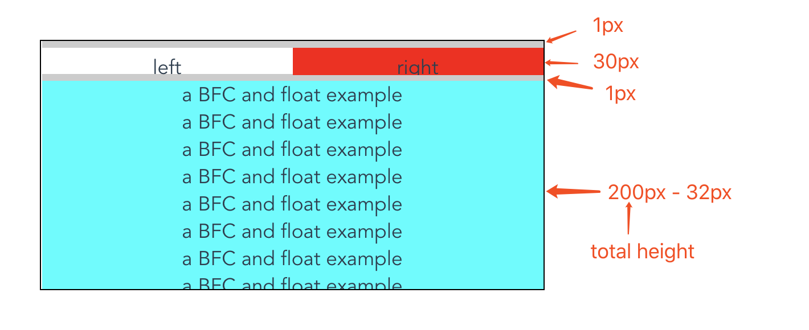

1. `tabs__content`不设置`overflow:auto`，这样不产生新的 BFC，定位时从`tabs__headers`的下边界底部之下开始算起（就是 1px 空白所在的位置），这样 1px 空白被包含在`tabs__content`内部，但是其中的文字还是会受动浮动影响，再向下避开 1px 距离，所以`tabs__content`的高度会比前两种情况高出 1px。同时由于取消了`overflow:auto`，内容区域出现了 overflow。

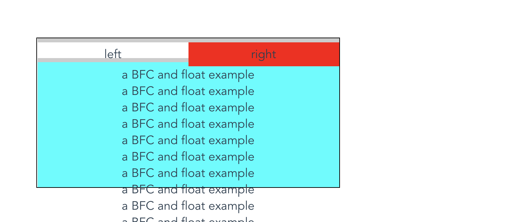

## BFC 与边距收缩(Margin Collapsing)

竖直方向上(Block Direction)，在上下相邻元素，父元素和第一个子元素顶部，父元素和最后一个子元素底部等位置会发生边距收缩的情况，元素之间的距离等于两个边距中较大的一个，这是由于布局算法所导致。

普通文档流元素定位时，会保证该元素的**上边界顶部**位于前一个兄弟元素、前一个兄弟元素的最后一个子元素以及最低的浮动元素（清除浮动时）的**下边距底部**的**下方**，同时保证这些元素的**下边界底部**位于定位元素的**上边距顶部**的**上方**，造成的效果就是边距被收缩了，最终的边距等于所有被收缩边距中最大的一个。

需要注意的是边距收缩只发生在同一个 BFC 内的元素之间，一个 BFC 与上层 BFC 环境中的元素在边界处不会发生边距收缩，实例如下。

```html
<div class="blue"></div>
<div class="red-outer">
  <div class="red-inner">red inner</div>
</div>

.blue, .red-inner { height: 50px; margin: 10px 0; } .blue { background: blue; }
.red-outer { display: flow-root; background: red; }
```

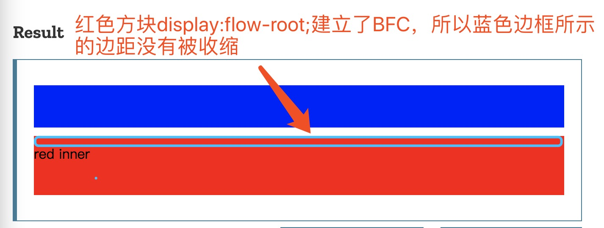

## 参考

1. [Understanding Block Formatting Contexts in CSS](https://www.sitepoint.com/understanding-block-formatting-contexts-in-css/)
