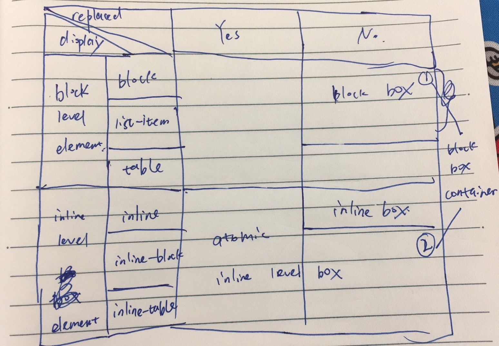

# Concepts

## Box Generation

**block-level elements** generate block-level boxes. Browser typically display block level elements with a newline both before and after it. A block level element takes up all available space if possible. Element with `position` of `block`, `list-item` and `table` are block elements.

**block-level elements** generate **block-level box**.

1. all generate a principal block-level box (all)
1. `list-item` element generates additional block-level box(marker box).

**block-level box** are laid out vertically, each box occupies one line. **block box** are **block-level box** that's **block container box** at the same time.

**Inline-level elements** are those that don't form new blocks but are distributed in lines. Element with `display` value of `inline`, `inline-block` and `inline-table` are inline elements.

**Inline-level elements** generate **inline-level boxes**, which participates in inline outer formatting context. **Inline-box** is inline-level box with its content participating in inline formatting context. Inline-level boxes like replaced inline-level elements, inline-block elements, and inline-table elements are not inline boxes, they're referred as **atomic inline-level boxes** because they participate in inline formatting context as a single opaque box.

**Block container box** is box that contains boxes. It either establishes a block formatting context and thus contains only contains block boxes inside it, or establishes an inline formatting context and thus contains only inline boxes inside it.

1. block boxes
1. non-replaced inline box, `display: inline-block`
1. non-replaced table cells, `display: table-cell`

If a block container box has block-level box inside it, then anonymous block-level boxes are created to contain text content to ensure that block container box only contains block-level boxes.

<table style="border: 1px solid gray">
  <tr>
    <th style="border: 1px solid gray">element type</th>
    <th style="border: 1px solid gray">position</th>
    <th style="border: 1px solid gray">replaced</th>
    <th style="border: 1px solid gray">non-replaced</th>
  </tr>
  <tr style="border: 1px solid gray">
    <td style="border: 1px solid gray" rowspan='3'>block-level box</td>
    <td style="border: 1px solid gray">block</td>
    <td style="border: 1px solid gray" rowspan='3'></td>
    <td style="border: 1px solid gray" rowspan='2' style="border: 1px solid gray">block box</td>
  </tr>
  <tr>
    <td>list-item</td>
  </tr>
  <tr>
    <td>table</td>
    <td></td>
  </tr>
  <tr style="border: 1px solid gray">
    <td rowspan='3'>inline-level box</td>
    <td style="border: 1px solid gray">inline</td>
    <td rowspan='3'>atomic inline level box</td>
    <td style="border: 1px solid gray">inline box</td>
  </tr>
  <tr>
    <td>inline-block</td>
    <td></td>
  </tr>
  <tr>
    <td style="border: 1px solid gray">inline-table</td>
    <td></td>
  </tr>
</table>

1. [W3C ORG Visual Formatting Model](https://www.w3.org/TR/CSS21/visuren.html#inline-boxes)
1. [WHATWG CSS Display Module Level 3](https://drafts.csswg.org/css-display/#block-formatting-context)

## Box Model

1. border doesn't accept percentage values
1. padding-top/padding-bottom percentage values are calculated base on parent content area width. parent element's content height would change base on its children height, while parent width doesn't.
1. height/width percentage values are calculated to parent height/width

There're two choices for content area of inline non-replaced elements left for user agent's decision.

1. em box - content area has the same height as em box, which also equals font size, but some character glyphs with certain font may go beyond em box, so character glyphs of different lines may overlap with each other.
1. highest ascender and lowest descender - character glyphs will not cross content area, but content area height is decided by used font instead of em box, so content area height is indeterminate.

## Box Width & Margin

1. margin-left + border-box-width + margin right = containing-block-width
1. border-box-width = box-sizing == border-box ? width :
    border-left + padding-left + content-width + padding-right + border-right
1. width: auto | percentage, auto makes it occupies all available space
1. margin-left, margin-right auto, auto splits available space
1. if over constrained, margin-right with explicit width are ignored, treated as auto and evaluated to any value that satisfies this equation in left-to-right language context, otherwise margin-left are ignored and reevaluated in right-to-left language context.
1. for replaced element with intrinsic width, 'auto' is evaluated to intrinsic width
1. width and height scales up or down proportionally for replace element with intrinsic ratio
1. 'auto' for margin-top/margin-bottom will evaluate to 0 instead of splitting available
1. percentage values are calculated with respect to containing block content width or height
1. percentage height for margin-top and margin-bottom are reset to auto if containing-block height is not explicitly specified.
1. border width doesn't accept percentage values
1. vertical auto height is decided by vertical space occupied by all child elements
1. vertical margins are collapsed if possible, negative margins are collapse that distance between two contents box are margin with larger absolute value.

## Absolute Positioning

1. Absolutely positioned element is laid out with reference to its containing block.
1. Containing block is block generated by its nearest positioned ancestor element or initial containing block
1. If containing block is an inline box split across multiple line boxes, top and left edge of containing block is same as starting position on first line box, right and bottom edge of containing block is same as ending position on last line box.

## Inline box

1. inline elements are vertically aligned with respect to parent inline box or **strut** of parent block container.
1. baseline of 'inline-table' is the baseline of the first row of the table
1. baseline of 'inline-block' is the baseline of last line box if it has in-flow text and `overflow: visible`, otherwise baseline is its bottom margin edge