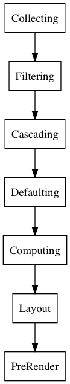

# [级联与继承(Cascade & Inheritance)](https://drafts.csswg.org/css-cascade-4/)



## 获取样式文件

1. `@import`导入的样式文件内容顺序被认为等同于就地替换。`@namespace`/`@charset`和条件引入(conditional import)决定该样式文件是否适用。
1. 被引入的样式文件的源(origin)和引入该文件的样式文件的源一致
1. 被引入的样式文件的环境编码[(Environment Encoding)](https://drafts.csswg.org/css-syntax-3/#environment-encoding)和引入该文件的样式文件的编码一致
1. 同样的样式文件被多次引入，视为相互独立，分开处理。
1. `@import`引入的文件内容类型(Content-Type)
    1. 如果资源文件没有Content-Type的response头，或者所在HTML文档处于怪异模式而且和引入的资源文件同源，内容类型是`text/css`
    1. 其他情况下内容类型由response头的Content-Type决定
    1. `text/css`内容类型文件被当做样式文件，否则被当做网络错误。

## 简化属性(Shorthand Property)

1. 简化属性效果等同于就地替换为所有包含的长属性，在简化属性中未显示指定的长属性值隐式设置为初始值(initial value)，除非有额外规定。 简化属性默认设置未指定长属性值为初始值的效果在使用中需要注意。
    ```css
    margin 10px
    /* 只指定了一个值，但是根据margin属性的规则，这等同于 */
    margin 10px 10px 10px 10px
    ```
    有些简化属性的语法并不能指定某个长属性的值，这些长属性([reset only sub property](https://drafts.csswg.org/css-cascade-4/#reset-only-sub-property))在简化语法中永远是被隐式设置为初始值intial value的。
1. 简化属性值如果是CSS关键字(initial/inherit/unset/revert)，效果等同于设置所有的长属性值为改关键字，包括reset only sub property。
1. 简化属性中的`!important`效果等同于所有长属性都有`!important`效果。

### 别名

表示同一个功能的属性名称可能会发生变化，例如支持vendor prefix的属性。为了向后兼容，而且优先使用标准名称，需要对别名做处理。

1. [legacy name alias](https://drafts.csswg.org/css-cascade-4/#legacy-name-alias)如果旧属性名的功能和新属性名的功能完全一致，或者被新属性名功能包含。在编译时，就属性名被完全替换为新属性。 CSSOM中`old-name`的使用被认为等同于`new-name`
    ```js
    getComputedStyle(el, null).oldName
    getComputedStyle(el, null).newName

    el.style.setPropertyValue('old-name', value)
    el.style.setPropertyValue('new-name', value)
    ```
1. [legacy shorthands](https://drafts.csswg.org/css-cascade-4/#legacy-shorthand)如果旧属性的功能能完全被新属性替代，那么旧属性被当做新属性的简化属性处理，展开为新属性，在CSSOM进行序列化的时候只会使用新属性名。

### all

属性值为initial/inherit/unset/revert，重设所有属性（除了`direction`和`unicode-bidi`)，包括浏览器样式(user agent origin)也会被覆盖。

## 样式来源（Origin）

1. Author Origin
1. User Origin
1. User Agent Origin
1. Animation Origin
1. Transition Origin

## Specificity

由四个非负整数值构成

```css
0 0 0 0
```

1. inline样式数字1值为0，其他样式为1
1. 每个id selector在第2位数字贡献1，(0, 1, 0, 0)
1. 每个class/pseudo class/attribute在第3位数字贡献1，(0, 0, 1, 0)
1. 每个element/pseudo element在第3位数字贡献1，(0, 0, 0, 1)
1. universal selector(*)值为(0,0,0,0)
1. 隐式inherit的值，没有Specificity,优先级低于(0, 0, 0, 0)

combinator与Specificity无关，不考虑。

## 属性值处理(Value Processing)

1. Filtering (Declared Values)
    1. 属于当前文档
    1. 满足条件(Conditional Rule)
    1. 选择器匹配(Selector Matched)
    1. 语法正确
1. Cascade (Cascaded Value)
    1. 来源与important
        1. Transition
        1. 浏览器important规则
        1. 用户important规则
        1. 作者important规则
        1. Animation规则
        1. 作者规则
        1. 用户规则
        1. 浏览器规则
    1. Scope(未支持)
    1. Specificity
    1. 文档顺序
        1. 样式文件内使用`@import`引入的其他样式文件规则当视为就地替换
        1. HTML文件中多个样式文件按照源码顺序
        1. `style`属性引入的行内样式内部按照源码顺序，整体排在其他来源之后
    1. Non-CSS Presentational Hits，当做浏览器样式放在最后或者作者样式放在最前（Specificity为0）
1. Defaulting (Specified Value) 保证每个元素的每个属性必定有一个specified value
    1. 有Cascaded Value
      1. 特殊关键字 initial/inherit/unset/revert
    1. 没有Cascaded Value
        1. inherited属性有父元素，取Inherited Value，等于父对象该属性的computed value
        1. inherited属性无父元素或者non-inherited属性，取Initial Value
1. Resolving (Computed Value) 在不进行布局(Layout)等昂贵操作的前提下，尽可能解析得到computed value
    1. 相对单位`em`/`ex`/`vh`/`vw`
    1. 关键字`smaller`/`bolder`
    1. 百分比
    1. 相对路径url
    1. 不适用的属性也有Computed Value,某些属性会根据是否适用于元素对Computed Value特殊处理。
1. Layout (Used Value) 完成所有计算，得到使用值
    1. 如果属性不适用于元素，该属性没有Used Value
        1. `flex`在非flex item元素上没有used value
1. Pre-Rendering (Actual Value) 根据最终渲染媒体类型调整部分值
    1. 非整数的长度值，屏幕无法绘制非整数长度像素的值。
    1. 根据font字体文件时候可用，或者`font-size-adjust`属性可能调整元素的`font-size`

历史原因window.getComputedStyle(element, null) 返回的属性值不一定是computed value,可能是used value

## 属性计算依赖

1. 子元素的属性可能依赖于父元素的属性
1. 子元素的属性可能依赖于一个或者几个该元素的其他属性
1. 元素的属性可能依赖于子元素的属性`break-before: auto`, 受第一个子元素影响used value `break-before: page`?

width/height 属性百分比的值，containing block的宽度和长度未知且不是绝对定位的情况下，计算值为`auto`,但是`getComputedStyle`返回的值不是computed value而是某个具体的数字`100.3px`。
