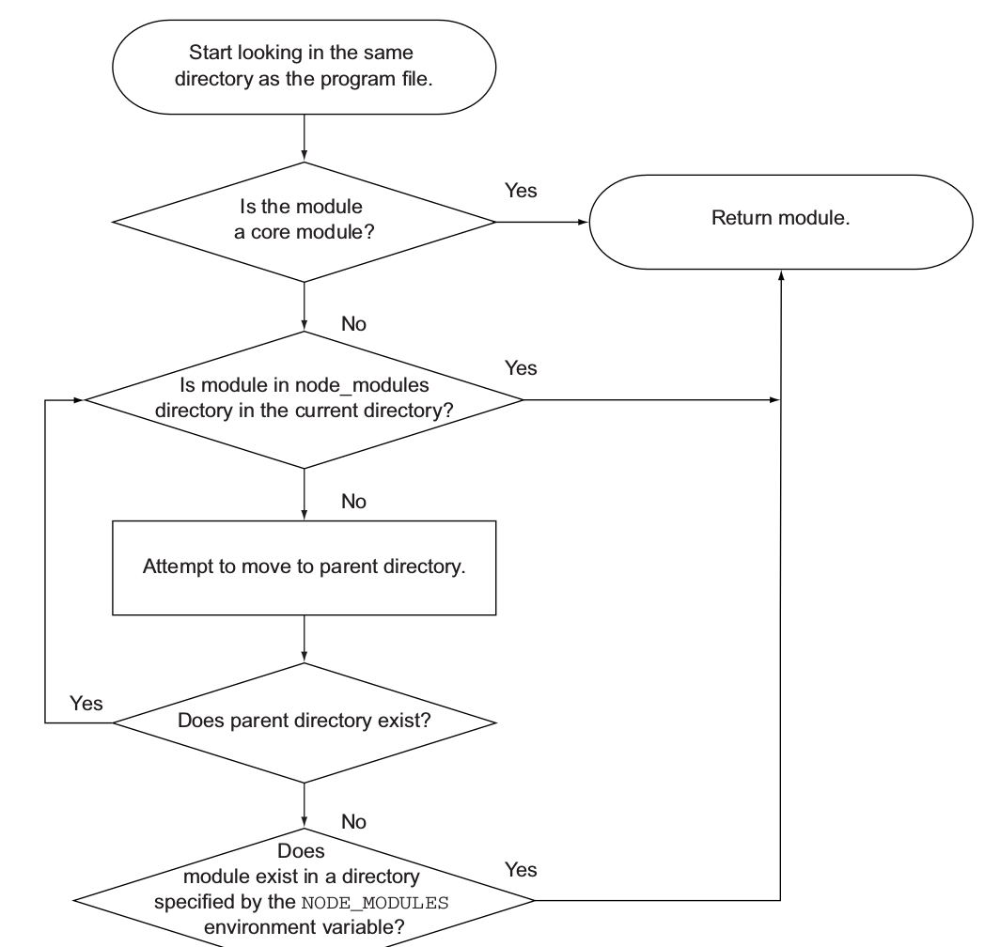
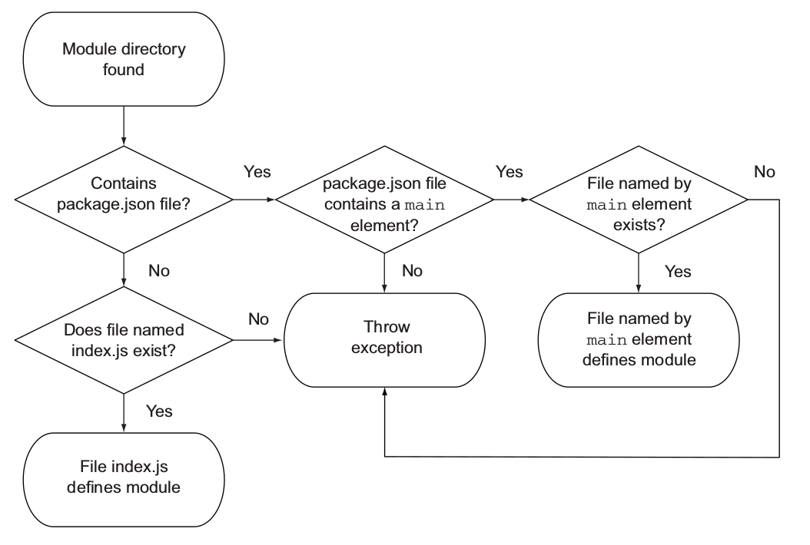
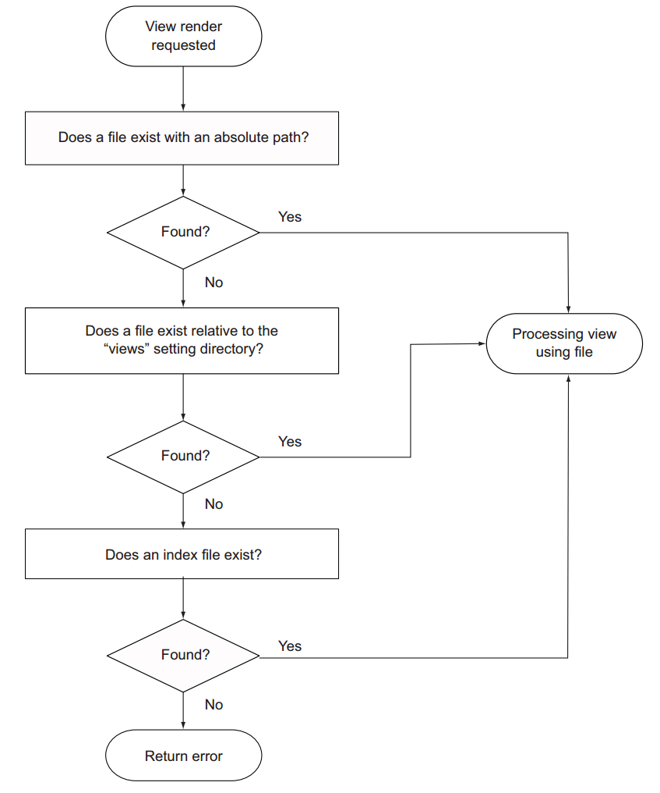
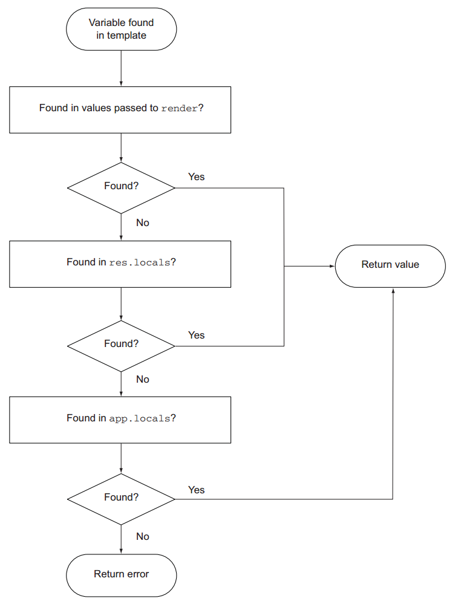

# Node

## Contents

1. Fundamentals [2, 3, 5]
    1. Modules
    1. Standard IO, console and command-line
    1. Timers
    1. Buffer
    1. Events
    1. Streams
    1. FileSystem
    1. NetWorking
        1. TCP/IP
        1. HTTP
        1. HTTPS
    1. Process
    1. Debugging
    1. NPM
1. Socket.IO
1. Connect and middlewares
1. Restful API
1. Express [1,2, 4]
    1. express generator
    1. View and Template Engine
    1. Routing
    1. Form
    1. Logging
    1. Real-time Communication
    1. Security
    1. Caching and Scaling
    1. Minification
    1. Compression
1. Database
    1. MySQL
    1. PostgreSQL
    1. Redis
    1. MongoDB and Mongoose
1. Test Node
1. Production
    1. Deployment
1. Mobile
    1. Ionic

## CommonJS

1. Import module with `require()` function like `var math = require('math')`.
1. A module is a javascript file, variable `module` represent current module.
1. Use `module.exports` or `export` to export variables.

Notice that `exports` is just a reference to `module.exports`, so don't set `exports` variable to anything else, it breaks reference of `exports` to `module.exports`.



1. core module
1. is relative path or absolute path,
1. find module in sibling folder `node_modules`, if not found repeat this process in parent folder recursively until root path.
1. find module in folder specified by environt variable `NODE_MODULES`, throw exception is not found.



1. If module is a directory
   1. If there is a file `package.json`, it must contains an element `main` that specifies entry file.
   1. Other wise entry file is `index.js`
1. module is a file `module.js`


## connect

`connect` uses middlewares to process request, generate responses and handle errors. A middleware is a function that can be mounted to a certain route path using `connect().use(path, middleware)`. Inside middle `req.url` is relative to mounted route path, so that middlewares can be conviniently remouted to another route path.

1. `req.url = '/'`, actual route path is `path/`
1. `req.url = '/users/3'`, actual route path is `path/users/3`

Middlewares usually has two forms of signature.

| middleware               | signature                 |
| ------------------------ | ------------------------- |
| Normal Middleware        | `(req, res, next)`        |
| Error Handler Middleware | `(error, req, res, next)` |

A middleware maybe synchronous or asynchronous, so function argument `next` is used indicate its end of execution.

1. When called with zero arguments `next()`, it means current middleware is successfully done and next normal middleware should be executed.
1. When called with one error argument `next(new Error('opps'))`, it means error happens and following normal middlewares are ignored and next error handler middleware is to be executed.

First argument `error` in error handler middleware receives previously raised error.

Applicatoin should be brokedown to multiple tiny, modular and reusable middlewares as much as possible. So that they are easy to write, test and maitain.

### Built-in Middlewares

#### Cookie Parser

Initially it is `connect.cookieParser`, now it's separte package `cookie-parser`. It supports three types of cookies.

Regular Cookie.

`"Cookie: foo=bar; bar=baz"` is processed and stored in `req.cookies = { foo: 'bar', bar: 'baz'}`

Signed Cookies.

`Cookie: name='luna.PQLM0wNvqOQEObZXUkWbS5m6Wlg'`, signature of cookie will be checked on each reqeust. If check is passed, it's store under `req.signedCookies.name = 'luna'`, otherwise it's under `req.cookies.name = 'luna.PQLM0wNvqOQEObZXUkWbS5m6Wlg'`

JSON Cookies.

`Cookie: cart=j:{\"items\":[1]}.sD5p6xFFBO/4ketA1OP43bcjS3Y`, JSON cookies are prefixed with `j:` and can also be signed.

#### Body Parser

1. JSON Data, `'Content-Type: application/json'`
1. Regular form data, `'Content-Type: x-www-form-urlencoded'`
1. multipart form data, `'Content-Type: multipart/form-data'`

## Express

1. View cache setting is disabled by default in development environment. View template is read from disk on every request. This allows you to make changes to a template without restarting the application.
1. View cache setting is enbled by default in production environment. View template is read from disk on first request, and it's cached then for later access. This reduces uneccessary disk I/O.



```javascript
const app = express()

app.set('view engine', 'jade')

app.get('/', () => res.render('index'))         // 'jade': default

app.get('/feed', () => res.render('rss.ejs'))   // 'ejs': infer from suffix
```

View template references some variables to generate dynamic content. Referenced variables can be passed by several methods.

1. `app.locals` can expose its properties to views in application level. By default, `settings` is the only variable Express exposes to view. `app.locals` is a function for conveniences, users can use it to expose needed variables.
    ```javascript
    app.locals.settings = app.settings

    // expose variables with app.locals
    const i18n = { prev: 'Prev', next: 'Next', save: 'Save' }
    app.locals(i18n)
    ```
1. `res.locals` can expose its properties to views in resquest level.
1. When using `res.render()` and `app.render()` like below, properties of second object paramter of `render()` method can be accessed directly in view specified by first paramter.
    ```javascript
    const title = 'Photos'
    const photos = ['photo1', 'photo2']
    const app = express()

    res.render('photos', { title, photos })
    app.render('photos', { title, photos })
    ```



These three kinds of EJS template variable injection mechanism are listed in ascending order, which means `res.render()` and `app.render()` has the highest priority. Variables of higher priority are first searched thus shadowing variables of same name in lower priority.

## Books

1. _Node.js In Action_
1. _Node.js In Practice_
1. _Node.js 开发指南_
1. _Web Development with Node and Express_
1. _Learning Node 2e_
1. _Learning Node.js for Mobile Appliacation Development_
1. _Node.js Design Patterns_