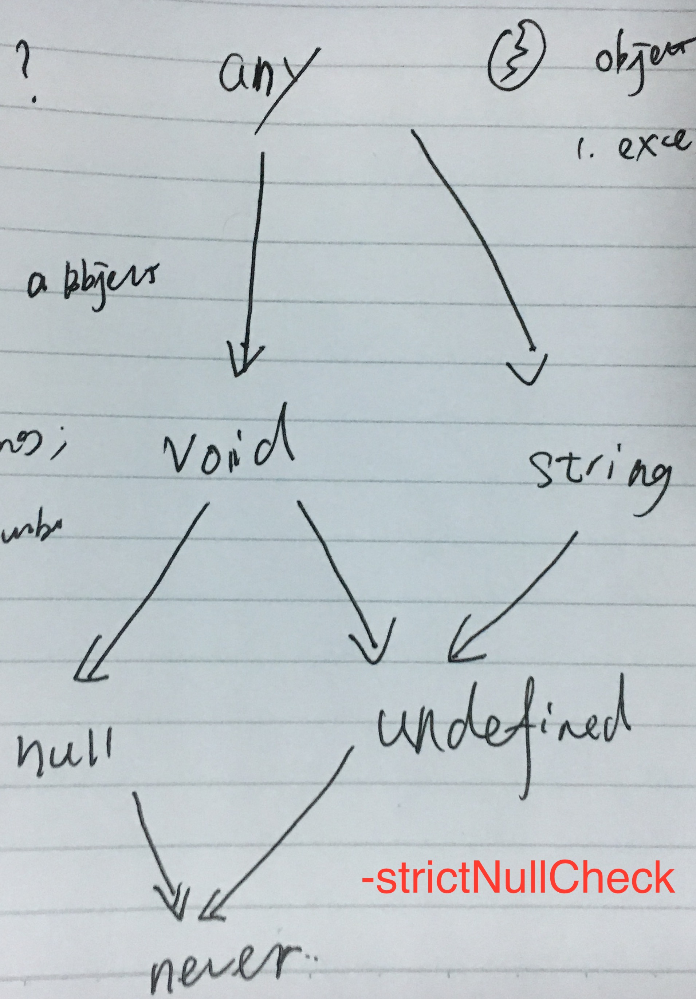

# Typescript

## terminology

Ambient

> We call declarations that don’t define an implementation “ambient”.

## Types

1. `any` is super type of any other type
1. `void` type is used as return type of function that doesn't returns. A variable of `void` can only accept `null` and `undefined` as its value.
1. `undefined` and `null` type are type with single valid value `undefined` and `null` respectively. And they are subtypes of normal type like `string`/`number` so that a variable of type `string` can accept `undefined` and `null`. However, when `strictNullCheck` option is enabled, this is not allowed.
1. `never` type is the return type of function when function throws exception or never ends (dead loop), `never` type is subtype of any other type.



## Interface

Interface `SquareConfig` specifies `color` property as optional, so object literal is actually compatible with `SquareConfig`. But it's probably that object literal property `colour` is a misspell instead of intentional naming. So when object literals are used, every property of object literal is checked against target type to avoid careless like typos below and this is called **excess property checks**.

```ts
interface SquareConfig {
    color?: string;
    width?: number;
}

function createSquare(config: SquareConfig): { color: string; area: number } {
    // ...
}

let mySquare = createSquare({ colour: "red", width: 100 });

// to fix this use a variable instead of object literal
var object = { colour: "red", width: 100 }
let mySquare = createSquare(object)

// or type casting
let mySquare = createSquare({ colour: 'red', width: 100} as SquareConfig)
```

Function Type, Property Type and Indexable Types

```ts
interface Test {
  (name: string): string; // function type as normal function call
  new (gender: boolean): string;  // function type as constructor call

  readonly name?: string; // property declaration

  // 1. indexable type that describes required type of all object properties
  // 2. single property declaration must be compatible with indexable property
  // 3. indexable property of number type must be compatible with indexable property of string type,
  //    because javascript treats number property as internally.
  [prop: number]: string;
  [prop: string]: string;
}
```

Class has two side of types.

1. instance side - all instance class properties including instance class functions
1. static side - all static class properties including class constructor

Class extending interface will only checks **instance side** of class **public properties** against target interface. Static side of class must be checked intentionally.

```ts
interface ClockConstructor {
    new (hour: number, minute: number): ClockInterface;
}
interface ClockInterface {
    tick();
}

function createClock(ctor: ClockConstructor, hour: number, minute: number): ClockInterface {
    return new ctor(hour, minute);
}

class DigitalClock implements ClockInterface {
    constructor(h: number, m: number) { }
    tick() {
        console.log("beep beep");
    }
}
class AnalogClock implements ClockInterface {
    constructor(h: number, m: number) { }
    tick() {
        console.log("tick tock");
    }
}

let digital = createClock(DigitalClock, 12, 17);
let analog = createClock(AnalogClock, 7, 32);
```

## Class

A common pattern that constructor receives a parameter and use it to initialize a class property instantly.

```ts
class Octopus {
  name: string;
  readonly numberOfLegs: number = 8;

  constructor(theName: string) {
    this.name = theName;
  }
}
```

Parameter property is shorthand syntax for this common pattern, constructor parameter prefixed with accessibility modifier (`public/protected/private`) or `readonly` or both is a parameter property. It's same as declaring a class property of same name and initializes it manually in constructor.

```ts
class Octopus {
    readonly numberOfLegs: number = 8;
    constructor(readonly name: string) {
    }
}
```

Class declarations in typescript creates two things.

1. An type that describes instance object of class
1. A function object that is the constructor of this class, use `new Constructor()` to create class instance.

## Function

```ts
function mix(first: string, second: number = 1, third?: boolean, ...rest: string[]): void {}
// Function signature
(first:string, second:number, third?: boolean, rest: string[]) => void

// default parameter after all required parameter optional
// default parameter before any required parameter is required
function defaultAtLast(first:string, last: number = 1) : void {}
(first: string, last?: number) => void


// use this parameter as first to specify type of `this` in function
function f(this: void) {
  // make sure `this` is unusable in this standalone function
}

interface Callback {
  (this: EventTarget):  void;
}

addEventListener('click', callback: Callback)

// new () => string specifies c is a constructor returning string
function create(c: new() => string): string

```

## Generic

```ts
function create<T>(c: {new(): T; }): T {
    return new c();
}
```

## Enum

Enum value can be number or string, and it's value must be able to determined in compile time.

```ts
enum Direction {
  Left,   // first enum value is considered 0 if value not specified
  Right,  // other enum value will be 1 plus preceding enum value
}
```

When all enum values are constant enum members initialized to

1. number literal (maybe prefixed with unary sign `-`/`+`)
1. string literal

Each enum member becomes a type and enum itself becomes a union type of all enum members.

```ts
enum ShapeKind {
    Circle,
    Square,
}

interface Circle {
    kind: ShapeKind.Circle;
    radius: number;
}

interface Square {
    kind: ShapeKind.Square;
    sideLength: number;
}

let c: Circle = {
    kind: ShapeKind.Square,
    //    ~~~~~~~~~~~~~~~~ Error!
    radius: 100,
}
```

Integer enum members have reverse mapping, which maps from value to numeric key.

```ts
enum Enum {
    A
}
let a = Enum.A;
let nameOfA = Enum[a]; // "A"
```

Enum is compiled as an actual object, so it may be passed around as an normal variable.

```js
var Enum;
(function (Enum) {
    Enum[Enum["A"] = 0] = "A";
})(Enum || (Enum = {}));
var a = Enum.A;
var nameOfA = Enum[a]; // "A"
```

Const enums can only use constant enum expression and are removed completely during compilation. Any use of const enum members are inlined (replace with corresponding constant value).

```ts
const enum Directions {
    Up,
    Down,
    Left,
    Right
}

let directions = [Directions.Up, Directions.Down, Directions.Left, Directions.Right]
```

Uninitialized enum `B` is considered as computed and it's value is not calculated from previous enum value since ambient enums are declared to describe existed enums.

```ts
declare enum Enum {
  A = 1,
  B,
  C = 2
}
```

## Type Compatibility


## 模块和命名空间

### 术语变化

模块（Module)和命名空间（namespace）在Typescript1.5之前叫做外部模块（External Module）和内部模块（Internal Module）。

```ts
// > ts 1.5
namespace X {}

// <= ts 1.5
module X {}
```

### 模块

[模块](https://www.typescriptlang.org/docs/handbook/modules.html)用来将一组变量、函数、类和接口等**聚合**且**封闭**在一个作用域内，从而不与其他模块冲突。ts将一个具有顶层`import`/`export`语句的代码文件认为是一个模块，否则该文件被认为是存在全局范围（global），文件内的所有对象可以在任何地方被引用。

模块内部使用`export`语句导出变量、函数、类、接口等定义，供其他模块使用。

```ts
// export declaration 声明语句前直接使用`export`导出：
export interface StringValidator {
    isAcceptable(s: string): boolean;
}

// export statements 单独的导出语句，可以重命名
export { Random }
export { Random as rand}

// reexport 对导入的模块中内容重新导出
export { Random } from './math'
export { Random as rand } from './math'
export * from './math'  // 一次性导出所有内容

// 默认导出，在模块只需要导出一个对象时使用
export default Math
```

使用`import`导入从其他模块中导入对象到当前模块。

```ts
// 导入一个对象
import { Random } from './math'
import { Random as rand } from './math'

// namespaced import 所有对象导入到一个命名空间下
import * as Math from './math'

// default import 默认导入，必须配合默认导出使用
import math from './math'

// 副作用导入，导入模块不引用任何模块中的对象，而是为了模块副作用生效
import './math'
```

#### import/export assignment

Common JS和AMD中使用`exports`对象进行导出，使用`exports = something`和`module.exports = something`对导出对象整体进行设置，效果和ES Module中的默认导出一致，但是这两种语法不相互兼容。ts提供了`export =`和`import = required()`语法来对应到Common JS和AMD的默认导出。

在编译选项`module`是`es6`时不能使用`export =`和`import = required()`语句，会报语法错误。

#### optional module loading

从模块中导入对象只在类型声明中使用的话，ts只使用了对象的类型信息，这时模块不会被真的导入，也不会生成对应的导入语句。

#### Ambient Module

为了给使用js编写的库提供类型信息，可以用`declare module`语法声明模块中对象的类型信息，每个模块的类型定义信息通常定义于`.d.ts`文件。使用`/// <reference path="node.d.ts"/>`（Triple Slash）引用`.d.ts`文件即可在当前文件中引入该模块的类型定义信息。

只声明模块而不包含任何类型声明时，从该模块引入的任何对象类型都是`any`。

```ts
// Shorthand Ambient modules
declare module "hot-new-module";
```

模块名称可以包含**通配符**，用来对一类（前缀或者后缀限定）的文件提供类型声明。例如`.jpg`文件被导入时，是一个有`src`属性的对象。

```ts
declare module '*.jpg' {
  const src: string;
  export default src;
}
```

UMD模块既可以当成全局使用，也可以作为模块使用，但二者能同时成立。模块定义如下：

```ts
export function isPrime(x: number): boolean;
export as namespace mathLib;
```

在另一个模块文件中使用

```ts
import { isPrime } from "math-lib";
isPrime(2);

// 错误：模块内不能使用全局定义
mathLib.isPrime(2);
```

在全局环境（不包含`import`/`export`的js文件）只能使用全局定义。

```js
mathLib.isPrime(2);
```

### 模块解析

### 命名空间

[命名空间](https://www.typescriptlang.org/docs/handbook/namespaces.html)用来将逻辑上相关的一组变量、类、接口等聚合在一起，放到同一个命名空间下。命名空间内的变量通常只在该命名空间下可见，在外部使用同样要用`export`进行导出。

命名空间通常在**全局模块**下使用，可以位于同一个源文件也可以分散在多个源文件中，文件之间的依赖关系使用Triple Slash引用表示。默认情况下ts会为属于同一个命名空间的多个.ts文件生成对应一一对应的.js文件，由于.ts文件之间存在依赖关系，所以在.html文件中引入多个.js文件时需要将被依赖的文件放在前面。通过`--outFile`参数可以指定将结果输出到一个js文件中。

命名空间被编译成一个普通的js对象，该对象上的属性对应了命名空间中导出的类、变量、函数。命名空间实际上就是一个普通的Javascript全局对象。

在一个模块文件中使用的命名空间不会突破模块的范围，因此跨多个模块的同名命名空间是独立的，不会被自动合并在一起。但是在一个模块文件内多个位置使用相同的命名空间，这些不同的定义是会被合并在一起的。因为模块本身有命名空间所具有的封装的作用，所以模块内部通常不使用命名空间。在模块功能较多需要隔离的时候更倾向拆分为多个模块而不是使用命名空间。

只有在**全局模块**下才使用命名空间进行隔离，因为全局空间不对应具体的某个文件，这时只能使用命名空间而没法使用模块。

典型的在模块文件中使用命名空间的错误做法：

```ts
// 在一个模块文件中将所有内容包含在一个命名空间中，模块本身有一层封装，命名空间Foo又添加了一层（重复且无用）
export namespace Foo {}

// 多个模块文件中，命名空间Foo不会被合并
export namespace Foo {}
```

命名空间可以方便的为一些暴露**全局对象**的三方库添加类型定义，例如D3。

```ts
declare namespace D3 {
    export interface Selectors {
        select: {
            (selector: string): Selection;
            (element: EventTarget): Selection;
        };
    }

    export interface Event {
        x: number;
        y: number;
    }

    export interface Base extends Selectors {
        event: Event;
    }
}

declare var d3: D3.Base;
```

### 别名

别名（alias）使用`import q = x.y.z`可以为命名空间或者模块中导出的对象起一个别名，方便使用。
