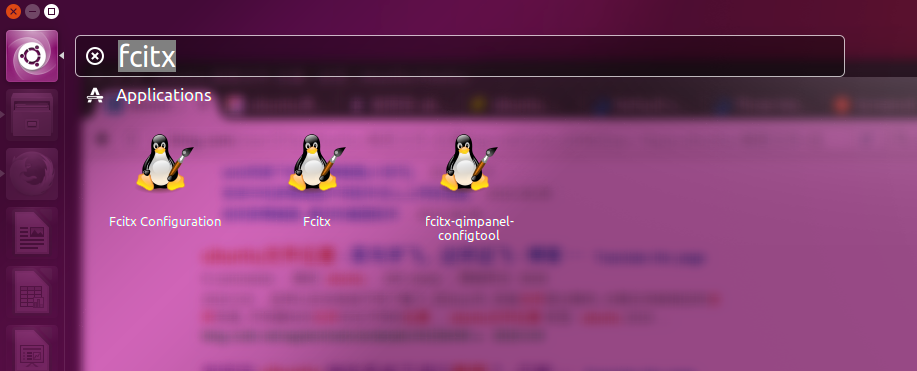
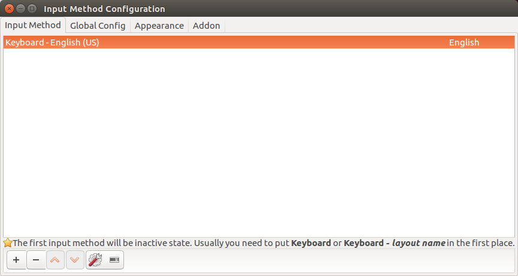
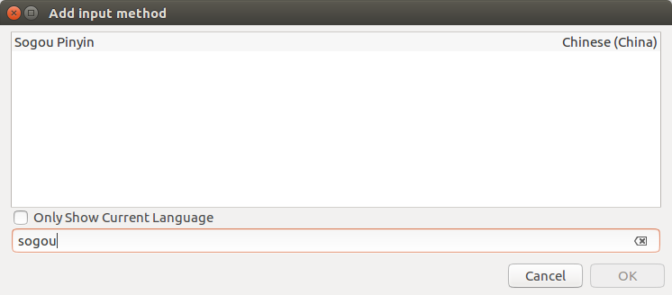

# Ubuntu

## Installation

One 120G SSD, 1T HDD, 8G memory, partition only on SSD. Partition will clear all data on drives, so don't do this on hard drive where your information is stored.

/boot 1G main
/EFI  1G logic
/swap 8G logic
/other main

### Setup Source

1. add source to file `/etc/apt/sources.list`.
    ```bash
    deb http://mirrors.aliyun.com/ubuntu/ xenial main restricted universe multiverse
    deb http://mirrors.aliyun.com/ubuntu/ xenial-security main restricted universe multiverse
    deb http://mirrors.aliyun.com/ubuntu/ xenial-updates main restricted universe multiverse
    deb http://mirrors.aliyun.com/ubuntu/ xenial-backports main restricted universe multiverse
    # test
    deb http://mirrors.aliyun.com/ubuntu/ xenial-proposed main restricted universe multiverse
    # source code
    deb-src http://mirrors.aliyun.com/ubuntu/ xenial main restricted universe multiverse
    deb-src http://mirrors.aliyun.com/ubuntu/ xenial-security main restricted universe multiverse
    deb-src http://mirrors.aliyun.com/ubuntu/ xenial-updates main restricted universe multiverse
    deb-src http://mirrors.aliyun.com/ubuntu/ xenial-backports main restricted universe multiverse
    # test
    deb-src http://mirrors.aliyun.com/ubuntu/ xenial-proposed main restricted universe multiverse
    # Canonical
    deb http://archive.canonical.com/ubuntu/ xenial partner
    deb http://extras.ubuntu.com/ubuntu/ xenial main
    ```
1. update source configuration
    ```bash
    sudo apt-get update
    ```

### Sougou Pinyin

1. Download "sogoupinyin_2.1.0.0086_amd64.deb" from [here](http://pinyin.sogou.com/linux/help.php).
1. Install using command.
    ```bash
    sudo dpkg -i sogoupinyin_2.1.0.0086_amd64.deb
    # update depenendcy if installation failed and reinstall
    sudo apt-get install -f
    ```
1. Configure fcitx from "System Settings->Language Support->Keyboard->Input method system".

    

1. Click on screen top left to search and open `fcitx configuration` . Click '+' button, search and add sougou pinyin, toggle off only show current language.

    
    
    

1. Set switching input method shortcut using `Ctrl+Space`.
    1. Sougou uses fcitx configuration for shortcut configuration.  Use `shift` by default to switch input method, toggle it off in sougou configuration.
    1. ibus clashes with fcitx, so set it as another shortcut (like `Ctrl+Alt+Space`) in System -> Text Entry -> Switch to next source.

### Renamed Mounted Drives

1. Use Ubuntu Dash to search and open "Disks" tool.
1. Select target drive and unmount it, click "Edit Filesytem..." for editing.

### Desktop Applications

Installed apps are located at `/usr/share/applications`, copy needed one to desktop.

### Lantern

1. Download latest "lantern-installer-64-bit.deb" from github lantern repository.
1. Use command line.
    ```bash
    sudo dpkg -i lantern-installer-64-bit.deb
    ```
1. Search and pin lantern to task bar.

### Firefox Flash Plugin

1. Download "flash_player_npapi_linux.x86_64".
1. Use commands.
    ```bash
    # uncompress
    tar -zxvf install_flash_player_11_linux.x86_64.tag.gz

    # copy files
    cp libflashplayer.so /usr/lib/mozilla/plugins

    # copy files
    cp -r ./usr/* /usr
    ```
1. Restart firefox.

### Chrome

1. Download "google-chrome-stable_current_amd64.deb".
1. Use command.
    ```bash
    sudo dpkg -i google-chrome-stable_current_amd64.deb

    # install flash plugins
    sudo apt-get install pepperflashplugin-nonfree
    sudo apt-get install adobe-flashplugin
    ```

### Teamviewer

1. Download "teamviewer_12.0.76279_i386.deb".
1. Use command `sudo dpkg -i teamviewer_12.0.76279_i386.deb`.

### Java

#### JDK

1. Download latest Java SE Development Kit from [site](http://www.oracle.com/technetwork/java/javase/downloads/index.html). If you need previous version check Java Archive at the bottom of this page. Follow download link and you can see all previous versions, choose the one you need.
1. Decompress installation package with command `tar -zxvf jdk-8u91-linux-x64.tar.gz`.

#### Intellij IDEA

1. Download "ideaIU-2016.2.tar.gz".
1. Use commands.
    ```bash
    tar -zxvf ideaIU-2016.2.tar.gz

    # run installation script
    ./bin/idea.sh

    # add '{installtion home}/bin' to environment 'PATH'
    ```

### Netease Cloud Music

1. Download "netease-cloud-music_0.9.0-2_amd64.deb".
1. Use commands.
    ```bash
    sudo dpkg -i netease-cloud-music_0.9.0-2_amd64.deb

    # update dependencies and reinstall
    sudo apt-get install -f
    ```

### VLC

```bash
sudo apt-get install vlc
sudo apt-get -f install
```

### Graphviz

```bash
sudo apt-get install graphviz graphviz-doc
sudo apt-get install -f

# help info
dot -h
```